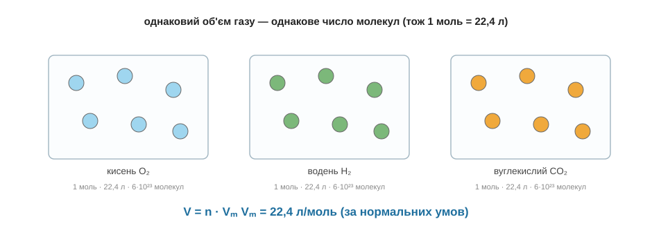

# Об'єм газу

Доти ми переходили від речовини до молів через масу — зважили й поділили на M. Та з газом так робити незручно: спробуй-но зважити повітря чи водень. Газ куди легше виміряти не вагою, а **об'ємом** — скільки літрів він займає. І тут хімію виручає напрочуд гарний факт.

Ще Авогадро завважив: однакові об'єми будь-яких газів за однакових умов містять **однакову кількість молекул**. Дивно, але байдуже, важкі ті молекули чи легкі, — у газі вони розкидані так рідко, що значення має лише, скільки їх, а не які вони. А якщо так, то один моль (тобто та сама «пачка» з 6·10²³ частинок) будь-якого газу займає той самий об'єм. За нормальних умов цей об'єм виміряли — він дорівнює **22,4 літра на моль**, і його називають молярним об'ємом Vₘ. Звідси формула, така ж проста, як n = m/M, тільки замість маси — об'єм:

```
V = n · Vₘ        Vₘ = 22,4 л/моль (за нормальних умов)

V   — об'єм газу, літри
n   — кількість речовини, молі
Vₘ  — молярний об'єм, 22,4 л/моль
```


*Рис. 6.4.1-1. Однаковий об'єм різних газів містить однакове число молекул, тож моль будь-якого газу займає 22,4 літра.*

Користуватись нею так само легко в обидва боки. Який об'єм займуть 2 молі газу? V = 2 · 22,4 = 44,8 літра. А скільки молів газу в балоні на 11,2 літра? Виражаємо навпаки: n = V / Vₘ = 11,2 / 22,4 = 0,5 моля. Спробуй сам: який об'єм займе 0,5 моля будь-якого газу за нормальних умов?.. V = 0,5 · 22,4 = 11,2 літра. Тепер, до речі, у розрахунку за рівнянням можна на останньому кроці переходити не до грамів, а до літрів, якщо шукана речовина — газ: просто замість m = n·M береш V = n·Vₘ.

> 🏠 Тому гази й продають та міряють літрами чи кубометрами, а не кілограмами: для газу об'єм — це майже пряма лічба молекул.
