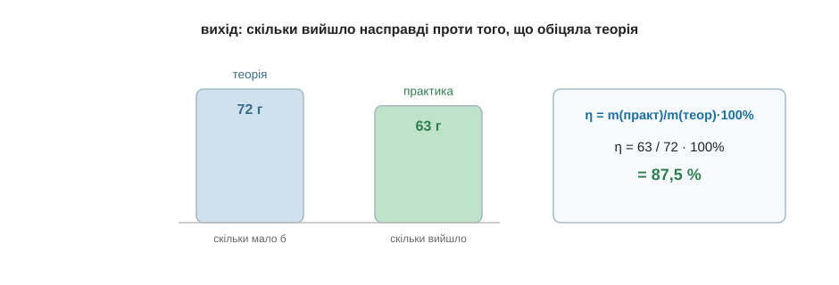

# Вихід продукту

І останній підступ — найчесніший. У минулому розділі ми порахували, що з 8 грамів водню має вийти 72 грами води. Але якби ти справді провів цю реакцію в колбі й зважив воду, її майже напевно виявилося б менше — скажімо, 63 грами. Куди ж поділася решта? Нікуди не зникла за законом збереження маси — просто частина не встигла прореагувати, щось лишилося на стінках, щось випарувалося. Реальність майже завжди трохи скупіша за теорію.

Щоб виміряти цю скупість, порівнюють те, що вийшло насправді, з тим, що обіцяла теорія, — і це знову проста частка, як у розділі про масову частку. Її називають **виходом** і позначають η («ета»):

```
η = m(практ) / m(теор) · 100%

η         — вихід, %
m(практ)  — маса, яку реально отримали
m(теор)   — маса, яку обіцяв розрахунок за рівнянням
```

Для нашої води: η = 63 / 72 · 100 % ≈ 87,5 %. Тобто реакція віддала майже дев'ять десятих обіцяного — для хімії дуже непогано. Працює формула й навпаки: якщо знаєш, що вихід зазвичай 80 %, а теорія обіцяє 50 грамів, то реально готуйся отримати m(практ) = 0,8 · 50 = 40 грамів. Спробуй сам: теорія дає 200 грамів, а вихід вийшов 90 % — скільки грамів продукту ти отримав?.. m(практ) = 0,9 · 200 = 180 грамів.


*Рис. 6.4.3-1. Вихід — це частка від обіцяного теорією: реально отримана маса, поділена на теоретичну.*

---

Ось і все. Озирнися на пройдений шлях — він був неблизький. На першій сторінці слово «молекула» ще нічого для тебе не важило; а тепер ти знаєш, з чого зроблено світ, чому атоми з'єднуються, як речовини перетворюються одна на одну, чому горить вогонь і чому скисає вино, — і на додачу вмієш це порахувати. Шість модулів: від заряду в атомі до формул, якими розв'язують задачі. Уся «велика» шкільна хімія тепер для тебе не темний ліс, а знайома місцевість, лише з суворішими вивісками.

Тож наостанок — кілька щирих порад, як іти далі. Перша: розв'язуй і пиши рукою, бо самим читанням ні формули, ні хімію не опануєш — зрівноваж кілька рівнянь, порахуй кілька задач на моль, і вони сядуть міцніше за будь-яке перечитування. Друга: завжди питай «чому» аж до атомів, а коли відповідь не дається — чесно познач це місце й рушай далі, бо дещо в хімії спершу беруть на віру. Третя: роби кухонні досліди з цієї книги — хай хімія лишиться для тебе живою, а не паперовою. І четверта, найголовніша: не бійся формул і чисел. Ти щойно пройшов цілий модуль розрахунків і бачив на власні очі, що за кожною формулою стоїть проста, зрозуміла думка, а будь-яка «страшна» задача розбирається на кілька чесних кроків.

На цьому я прощаюся. Ти прийшов сюди, нічого не знаючи, — а йдеш із картою цілої науки в руках; усе інше тепер лягатиме на неї саме. Щасти тобі.

> 💡 **Що про це скаже великий підручник.** Усе з цього модуля там зветься хімічними розрахунками, а наука про кількісні відношення в реакціях — стехіометрією. Шукай слова «кількість речовини й моль», «молярна маса», «молярний об'єм» (та закон Авогадро з його 22,4 л), «масова частка», «реагент у надлишку та нестачі» і «вихід продукту реакції» — за кожним із цих поважних термінів стоїть рівно та формула, якою ти вже вмієш користуватися.
