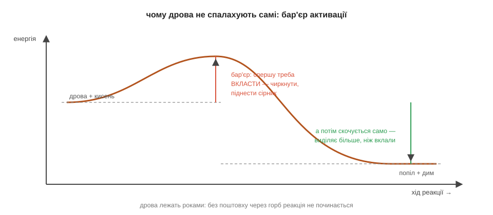

# Енергія реакцій

Звичайний сірник може місяцями спокійно лежати в коробці, і нічого з ним не діється. Та варто чиркнути ним об коробку — він спалахує, та ще й помітно гріє пальці. Тут одразу дві загадки, варті того, щоб у них розібратися. Звідки в такій крихітній паличці враз береться стільки тепла? І, що не менш дивно, чому це тепло не виривалося саме собою весь той час, поки сірник просто лежав?

Почнімо з тепла — і вся розгадка ховається в самій природі хімічного зв'язку. Зв'язок — це таке розташування електронів, з якого атомам невигідно виходити, бо разом їм спокійніше, ніж нарізно. А отже, щоб зв'язок **розірвати**, треба прикласти енергію — так само, як треба докласти зусиль, щоб силоміць розчепити двох, хто міцно тримається за руки.

> 🔗 Хімічний зв'язок тримається на спільних електронах: атоми сходяться так, що разом їм енергетично вигідніше, ніж поодинці, — і саме тому розчепити їх коштує енергії. [читати](book:chemistry/why-bond) І навпаки: коли атоми **утворюють** новий зв'язок, вони сходяться у вигідніше, спокійніше положення, а зайву енергію при цьому віддають назовні. Тож будь-яка реакція — це по суті проста бухгалтерія з двох дій: спершу ми розриваємо старі зв'язки (а це витрата енергії), а потім будуємо натомість нові (а це вже прибуток).

І вся сіль — у різниці між цією витратою і прибутком. Якщо нові зв'язки віддали **більше** енергії, ніж її з'їло розривання старих, то надлишок мусить кудись подітися — і він виходить назовні теплом та світлом. Такі реакції, що гріють довкілля, називають **екзотермічними**: це й горіння, і хімічна грілка для рук, і навіть тихе тепло власного тіла. А якщо навпаки — нові зв'язки повернули **менше**, ніж забрало розривання старих, — то реакції енергії не вистачає, і вона добирає її ззовні, вихолоджуючи все навколо. Такі реакції звуть **ендотермічними**, і на них працює, скажімо, аптечний охолодний пакет, що сам собою стає крижаним, коли його зім'яти. Тепер зрозуміла й перша наша загадка: сірник спалахує так гаряче саме тому, що горіння — це глибоко екзотермічна реакція, у якій нові зв'язки виявляються куди вигіднішими за старі, і різниця щедро виходить теплом.

Лишилася друга загадка, хитріша: якщо тепла в сірнику стільки, чому ж воно не виходило само? А тому, що спершу хтось мусить **заплатити наперед** — за розривання найперших зв'язків. Поки молекули пального й кисню цілі, реакція не почнеться сама: між станом «спокійно лежить» і станом «горить» стоїть невеликий, але справжній енергетичний поріг, який називають **бар'єром активації**. Це та порція енергії, яку треба вкласти, щоб зрушити перші зв'язки з місця й запустити перетворення. Чиркання сірника якраз і дає цей перший внесок — теплом від тертя. А далі реакція, розпочавшись, уже сама виділяє стільки тепла, що його з лишком вистачає підпалити сусідні молекули, ті — наступні, і вогонь біжить далі без жодної сторонньої допомоги. Ось чому дрова можуть спокійно пролежати роками: енергії в них повно, але без поштовху через бар'єр вона лишається замкненою. Підпалити — це зовсім не означає «влити весь жар»; це лише підштовхнути перші молекули вгору, на вершину бар'єра, звідки вони вже скотяться самі.

Спробуй розкласти по цих поличках знайому пару речей. Хімічна грілка, тріснеш її — і вона тепла; охолодний пакет зімнеш — і він крижаний. Котра з них екзотермічна, а котра ендотермічна, і в котрій нові зв'язки віддали більше енергії, ніж забрало розривання старих?.. Грілка — екзотермічна: нові зв'язки в ній вигідніші, надлишок виходить теплом. А пакет — ендотермічний: там навпаки, реакції бракує енергії, і вона висмоктує її з довкілля, тобто з твоєї руки, від чого та й мерзне.

*Рис. 3.2.1-1. Розірвати старі зв'язки — вкласти енергію, утворити нові — вивільнити; знак різниці й вирішує, гріє реакція (екзо) чи холодить (ендо).*

*Рис. 3.2.1-2. Спершу треба піднятися на бар'єр — це і є «чиркнути»; за ним реакція скочується сама, віддаючи куди більше, ніж коштував підйом.*

> 📜 Перші сірники народилися з чистого випадку. У 1826 році англійський аптекар Джон Вокер мішав якусь суміш у ступці, а коли чиркнув обмазаною нею паличкою об підлогу, щоб збити налиплу грудку, — та раптом спалахнула. Вокер збагнув, що тертя дає рівно той поштовх через бар'єр, якого доти бракувало, і почав продавати свої «тертяні вогники». Патентувати винахід він відмовився, вважаючи його надто корисним для людей, щоб привласнювати, — тож добре на ньому заробили інші. Сучасні безпечні сірники з'явилися пізніше, але працюють на тому самому: голівка чиркає, тертя долає бар'єр активації — а далі екзотермічне горіння робить усю решту роботи.

> 🏠 Газова плита теж не спалахує сама — її підпалює іскра від п'єзозапальнички, і це той самісінький поштовх через бар'єр, що й чиркання сірника.
