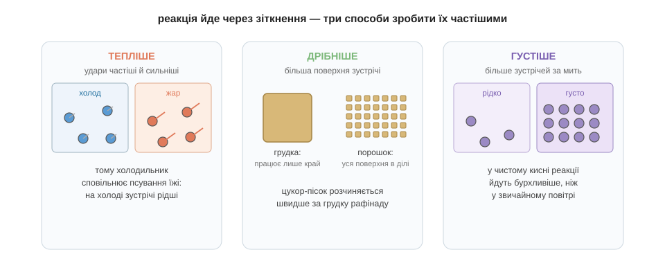

# Швидкість реакції

Отже, молоко на теплій кухні скисає за день, а в холодильнику тиждень лишається свіжим. Реакція скисання та сама — то чому ж надворі вона біжить, а на холоді ледь повзе? Щоб навчитися керувати швидкістю реакцій — а це вміння рятує і молоко, і життя, — спершу треба зрозуміти, від чого та швидкість узагалі залежить.

Повернімося до самої суті реакції: атоми міняють партнерів. Але щоб партнерів поміняти, молекули мусять спершу **зустрітися** — просто-таки зіткнутися одна з одною. Причому не легенько торкнутися, а вдаритися досить сильно, щоб подолати той бар'єр активації, про який ми говорили в попередньому розділі. Слабкий, млявий дотик нічого не дасть: молекули просто відскочать неушкодженими, як два м'ячики. Виходить, що швидкість реакції — це, по суті, частота **вдалих зіткнень**: скільки разів за секунду молекули встигають вдаритися одна об одну досить сильно, щоб перебудуватися. А раз так, то й розгадка проста: усе, що робить ці зіткнення частішими або сильнішими, реакцію пришвидшує. Звідси випливають три прості важелі, якими можна крутити швидкість.

Найперший важіль — **температура**. Що гарячіше, то швидше рухаються молекули, а отже, вони і стикаються частіше, і б'ються при цьому сильніше — тож через бар'єр перескакує куди більше зустрічей. Ось і вся розгадка молока: холодильник зовсім не спиняє скисання, він лише вповільнює його, бо на холоді молекули мляві й зустрічі між ними рідші. На цьому, власне, тримається вся кухонна логіка зберігання їжі: морозилка майже до зупинки гальмує реакції псування, а тепла кухня, навпаки, їх розганяє.

Другий важіль — **подрібнення**, і він стосується твердих речовин. Якщо одна з речовин тверда, то реакція може йти лише на її поверхні: молекули, замкнені всередині грудки, ні з ким не стикаються, бо до них просто не дістатися. Але варто розтерти ту грудку на дрібний порошок — і вся захована досі маса раптом опиняється на поверхні, відкрита для зіткнень. Саме тому цукор-пісок розчиняється в чаї помітно швидше за грудку рафінаду, а дрібно настругані тріски займаються легше за товсту колоду. Цей важіль інколи спрацьовує аж занадто: спробуй здогадатися, чому мішок борошна на складі цілком безпечний, а ось дрібний борошняний пил, здійнятий у повітря, може спалахнути вибухом?.. Бо в пилюці кожна найдрібніша часточка борошна з усіх боків відкрита кисню — площа зустрічі стає велетенською, і повільне «горіння» хлібини обертається миттєвим спалахом усієї хмари.

Третій важіль — **концентрація**, тобто наскільки густо напхані молекули, що мають реагувати. Що їх більше в тому самому об'ємі, то частіше вони натикаються одна на одну, то більше виходить зустрічей за секунду. Саме тому в чистому кисні все горить набагато бурхливіше, ніж у звичайному повітрі, де кисню лише п'ята частина, а решту становить байдужий до горіння азот, який тільки заважає зустрічам.

Усі три важелі, хоч і різні на вигляд, крутять насправді одне й те саме коліща — частоту вдалих зіткнень. Але існує ще й четвертий спосіб розігнати реакцію, найхитріший з усіх: він не чіпає ні температури, ні густоти, а діє зовсім інакше — **знижує сам бар'єр**. Цьому дивовижному способу й присвячена наступна тема.

*Рис. 3.3.1-1. Тепліше — удари частіші й сильніші; дрібніше — більша поверхня зустрічі; густіше — більше зіткнень за мить. Усі три важелі збільшують частоту вдалих зіткнень.*

> 🏠 Холодильник і морозилка — це, по суті, сповільнювачі хімії: вони не вбивають реакції псування, а лише роблять зустрічі молекул рідшими, і їжа псується повільніше.
