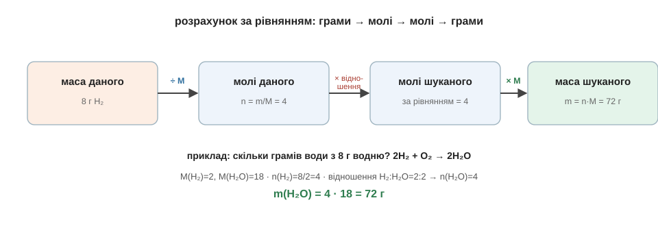

# Стехіометрія

Тепер зберемо все докупи. У справжній задачі тобі дають не молі, а грами однієї речовини й питають грами іншої — бо саме грами можна зважити. І ось тут багатьом здається, що почалася магія. Насправді ж розрахунок завжди йде тим самим ланцюжком із чотирьох ланок, і кожну ланку ми вже проходили окремо: грами → молі → молі → грами.

Логіка проста. Рівняння розмовляє в молях, а нам дано грами — отже, спершу переведемо дане в молі (формулою n = m/M). У молях скористаємось пропорцією за рівнянням і дізнаємось молі шуканого. А тоді переведемо ці молі назад у грами (формулою m = n·M), бо відповідь потрібна у вазі. Перша й остання ланки — це той самий трикутник m–n–M, середня — пропорція з попередньої теми.

Пройдімо це на одному прикладі, повільно. Скільки грамів води утвориться, якщо спалити 8 грамів водню? Рівняння те саме: 2H₂ + O₂ → 2H₂O.

```
рівняння:        2H₂ + O₂ → 2H₂O
молярні маси:    M(H₂) = 2 г/моль,  M(H₂O) = 18 г/моль

1) грами → молі:    n(H₂) = m/M = 8 / 2 = 4 молі
2) молі → молі:     відношення H₂ : H₂O = 2 : 2 = 1 : 1
                    отже n(H₂O) = 4 молі
3) молі → грами:    m(H₂O) = n · M = 4 · 18 = 72 г
```

Відповідь: 72 грами води. Озирнися на розв'язок — у ньому немає жодного незрозумілого кроку: ми зважили водень, формулою перевели його в молі, рівнянням знайшли молі води, формулою перевели назад у грами. Той самий ланцюжок грами → молі → молі → грами працює майже в будь-якій задачі за рівнянням; міняються лише речовини, числа й відношення з коефіцієнтів.


*Рис. 6.3.2-1. Чотири ланки: масу даного переводимо в молі (÷M), за відношенням рівняння — у молі шуканого, тоді назад у масу (×M).*

Спробуй пройти цей ланцюжок самостійно на дрібнішому прикладі. Скільки грамів води вийде з 2 грамів водню в тій самій реакції?.. Крок за кроком: n(H₂) = 2 / 2 = 1 моль; відношення 1 : 1, тож n(H₂O) = 1 моль; m(H₂O) = 1 · 18 = 18 грамів. Вісімнадцять грамів — рівно один моль води, як і має бути. Ти щойно розв'язав «страшну» задачу за рівнянням, і нічого страшного в ній не виявилося.
