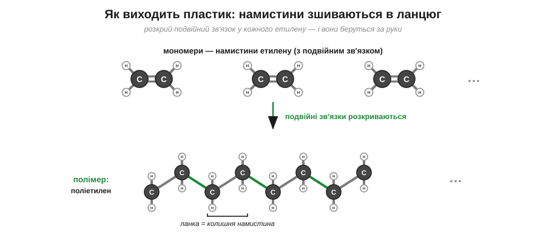

# Полімери

Поліетиленовий пакет важить майже нічого, а спробуй розірвати його руками — не так і легко; а викинутий, він пролежить у землі сотні років, переживши кількох власників. Що ж це за дивна річ — водночас така легка, така міцна й немовби безсмертна?

Розгадка — у тій самій запасній руці ненасиченої молекули, у її подвійному зв'язку, готовому розкритися. Уяви повну посудину однаковісіньких маленьких молекул, у кожної з яких є такий подвійний зв'язок (це етилен, він же етен, — хай він буде нашою «намистиною»). А тепер дай цій посудині поштовх — і подвійний зв'язок у кожної намистини розкривається, її звільнена рука хапає сусідню намистину, та своєю вільною рукою — наступну, і так тисячі намистин зчіплюються одна за одну в один велетенський ланцюг. Маленьку молекулу-намистину називають **мономером**, а готовий довжелезний ланцюг-намисто — **полімером**.

Саме так і робиться пластик. Ланцюг, зшитий із тисяч таких розкритих етиленів, називають **поліетиленом** — з нього й зроблено той самий пакет; «полі» означає «багато», а «етилен» — то назва самої намистини. Ось, виявляється, навіщо взагалі був потрібен подвійний зв'язок: він — та защіпка, якою намистини хапаються одна за одну. Інші намистини дають інші пластики, але задум скрізь один і той самий.

*Рис. 5.1.3-1. Подвійний зв'язок кожного етилену розкривається, і намистини зчіплюються в один довгий ланцюг — поліетилен.*

А з цих довжелезних ланцюгів самі собою випливають усі дивовижі пакета. Довгі ланцюги сплутуються й чіпляються один за одного по всій своїй довжині — тому пластик і міцний, і водночас гнучкий. Збудований він із легких Карбону та Гідрогену — тому майже нічого не важить. А найголовніше ось у чому, і над цим варто спинитися. Спитай себе: чому ж дерев'яна паличка в землі за рік зотліє, а пластиковий пакет лежатиме століттями?.. Бо свої власні ланцюги — деревину, листя, рештки — природа вміє різати спеціальними ферментами, тими самими «ножицями», про які ми говорили, коли йшлося про каталізатори в тілі. А таких довжелезних карбонових ланцюгів, як у пластику, природа ніколи доти не робила — і в жодного мікроба просто немає ножиць потрібної форми, щоб їх розрізати. Тому пластик і не гниє: його нема кому з'їсти.

*Рис. 5.1.3-2. Свої ланцюги природа вміє різати ферментами, а довгий карбоновий ланцюг пластику — ні, тому він і не гниє.*

Та сама незнищенність, яка робить пластик таким зручним, обертається й бідою. Раз його ніхто не з'їсть, пластик не можна просто викидати — його треба переробляти: розплавити й сформувати наново. А хіміки вже вчаться будувати такі ланцюги, у яких є спеціальні «надрізи», що їх мікроби таки беруть, — щоб пакет майбутнього вмів сам зотліти, відслуживши своє.

> 🏠 Майже все, що ми звемо «пластиком», — це полімери: пакет і плівка (поліетилен), пляшка (інший подібний ланцюг), пінопласт, капрон у колготках; усі вони — довгі намиста, зшиті з дрібних однакових намистин.
