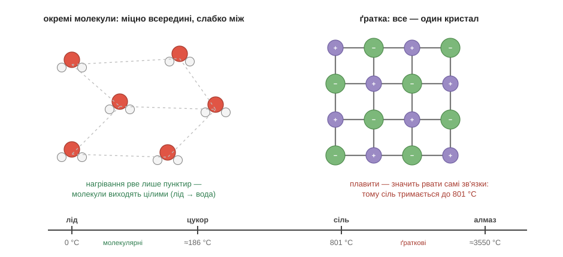

# Молекули чи ґратка

Озирнімося по кухні й знайдімо три білі тверді речовини: лід, цукор і сіль. На вигляд вони досить схожі — білі кристалики, та й годі. Але поводяться при нагріванні до смішного по-різному. Лід розтає просто в теплій долоні. Цукор у долоні не розтане, зате на сковорідці поплавиться в бурштинову карамель — десь біля ста вісімдесяти градусів. А сіль на тій самій сковорідці навіть не здригнеться: щоб її розплавити, потрібно аж вісімсот один градус, такого жару кухонна плита й близько не дає. Звідки така прірва між трьома схожими на вигляд порошками?

Розгадка ховається не в тому, **що** в них усередині, а в тому, **як** це всередині складене. І виявляється, що тверду речовину природа вміє збирати двома зовсім різними способами — варто розрізнити ці два способи, і вся загадка одразу розплутується.

Перший спосіб — скласти речовину з **окремих молекул**. Саме так збудовані лід і цукор. Усередині кожної молекули атоми тримаються міцно — справжніми ковалентними зв'язками, тими самими спільними парами електронів, про які ми вже говорили. Але самі молекули між собою зчеплені вже зовсім не так міцно: їх притягує одна до одної лише слабеньке зчеплення зарядженими кінцями — згадай полярні молекули води, оті крихітні магнітики, що липнуть плюсовим боком до мінусового. І ось у чому суть: щоб розплавити таку речовину, зовсім не треба рвати міцні зв'язки всередині молекул — досить легенько розхитати оте слабке зчеплення між ними. Самі молекули при цьому лишаються цілісінькі. Тому лід і тане так охоче, і тане він саме у воду — у ті самі неушкоджені молекули H₂O, які нікуди й не дівалися.

Другий спосіб — зовсім інший. Тут речовина зібрана не з окремих молекул, а як одна **суцільна ґратка**. Так збудовані сіль, алмаз і всі метали. Окремих молекул у них немає взагалі: весь кристал — це одна нескінченна конструкція, де кожен атом чи іон міцно тримається за всіх своїх сусідів повноцінними зв'язками. У солі це іонні обійми плюсів і мінусів, в алмазі — чотири ковалентні руки кожного Карбону, простягнуті на всі боки, у залізі — спільне море електронів. А тепер відчуй різницю: щоб розплавити таку ґратку, доводиться рвати вже не слабеньке зчеплення, а самі справжні зв'язки, бо нічого «слабенького» тут просто немає. Ось чому солі потрібні аж вісімсот з гаком градусів, а алмаз тримається до трьох з половиною тисяч.

Тут, до речі, остаточно прояснюється й та обіцянка з розділу про формули. Чому запис солі, NaCl, — це пропорція, а не молекула? Бо тепер видно: у суцільній ґратці немає жодної окремої «штучки солі», яку можна було б вийняти, — є лише нескінченне чергування іонів натрію й хлору один до одного. А формула алмазу й зовсім гранично коротка — просто C: нескінченний Карбон, зчеплений сам із собою.

Спробуй тепер скористатися цим сам, перш ніж читати далі. Уяви дві невідомі тверді речовини. Одна плавиться вже від тепла руки, друга — тверда, тугоплавка й крихка, потребує для плавлення печі. Як гадаєш, яка з них зібрана з окремих молекул, а яка — суцільною ґраткою?.. Звісно, перша — молекулярна (плавиться легко, бо рветься лише слабке зчеплення), а друга — ґраткова (тримається міцно, бо там самі справжні зв'язки). Бачиш, як зручно: про будь-яку тверду річ варто найперше спитати «ти з молекул чи ти ґратка?» — і сама відповідь уже передбачає її норов: легкоплавке й тендітне чи тугоплавке й міцне. А як саме з конструкції випливають усі решта властивостей — аж до того, чому з одного й того самого Карбону виходять і м'який грифель, і твердий діамант, — про це наступна, остання в модулі тема.

*Рис. 2.3.1-1. Зліва — окремі молекули зі слабким зчепленням (пунктир): нагрівання рве лише його, молекули лишаються цілими. Справа — суцільна ґратка зі справжніх зв'язків: щоб її розплавити, треба рвати самі зв'язки. Унизу — ціна питання в градусах.*

> 🏠 Шоколад тане просто в руці, бо він молекулярний і зчеплення між молекулами кволеньке; а сталева ложка не тане ніколи, бо вона — суцільна металічна ґратка.
