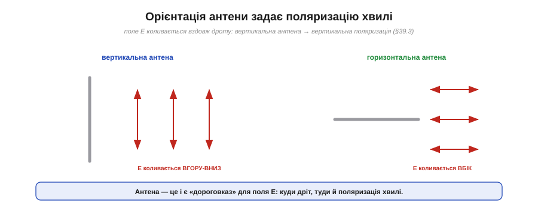
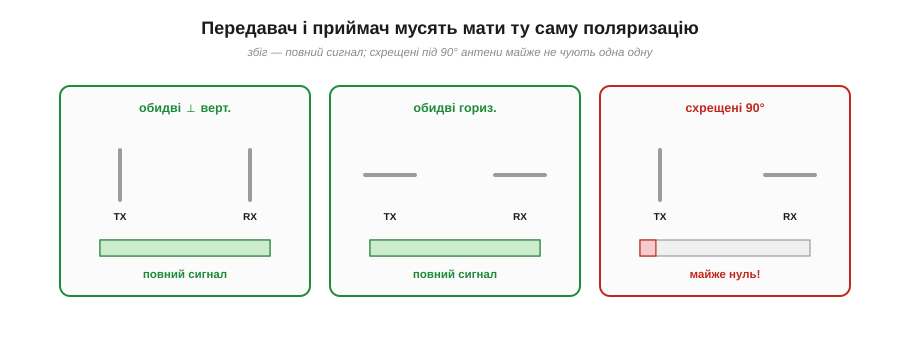
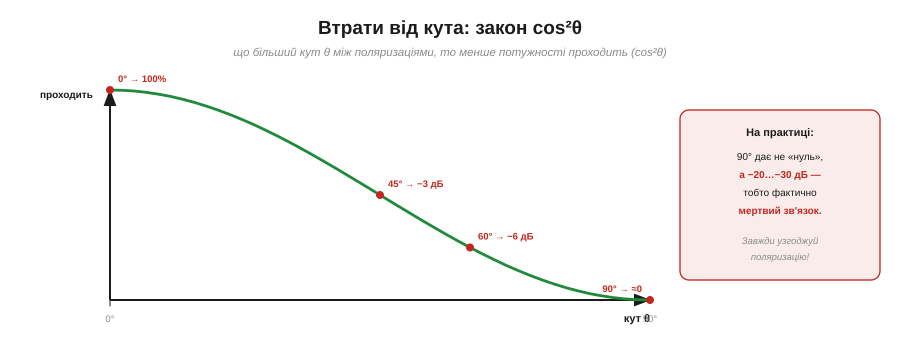
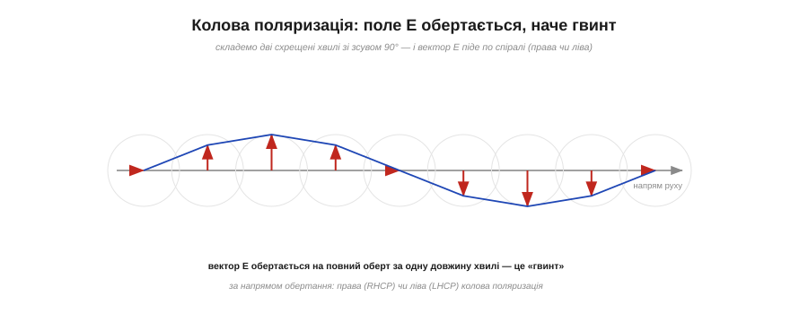
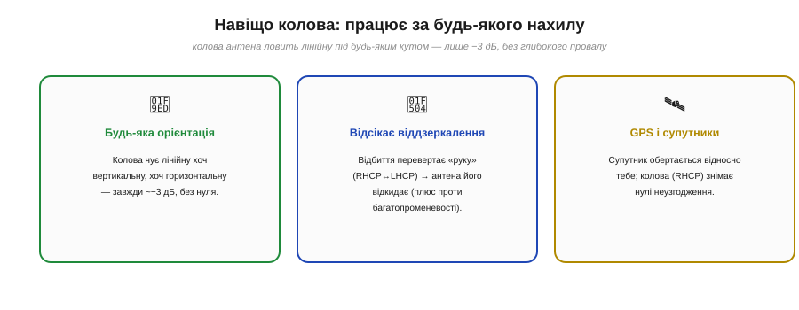

# Поляризація антени

Є прихована властивість антен, через яку два ідеально налаштовані, потужні, точно наведені пристрої можуть **не почути** одне одного зовсім. Звучить дивно — усе ж збігається: частота резонансна, антени спрямовані одна на одну, бюджет із запасом. А зв'язку немає. Винна — **поляризація**: орієнтація коливань хвилі в просторі. Якщо вона в передавача й приймача **не збігається**, сигнал тоне. Цю пастку треба знати в обличчя — і вміти її уникати.

### Орієнтація антени задає поляризацію

[Поляризація](book:communications/propagation-polarization) хвилі — це напрям, у якому коливається її електричне поле E. Так от, **орієнтація антени напряму задає поляризацію** випромінюваної хвилі.


*Рис. Поле E коливається **вздовж дроту** антени. Вертикальна антена (ліворуч) випромінює хвилю з вертикальним полем E — **вертикальну** поляризацію. Горизонтальна (праворуч) — горизонтальну. Куди спрямований провід, така й поляризація.*

Логіка проста й випливає прямо з того, як [антена випромінює](book:communications/antenna): заряди гойдаються **вздовж дроту**, тож і поле E, яке вони породжують, коливається в тому ж напрямку. Поставив антену **вертикально** — отримав хвилю з **вертикально** коливним полем (вертикальна поляризація). Поклав антену **горизонтально** — поле коливається горизонтально. Антена — це буквально «дороговказ» для поля E хвилі. І саме тому орієнтація антени — не дрібниця: вона визначає, як хвиля «повернута» в просторі.

### Передавач і приймач мусять збігатися

А тепер головне практичне: приймальна антена найкраще ловить хвилю, поляризація якої **збігається** з її власною орієнтацією.


*Рис. Обидві антени вертикальні — повний сигнал. Обидві горизонтальні — теж повний. Але якщо одна вертикальна, а інша горизонтальна (**схрещені під 90°**) — приймач майже нічого не чує, хоч усе інше ідеальне. Поляризації мусять бути узгоджені.*

Правило таке. Якщо передавальна й приймальна антени орієнтовані **однаково** (обидві вертикальні або обидві горизонтальні), хвиля «лягає» на приймальну антену ідеально — повний сигнал. Але якщо вони **схрещені під прямим кутом** (одна вертикальна, інша горизонтальна), хвиля з вертикальним полем майже не наводить струму в горизонтальному дроті — сигнал **майже зникає**. Це називають **неузгодженням поляризації** (*polarization mismatch*), і воно здатне «вбити» лінію навіть із величезним запасом бюджету. Класична помилка-новачка: антени стоять правильно, потужність є, а зв'язку нема — бо хтось поклав один штир набік.

### Втрати від кута: закон cos²θ

Між «ідеально збігаються» і «схрещені під 90°» — ціла шкала. Втрати залежать від **кута θ** між поляризаціями за простим законом.


*Рис. Частка потужності, що проходить, дорівнює cos²θ, де θ — кут між поляризаціями. За 0° проходить усе; за 45° — половина (−3 дБ); за 90° — теоретично нуль, а на практиці −20…−30 дБ, тобто фактично мертвий зв'язок.*

**Приклад (втрати неузгодження).** Частка потужності, що передається, — це cos²θ; переведімо в децибели:

```
θ = 0°  : cos²0  = 1.00   →   0 дБ   (ідеально)
θ = 30° : cos²30 = 0.75   →  −1.2 дБ (дрібниця)
θ = 45° : cos²45 = 0.50   →  −3 дБ   (половина)
θ = 60° : cos²60 = 0.25   →  −6 дБ
θ = 90° : cos²90 = 0      →  −∞      (мертво)
```

До ~30° неузгодження майже не шкодить (менше децибела), а от після 45° втрати ростуть лавиною. На практиці навіть «ідеально схрещені» 90° дають не математичний нуль, а близько **−20…−30 дБ** (через дрібні недосконалості) — але це однаково означає, що зв'язку фактично **немає**. Висновок простий: **узгоджуй поляризацію**, особливо в далеких лінках, де кожен децибел на рахунку.

### Чому ж телефон працює під будь-яким нахилом?

Тут уважний читач спіткнеться: якщо неузгодження таке згубне, чому телефон ловить Wi-Fi, **хоч як його повернути** — вертикально, набік, плазом? Адже антена в ньому крихітна й нахиляється разом із корпусом.


*Рис. У приміщенні сигнал доходить **багатьма шляхами**, і кожне відбиття трохи **повертає** поляризацію. Тож до нахиленого телефона долітає суміш усіх орієнтацій — і він чує. А от у чистій прямій видимості (далекий лінк, FPV) відбиттів нема — і неузгодження б'є на повну.*

Рятує [багатопроменевість](book:communications/multipath-fading). У кімнаті чи місті сигнал приходить не прямо, а через купу **відбить** від стін, меблів, будівель, — і кожне відбиття трохи **повертає** площину поляризації. У підсумку до приймача долітає **суміш** усіх можливих орієнтацій, і антена за будь-якого нахилу впіймає хоч якусь складову. Тобто відбиття мимоволі **«розмазують» поляризацію** й прощають неузгодження. Але — увага — це працює лише там, де є відбиття. У **прямій видимості** без перешкод (дальній лінк між вежами, FPV-відео з дрона у відкритому небі) суміші немає, і неузгодження поляризації знову стає вбивчим. Тому: у місті/будинку про поляризацію часто можна не думати, а у відкритих лінках — **узгоджуй обов'язково**.

### Колова поляризація: поле, що обертається

Є й елегантний спосіб **взагалі позбутися** проблеми орієнтації — **колова поляризація** (*circular polarization*).


*Рис. Якщо скласти дві схрещені хвилі зі зсувом фази 90°, сумарний вектор поля E не коливається в одній площині, а **обертається** — описує гвинт уздовж напрямку руху, роблячи повний оберт за одну довжину хвилі. Залежно від напряму обертання це права (RHCP) або ліва (LHCP) колова поляризація.*

Звичайна (лінійна) поляризація — це коли поле E коливається в **одній** площині. А якщо взяти **дві** схрещені антени й живити їх зі [зсувом фази](book:physics/phase) 90° (або скрутити антену в **спіраль** — helix), сумарний вектор E почне **обертатися**, описуючи в просторі **гвинт**. За один період хвилі він робить повний оберт. Напрям обертання дає два різновиди: **права** (*right-hand*, RHCP) і **ліва** (*left-hand*, LHCP) колова поляризація. Хвиля більше не «прив'язана» до однієї площини — і це міняє все.

### Навіщо колова: байдужа до орієнтації

Чому колова поляризація така корисна? Бо вона знімає головний біль неузгодження.


*Рис. Колова антена ловить лінійну під **будь-яким** кутом — завжди приблизно −3 дБ, без глибокого провалу. Відбиття **перевертає «руку»** (RHCP↔LHCP), тож антена відкидає віддзеркалені копії — плюс проти багатопроменевості. Тому колову беруть для GPS і супутників, де орієнтація постійно «гуляє».*

Переваг одразу три. **Перше — байдужість до орієнтації:** колова антена приймає лінійну хвилю однаково (≈ −3 дБ) під будь-яким кутом — без глибоких нулів. Половину потужності втрачаєш завжди, зате **ніколи не провалюєшся в нуль**. **Друге — відсікання відбить:** відбиття від поверхні **перевертає** напрям обертання (права стає лівою), а антена налаштована лише на «свою» руку — тож віддзеркалені копії вона **відкидає**, що допомагає проти [багатопроменевості](book:communications/multipath-fading). **Третє — повторне використання:** RHCP і LHCP взаємно «глухі», тож на одній частоті можна вести **дві** незалежні лінії з протилежними руками. Саме тому **GPS** працює на коловій (RHCP): супутники високо, постійно змінюють кут відносно тебе, і лінійна поляризація давала б нескінченні провали, а колова — ні.

> 🔧 **Навіщо це.** Запам'ятай одну річ, яка економить години марних мук: **якщо зв'язку немає, а все начебто правильно — перевір поляризацію.** Для **нерухомих** лінків «точка-точка» став обидві антени **однаково** (зазвичай вертикально) — це безкоштовні децибели. Для **рухомого** чи **обертового** — наприклад, FPV-камери на дроні, що раз у раз перекидається в маневрі, — бери **колову** антену (характерні «конюшинки» й «пагоди» на FPV — це саме вона), інакше відео «провалюватиметься» щоразу, як дрон ляже на крило. А для GPS-модуля колова RHCP-антена вже вбудована й розрахована — не став її «бочком». Поляризація — невидима, але цілком реальна половина успіху антенної лінії.

### Поляризація на практиці

Зведімо все в коротке правило вибору.


*Рис. Фіксований лінк точка-точка — лінійна, узгоджена (обидві вертикальні чи горизонтальні). Міський/кімнатний зв'язок — лінійна, бо відбиття все одно перемішають. GPS і супутники — колова RHCP. FPV-дрон, що крутиться, — колова, щоб не «провалюватися» в маневрі.*

Отже, на практиці все зводиться до кількох випадків. **Нерухомий лінк** — узгоджена **лінійна** поляризація, і це найпростіший спосіб виграти децибели задарма. **Місто чи приміщення** — теж лінійна, бо багатопроменевість усе одно «перемішає». **GPS і супутники** — **колова** (RHCP), щоб орієнтація не мала значення. **Дрон, що маневрує** (FPV-відео) — теж **колова**, щоб зв'язок не зникав у віражах. Невидимий параметр, про який легко забути, — але саме він часто відрізняє лінк, що працює, від лінка, що мовчить.

Поляризація — лише один із параметрів, що вирішують долю антенної лінії. Між передавачем і антеною є ще одна ланка, яку легко прийняти за просту дрібницю, — **кабель**, що їх з'єднує. Здавалося б, дріт як дріт. Але на радіочастотах звичайний шматок дроту поводиться геть несподівано: він має власний «хвильовий опір», і якщо його не узгодити, частина дорогоцінного сигналу **відіб'ється** назад, так і не дійшовши до антени. Чому кабель має «опір» 50 Ом і до чого тут хвилі — пояснюють [лінії передачі](book:communications/transmission-lines).

---
