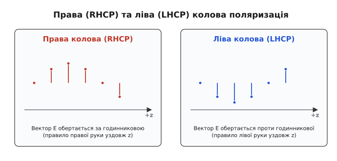
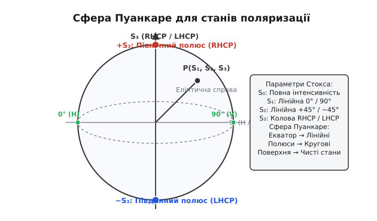
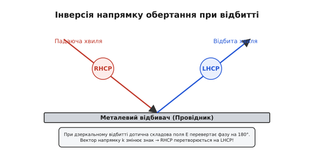
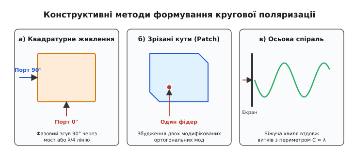

# Кругова та еліптична поляризація

<preknowlist>
- [Поляризація антени](topic:communications/antenna-polarization) — орієнтація та коливання електричного вектора E у просторі.
- [Фаза хвилі](topic:physics/phase) — часовий зсув між двома гармонічними коливаннями.
- [Електромагнітна хвиля](topic:physics/em-wave) — взаємопов'язані коливання електричного та магнітного полів у просторі.
- [Багатопроменеве згасання](topic:communications/multipath-fading) — інтерференція відбитих променів у радіоканалі.
</preknowlist>

Коли радіоканал будується між об'єктами, що динамічно змінюють свою орієнтацію у просторі — супутником на навколоземній орбіті, високоманевреним безпілотним літальним апаратом чи мобільним наземним терминалом, — класична лінійна поляризація опиняється на межі катастрофи. Якщо передавальна антена нахиляється відносно приймальної на кут `90°`, потужність прийнятого сигналу падає за законом `cos²(90°) = 0`, що означає повну втрату зв'язку при ідеально працюючому передавачі. Трагедію поглиблює іоносфера Землі: її розжарена плазма у постійному магнітному полі повертає площину лінійної поляризації на випадковий, нестабільний кут (фарадеївське обертання), перетворюючи стабільну лінію на джерело глибоких фатальних завмирань.

Розв'язанням цієї фундаментальної проблеми є перехід від фіксованого в одній площині вектора електричного поля до вектора, який безперервно обертається навколо осі поширення хвилі. Такий стан випромінювання називається **круговою поляризацією** (*Circular Polarization*, CP) або у загальнішому випадку — **еліптичною поляризацією** (*Elliptical Polarization*).

Про те, як людство пройшло шлях від оптичних дослідів Огюстена Френеля у 1822 році до створення перших космічних ліній зв'язку Джонсона Крауса та проєкту Telstar усередині XX століття, читайте у вставці [Від оптичного еліпса Френеля до космічного радіозв'язку](topic:communications/circular-polarization/hist-polarization-discovery.md).

---

### Фізичний механізм обертання вектора поля

Будь-яка плоска електромагнітна хвиля, що поширюється у просторі уздовж осі `z`, описується вектором електричного поля `E(z, t)`. Цей вектор у будь-який момент часу та у будь-якій точці простору можна розкласти на дві ортогональні просторові складові — вздовж осі `x` (горизонтальну) та вздовж осі `y` (вертикальну):

```
E_x(z, t) = E₀x · cos(ω·t - k·z)
E_y(z, t) = E₀y · cos(ω·t - k·z + δ)
```

Тут `E₀x` та `E₀y` — амплітуди відповідних складових, `ω` — кругова частота, `k = 2·π / λ` — хвильове число, а `δ` — різниця фаз між вертикальним та горизонтальним коливаннями.

Результуючий вектор електричного поля є векторною сумою цих двох компонент:

```
E(z, t) = x̂ · E_x(z, t) + ŷ · E_y(z, t)
```

Геометрична фігура, яку описує кінець результуючого вектора `E` у фіксованій площині, перпендикулярній до осі поширення `z`, повністю визначається двома параметрами: співвідношенням амплітуд `E₀x / E₀y` та фазовим зсувом `δ`.


*Геометрія поляризаційного еліпса: кінець вектора електричного поля E(t) описує замкнену траєкторію в площині, що описується головною віссю a, малою віссю b та кутом нахилу τ відносно осі x.*

Якщо фазовий зсув дорівнює нулю або кратний `π` (`δ = 0` або `δ = ±π`), обидві складові досягають своїх амплітудних значень одночасно. Вектор `E` коливається уздовж однієї прямої лінії під кутом `θ = arctan(E₀y / E₀x)` до осі `x`. Це — **лінійна поляризація**.

Якщо ж складові мають однакову амплітуду (`E₀x = E₀y = E₀`) і зміщені за фазою рівно на чверть періоду (`δ = ±π/2` або `±90°`), то в момент, коли `E_x` досягає максимуму `E₀`, складова `E_y` дорівнює нулю, і навпаки. Модуль результуючого вектора в будь-який момент часу залишається постійним:

```
|E| = √(E_x² + E_y²)
    = √(E₀² · cos²(ω·t) + E₀² · sin²(ω·t))    [підстановка складових E_x та E_y при δ = 90°]
    = √(E₀² · (cos²(ω·t) + sin²(ω·t)))        [винесення спільного множника E₀²]
    = √(E₀² · 1)                              [основна тригонометрична тотожність: cos² + sin² = 1]
    = E₀                                      [добування квадратного кореня]
```

Кінець вектора `E` описує у просторі ідеальне коло з радіусом `E₀`. Під час поширення хвилі вздовж осі `z` кінці векторів поля утворюють просторову спіраль (гвинт). Така хвиля володіє **круговою поляризацією**.

Простежимо фазовий рух вектора `E` протягом одного повного періоду `T = 2·π / ω` у фіксованій площині `z = 0` при `E₀x = E₀y = E₀` та `δ = -90°`:

1. **`t = 0`:** `E_x = E₀ · cos(0) = E₀`, `E_y = E₀ · cos(-90°) = 0`. Вектор спрямований горизонтально праворуч (`+x`).
2. **`t = T/8` (45°):** `E_x = E₀ · cos(45°) = 0.707·E₀`, `E_y = E₀ · cos(-45°) = 0.707·E₀`. Вектор спрямований у перший квадрант під кутом 45°.
3. **`t = T/4` (90°):** `E_x = E₀ · cos(90°) = 0`, `E_y = E₀ · cos(0) = E₀`. Вектор спрямований вертикально вгору (`+y`).
4. **`t = 3·T/8` (135°):** `E_x = -0.707·E₀`, `E_y = 0.707·E₀`. Вектор повернувся у другий квадрант.
5. **`t = T/2` (180°):** `E_x = -E₀`, `E_y = 0`. Вектор спрямований горизонтально ліворуч (`-x`).

Вектор `E` рівномірно обертається проти годинникової стрілки в площині `(x, y)` із постійною кутовою швидкістю `ω`.

В усіх інших проміжних випадках — коли амплітуди не рівні (`E₀x ≠ E₀y`) або фазовий зсув відрізняється від `±90°` — траєкторія вектора утворює еліпс. **Еліптична поляризація** є загальним математичним станом електромагнітного випромінювання, а лінійна та колова поляризації є лише її окремими граничними випадками.

---

### Напрямок обертання: права (RHCP) та ліва (LHCP) поляризації

Кругова та еліптична поляризації володіють фундаментальною властивістю топологічної асиметрії — напрямком обертання вектора поля у просторі. За міжнародним стандартом IEEE (який використовується в радіотехніці та антенних вимірюваннях), напрямок визначається для спостерігача, який дивиться **у напрямку поширення хвилі** (тобто вслід хвилі, що віддаляється).


*Просторове розповсюдження векторів поля: у правій коловій поляризації (RHCP) вектор E обертається за годинниковою стрілкою при погляді вздовж осі поширення, у лівій (LHCP) — проти годинникової стрілки.*

1. **Права колова поляризація** (*Right-Hand Circular Polarization*, **RHCP**):
   Вектор електричного поля `E` обертається за годинниковою стрілкою для спостерігача, що дивиться уздовж променя поширення. Якщо спрямувати великий палець правої руки у напрямку поширення хвилі `+z`, то зігнуті пальці покажуть напрямок обертання вектора `E`. У часовій області це відповідає фазовому запізненню вертикальної компоненти відносно горизонтальної: `δ = -90°`.

2. **Ліва колова поляризація** (*Left-Hand Circular Polarization*, **LHCP**):
   Вектор електричного поля обертається проти годинникової стрілки при спостереженні вздовж променя. Великий палець лівої руки, спрямований уздовж осі `+z`, вказує напрямок обертання. Це відповідає фазовому випередженню `δ = +90°`.

Радіолінія, побудована на RHCP-антені передавача та LHCP-антені приймача, володіє високим рівнем крос-поляризаційної розв'язки (зазвичай від `20` до `35 дБ`). Це дає змогу повторно використовувати одну й ту саму частотну смугу на одній території для двох незалежних каналів зв'язку без взаємних завад.

---

### Осьове відношення (Axial Ratio) — кількісний критерій чистоти

На практиці жодна реальна антена не здатна згенерувати ідеально круглу хвилю з `AR = 1.000` у всьому робочому діапазоні кутів та частот. Завжди наявні технологічні допуски, асиметрія конструкції та паразитні амплітудно-фазові викривлення.

Для вимірювання того, наскільки поляризація наближена до ідеального кола, використовують **осьове відношення** (*Axial Ratio*, **AR**). Це безрозмірне відношення великої півосі `a` (або `E_major`) поляризаційного еліпса до його малої півосі `b` (або `E_minor`):

```
AR = E_major / E_minor
```

У радіотехніці осьове відношення прийнято виражати в логарифмічних одиницях — децибелах (дБ):

```
AR_dB = 20 · log₁₀(E_major / E_minor)
```

За цією шкалою:
- **Ідеальна колова поляризація:** `AR = 1.0` (або `0 дБ`), оскільки `E_major = E_minor`.
- **Еліптична поляризація:** `1 < AR < ∞` (від `0.1 дБ` до `6–10 дБ`).
- **Лінійна поляризація:** `AR = ∞` (мала вісь `E_minor = 0`, що дає `∞ дБ`).

У практичному антенному будівництві антена вважається **антеною колової поляризації**, якщо її осьове відношення не перевищує **`3 дБ`** (`AR < 1.41`) у межах основного променя діаграми спрямованості. Для високоточних систем навігації (GNSS/GPS) вимоги жорсткіші: `AR < 1.5 дБ` або навіть `AR < 1.0 дБ` в зеніті.

Повну математичну теорію поляризаційного еліпса, виведення параметрів Стокса та розрахунок геометрії сфери Пуанкаре розібрано у вставці [Параметри Стокса, сфера Пуанкаре та математика поляризаційного еліпса](topic:communications/circular-polarization/math-polarization-ellipse.md).


*Сфера Пуанкаре: будь-який стан поляризації відображається точкою на поверхні сфери. Екватор відповідає лінійним поляризаціям, Північний полюс — RHCP, Південний полюс — LHCP, а проміжні точки — еліптичним станам.*

---

### Ефекти середовища поширення: іоносферне обертання Фарадея та дощова деполяризація

На шляху між космічним апаратом та наземною станцією радіохвиля долає шар іоносфери Землі — іонізовану плазму, що знаходиться під дією постійного геомагнітного поля.

У магнітоактивній плазмі виникає явище **ефекту Фарадея**: плазма розкладає будь-яку лінійно поляризовану хвилю на дві суперпозиційні кругові компоненти (праву та ліву), які поширюються з різними фазовими швидкостями `v_phase_RHCP ≠ v_phase_LHCP`. На виході з іоносфери вектор електричного поля лінійної хвилі виявляється повернутим на кут `Ω_F`:

```
Ω_F = (e³ / (8·π²·ε₀·m²·c·f²)) · ∫ N_e(z) · B_z(z) dz
```

Кут повороту `Ω_F` обернено пропорційний квадрату частоти (`1/f²`) і прямо пропорційний інтегральній електронній концентрації іоносфери `N_e`. На частотах L-діапазону (1.2–1.6 ГГц) кут `Ω_F` може досягати від `90°` до кількох повних обертів (`720°`) залежно від сонячної активності та часу доби.

Для лінійної поляризації це означає повну непередбачуваність орієнтації поля біля поверхні Землі. Для **кругової ж поляризації** фарадеївське обертання лише додає постійний фазовий зсув до обертового вектора, але **не змінює напрямку обертання і не спотворює осьового відношення** (RHCP залишається RHCP). В цьому полягає фундаментальна причина вибору кругової поляризації для супутникових систем.

У тропосфері при частотах вище `10 ГГц` (Ku/Ka діапазони) виникає інший деструктивний чинник — **деполяризація в опадах**. Краплі дощу під дією опору повітря падають не у формі сфер, а у формі сплюснутих сфероїдів. Оскільки горизонтальний розмір краплі більший за вертикальний, горизонтальна складова хвилі зазнає більшого згасання та затримки фази, ніж вертикальна. В результаті ідеальна колова хвиля RHCP на вході у зливу перетворюється на еліптичну з `AR > 4–6 дБ`, що обмежує якість крос-поляризаційного ущільнення в супутникових каналах.

---

### Взаємодія з поверхнями: інверсія напрямку обертання при відбитті

Однією з найцінніших системних властивостей кругової поляризації є її унікальна поведінка під час дзеркального відбиття від провідних поверхонь (землі, води, металевих дахів, обшивки будинків).

При падінні хвилі з круговою поляризацією на плоский металевий відбивач дотична (тангенціальна) складова електричного поля змінює свій знак на протилежний (стрибок фази на `180°`), тоді як нормальна складова зберігає напрямок. Одночасно вектори поширення хвилі `k` дзеркально перевертаються.


*При дзеркальному відбитті від провідника права колова поляризація (RHCP) перетворюється на ліву (LHCP). Приймач з RHCP-антеною автоматично пригнічує відбитий промінь на 20–30 дБ.*

У результаті цього математичного перетворення **напрямок обертання поля перевертається**:
- Падаюча хвиля **RHCP** після одного відбиття стає хвилею **LHCP**.
- Падаюча хвиля **LHCP** після відбиття стає **RHCP**.

Оскільки приймальна антена системи налаштована на прийом «своєї» поляризації (наприклад, RHCP), вона є фактично «сліпою» до відбитої хвилі LHCP. Відбитий промінь згасає у приймачі на `20–30 дБ`.

При подвійному відбитті (наприклад, кутовий відбивач або дві послідовні стіни) напрямок обертання перевертається двічі: `RHCP → LHCP → RHCP`. Тому вторинне відбиття знову приймається антенною системи. Проте енергія подвійного відбиття значно менша за енергію прямого променя через подвійний коефіцієнт відбиття, що зберігає стабільність зв'язку.

Це дає колосальну перевагу в боротьбі з [багатопроменевим згасанням](topic:communications/multipath-fading). У той час як для лінійної поляризації відбитий промінь інтерферує з прямим, створюючи глибокі провали сигналу (завмирання за зашумленим каналом Рэлея), колова поляризація природно фільтрує одноразові відбиття без використання складних цифрових еквалайзерів.

---

### Розрахунок втрат при неузгодженні поляризацій

Коли поляризація хвилі `e_t`, випроміненої передавачем, не повністю збігається з поляризаційною характеристикою `e_r` приймальної антени, виникають втрати потужності. Ці втрати описуються **коефіцієнтом поляризаційних втрат** (*Polarization Loss Factor*, **PLF**):

```
PLF = |e_t · e_r*|²
```

Розглянемо фундаментальну матрицю взаємодії різних типів антен у радіолінії:

| Антена передавача | Антена приймача | Кут / Умова | Прохідна потужність (PLF) | Втрати в дБ |
| :--- | :--- | :--- | :--- | :--- |
| **Лінійна (V)** | **Лінійна (V)** | Узгоджені (0°) | `1.0` | `0 дБ` |
| **Лінійна (V)** | **Лінійна (H)** | Ортогональні (90°) | `0.0` | `-∞ дБ` (практично -25 дБ) |
| **RHCP** | **RHCP** | Узгоджені | `1.0` | `0 дБ` |
| **RHCP** | **LHCP** | Протилежні | `0.0` | `-20...-35 дБ` |
| **RHCP** | **Лінійна (будь-яка)** | Будь-який кут нахилу | `0.5` | **`-3.01 дБ`** |
| **Лінійна (будь-яка)**| **LHCP** | Будь-який кут нахилу | `0.5` | **`-3.01 дБ`** |

З цієї таблиці випливає ключовий інженерний висновок: **прийомо-передача між антеною з круговою поляризацією та антеною з лінійною поляризацією завжди супроводжується втратою 3 дБ (50% потужності)**. Проте ця втрата є абсолютно стабільною та не залежить від кута повороту лінійної антени навколо осі!

Якщо обидві антени у радіолінії мають неідеальні осьові відношення `AR₁` та `AR₂`, коефіцієнт втрат PLF у найгіршому випадку кутового розсогласування обчислюється за формулою:

```
PLF_min = 0.5 + [ (AR₁² - 1)·(AR₂² - 1) / (2·(AR₁² + 1)·(AR₂² + 1)) ] - [ (AR₁·AR₂) / ((AR₁² + 1)·(AR₂² + 1)) ]
```

Практичну програму мовами C та C++ для аналізу довільного поляризаційного еліпса, обчислення коефіцієнтів PLF та характеристик Стокса наведено у вставці [Аналізатор поляризаційного еліпса та розрахунок коефіцієнта осьового відношення](topic:communications/circular-polarization/proj-polarization-analyzer.md).

---

### Конструктивні методи формування кругової поляризації

Створити хвилю з круговою поляризацією можна трьома основними електродинамічними способами.


*Три конструктивні моделі генерації кругової поляризації: а) мікросмужкова антена з квадратурним двохточковим живленням; б) одноточкова патч-антена зі зрізаними кутами; в) осьова спіральна антена біжучої хвилі.*

#### 1. Квадратурне збудження двох ортогональних випромінювачів
Беруться два ідентичні лінійні випромінювачі (наприклад, диполі або модальні поля мікросмужкового патча), розташовані перпендикулярно один до одного під кутом `90°`. На вони подаються сигнали однакові за амплітудою, але з часовим зсувом фази на `90°` (у квадратурі).
Фазовий зсув створюється за допомогою зовнішніх пасивних НВЧ-пристроїв: квадратурного моста (квадратурного гібрида 3 дБ), дільника Вількінсона з нерівними плечима (одне плече довше на `λ/4`) або шлейфового напрямленого відгалужувача.

#### 2. Конструктивна геометрична деформація (perturbation method)
У мікросмужковій патч-антені можна збудити кругову поляризацію через єдину точку живлення (одним фідером), якщо внести в її форму симетричну деформацію — зрізати два діаметрально протилежні кути квадратного патча або додати прямокутні вирізи (слоти).
Ця деформація розщеплює фундаментальний резонансний режим `TM₁₀` на дві ортогональні моди з трохи відмінними резонансними частотами `f₁` та `f₂`. На робочій частоті `f₀ = (f₁ + f₂)/2` фази цих двох мод відрізняються саме на `90°`, утворюючи кругову поляризацію без використання зовнішніх фазоповертачів.

#### 3. Антени біжучої хвилі (Спіральні та Турнікетні антени)
Спіральна антена в осьовому режимі (*Axial Mode Helical Antenna*, розроблена Джоном Краусом) природно формує кругову поляризацію. Хвиля струму біжить вздовж витків спіралі з периметром `C ≈ λ`. Оскільки струм здійснює оберт у просторі за час одного періоду `T`, випромінене поле автоматично отримує обертову кругову поляризацію.
Напрямок згортання провідника спіралі безпосередньо задає знак поляризації: права намотка створює RHCP, ліва — LHCP.

Різновидом плоских широкосмугових антен біжучої хвилі є **планарна плоска спіраль Архімеда** та **логарифмічна спіраль**. Вона складається з двох планарних металевих плечей, згорнутих у формі спіралі Архімеда `r = r₀ + a·θ` на поверхні діелектричної плати. Випромінювання відбувається з кільцевої зони активності, де периметр кола дорівнює довжині хвилі (`2·π·r ≈ λ`). Завдяки принцип самодоповнюваності Бабіне планарні спіральні антени зберігають постійний імпеданс (близько 188 Ом) та стабільну кругову поляризацію в діапазоні частот перевищення від 5:1 до 10:1.

Детальний порівняльний аналіз електричних та механічних параметрів різних генераторів кругової поляризації наведено у вставці [Конструктивні типи генераторів кругової поляризації](topic:communications/circular-polarization/comp-cp-generators.md).

---

### Методи лабораторного вимірювання осьового відношення

У вимірювальних антенних лабораторіях та безехових камерах перевірка чистоти кругової поляризації (значення `AR`) здійснюється двома основними вимірювальними методиками:

1. **Метод обертового лінійного диполя (Spinning Dipole Method):**
   Досліджувана антена працює в режимі передачі. На відстані фар-зони встановлюється лінійно поляризований вимірювальний диполь, який повільно повертається навколо осі поширення на 360°. Записується амплітудна огинаюча вихідного сигналу. Осьове відношення визначається безпосередньо як відношення максимальної напруги до мінімальної:
   ```
   AR_dB = 20 · log₁₀(V_max / V_min)
   ```
   Цей метод простий, але не визначає напрямку обертання (RHCP vs LHCP).

2. **Метод двох ортогональних каналів (Dual-polarization probe):**
   Використовується приймач із двоканальним фазометром та вимірювальна антена із двома виходами (H та V). Одночасно амплітудно-фазовим аналізатором мережі (VNA) вимірюються матричні комплексні коефіцієнти передачі `S₂₁_H` та `S₂₁_V`. Через математичний перетворення векторів Стокса обчислюється точна форма поляризаційного еліпса та напрямок обертання.

---

> 🔧 **Навіщо це.**
> У реальному розробленні радіоелектронних систем вибір поляризації визначає надійність всієї лінії зв'язку:
>
> 1. **Супутникові системи та GNSS (GPS / GLONASS / Galileo):** Усі супутники навігації випромінюють сигнал у правій коловій поляризації (**RHCP**). Це позбавляє лінію від ефекту Фарадея в іоносфері та дозволяє приймати сигнал навігації на звичайний керамічний патч або спіральну антену без орієнтування приймача на супутник.
> 2. **FPV-відеокоптери та розвідувальні БПЛА:** Використання антен RHCP/LHCP («конюшини», «пагоди», кнюпельні спіралі) на дронах захищає відеоканал від зникнення кадру під час різких маневрів (кренів до 90°) та ефективно пригнічує багатопроменеві відбиття від стін, дерев і землі.
> 3. **Метеорологічні та військові радари:** Поляриметричні радари випромінюють імпульси з круговою поляризацією для виявлення форми часточок у повітрі. Сферичні краплі дощу повертають колу хвилю з інверсією (RHCP → LHCP), тоді як асиметричні град або уламки створюють складні еліптичні деполяризовані відбиття.

---

### Підсумковий синтез

Кругова та еліптична поляризації являють собою вищий щабель організації просторово-часової структури електромагнітної хвилі. Шляхом узгодженого фазового зсуву двох ортогональних компонент електричного поля радіоінженери отримують хвилю, здатну долати два головних лиха відкритих радіоканалів: поляризаційне неузгодження при довільній орієнтації антен та завади від багатопроменевого відбиття.

Розуміння векторної геометрії поляризаційного еліпса, параметрів Стокса та правил інверсії при відбитті дає змогу грамотно проектувати антени для космічного зв'язку, навігації, безпілотних апаратів та радіолокації.

Проте успішна робота будь-якої антени — чи то лінійної, чи то з круговою поляризацією — неможлива без її електричного узгодження з вихідним каскадом передавача. Як правильно виміряти та компенсувати реактивну складову імпедансу антени, пояснюється у статті [Узгодження імпедансу антен](topic:communications/antenna-impedance-matching).
