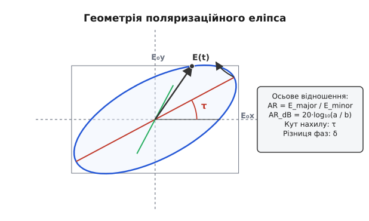

# 📜 Від оптичного еліпса Френеля до космічного радіозв'язку

Поширення електромагнітних хвиль крізь анізотропні середовища, космічну плазму та іоносферу Землі зіштовхується з фізичним явищем фарадеївського обертання площини поляризації: лінійно поляризована хвиля хаотично повертає свій вектор електричного поля, спричиняючи глибокі завмирання та повну втрату сигналу на приймальній антені. Історичний виклик подолання цієї деградації зв'язку та відкриття методів керування просторовою орієнтацією вектора E пройшов шлях від фундаментальних оптичних досліджень Френеля XIX століття до створення спіральних антен Крауса й розгортання перших супутникових угруповань Telstar і NAVSTAR GPS.

---

### Оптичний витік: ромб Френеля та розгадка природи світла

На початку XIX століття хвильова теорія світла Томаса Юнга все ще сприймалася фізичною спільнотою з великим скепсисом. Панівною була корпускулярна теорія Ісаака Ньютона, яка добре пояснювала прямолінійне поширення світла, але безпорадно зупинялася перед явищем подвійного променепреломлення у кристалах исландського шпату (кальциту), відкритим Еразмом Бартоліном у 1669 році.

У 1808 році французький інженер і фізик **Етьєн-Луї Малюс** (*Étienne-Louis Malus*) виявив, що світло, відбите під певним кутом від скляної пластини, набуває специфічної асиметрії, яку він назвав **поляризацією** (від латинського *polus* — полюс). Малюс вважав, що світлові корпускули мають «полюси», подібні до магнітних. Проте пояснити, чому відбитий промінь не проходить крізь другий кристалографічний аналізатор під кутом `90°`, корпускулярна модель не могла.

Справжній фізичний прорив здійснив видатний французький фізик **Огюстен-Жан Френель** (*Augustin-Jean Fresnel*). У серії мемуарів, поданих до Паризької академії наук між 1816 та 1823 роками за підтримки Домініка-Франсуа Араго, Френель довів, що світлові хвилі є суворо **поперечними коливаннями** пружного ефіру, а не поздовжніми, як вважалося з часів Християна Гюйгенса.


*Принцип роботи ромба Френеля: лінійно поляризоване світло зазнає двох повних внутрішніх відбиттів під кутом 54°, кожне з яких додає фазовий зсув 45°, утворюючи на виході ідеальну кругову поляризацію.*

У 1822 році Френель створив свій знаменитий **ромб Френеля** (*Fresnel rhomb*) — скляну призму особливої геометричної форми. Він теоретично розрахував і практично підтвердив, що при повному внутрішньому відбитті світла на межі скло-повітря між складовими поперечних коливань, паралельною та перпендикулярною до площини падіння, виникає фазовий зсув. При куті падіння близько `54°` одне відбиття створює фазовий зсув `45°` (`π/4`). Зазнавши двох послідовних відбиттів усередині скляного ромба, промінь отримує сумарний фазовий зсув:

```
δ = 45° + 45° = 90°  (π/2)
```

Якщо вхідне світло було лінійно поляризоване під кутом `45°` до площини падіння (що забезпечувало рівність амплітуд `E₀x = E₀y`), світло на виході з ромба Френеля ставало **кругово поляризованим**. Це стало першим штучним синтезом кругової поляризації в історії науки.

Френель математично описав поляризаційний еліпс і ввів поняття оптичної активності матеріалів (кругового дихроїзму та кругового подвійного променепреломлення), довівши, що права та ліва кругові хвилі поширюються в оптично активних речовинах (таких як розчини цукру чи кристали кварцу) з різними фазовими швидкостями.

Вивчаючи оптичні властивості органічних сполук, **Жан-Батіст Біо** (*Jean-Baptiste Biot*) та згодом **Луї Пастер** (*Louis Pasteur*) у 1848 році встановили, що мокромолекулярна хіральність (дзеркальна асиметрія молекул) безпосередньо взаємодіє з правом та лівим обертанням кругової поляризації світла. Це поклало початок новій науковій дисципліні — стереохімії.

---

### Від відкриття Герца до радіочастотного діапазону

У 1887–1888 роках німецький фізик **Генріх Герц** (*Heinrich Hertz*) експериментально підтвердив теорію електромагнетизму Джеймса Клерка Максвелла, відкривши радіохвилі. Для доведення поперечного характеру радіохвиль Герц виготовив першу решітку з паралельних мідних дротів (поляризаційний фільтр). Коли дроти решітки були паралельні вектор електричного поля `E` іскрового передавача, хвиля повністю відбивалася; коли ж решітку повертали на `90°`, хвиля проходила безперешкодно.

Проте понад півстоліття радіотехніка використовувала виключно лінійну поляризацію. Ситуація кардинально змінила розвиток надвисокочастотної (НВЧ) техніки у 1930-х роках.

У 1936 році американський радіофізик **Джордж Саутворт** (*George C. Southworth*) із лабораторій Bell Telephone Laboratories опублікував фундаментальні праці з поширення електромагнітних хвиль у порожнистих металевих трубах — **хвилеводах**.

Працюючи з круглими хвилеводами у діапазонах СВЧ, Саутворт виявив, що шляхом збудження двох ортогональних модифікацій хвилі `TE₁₁` зі зсувом фази на `90°` усередині труби створюється електромагнітне поле, вектор якого обертається по колу. Для створення фазового зсуву Саутворт застосував зрізані діелектричні пластини (перші диференціальні фазові секції), які сповільнювали одну з компонент поля — радіотехнічний аналог ромба Френеля.

Це відкриття дало змогу створювати перші оборотні поляризаційні перетворювачі для радіолокаційних систем Другої світової війни, що дозволяло виявляти цілі через завісу дощових хмар.

---

### Джон Краус та винайдення спіральної антени (1946)

Справжня революція у застосуванні кругової поляризації відбулася восени 1946 року в стінах Огайоського державного університету (*Ohio State University*). Видатний американський антенний інженер і астроном **Джон Деніел Краус** (*John Daniel Kraus*) шукав спосіб створити просторови широкосмугову антену для радіоастрономічних спостережень Сонячної системи.

Досліджуючи поведінку біжучих хвиль на струмопровідних спіралях, Краус виявив дивовижне явище. Коли периметр одного витка спіралі наближався до довжини хвилі (`C ≈ λ`), антена раптово переходила з нормального режиму випромінювання в **осьовий режим** (*Axial Mode*).

У цьому режимі спіральна антена формувала гострий спрямований промінь уздовж своєї поздовжньої осі й генерувала майже ідеальну кругову поляризацію без жодних додаткових фазоповертачів, містків чи підлаштувальних елементів.

Краус згадував у своїх спогадах:
> *«Це здавалося магією: ви просто скручуєте мідний дріт у штопор перед шматком жесті, і отримуєте високоспрямований промінь із чистою круговою поляризацією у широкій смузі частот!»*

Патент Крауса на спіральну антену (US Patent 2,472,296) став основою для розвитку всієї космічної антенної техніки XX століття.

---

### Космічна ера: Telstar, Apollo та супутникова навігація

У 1960-х роках колова поляризація з лабораторного екзоту перетворилася на головну робочу конячку космічних зв'язкових ліній.

У липні 1962 року Bell Labs та NASA запустили **Telstar 1** — перший у світі активний супутник зв'язку. Telstar 1 використовував антени з круговою поляризацією для ретрансляції телевізійних сигналів між США та Європою. Це рішення було прийнято для нівелювання фарадеївського обертання в іоносфері та усунення втрат від обертання самого супутника на орбіті.

Під час місячної програми **Apollo** (1968–1972) зв'язок між командним модулем на орбіті Місяця, місячним модулем (*Lunar Module*) та наземними станціями мережі Deep Space Network (DSN) здійснювався виключно у S-діапазоні (2.2 ГГц) з використанням правої (RHCP) та лівої (LHCP) кругових поляризацій. Спіральні антени Крауса та чашоподібні параболічні рефлектори із септум-поляризаторами забезпечили безперебійну передачу кольорового телебачення та телеметрії з поверхні Місяця.

У 1970-х роках при проектуванні глобальної супутникової системи навігації **NAVSTAR GPS** американські інженери під керівництвом Бредфорда Паркінсона зафіксували праву кругову поляризацію (RHCP) як єдиний канонічний стандарт для всіх частотних каналів (L1 = 1575.42 МГц, L2 = 1227.60 МГц). Це рішення гарантувало, що будь-який навігаційний приймач на Землі — від цивільного смартфона до крилатої ракети — зможе надійно обчислювати свої координати незалежно від орієнтації пристрою в просторі.
