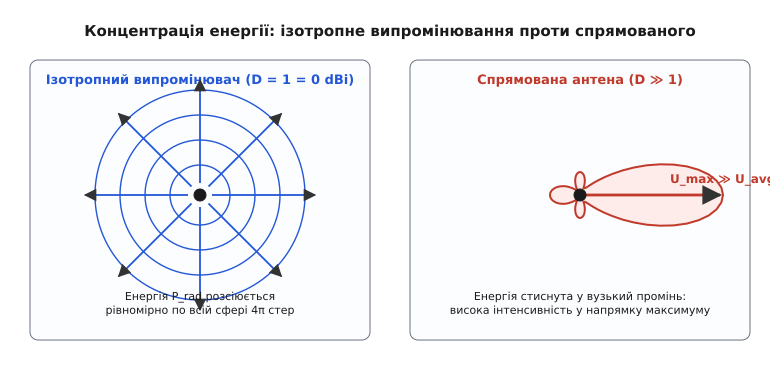
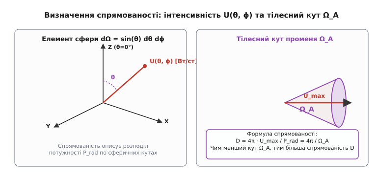
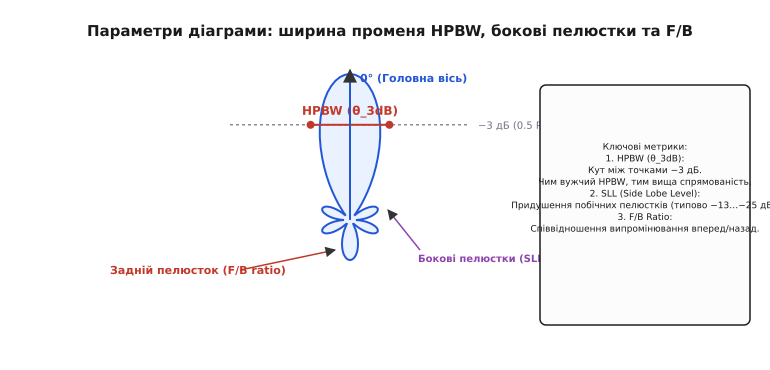
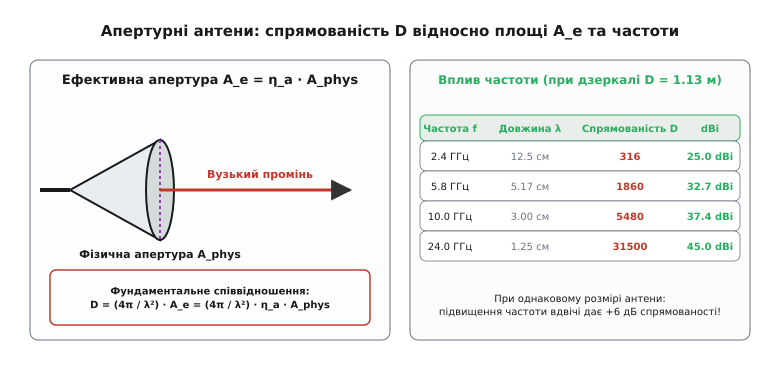

# Спрямованість антени

<preknowlist>
- [Антена](topic:communications/antenna) — базовий принцип перетворення струму на хвилю.
- [Підсилення антени](topic:communications/antenna-gain) — як коефіцієнт підсилення враховує спрямованість та втрати.
</preknowlist>

Передавач радіосигналу з вихідною потужністю 100 мВт має подати інформацію на відстань 5 кілометрів. Якщо випромінити цю енергію рівномірно в усіх напрямках тривимірного простору, густина потужності на такій відстані впаде до мізерних фемтоватерів на квадратний метр. Сигнал просто розчиниться у навколишніх шумах, і зв'язок стане неможливим. Але якщо зібрати ту саму енергію вузьким променем, спрямованим чітко на приймач, густина потужності в точці прийому зросте в сотні чи тисячі разів. Властивість антени фокусувати випромінювану електромагнітну енергію в певних напрямках простору описується важливою характеристикою — **спрямованістю** (*directivity*).

Спрямованість є суто геометричною характеристикою [діаграми випромінювання](topic:communications/antenna). Вона показує, наскільки ефективно антена перерозподіляє випромінену потужність у просторі порівняно з еталонним [ізотропним випромінювачем](topic:communications/antenna-gain).

### Ізотропний випромінювач та інтенсивність випромінювання

Щоб кількісно оцінити спрямованість, у теорії антен використовують ідеалізований еталон — **ізотропний випромінювач** (*isotropic radiator*). Це гіпотетична точкова антена, яка випромінює однакову потужність у всіх напрямках 3D-простору. Хоча створити реальну точкову антену з чисто ізотропним випромінюванням [векторної електромагнітної хвилі](topic:physics/em-wave) фізично неможливо через векторну природу полів, ця модель є фундаментальним орієнтиром.


*Ізотропний випромінювач (ліворуч) розсіює потужність рівномірно по всій сфері 4π стерадіан. Спрямована антена (праворуч) стискає ту саму випромінену потужність у вузький конус, створюючи в напрямку головного пелюстка набагато вищу інтенсивність випромінювання U_max.*

Для опису просторового розподілу потужності введено поняття **інтенсивності випромінювання** `U(θ, ϕ)`. Вона вимірюється в ватах на стерадіан (`Вт/ст`) і визначається як потужність, що випромінюється антеною на одиницю тілесного кута `dΩ = sin(θ) dθ dϕ`:

```
U(θ, ϕ) = dP_rad / dΩ     [Вт / стерадіан]
```

Повна потужність `P_rad`, яку випромінює антена в увесь навколишній простір, обчислюється шляхом інтегрування інтенсивності `U(θ, ϕ)` по всій замкненій сфері тілесного кута `4π` стерадіан:

```
P_rad = ∬ U(θ, ϕ) dΩ
      = ∫₀²ⁿ ∫₀ⁿ U(θ, ϕ) sin(θ) dθ dϕ     [інтеграл по всій сфері 4π стер]
```

Для ізотропного випромінювача інтенсивність випромінювання `U_iso` однакова в усіх напрямках `(θ, ϕ)`. Вона дорівнює середньому значенню інтенсивності `U_avg`:

```
U_avg = U_iso = P_rad / (4π)     [середня інтенсивність випромінювання]
```

Саме ця середня інтенсивність `U_avg` слугує основою для порівняння будь-якої реальної антени з ізотропним стандартом.

### Строге математичне визначення спрямованості

Спрямованість антени у довільному напрямку `(θ, ϕ)` виражається відношенням інтенсивності випромінювання у цьому напрямку `U(θ, ϕ)` до середньої інтенсивності `U_avg`, яку мала б ізотропна антена при такій самій повній випроміненій потужності `P_rad`:

```
D(θ, ϕ) = U(θ, ϕ) / U_avg
        = 4π · U(θ, ϕ) / P_rad     [визначення спрямованості у напрямку (θ, ϕ)]
```

Якщо напрямок не вказано окремо, під терміном **спрямованість антени** (`D` або `D_max`) завжди розуміють **максимальне значення** спрямованості в напрямку головного пелюстка випромінювання:

```
D = D_max = U_max / U_avg
          = 4π · U_max / P_rad     [максимальна спрямованість антени]
```


*Інтенсивність U(θ, ϕ) вимірюється у Вт/стерадіан. Тілесний кут променя Ω_A еквівалентний куту конуса, крізь який пройшла б уся потужність P_rad, якби інтенсивність всередині нього була постійною й дорівнювала U_max.*

Фізичний зміст поняття стає ще наочнішим, якщо ввести **тілесний кут променя** `Ω_A` (*beam solid angle*). Це еквівалентний тілесний кут конуса, через який протікала б уся випромінена потужність `P_rad`, якби інтенсивність випромінювання всередині цього конуса була сталою й дорівнювала максимальному значенню `U_max`:

```
Ω_A = (1 / U_max) · ∬ U(θ, ϕ) dΩ     [тілесний кут променя у стерадіанах]
```

Тоді максимальна спрямованість виражається гранично простою й елегантною формулою:

```
D = 4π / Ω_A     [спрямованість як відношення всієї сфери до кута променя]
```

Ця формула має глибокий фізичний зміст: чим вужчий кут випромінювання `Ω_A` (тобто чим сильніше стиснутий промінь антени), тим більша частка повної сфери `4π` заміщується високою концентрацією енергії, і тим вищою є спрямованість `D`.

На практиці спрямованість майже завжди виражають у логарифмічних одиницях — **безвідносних децибелах щодо ізотропного випромінювача** (`dBi`):

```
D_dBi = 10 · log₁₀(D)     [спрямованість у dBi]
```

Наприклад:
- Для абсолютно ізотропної антени `D = 1`, що відповідає `0 dBi`.
- Для еталонного тонкого [півхвильового диполя](topic:communications/resonance-dipole) максимальна спрямованість дорівнює `D ≈ 1.64`, що у децибелах становить `2.15 dBi` (або `0 dBd`).
- Для високоспрямованої параболічної антени спрямованість може досягати `D = 10000`, що відповідає `40 dBi`.

### Фізичний механізм формування спрямованості та фазова інтерференція

Формування спрямованого випромінювання спирається на хвильову інтерференцію полів, створених окремими елементами антени чи різними ділянками її розкриву. За принципом Гюйгенса–Френеля кожна точка збудженої апертури антени слугує джерелом вторинних сферичних хвиль.

У напрямку оптичної осі антени (головного пелюстка) відстані від усіх ділянок апертури до віддаленої точки спостереження однакові чи відрізняються на ціле число довжин хвиль. У результаті всі вторинні хвилі приходять у **синфазі** (`Δϕ = 0°`), їхні амплітуди додаються, створюючи максимальну напруженість поля `E_max`.

У побічних напрямках різниця ходу між хвилями від протилежних країв розкриву стає півхвилею (`Δr = λ/2`). Хвилі приходять у **протифазі** (`Δϕ = 180°`) і взаємно гасять одна одну, утворюючи нулі діаграми випромінювання.

Математично зв'язок між розподілом полів у розкриві антени `A(x, y)` та діаграмою випромінювання у віддаленій зоні `E(θ, ϕ)` описується двовимірним **перетворенням Фур'є**. Чим ширший фізичний розкрив антени у хвильових одиницях (`D_ant / λ`), тим вужчим є просторовий спектр — і тим вужчим є головний пелюсток випромінювання.

### Межа далекої зони (зона Фраунгофера)

Визначення спрямованості через інтенсивність випромінювання `U(θ, ϕ)` має фізичний зміст **виключно у далекій зоні антени** (*Far-Field Zone* або *Fraunhofer Zone*).

Простір навколо будь-якої випромінюючої структури поділяють на три області:
1. **Реактивна ближня зона** (`r < 0.62 · √(D_ant³ / λ)`): у цій зоні переважають реактивні (запасені) електричні та магнітні поля, які не відриваються від антени. Вектор Пойнтінга є уявним, а хвильовий імпеданс сильно відхиляється від імпедансу вільного простору (`120π ≈ 377 Ом`).
2. **Випромінювальна ближня зона (зона Френеля)** (`0.62 · √(D_ant³ / λ) ≤ r < 2 D_ant² / λ`): хвилі вже відриваються від антени, але форма діаграми випромінювання змінюється залежно від відстані `r`.
3. **Далека зона (зона Фраунгофера)** (`r ≥ 2 D_ant² / λ`): кутовий розподіл поля `E(θ, ϕ)` стає остаточно сформованим і не залежить від відстані `r`. Напруженість поля спадає строго як `1/r`, а густина потужності — як `1/r²`.

Умова настання далекої зони визначається формулою:

```
r_min = (2 · D_ant²) / λ     [мінімальна відстань далекої зони]
```

де `D_ant` — найбільший лінійний розмір антени, а `λ` — довжина хвилі.

Наприклад, для параболічної антени діаметром `D_ant = 1.2 м` на частоті `10 ГГц` (`λ = 0.03 м`):

```
r_min = (2 · 1.2²) / 0.03 = (2 · 1.44) / 0.03 = 96 метрів
```

Усі вимірювання спрямованості у безлуній камері мають здійснюватися на відстані, що перевищує `r_min`, інакше сферична фазова похибка спотворить виміряну ширину променя та значно зменшить обчислене значення спрямованості.

### Спрямованість (D) проти підсилення (G): у чому різниця

В інженерній практиці дуже часто плутають два поняття: **спрямованість** (*directivity*, `D`) та [**коефіцієнт підсилення**](topic:communications/antenna-gain) (*gain*, `G`). Хоча обидва параметри вимірюються в `dBi` і для багатьох антен мають близькі значення, між ними існує фундаментальна відмінність.

- **Спрямованість `D`** є суто **геометричною** характеристикою просторового розподілу випроміненого поля. Вона обчислюється відносно повної **випроміненої** потужності `P_rad` і взагалі не враховує омічні та діелектричні втрати всередині самісінької конструкції антени, а також втрати на розузгодження [лінії живлення](topic:communications/transmission-lines).
- **Коефіцієнт підсилення `G`** враховує як геометрію діаграми, так і **коефіцієнт корисної дії (ККД) випромінювання** антени `η_rad`:

```
G = η_rad · D     [зв'язок підсилення та спрямованості через ККД]
```

ККД випромінювання `η_rad = P_rad / P_in` визначається співвідношенням потужності `P_rad`, випроміненої в простір, та повної потужності `P_in`, поданої від передавача на роз'єм антени:

```
η_rad = R_вип / (R_вип + R_втрат)     [ККД випромінювання антени]
```

де `R_вип` — [опір випромінювання](topic:communications/antenna), а `R_втрат` — опір втрат у провідниках та діелектриках.

Якщо антена не має внутрішніх омічних втрат (`η_rad = 1`), її коефіцієнт підсилення точно дорівнює спрямованості (`G = D`). Для більшості великогабаритних дзеркальних чи рупорних антен на високих частотах ККД випромінювання близький до 95–98%, тому `G ≈ D`. 

Проте для сильно укорочених або мікросмужкових антен втрати можуть бути значними (`η_rad = 0.2...0.5`). У такому разі антена може мати високу геометричну спрямованість `D = 6 dBi`, але через низький ККД її реальне підсилення становитиме лише `G = 0 dBi`.

Відмінність виявляється і при вимірюваннях. Щоб виміряти підсилення `G`, достатньо знати подану на роз'єм потужність `P_in` та виміряти напруженість поля в одній точці прийому. А щоб виміряти спрямованість `D`, необхідно здійснити повне сканування діаграми у безлуній камері по всьому об'єму сфери та обчислити інтеграл випроміненої потужності `P_rad`.

### Спрямованість фундаментальних випромінювачів та антенних решіток

Для базових класів антен спрямованість визначається їхньою внутрішньою геометрією струмів:

1. **Елементарний електричний диполь Герца (`l ≪ λ`):**
   Діаграма випромінювання описується функцією `U(θ) = U_max · sin²(θ)`. Інтегрування дає `P_rad = (8π / 3) · U_max`, звідки:
   ```
   D_hertz = 4π · U_max / ( (8π / 3) · U_max ) = 1.5 = 1.76 dBi
   ```
2. **Півхвильовий тонкий диполь (`l = λ/2`):**
   Розподіл струму близький до синусоїдального. Інтегрування дає спрямованість:
   ```
   D_dipole ≈ 1.64 = 2.15 dBi
   ```
3. **Елементарна рамочна антена (магнітний диполь `S ≪ λ²`):**
   Має таку саму тороїдальну діаграму `sin²(θ)`, як і диполь Герца, тому її спрямованість також становить `D = 1.5 = 1.76 dBi`.
4. **Сінфазна антенні решітки (АФАР):**
   При об'єднанні `N` однакових випромінювачів у плоску синфазну решітку з відстанню між елементами `d = λ/2` спрямованість решітки зростає пропорційно кількості елементів:
   ```
   D_array ≈ N · D_element
   ```
   Це дозволяє будувати плоскі фазовані решітки з величезною спрямованістю (`30...45 dBi`) без використання громіздких параболічних дзеркал.

### Ширина променя, бокові пелюстки та F/B ratio

Просторову концентрацію енергії спрямованої антени описують через параметри окремих пелюстків діаграми випромінювання.


*Головний пелюсток характеризується шириною за рівнем −3 дБ (HPBW). Залишкова енергія розсіюється в бокові пелюстки (SLL) та випромінюється назад (F/B).*

Головними параметрами діаграми випромінювання є:

1. **Ширина променя за рівнем половинної потужності (HPBW)** (*Half-Power Beamwidth*, `θ_3dB`): кут між напрямками головного пелюстка, у яких інтенсивність випромінювання спадає вдвічі (`-3 дБ` або `0.707` від максимального значення напруженості електричного поля `E`). Зазвичай вимірюється в двох ортогональних головних площинах — електричній (`E`-площина, `θ_HP`) та магнітній (`H`-площина, `ϕ_HP`).
2. **Рівень бокових пелюстків (SLL)** (*Side Lobe Level*): відношення максимальної інтенсивності випромінювання найбільшого побічного (бокового) пелюстка до максимуму головного пелюстка. Зазвичай виражається у від'ємних децибелах (наприклад, `-13.2 дБ` для прямокутної апертури або `-25 дБ` для згладженого розподілу поля).
3. **Відношення випромінювання вперед/назад (F/B Ratio)** (*Front-to-Back Ratio*): відношення інтенсивності випромінювання в напрямку максимуму головного пелюстка (`0°`) до інтенсивності в протилежному напрямку (`180°`). Для спрямованих [антен Яґі-Уда](topic:communications/antenna) це значення становить `15...25 дБ`, а для якісних параболічних антен може перевищувати `40 дБ`.

Крім того, корисними метриками є **ширина променя між першими нулями (FNBW)** (*First-Null Beamwidth*), яка для класичних апертур пов'язана з HPBW співвідношенням `FNBW ≈ 2 · HPBW`, та **коефіцієнт ефективності променя** `η_beam` (*beam efficiency*):

```
η_beam = Ω_main / Ω_A     [частка потужності у головному пелюстці]
```

де `Ω_main` — тілесний кут головного пелюстка. Для якісних антен радіоастрономії `η_beam > 0.90`, що гарантує мінімальний прийом шумів від землі боковими пелюстками.

### Наближені формули оцінки спрямованості (Краус і Тай-Перейра)

Повне вимірювання чи аналітичне інтегрування 3D-діаграми випромінювання `U(θ, ϕ)` для обчислення спрямованості за формулою `D = 4π / Ω_A` часто буває складною та трудомісткою задачею. Якщо з вимірювань відомі лише ширини головного променя за рівнем `-3 дБ` у двох взаємно перпендикулярних площинах — `θ_1d` та `θ_2d` (у градусах), спрямованість можна оцінити наближеними формулами.

Класичною є **формула Крауса** (*Kraus formula*), запропонована Джоном Краусом у 1950 році. Вона припускає, що вся випромінена потужність зосереджена всередині прямокутного тілесного кута `Ω_A ≈ θ_1r · θ_2r` (де кути виражені в радіанах):

```
D ≈ 4π / (θ_1r · θ_2r)     [у радіанах]
```

Переводячи кути з радіанів у градуси (`1 рад = 57.2958°`), отримуємо знамениту числову константу `4π · (57.2958)² ≈ 41253°²`:

```
D ≈ 41253°² / (θ_1d · θ_2d)     [формула Крауса для кутів у градусах]
```

Формула Крауса чудово працює для гостроспрямованих антен із вузьким симетричним або помірно асиметричним променем без великих бокових пелюстків. Проте для антен із дуже витягнутими ножеподібними діаграмами вона дає завищену спрямованість.

У 1990 році Чень-То Тай та Кріс Перейра запропонували точнішу **формулу Тая — Перейри** (*Tai & Pereira formula*), яка краще враховує кругову симетрію реальних променів:

```
D ≈ 32400°² / (θ_1d² + θ_2d²)     [формула Тая — Перейри]
```

Для антени із симетричним променем `θ_1d = θ_2d = θ₀` порівняння двох оцінок дає:
- За Краусом: `D ≈ 41253 / θ₀²`
- За Таєм — Перейрою: `D ≈ 16200 / θ₀²`

Детальний математичний аналіз, виведення та межі застосовності цих оцінок наведено у вставці 🧮 [Оцінка спрямованості за шириною променя: формули Крауса й Тая-Перейри](topic:communications/directivity/math-kraus.md).

### Апертурні антени та зв'язок спрямованості з частотою

Для класу **апертурних антен** (рупорні антени, параболічні дзеркала, лінзові антени, плоскі фазовані решітки) існує фундаментальний зв'язок між спрямованістю `D`, геометричною площею апертури `A_phys` та [довжиною хвилі](topic:physics/em-wave) `λ`.


*Спрямованість апертурної антени прямо пропорційна ефективній площі A_e і обернено пропорційна квадрату довжини хвилі λ². Збільшення частоти вдвічі звужує промінь і підвищує спрямованість у чотири рази (+6 дБ).*

Фундаментальне співвідношення для спрямованості апертурної антени має вигляд:

```
D = (4π / λ²) · A_e
  = (4π / λ²) · η_a · A_phys     [спрямованість апертурної антени]
```

де:
- `A_e` — ефективна площа апертури (`м²`);
- `A_phys` — фізична площа розкриву антени (`м²`);
- `η_a` — апертурний ККД (*aperture efficiency*), який враховує нерівномірність амплітудного та фазового розподілу поля по апертурі (типово `η_a = 0.55...0.75` для параболічних тарілок).

З цієї формули випливає найважливіший практичний висновок: **при фіксованому фізичному розмірі антени її спрямованість зростає пропорційно квадрату частоти `f²`**. Оскільки довжина хвилі зв'язана з частотою через швидкість світла `λ = c / f`, виразимо спрямованість через частоту:

```
D = (4π · f² / c²) · η_a · A_phys
```

Збільшення робочої частоти вдвічі зменшує довжину хвилі вдвічі, що звужує ширину променя вдвічі та підвищує спрямованість антени в **чотири рази** (на `+6 дБ`).

**Приклад (параболічна антена діаметром 1.13 м).** Розглянемо круглу параболічну тарілку з фізичною площею `A_phys = 1.0 м²` та апертурним ККД `η_a = 0.6`. Порахуємо спрямованість на трьох різних частотах:

1. **На частоті 2.4 ГГц** (`λ = 0.125 м`):
```
D = (4π / 0.125²) × (0.6 · 1.0) = (12.566 / 0.015625) × 0.6 ≈ 482 · 0.6 ≈ 289
D_dBi = 10 · log₁₀(289) ≈ 24.6 dBi
```

2. **На частоті 5.8 ГГц** (`λ = 0.0517 м`):
```
D = (4π / 0.0517²) × 0.6 = (12.566 / 0.002673) × 0.6 ≈ 4700 · 0.6 ≈ 2820
D_dBi = 10 · log₁₀(2820) ≈ 34.5 dBi
```

3. **На частоті 10.0 ГГц** (`λ = 0.0300 м`):
```
D = (4π / 0.0300²) × 0.6 = (12.566 / 0.000900) × 0.6 ≈ 13962 · 0.6 ≈ 8377
D_dBi = 10 · log₁₀(8377) ≈ 39.2 dBi
```

Цей приклад виразно демонструє, чому супутникові лінії та радіорелейний зв'язок будують у мікрохвильовому та сантиметровому діапазонах: при компактних габаритах антени на високих частотах досягаються колосальні значення спрямованості.

### Чисельне обчислення спрямованості у програмному забезпеченні

Сучасні системи автоматизованого проектування (CAD/EDA), такі як Ansys HFSS, CST Studio Suite чи відкритий чисельний двигун NEC2, обчислюють спрямованість із дискретного масиву комплексних значень випроміненого поля `E(θ_i, ϕ_j)`, розрахованих методом скінченних елементів або методом моментів.

Процес розрахунку складається з трьох послідовних кроків:
1. Для кожної точки сітки `(θ_i, ϕ_j)` обчислюється модуль вектора Пойнтінга та розраховується інтенсивність випромінювання `U(θ_i, ϕ_j) = (r² / 2η₀) · (|E_θ|² + |E_ϕ|²)`.
2. Знаходиться максимальне значення інтенсивності `U_max` по всій сітці.
3. Виконується чисельне інтегрування по сферичній поверхні за методом трапецій для знаходження повної випроміненої потужності `P_rad = ∑ ∑ U(θ_i, ϕ_j) sin(θ_i) Δθ Δϕ`.
4. Спрямованість обчислюється як `D = 4π · U_max / P_rad`.

Робочу інженерну реалізацію цього алгоритму мовами C та C++ з чисельним інтегруванням на сферичній сітці наведено у вставці ⚙️ [Чисельне інтегрування 3D діаграми спрямованості](topic:communications/directivity/proj-directivity.md).

> 🔧 **Навіщо це в інженерній практиці.**
> 
> Знання спрямованості визначає вибір антени під конкретне завдання зв'язку:
> 
> 1. **Базові станції мобільного зв'язку (LTE / 5G):** використовують секторні антени помірної спрямованості (`D ≈ 15...18 dBi`, `HPBW ≈ 65°` у горизонті та `7°` у вертикалі). Це дозволяє розбити покриття навколо вежі на 3 сектори по `120°` і задіяти повторне використання частот.
> 2. **Магістральні радіорелейні лінії (PTP) та супутниковий зв'язок:** беруть параболічні тарілки з високою спрямованістю (`D = 35...48 dBi`, `HPBW < 1.5°`). Промінь шириною в один градус фокусує енергію на десятки кілометрів і водночас захищає лінію від завад із сусідніх напрямків.
> 3. **Мобільні термінали (смартфони, FPV-дрони при виконанні віражів):** потребують слабоспрямованих чи квазіізотропних антен (`D ≈ 1.5...3 dBi`). Спроба поставити високоспрямовану антену на телефон призвела б до того, що при найменшому повороті голови зв'язок миттєво зривався б.

Спрямованість антени є першим і найважливішим інструментом радіоінженера при розрахунку [бюджету радіолінії](topic:communications/link-budget). Вона показує, яку частку електромагнітної енергії ми здатні відправити в потрібному напрямку простору без задіяння додаткової потужності передавача.
