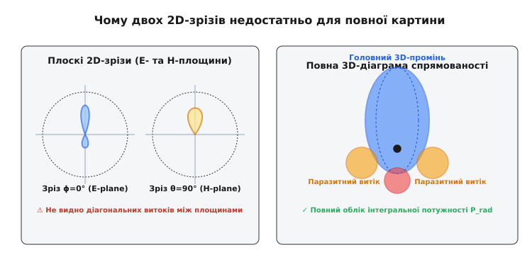
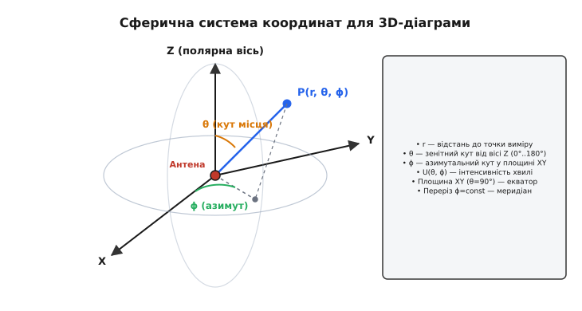
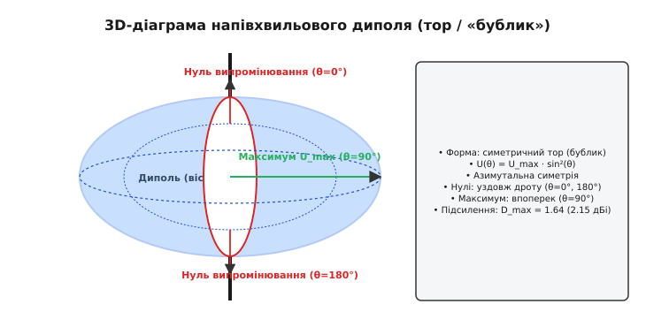
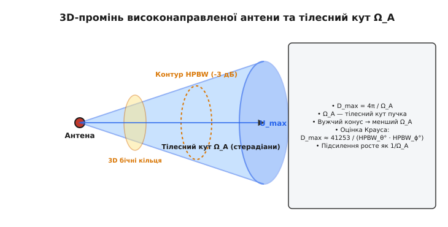
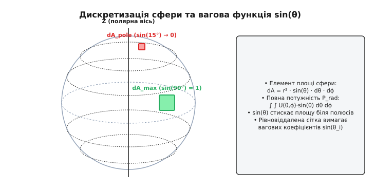

# Тривимірна діаграма спрямованості

<preknowlist>
- [Антена](topic:communications/antenna) — перетворення електричного струму на електромагнітну хвилю та принцип взаємності.
- [Підсилення антени](topic:communications/antenna-gain) — поняття діаграми спрямованості, пелюсток та еталонного ізотропного випромінювача.
- [Поляризація антени](topic:communications/antenna-polarization) — орієнтація вектора електричного поля E в просторі.
</preknowlist>

Коли безпілотник накреняється в квік-ролі на кут 45 градусів під час віражу, зв'язок із наземною станцією часто раптово зникає, хоча за двохвимірним паспортним графіком антени запас сигналу мав становити не менше 12 децибел. Причина такого провалу криється в ілюзії, яку створюють плоскі перерізи. Паспорт антени зазвичай містить два звичних графіки — вертикальний та горизонтальний зрізи. Проте електромагнітна хвиля поширюється у повному тривимірному об'ємі, і між двома ортогональними площинами можуть ховатися глибокі просторові нулі, паразитичні бокові витоки або поляризаційні розкриви. Без повного тривимірного розрахунку неможливо правильно оцінити ані точний бюджет радіолінії, ані завадозахищеність системи.

Тривимірна діаграма спрямованості (*3D radiation pattern*) — це повна просторова характеристика розподілу випромінюваної антенною енергії (або її чутливості на прийом) у кожному напрямку сфери, що оточує антену. Вона зв'язує геометрію простору з фізикою випромінювання й служить основою для обчислення повного інтегралу випромінюваної потужності та коефіцієнта спрямованої дії.

---

### Від плоских 2D-зрізів до просторового об'єму

У практичній радіотехніці роками послуговувалися двома плоскими графіками — так званими E-площиною (де лежить вектор електричного поля) та H-площиною (де лежить вектор магнітного поля). Для найпростіших симетричних антен, як-от вертикального диполя, цього справді достатньо: його випромінювання симетричне відносно вертикальної осі. Проте для сучасних антенних систем — патч-антен, спіралей, антен Яґі-Уда чи фазованих антенних решіток — випромінювання у діагональних напрямках (скажімо, при кутах `θ = 45°` та `ϕ = 45°`) суттєво відрізняється від випромінювання в головних координатних площинах.


*Плоскі 2D-перерізи (ліворуч) показують рівень випромінювання лише у двох відібраних площинах і пропускають діагональні витоки. Повна 3D-поверхня (праворуч) відображає справжній об'ємний розподіл енергії у просторі, дозволяючи врахувати всі бічні пелюстки та розрахувати точну інтегральну потужність.*

Виміряти лише два ортогональні зрізи й екстраполювати їх на весь простір — це все одно що намагатися оцінити складний рельєф гори за двома перпендикулярними розрізами карти. Фізика випромінювання у просторі визначається тривимірним розподілом струмів по поверхні чи об'єму антени. Коли ці струми мають складну просторову конфігурацію, фазові різниці між випромінюванням окремих ділянок створюють інтерференційну картину, яка різко змінюється при відході від головних осей.

Типові помилки та ризики, які виникають при відмові від 3D-аналізу:

1. **Необліковані діагональні бокові пелюстки.** На кутах, віддалених від головних осей (скажімо, в інтервалах між площинами E та H), можуть формуватися діагональні бокові пелюстки випромінювання. Вони створюють ненавмисні перешкоди сусіднім приймачам або стають каналом для перехоплення сигналу ворожою розвідкою.
2. **Помилка в обчисленні повної потужності.** Коефіцієнт спрямованої дії залежить від середньої випромінюваної потужності по всій сфері. Якщо інтегрувати потужність лише за двома зрізами, припускаючи азимутальну симетрію там, де її немає, підсилення антени буде обчислено з помилкою у 1–3 дБ, що неприпустимо при проектуванні супутникових або мікрохвильових ліній.
3. **Втрата зв'язку при зміні орієнтації у просторі.** У мобільних об'єктах (дрони, літаки, супутники, авто) кут між антенними системами постійно змінюється у трьох площинах. Знання повної 3D-поверхні дозволяє побудувати точну матрицю покриття для довільних кутів тангажу, крену та порскання.
4. **Поляризаційний розкрив у 3D.** При просторовому повороті антени змінюється не лише амплітуда поля, а й векторна орієнтація електричного поля `E`. Оцінка кросполяризаційного розрізнення (*Cross-Polarization Discrimination, XPD*) вимагає знання обох векторних компонент `E_θ` та `E_ϕ` у всьому 3D-конусі.

---

### Сферична система координат і кутові змінні

Для опису випромінювання у тривимірному просторі антену розміщують у початку сферичної системи координат `(r, θ, ϕ)`.


*Сферична система координат радіоінженера: точка P визначається радіусом r, зенітним кутом θ (від полярної осі Z) та азимутальним кутом ϕ (у площині XY). Положення векторів E та H описується ортами e_θ та e_ϕ.*

У цій системі координат кожна точка простору задається трьома величинами:

- **Радіус `r`** — відстань від початку координат (центру антени) до точки виміру. Вимірювання або обчислення діаграми виконують у так званій дальній зоні антени (*far field* або зоні Фраунгофера), де відстань задовольняє умову `r ≥ 2 · D_ant² / λ` (де `D_ant` — максимальний лінійний розмір антени, `λ` — довжина хвилі). У цій зоні хвиля стає практично плоскою сферичною, форма діаграми перестає залежати від `r`, а амплітуда поля спадає строго обернено пропорційно відстані `1/r`.
- **Зенітний (полярний) кут `θ`** (*zenith / polar angle*) — кут між вертикальною віссю `Z` та напрямком на точку `P`. Змінюється від `0°` (північний полюс, напрямок строго вгору вздовж осі `Z`) до `180°` (південний полюс, строго вниз). В аеронавігації, радіолокації та супутниковому зв'язку замість зенітного кута `θ` часто використовують кут місця (*elevation angle*) `θ_el = 90° - θ`, який відраховується від лінії горизонту `XY` вгору (`+90°`) або вниз (`-90°`).
- **Азимутальний кут `ϕ`** (*azimuth angle*) — кут у горизонтальній площині `XY`, відрахований від осі `X` проти годинникової стрілки. Змінюється від `0°` до `360°` (або від `-180°` до `+180°`).

Розподіл потужності у дальній зоні описують через **інтенсивність випромінювання** `U(θ, ϕ)` (*radiation intensity*), яка вимірюється у ватах на стерадіан (Вт/ср). Вона пов'язана з вектором напруженості електричного поля `E(θ, ϕ)` та площиною щільності потоку потужності (вектором Пойнтінга `W_rad`) співвідношенням:

```
W_rad(r, θ, ϕ) = |E(θ, ϕ)|² / (2 · η₀)        [Вт/м²]
U(θ, ϕ) = r² · W_rad(r, θ, ϕ) = |E(θ, ϕ)|² · r² / (2 · η₀)   [Вт/ср]
```

де `η₀ ≈ 377 Ом` (точніше `120·π Ом`) — хвильовий опір вільного простору (вакууму). Зверніть увагу: множник `r²` повністю компенсує сферичне розходження хвилі, роблячи функцію `U(θ, ϕ)` чисто кутовою характеристикою самої антени, що не залежить від відстані виміру.

Для повного опису векторного поля у кожній точці сфери напруженість електричного поля розкладають на дві ортогональні сферичні компоненти — `E_θ(θ, ϕ)` (полярна компонента) та `E_ϕ(θ, ϕ)` (азимутальна компонента):

```
|E(θ, ϕ)|² = |E_θ(θ, ϕ)|² + |E_ϕ(θ, ϕ)|²
```

За стандартним визначенням Людвіґа (*Ludwig's 3rd definition of polarization*) одна з цих компонент (або їхня лінійна комбінація) обирається як співполяризаційна (*co-polarization*, бажана орієнтація поля), а ортогональна до неї — як кросполяризаційна (*cross-polarization*, паразитна орієнтація). Тоді 3D-діаграма спрямованості розпадається на дві тривимірні поверхні: співполяризаційну `U_co(θ, ϕ)` та кросполяризаційну `U_cross(θ, ϕ)`.

---

### Повна випромінювана потужність і 3D-спрямованість

Найважливіше завдання 3D-діаграми спрямованості — це точний розрахунок **повної випромінюваної потужності** `P_rad` (*total radiated power*). Для цього необхідно проінтегрувати інтенсивність випромінювання `U(θ, ϕ)` по всій замкненій сфері, тобто по тілесному куту в `4·π` стерадіан.

Диференціал тілесного кута у сферичних координатах дорівнює:

```
dΩ = sin(θ) · dθ · dϕ   [стерадіан]
```

Звідси інтеграл повної потужності набуває вигляду:

```
P_rad = ∫₀²ᵖʰⁱ ∫₀ᵖʰⁱ U(θ, ϕ) · sin(θ) dθ dϕ   [Вт]
```

Знаючи повну потужність `P_rad`, розраховують середню інтенсивність випромінювання `U₀` — це та інтенсивність, яку мала б гіпотетична **ізотропна антена**, що випромінює ту саму потужність рівномірно в усі боки:

```
U₀ = P_rad / (4 · π)   [Вт/ср]
```

Тепер ми можемо дати строге математичне означення **коефіцієнта спрямованої дії (КСД)** або **3D-спрямованості** `D(θ, ϕ)` (*Directivity*) у довільному напрямку:

```
D(θ, ϕ) = U(θ, ϕ) / U₀ = 4 · π · U(θ, ϕ) / P_rad
```

Максимальна спрямованість `D_max` досягається у напрямку головного максимуму `U_max`:

```
D_max = 4 · π · U_max / P_rad
```

Децибельний еквівалент виражається у децибелах відносно ізотропного випромінювача (дБі):

```
D_dBi = 10 · log₁₀(D_max)
```

де детальні математичні виведення, аналітичні інтеграли для класичних антен та оціночні формули зведені у вставці [Обчислення 3D-спрямованості та тілесного кута](topic:communications/radiation-pattern-3d/math-3d-directivity.md).

Слід чітко розрізняти коефіцієнт спрямованої дії `D` та підсилення антени `G` (*Gain*). Підсилення враховує теплові втрати в матеріалах антени (провідниках та діелектриках) через коефіцієнт корисної дії (ККД) антени `η_ant`:

```
G(θ, ϕ) = η_ant · D(θ, ϕ)
```

Якщо антена не має внутрішніх втрат (`η_ant = 1` або 100%), то підсилення строго дорівнює спрямованості `G = D`. Для реальних антен `G ≤ D`.

Зв'язок між 3D-спрямованістю `D_max` та геометрією випромінювання можна подати через **еквівалентний тілесний кут променя** `Ω_A` (*beam solid angle*):

```
Ω_A = P_rad / U_max = ∫₀²ᵖʰⁱ ∫₀ᵖʰⁱ [ U(θ, ϕ) / U_max ] · sin(θ) dθ dϕ   [ср]
D_max = 4 · π / Ω_A
```

Фізичний зміст цього співвідношення простий і елегантний: якби всю випромінювану антенною енергію зібрати у рівномірний конус із постійною інтенсивністю `U_max`, то тілесний кут цього конуса дорівнював би `Ω_A`. Чим вужчий тривимірний промінь, тим менший тілесний кут `Ω_A`, і тим вища спрямованість антени.

---

### Типові 3D-профілі: від «бублика» диполя до «олівця» решітки

Залежно від фізичної конструкції та принципу роботи антени її тривимірна діаграма спрямованості набуває характерних просторових форм.

#### 1. Симетричний тор (напівхвильовий диполь)

Класичний напівхвильовий диполь, розташований вздовж осі `Z`, має функцію випромінювання, яка залежить лише від кута `θ` і не залежить від азимутального кута `ϕ`:

```
U(θ) = U_max · [ cos( (π/2) · cos(θ) ) / sin(θ) ]² ≈ U_max · sin³(θ)
```


*3D-поверхня спрямованості напівхвильового диполя має форму замкненого тора («бублика») без отвору в центрі. Уздовж осі дроту (θ = 0° та 180°) випромінювання строго дорівнює нулю, а максимум досягається в екваторіальній площині XY (θ = 90°).*

У тривимірному просторі ця функція формує симетричний тор («бублик»), пронизаний віссю `Z`. Головні особливості цього 3D-профілю:
- Вздовж провідника (`θ = 0°` та `θ = 180°`) випромінювання строго дорівнює нулю. Антена «не світить» зі своїх кінців.
- В екваторіальній площині (`θ = 90°`) спостерігається суцільний круглий максимум. У горизонтальній площині ця антена є повністю всебічною (*omnidirectional*).
- Точне значення 3D-спрямованості становить `D_max = 1.64` (або `2.15 дБі`).

#### 2. Півсферичний лоб (патч-антена)

Мікросмужкова патч-антена, змонтована на металевому екрані (*ground plane*), випромінює переважно в одну півсферу (`0° ≤ θ ≤ 90°`). Її 3D-діаграма нагадує купол або зрізану кулю, злегка витягнуту в E- або H-площині. Завдяки наявності екрана випромінювання в задню півсферу (`θ > 90°`) сильно пригнічене, утворюючи задній витік з рівнем `-15…-25 dB` відносно головного піку. Задньо-переднє відношення (*Front-to-Back Ratio, F/B*) для такої 3D-поверхні обчислюється як відношення максимуму у передній півсфері до максимуму у задньому конусі.

#### 3. Гострий 3D-промінь («голка» або «олівець»)

Параболічні дзеркальні антени великого діаметра або багатоелементні фазовані решітки формують вузький 3D-промінь (*pencil beam*).


*3D-промінь високонаправленої антени є видовженим витягнутим конусом. Навколо головного променя утворюються концентричні об'ємні кільця бокових пелюсток, розділені просторовими конусованими нулями.*

У 3D-вимірі такий промінь є витягнутим еліпсоїдним конусом. Навколо нього розташовуються концентричні тривимірні кільця бокових пелюсток, вираженість яких залежить від амплітудного розподілу струму по апертурі. Для таких антен точність наведення у двох кутових координатах `(θ, ϕ)` має критичне значення: відхилення всього на декілька мілірадіан виводить приймач за межі головного 3D-променя.

#### 4. Сканування променем у фазованих решітках (Phased Array Beam Steering)

У сучасних фазованих решітках (FAR / AESA) керування напрямком головного 3D-променя `(θ₀, ϕ₀)` здійснюється електронним шляхом — зміною фазового зсуву між випромінювальними елементами. 

При електронному відхиленні променя від нормалі до площини решітки у 3D-просторі відбуваються два важливі фізичні ефекти:
- **Розширення променя та падіння підсилення.** Ефективна площа апертури антени зменшується пропорційно `cos(θ₀)`. Внаслідок цього 3D-промінь розширюється, а підсилення падає приблизно як `10 · log₁₀(cos(θ₀))`.
- **Поява 3D-ґратчастих пелюсток (*Grating Lobes*).** Якщо крок між елементами решітки `d` перевищує половину довжини хвилі `λ/2`, при великих кутах сканування `θ₀` у 3D-просторі з'являються додаткові повнорозмірні максимуми — ґратчасті пелюстки. Вони виникають у вигляді повноцінних паразитичних 3D-конусів, що відбирають енергію у головного променя.

---

### Чисельне інтегрування та сітки вимірювання

У реальних умовах 3D-діаграму спрямованості отримують шляхом вимірювань у безвідлунній камері (*anechoic chamber*) за допомогою двокоординатного поворотного пристрою або шляхом чисельного електромагнітного моделювання (методом моментів MoM, методом скінченних елементів FEM або методом FDTD).

Результатом вимірювання чи розрахунку є дискретна матриця значень `U(θ_i, ϕ_j)` на кутовій сітці:

```
θ_i = i · Δθ,    i = 0, 1, 2, ..., N_θ
ϕ_j = j · Δϕ,    j = 0, 1, 2, ..., N_ϕ
```


*При дискретизації сфери рівновіддаленою сіткою (Δθ, Δϕ) площа елементарного осередку dA = r² · sin(θ) dθ dϕ зменшується при наближенні до полюсів (θ → 0° та 180°). Для точного чисельного інтегрування випромінюваної потужності необхідно застосовувати ваговому множнику sin(θ_i).*

Тут чигає математична пастка. Якщо обчислювати інтеграл повної потужності як просту суму значень `∑ ∑ U(θ_i, ϕ_j)`, результат буде категорично хибним.

Причина полягає в геометрії сфери: меридіани зближуються біля полюсів. Осередок сітки розміром `Δθ × Δϕ` біля екватора (`θ = 90°`) має максимальну фізичну площу, а біля полюсів (`θ → 0°`) розвужується до нуля. Одиниця площі на сфері пропорційна `sin(θ)`.

Для точного чисельного обчислення повної потужності `P_rad` за методом прямокутників чи трапецій використовують формулу з ваговою функцією `sin(θ_i)`:

```
P_rad ≈ Δθ · Δϕ · ∑ᵢ₌₀ᴺᵗʰᵉᵗᵃ⁻¹ ∑ⱼ₌₀ᴺᵖʰⁱ⁻¹ U(θ_i, ϕ_j) · sin(θ_i)
```

При застосуванні рівновіддаленої сітки `(Δθ, Δϕ)` вузли біля полюсів створюють так зване надмірне густування (*polar redundancy*). Для оптимізації вимірювань у безвідлунних камерах застосовують альтернативні методи дискретизації:
- **Сітка Фібоначчі на сфері** (*Fibonacci sphere grid*) — розподіляє `N` точок по сфері майже ідеально рівномірно, де кожна точка відповідає однаковій тілесній площі.
- **Гауссові квадратури Лебедєва** (*Lebedev quadrature*) — дозволяють обчислювати сферичні інтеграли з високою точністю за мінімальної кількості точок виміру.

#### Вимірювальні установки безвідлунних камер: Позиціонери Roll-over-Azimuth та Azimuth-over-Elevation

Механічне сканування 3D-діаграми у реальних безвідлунних вимірювальних камерах виконують за допомогою двокоординатних опорно-поворотних пристроїв (позиціонерів). За конструкцією поворотного механізму розрізняють дві основні кінематичні схеми:

1. **Схема Roll-over-Azimuth (Крен над азимутом).** Антена монтується на осі крену (*roll axis*), яка встановлена на поворотній платформі азимута (*azimuth axis*). При такій схемі полярна вісь сканування збігається з віссю крену. Перевагою цієї схеми є простота геометрії та постійна орієнтація антени відносно вимірювального рогу у полюсах, проте при великогабаритних антенах виникає механічний консольний зсув.
2. **Схема Azimuth-over-Elevation (Азимут над кутом місця).** Поворотна азимутальна платформа встановлюється на рамці кута місця. Ця схема є більш стійкою для важких антенних масивів та дзеркал, але вимагає математичного перерахунку координат із механічних кутів позиціонера `(α_az, β_el)` у стандартні сферичні координати `(θ, ϕ)` за формулами кінематичної матриці повороту:
   ```
   cos(θ) = cos(β_el) · cos(α_az)
   tan(ϕ) = tan(β_el) / sin(α_az)
   ```

Окрім амплітуди поля, сучасні сферичні сканери вимірюють і фазовий профіль `Φ(θ, ϕ)`. Це дозволяє обчислити просторове положення **фазового центра антени** — точки, відносно якої випромінювана хвиля має найбільш ідеальний сферичний фронт. Для складних комбінованих антен фазовий центр не є фіксованою точкою і змінюється при переході від головного променя до бокових пелюсток.

Алгоритм чисельного інтегрування та розрахунку підсилення мовами C та C++ наведено у вставці [Інтегратор 3D-діаграми та розрахунок підсилення](topic:communications/radiation-pattern-3d/proj-pattern-integrator.md).


---

### Візуалізація та експорт 3D-діаграм

Для наочного представлення складних 3D-діаграм спрямованості у сучасних САПР (CST Studio, Ansys HFSS, FEKO, Altair) використовують три основні методи графічного відображення:

1. **Тривимірна ізометрична поверхня (*3D Surface Plot*).** Радіус поверхні від початку координат у напрямку `(θ, ϕ)` пропорційний значенню `U(θ, ϕ)` (або коефіцієнту підсилення у дБі). Для покращення сприйняття поверхню розфарбовують псевдокольоровою гамою (від синього для нулів до червоного для головного максимуму).
2. **УФ-проекція або картографічна проекція (*UV-map / Polar Contour*).** Сферичні координати проектуються на площину за допомогою напрямних косинусів:
   ```
   u = sin(θ) · cos(ϕ)
   v = sin(θ) · sin(ϕ)
   ```
   Усередині одиничного кола `u² + v² ≤ 1` будується контурна карта підсилення. Цей спосіб дуже зручний для аналізу фазованих решіток, оскільки при відхиленні променю форма пелюстки у координатах `(u, v)` майже не спотворюється.
3. **Експорт у форматі неструктурованих 3D-сіток (VTK / VTU).** Для передачі даних між системами електромагнітного моделювання та зовнішніми графічними рушіями (ParaView, Blender, OpenGL-візуалізатори) 3D-діаграми зберігають у стандартних XML-форматах VTK.

> 🔧 **Навіщо це у розробці.**
> Під час проектування систем зв'язку для БПЛА або супутників Cubesat інженер імпортує 3D-діаграму антени у форматі VTU або CSV безпосередньо в польотний симулятор. Під час симуляції гальмівних маневрів або обертання апарата програма в реальному часі вираховує точний кут між вектором на наземну станцію та віссю антени `(θ(t), ϕ(t))` і зчитує з 3D-матриці фактичне підсилення. Це дозволяє заздалегідь виявити моменти втрати зв'язку через затінення корпусом або вихід у нуль діаграми.

Специфікацію структур даних та приклад формату VTU детально розібрано у вставці [Специфікація формату VTU для 3D-діаграм](topic:communications/radiation-pattern-3d/api-vtu-export.md).

---

### Практичний інженерний розрахунок у рухомих системах

Розглянемо практичний приклад, що демонструє критичну важливість 3D-діаграми спрямованості у радіолінії зв'язку між наземним терміналом та БПЛА.

Нехай на БПЛА встановлено патч-антену із наступними характеристиками:
- Напрямок головного максимуму: строго вниз уздовж осі Z (`θ = 0°`, `G_max = +6.0 дБі`).
- Ширина променя по рівню -3 дБ: `HPBW = 70°` (тобто при `θ = 35°` підсилення спадає до `+3.0 дБі`).
- При куті `θ = 60°` та азимуті `ϕ = 45°` (діагональний напрямок) підсилення за 3D-діаграмою становить всього `-4.5 дБі` через наявність діагонального провалу.

Припустимо, БПЛА знаходиться на відстані `10 км` від станції, а кренуючий маневр розвертає вектор на наземний термінал саме під кути `θ = 60°`, `ϕ = 45°`.

Обчислимо зміну потужності сигналу на вході приймача:

```
ΔG = G(60°, 45°) - G_max       [різниця підсилення антени у відхиленому та головному напрямках]
= -4.5 дБі - (+6.0 дБі)        [підстановка значень з 3D-діаграми для поточних кутів]
= -10.5 дБ                      [підсумкове ослаблення сигналу на вході приймача]
```

Якщо інженер розраховував бюджет лінії лише за плоским 2D-зрізом H-площини (де при `θ = 60°` паспорт показував `-1.0 дБі`), він очікував послаблення лише на `-7.0 дБ`. Додаткове діагональне ослаблення у `-3.5 дБ` може виявитися вирішальним і призвести до зриву декодування сигналу та втрати телеметрії.

Саме тому сучасне проектування антенних систем для авіації, космонавтики, робототехніки та мобільного зв'язку 5G/6G (Massive MIMO) принципово спирається на тривимірний аналіз діаграм спрямованості. Повна 3D-поверхня зв'язує просторову геометрію руху об'єкта з векторною природою електромагнітного поля, забезпечуючи надійний і передбачуваний зв'язок у будь-якому положенні.
