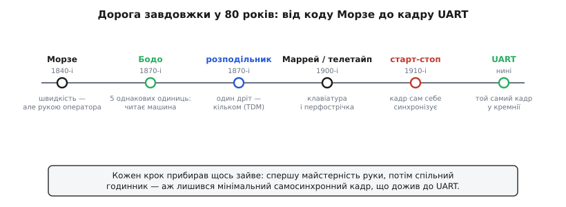
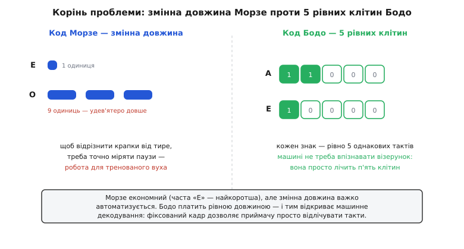
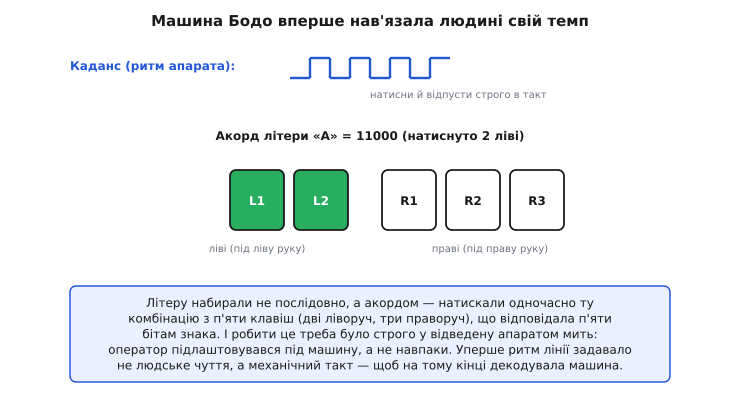
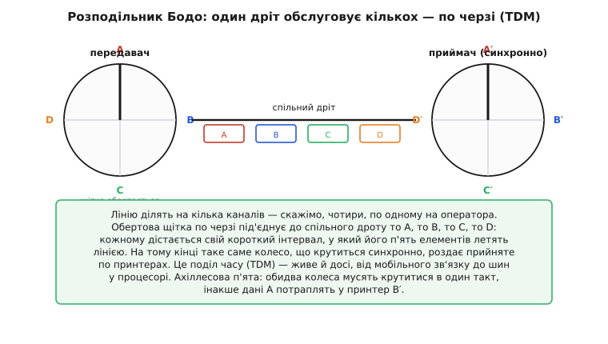
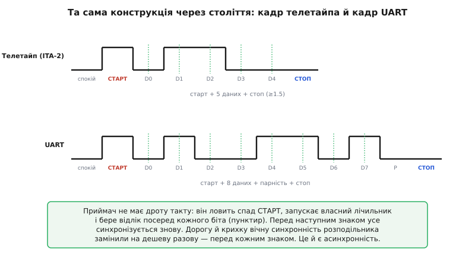
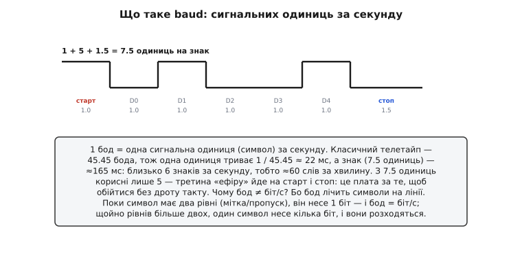

# 📜 Бодо, телеграф і народження асинхронної передачі

> 📜 Історична вставка про те, звідки взялася асинхронна послідовна передача й кадр [UART](topic:communications/uart-frame): від коду Морзе через телеграф Бодо до старт-стоп-сигналізації телетайпа.

Коли ти вперше пишеш `Serial.begin(9600)`, ти, сам того не знаючи, віддаєш шану людині, яка померла за пів століття до першого комп'ютера. Слово **baud** — це прізвище. А той дивний кадр, з якого складається кожен байт у послідовній лінії — спокій, **старт-біт**, кілька біт даних, можливо парність, **стоп-біт**, — не вигадав інженер із напівпровідникової фірми. Його винайшли механіки на зламі XIX і XX століть, щоб дві друкарські машинки могли «розмовляти» через дріт без жодного спільного годинника між ними.

[UART](topic:communications/uart-frame) здається такою дрібною, «службовою» річчю, що про неї не думаєш. Та насправді її кадр — це **скам'янілість**: майже незмінений відбиток рішень, які приймали люди, що передавали літери струмом по мідному дроту через цілий континент. І щоб по-справжньому зрозуміти його — чому передаємо **послідовно**, чому **асинхронно**, чому потрібен **старт-біт** і звідки взялася сама одиниця швидкості, — варто пройти той самий ланцюг питань, який привів від коду Морзе до кремнієвого приймача в мікроконтролері.

Це не довідник «хто що винайшов». Це ланцюг **рішень**: кожен крок прибирав щось зайве — спершу майстерність руки, потім спільний годинник, — аж лишився той мінімальний кадр, який ти задаєш одним рядком коду.


*Дорога завдовжки у 80 років. Морзе дав швидкість, але прив'язав її до вправності оператора. Бодо замінив віртуозність на машинну рівномірність (5 однакових одиниць). Розподільник навчив один дріт обслуговувати кількох. Маррей і телетайп дали клавіатуру. А старт-стоп-сигналізація зробила кадр самосинхронним — і саме він дожив до UART.*

---

## Телеграф до Бодо: швидкість ціною майстерності

Перший практичний електричний телеграф (**Семюел Морзе**, *Samuel Morse*, та його помічник **Альфред Вейл**, *Alfred Vail*, 1837–1844) був геніально простий: одна лінія, один ключ, і повідомлення передається **тривалістю** замикань. Коротке замикання — крапка, утричі довше — тире; з комбінацій крапок і тире склали літери. Знаменита перша депеша «What hath God wrought» побігла дротом 1844 року, і світ уперше відчув, що відстань більше не дорівнює часу.

Та в самій елегантності коду Морзе ховалася його межа. Подивімося уважно: різні літери мають **різну довжину**. «E» — це одна крапка, найкоротший символ, бо це найчастіша літера англійської (вже тут — зародок ідеї стиснення). А «O» — три тире, удев'ятеро довше. Між символами треба витримувати паузу, між словами — довшу паузу. Усе це — **аналогова гра тривалостями**, яку на тому кінці лінії розшифровувало людське вухо.


*Корінь проблеми. Ліворуч: у Морзе «E» займає одну одиницю, «O» — дев'ять; довжина гуляє, і щоб відрізнити три крапки від тире, треба точно міряти паузи — це робота для тренованого оператора. Праворуч: у Бодо кожен знак — рівно п'ять однакових клітин. Машині не треба впізнавати візерунок: вона просто лічить п'ять однакових тактів.*

Наслідок був практичний і дорогий. Швидкість лінії впиралася в **людину**. Добрий телеграфіст вистукував і приймав десь 20–30 слів за хвилину, ставав цінним фахівцем, якого довго навчали, і його вухо було вузьким місцем усієї системи. Лінію — дорогу мідну лінію через пів країни — займав один оператор, а її пропускна здатність простоювала в паузах між його натисканнями.

Постало два питання, які й рухали все далі. **Перше:** чи можна зробити код таким, щоб його читала не людина, а **машина** — без віртуозного вуха? **Друге:** чи можна на одну дорогу лінію посадити **кількох** операторів, щоб вона не простоювала? На обидва відповів один француз.

> 🔧 **Навіщо це.** Тут зародилося розрізнення, яке проходить через увесь послідовний зв'язок: **змінна довжина проти фіксованої**. Морзе — змінна (важко автоматизувати, але економно). [UART](topic:communications/uart-frame) — фіксована: рівно стільки біт на кадр, скільки ти налаштував. Саме фіксованість дозволяє приймачу не «вгадувати», де кінець символу, а просто **відлічувати такти** — те, що так легко робити кремнію й так важко — вуху.

---

## Еміль Бодо: рівномірність замість віртуозності

**Жан-Моріс-Еміль Бодо** (*Jean-Maurice-Émile Baudot*, 1845–1903) не був ні професором, ні багатим винахідником. Син фермера, він пішов працювати в французьку телеграфну адміністрацію простим службовцем і освіту з електрики здобував переважно сам, ночами. І саме він близько 1870 року зробив крок, який сьогодні ми назвали б переходом від аналогового до **цифрового** мислення про передачу.

Ідея Бодо: відмовитися від змінної довжини взагалі. Хай **кожен** знак кодується однаковою кількістю елементів — **п'ятьма**. Кожен елемент має лише два стани: струм є або струму немає (пізніше їх назвуть **мітка**, *mark*, і **пропуск**, *space*). П'ять двійкових елементів дають 2⁵ = **32** комбінації — досить для 26 літер абетки з запасом на цифри й службові знаки. Це по суті **п'ятибітне [двійкове число](topic:math/why-binary) на кожну літеру** — за десятиліття до того, як з'явилося слово «біт».

Тепер найголовніше — **як** оператор уводив ці п'ять елементів. Не ключем Морзе, а особливою **клавіатурою на п'ять клавіш**: дві під ліву руку, три під праву. Літеру набирали **акордом** — натискали одночасно ту комбінацію клавіш, що відповідала п'яти бітам знака.


*Машина Бодо вперше нав'язала людині свій темп. П'ять клавіш (2 + 3) набирають акорд — приклад показує літеру «A» = 11000. А вгорі — каданс: апарат подавав операторові ритмічний сигнал, і той мусив натискати й відпускати клавіші строго в такт. Не людина диктує темп лінії, а лінія — людині.*

Цей **каданс** (*cadence*) — найдивовижніша й найважливіша деталь. Оператор не міг тиснути клавіші коли заманеться. Апарат подавав йому регулярний сигнал — і телеграфіст мусив підготувати наступний акорд і натиснути його точно у відведений момент, а тоді відпустити. Він підлаштовувався **під машину**, а не навпаки. Уперше в історії зв'язку ритм передачі задавало не людське чуття, а механічний такт.

Навіщо така муштра? Бо на тому кінці лінії стояв пристрій, який читав ці п'ять елементів строго у свої моменти часу. Якщо оператор «з'їжджав» з ритму, елементи потрапляли не в ті позиції, і літера спотворювалася. Сувора рівномірність була ціною за те, щоб **машина**, а не вухо, могла декодувати сигнал.

> 🔧 **Навіщо це.** Ось де вперше з'являється головна дійова особа всього послідовного зв'язку — **такт**. У Бодо за такт відповідала дисципліна оператора. У синхронних шинах ([SPI](topic:communications/spi-bus), [I2C](topic:communications/i2c-bus)) за нього відповідає окремий **дріт такту**. А [UART](topic:communications/uart-frame) робить третій, найхитріший вибір — обходиться без дроту такту. Головне тут: **передача даних — це завжди питання, хто і як задає такт.**

---

## Один дріт на кількох: розподільник і поділ часу

Лишалося друге питання — дорога лінія простоює. І тут Бодо зробив другий винахід, наслідки якого сягають сучасних оптоволоконних магістралей. Він поставив на кожному кінці лінії **розподільник** (*distributeur*) — обертовий комутатор зі щіткою, що пробігала по секторах, наче стрілка по циферблату.

Лінію поділили на кілька каналів — скажімо, чотири, по одному на оператора. Щітка розподільника, обертаючись, по черзі **під'єднувала** до спільної лінії то першого оператора, то другого, то третього, то четвертого — кожному діставався свій короткий проміжок часу, у який його п'ять елементів летіли дротом. На приймальному боці стояв **такий самий** розподільник, що обертався **синхронно**, і роздавав прийняті групи елементів по чотирьох друкарських апаратах.


*Народження поділу часу (TDM). Обертова щітка віддає спільний дріт операторам A, B, C, D по черзі — кожному на свій інтервал. На тому кінці синхронне колесо роздає прийняте по принтерах. Ціна методу — жорстка вимога: обидва колеса мусять крутитися в один такт, інакше дані оператора A потраплять у принтер B′.*

Це і є **поділ часу** (*time-division multiplexing*, TDM) — ідея, що дожила до наших днів і працює сьогодні всюди, від мобільного зв'язку до шин усередині процесора. Замість тягти чотири дроти, ми тягнемо один і **ділимо його в часі**, даючи кожному учаснику регулярний інтервал.

Система Бодо запрацювала на французькому телеграфі в середині 1870-х і виявилася настільки вдалою, що поширилася на інші країни і протрималася десятиліттями. Але зверніть увагу на її ахіллесову п'яту, яку добре видно на рисунку: **синхронність кінців**. Два розподільники мусили обертатися ідеально злагоджено. Варто одному відстати — і вся розшифровка «з'їжджає»: літери валяться не в ті канали. Уся конструкція трималася на тому, що передавач і приймач весь час «крутяться в ногу».

> 🔧 **Навіщо це.** Ця проблема ключова для розуміння, **чому** [UART](topic:communications/uart-frame) влаштований саме так. Синхронна передача (як у Бодо, як і в [SPI](topic:communications/spi-bus)) вимагає, щоб сторони весь час трималися спільного такту. Це потужно, але крихко й дорого: треба або зайвий дріт такту, або бездоганно однакові «колеса». UART виростає саме з питання: а чи можна **позбутися** цієї вічної синхронності — і платити за такт лише зрідка, на початку кожної літери?

---

## Від акордів до клавіатури: Маррей і телетайп

Система Бодо мала людську ваду: каданс. Тримати оператора прив'язаним до машинного ритму, та ще й змушувати його думати акордами п'яти клавіш, — це втомливо й повільно у навчанні. Наступний крок зробив новозеландець **Дональд Маррей** (*Donald Murray*) близько 1901 року, і зробив його з боку, з якого ніхто не чекав, — з боку **звичайної друкарської машинки**.

Маррей міркував так: оператор уже вміє друкувати на клавіатурі «QWERTY», навіщо перевчати його на акорди? Хай натискає звичні літерні клавіші, а **машина сама** перетворює натиск на потрібну п'ятиелементну комбінацію. Щоб розв'язати темп людини й темп лінії, Маррей увів проміжний носій — **перфострічку** (*punched tape*): оператор спокійно набивав на ній дірочки (п'ять позицій упоперек = п'ять елементів), а вже потім окремий механізм **рівномірно** прогонив стрічку через передавач. Тепер людині не треба було тримати каданс — ритм забезпечувала стрічка.

Маррей заразом **перетасував** код Бодо: він призначив найкоротші у механічному сенсі (з найменшою кількістю пробивань) комбінації найчастішим літерам, щоб менше зношувати апаратуру. Цей перероблений код — «код Бодо–Маррея» — ліг в основу міжнародного стандарту, відомого як **ITA-2** (*International Telegraph Alphabet No. 2*), — той самий п'ятиелементний код, показаний праворуч на рисунку вище. Саме ITA-2 десятиліттями возили телетайпи всього світу.

А **телетайп** (*teletypewriter*, скорочено TTY) — це і є кінцева форма цієї лінії: друкарська машинка, що друкує те, що набрали за тисячі кілометрів. У США його довели до серійного апарата брати **Крам** (*Charles Krum* і його син *Howard Krum*) разом із компанією Morkrum у 1900–1910-х роках. Телетайпи стануть на десятиліття стандартним способом, яким машини обмінювалися текстом, — і саме від них комп'ютерна епоха успадкує і слово «термінал», і навіть назву пристрою `tty`, яку й досі можна побачити в системах на кшталт Linux. Але головний їхній спадок — інший.

---

## Старт-стоп: кадр, що сам себе синхронізує

Ось ми й дійшли до серця всієї історії — до винаходу, який дослівно живе в кожному [UART](topic:communications/uart-frame). У розподільника була своя біда: передавач і приймач мусили **весь час** обертатися синхронно. Це дорого і ненадійно. Як телетайпу зв'язатися з телетайпом без спільного годинника й без вічної гонитви за синхронністю?

Відповідь, яку зазвичай пов'язують із **Говардом Крамом** (*Howard Krum*; заявку на старт-стоп-метод подано 1910 року, патент видано 1918-го), геніальна у своїй ощадливості. Не треба тримати кінці синхронними **завжди**. Досить синхронізувати їх **на одну літеру за раз** — і робити це наново перед кожним знаком.

Працює це так. Коли лінія мовчить, вона тримається у стані **мітка** (умовно «1», є струм). Щоб надіслати знак, передавач спершу кидає лінію в **пропуск** («0») рівно на одну одиницю — це **старт-біт** (*start bit*). Цей перепад «мітка→пропуск» — як постріл стартового пістолета: він каже приймачеві «увага, зараз почнуться дані». Приймач, упіймавши цей спад, **запускає власний лічильник** і далі бере відліки сам, через рівні проміжки — посередині кожного наступного елемента. Після п'яти (у телетайпі) елементів даних передавач піднімає лінію назад у **мітку** щонайменше на півтори одиниці — це **стоп-біт** (*stop bit*), який гарантує, що перед наступним стартом лінія точно повернулася у спокій.


*Та сама конструкція через століття. Угорі — старт-стоп-кадр телетайпа (ITA-2: старт + 5 даних + стоп ≥ 1.5). Унизу — кадр UART (старт + 8 даних + парність + стоп). Приймач не має дроту такту: він ловить спад СТАРТ, запускає свій лічильник і бере відлік посередині кожного біта (пунктир). Перед наступним знаком усе синхронізується знову.*

У цьому й уся хитрість, яку варто прочути до кінця. Приймачеві **не потрібен спільний дріт такту**. Йому досить мати власний годинник *приблизно* тієї самої частоти — і **щознаку** наново вирівнюватися по старт-біту. Розсинхрон не встигає накопичитися, бо його скидають на початку кожної літери: треба, щоб годинники не розійшлися лише на час одного коротенького кадру (сім-вісім елементів), а не назавжди. Це **асинхронна** передача (*asynchronous*): «а-синхронна» означає саме «без постійного спільного такту».

Порівняйте з розподільником Бодо — і відчуйте, який це стрибок. Там два колеса мусили крутитися в ногу **нескінченно**. Тут — кожна літера сама приносить свій крихітний сигнал синхронізації (старт-біт) і сама його закриває (стоп-біт). Дорогу й крихку вічну синхронність замінили на дешеву разову — перед кожним знаком.

> 🔧 **Навіщо це.** Нижній кадр на рисунку вище — це **буквально** те, що ти налаштовуєш у `Serial.begin()` і що по кісточках розбирає тема [кадру UART](topic:communications/uart-frame). Звідси одразу випливають дві найпрактичніші речі курсу. **Перше:** UART — це лише два дроти даних (TX і RX), **без** дроту такту, — бо такт відновлюють зі старт-біта. **Друге:** саме тому обидві сторони мусять **заздалегідь домовитися про швидкість** (baud): приймач відлічує біти за власним годинником, і якщо передавач шле їх з іншою швидкістю — відліки «попливуть» і дані розсиплються. Класичне «у терміналі замість тексту крякозябри» — це майже завжди неправильний baud.

---

## Звідки слово «baud»

Лишилося закрити останнє питання — саме те, з якого ми почали. У 1920-х роках, коли телеграфні адміністрації світу узгоджували спільні стандарти, постала потреба в одиниці **швидкості сигналізації** — скільки елементарних посилок лінія передає за секунду. На міжнародній телеграфній конференції 1926 року цю одиницю назвали **бод** (*baud*) — на честь Еміля Бодо, який на той час уже понад двадцять років як помер у бідності, так і не діставшись слави.

Сенс одиниці точний: **1 бод = одна сигнальна одиниця (символ) за секунду**. Класичний телетайп працював на швидкості **45.45 бода** — звідси й знамениті «60 слів за хвилину». Перевіримо це число, бо в ньому — уся арифметика кадру.


*Розклад одного телетайпного знака: старт (1) + п'ять даних (5) + стоп (1.5) = 7.5 одиниць. При 45.45 бода одна одиниця триває ≈ 22 мс, тож знак займає ≈ 165 мс. Звідси — близько 6 знаків за секунду, тобто ≈ 60 слів за хвилину.*

**Приклад (звідки «60 слів за хвилину»).** Порахуймо пропускну здатність телетайпа на 45.45 бода:

```
тривалість однієї одиниці = 1 / 45.45 бода ≈ 0.0220 с = 22.0 мс
один знак (ITA-2) = 1 старт + 5 даних + 1.5 стоп = 7.5 одиниць
час одного знака = 7.5 × 22.0 мс ≈ 165 мс
знаків за секунду = 1 / 0.165 с ≈ 6.06 знака/с
при ≈ 6 знаках на слово: 6.06 × 60 / 6 ≈ 60.6 слова/хв
```

Ось вони, ті самі «60 слів за хвилину». Зверніть увагу, наскільки дорого коштувала надійність: із 7.5 одиниць кадру корисними були лише **5** (дані), а 2.5 йшли на службові старт і стоп. Третина «ефіру» — на синхронізацію. Це вічний компроміс послідовного зв'язку: службові біти кадру — це накладні витрати, які ми платимо за те, щоб обійтися без дроту такту.

І останнє, найтонше. Чому ж кажуть, що **бод — це не завжди те саме, що біт за секунду**? Бо бод рахує **символи на лінії**, а не біти інформації. У телетайпі (та й у простому UART) символ має лише два рівні — мітка або пропуск, — тож один символ несе рівно один біт, і тоді 1 бод = 1 біт/с. Саме тому `Serial.begin(9600)` — це і 9600 бод, і 9600 біт/с одночасно: ніякої різниці немає. Але щойно символ дістає **більше за два** рівні (а саме так передають дані по радіо й по сучасних дротах), один символ починає нести кілька біт — і бод із біт/с розходяться. Це, однак, уже зовсім інша розмова — про [модуляцію](topic:communications/why-modulation).

> 🔧 **Навіщо це.** Тепер `Serial.begin(9600)` читається інакше. **9600** — це 9600 сигнальних одиниць за секунду, одиниця названа на честь Бодо, а сам спосіб «спокій → старт → дані → стоп» прийшов із телетайпа. Знати, що для простого UART бод і біт/с збігаються, — практично: можна швидко прикинути, що байт (10 елементів кадру: старт + 8 даних + стоп) на 9600 бода летить ≈ 1.04 мс, тобто лінія тягне приблизно 960 байт/с. Така оцінка «на серветці» рятує, коли вирішуєш, чи встигне давач віддати свій потік.

---

## Що з цього лишилося в кадрі UART

Відмотаймо весь ланцюг назад — і побачимо, що сучасний UART зібраний майже цілком зі старих деталей, кожна з яких розв'язувала своє питання:

- **Фіксована довжина** кадру (стільки-то біт даних) — це спадок **Бодо**, який замінив мінливий код Морзе на п'ять однакових одиниць, щоб декодувала **машина**, а не вухо.
- **Два рівні** — мітка й пропуск — це той самий бінарний сигнал, що його в електроніці звуть [логічними рівнями](topic:electronics/logic-levels-as-ranges), у яких пороги «0» і «1» — це діапазони напруги.
- **Старт-біт і стоп-біт** — спадок **старт-стоп-телетайпа** Крама: вони роблять кадр **самосинхронним**, тож спільний дріт такту не потрібен.
- **Асинхронність** — це свідома відмова від вічної синхронності розподільника **Бодо** на користь разової синхронізації перед кожним знаком.
- **Baud** — це ім'я Бодо, що стало одиницею швидкості; для простого UART воно ж і біт/с.

А головне — лишилася **логіка**, яку варто тримати в голові, беручись за послідовний зв'язок. Будь-яка послідовна передача зводиться до одного питання: **хто задає такт і як приймач знає, де починається й закінчується кожен біт?** Морзе клав це на вухо оператора. Бодо — на синхронні колеса. Телетайп придумав найдешевшу відповідь: хай кожен знак сам приносить свій старт-біт. Саме цю відповідь і втілює [UART](topic:communications/uart-frame) — а її протилежність, передачу з окремим дротом такту, утілюють синхронні шини [I2C](topic:communications/i2c-bus) та [SPI](topic:communications/spi-bus).

Цей телеграфний родовід і пояснює, чому [кадр UART](topic:communications/uart-frame) виглядає саме так: чому передаємо послідовно й асинхронно, звідки в ньому старт-біт і стоп-біт, і чому дві мікросхеми мусять заздалегідь домовитися про швидкість, аби надійно зрозуміти одна одну.
