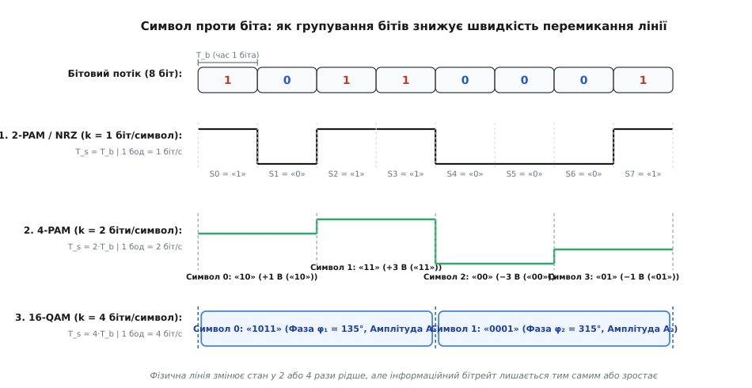

# 🧮 Межі Найквіста і Шенона-Гартлі: смуга, шум і спектральна ефективність

Швидкість передачі інформації фізичним каналом обмежена двома фундаментальними законами природи: обмеженістю частотної смуги пропускання аналогового середовища та наявністю неминучого теплового шуму. Перше обмеження встановлює максимальну частоту перемикання фізичних станів (бодову швидкість) без взаємного накладання імпульсів. Друге обмеження визначає, скільки різних станів (рівнів напруги або точок фазово-амплітудного сузір'я) можна надійно розрізнити на фоні шумів, тобто скільки бітів інформації здатен перенести один фізичний символ. Математичний зв'язок між цими величинами виражається через формулу Найквіста для ідеального каналу та теорему Шенона-Гартлі для каналу з шумом.

### Межа Найквіста для безшумного каналу

У 1928 році американський фізик і теоретик зв'язку Гаррі Найквіст дослідив проходження електричних імпульсів крізь ідеальний фільтр низьких частот зі смугою пропускання `B` герців. Будь-який прямокутний імпульс на вході такого фільтра на виході «розпливається» у часі, набуваючи форми функції відліків (sinc-імпульсу):

```
h(t) = sinc(2Bt) = sin(2πBt) / (2πBt)
```

Функція `sinc(2Bt)` має ключову математичну властивість: вона досягає одиничного максимуму при `t = 0` і перетворюється на нуль у всіх дискретних точках часу:

```
t = n / (2B),  де n = ±1, ±2, ±3, ...
```

Якщо передавати послідовність імпульсів з інтервалом часу між ними рівно `T_s = 1 / (2B)`, то у моменти зчитування кожного окремого імпульсу хвости всіх попередніх та наступних імпульсів дорівнюють нулю. Це явище називають **першим критерієм Найквіста**: за умови тактового інтервалу `T_s = 1 / (2B)` міжсимвольна інтерференція (англ. *Inter-Symbol Interference*, ISI) повністю відсутня.


*Кожен імпульс у момент свого стробування має максимальну амплітуду, тоді як внесок усіх сусідніх імпульсів дорівнює нулю.*

Звідси випливає максимальна бодова швидкість (символ-рейт) `R_s` для смуги `B`:

```
R_s = 1 / T_s = 2B  [бод]
```

Якщо кожен переданий символ може набувати одного з `M` дискретних і точно помітних фізичних станів (наприклад, `M` різних рівнів напруги в амплітудній модуляції M-PAM), то кожен символ кодує `k` бітів двійкової інформації:

```
k = log₂(M)  [біт/символ]
```

Тоді максимальна інформаційна ємність (бітрейт) ідеального каналу без шуму описується класичною **формулою Найквіста**:

```
C_Nyquist = R_s · k
          = 2B · log₂(M)  [біт/с]
```

**Покроковий розрахунок бітрейту Найквіста для каналу зі смугою B = 1 МГц:**

```
M = 2 (двійковий сигнал NRZ):
C = 2 · 1 000 000 · log₂(2)
  = 2 000 000 · 1              [1 біт на символ]
  = 2.0 Мбіт/с

M = 4 (чотирирівневий 4-PAM / QPSK):
C = 2 · 1 000 000 · log₂(4)
  = 2 000 000 · 2              [2 біти на символ]
  = 4.0 Мбіт/с

M = 16 (16-QAM):
C = 2 · 1 000 000 · log₂(16)
  = 2 000 000 · 4              [4 біти на символ]
  = 8.0 Мбіт/с

M = 256 (256-QAM):
C = 2 · 1 000 000 · log₂(256)
  = 2 000 000 · 8              [8 бітів на символ]
  = 16.0 Мбіт/с
```

Формула Найквіста стверджує: якщо шум відсутній, бітрейт можна нарощувати нескінченно при фіксованій смузі `B`, просто збільшуючи кількість дискретних станів `M`.

### Фізична реалізація фільтрації: піднесений косинус і спад α

Ідеальний прямокутний фільтр низьких частот, що породжує точні sinc-імпульси, фізично нереалізовний, оскільки його імпульсна характеристика нескінченна в часі (починається з `t = -∞`) і спадає дуже повільно — пропорційно `1 / t`. Найменше тремтіння тактового генератора (фазовий джитер) або зміщення моменту стробування призводить до того, що ненульові хвости нескінченної кількості сусідніх імпульсів додаються і руйнують прийом.

На практиці використовують фільтри формувальної фільтрації з характеристикою **піднесеного косинуса** (англ. *Raised Cosine*, RC) або пару узгоджених фільтрів із характеристикою **кореня з піднесеного косинуса** (англ. *Root-Raised Cosine*, RRC) на передавачі та приймачі. Їхня імпульсна характеристика спадає набагато швидше — пропорційно `1 / t³`.

За це прискорення доводиться платити розширенням смуги пропускання. Якщо коефіцієнт скруглення (roll-off factor) позначити як `α` (де `0 ≤ α ≤ 1`), то необхідна фізична смуга каналу для передачі швидкості `R_s` становить:

```
B = (1 + α) · (R_s / 2)  [Гц]
```

Звідси реальна бодова швидкість у смузі `B` дорівнює:

```
R_s = 2B / (1 + α)  [бод]
```

Якщо `α = 0`, ми повертаємося до ідеального фільтра Найквіста (`R_s = 2B`), проте маємо нескінченні хвости та високу чутливість до джитеру. При `α = 0.25` (типове значення для супутникового зв'язку DVB-S2 та модемів) смуга зростає на 25%, а бодова швидкість становить `R_s = 2B / 1.25 = 1.6B`. При `α = 1.0` смуга подвоюється (`R_s = B`), зате перехідні процеси загасають практично миттєво.

### Геометрія Шенона: виведення теореми через пакування сфер у N-вимірному просторі

У 1948 році Клод Шенон у роботі «Математична теорія зв'язку» запропонував елегантне геометричне доведення теореми пропускної здатності, відоме як **метод пакування сфер** (англ. *Sphere Packing*).

Розглянемо сигнал тривалістю `T` секунд, що проходить крізь смугу `B` герців. За теоремою відліків Найквіста, такий сигнал повністю описується `D = 2 · B · T` незалежними відліками. Отже, будь-який переданий сигнал можна зобразити у вигляді однієї точки у `D`-вимірному евклідовому просторі.

Якщо середня потужність передавача дорівнює `S`, то сумарна енергія переданого сигналу за час `T` становить `E_s = S · T`. У `D`-вимірному просторі квадрат відстані від початку координат до точки сигналу дорівнює енергії:

```
∑ [i=1 .. D] x[i]² = 2 · B · T · S
```

Усі можливі передані кодові слова лежать усередині `D`-вимірної сфери передавача радіусом `R_sig = √(2 · B · T · S)`.

Під час проходження каналом до сигналу додається незалежний білий гаусовий шум потужністю `N`. Енергія шуму за час `T` становить `E_n = N · T`, що формує радіус сфери шуму `R_noise = √(2 · B · T · N)`. Оскільки шум статистично ортогональний до корисного сигналу, результуючий прийнятий сигнал лежить усередині більшої сфери радіусом:

```
R_total = √(2 · B · T · (S + N))
```

Приймач може безпомилково розпізнати передане кодове слово лише тоді, коли маленькі «шумові сфери» радіусом `R_noise`, описані навколо кожної переданої кодової точки, не перекриваються між собою.

Об'єм `D`-вимірної гіперсфери радіусом `R` пропорційний `R^D`. Тоді максимальна кількість розрізнюваних кодових слів `M_words`, які можна запакувати у велику сферу без перекриття, дорівнює відношенню об'ємів великої та малої сфер:

```
M_words = (Об'єм великої сфери) / (Об'єм шумової сфери)
        = (R_total / R_noise)^D
        = ( √(2BT(S + N)) / √(2BTN) )^(2BT)
        = ( (S + N) / N )^(B · T)
        = (1 + S/N)^(B · T)
```

Кількість бітів інформації, яку несуть `M_words` кодових слів за час `T`, становить `log₂(M_words)`. Поділивши цю величину на час передачі `T`, отримуємо максимальну швидкість передачі даних — знамениту **формулу Шенона-Гартлі**:

```
C_Shannon = (1 / T) · log₂( (1 + S/N)^(B · T) )
          = (B · T / T) · log₂(1 + S/N)
          = B · log₂(1 + S/N)  [біт/с]
```

Це доведення наочно пояснює суть межі Шенона: це геометрична межа щільності пакування інформаційних точок у багатовимірному фазовому просторі, де шум розмиває кожну точку в гіперсферу невизначеності.

### Узгодження Найквіста і Шенона: скільки рівнів M дозволяє шум

Зіставимо обидва результати. Реальний бітрейт за Найквістом не може перевищувати теоретичну пропускну здатність за Шеноном:

```
C_Nyquist ≤ C_Shannon
2B · log₂(M) ≤ B · log₂(1 + S/N)
```

Скоротимо обидві частини на смугу `B`:

```
2 · log₂(M) ≤ log₂(1 + S/N)
log₂(M²) ≤ log₂(1 + S/N)
M² ≤ 1 + S/N
M ≤ √(1 + S/N)
```

Це фундаментальне співвідношення показує фізичну причину, чому не можна нескінченно збільшувати кількість станів `M`:

```
M_max = ⌊√(1 + S/N)⌋
```

Якщо повний розмах напруги сигналу становить `V_pp = 2 · V_max`, а ми розбиваємо його на `M` рівновіддалених рівнів, відстань між сусідніми рівнями дорівнює:

```
ΔV = V_pp / (M - 1)
```

Запас до помилки (порогова напруга детектора) становить лише половину цієї відстані: `V_margin = ΔV / 2`. Середньоквадратична напруга гаусового шуму дорівнює `σ_n = √(N)`. Якщо ми збільшуємо `M`, крок `ΔV` зменшується. Як тільки `ΔV / 2` наближається до `σ_n`, шум починає перекидати сигнал через поріг рішення, спричиняючи лавину бітових помилок.

Щоб подвоїти кількість рівнів `M` (додати лише 1 біт на символ), відстань між сусідніми рівнями `ΔV` зменшується вдвічі. Щоб зберегти той самий рівень завадостійкості (те саме співвідношення `ΔV / σ_n`), амплітуду сигналу потрібно збільшити вдвічі, що вимагає **збільшення потужності передавача `S` у чотири рази (+6 дБ)**.

### Імовірність помилки символу та біта: формули SER і BER

Математичний апарат оцінки завадостійкості опирається на функцію стандартного нормального розподілу (Q-функцію):

```
Q(x) = (1 / √(2π)) · ∫ [x .. ∞] exp(-u² / 2) du
```

Для багаторівневої амплітудної маніпуляції M-PAM у каналі з адитивним гаусовим шумом імовірність помилки розпізнавання символу (Symbol Error Rate, SER) обчислюється як:

```
P_s(M-PAM) = 2 · (1 - 1/M) · Q(√(6 · SNR_avg / (M² - 1)))
```

Для квадратної квадратурної амплітудної модуляції M-QAM (де `M = 4, 16, 64, 256, 1024`), яка являє собою дві незалежні квадратурні несучі з амплітудною модуляцією `√M-PAM`, точна ймовірність помилки символу дорівнює:

```
P_s(M-QAM) = 1 - (1 - P_s(√M-PAM))²
           ≈ 4 · (1 - 1/√M) · Q(√(3 · SNR_avg / (M - 1)))
```

Щоб помилка одного символу не призводила до спотворення одразу кількох бітів, сусідні точки сузір'я кодують **кодом Грея** (англ. *Gray coding*): будь-які дві сусідні точки сузір'я відрізняються рівно в одному бітовому розряді. Оскільки переважна більшість помилок під впливом шуму стається між найближчими сусідами, імовірність бітової помилки (Bit Error Rate, BER) виражається через імовірність помилки символу простим відношенням:

```
BER ≈ P_s / log₂(M) = P_s / k
```

**Порівняння мінімального SNR для забезпечення цільового рівня BER ≤ 10⁻⁵:**

```
1) BPSK (k = 1):        SNR_min ≈ 9.6 дБ
2) QPSK / 4-QAM (k = 2): SNR_min ≈ 9.6 дБ  (на біт та сама енергія)
3) 16-QAM (k = 4):      SNR_min ≈ 16.5 дБ (+6.9 дБ плати за x2 бітрейт)
4) 64-QAM (k = 6):      SNR_min ≈ 22.5 дБ (+6.0 дБ за наступні +2 біти)
5) 256-QAM (k = 8):     SNR_min ≈ 28.5 дБ (+6.0 дБ за наступні +2 біти)
6) 1024-QAM (k = 10):   SNR_min ≈ 34.5 дБ (+6.0 дБ за наступні +2 біти)
```

Кожні додаткові 2 біти на символ у схемі QAM вимагають збільшення потужності сигналу приблизно на 6 дБ (у 4 рази). Якщо відношення сигнал/шум у середовищі впаде нижче 34 дБ, приймач Wi-Fi 6 автоматично знизить модуляцію з 1024-QAM до 256-QAM або 64-QAM, зменшуючи бітрейт задля збереження зв'язку.

### Спектральна ефективність та межа енергії на біт

**Спектральна ефективність** `η` (англ. *Spectral Efficiency*) показує, скільки бітів корисної інформації за секунду передається на кожен герц смуги пропускання:

```
η = C / B  [біт/с/Гц]
```

Для межі Шенона спектральна ефективність дорівнює:

```
η_max = log₂(1 + S/N)  [біт/с/Гц]
```

Виразимо потужність сигналу `S` через енергію одного переданого біта `E_b` та бітрейт `C`:

```
S = E_b · C  [Вт = Дж/с]
N = N₀ · B   [Вт]
```

Підставимо це відношення у формулу Шенона:

```
S/N = (E_b · C) / (N₀ · B)
    = (E_b / N₀) · (C / B)    [перегрупування множників енергії та швидкості]
    = η · (E_b / N₀)          [підстановка спектральної ефективності η = C / B]
```

Тоді рівняння Шенона набуває вигляду:

```
η = log₂(1 + η · (E_b / N₀))
2^η = 1 + η · (E_b / N₀)
E_b / N₀ = (2^η - 1) / η
```

Дослідимо поведінку цього виразу, коли смуга пропускання прямує до нескінченності (`B → ∞`), тобто коли спектральна ефективність прямує до нуля (`η → 0`):

```
lim [η → 0] (2^η - 1) / η
= lim [η → 0] (d(2^η - 1)/dη) / (dη/dη)   [розкриття невизначеності 0/0 за правилом Лопіталя]
= lim [η → 0] (2^η · ln 2) / 1            [похідна показникової функції (2^η)' = 2^η · ln 2]
= ln 2 ≈ 0.69315                         [граничне значення при η = 0]
```

Переведемо цю величину в децибели:

```
(E_b / N₀)_min = 10 · log₁₀(ln 2)    [переведення величини ln 2 у шкалу децибелів]
               = 10 · (-0.15917)     [обчислення десяткового логарифма log₁₀(0.69315)]
               = -1.59 дБ            [абсолютна межа Шенона]
```

Значення **−1.59 дБ** — це **абсолютна межа Шенона**. Якщо відношення енергії біта до спектральної густини шуму `E_b / N₀` менше за −1.59 дБ, надійна передача даних неможлива взагалі за будь-якого кодування та будь-якої надлишковості.

### Багаточастотний підхід: як OFDM поєднує боди та бітрейт

У широкосмугових каналах (Wi-Fi, 4G/5G, DSL) сигнал стикається з частотно-селективним завмиранням і багатопроменевим поширенням. Якщо передавати широкосмуговий сигнал одним високошвидкісним потоком (наприклад, 80 Мбод у смузі 80 МГц), тривалість символу `T_s = 12.5` нс стає значно меншою за час затримки відбитих радіохвиль (delay spread, що сягає сотень наносекунд). Це спричиняє катастрофічну міжсимвольну інтерференцію, з якою не справляється жоден еквалайзер.

Рішення полягає в технології ортогонального частотного мультиплексування **OFDM** (англ. *Orthogonal Frequency Division Multiplexing*). Широку смугу `B` ділять на `N` вузьких взаємно ортогональних піднесучих частот. На кожній окремій піднесучій бодова швидкість знижується в `N` разів, а тривалість символу зростає:

```
T_sym = N / B
```

Наприклад, у Wi-Fi 6 (802.11ax) смуга 80 МГц розбивається на `N = 1024` піднесучих із кроком `Δf = 78.125` кГц. Корисна тривалість символу на кожній піднесучій становить:

```
T_useful = 1 / 78.125 кГц = 12.8 мкс
```

До символу додається захисний інтервал (Guard Interval, GI = 0.8 мкс), тож повна тривалість символу становить `T_total = 13.6` мкс. Швидкість модуляції на одній піднесучій становить лише:

```
R_sub = 1 / 13.6 мкс ≈ 73 529 бод (73.5 кбод)
```

Завдяки тривалості 13.6 мкс відбиті сигнали затухають у межах захисного інтервалу, не спотворюючи дані. З 1024 піднесучих 980 виділено під передачу корисних даних. Застосовуючи модуляцію 1024-QAM (`k = 10` бітів на символ на кожній піднесучій), ми отримуємо сумарну швидкість модуляції каналу:

```
R_total_baud = 980 піднесучих · 73 529.4 бод ≈ 72.06 Мбод
R_raw = 72.06 Мбод · 10 біт/символ = 720.58 Мбіт/с
```

З урахуванням завадостійкого кодування LDPC зі швидкістю `5/6` фізична швидкість каналу становить:

```
R_phy = 720.58 Мбіт/с · (5/6) = 600.49 Мбіт/с
```

OFDM наочно ілюструє розмежування понять: на фізичному рівні кожна окрема піднесуча перемикається повільно (всього 73.5 тисячі бод), але паралельна робота 980 піднесучих та пакування 10 бітів у кожен бод дають сумарний потік у 600 Мбіт/с.

### Просторове мультиплексування MIMO: помноження бодів на просторові канали

У сучасних стандартах бездротового та дротового зв'язку (Wi-Fi 6/7, 5G NR, 10GBASE-T) застосовують просторове мультиплексування **MIMO** (англ. *Multiple-Input Multiple-Output*). Якщо передавач має `N_tx` незалежних антен або витих пар, а приймач — `N_rx` антен, передається `N_s = min(N_tx, N_rx)` паралельних просторових потоків даних в одній і тій самій смузі частот `B`.

Сумарна матрична формула Шенона для каналу з незалежними підканалами перетворюється на суму ємностей окремих просторових модів:

```
C_MIMO = ∑ [i=1 .. N_s] B · log₂(1 + λ[i] · (S / (N_tx · N)))
```

де `λ[i]` — власні значення канальної матриці передачі `H · Hᴴ`.

Якщо всі підканали мають однаковий коефіцієнт передачі (як чотири виті пари в кабелі Cat6 для Ethernet 1000BASE-T або бездротова лінія у багатому на відбиття приміщенні), сумарна ємність зростає лінійно з кількістю просторових потоків:

```
C_MIMO ≈ N_s · B · log₂(1 + (S/N) / N_tx)  [біт/с]
```

Це дозволяє помножити сумарний бітрейт у `N_s` разів без розширення смуги `B` та без небезпечного збільшення модуляційного порядку `M`.

### Розрахункові приклади: DSL, 10GBASE-T та стільниковий зв'язок 5G

**1. Асиметрична абонентська лінія ADSL2+ (DMT-модуляція)**

В ADSL2+ телефонний мідний дріт використовує смугу частот від 26 кГц до 2.2 МГц, яка розбивається на 512 окремих підканалів шириною `Δf = 4.3125` кГц. Кожен підканал працює на символьній швидкості `R_s = 4000` бод (4 кбод).

На етапі ініціалізації модем вимірює рівень SNR у кожному окремому підканалі (тоні) і за формулою Шенона динамічно призначає кількість бітів на символ:
- На низьких частотах (де згасання мале і `SNR > 45` дБ) призначається 15 бітів на бод (модуляція 32768-QAM).
- На високих частотах біля 2 МГц (де згасання лінії сягає 60 дБ і `SNR ≈ 12` дБ) призначається лише 2 біти на бод (4-QAM).
- Якщо SNR падає нижче 6 дБ, підканал вимикається взагалі (`k = 0`).

Сумарний бітрейт ADSL2+ дорівнює сумі бітів по всіх підканалах, помноженій на 4000 бод, досягаючи до 24 Мбіт/с при загальній символьній швидкості близько 1.5 Мбод.

**2. Високошвидкісний мідний стандарт 10GBASE-T**

Стандарт 10GBASE-T передає 10 Гбіт/с по крученій парі категорії Cat6A на відстань до 100 метрів у смузі частот до 500 МГц.

Символьна швидкість на кожній із 4 витих пар становить `R_s = 800` Мбод (частота Найквіста `f_Nyquist = 400` МГц).

Застосовується 16-рівнева амплітудна модуляція PAM-16, згрупована в двовимірні блоки DSQ128 (Double Square 128), що дає рівно 3.5 біти корисних даних на символ. Сумарний бітрейт становить:

```
R_line = 4 пари · 800 Мбод · 3.5 біти/символ = 11 200 Мбіт/с = 11.2 Гбіт/с
```

З них рівно 10.0 Гбіт/с віддано під корисні дані Ethernet, а 1.2 Гбіт/с — під надпотужне завадостійке кодування LDPC зі швидкістю коду `R = 1723 / 2048`, яке захищає лінію від міжкабельних наведень (Alien Crosstalk).

**3. Стільниковий зв'язок 5G NR (Sub-6 GHz)**

У мережах 5G NR смуга частот одного несучого компонента становить `B = 100` МГц. При кроці піднесучих OFDM `Δf = 30` кГц корисний символ триває `T_u = 33.33` мкс, а з циклічним префіксом — `T_sym ≈ 35.7` мкс (символьна швидкість однієї піднесучої `R_s ≈ 28` кбод).

У смузі 100 МГц розміщується 3276 піднесучих, що дає сумарну бодову швидкість:

```
R_total_baud = 3276 · 28 000 ≈ 91.7 Мбод
```

Застосовуючи модуляцію 256-QAM (`k = 8` біт/символ) та просторове мультиплексування MIMO 4x4 (4 паралельні просторові потоки), отримуємо фізичний бітрейт лінії:

```
R_raw = 4 потоки · 91.7 Мбод · 8 біт/символ = 2934.4 Мбіт/с ≈ 2.93 Гбіт/с
```

З урахуванням кодової швидкості LDPC `R = 948 / 1024 ≈ 0.925` та службових сигналів синхронізації реальна пропускна здатність радіоканалу 5G становить близько 2.4 Гбіт/с у смузі 100 МГц.
