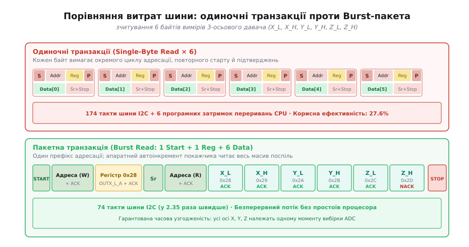
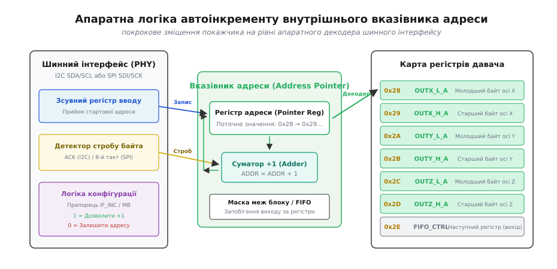
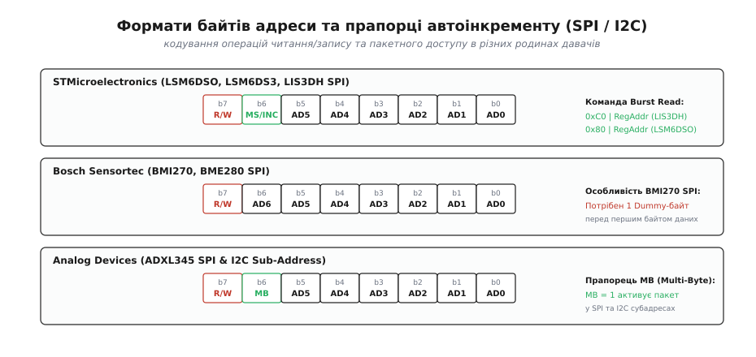
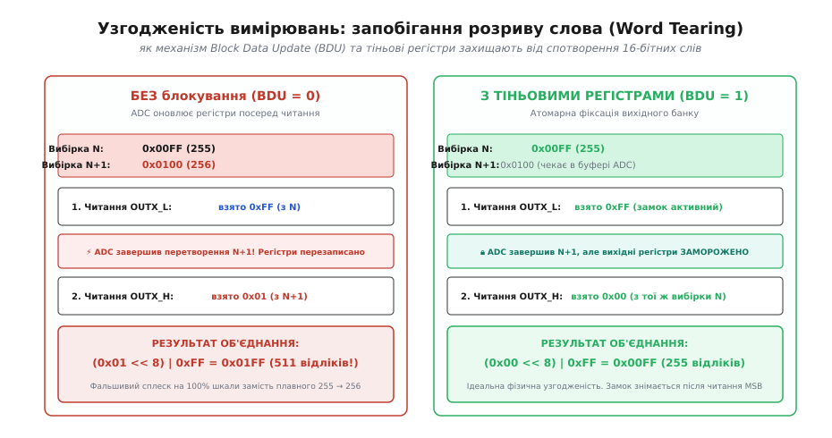
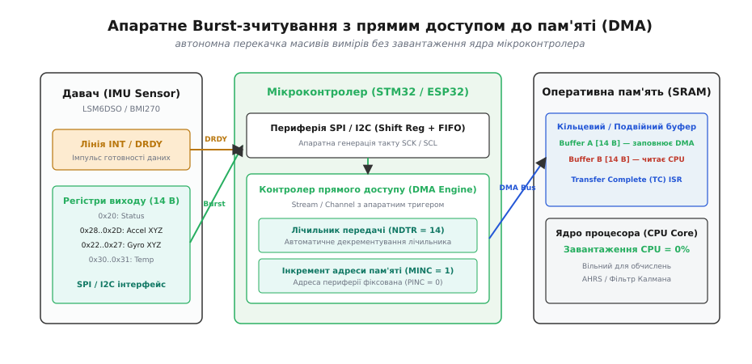

# Пакетне зчитування регістрів

<preknowlist>
- [Шина I2C](topic:communications/i2c-bus)
- [Шина SPI](topic:communications/spi-bus)
- [Регістрова карта](topic:communications/register-map)
- [Транзакція I2C](topic:communications/i2c-transaction)
</preknowlist>

Цифровий інерціальний вимірювальний модуль (IMU) у польотному контролері безпілотника щосекунди генерує кілька тисяч 16-бітних векторів прискорення й кутової швидкості. Кожен такий вимір складається з шести окремих 8-бітних значень: молодшого та старшого байтів для осей X, Y та Z. Якщо мікроконтролер опитуватиме ці регістри по черзі за допомогою одиночних транзакцій, пропускна здатність послідовного інтерфейсу швидко вичерпається, а центральний процесор витрачатиме більшість тактової потужності на обслуговування службових заголовків і перемикання контексту переривань.

Пакетне зчитування (*Burst Read*, або *Sequential Read*) вирішує цю проблему на апаратному рівні: ведучий передає початкову адресу лише один раз, після чого ведений пристрій самостійно інкрементує внутрішній покажчик регістрової карти та видає неперервний потік байтів за один сеанс зв'язку. Це не просто прискорює обмін у 2–4 рази, але й забезпечує фундаментальну фізичну властивість — апаратну часову узгодженість багатобайтових векторів.

---

### Анатомія протокольних накладних витрат: побайтовий доступ проти пакета

Щоб зрозуміти ціну побайтового опитування, простежимо структуру передачі на шині [I2C](topic:communications/i2c-bus) при читанні шести послідовних регістрів вихідних даних акселерометра (від регістра `OUTX_L_A` за адресою `0x28` до `OUTZ_H_A` за адресою `0x2D`).

При побайтовому доступі для кожного окремого байта ведучий змушений виконувати повну складену транзакцію:
1. Генерація стану START (1 такт);
2. Передача 7-бітної адреси пристрою з бітом запису `W=0` та очікування біта підтвердження ACK від слейва (9 тактів);
3. Передача адреси цільового регістра (наприклад, `0x28`) та очікування ACK (9 тактів);
4. Генерація повторного старту REPEATED START (1 такт);
5. Повторна передача адреси пристрою з бітом читання `R=1` та очікування ACK (9 тактів);
6. Прийом одного байта даних від слейва та відправка ведучим сигналу NACK (9 тактів);
7. Генерація стану STOP (1 такт).

Сумарно одиночне зчитування одного байта займає 39 тактів тактового сигналу SCL. Для зчитування повного 6-байтового вектора трьох осей потрібно повторити цю процедуру шість разів:

```
T_single = 6 · 39 = 234 такти шини
```

На стандартній швидкості Fast Mode (400 кГц, тривалість такту 2.5 мкс) чистий час передачі становить `234 · 2.5 мкс = 585 мкс`. Якщо додати сюди програмні затримки на обробку шести окремих переривань мікроконтролера, загальний час опитування сягає майже 1 мс, що робить частоту оновлення 1000 Гц теоретично недосяжною.


*Часові діаграми одиночних транзакцій проти єдиного Burst-пакета на шині I2C*

У режимі пакетного читання фаза адресації виконується лише один раз:
1. Стан START (1 такт);
2. Адреса пристрою `Slave Addr + W` + ACK (9 тактів);
3. Стартова адреса першого регістра `0x28` + ACK (9 тактів);
4. Стан REPEATED START (1 такт);
5. Адреса пристрою `Slave Addr + R` + ACK (9 тактів);
6. Послідовний прийом 6 байтів даних: перші 5 байтів ведучий підтверджує бітом ACK, а на 6-му байті виставляє NACK (`6 · 9 = 54 такти`);
7. Стан STOP (1 такт).

Загальна тривалість пакета становить лише `1 + 9 + 9 + 1 + 9 + 54 + 1 = 84 такти` (210 мкс при 400 кГц). Пакетний режим скорочує час зайнятості шини у 2.79 раза, а частка корисних даних зростає з 20.5% до 57.1%. Для повного аналітичного виведення формул ефективності див. [математичний розрахунок накладних витрат і часового бюджету шин](topic:communications/burst-read/math-bus-overhead.md).

#### Вплив розтягування тактового сигналу (Clock Stretching)

На додаток до зменшення кількості байтів, пакетний доступ усуває явище розтягування такту (*Clock Stretching*). Коли ведучий щоразу надсилає нову адресу регістра, внутрішньому мікроконтролеру або цифровому автомату веденого пристрою потрібен час на декодування команди та оновлення вихідного мультиплексора. Під час цього процесу слейв примусово притискає лінію SCL до землі, змушуючи ведучого чекати.

У разі пакетного читання адреса наступного регістра обчислюється апаратним суматором безпосередньо під час передачі попереднього байта, завдяки чому лінія SCL ніколи не затримується слейвом, а обмін відбувається на граничній тактовій частоті шини.

---

### Апаратний механізм автоінкременту адреси (Address Pointer Auto-Increment)

Здатність мікросхеми видавати дані з послідовних регістрів без повторної адресації базується на роботі внутрішнього апаратного лічильника — вказівника адреси (*Address Pointer Register*).


*Внутрішня мікроархітектура веденого пристрою: детекція байтового стробу та апаратний суматор адреси*

Внутрішня логіка веденого пристрою функціонує за такою послідовністю:
1. **Завантаження базової адреси**: коли шинний інтерфейс (PHY) приймає байт субадреси від ведучого, вхідний зсувний регістр записує це значення у регістр вказівника адреси (наприклад, `0x28`).
2. **Декодування та вибірка**: апаратний декодер активує відповідну комірку вихідного банку регістрів, і дані першого регістра завантажуються у вихідний зсувний регістр для передачі ведучому.
3. **Детекція стробу байта**:
   - На шині I2C моментом фіксації успішної передачі є 9-й такт сигналу SCL, під час якого ведучий утримує лінію SDA на низькому рівні (біт ACK).
   - На шині SPI стробом є спадний фронт 8-го тактового імпульсу сигналу SCK для кожного переданого байта.
4. **Інкрементування покажчика**: сигнал стробу надходить на тактовий вхід апаратного суматора, який обчислює нову адресу:
   ```
   ADDR_NEXT = ADDR_CURRENT + 1
   ```
5. **Вибірка наступної комірки**: оновлена адреса `0x29` миттєво декодується, і наступний байт завантажується у зсувний регістр ще до приходу першого біта наступного тактового циклу.

#### Синхронізація доменів тактування (Clock Domain Crossing)

Усередині кристала цифрового давача завжди присутні щонайменше два незалежні тактові домени:
1. **Внутрішній системний домен (Core Domain)**: тактується від вбудованого RC-генератора частотою 10–20 МГц, обслуговує аналого-цифрові перетворювачі, цифрову фільтрацію (DSP/CORDIC) та кінцевий автомат оновлення вибірок.
2. **Зовнішній шинний домен (Bus PHY Domain)**: асинхронний домен, який повністю підпорядкований зовнішньому сигналу тактування SCL або SCK від ведучого мікроконтролера (від 100 кГц до 20 МГц).

Передача даних між цими доменами здійснюється через асинхронні бар'єри фіксації. Коли лічильник автоінкременту збільшує адресу, сигнал адреси проходить через каскад тригерів синхронізації, гарантуючи, що зчитування вихідного регістра не збіжиться за фазою із внутрішнім тактом запису від АЦП.

#### Обмеження меж та кільцеве зациклення покажчика

Поведінка покажчика адреси при досягненні кінця вихідного блоку регістрів залежить від мікроархітектури конкретного давача:
- **Діапазонне зациклення (Bank Wrapping)**: у багатьох інерціальних модулях адреси вимірів згруповані в окремий блок (наприклад, `0x28..0x2D`). Після зчитування старшого байта осі Z (`0x2D`) наступний інкремент повертає покажчик на початок блоку вимірів `0x28`, дозволяючи неперервно зчитувати свіжі вибірки без повторної ініціалізації адреси.
- **Вихід у конфігураційні регістри**: у простіших пристроях покажчик лінійно збільшується далі (`0x2E`, `0x2F`), зчитуючи службові регістри керування FIFO, переривань або налаштувань фільтрів, що може призвести до читання сміття або скидання статусних прапорців.
- **Статичний покажчик для буфера FIFO**: при зчитуванні регістрів черги FIFO (наприклад, `FIFO_DATA_OUT_L` за адресою `0x79`) автоінкремент адреси апаратно блокується: адреса регістра залишається фіксованою, а кожен строб читання виштовхує наступне слово з глибини апаратного буфера.

---

### Протокольні прапорці автоінкременту: відмінності SPI та I2C

Реалізація автоінкременту різниться залежно від виробника мікросхеми та обраного інтерфейсу. Якщо в шині I2C адреса регістра передається окремим байтом, то в шині [SPI](topic:communications/spi-bus) старші біти адреси часто виділяються під керуючі прапорці напрямку обміну та режиму інкременту.


*Кодування бітів R/W, MS/INC та MB у командних байтах різних родин цифрових давачів*

#### Порівняльна таблиця прапорців автоінкременту популярних родин давачів

| Виробник / Серія | Інтерфейс | Формат командного байта | Біт читання | Біт автоінкременту | Особливості пакетного режиму |
| :--- | :--- | :--- | :--- | :--- | :--- |
| **STMicroelectronics (LIS3DH, LIS2DH12)** | SPI | `[RW][MS][A5:A0]` | Bit 7 (`1` = Read) | Bit 6 (`1` = Multiple) | Потрібно встановлювати `0xC0 \| Addr` для Burst |
| **STMicroelectronics (LSM6DSO, LSM6DS3)** | SPI / I2C | `[RW][A6:A0]` | Bit 7 (`1` = Read) | `CTRL3_C.IF_INC = 1` | Автоінкремент увімкнено за замовчуванням |
| **Bosch Sensortec (BMI270, BME280, BMP390)** | SPI | `[RW][A6:A0]` | Bit 7 (`1` = Read) | Автоматично | **Потрібен 1 Dummy Byte** після адреси в SPI |
| **Analog Devices (ADXL345, ADXL375)** | SPI / I2C | `[RW][MB][A5:A0]` | Bit 7 (`1` = Read) | Bit 6 (`MB = 1`) | Підтримує `MB` як у SPI, так і в I2C |
| **TDK / InvenSense (MPU-6050, ICM-42688)** | SPI / I2C | `[RW][A6:A0]` | Bit 7 (`1` = Read) | Автоматично | Перемикання банків через `REG_BANK_SEL` |
| **Murata (SCC2130, SCH16T)** | SPI (32-bit) | `[Addr][OP][Data][CRC]` | В полі `OP` | Відсутній | Фіксовані 32-бітні фрейми з апаратним CRC-8 |

#### 1. STMicroelectronics (LSM6DSO, LSM6DS3, LIS3DH)

У класичних давачах ST (наприклад, 3-осьовому акселерометрі LIS3DH) перший байт транзакції SPI містить два керуючі біти у старших розрядах:
- Біт 7 (`R/W`): `1` — читання, `0` — запис;
- Біт 6 (`MS`, *Multiple / Single*): `1` — увімкнути автоінкремент адреси, `0` — статична адреса;
- Біти [5:0]: 6-бітна адреса регістра (`0x00..0x3F`).

Щоб виконати пакетне зчитування з регістра `OUT_X_L` (`0x28`), формується командний байт:

```
CMD = (1 << 7) | (1 << 6) | 0x28 = 0x80 | 0x40 | 0x28 = 0xC0 | 0x28 = 0xE8
```

Якщо відправити лише `0x80 | 0x28 = 0xA8` (з бітом `MS=0`), слейв на кожен наступний байт тактування шини SPI повертатиме значення одного й того самого регістра `0x28`.

У новіших модулях 6-осьових IMU (LSM6DS3, LSM6DSO) автоінкремент за замовчуванням увімкнений на рівні внутрішньої конфігурації (біт `IF_INC = 1` у регістрі `CTRL3_C`). Тому в режимі SPI для читання достатньо виставити лише біт читання `0x80 | RegAddr`, а біт 6 використовується як старший біт розширеної 7-бітної адреси регістра.

#### 2. Bosch Sensortec (BMI270, BME280, BMP388)

У мікросхемах Bosch автоінкремент діє за замовчуванням:
- Біт 7: `1` — читання (`Read`), `0` — запис (`Write`);
- Біти [6:0]: 7-бітна адреса регістра.

Проте шина SPI в датчиках BMI270 має критичну апаратну особливість: після передачі байта команди слейву потрібен час для вибірки даних із внутрішньої пам'яті. Тому **перший байт, що повертається датчиком після адреси, є фіктивним (Dummy Byte)**. Корисні дані вимірів починаються лише з другого байта відповіді.

#### 3. TDK InvenSense (ICM-20948, ICM-42688-P)

У високопродуктивних інерціальних модулях InvenSense регістрова карта розбита на 4 незалежні банки (*User Bank 0, 1, 2, 3*). Вибір активного банку здійснюється записом номера банку у службовий регістр `REG_BANK_SEL (0x7F)`.
- Усі вихідні регістри вимірів (акселерометр, гіроскоп, термометр) розташовані в банку 0 за адресами `0x2D..0x3A`.
- При пакетному зчитуванні покажчик автоматично інкрементується всередині активного банку. Якщо розмір пакета перевищує адресу останнього регістра банку (`0x7F`), покажчик не перемикає банк автоматично, а зациклюється на початок поточного банку або викликає помилку адресації.

---

### Атомарна фіксація та захист від розриву слова (Block Data Update)

Найнебезпечніша помилка при роботі з цифровими давачами — явище **розриву слова** (*Word Tearing*, або *Split-Read Inconsistency*).

Розглянемо фізичну ситуацію: 16-бітний вимір осі X складається з молодшого регістра `OUTX_L` та старшого регістра `OUTX_H`. Нехай у момент часу `t_0` виміряне значення прискорення становить 255 відліків (`0x00FF`), а в наступний момент часу `t_1` плавно зростає до 256 відліків (`0x0100`).


*Механізм блокування Block Data Update (BDU) та запобігання розриву слова між молодшим і старшим байтами*

Що відбувається при асинхронному побайтовому читанні без апаратного блокування (`BDU = 0`):
1. Мікроконтролер зчитує регістр `OUTX_L` і отримує значення `0xFF` (з вибірки `0x00FF`).
2. Рівно між зчитуванням молодшого та старшого байтів аналого-цифровий перетворювач (ADC) давача завершує нове вимірювання і миттєво перезаписує вихідні регістри новим значенням `0x0100`.
3. Мікроконтролер зчитує регістр `OUTX_H` і отримує значення `0x01` (вже з нової вибірки `0x0100`).
4. Програма об'єднує байти у 16-бітне ціле:
   ```
   Value = (0x01 << 8) | 0xFF = 0x01FF = 511 відліків!
   ```

Замість плавного наростання `255 -> 256` система отримує катастрофічний імпульсний викид до `511` (стрибок на 100% шкали). В системі стабілізації квадрокоптера такий помилковий сплеск призводить до різкого ривка моторів і втрати керованості.

#### Механізм тіньових регістрів (Shadow Registers / BDU)

Для ліквідації цього дефекту в усіх професійних MEMS-давачах передбачено режим **Block Data Update (BDU)** (наприклад, біт `BDU` у регістрі `CTRL1_XL` або `CTRL3_C` давачів ST).

Принцип роботи апаратної тіньової фіксації:
1. Вихідні регістри давача відокремлені від робочих регістрів АЦП проміжним буфером фіксації (*Holding Latch / Shadow Register*).
2. Коли ведучий починає зчитування будь-якого з вихідних регістрів (наприклад, `OUTX_L`), внутрішня логіка автоматично заморожує весь блок вихідних регістрів усіх трьох осей (X, Y, Z).
3. Якщо під час передачі пакету АЦП завершує чергове перетворення, нові дані залишаються в робочому буфері перетворювача і не перезаписують заблоковані вихідні комірки.
4. Апаратний замок знімається лише після того, як ведучий прочитає старший байт останнього зареєстрованого виміру (або після завершення транзакції шини станом STOP чи наростанням CS).

Пакетне зчитування в поєднанні з активним прапорцем BDU гарантує абсолютну фізичну узгодженість: усі 6 (або 14) байтів кадру належать одному й тому самому кванту часу вибірки.

---

### Апаратне прискорення через прямий доступ до пам'яті (DMA)

При частотах опитування давачів 1–6.6 кГц навіть швидке пакетне зчитування через програмні переривання CPU створює відчутний оверхед. Кожне переривання вимагає від процесора збереження поточного контексту (регістрів `R0-R3`, `R12`, `LR`, `PC`, `xPSR`), переходу до таблиці векторів, вичитування шинного буфера та повернення.


*Конвеєрна архітектура збору даних з IMU: від стробу DRDY через DMA у системну пам'ять SRAM*

Рішення полягає у використанні контролера прямого доступу до пам'яті (DMA, *Direct Memory Access*). Контролер DMA бере на себе повну диспетчеризацію шини без залучення процесорного ядра:
1. **Зовнішній тригер готовності (`DRDY`)**: імпульс готовності даних від датчика надходить на вхід апаратного переривання або таймера мікроконтролера.
2. **Автономна передача**: DMA відкриває передачу SPI/I2C, надсилає стартову адресу та послідовно вичитує 14 байтів вимірів безпосередньо в буфер оперативної пам'яті SRAM.
3. **Мінімальне завантаження CPU**: процесор отримує лише одне підсумкове переривання `Transfer Complete (TC)` після того, як весь блок уже розміщено в пам'яті, або не прокидається взагалі, обробляючи дані періодично з кільцевого подвійного буфера (*Ping-Pong Buffer*).

Практичні приклади повної конфігурації драйверів DMA під мікроконтролери STM32 та ESP32 детально розібрано у [проекті налаштування DMA-пакетного зчитування](topic:communications/burst-read/proj-dma-burst.md).

---

### Реалізація в ядрі Linux: підсистеми Regmap та IIO

В операційних системах Linux для вбудованих платформ (Embedded Linux / Raspberry Pi / BeagleBone / i.MX6) пакетне зчитування абстрагується на рівні ядра через підсистеми **Regmap** та **Industrial I/O (IIO)**.

#### Використання `regmap_bulk_read` у драйверах ядра

Ядро Linux надає уніфікований інтерфейс `regmap_bulk_read()`, який автоматично формує правильну структуру транзакції залежно від шини (I2C чи SPI) та налаштувань автоінкременту в структурі `struct regmap_config`:

:::tabs

@tab C (Драйвер ядра Linux IIO)
```c
/* Фрагмент драйвера ядра Linux drivers/iio/imu/st_lsm6dsx/st_lsm6dsx_core.c */
int st_lsm6dsx_read_burst(struct st_lsm6dsx_hw *hw, u8 reg_addr,
                          void *data, size_t len)
{
    return regmap_bulk_read(hw->regmap, reg_addr, data, len);
}
```

@tab C++ (User-Space Linux i2c-dev)
```cpp
#include <fcntl.h>
#include <linux/i2c-dev.h>
#include <linux/i2c.h>
#include <sys/ioctl.h>
#include <array>
#include <cstdint>
#include <span>
#include <system_error>

namespace linux_sensor {

class LinuxI2cBurstReader {
public:
    explicit LinuxI2cBurstReader(int fd, uint8_t dev_addr) noexcept
        : fd_(fd), dev_addr_(dev_addr) {}

    [[nodiscard]] std::error_code bulk_read(uint8_t reg_addr, std::span<uint8_t> out_buf) noexcept {
        std::array<i2c_msg, 2> msgs{};

        // Запис адреси початкового регістра
        msgs[0].addr  = dev_addr_;
        msgs[0].flags = 0;
        msgs[0].len   = 1;
        msgs[0].buf   = &reg_addr;

        // Пакетне вичитування N байтів за допомогою Repeated Start
        msgs[1].addr  = dev_addr_;
        msgs[1].flags = I2C_M_RD;
        msgs[1].len   = static_cast<__u16>(out_buf.size());
        msgs[1].buf   = out_buf.data();

        i2c_rdwr_ioctl_data packets{};
        packets.msgs  = msgs.data();
        packets.nmsgs = static_cast<__u32>(msgs.size());

        if (ioctl(fd_, I2C_RDWR, &packets) < 0) {
            return std::error_code(errno, std::generic_category());
        }
        return {};
    }

private:
    int     fd_{-1};
    uint8_t dev_addr_{0};
};

} // namespace linux_sensor
```

:::


Конфігурація `regmap_config` для давача з автоінкрементом:
- `val_bits = 8`: розрядність комірки пам'яті;
- `reg_bits = 8`: розрядність адреси регістра;
- `read_flag_mask = 0x80`: маска читання для шини SPI;
- `use_single_read = false`: дозволяє підсистемі ядра комбінувати читання в єдиний I2C/SPI Burst замість циклічних побайтових викликів.

#### Простеження через ftrace та tracepoints ядра

Перевірити, чи драйвер ядра дійсно виконує єдину пакетну транзакцію, а не розбиває її на серію одиночних, можна за допомогою вбудованого механізму трасування ядра `ftrace`:

```bash
# Увімкнення трасування I2C подій у Linux
echo 1 > /sys/kernel/tracing/events/i2c/i2c_read/enable
echo 1 > /sys/kernel/tracing/events/i2c/i2c_reply/enable

# Читання вибірки з вузла IIO
cat /sys/bus/iio/devices/iio:device0/in_accel_x_raw

# Перегляд логу трасування ядра
cat /sys/kernel/tracing/trace
```

Приклад правильного логу пакетного читання:
```text
i2c_read: i2c-1 #0 a=06b f=0000 l=1 [28]
i2c_read: i2c-1 #1 a=06b f=0001 l=6
i2c_reply: i2c-1 #1 a=06b f=0001 l=6 [ff 00 12 00 e4 ff]
```
У лозі чітко видно дві складові однієї об'єднаної транзакції: запис 1 байта адреси `[28]` та миттєве зчитування 6 байтів відповіді `l=6 [ff 00 12 00 e4 ff]`.

---

### Програмна реалізація: універсальні драйвери Burst Read

Розглянемо практичну реалізацію функцій пакетного зчитування для шин I2C та SPI мовами C та C++ з дотриманням типобезпеки, вирівнювання структур та запобігання невизначеної поведінки при зсувах.

#### Драйвер пакетного читання для шини I2C

:::tabs

@tab C (I2C Driver)
```c
#include <stdint.h>
#include <stdbool.h>
#include <stddef.h>

/* Низькорівневий апаратний виклик шини I2C */
extern bool platform_i2c_write_read(uint8_t dev_addr,
                                    const uint8_t *tx_data, size_t tx_len,
                                    uint8_t *rx_data, size_t rx_len);

/* Структура 3-осьового виміру в сирих відліках */
typedef struct {
    int16_t x;
    int16_t y;
    int16_t z;
} raw_axes_t;

/* Пакетне зчитування 6 регістрів виходу акселерометра */
bool lsm6dso_read_accel_raw(uint8_t i2c_addr, raw_axes_t *out_axes) {
    if (out_axes == NULL) {
        return false;
    }

    const uint8_t reg_start = 0x28; /* Адреса OUTX_L_A */
    uint8_t buffer[6];

    /* Виконуємо єдину складену транзакцію: Start -> Write(0x28) -> ReStart -> Read(6B) -> Stop */
    if (!platform_i2c_write_read(i2c_addr, &reg_start, 1, buffer, 6)) {
        return false;
    }

    /* Безпечне Little-Endian розпакування без UB (Type Punning) */
    out_axes->x = (int16_t)((uint16_t)buffer[0] | ((uint16_t)buffer[1] << 8));
    out_axes->y = (int16_t)((uint16_t)buffer[2] | ((uint16_t)buffer[3] << 8));
    out_axes->z = (int16_t)((uint16_t)buffer[4] | ((uint16_t)buffer[5] << 8));

    return true;
}
```

@tab C++ (I2C Driver)
```cpp
#include <array>
#include <cstdint>
#include <expected>
#include <span>

namespace sensor {

struct RawAxes {
    int16_t x{};
    int16_t y{};
    int16_t z{};
};

enum class BusError {
    DeviceNotFound,
    ArbitrationLost,
    BusTimeout,
    NackReceived
};

class I2cBusInterface {
public:
    virtual ~I2cBusInterface() = default;
    [[nodiscard]] virtual std::expected<void, BusError> write_read(
        uint8_t dev_addr,
        std::span<const uint8_t> tx_data,
        std::span<uint8_t> rx_data) noexcept = 0;
};

class Lsm6dsoI2cDriver {
public:
    static constexpr uint8_t kOutXLA = 0x28;

    explicit Lsm6dsoI2cDriver(I2cBusInterface& bus, uint8_t address = 0x6B) noexcept
        : bus_(bus), device_addr_(address) {}

    [[nodiscard]] std::expected<RawAxes, BusError> read_accel_raw() noexcept {
        const std::array<uint8_t, 1> reg_addr{kOutXLA};
        std::array<uint8_t, 6> raw_buf{};

        auto result = bus_.write_read(device_addr_, reg_addr, raw_buf);
        if (!result) {
            return std::unexpected(result.error());
        }

        RawAxes axes{};
        axes.x = static_cast<int16_t>(static_cast<uint16_t>(raw_buf[0]) | (static_cast<uint16_t>(raw_buf[1]) << 8));
        axes.y = static_cast<int16_t>(static_cast<uint16_t>(raw_buf[2]) | (static_cast<uint16_t>(raw_buf[3]) << 8));
        axes.z = static_cast<int16_t>(static_cast<uint16_t>(raw_buf[4]) | (static_cast<uint16_t>(raw_buf[5]) << 8));

        return axes;
    }

private:
    I2cBusInterface& bus_;
    uint8_t          device_addr_;
};

} // namespace sensor
```

:::

#### Драйвер пакетного читання для шини SPI з урахуванням прапорців

:::tabs

@tab C (SPI Driver)
```c
#include <stdint.h>
#include <stdbool.h>
#include <string.h>

extern void platform_spi_cs_low(void);
extern void platform_spi_cs_high(void);
extern bool platform_spi_transfer(const uint8_t *tx, uint8_t *rx, size_t len);

typedef struct {
    int16_t gyro[3];
    int16_t accel[3];
} imu_6axis_raw_t;

/* Читання 12 байтів (Гіроскоп 0x22..0x27 + Акселерометр 0x28..0x2D) по SPI */
bool lsm6dso_spi_read_motion(imu_6axis_raw_t *out_data) {
    if (out_data == NULL) {
        return false;
    }

    /* Командний байт: Біт 7=1 (Read), адреса 0x22 (OUTX_L_G) */
    uint8_t tx_buf[13] = {0};
    uint8_t rx_buf[13] = {0};
    tx_buf[0] = 0x80 | 0x22;

    platform_spi_cs_low();
    bool status = platform_spi_transfer(tx_buf, rx_buf, sizeof(tx_buf));
    platform_spi_cs_high();

    if (!status) {
        return false;
    }

    /* Байт rx_buf[0] - порожній під час передачі адреси, виміри в rx_buf[1..12] */
    const uint8_t *d = &rx_buf[1];
    out_data->gyro[0]  = (int16_t)((uint16_t)d[0]  | ((uint16_t)d[1]  << 8));
    out_data->gyro[1]  = (int16_t)((uint16_t)d[2]  | ((uint16_t)d[3]  << 8));
    out_data->gyro[2]  = (int16_t)((uint16_t)d[4]  | ((uint16_t)d[5]  << 8));
    out_data->accel[0] = (int16_t)((uint16_t)d[6]  | ((uint16_t)d[7]  << 8));
    out_data->accel[1] = (int16_t)((uint16_t)d[8]  | ((uint16_t)d[9]  << 8));
    out_data->accel[2] = (int16_t)((uint16_t)d[10] | ((uint16_t)d[11] << 8));

    return true;
}
```

@tab C++ (SPI Driver)
```cpp
#include <array>
#include <cstdint>
#include <expected>
#include <span>

namespace sensor {

struct Motion6AxisRaw {
    std::array<int16_t, 3> gyro{};
    std::array<int16_t, 3> accel{};
};

class SpiBusInterface {
public:
    virtual ~SpiBusInterface() = default;
    virtual void select() noexcept = 0;
    virtual void deselect() noexcept = 0;
    [[nodiscard]] virtual bool transfer(std::span<const uint8_t> tx, std::span<uint8_t> rx) noexcept = 0;
};

class SpiCsGuard {
public:
    explicit SpiCsGuard(SpiBusInterface& bus) noexcept : bus_(bus) {
        bus_.select();
    }
    ~SpiCsGuard() {
        bus_.deselect();
    }
    SpiCsGuard(const SpiCsGuard&) = delete;
    SpiCsGuard& operator=(const SpiCsGuard&) = delete;

private:
    SpiBusInterface& bus_;
};

class Lsm6dsoSpiDriver {
public:
    static constexpr uint8_t kReadFlag   = 0x80;
    static constexpr uint8_t kOutXLG_Reg = 0x22;

    explicit Lsm6dsoSpiDriver(SpiBusInterface& bus) noexcept : bus_(bus) {}

    [[nodiscard]] std::expected<Motion6AxisRaw, bool> read_motion() noexcept {
        constexpr size_t kPayloadLen = 12;
        constexpr size_t kTransferLen = 1 + kPayloadLen;

        std::array<uint8_t, kTransferLen> tx_buf{};
        std::array<uint8_t, kTransferLen> rx_buf{};
        tx_buf[0] = kReadFlag | kOutXLG_Reg;

        {
            SpiCsGuard cs_guard(bus_);
            if (!bus_.transfer(tx_buf, rx_buf)) {
                return std::unexpected(false);
            }
        }

        Motion6AxisRaw result{};
        const auto* payload = &rx_buf[1];

        for (size_t i = 0; i < 3; ++i) {
            const auto low  = static_cast<uint16_t>(payload[i * 2]);
            const auto high = static_cast<uint16_t>(payload[i * 2 + 1]);
            result.gyro[i] = static_cast<int16_t>(low | (high << 8));
        }

        for (size_t i = 0; i < 3; ++i) {
            const auto low  = static_cast<uint16_t>(payload[6 + i * 2]);
            const auto high = static_cast<uint16_t>(payload[6 + i * 2 + 1]);
            result.accel[i] = static_cast<int16_t>(low | (high << 8));
        }

        return result;
    }

private:
    SpiBusInterface& bus_;
};

} // namespace sensor
```

:::

---

### Фізичний рівень: паразитні ємності, підтягувальні резистори та динаміка фронтів

Під час передачі довгих пакетів даних на високих швидкостях фізичні параметри ліній зв'язку набувають вирішального значення. На відміну від шини SPI, де виходи ведучого та веденого працюють у двотактному режимі (*Push-Pull*) з активним формуванням обох логічних рівнів, шина I2C використовує топологію відкритого колектора (*Open-Drain*).

Формування наростаючого фронту на лініях SDA та SCL здійснюється виключно пасивними підтягувальними резисторами `R_p`. Час наростання фронту сигналу `t_r` від рівня `0.3 · V_DD` до `0.7 · V_DD` визначається формулою експоненційного заряду еквівалентної ємності шини `C_b`:

```
t_r = 0.8473 · R_p · C_b
```

Стандарт I2C встановлює жорсткі обмеження на максимальний час наростання:
- **Standard Mode (100 кГц)**: `t_r ≤ 1000 нс`, максимальна ємність `C_b ≤ 400 пФ`;
- **Fast Mode (400 кГц)**: `t_r ≤ 300 нс`, максимальна ємність `C_b ≤ 400 пФ`;
- **Fast Mode Plus (1 МГц)**: `t_r ≤ 120 нс`, максимальна ємність `C_b ≤ 550 пФ`.

Якщо під час тривалого Burst-пакету через завищений номінал `R_p` сигнал SDA не встигає піднятися до рівня логічної одиниці за час високого стану SCL, ведучий або слейв фіксує помилковий біт `0`. Це призводить до спотворення вибірки або передчасної генерації стану STOP.

Для забезпечення надійного пакетного читання номінал підтягувальних резисторів обирають за правилом компромісу між швидкістю наростання та струмом насичення транзисторів:

```
(V_DD - 0.4 В) / 3 мА  ≤  R_p  ≤  t_r_max / (0.8473 · C_b)
```

Для типової напруги `V_DD = 3.3 В` та сумарної ємності доріжок і входів мікросхем `C_b = 100 пФ` оптимальний номінал `R_p` для режиму Fast Mode становить від 1.5 кОм до 2.2 кОм.

---

### Контроль цілісності пакетів: Packet Error Checking (PEC / CRC-8)

В автомобільних системах, авіоніці та промисловій автоматиці пакетне зчитування вимагає безперервного апаратного контролю цілісності кожного переданого блоку даних. Збій навіть одного біта через електромагнітну заваду від силового ключа інвертора може спотворити кут нахилу дрона.

Для захисту від таких спотворень у протоколах SMBus та спеціалізованих SPI-давачах (наприклад, Murata SCH16T, Bosch SMI230) реалізовано протокол **Packet Error Checking (PEC)**.

Механізм роботи PEC:
1. Під час передачі початкової адреси та всіх наступних байтів даних вимірів як ведучий, так і ведений пристрій паралельно обчислюють циклічний надлишковий код **CRC-8** за стандартизованим поліномом:
   ```
   C(x) = x^8 + x^2 + x + 1   (поліном 0x07, початкове значення 0x00)
   ```
2. Після видачі останнього байта вимірів ведений пристрій самостійно генерує додатковий контрольний байт CRC-8 і передає його на шину перед формуванням NACK або підняттям Chip Select.
3. Апаратний блок мікроконтролера або драйвер порівнює обчислений локально поліном із прийнятим байтом. У разі незбігу весь пакет вимірів миттєво маркується як недійсний, відкидається фільтром орієнтації, а лічильник діагностики збільшує значення помилок зв'язку.

---

### Апаратний строб готовності (Data Ready, DRDY) та антиджиттерний контроль

Опитування давачів через фіксовані програмні таймери мікроконтролера має суттєву ваду: внутрішній тактовий генератор MEMS-кристала має температурний дрейф до ±2%. Внаслідок цього програмне опитування неминуче або зчитуватиме старі незмінні дані двічі, або пропускатиме окремі вибірки.

Для ідеальної часової синхронізації застосовується зовнішній апаратний строб **Data Ready (DRDY)**:
- Давач виставляє короткий імпульс (тривалістю від 10 мкс до 100 мкс) на виводі `DRDY / INT1` строго в момент завершення оновлення вихідних тіньових регістрів.
- Вивід `DRDY` підключається до входу зовнішнього переривання (EXTI) або каналу захоплення таймера мікроконтролера.
- Наростаючий фронт `DRDY` миттєво активує передачу DMA Burst Read.

Такий підхід забезпечує **нульовий фазовий джиттер** (Δt < 50 нс), що є обов'язковою умовою для коректного дискретного інтегрування диференціальних рівнянь кутового руху:

```
θ(t_k) = θ(t_{k-1}) + ω(t_k) · Δt
```

---

### Енергетичний аудит: оптимізація споживання батареї

У переносному обладнанні, трекерах та автономних IoT-маяках мінімізація енергоспоживання є критичним критерієм. Основне споживання енергії мікроконтролером припадає на час активної роботи процесорного ядра (`I_active ≈ 15 мА`), тоді як у режимі глибокого сну струм падає до мікроамперних значень (`I_sleep ≈ 1.2 мкА`).

Порівняння енерговитрат на одну секунду роботи при опитуванні 6-осьового IMU на частоті 1000 Гц:

1. **Побайтове програмне опитування (Single I2C Polling)**:
   - Час транзакції: 1365 мкс на кожну вибірку;
   - Ядро зайняте 100% часу (1000 · 1.365 мс > 1.0 с, переповнення шини);
   - Середній струм споживання: `I_avg = 15.0 мА`.

2. **Пакетне апаратне опитування (Burst SPI + DMA)**:
   - Час передачі SPI DMA (на частоті 10 МГц): 12.2 мкс;
   - Час обробки фінального переривання ядром: 3.5 мкс;
   - Загальний час активності ядра за секунду: 1000 · 3.5 мкс = 3.5 мс (0.35% від загального часу);
   - Час перебування мікроконтролера в режимі глибокого сну: 99.65%;
   - Середній струм споживання:
     ```
     I_avg = 15.0 мА · 0.0035 + 0.0012 мА · 0.9965 = 0.0537 мА = 53.7 мкА
     ```

Перехід на апаратне пакетне зчитування зменшує середнє енергоспоживання системи **більш ніж у 270 разів**, дозволяючи пристрою працювати роками від одного дискового елемента живлення CR2032.


---

### Діагностика збоїв за допомогою цифрового логічного аналізатора

При дослідженні протокольних аномалій пакетного читання цифровий логічний аналізатор виявляє характерні помилки передачі:

#### 1. Передчасне переривання пакета через помилковий NACK
Якщо ведучий через програмну помилку виставляє біт NACK на передостанньому байті (наприклад, на 5-му замість 6-го), ведений пристрій негайно відпускає лінію SDA у високий стан і припиняє передачу. Останній байт зчитується ведучим як `0xFF`, що призводить до спотворення старшого байта осі Z.
*Ознака в аналізаторі*: лінія SDA переходить у високий рівень на 9-му такті передостаннього байта, наступний байт читається як `0xFF`.

#### 2. Зависання лінії SDA у низькому рівні (I2C Bus Lockup)
Якщо під час пакетного читання мікроконтролер перезавантажується або виникає скидання за вартівничим таймером (Watchdog) у момент, коли слейв утримує лінію SDA на низькому рівні (передаючи біт `0`), після перезавантаження шина I2C блокується назавжди: провідний пристрій не може згенерувати стан START, оскільки SDA вже притягнута до нуля.
*Процедура апаратного визволення шини (Bus Recovery)*:
1. Перемкнути вивід SCL у режим програмного керування GPIO (*Open-Drain Output*);
2. Згенерувати від 9 до 16 тактових імпульсів на лінії SCL з частотою 100 кГц;
3. На кожному такті ведений пристрій інкрементує свій зсувний регістр і врешті виштовхує біт `1`, відпускаючи лінію SDA;
4. Сформувати коректну послідовність STOP (перехід SDA з `0` в `1` при високому рівні SCL).

---

### Типові помилки та крайові випадки

1. **Ігнорування Dummy-байта на шині SPI**: при роботі з датчиками Bosch BMI160/BMI270 перший отриманий після команди байт є апаратним заповнювачем. Якщо драйвер розпакує байти `[0..5]` замість `[1..6]`, усі осі виявляться зсунутими на 8 біт, що призведе до повного спотворення вимірів.
2. **Вимкнений біт BDU при побайтовому читанні**: робота з вимкненим BDU призводить до періодичних стрибків значень на переходах `0x00FF -> 0x0100` через вклинювання перетворень АЦП між читанням байтів. Завжди активуйте BDU при ініціалізації датчика.
3. **Спроба автоінкременту при читанні буфера FIFO**: при читанні масиву вибірок із регістрів FIFO адреса має залишатися зафіксованою на комірці `FIFO_DATA_OUT`. Використання прапорця автоінкременту призведе до виходу за межі буфера та зчитування випадкових конфігураційних регістрів.
4. **Колізії напруг та швидкість наростання фронтів SPI**: довгі шлейфи та висока частота SPI (> 10 МГц) без демпферних резисторів (22–33 Ом) створюють дзвін на лінії SCK, що викликає помилкові подвійні спрацьовування апаратного суматора адреси у слейві.

