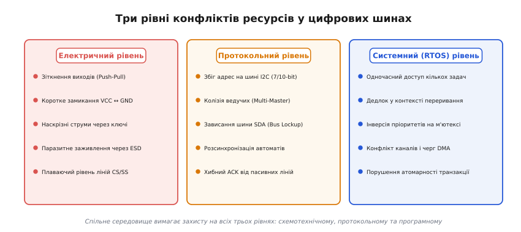
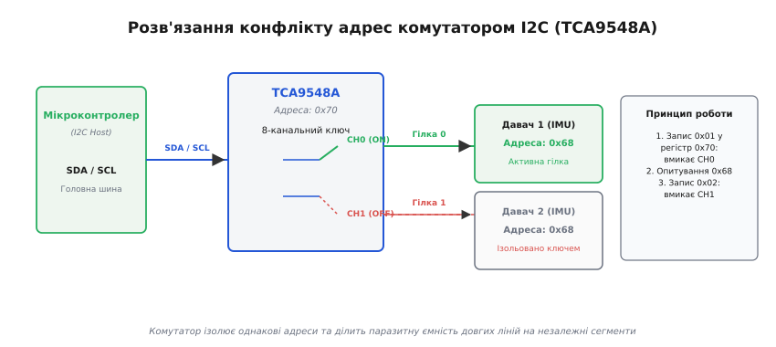
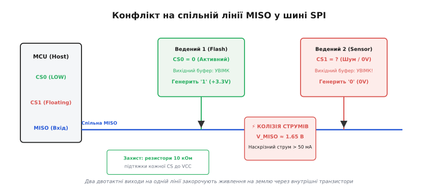
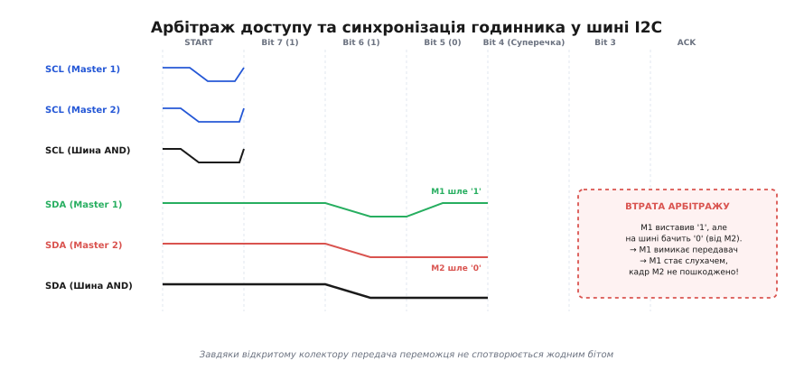
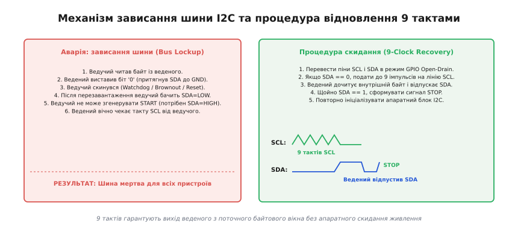
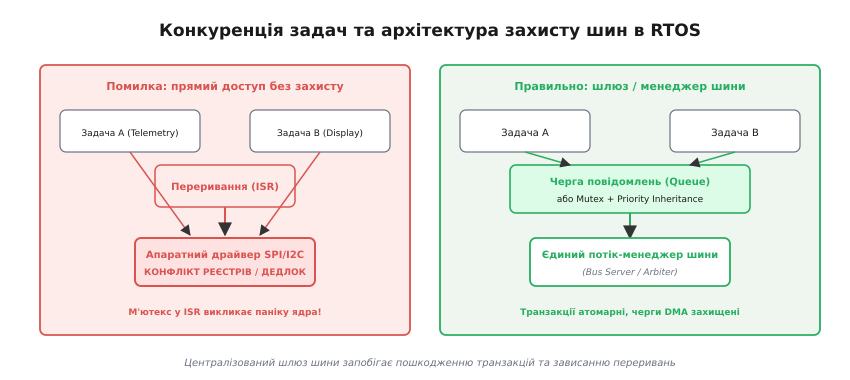

# Конфлікти шин

<preknowlist>
- [Шина I2C](topic:communications/i2c-bus) — фізичний рівень з відкритим стоком, лініями SDA/SCL та резисторами підтяжки.
- [Адресація I2C](topic:communications/i2c-addressing) — 7-бітні адреси ведених, біт R/W та механізм фільтрації на спільній лінії.
- [Вибір кристала (CS)](topic:communications/chip-select) — топологія вибору ведених лінією CS/SS у шині SPI.
- [Арбітраж CAN](topic:communications/can-arbitration) — принцип дротового-І та побітове голосування на спільній шині.
- [Відкритий колектор](topic:electronics/open-collector) — схемотехніка об'єднання виходів з підтяжкою без короткого замикання.
</preknowlist>

Коли на одній цифровій шині одночасно опиняються кілька мікросхем, спільне середовище передачі перетворюється на вузьке місце системи. Уявімо плату польотного контролера безпілотника, де розробник встановив два однакові прецизійні гіроскопи з жорстко зашитою адресою `0x68` на спільну шину I2C (*Inter-Integrated Circuit*). Щойно мікроконтролер надсилає запит, обидва давачі одночасно розпізнають свою адресу й разом видають сигнал підтвердження ACK, а під час читання починають одночасно передавати різні покази, перетворюючи дані на байтове сміття.

У сусідньому блоці шини SPI (*Serial Peripheral Interface*) під час подачі живлення лінія вибору кристала CS першого пристрою тимчасово «зависає» в повітрі через відсутність підтяжки: обидва ведені вважають себе обраними й одночасно вмикають свої двотактні виходи MISO — один видає логічну одиницю (3.3 В), інший логічний нуль (0 В). Між мікросхемами виникає пряме коротке замикання зі струмом понад 60 мА, напруга на лінії провалюється до невизначених 1.65 В, а драйвер операційної системи реального часу (RTOS), намагаючись отримати доступ до шини з переривання, заходить у вічний дедлок.

Ці сценарії ілюструють фундаментальну проблему: будь-яка спільна шина зв'язку є розділюваним ресурсом, де колізії виникають одразу на трьох рівнях — електричному, протокольному та системному.

### Таксономія конфліктів: три рівні спільного середовища

Щоб системно усувати колізії, інженер мусить розрізняти природу виникнення проблеми. Будь-який збій на шині належить до одного з трьох взаємопов'язаних рівнів:


*Три рівні конфліктів ресурсів: електричний рівень визначає фізичну безпеку ключів (двотактний push-pull проти відкритого стоку), протокольний рівень розв'язує адреси та арбітраж пакетів, системний рівень гарантує атомарність транзакцій та черговість потоків в RTOS.*

1. **Електричний рівень (Electrical Contention):** Виникає, коли два передавачі одночасно намагаються встановити протилежні логічні рівні на одній фізичній лінії з активним керуванням (*push-pull*, двотактний вихід). Верхній польовий транзистор першого чіпа з'єднує лінію з напругою `VCC`, а нижній транзистор другого чіпа — із землею `GND`. Результатом стає наскрізний струм короткого замикання, нагрівання кристала та невизначений рівень напруги. На лініях з відкритим стоком (*open-drain*) або відкритим колектором електричного пошкодження не стається завдяки резистивній підтяжці, але виникає логічне накладання сигналів.
2. **Протокольний рівень (Protocol & Logical Contention):** Виникає через обмеження простору адрес (збіг 7-бітних або 10-бітних адрес I2C), одночасну спробу кількох ведучих захопити шину (*Multi-Master Collision*), або розсинхронізацію внутрішніх автоматів станів, коли ведений пристрій зависає посеред передачі байта й блокує лінію (*Bus Lockup*).
3. **Системний рівень (RTOS & Concurrency Contention):** Виникає у багатозадачному програмному середовищі, коли кілька незалежних задач або обробників переривань (ISR) намагаються одночасно конфігурувати регістри того самого апаратного контролера шини, породжуючи стан гонитви (*race condition*), інверсію пріоритетів або взаємне блокування (*deadlock*).

### Конфлікти адрес на шині I2C: чому простору не вистачає

Шина I2C від народження використовує 7-бітну адресацію, що надає теоретичний простір у 128 адрес. З них 16 адрес зарезервовано стандартом під службові цілі (загальний виклик `0x00`, старт-байт `0x01`, адресація шини CBUS `0x02`, 10-бітний префікс `0x78–0x7B`), тож для підключення доступно лише 112 адрес.

Головна проблема полягає в тому, що виробники мікросхем зашивають базову адресу в кремній на етапі виробництва маски (*mask-programmed address*). Наприклад:
- Майже всі популярні давачі тиску (BMP280, BME280, BMP388) мають базову адресу `0x76` або `0x77`.
- Інерційні модулі IMU (MPU-6050, ICM-20948, LSM6DSO) претендують на адреси `0x68` або `0x69`.
- Дисплейні контролери OLED на базі SSD1306 жорстко зафіксовані на `0x3C` або `0x3D`.
- Мікросхеми годинників реального часу (RTC DS1307, DS3231) взагалі мають єдину фіксовану адресу `0x68` без можливості зміни.

Якщо в приладі необхідно встановити чотири однакові OLED-дисплеї або вісім датчиків температури вздовж трубопроводу, виникає неминучий адресний конфлікт.

#### Метод 1: Апаратні адресні піни (Pin Strapping)

Найпростіший спосіб уникнення колізії, передбачений розробниками мікросхем, — виведення кількох молодших бітів адреси на зовнішні ніжки корпусу (зазвичай позначаються `A0`, `A1`, `A2` або `ADDR`).

```
Фіксована маска виробника (старші 5 біт)       Налаштовні піни
              ┌───┬───┬───┬───┬───┐               ┌───┬───┐
              │ 1 │ 1 │ 0 │ 1 │ 0 │               │A1 │A0 │
              └───┴───┴───┴───┴───┘               └───┴───┘
```

Підтягуючи пін `A0` до землі `GND` (логічний нуль) або до живлення `VCC` (логічна одиниця), розробник перемикає адресу мікросхеми. Наприклад, для давача з двома адресними ніжками доступно 4 унікальні адреси:
- `A1 = 0, A0 = 0` → адреса `0x68`
- `A1 = 0, A0 = 1` → адреса `0x69`
- `A1 = 1, A0 = 0` → адреса `0x6A`
- `A1 = 1, A0 = 1` → адреса `0x6B`

Деякі сучасні мікросхеми (наприклад, термометри TMP102 або контролери живлення INA219) використовують тристабільну або чотирирівневу логіку адресного піна: пін `A0` можна під'єднати до `GND`, до `VCC`, до лінії `SDA` або до лінії `SCL`, що дозволяє отримати до 16 унікальних комбінацій всього з двох фізичних виводів.

#### Метод 2: Динамічне перемикання адресних ліній через GPIO

Якщо кілька однакових мікросхем мають лише один адресний пін `A0` (що дає лише 2 адреси `0x68` та `0x69`), а підключити треба, наприклад, чотири сенсори, застосовують трюк із динамічним керуванням.

Адресні піни `A0` кожного давача підключають до окремих виводів GPIO мікроконтролера. У спокійному стані мікроконтролер виставляє на всі піни `A0` високий рівень `1` (усі сенсори сидять на адресі `0x69`). Коли прошивці потрібно опитати конкретний сенсор №2, вона опускає його лінію `A0` в `0`, переводячи сенсор на адресу `0x68`, виконує стандартну транзакцію за адресою `0x68`, після чого повертає пін `A0` у високий стан. Решта давачів у цей час залишаються на адресі `0x69` і запит ігнорують.

#### Метод 3: I2C комутатори та мультиплексори (TCA9548A / PCA9546)

Коли кількість однакових пристроїв перевищує комбінації адресних ніжок, або коли пристрої мають повністю монопольні незмінні адреси (як DS3231), застосовують спеціалізовані цифрові комутатори — мультиплексори шини I2C (класичні представники — 8-канальний TCA9548A або 4-канальний PCA9546A).


*Схема усунення конфлікту адрес за допомогою комутатора TCA9548A. Комутатор має власну адресу 0x70. Записуючи байт маски каналу, ведучий підключає до головної шини лише потрібну гілку, ізолюючи решту пристроїв з однаковими адресами 0x68.*

Комутатор підключається до мікроконтролера як звичайний ведений пристрій I2C (за замовчуванням адреса `0x70`). Усередині мікросхеми розташовано 8 двонапрямлених N-канальних польових ключів, які з'єднують головну шину (SDA/SCL) з однією або кількома із восьми вихідних гілок (SD0/SC0 ... SD7/SC7).

Керування здійснюється гранично просто: ведучий надсилає один байт керуючого регістра на адресу `0x70`, де кожен біт відповідає за дозвіл відповідного каналу:

```
Запис 0x01 (0000 0001b) у 0x70 ──> Увімкнено канал 0 (гілка SD0/SC0)
Запис 0x02 (0000 0010b) у 0x70 ──> Увімкнено канал 1 (гілка SD1/SC1)
Запис 0x03 (0000 0011b) у 0x70 ──> Увімкнено канали 0 та 1 одночасно
Запис 0x00 (0000 0000b) у 0x70 ──> Усі канали відключено (повна ізоляція)
```

Окрім розв'язання конфліктів адрес, комутатор I2C виконує важливу фізичну функцію: він **сегментує ємність шини**. За стандартом I2C сумарна паразитна ємність лінії не повинна перевищувати 400 пФ. Комутатор розриває довгі доріжки, тому ведучий бачить лише ємність активного сегмента, що дозволяє підключати десятки пристроїв на значній площі плати без деградації фронтів сигналів.

**Опитування двох однакових давачів через комутатор TCA9548A:**

:::tabs
```c
#include <stdint.h>
#include <stdbool.h>

#define TCA9548A_ADDR   0x70
#define SENSOR_IMU_ADDR 0x68

extern bool i2c_master_write(uint8_t dev_addr, const uint8_t* data, uint16_t len);
extern bool i2c_master_read(uint8_t dev_addr, uint8_t* data, uint16_t len);

// Функція вибору активного каналу комутатора (0..7)
bool tca9548a_select_channel(uint8_t channel)
{
    if (channel > 7) return false;
    uint8_t control_mask = (1 << channel);
    return i2c_master_write(TCA9548A_ADDR, &control_mask, 1);
}

// Опитування двох однакових давачів на різних гілках
bool read_two_conflicting_sensors(int16_t* accel_sensor1, int16_t* accel_sensor2)
{
    uint8_t reg_addr = 0x3B; // Регістр старту даних акселерометра
    uint8_t buf[2];

    // 1. Опитування першого давача на каналі 0
    if (!tca9548a_select_channel(0)) return false;
    if (!i2c_master_write(SENSOR_IMU_ADDR, &reg_addr, 1)) return false;
    if (!i2c_master_read(SENSOR_IMU_ADDR, buf, 2)) return false;
    *accel_sensor1 = (int16_t)((buf[0] << 8) | buf[1]);

    // 2. Опитування другого давача на каналі 1
    if (!tca9548a_select_channel(1)) return false;
    if (!i2c_master_write(SENSOR_IMU_ADDR, &reg_addr, 1)) return false;
    if (!i2c_master_read(SENSOR_IMU_ADDR, buf, 2)) return false;
    *accel_sensor2 = (int16_t)((buf[0] << 8) | buf[1]);

    return true;
}
```
```cpp
#include <cstdint>
#include <concepts>
#include <expected>
#include <span>

namespace embedded::bus {

template <typename I2cDriver>
class I2cMuxTca9548a {
public:
    enum class MuxError : uint8_t {
        InvalidChannel,
        BusError
    };

    constexpr explicit I2cMuxTca9548a(I2cDriver& driver, uint8_t addr = 0x70) noexcept
        : m_driver{driver}, m_addr{addr} {}

    [[nodiscard]] std::expected<void, MuxError> select_channel(uint8_t channel) noexcept {
        if (channel > 7) {
            return std::unexpected(MuxError::InvalidChannel);
        }
        const uint8_t mask = static_cast<uint8_t>(1u << channel);
        if (!m_driver.write(m_addr, std::span<const uint8_t>(&mask, 1))) {
            return std::unexpected(MuxError::BusError);
        }
        return {};
    }

    [[nodiscard]] std::expected<void, MuxError> disable_all_channels() noexcept {
        const uint8_t mask = 0x00;
        if (!m_driver.write(m_addr, std::span<const uint8_t>(&mask, 1))) {
            return std::unexpected(MuxError::BusError);
        }
        return {};
    }

private:
    I2cDriver& m_driver;
    uint8_t m_addr;
};

} // namespace embedded::bus
```
:::

> 🔧 **Навіщо це.** Якщо на платі є хоча б два чіпи з однаковою адресою, TCA9548A — найпростіший і найнадійніший спосіб розвести їх без зміни бібліотек. Для кожної гілки бібліотека давача викликається абсолютно прозоро, змінюється лише номер відкритого каналу комутатора перед транзакцією.

### Конфлікти у шині SPI: пастки лінії вибору кристала (CS)

На відміну від I2C, шина SPI не має адресного байта в протоколі. Адресація в SPI є суто просторовою: вибір потрібного пристрою здійснюється опусканням в нуль індивідуального виводу **CS** (*Chip Select*, активний низький рівень). Лінії тактування SCK, передачі даних від ведучого MOSI та прийому від веденого MISO є спільними для всіх пристроїв.

Це породжує специфічний електричний конфлікт, якого принципово не буває в I2C: **зіткнення активних двотактних виходів MISO**.


*Конфлікт на спільній лінії MISO у шині SPI. Якщо через плаваючий рівень або помилку прошивки активовано дві лінії CS одночасно, обидва ведені вмикають двотактні вихідні буфери. При спробі передати протилежні рівні (3.3 В проти 0 В) виникає наскрізний струм короткого замикання.*

#### Механізм колізії на лінії MISO

Вихід MISO веденого пристрою SPI обладнаний вихідним каскадом із трьома станами (*Tri-State Logic*):
- Коли `CS = 1` (високий рівень, пристрій не вибрано), вихідний буфер знеструмлено, і вивід MISO перебуває у стані високого імпедансу (Hi-Z), не впливаючи на шину.
- Коли `CS = 0` (низький рівень, пристрій вибрано), буфер активно веде лінію, примусово встановлюючи напругу `VCC` або `GND`.

Якщо через програмну помилку опустити дві лінії CS одночасно, або якщо одна з ліній CS залишиться непідключеною і «ловитиме» наведення з повітря, обидва ведені увімкнуть свої виходи. Щойно перший ведений спробує передати біт `1` (відкриється його верхній P-MOSFET, підтягуючи шину до 3.3 В), а другий передаватиме біт `0` (відкриється його нижній N-MOSFET, замикаючи шину на землю), струм потече безпосередньо від джерела живлення через кристали обох мікросхем на землю:

```
+3.3V ───► [P-MOSFET Веденого 1] ───► Спільна лінія MISO ───► [N-MOSFET Веденого 2] ───► GND
          (Опір каналу ~30 Ом)          (U ≈ 1.65 В)          (Опір каналу ~30 Ом)
```

При сумарному опорі каналів близько 60 Ом струм колізії сягає `3.3 В / 60 Ом ≈ 55 мА`. Це перевищує гранично допустимий струм більшості мікроконтролерів (зазвичай 20–25 мА на пін), викликає локальний перегрів кремнію, спотворює дані для ведучого та створює потужні електромагнітні завади по лініях живлення всієї плати.

#### Плаваючі виводи під час старту та обов'язкові підтяжки

Найпідступніший конфлікт SPI виникає в момент подачі живлення на систему. Поки мікроконтролер перебуває у стані скидання (Reset) або виконує код внутрішнього завантажувача (Bootloader), усі його виводи GPIO налаштовані як високоімпедансні входи (Hi-Z).

Якщо входи CS ведених мікросхем підключені безпосередньо до ніжок MCU без зовнішніх резисторів, вони стають високоомними антенами. Паразитна ємність або витік струму можуть зарядити або розрядити вхід CS до рівня логічного нуля. Як наслідок, під час старту ведений пристрій (наприклад, SPI Flash пам'ять) самовільно вмикає вихід MISO і починає шуміти в шину, блокуючи роботу інших інтерфейсів або заважаючи завантажувачу перевірити зовнішні давачі.

> 🔧 **Навіщо це.** Залізне правило схемотехніки SPI: **кожна лінія CS на платі повинна мати фізичний підтягуючий резистор номіналом 10 кОм до шини живлення VCC**. Це гарантує, що при будь-якому скиданні мікроконтролера, зависанні прошивки або зневадженні всі ведені пристрої надійно утримуються в пасивному стані з вимкненими виходами MISO.

#### Ефект «паразитного заживлення» (Ghost Powering через ESD діоди)

Ще один критичний конфлікт виникає в системах з вибірковим керуванням живленням периферії. Уявімо, що мікроконтролер вирішив вимкнути живлення енергоємного SPI-радіомодуля для економії батареї, але продовжує опитувати SPI-пам'ять на тій самій шині.

Усі цифрові мікросхеми містять вбудовані діоди захисту від статичної електрики (ESD-діоди), підключені між кожним логічним входом і шиною живлення кристала:

```
          ┌─── VCC (0 В, живлення вимкнено!)
          │
         ▲ D_ESD (прямий діод)
         │
Вхід SCK ─┴───► Внутрішня логіка мікросхеми
```

Коли ведучий жене тактовий сигнал SCK з амплітудою 3.3 В для пам'яті, цей сигнал через відкритий ESD-діод знеструмленого радіомодуля починає випрямлятися і заряджати конденсатори по лінії його живлення. Знеструмлена мікросхема переходить у напівживий стан (*Brownout*), її логічні вентилі відкриваються в проміжний стан і просаджують напругу ліній SCK та MISO до 1.5–2.0 В, паралізуючи обмін із пам'яттю.

**Захист:** Якщо пристрій на спільній шині може знеструмлюватися, його лінії зв'язку мусять підключатися через буфери з функцією гарячого підключення (*I_off protection*, наприклад, 74LVC1G125), які гарантують високий імпеданс виводів навіть при нульовій напрузі власного живлення.

### Конфлікти напрямку в напівдуплексних шинах (RS-485 та UART)

Схожий клас електричних конфліктів характерний для напівдуплексних (*Half-Duplex*) промислових шин на базі трансиверів RS-485 та однопровідного UART. У RS-485 напрямок передачі визначається виводами дозволу передавача `DE` (*Driver Enable*) та приймача `RE` (*Receiver Enable*).

Якщо два вузли на довгій лінії зв'язку одночасно піднімають лінію `DE` у високий рівень і починають передачу кадру, виникає безпосереднє зустрічне зіткнення диференційних драйверів:
- Драйвер вузла A намагається встановити на лінії різницю напруг `+2 В` (стан `A > B`).
- Драйвер вузла B намагається встановити різницю `-2 В` (стан `B > A`).

На відміну від шини CAN, де фізичний рівень реалізований як несиметричне домінантне/рецесивне середовище (завдяки чому кадр переможця не спотворюється), у RS-485 обидва передавачі використовують симетричні двотактні каскади. Зустрічна колізія руйнує пакети обох вузлів, а через велику довжину кабелю виникають значні викиди струму.

Тому напівдуплексний UART та RS-485 вимагають строгого протокольного арбітражу на вищому рівні (наприклад, класична модель Master-Slave у протоколі Modbus RTU або передача маркера Token Ring), де веденим вузлам суворо заборонено видавати будь-який байт у лінію без персонального адресного запиту від головного контролера.

### Арбітраж доступу в багатомайстрових системах (Multi-Master I2C)

Шина I2C підтримує роботу систем із кількома рівноправними ведучими (*Multi-Master Mode*), де два мікроконтролери можуть одночасно вирішити передати пакет по спільних дротах. Оскільки ведучі не мають окремих ліній запиту шини (як у паралельних шинах ISA/PCI), конфлікт розв'язується безпосередньо під час передачі завдяки двом апаратним механізмам: **синхронізації годинника** (*Clock Synchronization*) та **побітовому арбітражу** (*Collision Arbitration*).


*Арбітраж доступу та синхронізація годинника у шині I2C. Завдяки логіці відкритого стоку (wired-AND) лінія SCL синхронізується за найповільнішим ведучим. На 4-му біті Master 1 виставляє 1 (відпускає лінію), а Master 2 виставляє 0 (притягує до землі). Master 1 фіксує невідповідність власного наміру рівню шини і миттєво відступає без пошкодження кадру переможця.*

#### Синхронізація годинника (Clock Synchronization)

Обидва ведучі мають власні незалежні генератори тактової частоти. Щойно вони одночасно видають сигнал START, починає діяти правило монтажного «І» (*wired-AND*) на лінії SCL:
- Якщо хоча б один ведучий опускає лінію SCL у нуль, вона залишається на рівні 0 В для всіх.
- Лінія SCL переходить у високий стан лише тоді, коли **обидва ведучі відпустили лінію**.

У результаті тривалість низького рівня SCL на шині визначається ведучим із найдовшим низьким напівперіодом, а тривалість високого рівня — ведучим із найкоротшим високим напівперіодом. Усі ведучі автоматично починають лічити тривалість біта синхронно.

#### Побітовий арбітраж на лінії SDA

Арбітраж відбувається біт за бітом одночасно з передачею адреси та даних. Кожен ведучий, виставляючи черговий біт на лінію SDA, **одночасно зчитує фактичний стан лінії через свій вхідний буфер**:

1. Якщо ведучий виставив логічний нуль (`0`, відкрив транзистор на землю) і бачить на шині `0` — усе гаразд, він продовжує передачу.
2. Якщо ведучий виставив логічну одиницю (`1`, закрив транзистор, відпустивши лінію) і бачить на шині `1` — лінія вільна, він продовжує передачу.
3. Якщо ведучий виставив логічну одиницю (`1`), але зчитує з шини `0` — це означає, що інший ведучий у цю саму мить виставив `0`.

Оскільки нуль перемагає одиницю за логікою відкритого стоку, ведучий, що надсилав одиницю, **негайно фіксує втрату арбітражу** (апаратний статус `ARLO` — *Arbitration Lost*). Він миттєво вимикає свій вихідний буфер SDA і переходить у режим пасивного веденого/слухача.

Найважливіша перевага цього механізму: **переможець арбітражу (той, хто надсилав нуль) навіть не помічає колізії**. Його кадр не зазнає жодного спотворення, не переривається і продовжує передаватися до кінця без затримок.

### Зависання шини SDA (I2C Bus Lockup) та 9 тактів відновлення

Найпоширеніша і найкритичніша аварія в польових умовах — це зависання шини в низькому стані (*SDA stuck LOW*).

Уявімо послідовність:
1. Мікроконтролер виконує читання байта з датчика (наприклад, значення тиску).
2. Датчик передає черговий біт даних, який дорівнює нулю, і відкриває свій транзистор, саджаючи SDA на землю.
3. У цей момент мікроконтролер зазнає апаратного скидання (перепад живлення brownout, скидання сторожового таймера watchdog або натискання кнопки скидання користувачем).
4. Мікроконтролер перезавантажується, його периферійний модуль I2C очищає свої регістри і вважає, що шина вільна.
5. Однак **ведений пристрій живлення не втрачав**: його внутрішній кінцевий автомат залишається на кроці передачі біта й утримує SDA на нулі, чекаючи спаду на лінії SCL, щоб перейти до наступного біта.


*Механізм зависання шини I2C та процедура відновлення 9 тактами SCL. Ведучий, що перезавантажився, не може сформувати умову START через низький рівень SDA. Програмне тактування SCL змушує веденого дочитати свій байт і відпустити лінію, після чого сигнал STOP скидає логіку шини.*

Оскільки лінія SDA лежить на землі, мікроконтролер не може сформувати перепад START (для якого лінія SDA обов'язково має бути у високому стані). Апаратний блок I2C більшості чипів STM32/ESP32 блокується з помилкою `BUSY`, і система намертво зависає.

#### Алгоритм 9-тактового скидання (9-Clock Bus Clear)

Оскільки ведений передає дані блоками максимум по 8 бітів плюс 1 біт підтвердження ACK, ведений ніколи не утримує SDA довше ніж протягом одного байтового інтервалу. Якщо згенерувати до 9 тактових імпульсів на SCL вручну, ведений виштовхне залишок свого байта, перейде до фази ACK (де він зобов'язаний відпустити лінію SDA) і звільнить шину.

Повний алгоритм складається з таких кроків:
1. Тимчасово вимкнути апаратний периферійний модуль I2C мікроконтролера.
2. Переналаштувати виводи SCL та SDA як звичайні виводи GPIO у режимі відкритого стоку (Open-Drain).
3. Перевірити лінію SDA: якщо вона в нулі, згенерувати на лінії SCL від 1 до 9 прямокутних імпульсів частотою близько 100 кГц.
4. Щойно лінія SDA підніметься у високий рівень (ведений відпустив шину), припинити тактування.
5. Сформувати апаратну умову STOP: опустити SDA в нуль при низькому SCL, підняти SCL у високий рівень, після чого підняти SDA у високий рівень. Сигнал STOP гарантовано скидає логіку всіх інших мікросхем на шині в початковий стан.
6. Переналаштувати виводи GPIO назад у режим апаратної периферії I2C та ініціалізувати модуль заново.

> 🔗 Повна інженерна реалізація алгоритму з покроковим розбором регістрів GPIO, захистом каналів прямого доступу до пам'яті (DMA), діагностичною таблицею та випробуваним кодом на мовах C і C++ наведена в окремому практичному посібнику:  
> [Відновлення завислої шини 9 тактами](topic:communications/bus-resource-conflicts/proj-i2c-bus-recovery.md)

### Конкуренція в RTOS: дедлоки переривань та блокування DMA

Сучасні вбудовані системи майже завжди працюють під керуванням операційних систем реального часу (FreeRTOS, Zephyr, RT-Thread). Якщо кілька паралельних задач або обробників переривань звертаються до однієї спільної шини (наприклад, задача опитування телеметрії, задача оновлення дисплея та переривання від кнопки), виникають складні системні конфлікти.


*Конкуренція задач та архітектура захисту шини в RTOS. Прямий доступ кількох потоків без захисту руйнує пакети на спільній шині. Спроба захопити м'ютекс із контексту переривання ISR призводить до аварійної зупинки ядра. Правильне рішення — централізований потік-менеджер шини або м'ютекс із механізмом успадкування пріоритетів.*

#### Пастка 1: Виклик блокуючого м'ютекса з контексту переривання (ISR Deadlock)

Найнебезпечніша помилка розробника-початківця — спроба передати дані по шині I2C або SPI безпосередньо всередині обробника апаратного переривання (наприклад, по фронту від зовнішнього датчика руху EXTI).

Щоб захистити шину від конкуренції задач, доступ до неї загортають у м'ютекс. Спроба викликати блокуючий м'ютекс із переривання призводить до фатальної аварії:

```pseudocode
// Помилкова архітектура: виклик блокуючого м'ютекса всередині ISR
void EXTI0_IRQHandler() {
    lock(i2c_bus_mutex);   // КРИТИЧНИЙ ЗБІЙ: переривання не може чекати!
    read_sensor_data();
    unlock(i2c_bus_mutex);
}
```

Чому це ламає систему:
1. Контекст переривання (ISR) не має власного стека задачі і не може бути призупинений планувальником операційної системи. Якщо м'ютекс у цей момент захоплений низькопріоритетною задачею опитування дисплея, переривання не може «заснути» в очікуванні звільнення.
2. Ядро FreeRTOS при спробі виклику блокуючої функції всередині ISR генерує виняток `configASSERT` або апаратний збій `HardFault`.
3. Навіть якщо використати неблокуючу функцію `xSemaphoreTakeFromISR()`, у разі зайнятості шини переривання змушене скинути дані, або зайти у цикл активного очікування, що заблокує виконання всієї системи.

**Правильне архітектурне рішення:** Обробник переривання не повинен виконувати жодних операцій на шині. Він лише надсилає коротке повідомлення або семафор у чергу задачі-обробника (`xQueueSendFromISR()`) і негайно завершує роботу:

```
[Апаратне переривання ISR] ──► xQueueSendFromISR() ──► [Вихід з ISR]
                                     │
                                     ▼
                [Задача-обробник в RTOS: xQueueReceive()]
                                     │
                                     ▼
                     xSemaphoreTake(bus_mutex)
                                     │
                                     ▼
                      Транзакція на шині I2C/SPI
                                     │
                                     ▼
                     xSemaphoreGive(bus_mutex)
```

#### Пастка 2: Інверсія пріоритетів (Priority Inversion)

Уявімо три задачі з різними пріоритетами:
- **Задача A (Низький пріоритет):** Періодично скидає великий масив логів на SPI Flash пам'ять (транзакція триває 15 мс під захистом `spi_mutex`).
- **Задача B (Середній пріоритет):** Виконує складні математичні розрахунки фільтра Калмана і займає 100% часу процесора, не використовуючи SPI.
- **Задача C (Високий пріоритет):** Критична задача стабілізації дрона, яка щойно прокинулася за таймером і потребує термінового читання гіроскопа по тій самій шині SPI.

```
Час ─────────────────────────────────────────────────────────────────────────────►
Задача A (Low):   ──[Бере spi_mutex]─────── (Витіснена B!) ──────────[Віддає mutex]──
Задача B (Med):                   ──[Захоплює CPU на 50 мс]──
Задача C (High):                               ──[Чекає spi_mutex: ЗАБЛОКОВАНА!]──
```

Виникає класична **інверсія пріоритетів**: найважливіша задача C не може отримати доступ до шини, бо м'ютекс утримує низькопріоритетна задача A. Але задача A не може завершити передачу, бо її витіснила задача середнього пріоритету B, якій шина взагалі не потрібна! Система втрачає керованість.

**Розв'язання:** Використання м'ютексів із механізмом **успадкування пріоритетів** (*Priority Inheritance*). У FreeRTOS для цього застосовують саме `xSemaphoreCreateMutex()` (а не бінарні семафори `xSemaphoreCreateBinary()`). Щойно високопріоритетна задача C починає чекати на м'ютекс, планувальник автоматично тимчасово підвищує пріоритет задачі A до рівня задачі C. Завдяки цьому задача A не може бути витіснена задачею B, швидко завершує транзакцію на шині, віддає м'ютекс і повертається до свого низького пріоритету, а задача C негайно розпочинає критичний обмін.

#### Пастка 3: Конфлікти каналів та черг DMA

Для розвантаження процесора обмін по шинах SPI та I2C зазвичай передають контролеру прямого доступу до пам'яті (DMA). Конфлікт виникає, коли дві різні задачі намагаються одночасно налаштувати один і той самий потік DMA:

```pseudocode
// Помилка: дві задачі паралельно конфігурують один канал DMA
Task_Telemetry() -> start_dma_transfer(telemetry_buf, 64);
Task_Display()   -> start_dma_transfer(display_buf, 1024);
```

Якщо друга задача викличе функцію передачі до того, як завершиться попередня транзакція DMA (до виклику зворотного виклику `HAL_SPI_TxCpltCallback`), відбудеться спотворення дескриптора DMA:
1. Лічильник довжини передачі `CNDTR` перезапишеться посеред відправки байтів.
2. Покажчик джерела пам'яті переключиться на новий буфер, і в радіоефір полетить суміш телеметрії та пікселів дисплея.
3. Семафор завершення передачі спрацює невчасно, спричинивши стан невизначеності.

**Правильна реалізація захищеного шлюзу шини з DMA в RTOS:**

:::tabs
```c
#include <stdint.h>
#include <stdbool.h>

typedef void* SemaphoreHandle_t;
extern SemaphoreHandle_t xSemaphoreCreateMutex(void);
extern SemaphoreHandle_t xSemaphoreCreateBinary(void);
extern bool xSemaphoreTake(SemaphoreHandle_t sem, uint32_t timeout);
extern bool xSemaphoreGive(SemaphoreHandle_t sem);
extern bool xSemaphoreGiveFromISR(SemaphoreHandle_t sem, long* pxHigherPriorityTaskWoken);

extern bool hal_spi_transmit_dma_start(const uint8_t* data, uint16_t size);

static SemaphoreHandle_t s_spi_bus_mutex = NULL;     // М'ютекс доступу до шини (з успадкуванням)
static SemaphoreHandle_t s_dma_complete_sem = NULL; // Семафор завершення DMA передачі

void spi_system_init(void)
{
    s_spi_bus_mutex = xSemaphoreCreateMutex();
    s_dma_complete_sem = xSemaphoreCreateBinary();
}

// Захищена атомарна функція передачі великого блоку даних через DMA
bool spi_transfer_dma_safe(const uint8_t* tx_data, uint16_t size, uint32_t timeout_ms)
{
    // 1. Захоплюємо м'ютекс шини (блокує доступ іншим задачам)
    if (!xSemaphoreTake(s_spi_bus_mutex, timeout_ms)) {
        return false; // Тайм-аут очікування звільнення шини
    }

    // 2. Запускаємо апаратну передачу DMA
    if (!hal_spi_transmit_dma_start(tx_data, size)) {
        xSemaphoreGive(s_spi_bus_mutex);
        return false;
    }

    // 3. Блокуємо поточну задачу в очікуванні переривання завершення DMA
    bool dma_ok = xSemaphoreTake(s_dma_complete_sem, timeout_ms);

    // 4. Звільняємо шину для інших задач
    xSemaphoreGive(s_spi_bus_mutex);

    return dma_ok;
}

// Обробник переривання завершення передачі DMA
void DMA1_Channel3_IRQHandler(void)
{
    long higher_prio_woken = 0;
    // Сигналізуємо задачі про закінчення передачі блоку
    xSemaphoreGiveFromISR(s_dma_complete_sem, &higher_prio_woken);
    // Вимагаємо перемикання контексту, якщо розблокована задача має вищий пріоритет
}
```
```cpp
#include <cstdint>
#include <mutex>
#include <expected>
#include <span>

namespace embedded::bus {

enum class SpiError : uint8_t {
    BusBusyTimeout,
    DmaTimeout,
    HardwareFault
};

template <typename LowLevelSpiDma, typename OsPrimitives>
class SafeSpiBusManager {
public:
    SafeSpiBusManager(LowLevelSpiDma& dma_driver, OsPrimitives& os) noexcept
        : m_driver{dma_driver}, m_os{os} {}

    [[nodiscard]] std::expected<void, SpiError> transmit(
        std::span<const uint8_t> data,
        uint32_t timeout_ms) noexcept
    {
        // 1. Захоплення м'ютекса шини через RAII
        std::unique_lock<std::mutex> lock(m_bus_mutex);

        // 2. Старт апаратного DMA
        if (!m_driver.start_dma_tx(data.data(), static_cast<uint16_t>(data.size()))) {
            return std::unexpected(SpiError::HardwareFault);
        }

        // 3. Очікування події від ISR завершення DMA
        if (!m_os.wait_dma_complete_flag(timeout_ms)) {
            m_driver.abort_dma();
            return std::unexpected(SpiError::DmaTimeout);
        }

        return {};
    }

private:
    LowLevelSpiDma& m_driver;
    OsPrimitives& m_os;
    std::mutex m_bus_mutex;
};

} // namespace embedded::bus
```
:::

### Зведена інженерна матриця захисту шин

Для комплексного проєктування надійних систем зв'язку зведімо всі типи конфліктів та способи їх подолання в єдину інженерну таблицю:

| Рівень конфлікту | Типова ситуація на платі | Фізичний або системний наслідок | Схемотехнічний захист | Програмний захист |
| :--- | :--- | :--- | :--- | :--- |
| **Електричний (SPI)** | Одночасне опускання двох ліній CS | Коротке замикання на лінії MISO (струм > 50 мА) | Підтяжки 10 кОм на кожну лінію CS до `VCC` | Атомарне опускання строго однієї CS |
| **Електричний (SPI)** | Знеструмлений ведений на спільній шині | Витік струму через ESD діоди, просідання SCK | Буфери з захистом від вимкненого живлення (I_off) | Контроль послідовності подачі живлення |
| **Електричний (RS-485)** | Одночасний підйом DE двома вузлами | Зустрічний струм драйверів, руйнування пакетів | Послідовні демпферні резистори 22–33 Ом | Протокол Master-Slave або маркер Token Ring |
| **Протокольний (I2C)** | Кілька однакових сенсорів на шині | Одночасна відповідь ACK, зіпсовані дані | Перемикання пінів A0/A1 або мультиплексор TCA9548A | Динамічне перемикання каналів комутатора |
| **Протокольний (I2C)** | Скидання MCU під час читання байта | Лінія SDA намертво застрягає в нулі (0 В) | Апаратне скидання живлення ведених (P-MOSFET) | Програмна процедура 9 тактів SCL + STOP |
| **Протокольний (I2C)** | Одночасний старт двох ведучих | Колізія на шині без попередження | Відкритий стік (wired-AND) на SDA/SCL | Апаратне відстеження втрати арбітражу (ARLO) |
| **Системний (RTOS)** | Звернення до шини з переривання (ISR) | Зависання ядра, паніка `HardFault` | — | Заборона доступу з ISR; черги повідомлень |
| **Системний (RTOS)** | Конкуренція задач різного пріоритету | Інверсія пріоритетів, зрив таймінгів | — | М'ютекс із успадкуванням пріоритетів |
| **Системний (RTOS)** | Одночасний запуск потоків DMA | Спотворення дескрипторів, каша в буфері | — | М'ютекс на всю тривалість транзакції DMA |

Надійна цифрова шина ніколи не будується на припущенні, що «колізій не станеться». Кожна лінія вибору кристала повинна мати гарантовану підтяжку, кожен драйвер I2C — містити функцію автоматичного скидання 9 тактами, а операційна система — ізолювати доступ до периферійних блоків через м'ютекси з успадкуванням пріоритетів або централізовані задачі-сервери шини.
