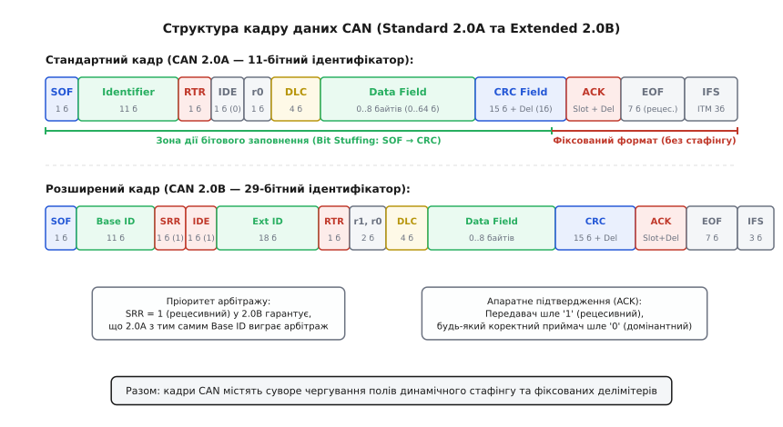
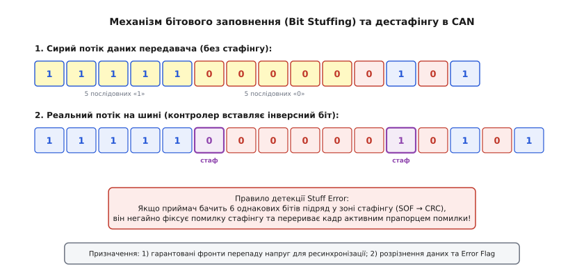
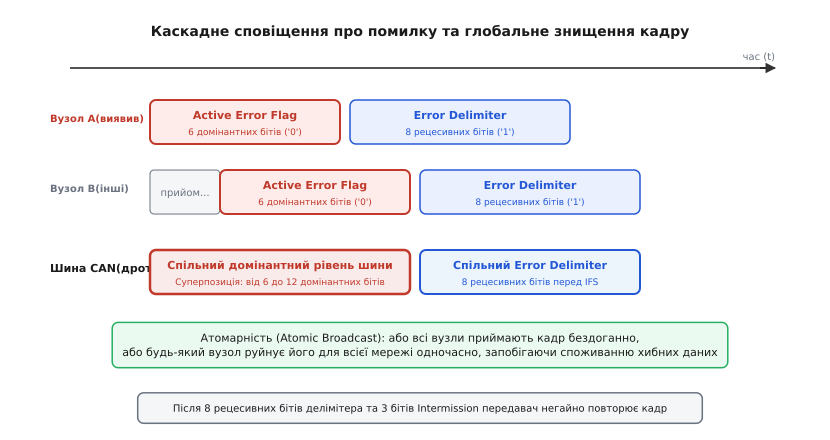
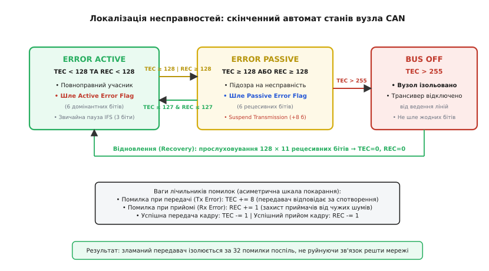
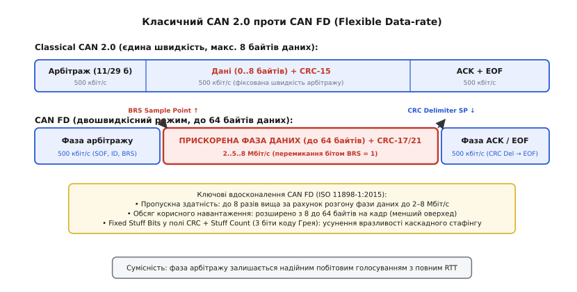

# Кадр CAN

<preknowlist>
- [Арбітраж CAN](topic:communications/can-arbitration) — домінантні та рецесивні стани шини, побітове голосування та логіка дротового-І.
- [Диференційна пара](topic:communications/differential-pair) — передача сигналів різницею напруг CAN_H та CAN_L для стійкості до синфазних завад.
- [Контрольна сума CRC](topic:communications/crc) — поліноміальне виявлення помилок у цифрових потоках даних.
</preknowlist>

Високовольтний імпульс системи запалювання автомобіля або комутаційний сплеск інвертора тягового електродвигуна наводить у спільній кабельній трасі мікросекундну заваду з амплітудою в кілька вольт якраз у ту мить, коли блок керування трансмісією передає критичний кадр обмеження крутного моменту. Якщо хоча б один спотворений біт у коді довжини або тілі корисних даних пройде непоміченим, виконавчий актуатор неправильно виставить кут дросельної заслінки чи тиск у гідравлічній магістралі з безпосередньою загрозою механічної аварії. 

Щоб гарантувати цілісність даних у жорсткому електромагнітному середовищі, протокол Controller Area Network (CAN, стандартизований у серії ISO 11898) не покладається на програмні перевірки прикладного рівня. Натомість багаторівнева система захисту закладена безпосередньо в структуру кадру на фізичному та канальному рівнях: апаратна синхронізація за кожним перепадом напруги, примусове бітове заповнення, 15-бітний поліноміальний код контролю залишку, взаємне групове квитування, каскадне знищення пошкоджених повідомлень активними прапорцями помилок та асиметричні лічильники, що автоматично відключають несправний передавач від лінії без участі центрального диспетчера.

### Анатомія кадру CAN (Standard 2.0A та Extended 2.0B)

Будь-яка передача інформації в шині CAN відбувається дискретними кадрами строго визначеної форми. Стандарт визначає два основні формати кадру даних: стандартний (*Base Frame*, розроблений у специфікації CAN 2.0A) з 11-бітним ідентифікатором та розширений (*Extended Frame*, специфікація CAN 2.0B) з 29-бітним комбінованим ідентифікатором. Обидва формати існують на одній фізичній шині одночасно й повністю узгоджені між собою.

Кадр даних складається з семи послідовних функціональних полів:

```
┌─────┬───────────────────┬─────────┬──────────────┬──────────────┬──────────────┬─────┐
│ SOF │ Arbitration Field │ Control │  Data Field  │  CRC Field   │  ACK Field   │ EOF │
│ 1 б │ 11 б або 29 б     │ 6 бітів │ 0..8 байтів  │ 15 б + 1 Del │ 1 б + 1 Del  │ 7 б │
└─────┴───────────────────┴─────────┴──────────────┴──────────────┴──────────────┴─────┘
```

1. **Початок кадру (SOF — Start of Frame)**:
   Один-єдиний домінантний біт (логічний «0»). Поки шина перебуває в стані спокою, на ній утримується рецесивний рівень (логічна «1»). Перехід лінії в домінантний стан слугує сигналом жорсткої синхронізації (*Hard Synchronization*) для всіх вузлів мережі: генератори приймачів скидають свої внутрішні лічильники фази й починають відлік часу біта строго узгоджено з передавачем.

2. **Поле арбітражу (Arbitration Field)**:
   Визначає пріоритет кадру та зміст переданого повідомлення.
   - У **стандартному форматі (CAN 2.0A)** поле містить 11-бітний базовий ідентифікатор (*Base ID*, від біта `ID10` до `ID0`), за яким іде біт **RTR (*Remote Transmission Request*)**. Біт RTR визначає тип кадру: домінантний «0» означає звичайний кадр даних (*Data Frame*), а рецесивний «1» — кадр дистанційного запиту даних (*Remote Frame*). Завдяки дротовому-І кадр даних завжди перемагає запит із таким самим ідентифікатором під час арбітражу.
   - У **розширеному форматі (CAN 2.0B)** поле арбітражу розбите на дві частини, що сумарно дають 29 бітів ідентифікатора. Спочатку передаються 11 бітів `Base ID`, далі слідує біт **SRR (*Substitute Remote Request*)**, який завжди передається як рецесивний «1». Після нього йде біт **IDE (*Identifier Extension Bit*)**, що дорівнює рецесивному «1» (у стандартному кадрі цей біт стоїть у домінантному «0», вказуючи на 11-бітний формат). Далі передаються 18 бітів розширеного ідентифікатора (*Extended ID*, `ID17..ID0`) та завершальний біт RTR.

> 🔧 **Навіщо потрібен біт SRR.** Присутність рецесивного біта SRR на тій самій позиції, де в стандартного кадру стоїть домінантний біт RTR кадру даних, гарантує: якщо вузол із 11-бітним стандартним ідентифікатором і вузол із 29-бітним розширеним ідентифікатором, у яких перші 11 бітів збігаються, почнуть передачу одночасно, стандартний кадр 2.0A безумовно виграє арбітраж і пройде першим без затримок.

3. **Поле керування (Control Field)**:
   Шестибітне поле, що задає службові параметри та обсяг корисного навантаження. У стандартному кадрі воно містить біт `IDE` (домінантний «0»), один зарезервований біт `r0` (передається як домінантний) та чотирибітний код довжини даних **DLC (*Data Length Code*)**. У розширеному кадрі поле містить два зарезервовані домінантні біти `r1`, `r0` та чотирибітний DLC.
   Код DLC кодує кількість байтів у полі даних від 0 до 8:
   ```
   DLC: 0000b = 0 байтів,  0001b = 1 байт,  ...,  1000b = 8 байтів
   ```
   Якщо контролер отримує значення DLC від `1001b` (9) до `1111b` (15), стандарт CAN 2.0 вимагає обробляти кадр так, ніби він містить рівно 8 байтів даних, не перериваючи зв'язок помилкою.

4. **Поле даних (Data Field)**:
   Містить від 0 до 8 байтів корисної інформації (від 0 до 64 бітів). Кожен байт передається послідовно, починаючи зі старшого значущого біта (MSB — *Most Significant Bit*). Кадр із нульовою довжиною даних часто використовується для передачі порожніх сигналізаторів або запитів синхронізації.

5. **Поле контрольної суми (CRC Field — Cyclic Redundancy Check)**:
   Складається з 15-бітної контрольної послідовності CRC та завершального одного біта **CRC Delimiter**. Поліном контрольної суми стандарту CAN розраховується за генератором:
   ```
   G(x) = x¹⁵ + x¹⁴ + x¹⁰ + x⁸ + x⁷ + x⁴ + x³ + 1
   ```
   У шістнадцятковому представленні дільник дорівнює `0x4599`. Контрольна сума обчислюється над бітовим потоком полів SOF, Arbitration, Control та Data **до** процедури бітового заповнення. Поле CRC Delimiter є фіксованим рецесивним бітом («1»), який створює гарантований спадний перепад напруги перед наступним слотом підтвердження.

6. **Поле підтвердження (ACK Field — Acknowledgment Field)**:
   Двобітне поле, що реалізує апаратне підтвердження успішного прийому всіма активними вузлами мережі.
   - **ACK Slot (1 біт)**: передавач надсилає цей біт як рецесивний «1». Кожен вузол-приймач на шині, який прийняв повідомлення без помилок до кінця поля CRC, у момент ACK Slot активно притискає шину до домінантного стану «0». За логікою дротового-І шина стає в «0», і передавач, зчитуючи лінію, переконується, що хоча б один вузол прийняв кадр неушкодженим.
   - **ACK Delimiter (1 біт)**: обов'язковий рецесивний біт («1»), що відокремлює слот квитування від кінця кадру.

7. **Кінець кадру (EOF — End of Frame)**:
   Послідовність із семи фіксованих рецесивних бітів («1111111»). Жоден вузол не має права виставляти домінантні біти під час EOF. Поява домінантного рівня в цій зоні трактується контролерами як порушення формату.

8. **Міжкадровий проміжок (IFS — Interframe Space)**:
   Мінімальна обов'язкова пауза між двома послідовними кадрами. Складається з поля **Intermission (ITM)** тривалістю в три рецесивні біти («111») та стану спокою шини **Bus Idle** (довільна тривалість рецесивного рівня до появи наступного SOF). Під час трьох бітів Intermission жодному вузлу не дозволено починати нову передачу.


*Повний розподіл полів стандартного (CAN 2.0A) та розширеного (CAN 2.0B) кадрів із позначенням зони дії бітового заповнення та полів фіксованого формату.*

### Бітове заповнення (Bit Stuffing): фізичний механізм та межі дії

Оскільки шина CAN є асинхронною (у ній немає окремого спільного дроту для тактового сигналу *Clock*), приймачі змушені безперервно підлаштовувати свої внутрішні генератори за перепадами напруги з рецесивного стану в домінантний на інформаційних лініях CAN_H та CAN_L. Якщо в полі даних передається довга серія однакових байтів (наприклад, `0x00` або `0xFF`), напруга на шині залишалася б незмінною впродовж десятків мікросекунд, що неминуче призвело б до розбіжності годинників передавача й приймачів через фазовий дрейф кварців.

Для розв'язання цієї проблеми в CAN застосовується апаратне правило **бітового заповнення (Bit Stuffing)**:

> Якщо апаратний протокольний контролер передавача бачить у вихідному потоці **5 послідовних бітів однакового логічного рівня** (п'ять нулів або п'ять одиниць), він автоматично вставляє у фізичний потік на шину **шостий інверсний біт** (домінантний після п'яти рецесивних, або рецесивний після п'яти домінантних).

Приймач виконує дзеркальну операцію дестафінгу (*De-stuffing*): нарахувавши на шині 5 однакових бітів підряд, він перевіряє 6-й біт. Якщо 6-й біт є протилежним за значенням, приймач апаратно видаляє його з потоку перед збереженням у буфер повідомлення, сприймаючи як службовий синхронізаційний імпульс. Якщо ж 6-й біт виявляється таким самим (тобто на лінії виявлено 6 однакових бітів підряд), контролер фіксує апаратну помилку стафінгу (*Stuff Error*) і негайно перериває кадр.

```
Сирий потік даних:      1  1  1  1  1  0  0  0  0  0  0  1 ...
                        └────┬────┘  └────┬────┘
                        5 одиниць     5 нулів
                             │             │
Потік на шині:          1  1  1  1  1 [0] 0  0  0  0  0 [1] 0  1 ...
                                      ▲                 ▲
                                  стаф-біт          стаф-біт
```

Бітове заповнення розв'язує дві фундаментальні інженерні задачі:
1. **Гарантована щільність фронтів синхронізації**: максимальний інтервал між двома послідовними спадними перепадами напруги в шині за будь-яких даних не може перевищувати 10 бітових інтервалів (5 рецесивних бітів + 1 домінантний стаф-біт + 4 домінантні біти).
2. **Розрізнення корисних даних та сигналів аварії**: оскільки нормальний інформаційний потік ніколи не містить більше ніж 5 однакових бітів підряд, послідовність із 6 домінантних бітів однозначно ідентифікується апаратурою як прапорець аварійного переривання кадру (*Active Error Flag*).


*Принцип вставки інверсного біта передавачем після 5 однакових бітів та відновлення вихідного потоку приймачем.*

Межі дії бітового заповнення строго обмежені: воно вмикається на першому біті **SOF** і діє до останнього біта **поля CRC** включно. Починаючи з біта **CRC Delimiter**, бітове заповнення примусово вимикається: поля CRC Delimiter, ACK Slot, ACK Delimiter, End of Frame та Intermission мають фіксовану рецесивну структуру й ніколи не змінюються стаф-бітами.

> 🔗 Щоб розібратися, як фазові буфери бітового інтервалу використовують ці фронти для компенсації затримок у кабелі й температурного дрейфу кварців, перегляньте математичний аналіз квантів часу.
> [Математика бітового інтервалу CAN](topic:communications/can-frame-errors/math-can-bit-timing.md)

### П'ять типів помилок CAN: багаторівневий бар'єр контролю

Стандарт ISO 11898 визначає рівно 5 типів помилок передачі. Вони контролюються паралельно на різних рівнях апаратного автомата вузла:

| Тип помилки | Хто виявляє | Зона перевірки | Фізична суть дефекту |
| :--- | :--- | :--- | :--- |
| **Bit Error** | Передавач | Весь кадр (крім арбітражу й ACK) | Рівень на шині відрізняється від переданого |
| **Stuff Error** | Передавач і Приймачі | Від SOF до кінця CRC | Виявлено 6 однакових бітів підряд у зоні стафінгу |
| **CRC Error** | Приймачі | Поле CRC | Обчислений поліном не збігається з отриманим |
| **Form Error** | Передавач і Приймачі | Делімітери, EOF, Intermission | Виявлено домінантний біт у фіксованому рецесивному полі |
| **ACK Error** | Передавач | Слот ACK | Передавач не отримав домінантного підтвердження «0» |

1. **Помилка рівня біта (Bit Error)**:
   Кожен передавач під час надсилання біта безперервно читає реальний стан шини через власний приймач-трансивер. Якщо зафіксований рівень шини відрізняється від рівня, що його передає вузол, генерується Bit Error.
   *Винятки:* розбіжність не вважається помилкою під час побітового арбітражу (де передача рецесивного «1» та спостереження домінантного «0» означає штатну втрату арбітражу іншому вузлу) та під час ACK Slot (де передавач надсилає «1» і очікує прочитати «0» від приймачів).

2. **Помилка бітового заповнення (Stuff Error)**:
   Виникає, коли в зоні від SOF до CRC Delimiter на шині фіксується 6 послідовних бітів однакової полярності. Причиною найчастіше є фазовий збій приймача, короткочасний сплеск електромагнітної завади, що спотворив один зі стаф-бітів, або неправильно налаштований дільник швидкості (Baudrate) одного з вузлів.

3. **Помилка контрольної суми (CRC Error)**:
   Приймач апаратно обчислює залишок полінома `CRC-15` над прийнятими полями кадру й порівнює його з 15 бітами, отриманими в полі CRC. Якщо результати не зійшлися, фіксується CRC Error. При цьому приймач **не виставляє домінантний біт у ACK Slot**, залишаючи лінію рецесивною, а після проходження CRC Delimiter негайно викидає активний прапорець помилки.

4. **Помилка форми кадру (Form Error)**:
   Фіксується, коли в полі з фіксованим рецесивним значенням (CRC Delimiter, ACK Delimiter, 7 бітів EOF або 3 біти Intermission) з'являється недозволений домінантний біт «0». Це свідчить про глибоку розсинхронізацію вузлів або апаратний збій приймального тракту.

5. **Помилка підтвердження (ACK Error)**:
   Фіксується передавачем, якщо в слоті ACK він читає рецесивний рівень «1». Це означає, що жоден інший вузол у мережі не зміг безпомилково прийняти кадр (або передавач під'єднаний до шини на самоті, чи лінію фізично обірвано).

### Сигналізація помилок: каскадне руйнування та глобальна атомарність

Щойно будь-який вузол мережі (передавач чи приймач) виявляє одну з п'яти вищезгаданих помилок, він негайно перериває звичайний процес передачі чи прийому в тому самому біті й надсилає на шину **кадр помилки (Error Frame)**.

Кадр помилки буває двох видів залежно від поточного стану надійності вузла:

1. **Активний кадр помилки (Active Error Frame)**:
   Використовується справними вузлами в стані *Error Active*. Складається з двох полів:
   - **Active Error Flag**: 6 послідовних **домінантних** бітів («000000»).
   - **Error Delimiter**: 8 послідовних **рецесивних** бітів («11111111»).

2. **Пасивний кадр помилки (Passive Error Frame)**:
   Використовується частково скомпрометованими вузлами в стані *Error Passive*. Складається з:
   - **Passive Error Flag**: 6 послідовних **рецесивних** бітів («111111»).
   - **Error Delimiter**: 8 послідовних рецесивних бітів («11111111»).

```
Вузол A (помилка CRC): ───[Active Error Flag: 6 домінантних]───[Error Delimiter: 8 рецесивних]───
Вузол B (Stuff Error): ───────[Active Error Flag: 6 домінантних]───[Error Delimiter: 8 рецесивних]
Шина (дротове-І):      ───[Суперпозиція: від 6 до 12 домінантних бітів]───[Error Delimiter]──────
```

Механізм руйнування кадру працює за принципом ланцюгової реакції: коли перший вузол, що зафіксував збій (наприклад, помилку CRC), виставляє 6 домінантних бітів Active Error Flag, він навмисно й грубо порушує правило бітового заповнення на спільній лінії. Усі інші вузли мережі, які до цього моменту ще не помітили пошкодження кадру, миттєво фіксують Stuff Error і самі починають видавати власні 6-бітні домінантні прапорці Active Error Flag.

Через різницю в часі виявлення та затримку поширення сигналу по кабелю прапорці різних вузлів накладаються один на одного. У результаті сумарна тривалість домінантного стану шини становить **від 6 до 12 бітів**. Після того, як кожен вузол закінчує передачу свого 6-бітного прапорця, він починає моніторити лінію: щойно шина повертається в рецесивний стан, вузли відлічують 8 рецесивних бітів Error Delimiter.


*Каскадне поширення активного прапорця помилки через порушення правила стафінгу та суперпозиція домінантного сигналу на спільній шині.*

> 🔧 **Навіщо це.** Цей механізм забезпечує фундаментальну властивість протоколу CAN — **глобальну атомарність транзакцій (Atomic Broadcast)**. Вузол або приймає повідомлення одночасно з усіма іншими вузлами мережі, або, якщо бодай один приймач чи передавач виявив збій, повідомлення гарантовано знищується на всій шині, вилучається з приймальних буферів усіх вузлів, а передавач автоматично планує його повторне надсилання під час наступного арбітражу. У мережі CAN неможлива ситуація, коли половина контролерів отримала повідомлення, а інша половина — ні.

### Локалізація несправностей: лічильники TEC/REC та скінченний автомат ізоляції

У будь-якій спільній широкомовній мережі існує ризик апаратної несправності одного конкретного вузла (наприклад, деградація кристала трансивера, пробій конденсатора фільтра або збій внутрішнього компаратора). Якби несправний вузол мав право нескінченно надсилати активні прапорці Active Error Flag (6 домінантних бітів), він міг би назавжди заблокувати шину й паралізувати обмін між рештою абсолютно справних контролерів — класична проблема «божевільного вузла» (*Babbling Idiot*).

Для запобігання цьому сценарію стандарт ISO 11898 реалізує механізм **локалізації несправностей (Fault Confinement)**. Кожен вузол CAN містить два незалежні апаратні лічильники:
- **TEC (Transmit Error Counter)** — лічильник помилок передачі.
- **REC (Receive Error Counter)** — лічильник помилок прийому.

Лічильники оновлюються апаратним автоматом за строгими асиметричними правилами:

1. **При виявленні помилки передавачем** (Bit Error, Stuff Error, Form Error або відсутність ACK):
   ```
   TEC = TEC + 8
   ```
   *Виняток:* якщо під час арбітражу передавач виявив Bit Error через відсутність власного домінантного біта, `TEC` не змінюється. Якщо передавач шле Passive Error Flag і фіксує Bit Error, `TEC = TEC + 8`.

2. **При виявленні помилки приймачем** (Stuff Error, Form Error, CRC Error):
   ```
   REC = REC + 1
   ```
   *Виняток:* якщо приймач зафіксував Bit Error під час надсилання власного Active Error Flag, він збільшує свій лічильник на `REC = REC + 8` (оскільки це вказує на нездатність вузла коректно керувати лінією навіть під час аварійної сигналізації).

3. **При успішній передачі кадру даних**:
   ```
   TEC = max(0, TEC - 1)
   ```

4. **При успішному прийомі кадру даних**:
   ```
   Якщо REC перебував у межах від 1 до 127: REC = REC - 1
   Якщо REC був 0: залишається 0
   Якщо REC був > 127: встановлюється в значення від 119 до 127
   ```

> 🔧 **Чому ваги асиметричні (+8 проти +1).** Якщо лінію спотворив випадковий короткочасний електромагнітний сплеск, помилку зафіксують одночасно і передавач, і всі десять приймачів на шині. Передавач отримає `+8`, а кожен приймач — лише `+1`. Якби ваги були однаковими (`+8 / +8`), то через кілька повторних сплесків уся мережа заблокувала б сама себе. Асиметрія математично гарантує, що лічильник справжнього джерела спотворення (передавача) зростає у 8 разів швидше за лічильники пасивних слухачів, локалізуючи аварію виключно на винуватцеві.

За значеннями лічильників TEC та REC кожен вузол CAN у будь-який момент часу перебуває в одному з трьох станів:

```
                  TEC ≥ 128  або  REC ≥ 128
        ┌──────────────────────────────────────────────┐
        │                                              ▼
┌───────┴──────┐      TEC ≤ 127  та  REC ≤ 127   ┌──────────────┐   TEC > 255   ┌──────────┐
│ ERROR ACTIVE │ ◄────────────────────────────── │ ERROR PASSIVE│ ────────────► │ BUS OFF  │
└──────────────┘                                 └──────────────┘               └──────────┘
       ▲                                                                              │
       └──────────────────────────────────────────────────────────────────────────────┘
                       Відновлення: 128 послідовностей по 11 рецесивних бітів
```

1. **Error Active (Активний стан з помилок)**:
   - **Умова:** `TEC < 128` **ТА** `REC < 128`.
   - Це нормальний робочий стан повністю справного вузла після увімкнення живлення. Вузол бере участь у побітовому арбітражі, передає дані й у разі виявлення будь-якої помилки виставляє **Active Error Flag (6 домінантних бітів)**, примусово стираючи зіпсований кадр на всій шині.

2. **Error Passive (Пасивний стан з помилок)**:
   - **Умова:** `TEC ≥ 128` **АБО** `REC ≥ 128`.
   - Вузол визнається потенційно ненадійним. Він зберігає здатність передавати й приймати дані, але його права на аварійне втручання обмежені:
     - При виявленні помилки вузол надсилає лише **Passive Error Flag (6 рецесивних бітів)**. Оскільки рецесивний стан поступається домінантній одиниці, пасивний прапорець не може зруйнувати передачу інших справних вузлів.
     - Після закінчення передачі або прийому кадру перед початком наступної спроби захоплення шини вузол зобов'язаний витримати додаткову паузу **Suspend Transmission** тривалістю у **8 додаткових рецесивних бітів** після Intermission (сумарно 11 рецесивних бітів паузи). Це дає здоровим вузлам у стані Error Active пріоритетне вікно для початку передачі.
   - Якщо вузол у стані Error Passive здійснює серію успішних передач і прийомів, його лічильники поступово зменшуються, і при падінні обох нижче 128 (`TEC ≤ 127` та `REC ≤ 127`) він автоматично повертається в повноправний стан Error Active.

3. **Bus Off (Повна ізоляція від шини)**:
   - **Умова:** `TEC > 255`.
   - Вузол остаточно визнається апаратно несправним. Драйвер контролера вимикає вихідні каскади трансивера, переводячи виводи CAN_H та CAN_L у високоімпедансний стан (*High-Z*). Вузол повністю від'єднується від лінії зв'язку: він не передає дані, не виставляє підтверджень ACK і не генерує прапорців помилок, звільняючи спільну магістраль для решти системи.
   - **Процедура відновлення (Bus Off Recovery):** вузол може повернутися до роботи лише після програмного перезапуску стека або після того, як його приймач зафіксує **128 послідовностей по 11 послідовних рецесивних бітів** (еквівалент 128 успішно завершених кадрів EOF + Intermission на шині). Це гарантує, що шина повністю стабілізувалася й на ній немає завад. Після цього обидва лічильники скидаються в `TEC = 0` та `REC = 0`, і вузол починає роботу в стані Error Active.


*Скінченний автомат станів вузла CAN із пороговими переходами за лічильниками TEC/REC та процедурою повернення з Bus Off.*

> 🔗 Для практичного моніторингу станів контролера, перехоплення кадрів помилок та автоматичного відновлення після Bus Off у середовищі Linux скористайтеся сокетами SocketCAN.
> [Діагностика помилок та стану вузла CAN у Linux SocketCAN](topic:communications/can-frame-errors/proj-socketcan-error-handling.md)

### Еволюція до CAN FD: подолання обмежень класичного кадру

З ростом складності бортової електроніки класичний стандарт CAN 2.0 зіткнувся з двома фізичними бар'єрами:
1. **Обмеження швидкості (максимум 1 Мбіт/с):** оскільки побітовий арбітраж та ACK Slot вимагають, щоб електричний сигнал встиг пройти всю довжину кабелю туди й назад за час тривалості одного біта, на швидкості 1 Мбіт/с (час біта 1 мкс) довжина шини фізично не може перевищувати 30..40 метрів з урахуванням затримок у трансиверах.
2. **Обмеження корисного навантаження (максимум 8 байтів):** для передачі криптографічних підписів, пакетів прошивки чи масивів сенсорів 8 байтів вимагали складного фрагментування протоколами транспортного рівня (ISO-TP), де накладні витрати заголовків сягали понад 50% пропускної здатності.

Стандарт **CAN FD (Flexible Data-rate, ISO 11898-1:2015)** усунув ці обмеження, розділивши кадр на дві фази з різними швидкостями тактування:

```
            |<────── Фаза арбітражу ──────>|<──── ПРИСКОРЕНА ФАЗА ДАНИХ ────>|<── Фаза ACK ──>|
            |     (наприклад, 500 кбіт/с)  |      (наприклад, 2..5 Мбіт/с)   |  (500 кбіт/с)  |
┌─────┬─────┴──────────────────────────────┼─────────────────────────────────┼────────────────┴─────┐
│ SOF │ 11/29-бітний ID │ BRS=1 │ ESI      │ DLC (до 64 байтів) │ CRC-17/21  │ CRC Del │ ACK │ EOF │
└─────┴────────────────────────────────────┴─────────────────────────────────┴──────────────────────┘
                                           ▲                                 ▲
                                     Перемикання на                    Повернення на
                                    високу швидкість                  базову швидкість
```

1. **Двошвидкісний режим (Dual Bitrate):**
   - **Фаза арбітражу (Arbitration Phase):** поля SOF, ідентифікатор, біти BRS та ESI передаються на стандартній номінальній швидкості (наприклад, 500 кбіт/с). Тут зберігається повний класичний побітовий арбітраж із контролем Round-Trip Time.
   - **Фаза даних (Data Phase):** якщо біт **BRS (*Bit Rate Switch*)** передано в рецесивному стані «1», контролер одразу після точки вибірки біта BRS перемикає тактовий генератор на високу швидкість (2, 4, 5 або 8 Мбіт/с). Уся передача полів DLC, корисних даних та контрольної суми CRC відбувається на прискореній швидкості, оскільки в цій зоні шиною володіє лише один вузол-переможець і конфлікти виключені.
   - У точці вибірки біта CRC Delimiter контролер повертає тактування назад на номінальну швидкість для надійного прийому слота підтвердження ACK та кінця кадру EOF.

2. **Розширення корисного навантаження (до 64 байтів):**
   Чотирибітний код DLC у CAN FD розширено нелінійним відображенням:
   ```
   DLC 0..8  = 0..8 байтів
   DLC 9     = 12 байтів
   DLC 10    = 16 байтів
   DLC 11    = 20 байтів
   DLC 12    = 24 байти
   DLC 13    = 32 байти
   DLC 14    = 48 байтів
   DLC 15    = 64 байти
   ```

3. **Індикатор стану помилок (ESI — Error State Indicator):**
   Окремий біт у заголовку кадру CAN FD, який передавач автоматично виставляє в домінантний «0», якщо він перебуває в стані *Error Active*, і в рецесивний «1», якщо він став *Error Passive*. Це дозволяє приймачам миттєво знати про стан надійності передавача без генерації додаткових діагностичних повідомлень.

4. **Виправлення вразливості стафінгу (Fixed Stuff Bits та Stuff Count):**
   У класичному CAN 2.0 динамічне бітове заповнення в полі CRC створювало теоретичну вразливість: якщо інверсія двох бітів через заваду змінювала кількість стаф-бітів у повідомленні, довжина кадру зміщувалася, що за певних умов могло призвести до пропуску помилки 15-бітним CRC (так званий *stuff-bit cascading*).
   У CAN FD динамічне бітове заповнення в зоні CRC повністю скасовано. Натомість введено:
   - **Stuff Count (4 біти)**: 3 біти коду Грея, що кодують точну кількість динамічних стаф-бітів у тілі кадру за модулем 8, плюс 1 біт парності.
   - **Fixed Stuff Bits**: фіксовані інверсні біти, що автоматично вставляються через кожні 4 або 5 бітів усередині поля CRC на заздалегідь відомих позиціях.
   - **Нові поліноми**: замість CRC-15 застосовується **CRC-17** (для повідомлень обсягом до 16 байтів) або **CRC-21** (для повідомлень від 20 до 64 байтів), що гарантує кодову відстань Хеммінга не менше 6 (виявлення до 5 довільних спотворених бітів у кадрі за будь-яких умов).


*Порівняння часових діаграм класичного кадру CAN 2.0 та двошвидкісного кадру CAN FD з розширеним навантаженням і фіксованими стаф-бітами в CRC.*

### Підсумок: багатошарова надійність без центрального вузла

Стійкість шини CAN до електромагнітних завад і збоїв обладнання досягається не окремим алгоритмом, а синергією шести взаємопов'язаних механізмів канального рівня:

```
                    ┌──────────────────────────────────────────────┐
                    │      БАГАТОШАРОВИЙ ЗАХИСТ КАДРУ CAN          │
                    ├──────────────────────────────────────────────┤
                    │ 1. Фізичний рівень: Диференційна пара CANH/L │
                    │ 2. Синхронізація:   Бітове заповнення (5=1)  │
                    │ 3. Цілісність:      15/17/21-бітний код CRC  │
                    │ 4. Консенсус:       Спільне квитування ACK   │
                    │ 5. Атомарність:     Active Error Flag (6 dom)│
                    │ 6. Ізоляція:        Автомат лічильників TEC  │
                    └──────────────────────────────────────────────┘
```

1. **Диференційний приймач** нейтралізує синфазні завади з амплітудою в десятки вольт.
2. **Динамічний та фіксований стафінг** запобігають фазовому розсинхронізуванню генераторів вузлів.
3. **Поліноміальний код CRC** виявляє всі поодинокі, подвійні та групові помилки довжиною до 15 бітів.
4. **Слот підтвердження ACK** гарантує, що повідомлення дійшло хоча б до одного справного приймача.
5. **Каскадний кадр помилки Active Error Frame** забезпечує глобальну атомарність транзакції: будь-яке пошкоджене повідомлення негайно знищується на всій шині й ставиться передавачем на повторну відправку.
6. **Асиметричні лічильники TEC та REC** відокремлюють випадкові зовнішні завади від внутрішніх несправностей обладнання, автоматично ізолюючи пошкоджений передавач у стані Bus Off.

У сукупності ця архітектура забезпечує розрахункову ймовірність непоміченої бітової помилки менше ніж `4.7 · 10⁻¹¹` на кадр, перетворюючи Controller Area Network на світовий стандарт для систем керування автомобілями, авіонікою, промисловими роботами та медичним обладнанням.
