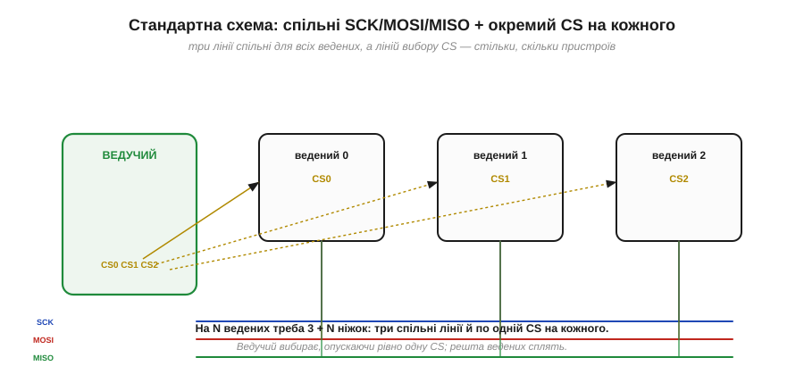
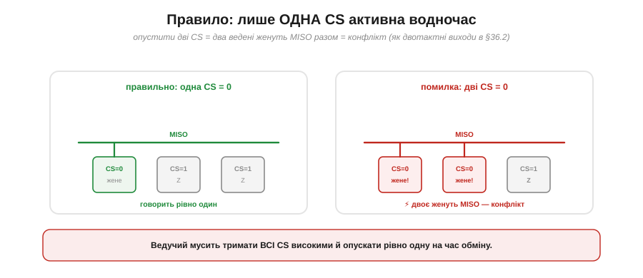
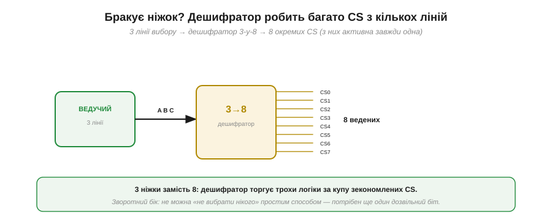
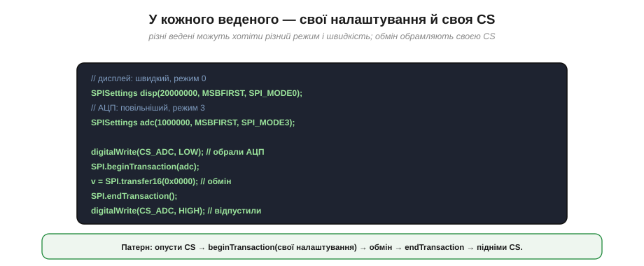
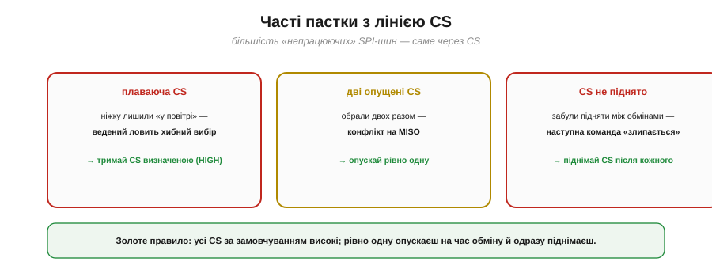

# Вибір кристала (CS) і кілька пристроїв

Уся принада SPI — у швидкості, але платить він **ніжками**, і найвиразніше це видно, коли ведених стає багато. Як посадити на одну SPI-шину п'ять давачів, дисплей і пам'ять? Скільки знадобиться ліній? І що робити, коли ніжок мікроконтролера на всі CS бракує? У цій темі — топологія багатьох пристроїв, головне правило вибору й кілька хитрощів, що рятують ніжки.

### Зіркова топологія: окремий CS на кожного

Стандартний спосіб під'єднати кілька ведених — **зірка**: три лінії SCK, MOSI, MISO роблять **спільними** для всіх, а лінію вибору CS дають **кожному свою**.


*Рис. SCK, MOSI, MISO ідуть до всіх ведених паралельно — це спільна шина. А CS у кожного власна (CS0, CS1, CS2), і всі вони йдуть від ведучого. Щоб поговорити з потрібним, ведучий опускає рівно його CS; решта тим часом «сплять» і не торкаються MISO.*

Логіка проста: дані й такт спільні, а **вибір** — індивідуальний. Ведучий опускає CS того, з ким хоче говорити, обмінюється байтами й піднімає CS назад. Звідси й формула ніжок: на **N** ведених треба **3 + N** ліній — три спільні плюс по одній CS на кожного. Це фундаментальна риса SPI, з якої випливає і його головне правило, і його головна вада.

### Лише одна CS активна водночас

Головне правило зіркової шини: у кожну мить **рівно одна** CS може бути опущена. Чому не дві? Обраний ведений [активно жене лінію MISO](book:communications/spi-lines) своїм двотактним виходом. Якщо опустити дві CS, **двоє** ведених женуть MISO одночасно — а це той самий конфлікт, що виникає, коли [два двотактні виходи зустрічаються на одному дроті](book:electronics/open-collector): один тягне у високий рівень, другий у низький, і вони коротять живлення на землю через себе.


*Рис. Ліворуч: опущена одна CS — MISO жене рівно один ведений, решта у високому імпедансі, усе гаразд. Праворуч: опущено дві CS — двоє ведених женуть MISO разом, виникає конфлікт, і дані псуються. Тому ведучий тримає всі CS високими й опускає тільки одну.*

Тому стандартна дисципліна така: **усі CS за замовчуванням високі**, і лише на час обміну ведучий опускає рівно одну. Опустити дві — гарантований конфлікт на MISO й зіпсовані дані. Це проста, але критична умова коректної роботи багатьох пристроїв на спільній шині.

### Ціна в ніжках проти I2C

Тепер про зворотний бік зірки. Формула «3 + N» означає, що з кожним новим веденим SPI **з'їдає ще одну ніжку**. Порівняймо з I2C, де додавання пристрою не коштує жодного дроту.


*Рис. У SPI кількість ніжок росте як 3 + N: один ведений — 4 ніжки, п'ять — 8, десять — 13. У I2C завжди 2, скільки б пристроїв не висіло на шині. Що більше пристроїв, то відчутніший програш SPI у ніжках.*

**Приклад (ніжки на п'ять пристроїв).** Порахуймо для п'яти ведених:

```
SPI: 3 спільні + 5 CS = 8 ніжок
I2C: 2 (SDA + SCL), скільки б пристроїв не було
```

Ось головний козир I2C за багатьох пристроїв: два дроти на всіх проти восьми. Тому дрібні численні давачі частіше вішають на I2C, а SPI лишають для кількох **швидких** пристроїв. Та коли ніжок усе ж бракує, у SPI є хитрощі, що рятують ситуацію.

### Ланцюжок: daisy-chain

Перша хитрість — **ланцюжкове** з'єднання (*daisy-chain*). Замість зірки ведених з'єднують **послідовно**: MOSI ведучого йде у перший ведений, його вихід — у другий, і так далі, а MISO останнього повертається до ведучого. І всі вони ділять **один** CS і один SCK.


*Рис. Ведені з'єднані в ланцюг: дані ведучого «прошивають» їх один за одним, наче один довгий зсувний регістр. SCK і єдина CS — спільні. Економить CS-ніжки, але вимагає підтримки daisy-chain і надсилання даних одразу для ВСІХ ведених у ланцюзі.*

Ідея спирається прямо на [кільце зсувних регістрів](book:communications/spi-bus), що лежить в основі SPI, тільки кілець тепер кілька, з'єднаних у довгий ланцюг. На кожен такт дані зсуваються крізь **усіх** ведених поспіль. Це економить CS (одна на весь ланцюг), але має ціну: пристрій має **підтримувати** такий режим (не всі вміють), а ведучому щоразу доводиться висувати дані **для всіх** ланок одразу. Daisy-chain поширений у драйверів світлодіодів і каскадів [зсувних регістрів](book:electronics/shift-register), де однотипних пристроїв багато, а керують ними спільно.

### Дешифратор розширює CS

Друга хитрість — **дешифратор** (*decoder / demultiplexer*). Якщо потрібно багато окремих CS, але ніжок обмаль, ставлять дешифратор, що з кількох ліній робить багато.


*Рис. Дешифратор «3-у-8» перетворює 3 лінії вибору на 8 окремих CS (активна завжди одна). Замість 8 ніжок CS витрачаємо 3 — торгуємо трохи логіки за купу зекономлених ніжок.*

**Приклад (економія ніжок дешифратором).** Для восьми ведених:

```
напряму:      3 спільні + 8 CS         = 11 ніжок
з 3→8 дешифратором: 3 спільні + 3 лінії = 6 ніжок
```

Дешифратор перетворює N ліній на 2ᴺ виходів, тож трьома ніжками можна керувати вісьмома CS. Ціна — додаткова мікросхема й те, що «не вибрати нікого» простим способом уже не вийде (потрібен ще дозвільний вхід). Та коли ведених багато, а ніжок мало, це елегантний вихід.

### Налаштування на кожного й патерн транзакції

Важлива практична деталь: різні ведені на одній шині можуть хотіти **різні** налаштування — свій [режим (CPOL/CPHA)](book:communications/cpol-cpha) і свою швидкість. Тому налаштування задають **на кожну транзакцію**, обрамляючи її своєю CS.


*Рис. Дисплей може хотіти 20 МГц і Mode 0, а АЦП — 1 МГц і Mode 3. Перед обміном опускають CS потрібного веденого, відкривають транзакцію з ЙОГО налаштуваннями, обмінюються, закривають транзакцію й піднімають CS.*

```
// у кожного веденого — свої параметри
SPISettings disp(20000000, MSBFIRST, SPI_MODE0);   // дисплей: швидко
SPISettings adc (1000000,  MSBFIRST, SPI_MODE3);   // АЦП: повільніше

digitalWrite(CS_ADC, LOW);          // обрали саме АЦП
SPI.beginTransaction(adc);          // його швидкість і режим
v = SPI.transfer16(0x0000);         // обмін (пише й читає)
SPI.endTransaction();
digitalWrite(CS_ADC, HIGH);         // відпустили
```

Цей **патерн** — «опусти CS → beginTransaction зі своїми налаштуваннями → обмін → endTransaction → підніми CS» — і є стандартний спосіб працювати з кількома різними веденими на одній шині, не плутаючи їхні режими й швидкості.

### Пастки з CS

Насамкінець — найчастіші помилки, і майже всі вони про CS.


*Рис. **Плаваюча CS**: ніжку лишили «у повітрі» — ведений ловить хибний вибір (тримай CS визначеною, високою). **Дві опущені CS**: конфлікт на MISO (опускай рівно одну). **CS не піднято** між обмінами: наступна команда «злипається» з попередньою (піднімай CS після кожного обміну).*

> 🔧 **Навіщо це.** Золоте правило роботи з CS: **усі лінії CS за замовчуванням високі**, опускаєш **рівно одну** на час обміну й **одразу піднімаєш** після. Звідси три перевірки, коли SPI-пристрій поводиться дивно: чи не лишилася якась CS «плаваючою» (без чіткого рівня при старті), чи не опущено випадково дві, і чи піднімаєш CS між транзакціями. Разом із перевіркою [режиму CPOL/CPHA](book:communications/cpol-cpha) це покриває переважну більшість «непрацюючих» SPI-шин.

Так із кількох ліній CS і однієї спільної шини виростає вся топологія багатьох пристроїв на SPI: зірка для звичайних випадків, daisy-chain і дешифратор — коли ніжок бракує, і сувора дисципліна «рівно одна CS на час обміну» як умова коректності. Окреме питання — що робить SPI **швидким** і де [межа цієї швидкості та відстані](book:communications/spi-speed): чому шина тягне десятки мегагерц, але годиться лише в межах плати, а не через довгий кабель.

---
