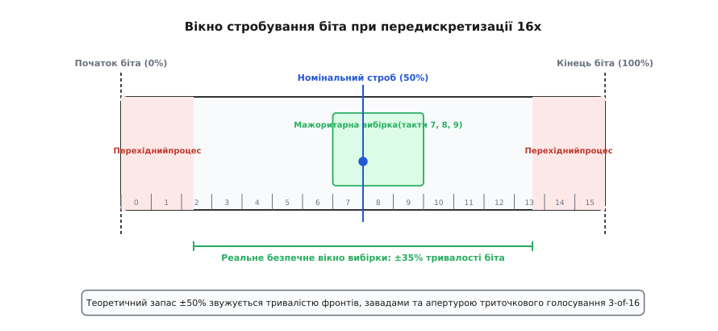
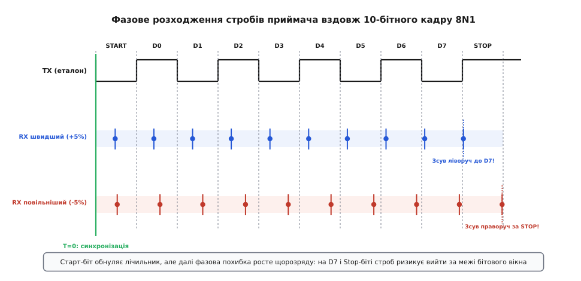
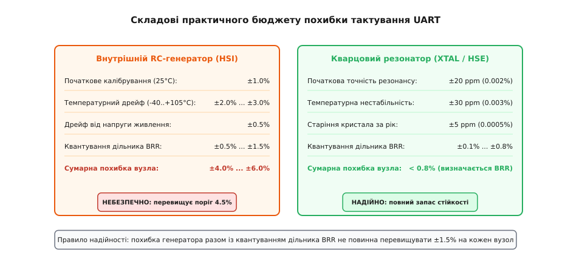
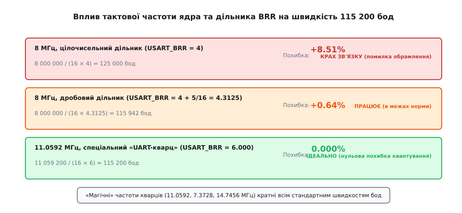

# Допуск годинника UART

<preknowlist>
- [Асинхронна передача](topic:communications/async-serial) — старт-стопна синхронізація без спільного дроту тактування.
- [Кадр UART](topic:communications/uart-frame) — будова кадру (старт, біти даних, парність, стоп).
- [Тактовий сигнал](topic:electronics/clock-signal) — генератори, стабільність частоти та джерела тактування.
</preknowlist>

Мікроконтролер на лабораторному столі при кімнатній температурі +25 °C бездоганно передає телеметрію в комп'ютер на швидкості 115 200 бод. Той самий прилад, установлений у герметичний вуличний щит, на літній спеці при +55 °C або під час зимових морозів при -20 °C раптово починає сипати помилками зв'язку: окремі байти спотворюються, а приймач піднімає прапорець помилки обрамлення (з англійської *framing error*). Осцилограф показує чисті логічні рівні 3.3 В без завад і шумів, дроти неушкоджені, але обмін даними руйнується.

Причина криється в фундаментальній природі інтерфейсу: UART не має окремої лінії тактування. На відміну від синхронних шин, де кожен біт супроводжується перепадом на сусідньому проводі, прийомний вузол UART змушений вгадувати моменти зчитування за власним локальним генератором. Якщо частоти передавача і приймача розходяться бодай на кілька відсотків, накопичений за час кадру фазовий зсув зсуває строб вибірки за межі бітового інтервалу. Щоб проєктувати безвідмовні пристрої, інженер мусить розраховувати допустимий допуск годинника (з латинської *tolerare* — витримувати, терпіти), знати фізичні межі розсинхронізації та правильно обирати джерело тактування.

### Механізм стробування та роль передискретизації

У стані спокою лінія UART утримується у високому логічному рівні «1» (стан мітки). Передавач починає кадр переведенням лінії в низький рівень «0» рівно на один бітовий інтервал `T_nom = 1 / Baud` — це старт-біт. Для приймача цей перепад «1→0» є єдиною точкою просторово-часової синхронізації на весь багатобітний кадр.

Оскільки окремого тактового дроту немає, приймач використовує внутрішній генератор передискретизації (з англійської *oversampling*), який працює в `M` разів швидше за очікувану швидкість бод (типово `M = 16`, рідше `M = 8`). Зафіксувавши спадний фронт, приймач відлічує 8 тактів внутрішнього лічильника (половину біта) і повторно перевіряє стан піна. Якщо там усе ще присутній рівень «0», старт-біт визнається валідним, а внутрішній лічильник перезапускається на початок відліку.


*Анатомія вікна стробування одного біта при 16-кратній передискретизації. Номінальний строб розташований точно на 50% бітового інтервалу (такт 8). Мажоритарний фільтр зчитує такти 7, 8, 9, утворюючи апертуру шириною 12.5%. Краї біта спотворені фронтами наростання й спаду, що звужує практичне безпечне вікно вибірки до ±35%.*

Далі приймач генерує строби вибірки (з англійської *sampling strobe*) через кожні 16 тактів лічильника, намагаючись потрапити рівно в геометричний центр кожного наступного біта (D0, D1, ..., D7, Parity, Stop):

```
t_sample(k) = (k + 0.5) · T_rx
```

де `k` — порядковий номер біта в кадрі (`k = 0` для старту, `k = 1` для D0, ..., `k = 9` для стоп-біта в 10-бітному кадрі).

Вибірка на рівні 50% тривалості біта обрана не випадково: вона забезпечує максимальну рівновіддаленість від лівого (0%) та правого (100%) країв бітового інтервалу. Це дає теоретичний симетричний запас стійкості `±50%` від тривалості біта на момент початку зчитування.

> 🔧 **Навіщо це.** Центрування стробу на 50% створює запас міцності проти завад і розсинхронізації. Якби приймач читав стан лінії на 20% або 80% бітового інтервалу, будь-який дрібний дрейф генератора чи затягнутий ємністю фронт сигналу негайно призводив би до помилки зчитування сусіднього біта.

### Апаратний автомат станів вхідного каскаду UART

Вхідний каскад апаратного приймача містить цифровий кінцевий автомат (FSM), який керує процесом відновлення даних на рівні окремих підтактів:

1. **Стан очікування (IDLE):** контролер безперервно відстежує стан лінії через тригер Шмітта. Коли фіксується спадний фронт «1→0», запускається внутрішній подільник частоти.
2. **Фільтрація шуму старт-біта:** на підтактах 0, 1, 2 і 3 лінія повторно семплюється. Якщо сигнал випадково повернувся в одиницю через імпульсну заваду на лінії, автомат класифікує подію як хибний старт, скидає лічильник і повертається в стан IDLE без генерування переривань.
3. **Фіксація середини біта:** на підтактах 7, 8 та 9 вмикається мажоритарний селектор 3-of-16. Стан біта визначається за правилом більшості. Якщо всі три відліки однакові, біт вважається чистим. Якщо один відлік відрізняється (наприклад, 1-0-1 або 0-1-1), контролер зберігає мажоритарне значення, але одночасно піднімає статусний прапорець виявлення шуму `USART_ISR_NE` (Noise Error).
4. **Зсув у приймальний регістр (RDR):** отриманий біт засувається в тіньовий зсувний регістр. Після накопичення 8 бітів даних перевіряється біт парності (якщо ввімкнено) та стоп-біт.
5. **Верифікація стоп-біта та виявлення помилок кадру:** у момент `t = 9.5 · T_rx` лінія обов'язково повинна мати стан високого рівня «1». Якщо в цей момент зафіксовано «0», контролер виставляє прапорець `USART_ISR_FE` (Framing Error). Автомат не просто фіксує збій, а чекає повернення лінії у високий рівень «1», перш ніж дозволити розпізнавання наступного старт-біта. Це запобігає нескінченному помилковому розпізнаванню нульових бітів даних як нових старт-бітів.

### Фазова модель накопичення похибки вздовж кадру

Поки розглядається один окремо взятий перший біт даних (D0), похибка частоти майже непомітна: строб потрапляє практично в центр. Але фазовий зсув є кумулятивною величиною: він лінійно накопичується з кожним переданим розрядом без жодної проміжної корекції.

Нехай передавач формує біти з тривалістю `T_tx`, а приймач очікує тривалість `T_rx`. Якщо генератор передавача поспішає (`f_tx > f_rx`, отже `T_tx < T_rx`), біти передавача закінчуються швидше, ніж приймач встигає відрахувати свої інтервали. З кожним бітом строб приймача зміщується все ближче до правого (заднього) краю переданого біта. Якщо ж передавач відстає (`f_tx < f_rx`, отже `T_tx > T_rx`), строб приймача щокроку зміщується ліворуч — до переднього фронту біта.


*Фазове розходження стробів вибірки приймача відносно сигналу передавача вздовж 10-бітного кадру формату 8N1. При швидшому генераторі RX строби випереджають сигнал і на Stop-біті зсуваються ліворуч до межі D7. При повільнішому генераторі RX строби відстають і зміщуються праворуч за межі Stop-біта. Найбільш уразливими є останні розряди кадру — D7 та Stop.*

Абсолютний часовий зсув `Δt(k)` між центром переданого біта `(k + 0.5) · T_tx` та моментом вибірки приймача `(k + 0.5) · T_rx` на розряді з індексом `k` описується рівнянням:

```
Δt(k) = (k + 0.5) · (T_rx - T_tx)
```

Введемо відносне відхилення частоти передавача відносно приймача:

```
δ = (f_rx - f_tx) / f_tx = (T_tx - T_rx) / T_rx
```

Тоді накопичений зсув виражається у частках бітового інтервалу:

```
Δt(k) / T_tx = (k + 0.5) · δ / (1 + δ)
```

Для 10-бітного кадру 8N1 останній біт даних D7 зчитується при `k = 8` (часова мітка `t = 8.5 · T_rx`), а стоп-біт перевіряється при `k = 9` (часова мітка `t = 9.5 · T_rx`). Для 11-бітного кадру 8E1 стоп-біт припадає на `k = 10` (часова мітка `t = 10.5 · T_rx`).

Саме на стоп-біті накопичена похибка досягає максимуму. Якщо в момент вибірки строб виходить за межі переданого імпульсу стоп-біта (який обов'язково повинен бути високим рівнем «1»), приймач фіксує на лінії низький рівень наступного старт-біта або перехідний процес і виставляє апаратну помилку `Framing Error`.

### Теоретичні межі неузгодженості частот

Знайдемо математичну межу розсинхронізації, за якої строб гарантовано залишається всередині правильного розряду. Для успішного прийому останнього розряду кадру з індексом `k = N - 1` строб вибірки `t_sample(N-1) = (N - 0.5) · T_rx` повинен лежати між початком `(N - 1) · T_tx` та кінцем `N · T_tx` переданого біта.

Це формує базову нерівність безпомилкового стробування:

```
(N - 1) · T_tx  <  (N - 0.5) · T_rx  <  N · T_tx
```

Розглянемо дві крайові умови для відносного відхилення частоти `δ = (f_rx - f_tx) / f_tx`:

#### 1. Передавач повільніший за приймач (TX повільніший, f_tx < f_rx)
Приймач випереджає передавач, строб зміщується до лівого краю біта `(N - 1) · T_tx`.

```
(N - 1) · T_tx < (N - 0.5) · T_rx
T_tx / T_rx < (N - 0.5) / (N - 1)
1 + δ < (2·N - 1) / (2·N - 2)         [ділення та зведення дробів]
δ < 1 / (2·N - 2)                     [граничне відхилення вгору]
```

Для 10-бітного кадру (`N = 10`, формат 8N1):

```
δ_max_slow = 1 / (2 · 10 - 2)
= 1 / 18                              [обчислення знаменника]
≈ +5.56%                              [верхня межа розсинхронізації]
```

#### 2. Передавач швидший за приймач (TX швидший, f_tx > f_rx)
Приймач відстає від передавача, строб зміщується до правого краю біта `N · T_tx`.

```
(N - 0.5) · T_rx < N · T_tx
(N - 0.5) / N < T_tx / T_rx
1 - 1 / (2·N) < 1 + δ                 [виділення цілої частини]
δ > -1 / (2·N)                        [граничне відхилення вниз]
```

Для 10-бітного кадру (`N = 10`, формат 8N1):

```
δ_max_fast = -1 / (2 · 10)
= -1 / 20                             [обчислення знаменника]
= -5.00%                              [нижня межа розсинхронізації]
```

Ідеальний симетричний діапазон для 10-бітного кадру становить від `-5.00%` до `+5.56%`.

Для 11-бітного кадру (`N = 11`, формат 8E1 з бітом парності або 8N2 з двома стопами):

```
δ_max_slow = 1 / (2 · 11 - 2) = 1 / 20 = +5.00%
δ_max_fast = -1 / (2 · 11)     = -1 / 22 ≈ -4.55%
```

Для 12-бітного кадру (`N = 12`, 9-бітний режим адресації з парністю 9E1):

```
δ_max_slow = 1 / (2 · 12 - 2) = 1 / 22 ≈ +4.55%
δ_max_fast = -1 / (2 · 12)     = -1 / 24 ≈ -4.17%
```

Ці розрахунки виявляють важливе правило: **що довший кадр, то жорсткіші вимоги до точності тактування**. Додавання біта парності та другого стоп-біта зменшує допустиме вікно частотної похибки з 5.0% до 4.5%. Повне алгебраїчне виведення для різних режимів вибірки наведено у [математичному розрахунку меж фазового розходження](topic:communications/clock-tolerance-uart/math-baud-error-budget.md).

### 9-бітний багатопроцесорний режим та подовжені кадри

У промислових протоколах на базі RS-485 (зокрема в деяких конфігураціях Modbus, BACnet MS/TP та автомобільних підмережах LIN) широко застосовується 9-бітний формат передачі. У цьому режимі дев'ятий біт позначає тип байта: «1» вказує на адресу пристрою, а «0» — на дані.

Повна структура такого кадру включає 1 старт-біт, 9 бітів даних, 1 біт парності та 1 стоп-біт (разом `N = 12` бітів). Для стоп-біта індекс вибірки досягає `k = 11` (часова мітка `t = 11.5 · T_rx`).

У 12-бітному кадрі фазова похибка накопичується на 20% довше, ніж у звичайному 8N1:

```
δ_crit_12bit ≈ W_eff / (11.5 · T_rx)
= 0.40625 / 11.5                      [розрахунок для 16x передискретизації]
≈ 3.53%                               [гранична межа для 12-бітного кадру]
```

Це означає, що при використанні 9-бітної адресації вимоги до стабільності тактування зростають: навіть незначний дрейф у 3.5% призводить до втрати адресних міток та повного збою адресації вузлів на шині.

### Очна діаграма та спотворення форми імпульсів

Для кількісної оцінки якості сигналу на фізичному рівні інженери використовують очну діаграму (з англійської *eye diagram*), отриману накладанням тисяч послідовних бітових переходів на екрані цифрового осцилографа з післясвітінням.

У центрі очної діаграми формується розкрив «ока»:
* **Висота розкриву ока (`V_eye`):** визначає запас завадостійкості за напругою відносно порогів спрацьовування тригера Шмітта.
* **Ширина розкриву ока (`T_eye`):** визначає часовий інтервал, протягом якого рівень сигналу залишається стабільним.

На реальній друкованій платі або довгому кабелі розкрив ока стискається через детермінований джитер (викликаний міжсимвольною інтерференцією ISI) та випадковий джитер генераторів. Якщо фазовий зсув стробу виносить точку семплювання за межі розкриву ока, виникає бітова помилка.

### Деградація динамічного запасу завадостійкості

Коли строб вибірки зміщується з ідеального центру 50% ближче до краю біта (наприклад, потрапляє на точку 80% або 85% бітового інтервалу через дрейф тактової частоти на 3.5%), система формально все ще може зчитувати правильний логічний рівень за відсутності перешкод.

Проте динамічний запас завадостійкості в цій точці падає практично до нуля:
1. Напруга на лінії біля фронту ще не досягла повного значення живлення через експоненційний характер заряду ємності.
2. Будь-який короткочасний сплеск напруги від сусідніх ліній зв'язку або імпульсного стабілізатора живлення амплітудою всього 200–300 мВ перетинає поріг перемикання тригера Шмітта.
3. Мажоритарний фільтр фіксує спотворений відлік і перевертає прийнятий біт.

Саме тому пристрої з погано розрахованим тактуванням демонструють «містичні» збої: вони працюють у спокійній лабораторії, але миттєво відмовляють у реальному промисловому середовищі при ввімкненні сусіднього реле або контактора.

### Реальні чинники звуження вікна: чому 5% перетворюються на 1.5–2%

Теоретична межа `±4.5...5.0%` базується на ідеальних припущеннях: миттєва синхронізація з нульовою похибкою, абсолютно прямокутні фронти сигналу та точкова вибірка в одну нескінченно коротку мить. У реальній схемотехніці доступне вікно стробування скорочується через низку фізичних та апаратних ефектів.

#### 1. Квантування детектора старт-біта
При 16-кратній передискретизації внутрішній лічильник може зафіксувати спадний фронт із запізненням до одного такту передискретизації (`1/16 · T_bit = 6.25%`). У середньому невизначеність прив'язки до фронту складає `±0.5 / 16 = ±3.125%` тривалості біта. Це зміщує всю сітку стробів кадру на ±3.125% ще до початку передачі першого біта даних.

#### 2. Апертура мажоритарного фільтра 3-of-16
Для придушення коротких перешкод апаратний UART мікроконтролера виконує вибірку трьох послідовних відліків (такти 7, 8, 9 при `M = 16`) і приймає рішення більшістю голосів (2 з 3). Щоб результат був коректним, усі три відліки повинні перебувати всередині стабільного рівня сигналу. Ширина цієї апертури складає `(9 - 7) / 16 · T_bit = 12.5%` бітового інтервалу.

#### 3. Асиметрія фронтів наростання й спаду (Slew Rate Asymmetry)
Ємність монтажу друкованої плати, довжина кабелю та вихідний опір трансивера затягують фронти сигналу. Особливо гостро це проявляється в лініях з відкритим колектором або в оптоізольованих лініях: розряд через відкритий транзистор відбувається швидко (спад 10–20 нс), а заряд через підтягувальний резистор `R_pullup` формує довгу експоненту:

```
t_rise ≈ 2.2 · R_pullup · C_bus
```

Якщо `R_pullup = 4.7 кОм`, а ємність лінії з захисними діодами становить `C_bus = 200 пФ`:

```
t_rise ≈ 2.2 · 4700 · 200 · 10⁻¹² ≈ 2.07 мкс
```

На швидкості 115 200 бод, де тривалість біта складає `T_bit = 8.68 мкс`, затримка наростання `2.07 мкс` становить майже **24%** від усього бітового інтервалу. Різниця тривалостей фронтів `Δt_slew = t_rise - t_fall` скорочує тривалість одиничних бітів і подовжує нульові, забираючи значну частину доступного вікна стробування.

#### 4. Обмеження швидкодії опторозв'язок
У промисловій автоматиці інтерфейси UART часто ізолюють оптопарами. Дешеві транзисторні оптопари загального призначення (наприклад, PC817 або EL817) мають час наростання `t_r ≈ 4...18 мкс` через ефект Міллера у фототранзисторі. На швидкості 9600 бод (`T_bit = 104 мкс`) така затримка споживає близько 10% бюджету, що є прийнятним. Проте спроба запустити PC817 на 115 200 бод (`T_bit = 8.68 мкс`) повністю знищує імпульси — на виході залишається постійний високий рівень. Для швидкостей 115 200 бод і вище обов'язковими є високошвидкісні оптопари з логічним виходом (6N137, FODM8071) або цифрові ємнісні/магнітні ізолятори (ADuM1201, ISO7721) із затримкою наростання менше 15 нс.

#### 5. Спотворення тривалості імпульсів у цифрових ізоляторах (PWD)
Навіть у швидкісних ємнісних або магнітних ізоляторах існує різниця між затримкою поширення сигналу з низького рівня у високий `t_PLH` та з високого в низький `t_PHL`. Ця різниця називається спотворенням ширини імпульсу (з англійської *Pulse Width Distortion*, `PWD = |t_PLH - t_PHL|`). У дешевих ізоляторах `PWD` може сягати 5–10 нс. На швидкостях понад 1 Мбод (`T_bit < 1000 нс`) це безпосередньо віднімає 1–2% від бюджету похибки тактування.

З урахуванням усіх цих чинників реальне безпечне фазове вікно вибірки скорочується з теоретичних `±50%` до робочих `±30...35%`. Відповідно, гранично допустима сумарна різниця швидкостей між передавачем і приймачем падає з `4.5%` до критичних **2.5–3.0%**.

### Практичний бюджет похибок: RC-генератор проти кварцу

Сумарна неузгодженість швидкості на лінії складається з похибок двох взаємодіючих пристроїв (TX і RX):

```
Δ_total = |δ_tx_gen| + |δ_tx_brr| + |δ_rx_gen| + |δ_rx_brr|
```

де `δ_gen` — нестабільність джерела тактової частоти, а `δ_brr` — похибка квантування коефіцієнта апаратного дільника швидкості.


*Порівняння бюджету похибок для внутрішнього RC-генератора та зовнішнього кварцового резонатора. Внутрішній RC через температурний дрейф нагрівання споживає 4.0–6.0% бюджету, виходячи в червону зону небезпеки. Кварцовий резонатор утримує похибку нижче 0.8%, гарантуючи запас стійкості.*

#### Внутрішній кремнієвий RC-генератор (HSI)
Більшість сучасних мікроконтролерів (STM32, ESP32, AVR, PIC) містять інтегрований RC-генератор (HSI — High-Speed Internal). Його переваги — нульова вартість і відсутність зовнішніх компонентів. Проте фізика інтегрованого RC-ланцюга має фундаментальні обмеження:
* Заводське калібрування при +25 °C та номінальній напрузі 3.3 В дає похибку близько `±1.0%`.
* Температурний дрейф у робочому діапазоні від -40 °C до +85 °C додає ще `±2.0% ... ±3.0%`.
* Зміна напруги живлення в межах робочого діапазону (2.7–3.6 В) вносить додатковий дрейф `±0.5%`.

Сумарна нестабільність RC-генератора досягає **±3.5...5.0%**. Це означає, що один лише мікроконтролер на внутрішньому RC-генераторі може повністю вичерпати або перевищити граничний допуск UART.

#### Кварцовий резонатор (XTAL / HSE)
П'єзоелектричний кварцовий резонатор забезпечує принципово інший рівень стабільності:
* Початкова точність виготовлення: `±10...30 ppm` (`±0.001%...0.003%`).
* Температурна нестабільність від -40 °C до +105 °C: `±20...50 ppm` (`±0.002%...0.005%`).
* Старіння кристала: менше `±5 ppm` на рік.

Сумарна похибка кварцу не перевищує **0.01%**, що на два порядки нижче граничних вимог UART. При використанні кварцу нестабільність джерела тактування можна вважати рівною нулю, а весь бюджет похибки визначається виключно дискретністю дільника швидкості `BRR`.

#### Керамічний резонатор (Ceramic Resonator)
Проміжний варіант між RC та кварцом. Забезпечує початкову точність близько `±0.5%` з температурним дрейфом до `±0.3%` (сумарно близько `±0.8%`). Цього достатньо для надійного зв'язку на 10-бітному кадрі 8N1 за умови малої похибки дільника BRR.

#### Кремнієві MEMS-генератори
Сучасна альтернатива кварцам — кремнієві мікроелектромеханічні резонатори (MEMS, наприклад SiTime). Вони містять крихітну кремнієву балку в вакуумованому корпусі чіпа та інтегровану схему термокомпенсації з PLL. MEMS забезпечують стабільність `±10...50 ppm` у діапазоні від -40 °C до +125 °C і мають у десятки разів вищу стійкість до ударів та вібрацій, ніж тендітні кварцові пластини.

### Фізика кварцового генератора Пірса та вплив навантажувальних ємностей

Незважаючи на високу точність кварцу, розробник може власноруч зіпсувати частоту резонансу неправильним вибором зовнішніх навантажувальних конденсаторів `C_L1` та `C_L2` у схемі генератора Пірса.

Еквівалентна ємність навантаження кристала `C_L`, яку він бачить з боку плати, розраховується як:

```
C_L = (C_L1 · C_L2) / (C_L1 + C_L2) + C_stray
```

де `C_stray` — паразитна ємність друкованих доріжок та виводів мікроконтролера (типово 2–5 пФ).

Якщо даташит кварцу вимагає номінальної ємності `C_L = 12 пФ`, а розробник помилково встановив конденсатори по 33 пФ (що дасть `C_L ≈ 16.5 + 3 = 19.5 пФ`), резонансна частота генератора зміститься вниз за рахунок ефекту підтягування (з англійської *crystal pulling*):

```
Δf / f_nom ≈ (C_m / (2 · (C_0 + C_L_nom))) - (C_m / (2 · (C_0 + C_L_actual)))
```

де `C_m` — динамічна ємність кварцу (близько 2–10 фФ), а `C_0` — статична паралельна ємність тримача кристала (близько 1–3 пФ). Таке відхилення може змістити частоту на 200–500 ppm. Для UART це все ще безпечно, але показує, що точність схеми залежить від узгодження пасивних компонентів.

### Похибка квантування дробового дільника BRR

Навіть при ідеальному кварцовому генераторі швидкість передачі може відрізнятися від номіналу через те, що тактова частота шини процесора `F_pclk` не ділиться націло на потрібний бодрейт.

Формула коефіцієнта ділення регістра `USART_BRR` для передискретизації 16x:

```
DIV = F_pclk / (16 · Baud)
```


*Вплив тактової частоти шини та типу дільника на похибку швидкості 115 200 бод. Цілочисельний дільник при 8 МГц дає неприпустиму похибку +8.51%. Дробовий дільник зменшує її до безпечних +0.64%. Спеціальний кварц 11.0592 МГц забезпечує строго 0.000% похибки.*

#### Цілочисельний дільник (Integer Prescaler)
Розглянемо мікроконтролер із частотою шини `F_pclk = 8.0 МГц` без дробового дільника при налаштуванні на швидкість 115 200 бод:

```
DIV_exact = 8 000 000 / (16 · 115 200) ≈ 4.340277...
DIV_int   = 4                         [округлення до найближчого цілого]

Baud_actual = 8 000 000 / (16 · 4) = 125 000 бод

Error = (125 000 - 115 200) / 115 200
= +9 800 / 115 200                    [різниця швидкостей]
≈ +8.51%                              [критична похибка квантування]
```

Похибка `+8.51%` перевищує навіть теоретичну межу 5.0%. Зв'язок на такій конфігурації не працюватиме взагалі: кожен надісланий байт викликатиме помилку кадру `Framing Error`.

#### Дробовий дільник (Fractional Baud Rate Generator)
Сучасні модулі UART (зокрема в STM32) використовують 4-бітну дробову частину (крок `1/16 = 0.0625`).
Для того самого прикладу `DIV_exact = 4.340277...`:

```
Мантиса = 4
Дріб    = round(0.340277 · 16) = round(5.444) = 5   (тобто 5/16 = 0.3125)
USART_BRR = (4 << 4) | 5 = 0x0045

DIV_actual = 4 + 5/16 = 4.3125

Baud_actual = 8 000 000 / (16 · 4.3125)
= 8 000 000 / 69
≈ 115 942.03 бод

Error = (115 942.03 - 115 200) / 115 200
= +742.03 / 115 200
≈ +0.64%                              [безпечна похибка]
```

Дробовий дільник зменшив похибку квантування з фатальних `8.51%` до безпечних `0.64%`.

#### «Магічні» частоти кварців для UART
В інженерній практиці часто застосовують кварцові резонатори зі специфічними частотами: **11.0592 МГц**, **7.3728 МГц**, **14.7456 МГц**, **18.4320 МГц**.

Ці числа обрані тому, що вони без залишку діляться на 16 та на всі стандартні швидкості бодрейту (9600, 19200, 38400, 57600, 115200, 230400, 460800, 921600).
Наприклад, для `11.0592 МГц` на швидкості 115 200 бод:

```
DIV = 11 059 200 / (16 · 115 200) = 6.000000   (похибка рівно 0.000%)
```

Застосування такого кварцу повністю усуває похибку квантування `BRR`. Розрахунок дільників та алгоритми оцінки сумарної похибки наведено в [калькуляторі регістрів швидкості й дробового дільника](topic:communications/clock-tolerance-uart/proj-brr-error-calc.md).

### Динамічне автокалібрування RC-генератора в процесі роботи

Якщо конструкція приладу вимагає відмови від зовнішнього кварцу заради мінімізації вартості або габаритів, розробник може реалізувати програмне або апаратне автокалібрування внутрішнього RC-генератора за зовнішнім еталоном.

Більшість сучасних мікроконтролерів (STM32, NXP LPC, ESP32) мають регістри підстроювання частоти генератора (наприклад, поле `HSITRIM[4:0]` у регістрі `RCC_ICSCR`). Кожен крок зміни цього поля зміщує центральну частоту HSI приблизно на `0.4%...0.5%`.

Алгоритм динамічної компенсації працює наступним чином:
1. Контролер періодично приймає калібрувальний кадр із відомим інтервалом (наприклад, символ `0x55` або преамбулу протоколу).
2. Внутрішній апаратний таймер захоплення (Input Capture), тактований стабільним низькочастотним годинниковим кварцом 32.768 кГц (LSE) або вимірюваним перепадом, рахує кількість імпульсів HSI за час передачі калібрувального байта.
3. Якщо виміряна кількість тіків відрізняється від еталонної, прошивка інкрементує або декрементує значення `HSITRIM`.
4. Це повертає частоту внутрішнього RC-генератора в межі `±0.5%` від номіналу незалежно від нагрівання корпусу.

### Діагностика розсинхронізації в Linux та RTOS

У системах під керуванням Linux драйвери послідовних портів збирають детальну апаратну статистику помилок прийому. Перевірити наявність помилок розсинхронізації можна безпосередньо через віртуальну файлову систему `procfs`:

```
cat /proc/tty/driver/serial
```

Типовий вивід діагностики:

```
0: uart:16550A port:000003F8 irq:4 tx:14520 rx:14498 fe:22 pe:0 brk:0 oe:0
```

Поле `fe:22` вказує на 22 зафіксовані помилки обрамлення (Framing Errors). Якщо це число зростає під час обміну даними, це є прямим свідченням того, що фазовий зсув на стоп-біті перевищує допустимий допуск, або тактова частота одного з пристроїв дрейфує під навантаженням.

У користувацькому просторі програмний стек може отримувати сповіщення про помилки через системний виклик `ioctl` з командою `TIOCGICOUNT`:

:::tabs
```c
#include <sys/ioctl.h>
#include <linux/serial.h>
#include <stdbool.h>

bool check_framing_errors_c(int fd) {
    struct serial_icounter_struct icounter;
    if (ioctl(fd, TIOCGICOUNT, &icounter) == 0) {
        return (icounter.frame > 0);
    }
    return false;
}
```
```cpp
#include <sys/ioctl.h>
#include <linux/serial.h>
#include <expected>
#include <string_view>

namespace serial_diag {

[[nodiscard]] std::expected<bool, std::string_view> hasFramingErrors(int fd) noexcept {
    serial_icounter_struct icounter{};
    if (::ioctl(fd, TIOCGICOUNT, &icounter) < 0) {
        return std::unexpected{"Failed to query serial icounter"};
    }
    return (icounter.frame > 0);
}

} // namespace serial_diag
```
:::

Моніторинг лічильника `frame` у реальному часі дає змогу виявити деградацію зв'язку задовго до повного розриву з'єднання (наприклад, під час поступового нагрівання блоку керування).

### Схемотехнічні правила вибору джерела тактування

Щоб гарантувати 100% надійність асинхронного зв'язку в серійних виробах у всьому діапазоні температур, керуйтеся наступними інженерними правилами:

1. **Золоте правило допуску:** похибка окремого вузла `|δ_node| = |δ_gen| + |δ_brr|` не повинна перевищувати **±1.5%**. Сумарна неузгодженість двох вузлів лінії `|Δ_total|` не повинна перевищувати **2.5%**.
2. **Коли допустимий внутрішній RC-генератор:**
   * Низькі швидкості (до 19 200 бод) на коротких лініях (плата–плата).
   * Лабораторні або побутові прилади з фіксованою температурою середовища (+15...+30 °C).
   * Застосування автокалібрування швидкості (Auto-Baud) за синхросимволом або преамбулою.
3. **Коли зовнішній кварцовий резонатор є обов'язковим:**
   * Швидкості 115 200 бод і вище (921 600 бод, 1.5–3 Мбод).
   * Індустріальний температурний діапазон (-40...+85 °C або -40...+125 °C в автомобілебудуванні).
   * Довгі кабельні лінії (протоколи [RS-485](topic:communications/rs-485), Modbus RTU, де затягнуті фронти споживають частину часового запасу).
   * Формати кадрів з парністю (8E1, 8O1) або 9-бітні протоколи, де довжина кадру досягає 11–12 бітів.
   * Контролери з цілочисельними дільниками `BRR` без апаратної дробової частини.

> 🔧 **Навіщо це.** Дотримання правила «не більше ±1.5% на вузол» рятує від найпідступніших апаратних дефектів, які виявляються лише в польових умовах після монтажу обладнання в закриті корпуси або на відкритому повітрі. Якщо бюджет похибки прораховано заздалегідь, пристрій працюватиме десятиліттями без жодної втрати байта.
