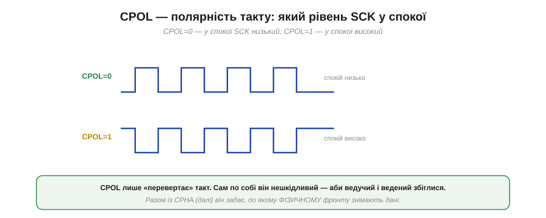
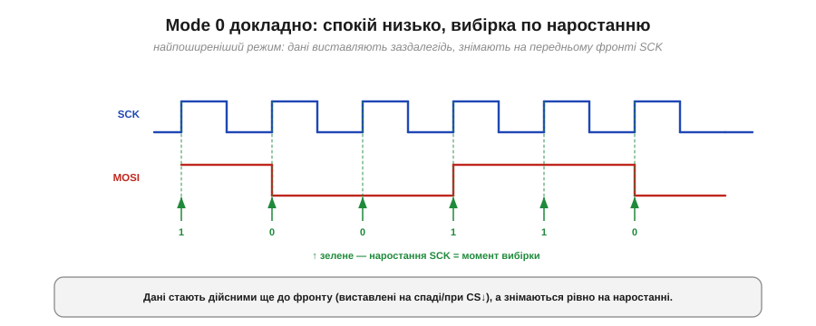
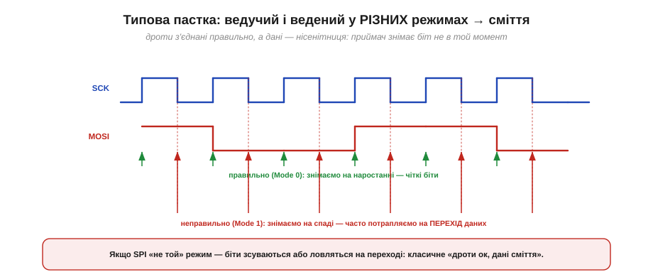
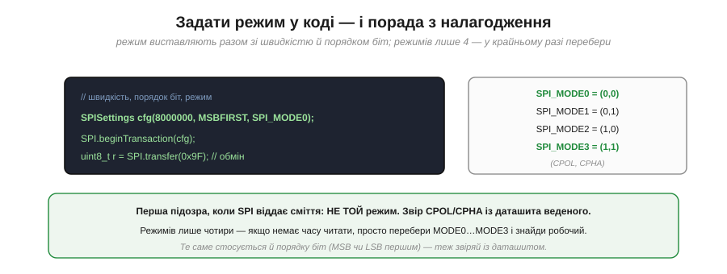

# Режими CPOL/CPHA

Якщо SPI колись «не запрацював, хоч усе з'єднано правильно», майже напевно винні **режими**. SPI лишає на вибір дві дрібні, на перший погляд, речі: у якому стані тримати такт у спокої і по якому його фронту знімати біт. Дві двійкові опції дають **чотири** комбінації — і якщо ведучий із веденим обрали різні, приймач знімає дані не в той момент, перетворюючи їх на нісенітницю. Розберімося в цих двох параметрах і навчімося безпомилково обирати правильний режим.

### CPOL: рівень спокою такту

Перший параметр — **CPOL** (*Clock Polarity*, полярність такту). Він задає лише одне: який рівень має SCK, коли нічого не передається.


*Рис. CPOL = 0 — у спокої такт **низький**, і кожен такт починається наростанням. CPOL = 1 — у спокої такт **високий**, і кожен такт починається спаданням. CPOL лише «перевертає» всю діаграму такту згори вниз.*

Сам по собі CPOL нешкідливий: він тільки визначає рівень спокою й, відповідно, який фізичний фронт (наростання чи спадання) вважати «переднім». Важливо одне — щоб ведучий і ведений однаково домовилися. А ось **коли** саме знімати біт, задає другий параметр.

### CPHA: на якому фронті вибірка

Другий параметр — **CPHA** (*Clock Phase*, фаза такту). Він каже, на якому з двох фронтів кожного такту приймач **знімає** біт.


*Рис. CPHA = 0 — біт знімають на **першому** фронті такту (дані виставлені заздалегідь і вже стоять). CPHA = 1 — біт знімають на **другому** фронті (на першому дані якраз міняються). Різниця — зсув на пів біта в тому, коли виставляють і коли читають дані.*

Сенс CPHA — у домовленості «виставити, потім зняти». За **CPHA = 0** дані мусять стояти на лінії ще до першого фронту (їх виставляють заздалегідь, часто в момент CS↓ або на попередньому спаді), а знімають на цьому першому фронті. За **CPHA = 1** усе зсунуто на пів такту: перший фронт **виставляє** новий біт, а знімають його аж на другому фронті. Головне — обидві сторони повинні однаково розуміти, на якому фронті дані вже дійсні.

### Чотири режими

CPOL і CPHA — кожен по два значення, разом чотири комбінації, які прийнято нумерувати **режимами 0–3**.


*Рис. Mode 0 = (0,0): спокій низько, вибірка по наростанню. Mode 1 = (0,1): спокій низько, вибірка по спаданню. Mode 2 = (1,0): спокій високо, вибірка по спаданню. Mode 3 = (1,1): спокій високо, вибірка по наростанню. Найпоширеніші — 0 і 3.*

Запам'ятовувати всі чотири напам'ять не треба — досить розуміти, що це просто (CPOL, CPHA). На практиці абсолютна більшість чіпів працює в **Mode 0** (спокій низько, вибірка по наростанню) або **Mode 3** (спокій високо, вибірка по наростанню). Головне правило незмінне: **ведучий і ведений мусять стояти на одному режимі**.

### Mode 0 докладно

Розгляньмо найпоширеніший режим у деталях, щоб відчути ритм.


*Рис. У Mode 0 такт у спокої низький; дані на лінії стають дійсними ще до фронту (їх виставляють на попередньому спаді або при CS↓), а знімають рівно на **наростанні** SCK. Шість фронтів — шість знятих біт.*

Логіка проста й симетрична: на спаді такту той, хто говорить, **готує** наступний біт; на наростанні приймач його **знімає**. Кожен фронт наростання влучає рівно в середину стабільного біта — точно як ми хотіли. Це й робить Mode 0 «типовим за замовчуванням».

### Типова пастка: різні режими → сміття

А тепер — власне пастка, заради якої й існує ця тема. Що буде, якщо ведучий шле в Mode 0, а ведений налаштований на Mode 1?


*Рис. Ведучий виставляє дані для зняття на **наростанні** (Mode 0, зелені стрілки — чіткі біти). Та ведений у Mode 1 знімає на **спаданні** (червоні стрілки) — і часто потрапляє якраз на **перехід** даних, де рівень невизначений. Результат — зсунуті чи хибні біти, хоч дроти з'єднані бездоганно.*

Ось чому це таке підступне: фізично все правильно — MOSI, MISO, SCK, CS з'єднані як треба, осцилограф показує гарні сигнали, — а дані виходять сміттям. Приймач просто **дивиться не в той момент**: знімає біт тоді, коли лінія ще перемикається, або зсувається на пів біта. Класичний симптом — «то працює, то ні», стабільне сміття або зчитування, схоже на правду, але зміщене.

> 🔧 **Навіщо це.** Коли SPI віддає нісенітницю, а дроти точно правильні, **перша підозра — режим**. Звір CPOL і CPHA, які хоче ведений (з даташита), з тими, що виставив ведучий. Це найчастіша помилка SPI, дорожча навіть за [плутанину з лінією CS](book:communications/spi-lines). Добра новина: помилитися можна лише чотирма способами, і всі вони швидко перевіряються (нижче).

### Як визначити режим із даташита

Звідки взяти правильний режим? З **часової діаграми** в даташиті веденого. Її читають двома поглядами.


*Рис. Погляд перший: який рівень SCK у спокої? Низький → CPOL = 0. Погляд другий: на якому фронті стоїть стрілка вибірки даних? На наростанні (першому) → CPHA = 0. Разом: CPOL = 0, CPHA = 0 = Mode 0.*

Алгоритм простий і працює для будь-якої SPI-діаграми: (1) подивися на **рівень спокою** SCK — це CPOL; (2) знайди, на якому **фронті** діаграма показує зняття/дійсність даних — це CPHA. Дві відповіді складаються в номер режиму. Якщо ж даташит прямо пише «SPI Mode 0» — ще краще, не доведеться навіть дивитися на діаграму.

### Задати режим у коді — і порада з налагодження

Нарешті — як виставити режим у програмі. У світі Arduino його задають разом зі швидкістю й порядком біт:

```
// швидкість 8 МГц, старший біт першим, режим 0
SPISettings cfg(8000000, MSBFIRST, SPI_MODE0);
SPI.beginTransaction(cfg);
uint8_t r = SPI.transfer(0x9F);   // обмін (і пише, і читає одночасно)
SPI.endTransaction();
```


*Рис. Режим виставляють разом зі швидкістю й порядком біт: SPI_MODE0…SPI_MODE3 відповідають парам (CPOL, CPHA). Порада: якщо SPI віддає сміття й немає часу читати даташит — режимів лише чотири, тож просто перебери MODE0…MODE3 і знайди робочий.*

> 🔧 **Навіщо це.** Тримай у голові короткий чек-лист «німого» SPI: (1) **режим** — CPOL/CPHA звірені з даташитом? (2) **порядок біт** — MSB чи LSB першим (теж налаштування)? (3) **CS** — [смикаєш правильно](book:communications/spi-lines)? (4) **швидкість** — [не зависока для цього веденого](book:communications/spi-speed)? Перші два — найчастіші. І найшвидший спосіб, коли дані схожі на сміття: оскільки режимів лише чотири, **перебери** SPI_MODE0…MODE3 — за чотири спроби знайдеш робочий, а тоді вже звіриш із даташитом, чому саме він.

Режими — найпідступніша частина SPI, але варто звести правило до одного речення: ведучий і ведений мусять стояти на однаковій парі (CPOL, CPHA), а взяти її — з часової діаграми веденого. Коли ж на спільних SCK/MOSI/MISO висить **кілька** пристроїв, кожному потрібна власна лінія вибору, і тут у гру вступає [вибір кристала](book:communications/chip-select) — окремий CS на кожен ведений, а за браку ніжок — хитріші схеми на кшталт з'єднання «ланцюжком».

---
