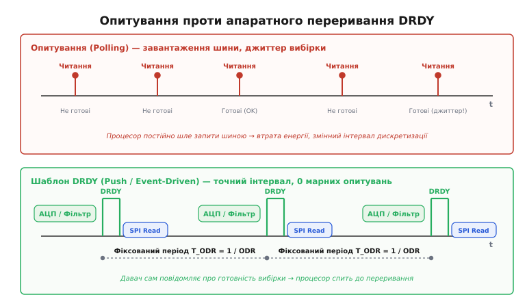
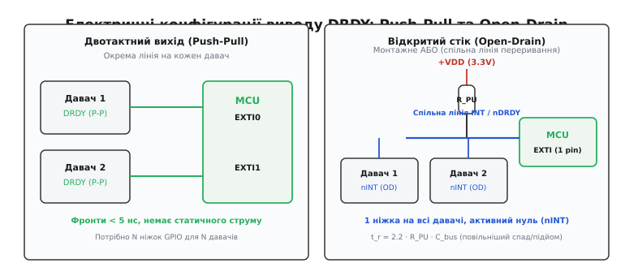
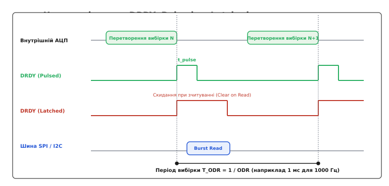
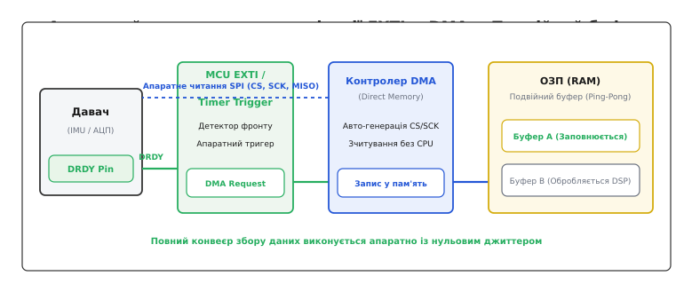
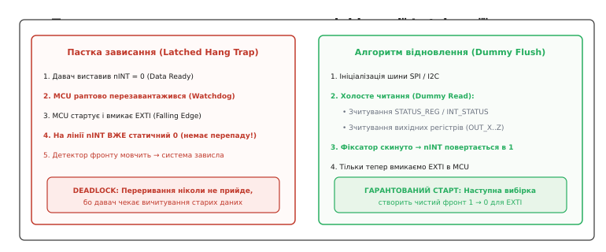

# Шаблон DRDY і переривання давача

<preknowlist>
- [Шина SPI](book:communications/spi-bus) — синхронний послідовний протокол обміну з вибором кристала (CS).
- [Шина I2C](book:communications/i2c-bus) — двопровідний інтерфейс обміну даними з адресацією та лініями відкритого стоку.
- [Регістрова карта](book:communications/register-map) — адресний простір керування, стану та вибірок цифрового давача.
</preknowlist>

Коли мікроконтролер опитує цифровий акселерометр, гіроскоп чи прецизійний аналогово-цифровий перетворювач (АЦП) звичайним періодичним читанням регістрів (polling, від англ. *poll* — опитувати), вимірювальна система втрачає обчислювальні ресурси та точність. На частоті дискретизації 1 кГц контролер змушений кожну мілісекунду ініціювати транзакцію шини SPI або I2C, навіть коли черговий результат вимірювання ще не сформовано у внутрішньому цифровому тракті первинного перетворювача. Якщо опитувати занадто часто — шина виявляється перевантаженою порожніми транзакціями читання регістру стану, а процесор витрачає такти на очікування. Якщо ж опитувати за локальним таймером процесора — виникає фазовий джиттер (jitter, від англ. *jitter* — тремтіння, часова нестабільність): незалежні дрейфи тактових генераторів давача і контролера призводять до зчитування застарілих дублікатів вибірок або до непомітного пропуску нових даних.

Усунення цього протиріччя ґрунтується на інверсії керування: замість того щоб ведучий примусово випитував стан вузла, сам давач сигналізує про завершення вимірювання через виділений фізичний вивід. Цей підхід називають шаблоном готовності даних — **DRDY** (*Data Ready*).

```
Опитування (Polling):  MCU ──[ Запит: готові? ]──> Давач ──[ Ні, чекайте ]──> MCU
DRDY (Event-driven):    Давач ──[ Апаратний імпульс DRDY ]───────────────────> MCU (EXTI / DMA)
```

### Чому опитування (Polling) руйнує точність і перевантажує шину

Спроба організувати збір даних шляхом циклічного опитування стикається з трьома фундаментальними проблемами: непродуктивними накладними витратами шини, часовим джиттером дискретизації та ризиком розриву даних під час зчитування.


*Зверху: опитування шиною навантажує процесор і канал зв'язку, створюючи випадковий джиттер моменту захоплення вибірки. Знизу: апаратний сигнал DRDY сповіщає мікроконтролер суворо у момент готовності вибірки, витримуючи рівномірний крок у часі.*

#### Накладні витрати шини та блокування каналу

Перша вада полягає у марнуванні пропускної здатності. Щоб дізнатися, чи завершилося аналогово-цифрове перетворення, мікроконтролер надсилає команду читання регістру стану (наприклад, `STATUS_REG` або `INT_SRC`). У шині I2C кожна така перевірка вимагає передачі адреси пристрою, адреси регістру, повторного старту та прийому байта прапорців — це забирає щонайменше 20–30 тактів шини SCL. Якщо на шині працює кілька давачів, постійний запит статусу блокує доступ іншим абонентам і збільшує струм споживання як мікроконтролера, так і інтерфейсних кіл.

Навіть на високошвидкісній шині SPI опитування створює постійні перемикання ліній вибору кристала (CS) та тактування SCK, які випромінюють електромагнітні завади безпосередньо біля чутливого аналогового сенсора.

#### Математична природа джиттера вибірки та деградація SNR

Друга проблема — часовий джиттер вибірки (`t_j`). Алгоритми цифрової обробки сигналів, безінерційної навігації (AHRS / INS) та фільтри Калмана спираються на припущення, що інтервал між вибірками `T_s` є суворо константним:

```
T_s = 1 / ODR = const
```

Тут ODR (*Output Data Rate*) — частота видачі вихідних даних. Коли зчитування запускається програмним таймером операційної системи реального часу (RTOS), затримка планувальника, блокування планування критичними секціями та обробка інших переривань створюють флуктуацію моменту зчитування `Δt`. Якщо обчислювати кут повороту інтегруванням кутової швидкості:

```
θ[k] = θ[k-1] + ω[k] · Δt      [чисельне інтегрування: крок за часом має бути точним]
```

то навіть мікросекундне відхилення `Δt` у кожній вибірці призводить до прогресуючого накопичення систематичної похибки інтегрування.

Вплив джиттера на динамічний діапазон вимірювального тракту описується обмеженням відношення сигнал/шум (SNR):

```
SNR_jitter = -20 · log10(2 · π · f_in · t_j)      [деградація шуму від нестабільності часу]
```

**Розрахунок деградації SNR від джиттера опитування:**

```
Вхідний сигнал вібрації: f_in = 500 Гц

1. Опитування через RTOS із затримкою планувальника: t_j = 50 μs (50 · 10⁻⁶ с)
   2 · π · 500 · 50 · 10⁻⁶ = 0.15708
   log10(0.15708) = -0.8039
   SNR_jitter = -20 · (-0.8039) ≈ 16.1 дБ (еквівалентно розрядності менше ніж 3 біти!)

2. Апаратне тактування за лінією DRDY: t_j = 20 нс (20 · 10⁻⁹ с)
   2 · π · 500 · 20 · 10⁻⁹ = 0.00006283
   log10(0.00006283) = -4.2018
   SNR_jitter = -20 · (-4.2018) ≈ 84.0 дБ (повна підтримка 14–16 біт точності)
```

Цей розрахунок доводить: програмне опитування повністю знецінює використання високорозрядних 16-бітних та 24-бітних АЦП, перетворюючи їхній динамічний діапазон на шум через випадкові флуктуації часу опитування. Ба більше, джиттер вибірки порушує умови теореми Котельникова-Найквіста, спричиняючи аліасинг (aliasing) та змішування високочастотних шумів у робочу смугу частот.

#### Розрив даних (Data Tearing)

Третя небезпека — стан гонки та розрив даних (*data tearing*). Якщо давач видає 16-бітні або 24-бітні координати (наприклад, осей X, Y, Z — сумарно 6 або 9 байтів), вони розподілені між кількома 8-бітними регістрами (`OUT_X_L`, `OUT_X_H`, `OUT_Y_L` тощо). Якщо внутрішнє перетворення давача закінчиться в той момент, коли мікроконтролер устиг вичитати молодший байт `OUT_X_L`, але ще не дійшов до старшого `OUT_X_H`, старший байт оновиться новим значенням. Зшите число виявиться грубо спотвореним: якщо значення змінювалося від `0x00FF` до `0x0100`, зчитування може зафіксувати `0x01FF` — катастрофічний сплеск у вимірювальному тракті.

> 🔧 **Навіщо це.** В інерційних вимірювальних модулях (IMU) квадрокоптерів та автопілотів вибірки гіроскопа знімаються на частотах 1–8 кГц. Найменший збій узгодженості між старшим і молодшим байтами кутової швидкості породжує фальшивий стрибок у кількасот градусів на секунду, що миттєво зриває контур стабілізації польоту.

### Архітектурний принцип DRDY: від опитування до сповіщення подіями

Шаблон DRDY розв'язує ці проблеми апаратним шляхом. Цифровий давач містить власний аналоговий тракт, АЦП, блок цифрової фільтрації (дециматори, sinc-фільтри, FIR/IIR-компенсатори) і кінцевий буфер вихідних даних. Коли всі внутрішні операції завершено і неподільний блок вибірок записано у вихідні регістри, внутрішня цифрова логіка формує апаратний перепад напруги на окремому виводі мікросхеми, який позначають **DRDY**, **INT**, **RDY** або **DATA_READY**.

Цей механізм реалізує парадигму керування подіями (*event-driven architecture*):
1. **Автономність вимірювання:** Давач самостійно веде цикл перетворення відповідно до свого внутрішнього високостабільного генератора тактової частоти.
2. **Атомарність оновлення:** Вихідні регістри оновлюються одномоментно з внутрішнього тіньового регістра (shadow register), що виключає появу неузгоджених проміжних станів.
3. **Енергоефективність ведучого:** Процесор мікроконтролера не бере участі в очікуванні — він може перебувати в енергоощадному режимі сну (Deep Sleep / Stop Mode), доки імпульс на лінії DRDY не розбудить його через контролер зовнішніх переривань.

```
Тракт давача: [АЦП / MEMS] ──> [Децимація / Фільтр] ──> [Тіньовий регістр] ──> [Вихідні регістри]
                                                                                     │
                                                                   [Вивід DRDY = 1] ─┘
```

### Електричний інтерфейс: полярність і типи вихідного каскаду

Фізичне підключення лінії DRDY визначається двома параметрами конфігурації: логічною полярністю сигналу та схемотехнікою вихідного каскаду давача.


*Ліворуч: симетричний двотактний вихід (Push-Pull) дає максимальну швидкість фронтів, але потребує індивідуального виводу GPIO на кожен давач. Праворуч: вихід із відкритим стоком (Open-Drain) із зовнішнім резистором підтяжки дозволяє поєднати кілька давачів на єдину лінію переривання за схемою монтажного АБО.*

#### Полярність: Active-High проти Active-Low

* **Активна одиниця (Active-High):** У стані спокою на лінії утримується логічний нуль (0 В). При появі нових даних рівень піднімається до напруги живлення VDD.
* **Активний нуль (Active-Low, позначається як DRDȲ, nDRDY, nINT):** У спокої лінія перебуває під потенціалом VDD, а сигнал готовності позначається спадом до 0 В.

У промисловій та прецизійній апаратурі перевагу віддають активному нулю. Причина полягає у стійкості до перехідних процесів: лінія, підтягнута резистором до живлення, має вищу завадостійкість до наведених шумів відносно спільної шини землі, а вимкнений або перезавантажуваний давач у стані високого імпедансу не створює фальшивого активного рівня.

#### Вихідний каскад: Push-Pull проти Open-Drain

Вибір вихідного каскаду визначає топологію друкованої плати та споживання струму:

1. **Двотактний вихід (Push-Pull / тотемний каскад):** Каскад із пари комплементарних транзисторів активно формує як високий, так і низький рівень.
   * *Переваги:* Мінімальний час наростання і спаду фронту (`t_r`, `t_f < 5 нс`), висока навантажувальна здатність, відсутність постійного струму спокою через резистори.
   * *Обмеження:* Виходи не можна об'єднувати між собою. Якщо два давачі з виходами Push-Pull підключити до одного провідника, протифазний стан призведе до короткого замикання живлення на землю через кристали мікросхем. Кожному давачу потрібен індивідуальний вивід GPIO мікроконтролера.

2. **Відкритий стік (Open-Drain / відкритий колектор):** Вихідний каскад містить лише нижній N-канальний транзистор, який може притягнути лінію до землі (0 В), а переведення у високий стан здійснюється зовнішнім підтягувальним резистором `R_PU` (*pull-up resistor*).
   * *Переваги:* Реалізація схеми «монтажного АБО» (Wired-OR / Wired-AND залежно від логіки). Лінії переривань від кількох давачів (акселерометр, магнітометр, барометр) підключаються до однієї спільної доріжки і заводяться на єдиний вивід переривання процесора. Будь-який давач може притягнути шину до нуля.
   * *Обмеження:* Спадаючий фронт формується швидко (транзистором), але наростаючий фронт визначається експоненційним зарядом паразитної ємності шини `C_bus` через опір `R_PU`.

Час наростання фронту відкритого стоку оцінюється через сталу часу RC:

```
t_r ≈ 2.2 · R_PU · C_bus      [час переходу від 10% до 90% рівня V_DD]
```

Розрахуємо підтяжку для плати з трьома давачами на спільній лінії, де сумарна ємність монтажу і входів складає `C_bus = 50 пФ`, а напруга живлення `VDD = 3.3 В`:

```
Якщо R_PU = 10 кΩ:
t_r = 2.2 · 10 000 Ω · 50 · 10⁻¹² Ф = 1.10 μs
Струм при активному стані: I = 3.3 В / 10 кΩ = 0.33 мА

Якщо R_PU = 2.2 кΩ:
t_r = 2.2 · 2 200 Ω · 50 · 10⁻¹² Ф = 0.24 μs (240 нс)
Струм при активному стані: I = 3.3 В / 2.2 кΩ = 1.50 мА
```

Занадто великий опір підтяжки затягує фронт і може викликати багаторазове помилкове спрацьовування детектора перепаду на вході мікроконтролера через шуми в зоні порогу перемикання логіки. Занадто малий опір збільшує статичне енергоспоживання під час утримання переривання. Оптимальним компромісом для більшості схем є значення в діапазоні 2.2–4.7 кΩ.

#### Диспетчеризація спільної лінії переривання (Multi-Drop Handling)

Коли кілька давачів об'єднано на єдину лінію Open-Drain, мікроконтролер при спрацьовуванні EXTI повинен з'ясувати, який саме пристрій згенерував переривання:

```
Обробка спільної лінії Open-Drain:
1. Переривання EXTI фіксує перепад 1 → 0 на спільній шині nINT.
2. Програма по черзі надсилає запити читання статусних регістрів (STATUS_REG) давачів.
3. Якщо давач A повернув прапорець DRDY = 1, виконується вичитування його даних.
4. Якщо після цього спільна лінія залишається в нулі (0 В), це означає, що давач B також
   одночасно виставив запит — читається статус і дані давача B.
5. Процес повторюється, доки лінія nINT не підніметься у високий стан (VDD).
```

### Часові параметри, режими імпульсу та Output Data Rate

Робота з сигналом DRDY вимагає суворого узгодження часових інтервалів між формуванням вибірки в давачі та її вичитуванням інтерфейсною шиною.


*Часова діаграма взаємодії. В імпульсному режимі (Pulsed) вивід повертається в нуль самостійно через час t_pulse. У режимі фіксації (Latched) активний стан утримується до моменту звернення до шини (Clear on Read), що вимагає завершення читання до початку наступного циклу перетворення.*

#### Імпульсний режим проти режиму фіксації (Latch Mode)

Виробники цифрових давачів (STMicroelectronics, Bosch Sensortec, TDK InvenSense, Analog Devices, Texas Instruments) пропонують два базових режими роботи генератора DRDY:

1. **Імпульсний режим (Pulsed Mode):** Після готовності даних давач видає короткий строб фіксованої тривалості `t_pulse` (зазвичай від 10 до 50 мкс або фіксовану кількість тактів внутрішнього генератора), після чого вивід автоматично повертається у неактивний стан.
   * *Плюс:* Лінія ніколи не «залипає» в активному рівні, навіть якщо мікроконтролер проігнорував вибірку.
   * *Мінус:* Мікроконтролер зобов'язаний реагувати виключно за фронтом (Edge Triggered). Якщо під час імпульсу переривання були глобально заблоковані, подію буде безповоротно втрачено без збереження інформації про її наявність на фізичному виводі.

2. **Режим фіксації рівня (Latched Mode):** Вивід переходить в активний стан і залишається в ньому доти, доки ведучий явно не підтвердить прийом.
   * *Плюс:* Рівень на лінії зберігається як апаратний прапорець, сигналізуючи процесору про наявність невичитаних даних навіть після тривалої зайнятості іншими завданнями.
   * *Мінус:* Потребує суворого алгоритму очищення прапорця переривання, інакше лінія залишиться активною назавжди.

#### Бюджет часу транзакції шини

Головне правило стійкого потокового збору даних: **сумарний час реакції на переривання та зчитування пакету шиною має бути меншим за період генерації вибірок**:

```
T_ODR > t_latency + t_transfer + t_margin
```

Де:
* `T_ODR = 1 / ODR` — період оновлення даних давача;
* `t_latency` — затримка від перепаду DRDY до фактичного запуску транзакції шини (апаратна затримка NVIC + час збереження регістрів процесора + час пробудження з режиму сну);
* `t_transfer` — фізична тривалість транзакції SPI/I2C для вичитування корисного навантаження;
* `t_margin` — гарантійний запас на запобігання гонкам даних.

Розглянемо числовий приклад для 6-осьового IMU (акселерометр + гіроскоп: 12 байтів даних + 1 байт статусу = 13 байтів), що працює на `ODR = 4000 Гц` (`T_ODR = 250 мкс`):

```
1. Випадок I2C Fast-Mode (400 кбіт/с):
   Тривалість 1 біта: 2.5 мкс. Байт з ACK: 9 біт · 2.5 мкс = 22.5 мкс.
   Адресація + старт + 13 байтів = ~15 байтів · 22.5 мкс ≈ 337.5 мкс.
   Висновок: t_transfer (337.5 мкс) > T_ODR (250 мкс). Переповнення гарантоване!
   I2C 400 кГц фізично не здатна обслуговувати IMU на такій частоті вибірок.

2. Випадок SPI на частоті 10 МГц:
   Тривалість 1 біта: 100 нс. Байт: 800 нс (0.8 мкс).
   Транзакція 13 байтів + затримка CS: 13 · 0.8 мкс + 0.5 мкс ≈ 10.9 мкс.
   t_latency (2 мкс) + t_transfer (10.9 мкс) = 12.9 мкс << 250 мкс.
   Запас за часом: > 94% періоду. Процесор може спати решту 237 мкс.
```

#### Особливості сигма-дельта (ΣΔ) АЦП та час заспокоєння фільтра

У високоточних 24-бітних перетворювачах (таких як ADS1256, AD7190, CS5460) поведінка DRDY має характерну специфіку через роботу внутрішнього цифрового sinc-фільтра.

Розрізняють два основні режими перетворення:
1. **Неперервний режим (Continuous Conversion Mode):** АЦП безперервно дискретизує один і той самий аналоговий канал. Після кожного циклу децимації вивід DRDY видає короткий спад тривалістю кілька тактів опорного генератора (наприклад, 4 такти `t_CLK` для ADS1256), інформуючи про готовність чергової вибірки. У цьому режимі вивід DRDY слугує апаратним генератором сітки дискретизації для всієї системи.
2. **Одиночний режим та перемикання каналів (Single-Shot / Mux Switch):** При перемиканні вхідного аналогового мультиплексора на новий канал час готовності першої вибірки збільшується у 3 або 4 рази (залежно від порядку фільтра sinc3/sinc4), оскільки попередній вміст конвеєра фільтра має бути повністю витіснений:

```
t_settle = Order_filter · T_ODR      [час заспокоєння фільтра при зміні каналу]
```

Наприклад, для АЦП ADS1256 із фільтром sinc4 на швидкості 100 вибірок/с (`T_ODR = 10 мс`), час очікування після зміни каналу складає `4 · 10 мс = 40 мс`. У цей час вивід DRDY утримується у неактивному високому стані й генерує спад лише тоді, коли вихідний регістр містить достовірне усталене значення нового каналу. Спроба вичитати дані до появи сигналу DRDY поверне результат, у якому частково змішані вимірювання старого й нового каналів.

### Апаратна синхронізація в мікроконтролері: EXTI та тригер DMA

Для обробки сигналів DRDY мікроконтролери надають два рівні синхронізації: програмний через контролер зовнішніх переривань (EXTI / GPIO Interrupt) та повністю апаратний через ланцюжок прямого доступу до пам'яті (DMA).


*Конвеєр нульового завантаження ядра: перепад на лінії DRDY апаратно запускає таймер/DMA, який самостійно вичитує вибірку через SPI у подвійний кільцевий буфер в ОЗП без виконання проміжних обробників переривань процесором.*

#### Обробка через зовнішні переривання (EXTI)

Класична схема роботи на базі переривань передбачає таку послідовність:
1. Вивід GPIO мікроконтролера конфігурується на вхід із тригером детектора фронту (Edge Trigger): спадаючий фронт (*Falling Edge*) для Active-Low сигналів або наростаючий (*Rising Edge*) для Active-High.
2. Лінія прив'язується до контролера переривань (наприклад, NVIC у ядрах ARM Cortex-M).
3. При виникненні фронту генерується запит переривання (IRQ), процесор зупиняє основний потік, зберігає контекст і переходить до процедури обробки переривання (ISR — *Interrupt Service Routine*).

**Головне правило побудови ISR:** Обробник переривання DRDY ніколи не повинен виконувати тривалих блокуючих операцій очікування шини.
Усі повільні дії виносяться у фоновий потік або завдання RTOS. Усередині самого обробника виконується лише мінімальна атомарна фіксація факту події:

```
Процедура ISR_DRDY:
  1. Скинути прапорець переривання в контролері EXTI мікроконтролера.
  2. Встановити прапорець / відправити бітову маску події у чергу FreeRTOS / розблокувати семафор.
  3. Якщо використовується неблокуючий драйвер шини — ініціювати асинхронний старт передачі SPI/I2C.
  4. Завершити обробник (вихід з ISR).
```

#### Апаратне зв'язування EXTI → DMA (Zero-CPU Triggering)

На екстремальних частотах дискретизації (наприклад, збір даних вібродавачів на ODR 8–32 кГц) навіть швидкий вхід у процедуру ISR створює неприйнятні накладні витрати на перемикання контексту ядра (в Cortex-M4 це щонайменше 12 тактів на вхід і 12 тактів на вихід плюс час збереження регістрів FPU).

Сучасні мікроконтролери (STM32, NXP LPC, ESP32-S3, TI MSPM0) дозволяють реалізувати **пряме апаратне тактування без участі ядра**:
1. Лінія DRDY підключається до входу захоплення/тригера апаратного таймера або безпосередньо до генератора подій DMA (наприклад, DMAMUX або Event System).
2. Перепад напруги DRDY безпосередньо генерує апаратний запит каналу DMA (*DMA Request*).
3. Контролер DMA бере на себе шинну транзакцію: опускає вивід вибору кристала (CS), передає команду читання у передавальний буфер SPI, тактує лінію SCK і переносить прийняті байти безпосередньо у виділену структуру в оперативній пам'яті (RAM).
4. Після завершення передачі блоку вибірок DMA деактивує CS.

Для безперервного потоку використовують механізм **подвійної буферизації** (*Double Buffering / Ping-Pong Buffer*). Поки DMA наповнює перший буфер `Buffer_A`, процесорне ядро або DSP обробляє попередньо наповнений `Buffer_B`. Перемикання буферів відбувається апаратно за перериванням завершення половини або повного циклу передачі DMA (*DMA Transfer Complete Interrupt*), що знижує частоту виклику переривань процесора у десятки разів і повністю усуває джиттер захоплення.

#### Апаратне часове маркування (Time Stamping та GNSS PPS)

У комбінованих навігаційних системах (GNSS/INS) вибірки IMU необхідно прив'язувати до абсолютної часової шкали UTC. Сигнал DRDY від інерційного давача одночасно підключають до каналу захоплення апаратного таймера (Timer Input Capture). При кожному імпульсі DRDY таймер апаратно фіксує значення лічильника в регістрі захоплення з наносекундною точністю.

Аналогічний апаратний вхід захоплює секундний імпульс PPS (*Pulse Per Second*) від GNSS-приймача. Це дозволяє математично точно обчислити часовий зсув кожної вибірки IMU відносно шкали UTC без жодної залежності від програмних затримок операційної системи.

### Взаємодія з FIFO-буферами давачів: поріг заповнення (Watermark)

Багато сучасних MEMS-давачів оснащено вбудованою апаратною пам'яттю FIFO глибиною від 32 до 512 фреймів (вибірок). У таких мікросхемах лінія DRDY може бути переконфігурована з режиму сповіщення про кожну вибірку в режим сповіщення про накопичення блоку даних.

Основні режими роботи сигнальної лінії з FIFO:
* **FIFO Watermark (WTM, поріг заповнення):** Імпульс або рівень переривання формується тоді, коли кількість накопичених у FIFO вибірок досягає запрограмованого значення (наприклад, 16 або 32 фрейми).
* **FIFO Full (переповнення):** Сигнал активується при повному заповненні буфера.
* **FIFO Overrun:** Екстрений сигнал про те, що буфер переповнено і нові вибірки втрачаються через затримку вичитування ведучим.

```
Вбудований FIFO: [ Frame 1 ][ Frame 2 ] ... [ Frame 16 ] ──> Поріг WTM досягнуто!
                                                                   │
                                                [Вивід INT = 1] ───┘
```

#### Структура фрейму та пакетне читання (Burst Read)

Кожен фрейм у FIFO містить службовий заголовок (Header) або фіксований набір байтів:
* **Заголовок фрейму (Header mode):** Байт тегу, який вказує тип наступних даних (акселерометр, гіроскоп, температура чи мітка часу).
* **Пакетний масив (Raw mode):** Послідовні байти 6 або 9 осей вимірювання.

Групування вибірок через поріг FIFO кардинально змінює баланс енергоспоживання системи. Якщо давач працює на ODR 1000 Гц, а поріг Watermark встановлено на 16 вибірок, мікроконтролер прокидається не 1000 разів на секунду, а лише 62.5 рази. При кожному пробудженні контролер виконує одну пакетну транзакцію (*Burst Read*) розміром `16 × 6 = 96 байтів`, вичитуючи одразу весь накопичений масив через автоінкремент адреси FIFO-регістру. Внутрішній темп дискретизації залишається суворо рівномірним (1 кГц за генератором давача), а ядро процесора звільняється на 95% часу.

### Крайові випадки, гонки та відновлення після збоїв

Реалізація драйверів із підтримкою DRDY таїть кілька типових схемотехнічних і програмних пасток. Їхнє ігнорування призводить до «замерзання» приладів або втрати синхронізації.


*Зліва: мікроконтролер перезавантажується у момент, коли давач уже зафіксував лінію INT в нулі; вмикання детектора спаду не викликає переривання, і система мертво зависає. Справа: холосте зчитування регістрів під час запуску скидає фіксатор і гарантує працездатність.*

#### Очищення прапорця переривання: Clear on Read проти явного ACK

Існує два підходи до скидання активного стану лінії DRDY у режимі фіксації (Latch):

1. **Автоматичне скидання при читанні (Clear on Read):** Сигнал на виводі DRDY деактивується апаратно, щойно ведучий звертається до першого або останнього байта вихідних даних (наприклад, читання `OUT_Z_H` або звернення до фіксованої адреси пакетного читання).
   * *Пастка:* Якщо програма вичитає лише координату X (`OUT_X_L`, `OUT_X_H`) і проігнорує Y та Z, внутрішній лічильник давача не зафіксує повного зчитування фрейму, і лінія DRDY не повернеться у вихідний стан. Наступне переривання ніколи не буде згенероване.

2. **Скидання через регістр статусу (Status Register ACK):** Для деактивації лінії DRDY ведучий зобов'язаний прочитати окремий статусний регістр (`STATUS_REG` або `INT_STATUS_REG`), де скидається відповідний біт.
   * *Пастка:* Програміст налаштовує зчитування лише блоку даних через DMA, забуваючи про статусний регістр. У результаті DMA успішно переносить першу вибірку, але лінія переривання залишається в активному нулі, блокуючи подальші спрацьовування.

#### Злипання імпульсів (Pulse Merging) та переповнення

Якщо мікроконтролер затримався з обробкою через виконання іншого високопріоритетного завдання або тривале блокування переривань, виникає ситуація злипання імпульсів:
* У режимі фіксації (Latch) давач утримує лінію активною під час настання другого такту ODR. Оскільки перепаду напруги не відбувається (лінія вже в активному стані), детектор фронту EXTI процесора не бачить другої події.
* Давач фіксує переповнення і встановлює спеціальний біт помилки — `DATA_OVERRUN` (або `OVR`) у регістрі стану.

Драйвер давача повинен обов'язково контролювати біт `DATA_OVERRUN`. Якщо переповнення зафіксовано, алгоритм фільтрації або навігації повинен бути сповіщений про розрив часового ряду, оскільки інтегрувати вибірки з пропущеним проміжком часу за формулою рівномірного кроку неприпустимо.

#### Пастка мертвого зависання під час перезавантаження (Deadlock Trap)

Найнебезпечніший сценарій відбувається під час гарячого перезавантаження мікроконтролера (наприклад, спрацьовування сторожового таймера Watchdog, скидання за кнопкою Reset або програмний перезапуск):

1. До моменту перезавантаження давач перебував у робочому стані й виставив сигнал готовності даних (наприклад, лінія `nINT = 0 В` у режимі фіксації).
2. Мікроконтролер перезавантажується, його ядро починає виконання заново, а давач продовжує живитися від тієї самої шини й не скидає свій внутрішній стан.
3. Процедура ініціалізації драйвера налаштовує вивід GPIO мікроконтролера як вхід і конфігурує переривання EXTI на **спадаючий фронт** (перехід 1 → 0).
4. Але на лінії `nINT` **вже стоїть статичний нуль**! Оскільки переходу 1 → 0 не відбувається, контролер EXTI мовчить. Програма переходить у режим очікування першого переривання, давач очікує вичитування даних для скидання нуля, і виникає класичне взаємне блокування (**deadlock**).

```
Сценарій зависання:
[Давач: тримає nINT = 0] <────── deadlock ──────> [MCU: чекає фронту 1 → 0 від EXTI]
                                                  (Ніхто не починає рух першим)
```

#### Алгоритм безпечної ініціалізації (Dummy Flush Read)

Щоб унеможливити пастку мертвого зависання, будь-який надійний драйвер давача повинен застосовувати обов'язкове **«холосте вичитування»** (*Dummy Read / Flush*) на етапі запуску:

1. Налаштувати апаратний інтерфейс SPI / I2C.
2. Прочитати ідентифікаційний регістр пристрою (`WHO_AM_I` / `CHIP_ID`) для перевірки наявності зв'язку.
3. Надіслати команду програмного скидання давача (Software Reset у регістрі керування).
4. **Виконати примусове читання всіх регістрів стану та вихідних регістрів даних** (наприклад, прочитати підряд `STATUS_REG`, `OUT_X_L`...`OUT_Z_H`), проігнорувавши прочитані байти. Це примусово скидає будь-які апаратні фіксатори Latch усередині давача і повертає лінію DRDY у пасивний стан (`VDD`).
5. І тільки після цього вмикати детектор фронтів і маску переривання в контролері EXTI мікроконтролера.

### Практична реалізація: обробка переривання та безпечний запуск

Наведемо завершений приклад драйвера обробки DRDY для мікроконтролера, що демонструє безпечну ініціалізацію з холостим скиданням фіксаторів та неблокуючу обробку переривань.

#### Обробник зовнішнього переривання (EXTI ISR)

Обробник фіксує перепад напруги від давача, виставляє неблокуючий прапорець події та інформує планувальник:

:::tabs
```c
#include <stdint.h>
#include <stdbool.h>

/* Апаратні регістри контролера переривань (псевдокод структури MCU) */
typedef struct {
    volatile uint32_t PR;   /* Pending Register (прапорці очікування) */
    volatile uint32_t IMR;  /* Interrupt Mask Register */
} EXTI_TypeDef;

#define EXTI_BASE_ADDR   ((EXTI_TypeDef *)0x40010400)
#define DRDY_PIN_LINE    (1 << 4)  /* Лінія переривання GPIO_PIN_4 */

/* Атомарний прапорець наявності нових даних для обробки у фоновому потоці */
volatile bool g_sensor_data_ready = false;
volatile uint32_t g_drdy_event_counter = 0;

void EXTI4_IRQHandler(void)
{
    EXTI_TypeDef *exti = EXTI_BASE_ADDR;

    /* Перевіряємо, чи переривання викликане саме лінією давача */
    if (exti->PR & DRDY_PIN_LINE) {
        /* Очищаємо апаратний прапорець переривання в контролері EXTI */
        exti->PR = DRDY_PIN_LINE;

        /* Фіксуємо подію для фонового завдання або вивільняємо семафор RTOS */
        g_sensor_data_ready = true;
        g_drdy_event_counter++;
    }
}
```
```cpp
#include <cstdint>
#include <atomic>

struct ExtiRegisters {
    volatile uint32_t pending;
    volatile uint32_t mask;
};

inline auto* const exti = reinterpret_cast<ExtiRegisters*>(0x40010400);
constexpr uint32_t drdy_line_mask = 1U << 4;

class SensorInterruptHandler {
public:
    static void handle_isr() noexcept {
        if (exti->pending & drdy_line_mask) {
            exti->pending = drdy_line_mask; // Скидання прапорця переривання
            
            data_ready_flag_.store(true, std::memory_order_release);
            event_counter_.fetch_add(1, std::memory_order_relaxed);
        }
    }

    static bool is_data_ready() noexcept {
        return data_ready_flag_.exchange(false, std::memory_order_acquire);
    }

    static uint32_t event_count() noexcept {
        return event_counter_.load(std::memory_order_relaxed);
    }

private:
    static inline std::atomic<bool> data_ready_flag_{false};
    static inline std::atomic<uint32_t> event_counter_{0};
};

extern "C" void EXTI4_IRQHandler() {
    SensorInterruptHandler::handle_isr();
}
```
:::

#### Безпечна ініціалізація давача з усуненням мертвого зависання

Процедура налаштування датчика демонструє алгоритм відновлення після перезавантаження (Dummy Flush):

:::tabs
```c
#include <stdint.h>
#include <stdbool.h>

#define IMU_SPI_PORT         0
#define IMU_REG_WHO_AM_I     0x0F
#define IMU_EXPECTED_CHIP_ID 0x6C
#define IMU_REG_CTRL1_XL     0x10
#define IMU_REG_STATUS       0x1E
#define IMU_REG_OUTX_L_A     0x28

/* Прототипи системних функцій шинного обміну */
bool spi_transfer_byte(uint8_t reg, uint8_t *val);
bool spi_burst_read(uint8_t start_reg, uint8_t *buf, uint16_t len);
bool spi_write_byte(uint8_t reg, uint8_t val);
void exti_enable_line(uint8_t pin_index);

bool sensor_safe_init(void)
{
    uint8_t chip_id = 0;
    uint8_t dummy_buf[14];

    /* Крок 1. Перевірка ідентифікатора кристала */
    if (!spi_transfer_byte(IMU_REG_WHO_AM_I, &chip_id) || chip_id != IMU_EXPECTED_CHIP_ID) {
        return false; /* Помилка апаратної шини або невірний тип мікросхеми */
    }

    /* Крок 2. КРИТИЧНИЙ ЕТАП: Холосте вичитування (Dummy Flush)
     * Скидаємо можливий завислий активний рівень Latch після перезавантаження MCU */
    (void)spi_burst_read(IMU_REG_STATUS, dummy_buf, sizeof(dummy_buf));

    /* Крок 3. Налаштування ODR = 1000 Гц, конфігурація виводу DRDY (Active-Low, Latched) */
    if (!spi_write_byte(IMU_REG_CTRL1_XL, 0x80)) { /* 0x80 = 1000 Hz High-Performance */
        return false;
    }

    /* Крок 4. Додаткове читання статусу для гарантії повернення лінії nINT у високий рівень */
    uint8_t status_verify = 0;
    spi_transfer_byte(IMU_REG_STATUS, &status_verify);

    /* Крок 5. Тільки тепер вмикаємо переривання EXTI в контролері MCU */
    exti_enable_line(4);

    return true;
}
```
```cpp
#include <cstdint>
#include <array>
#include <span>
#include <expected>

enum class SensorError {
    BusFailure,
    InvalidDevice,
    ConfigurationFailed
};

class ImuDriver {
public:
    static constexpr uint8_t reg_who_am_i = 0x0F;
    static constexpr uint8_t expected_id  = 0x6C;
    static constexpr uint8_t reg_ctrl1_xl = 0x10;
    static constexpr uint8_t reg_status   = 0x1E;

    explicit ImuDriver(uint8_t exti_pin) : exti_pin_(exti_pin) {}

    std::expected<void, SensorError> safe_initialize() {
        uint8_t chip_id = 0;
        if (!read_register(reg_who_am_i, chip_id) || chip_id != expected_id) {
            return std::unexpected(SensorError::InvalidDevice);
        }

        // Крок відновлення: холостий змив (Dummy Flush) буферів і статусів
        std::array<uint8_t, 14> dummy_buffer{};
        if (!burst_read(reg_status, dummy_buffer)) {
            return std::unexpected(SensorError::BusFailure);
        }

        // Конфігурація ODR = 1000 Гц, фільтрація, дозвіл DRDY на виводі INT1
        if (!write_register(reg_ctrl1_xl, 0x80)) {
            return std::unexpected(SensorError::ConfigurationFailed);
        }

        // Контрольне скидання статусу
        uint8_t final_status = 0;
        read_register(reg_status, final_status);

        // Увімкнення апаратного детектора перепаду після очищення лінії
        hardware_enable_exti(exti_pin_);

        return {};
    }

private:
    uint8_t exti_pin_;

    bool read_register(uint8_t reg, uint8_t& val);
    bool write_register(uint8_t reg, uint8_t val);
    bool burst_read(uint8_t reg, std::span<uint8_t> buffer);
    void hardware_enable_exti(uint8_t pin);
};
```
:::

### Зведена архітектурна таблиця та рекомендації

Вибір конкретного варіанта реалізації шаблону DRDY залежить від вимог до частоти збору даних, обмежень за енергоспоживанням та наявних апаратних ресурсів мікроконтролера.

| Архітектурний шаблон | Завантаження CPU | Джиттер вибірки | Складність реалізації | Енергоспоживання | Сфера застосування |
| :--- | :--- | :--- | :--- | :--- | :--- |
| **Опитування (Polling)** | Високе (постійний busy-wait або очікування шини) | `t_j = 10–500 мкс` (залежить від RTOS) | Мінімальна (найпростіший код) | Максимальне (CPU постійно активний) | Повільні термометри, барометри (ODR < 5 Гц) |
| **DRDY + EXTI (поштучно)** | Низьке (1 переривання на 1 вибірку) | `t_j < 1 мкс` (апаратна прив'язка до давача) | Середня (потрібен обробник ISR) | Низьке (сон між вибірками) | Автопілоти, сервоконтури (ODR 100–1000 Гц) |
| **DRDY + FIFO Watermark** | Мінімальне (1 переривання на N вибірок) | `t_j = 0` усередині FIFO масиву | Середня (пакетний парсинг FIFO) | Мінімальне (сон на тривалість N вибірок) | Портативні трекери руху, логери, крокоміри |
| **DRDY + Апаратний DMA** | Нульове (CPU залучається лише після повного блоку) | `t_j = 0` (повністю апаратний конвеєр) | Висока (надійне зв'язування EXTI → DMA) | Оптимальне для високих швидкостей | Вібраційний моніторинг, сейсморозвідка, АЦП > 10 кГц |

> 🔧 **Навіщо це.** Практичне правило проектування вбудованих систем: якщо ODR давача перевищує 50 Гц, від опитування слід категорично відмовлятися на користь переривань DRDY. На частотах понад 2 кГц пряме підключення обробників ISR починає забивати стек перемикання контекстів ядра — у цій зоні єдино надійним рішенням стає або використання апаратного буфера FIFO з порогом Watermark, або пряме тактування каналу DMA імпульсом готовності даних.
