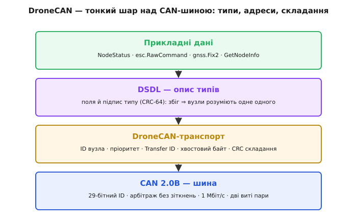
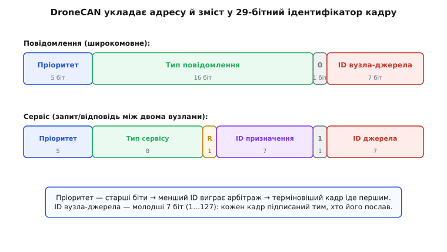
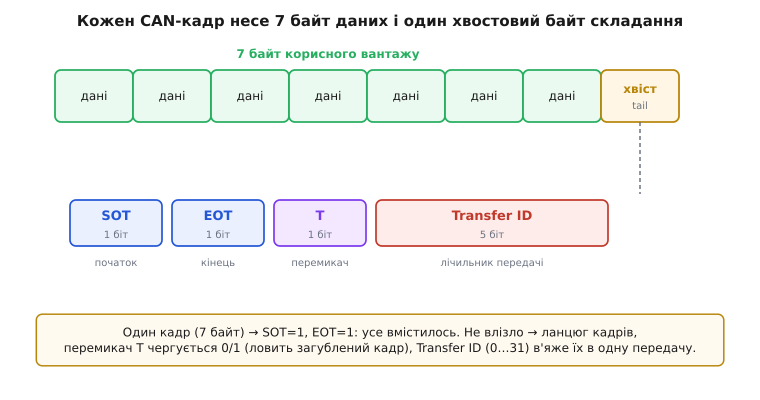

# DroneCAN

Уявіть автопілот дрона, до якого треба під'єднати десяток пристроїв: приймач супутника, магнітометр, давач повітряної швидкості, кілька регуляторів обертів для моторів, керовані серва, датчик струму батареї. Кожен хоче обмінюватися даними, кожен може стояти на іншому кінці рами, а над усім гудуть силові дроти моторів, що смикають десятки ампер. Тягти від польотного контролера окремий провід до кожного давача — це джунглі кабелів, і кожен зайвий роз'єм на вібрувальній рамі колись відпаде. Хочеться однієї шини: два дроти по всій рамі, до яких кожен пристрій просто чіпляється, і всі говорять по черзі.

Саме цю задачу вирішує **CAN** — надійна двопровідна шина з автомобілів. Але сам CAN переносить лише короткі кадри по 8 байт із числовим ідентифікатором — він не знає, що таке «регулятор обертів», «координата GPS» чи «команда газу». DroneCAN — це **домовленість поверх CAN**: як зі скупих 8-байтових кадрів скласти осмислені повідомлення, як пристроям знайти одне одного на шині й говорити спільною мовою. Розберімо, як із простого CAN виростає жива мережа дрона, і чому кожне рішення DroneCAN випливає з обмежень самої шини.

### Що бере DroneCAN від CAN і чого йому бракує

CAN дає три речі, безцінні для дрона. Перша — **завадостійка диференційна пара**: сигнал їде як різниця напруг на двох скручених дротах, тож наведення від моторів чіпляє обидва однаково й у різниці зникає. Друга — **арбітраж без зіткнень**: коли кілька вузлів починають передавати водночас, шина сама, біт за бітом, пропускає той кадр, чий ідентифікатор менший, а решта відступають і чекають — без зіпсованих даних і без керівника, що роздає слово.

> 🔗 Арбітраж CAN — це серце, на якому тримається вся пріоритетність DroneCAN. Коротко: біти ідентифікатора передаються від старшого; «0» на шині домінує над «1»; вузол, що вислав «1», а побачив на шині «0», розуміє, що програв, і замовкає. Тому **менший ідентифікатор завжди виграє**, а переможець навіть не помічає боротьби — його кадр іде без затримки.
> [Арбітраж CAN](book:communications/can-arbitration)

Третя річ — **кадр CAN 2.0B** із розширеним 29-бітним ідентифікатором і полем даних до 8 байт. DroneCAN користується виключно цим форматом: 29 біт ідентифікатора — це той простір, у який він упакує і адресу, і зміст.

А бракує CAN усього іншого. Він **не має адрес пристроїв** — лише номер кадру, який за домовленістю може означати будь-що. Він **не має типів даних** — 8 байт це просто 8 байт, і два вузли мусять наперед погодитися, що в них лежить. Він **не вміє передавати більше за 8 байт** — а координата GPS із точністю, швидкістю й станом супутників у 8 байт не влазить. І він **не каже, хто на шині є** — увімкнув живлення, а мережа порожня, поки хтось не заговорить. DroneCAN добудовує рівно ці чотири поверхи: адреси вузлів, типи даних, складання довгих повідомлень і механізм знайомства. Погляньмо на кожен.


*DroneCAN — тонкий прошарок між прикладними даними дрона й дротами CAN. Знизу вгору: шина CAN дає кадр і безконфліктний арбітраж; транспорт DroneCAN додає адреси й складання; DSDL описує типи так, щоб вузли розуміли одне одного; згори — готові повідомлення на кшталт стану вузла чи команди моторам.*

### Адреса: 7 біт на вузол, і чому саме стільки

Почнімо з адрес. Кожному пристрою на шині DroneCAN дають **ідентифікатор вузла** (*node ID*) — просто число. Під нього відведено **7 біт**, тобто діапазон значень від **1 до 127**. Число 0 зарезервоване — воно означає «невідомий вузол» або «усі одразу», тож справжніх адрес лишається 127. Для дрона це з величезним запасом: навіть велика машина рідко несе більше двох-трьох десятків пристроїв на шині.

Чому саме 7 біт, а не, скажімо, повний байт? Бо ці біти доводиться викроювати з тих самих 29 біт ідентифікатора кадру, і кожен віддати шкода — там же мусять поміститися і пріоритет, і тип повідомлення. Сім біт — це компроміс: достатньо вузлів для будь-якого борту, і водночас лишається місце на все інше.

Ідентифікатор вузла їде **в молодших бітах** кожного кадру. Наслідок тонкий, але важливий: за інших рівних умов кадр від вузла з **меншим** номером має **менший** ідентифікатор — і виграє арбітраж. Тобто номер вузла — це ще й неявний тонкий пріоритет. На практиці ним не зловживають (пріоритет задають окремим полем, див. далі), але знати про це варто: два однакові повідомлення від різних вузлів роз'їде саме за їхніми номерами.

### Як 29 біт ідентифікатора вміщують і адресу, і зміст

Ось де DroneCAN виявляє винахідливість. У нього два способи розмови, і під кожен — своя розкладка тих самих 29 біт.

Перший спосіб — **широкомовлення** (*message broadcast*), він же публікація. Вузол просто кидає повідомлення в шину, не адресуючи нікому конкретно: «моя висота така-то», «газ моторам такий-то». Хто хоче — слухає, хто ні — пропускає. Це головний режим DroneCAN: більшість даних на борту — саме такий безперервний потік. Розкладка ідентифікатора під нього:

```
[ Пріоритет 5 біт ][ Тип повідомлення 16 біт ][ 0 ][ ID джерела 7 біт ]
     старші                                    ↑           молодші
                              «це повідомлення, не сервіс»
```

Пріоритет (5 біт, значення 0…31, де **0 — найвищий**) сидить у старших бітах — тому терміновий кадр має менший ідентифікатор і завжди проривається вперед в арбітражі. Далі 16 біт **типу повідомлення** кажуть, що це взагалі таке (стан вузла? команда мотору? координата?). Один біт-прапорець «0» відрізняє повідомлення від сервісу. І нарешті 7 біт — хто це шле.

Другий спосіб — **сервіс** (*service*): адресний діалог рівно двох вузлів, запит і відповідь. «Вузле 42, віддай свою назву й версію» — і вузол 42 відповідає саме тому, хто спитав. Тут потрібні **дві** адреси, тож розкладка інша:

```
[ Пріоритет 5 ][ Тип сервісу 8 ][ R ][ ID призначення 7 ][ 1 ][ ID джерела 7 ]
                                  ↑                         ↑
                        «запит(1)/відповідь(0)»   «це сервіс, не повідомлення»
```

Тип сервісу тут вужчий — 8 біт замість 16, бо треба було звільнити місце під другу адресу (призначення). Прапорець R розрізняє запит і відповідь, а прапорець «1» на позиції «сервіс-не-повідомлення» одразу каже приймачам, що це адресний обмін.


*Ті самі 29 біт CAN-ідентифікатора DroneCAN укладає по-різному. Для повідомлення: пріоритет, тип (16 біт) і адреса джерела. Для сервісу тип звужується до 8 біт, щоб умістити другу адресу — призначення. Пріоритет завжди у старших бітах, тож менший ідентифікатор виграє арбітраж і терміновіший кадр іде першим.*

> 🔧 **Навіщо це.** Коли ваш давач на DroneCAN «не бачать», перше, куди дивляться, — збіг типу повідомлення й номера вузла. Тип каже автопілоту, як тлумачити байти; номер — від кого вони. Помилитеся з номером (два пристрої з однаковим) — і кадри почнуть накладатися, а мережа «зачудить». Тому в налаштуванні борту номери вузлів роздають вручну або довіряють автоматиці — але вони мусять бути унікальні.

### Як передати більше за 8 байт: хвостовий байт і складання

Одне повідомлення DroneCAN часто довше за 8 байт, а кадр CAN стільки не несе. Рішення — **розбити передачу на ланцюг кадрів** і навчити приймач склеїти їх назад у правильному порядку, не переплутавши з чужими. Уся механіка складання ховається в одному службовому байті наприкінці поля даних — **хвостовому байті** (*tail byte*).

Хвостовий байт з'їдає один із восьми байтів кадру, тож на корисний вантаж лишається **7 байт на кадр**. Він розкладений так:

```
біт 7: Start of transfer (SOT) — це перший кадр передачі?
біт 6: End of transfer  (EOT) — це останній кадр?
біт 5: Toggle (T)             — перемикач 0/1, чергується між кадрами
біти 4…0: Transfer ID         — 5-бітний лічильник передачі (0…31)
```


*Із восьми байтів поля даних сім несуть вантаж, а восьмий — хвостовий байт. Його біти керують складанням: SOT/EOT позначають перший і останній кадр, перемикач T чергується, щоб зловити загублений кадр, а 5-бітний Transfer ID в'яже всі кадри однієї передачі докупи й відрізняє їх від наступної.*

Тепер видно, як усе працює. Якщо повідомлення вміщається в 7 байт — це **один кадр**, у якому SOT=1 і EOT=1 разом: почалося й скінчилося тут-таки. Якщо ні — перший кадр має SOT=1, EOT=0, останній SOT=0, EOT=1, а проміжні — обидва нулі.

Навіщо ще й перемикач T, якщо є SOT і EOT? Він ловить **втрачений кадр**. Уся мережа CAN не гарантує, що кожен кадр дійде; якщо в довгому ланцюгу один кадр загубиться, приймач за самими SOT/EOT цього не помітить — просто склеїть менше даних. А перемикач мусить чергуватися 0,1,0,1… у сусідніх кадрах; випав кадр — послідовність збилася, і приймач бачить, що передача побита, замість тихо зібрати сміття.

**Transfer ID** (5 біт, 0…31) — це лічильник, що зростає з кожною новою передачею цього типу від цього вузла. Він в'яже кадри однієї передачі: усі кадри мають той самий Transfer ID, а наступна передача бере вже інший. Так приймач не переплутає хвіст однієї посилки з початком наступної, навіть якщо вони йдуть упритул. Число мале й **переповнюється** по колу (після 31 — знову 0) — цього досить, бо кадри в CAN не обганяють одне одного, і сплутати можна хіба сусідні передачі.

Лишилося одне питання: коли повідомлення приїхало кількома кадрами, як переконатися, що склеїли його **правильно** — нічого не переплутавши й не побивши? Для цього перший кадр багатокадрової передачі несе **16-бітну контрольну суму** (*Transfer CRC*) усього повідомлення. Приймач, зібравши всі кадри, рахує суму заново й порівнює: збіглося — дані цілі, ні — передачу відкидають.

> 🔗 Контрольна сума тут — це CRC-16-CCITT: 16-бітний «відбиток» усіх байтів повідомлення, який ловить і поодинокі зіпсовані біти, і цілий втрачений кадр. Коротко: байти проганяють через поліноміальний ділильник, лишок ділення й є контрольна сума; змінився бодай біт — лишок майже напевно інший.
> [CRC](book:communications/crc)

Тонкість, на якій тримається сумісність версій: у цю суму DroneCAN підмішує **підпис типу даних** — його ми зараз і розберемо.

### DSDL: спільна мова, якою вузли одне одного розуміють

Досі ми говорили, як біти їдуть по шині. Та лишилося головне питання: звідки регулятор обертів **знає**, що в цих семи байтах — саме команда газу, а перші 14 біт — це число −8192…8191? Хтось мусив наперед описати структуру кожного повідомлення, однаково для всіх виробників. Цей опис і є **DSDL** (*Data Structure Description Language* — мова опису структур даних).

DSDL — це маленька текстова мова, якою поле за полем задають, з чого складається повідомлення. Ось як виглядає опис команди регуляторам обертів (тип `esc.RawCommand`):

```
# esc.RawCommand — сирі команди газу регуляторам обертів
int14[<=20] cmd
```

Читається просто: повідомлення містить масив `cmd` із чисел по 14 біт кожне, і таких чисел **до 20** (за числом моторів). Кожне число — газ одного мотора в діапазоні **−8192…8191**: додатне крутить уперед, від'ємне (де регулятор уміє) — назад, нуль — стоп. Автопілот заповнює масив, кидає в шину — а кожен регулятор бере зі свого місця в масиві своє число. Типи полів у DSDL — звичні: цілі `int8`…`int64`, беззнакові `uint8`…`uint64`, дробові `float16`/`float32`/`float64`, булеві біти й вирівнювання. З таких цеглинок складають усе — від стану вузла до координати GPS.

Але описати структуру мало — треба ще, щоб обидва боки мали **однаковий** опис. Що як давач зібрано під стару версію повідомлення, а автопілот чекає нову, з переставленими полями? Байти нібито ті самі, а сенс поплив — і це найпідступніший клас помилок, бо нічого явно не ламається, просто числа стають маячнею.

DroneCAN закриває цю щілину **підписом типу** (*data type signature*). З нормалізованого DSDL-опису рахують 64-бітний відбиток (хеш CRC-64), і він однозначно кодує структуру: ті самі поля в тому самому порядку дадуть той самий підпис, а найменша зміна — інший. Цей підпис і **підмішують у контрольну суму** багатокадрової передачі. Тому якщо два вузли зібрані під різні версії типу, їхні CRC не збіжаться — і несумісні дані відсіються самі, замість тихо отруїти систему.

> 🔧 **Навіщо це.** Практично це означає: беручи готовий давач на DroneCAN, ви не пишете розбір байтів вручну. Берете DSDL-описи (вони спільні, у відкритому репозиторії) і **генеруєте** з них код серіалізації під свою мову. Автопілоти на кшталт ArduPilot і PX4 уже містять згенеровані структури для всіх стандартних повідомлень — тому давач «просто працює», щойно ви задали йому тип і номер вузла. А коли підпис не збігся — це майже завжди різні версії DSDL на двох кінцях.

### Знайомство: як вузли бачать одне одного

Лишився четвертий поверх — жива мережа мусить знати, хто в ній є. Тут два механізми.

Перший — **стан вузла** (`NodeStatus`), єдине повідомлення, яке **зобов'язаний** слати кожен вузол DroneCAN. Воно крихітне й лягає рівно в один кадр. Погляньмо на його DSDL:

```
# NodeStatus — стан і присутність вузла (шлеться періодично)
uint32 uptime_sec                  # скільки секунд вузол живий
uint2  health                      # 0 OK · 1 WARNING · 2 ERROR · 3 CRITICAL
uint3  mode                        # 0 робочий · 1 старт · 2 обслуга · 3 оновлення
uint3  sub_mode
uint16 vendor_specific_status_code
```

Порахуймо розмір: 32 + 2 + 3 + 3 + 16 = **56 біт = рівно 7 байт**. І ось чому це елегантно: 7 байт — це саме стільки, скільки вміщає один кадр DroneCAN (7 корисних + 1 хвостовий = 8). Тобто стан вузла завжди летить **одним кадром**, без складання й без CRC-повідомлення, — найдешевша можлива посилка. Кожен вузол шле її **не рідше ніж раз на секунду** (стандарт задає граничний період 1000 мс); якщо від вузла більш ніж **3 секунди** тиша — його вважають зниклим. Так автопілот безперервно знає, хто на шині живий і чи все з ним гаразд: поле `health` одразу кричить, коли давач у біді.

**Приклад (як вузол шле свій стан).** Мінімальна логіка на C: раз на секунду заповнити структуру й відправити. Час беремо від старту, здоров'я — від внутрішньої перевірки:

```c
#include <dronecan_msgs.h>   // згенеровані з DSDL структури

void publish_node_status(uint32_t uptime_s, uint8_t healthy) {
    struct uavcan_protocol_NodeStatus st = {0};
    st.uptime_sec = uptime_s;
    st.health = healthy ? UAVCAN_PROTOCOL_NODESTATUS_HEALTH_OK
                        : UAVCAN_PROTOCOL_NODESTATUS_HEALTH_ERROR;
    st.mode   = UAVCAN_PROTOCOL_NODESTATUS_MODE_OPERATIONAL;

    uint8_t buf[UAVCAN_PROTOCOL_NODESTATUS_MAX_SIZE];
    uint32_t len = uavcan_protocol_NodeStatus_encode(&st, buf);  // 7 байт
    canard_broadcast(UAVCAN_PROTOCOL_NODESTATUS_SIGNATURE,       // підпис типу
                     UAVCAN_PROTOCOL_NODESTATUS_ID,              // тип 341
                     &transfer_id, priority, buf, len);          // transfer_id росте сам
}
```

Уся суть — у трьох параметрах `canard_broadcast`: **підпис типу** (щоб приймач звірив сумісність), **номер типу** (341 — саме NodeStatus) і буфер даних. Лічильник `transfer_id` бібліотека нарощує сама з кожним викликом — той самий 5-бітний лічильник із хвостового байта.

Другий механізм — **автоматична роздача адрес** (*dynamic node ID allocation*, DNA). Уявіть: ви причепили на шину новий регулятор, а номера вузла йому не задавали. Звідки він його візьме? У кожного пристрою є вшитий на заводі **128-бітний унікальний ідентифікатор** — по суті, неповторний серійний номер заліза. Новачок без адреси шле цей ідентифікатор особливими **анонімними** кадрами (з номером джерела 0), а **розподільник** на шині — зазвичай сам автопілот — видає йому вільний номер вузла й запам'ятовує пару «серійник → номер». Наступного разу той самий пристрій дістане той самий номер. Тонкість: анонімний кадр не вміє складатися з багатьох, а 128-бітний серійник у 7 байт не влазить, тож його шлють **трьома** короткими анонімними кадрами поспіль — по шматку за раз.

І щоб розпитати вузол докладніше — його точну назву, версію прошивки, той самий 128-бітний серійник — є **сервіс** `GetNodeInfo`: адресний запит рівно до цього вузла, на який він відповідає повним «паспортом». Саме так наземна станція показує список: «вузол 25 — GPS такий-то, прошивка така-то».

### Звідки взявся DroneCAN

Ім'я «DroneCAN» молоде, а протокол — ні. Він виріс із **UAVCAN** (розшифровується як *Uncomplicated Application-level Vehicular Computing and Networking* — «нехитрий прикладний зв'язок і обчислення для апаратів»), відкритого протоколу для безпілотників. Коли спільнота вирішила переробити UAVCAN на складнішу версію без плавного переходу для вже наявних дронів, шляхи розійшлися: простий, перевірений польотами варіант виокремили під назвою DroneCAN, щоб він далі жив і розвивався для ArduPilot і PX4.

> 🔗 Історія розколу UAVCAN 2022 року — окрема тема: чому «нехитрий» протокол роздвоївся на DroneCAN (стара проста лінія) і Cyphal (нова), хто за цим стояв і що це означало для тисяч уже літаючих дронів.
> [Від UAVCAN до DroneCAN і Cyphal](book:communications/dronecan/hist-uavcan-split.md)

> 🔧 **Навіщо це.** Практичний висновок із назв: коли ви бачите в документації давача «UAVCAN v0» — це те саме, що DroneCAN, вони сумісні. А «UAVCAN v1» чи «Cyphal» — уже інший, несумісний протокол. Тому, добираючи периферію під ArduPilot чи PX4, шукайте саме **DroneCAN** (або UAVCAN v0); Cyphal-пристрій до DroneCAN-борту без перекладача не під'єднаєте.

### Ціла картина

Складімо все докупи. DroneCAN бере від CAN тверду основу — завадостійку пару й безконфліктний арбітраж, де менший ідентифікатор виграє, — і добудовує над нею рівно те, чого шині бракує для дрона. **Адреси вузлів** (7 біт, 1…127) кажуть, хто є хто. **Розкладка 29-бітного ідентифікатора** вкладає в кожен кадр пріоритет, тип повідомлення й адресу — і робить це двома способами: широкомовним потоком для даних і адресним сервісом для діалогу. **Хвостовий байт** зі складанням і **CRC** дають змогу нести повідомлення, довші за 8 байт, не переплутавши й не побивши їх. **DSDL із підписом типу** робить так, що всі виробники говорять однією мовою, а несумісні версії відсіюються самі. А **стан вузла** й **автоматична роздача адрес** оживляють мережу — вузли самі знаходять одне одного й доповідають про здоров'я.

Разом це й дає ту зручність, задля якої все затівалося: два дроти вздовж рами, до яких пристрої просто чіпляються, задаєш кожному тип і номер вузла — і борт бачить їх усіх, безперервно чує їхнє «я живий», і надійно шле команди моторам крізь електромагнітний гуркіт польоту.
