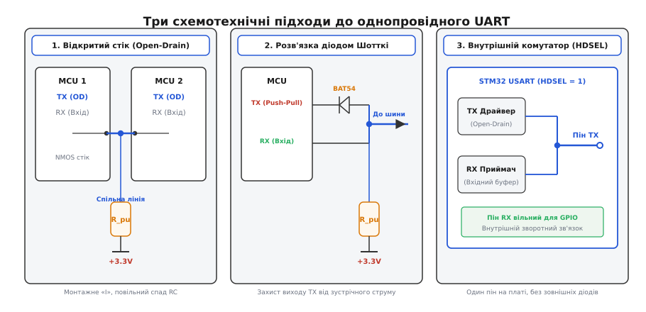
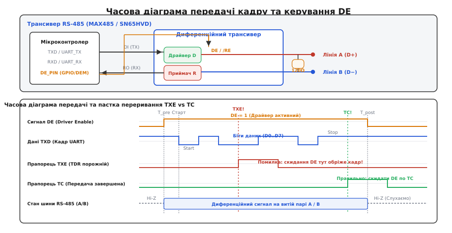
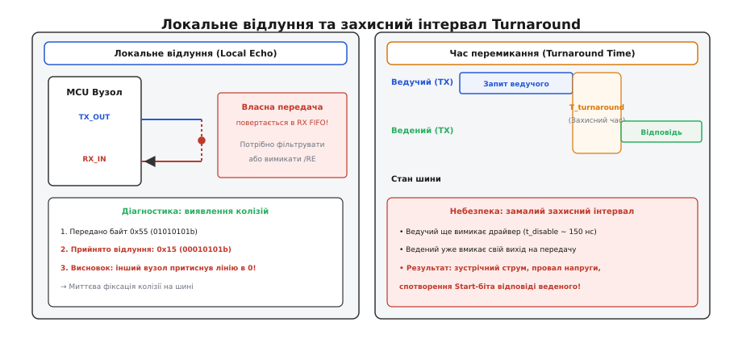
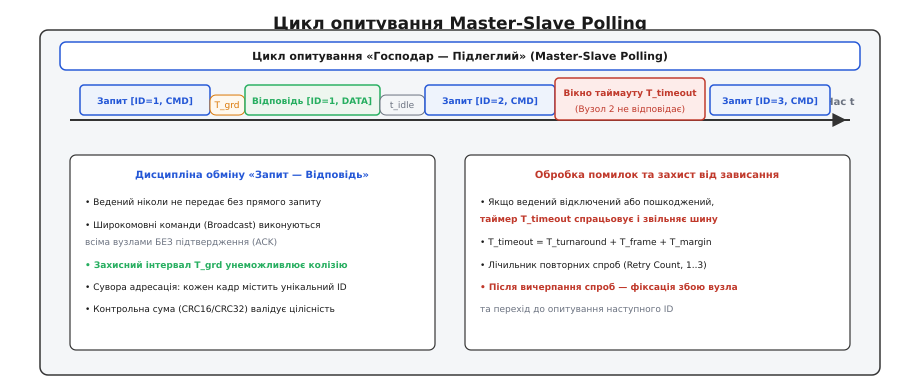

# Напівдуплекс UART

<preknowlist>
- [Кадр UART](topic:communications/uart-frame) — старт-біт, біти даних, контроль парності та стоп-біт: базова структура асинхронного повідомлення.
- [Асинхронний послідовний зв'язок](topic:communications/async-serial) — передача без спільного тактового сигналу та вимоги до узгодження швидкості генераторів.
- [Open-drain](topic:electronics/open-drain) — вихідний каскад із відкритим стоком та формування логічних рівнів резистивною підтяжкою.
- [RS-485](topic:communications/rs-485) — диференційне передавання по витій парі, багатоточкова топологія та термінація лінії.
</preknowlist>

Звичайний повнодуплексний UART вимагає двох роздільних провідників: передавач першого вузла з'єднується з приймачем другого через лінію TX, а передавач другого вузла повертає відповідь через лінію RX. Ця схема бездоганно працює для зв'язку двох мікроконтролерів на одній друкованій платі. Та щойно виникає потреба об'єднати в єдину мережу десятки сервоприводів у робототехнічній кінцівці, підключити польотний контролер до радіоприймача через один пін, або прокласти кілометровий промисловий кабель між десятками давачів і шафою автоматики, двопровідна повнодуплексна топологія стає надто громіздкою й дорогою. Спроба просто замкнути виводи TX і RX усіх пристроїв на один провід призводить до електричної катастрофи: двотактні вихідні каскади (*push-pull*) мають малий вихідний опір (десятки ом), і коли один вузол намагається видати логічну одиницю (3.3 В), а інший — логічний нуль (0 В), виникає наскрізний струм короткого замикання (від 50 до 150 мА), що просаджує напругу в зону невизначеності й викликає теплову деградацію вихідних транзисторів.

**Напівдуплекс** (від лат. *duplex* — подвійний, *semi-* — напів-) розв'язує цю суперечність шляхом часового розділення середовища передачі: у кожну фізичну мить лінією володіє рівно один передавач, тоді як усі інші вузли перебувають у режимі прийому. Перехід на єдиний провідник (*Single-Wire*) або одну диференційну пару (RS-485) вимагає узгодженого розв'язання трьох фундаментальних інженерних задач: електричного захисту вихідних каскадів від зустрічного струму, прецизійного таймінгу перемикання напрямку передавача (*Driver Enable*) та протокольної дисципліни арбітражу, яка унеможливлює виникнення колізій.

> 🔧 **Навіщо це.** Напівдуплексні послідовні інтерфейси є стандартом де-факто в робототехніці та авіоніці (сервоприводи Dynamixel, шини польотних контролерів FrSky S.Port, TBS CRSF, протоколи Futaba SBUS, конфігураційні інтерфейси 1-Wire UART), а також у промисловій автоматизації (протоколи Modbus RTU, BACnet, Profibus поверх RS-485). Вони скорочують кількість кабельних жил, зменшують вагу джгутів у рухомих вузлах і дають змогу нарощувати кількість підключених модулів на одній шині без додавання нових фізичних портів до центрального процесора.

---

### Схемотехніка однопровідного UART (Single-Wire)

Коли обмін відбувається всередині одного приладу або між сусідніми платами, найпростішим рішенням є однопровідний напівдуплексний UART (*Single-Wire UART*). Щоб передавач міг віддавати лінію іншим вузлам і не створював короткого замикання при одночасній активності, застосовують три схемотехнічні підходи.

#### 1. Каскад із відкритим стоком (Open-Drain) та резистивна підтяжка

У вихідному каскаді типу [відкритий стік](topic:electronics/open-drain) (*Open-Drain*) верхній P-канальний польовий транзистор вимкнено або взагалі фізично відсутній. Вихідний пін керується виключно нижнім N-канальним MOSFET-транзистором. Коли мікроконтролер передає логічний нуль («0», домінантний стан), транзистор відкривається і примусово притягує лінію до землі `GND`. Коли мікроконтролер передає логічну одиницю («1», рецесивний стан), транзистор повністю закривається, переводячи ніжку в стан високого імпедансу (Hi-Z). Рівень напруги `V_CC` на відпущеній лінії формує спільний зовнішній резистор [підтяжки](topic:electronics/floating-pullups) (*Pull-Up*).

Таке з'єднання реалізує логіку монтажного «І» (*Wired-AND*): якщо хоча б один вузол відкриває свій транзистор, на всій лінії встановлюється нуль. Коротке замикання стає фізично неможливим, оскільки жоден вузол не здатний подати напругу живлення силою.

Проте за цю елегантність доводиться платити асиметрією фронтів. Спадний фронт формується активним транзистором із низьким опором відкритого каналу (від 10 до 30 Ом), що розряджає паразитну ємність лінії `C_bus` за кілька наносекунд. Наростаючий фронт формується виключно струмом, який протікає крізь резистор підтяжки `R_pu`, заряджаючи ємність `C_bus` за експоненційним законом [сталої часу RC](topic:electronics/rc-time-constant) (`τ = R_pu · C_bus`). Тривалість наростання сигналу від 10% до 90% від `V_CC` становить:

```
t_r ≈ 2.2 · R_pu · C_bus
```

Якщо опір підтяжки `R_pu = 10 кОм`, а ємність лінії разом із входами мікросхем `C_bus = 150 пФ`, час наростання складе `t_r ≈ 3.3 мкс`. На швидкості 115200 бод тривалість одного біта становить лише `T_bit = 8.68 мкс`. Затягнутий фронт з'їдає майже 40% тривалості біта, зміщуючи точку перемикання логічного рівня і спричиняючи помилки стробування старт-біта в приймачі. Для роботи на високих швидкостях доводиться зменшувати `R_pu` до 1...2.2 кОм, що збільшує струм споживання лінії в стані «0».

#### 2. Об'єднання TX і RX через діод Шотткі

Якщо мікроконтролер не підтримує апаратного перемикання піна TX у режим відкритого стоку (наприклад, у застарілих 8-бітних архітектурах або при використанні апаратного моста USB-UART), виводи TX і RX об'єднують зовні за допомогою діода Шотткі (наприклад, BAT54 або 1N5819).

Діод підключають катодом до виводу TX, а анодом — до виводу RX і спільної лінії шини, яку підтягують резистором `R_pu` до `V_CC`:
- Коли TX генерує низький рівень (0 В), діод зміщується в прямому напрямку і відкривається. Струм із шини витікає у вивід TX, і напруга на лінії падає до значення `V_OL = V_OL(MCU) + V_F`, де `V_F` — пряме падіння напруги на діоді (від 0.25 до 0.35 В для діода Шотткі). Цей рівень надійно сприймається приймачами як логічний нуль (`V_IL_max ≤ 0.3 · V_CC ≈ 0.99 В` для тривольтової логіки).
- Коли TX генерує високий рівень (3.3 В), діод закривається зворотним зміщенням. Вихід TX електрично відсікається від лінії, а високий рівень формується резистором підтяжки.

Звичайні кремнієві діоди (як-от 1N4148 із прямим спадом `V_F ≈ 0.7 В`) для таких схем непридатні: сумарна залишкова напруга `V_OL ≈ 0.15 В + 0.7 В = 0.85 В` небезпечно наближається до порогу перемикання логіки і знижує запас завадостійкості практично до нуля.

#### 3. Внутрішній комутатор мікроконтролера (STM32 USART HDSEL)

Сучасні 32-розрядні мікроконтролери містять внутрішній аналоговий комутатор шини. Встановлення біта `HDSEL` у керувальному регістрі `USART_CR3` виконує реконфігурацію периферійного модуля на кристалі:
- Внутрішній вихід передавача TX з'єднується з внутрішнім входом приймача RX.
- Зовнішній фізичний вивід RX відключається від модуля UART і звільняється для використання в ролі звичайного GPIO.
- Фізичний вивід TX автоматично переводиться в режим альтернативної функції з відкритим стоком.

Це усуває потребу в будь-яких зовнішніх діодах і резисторних мостах — єдиний провід підключається прямо до піна TX, на який підключають тільки один спільний резистор підтяжки шини.


*Зліва — об'єднання відкритих стоків (Open-Drain); по центру — діодна розв'язка двотактного виходу TX через діод Шотткі BAT54; справа — внутрішня комутація шини в мікроконтролерах STM32 (режим HDSEL).*

---

### Механіка стробування та оверсемплінг приймача UART

Щоб зрозуміти, як затягнуті фронти Open-Drain або затримки комутації руйнують зв'язок, необхідно звернутися до внутрішньої логіки приймача UART. Асинхронний приймач не має зовнішнього тактового сигналу і відновлює часову сітку безпосередньо з вхідного сигналу:

1. **Детектування старт-біта:** у стані спокою лінія перебуває у високому рівні (Mark). Приймач постійно опитує лінію з частотою в 16 разів вищою за бодрейт (16-кратний оверсемплінг). Фіксація перепаду з 1 в 0 запускає внутрішній лічильник тактів.
2. **Перевірка валідності старт-біта (Majority Voting):** на 7-му, 8-му та 9-му підтактах приймач робить три швидкі заміри. Якщо щонайменше 2 з 3 замірів показують низький рівень («0»), старт-біт вважається справжнім. Якщо ж перепад був спричинений короткочасною завадою і на 8-му такті лінія повернулася в «1», лічильник скидається без генерації помилки.
3. **Стробування бітів даних:** центр кожного наступного біта даних відраховується рівно через 16 підтактів після центру старт-біта. На кожному біті знову беруться вибірки на 7, 8 і 9 підтактах, і за правилом більшості визначається прийнятий логічний стан.

```
Вхідний сигнал: ──┐               ┌───────────────
                  │  Старт-біт    │  Біт даних D0
                  └───────────────┘
Оверсемплінг  :  ||||||||||||||||||||||||||||||||
Підтакти      :  0 1 2 3 4 5 6 7 8 9 10..15 0 1 2 3 4 5 6 7 8 9 10..
                                ▲ ▲ ▲                       ▲ ▲ ▲
                                Вибірка                     Вибірка
                              старт-біта                    даних D0
```

Коли лінія Open-Drain має велику паразитну ємність, наростаючий перехід з 0 в 1 затягується. Якщо напруга не встигає піднятися вище порогу логічної одиниці до 7-го підтакту, вибірки 7 і 8 помилково зчитують нуль. Це зсуває фазу прийому і призводить до того, що на 8-му і 9-му бітах кадру точка вибірки сповзає на межу сусіднього біта, викликаючи спотворення даних або помилку стоп-біта (*Framing Error*).

---

### Диференційний напівдуплекс: трансивери RS-485 та лінія Driver Enable

Коли довжина лінії перевищує кілька метрів або кабель проходить повз потужні промислові перетворювачі частоти, однопровідні лінії втрачають завадостійкість через паразитні наведення та зсув потенціалів землі. У цих умовах стандартом стає напівдуплексний [диференційний інтерфейс RS-485](topic:communications/rs-485).

Трансивер RS-485 (наприклад, MAX485 або SN65HVD72) транслює однополярний логічний сигнал UART у симетричну напругу між витою парою провідників `A` і `B`. Оскільки для прийому й передачі використовується одна й та сама вита пара, передавальний каскад трансивера має вміти повністю відключатися від лінії. Для цього слугують два керувальні виводи:
- **`DE` (Driver Enable, активна одиниця):** при подачі високого рівня активує диференційний H-міст передавача. При `DE = 0` вихідні транзистори переходять у стан високого імпедансу (Hi-Z), дозволяючи іншим пристроям передавати дані в пару.
- **`/RE` (Receiver Enable, активний нуль):** при подачі низького рівня вмикає вихідний буфер вбудованого компаратора, видаючи прийняті з лінії байти на ніжку `RX` мікроконтролера.

У більшості схем виводи `DE` і `/RE` об'єднують разом і підключають до однієї керуючої ніжки процесора:
```
DE = /RE = 1  →  Вузол працює на ПЕРЕДАЧУ (передавач активний, приймач у Hi-Z)
DE = /RE = 0  →  Вузол працює на ПРИЙОМ    (передавач у Hi-Z, приймач активний)
```

Детальний схемотехнічний аналіз внутрішньої структури трансиверів, вхідних кіл захисту від перенапруг та методів зміщення порогів наведено у вставці [схемотехнічний аналіз трансиверів RS-485, схем автоперемикання напрямку та захисних кіл](topic:communications/half-duplex-uart/comp-rs485-transceiver.md).


*Структурна схема підключення трансивера RS-485 та порівняння поведінки статусних прапорців TXE і TC: опускання DE за прапорцем TXE обрізає завершальний байт.*

---

### Пастка переривань у прошивці: чому скидання DE по TXE обрізає кадр

Головна помилка програмістів при написанні драйверів напівдуплексного UART полягає в неправильному виборі статусного прапорця для вимкнення передавача (опускання лінії `DE`).

Апаратний передавач UART містить дворівневий конвеєр:
1. Регістр даних передавача (`TDR` — Transmit Data Register).
2. Зсувний регістр передавача (`TSR` — Transmit Shift Register).

Коли програма записує байт у `TDR`, апаратний блок миттєво копіює його паралельним кодом у зсувний регістр `TSR`, щойно той звільняється. У ту саму мить виставляється статусний прапорець **`TXE` (Transmit Data Register Empty)**. Він означає лише одне: буфер `TDR` вільний, і туди можна класти *наступний* байт. Сам же байт у цей час тільки-но починає побітно виходити в лінію крізь `TSR` зі швидкістю бод-генератора.

Якщо прошивка відправляє останній байт пакета й опускає лінію `DE` одразу після того, як спрацювало переривання за прапорцем `TXE`, передавач RS-485 вимикається в перші мікросекунди передачі. Усі 8 бітів даних і стоп-біт фізично відсікаються, і приймач на іншому кінці фіксує помилку кадру (*Framing Error*).

Правильний алгоритм керування вимагає очікування прапорця **`TC` (Transmission Complete)**. Прапорець `TC` виставляється апаратно лише тоді, коли виконано дві умови одночасно:
1. Буфер `TDR` повністю порожній.
2. Зсувний регістр `TSR` завершив видачу останнього стоп-біта в фізичний пін, і лінія повернулася в пасивний стан очікування (Mark).

```
Правильний автомат передачі кадру:
[Підняти DE = 1] ──► [Запис байтів по TXE] ──► [Останній байт записано] ──► [Чекати TC = 1] ──► [Опустити DE = 0]
```

Багато сучасних мікроконтролерів підтримують апаратний режим `Driver Enable` (наприклад, біт `DEM` у регістрі `USART_CR3` контролерів STM32). При його увімкненні периферійний модуль сам піднімає виділений пін `DE` за задану кількість тактів до початку старт-біта (`DEAT` — Driver Enable Assertion Time) і скидає його через задану кількість тактів після закінчення стоп-біта (`DEDT` — Driver Enable Deassertion Time), повністю звільняючи процесор від ручного керування ніжкою GPIO.

Низькорівневу конфігурацію регістрів, роботу з перериваннями та захист від блокування шини розібрано у вставці [детальний розбір низькорівневої реалізації драйвера напівдуплексного UART та керування лінією DE на мікроконтролері](topic:communications/half-duplex-uart/proj-stm32-halfduplex-de.md).

---

### Апаратні прапорці помилок та обробка збоїв

Напівдуплексні лінії через комутацію та наведення піддаються збоям частіше за повнодуплексні канали. Апаратний блок UART формує чотири критичні прапорці помилок:

1. **`FE` (Framing Error — помилка кадрування):** виникає, коли на місці стоп-біта зчитується низький рівень (нуль). На напівдуплексній шині це найчастіше свідчить про передчасне вимкнення передавача (опускання DE до кінця байта) або про зіткнення двох передавачів.
2. **`ORE` (Overrun Error — переповнення буфера):** з'являється, коли новий байт надійшов у зсувний регістр `RSR`, тоді як попередній байт ще не вичитано з регістра `RDR`. Багато контролерів при виставленні `ORE` повністю блокують подальший прийом нових байтів доти, доки прапорець не буде явно скинутий записом у регістр `ICR`.
3. **`NE` (Noise Error — шумовий збій):** виставляється, якщо три підтактові вибірки (7, 8, 9) на одному біті не збіглися між собою (наприклад, зафіксовано послідовність 1-0-1 замість однорідного 1-1-1). Це сигнал про наявність сильних високочастотних завад або незадовільну термінацію лінії.
4. **`PE` (Parity Error — помилка парності):** фіксує невідповідність кількості одиниць у байті контрольному біту парності.

---

### Локальне відлуння (Local Echo): апаратне придушення та виявлення колізій

У напівдуплексних системах вхід приймача часто залишається фізично з'єднаним із лінією, якою керує власний передавач. Це породжує явище **локального відлуння** (*Local Echo*, від грец. *ἠχώ* — відлуння): кожен байт, який передавач надсилає в лінію, негайно приймається власним приймачем і потрапляє у вхідний буфер FIFO.

```
Вузол передає: [ 0xAA, 0x01, 0x05, 0x55 ]
Власний RX бачить: [ 0xAA, 0x01, 0x05, 0x55 ]  ← Локальне відлуння, яке треба відфільтрувати!
```

#### Методи придушення відлуння
1. **Апаратне блокування приймача:** якщо вивід `/RE` трансивера RS-485 об'єднано з `DE`, то під час передачі (`DE = 1`) на вивід `/RE` подається одиниця, що переводить вихід `RO` трансивера у стан Hi-Z. Приймач фізично вимикається, і відлуння в буфер UART не потрапляє.
2. **Програмна фільтрація:** в однопровідних схемах Single-Wire, де вхід приймача неможливо вимкнути апаратно, драйвер веде лічильник переданих байтів `N`. Під час або одразу після передачі драйвер вичитує перші `N` байтів із черги прийому та безслідно скидає їх, не передаючи на верхні рівні протоколу.

#### Діагностика колізій та відновлення зв'язку
Локальне відлуння перетворюється на потужний інструмент апаратної діагностики. Якщо мікроконтролер працює на спільній лінії з відкритим стоком і передає послідовність байтів, він може побайтно порівнювати відправлені дані з тими, що повертаються через відлуння:

```
Передано байт : 0x55 (двійкове: 01010101b)
Прийнято відлуння: 0x15 (двійкове: 00010101b)
                        ▲
                     Колізія! Сьомий біт притягнуто до нуля іншим передавачем!
```

Якщо надісланий біт був одиницею (рецесивний стан Hi-Z), а приймач зчитав нуль (домінантний стан GND), це однозначно свідчить про **колізію** (від лат. *collisio* — зіткнення): інший пристрій вийшов на зв'язок одночасно.

При фіксації колізії вузол негайно виконує процедуру відновлення:
1. Миттєво припиняє передачу решти байтів і переводить свій пін у стан прийому (Hi-Z).
2. Запускає випадковий експоненційний таймер відкату (*Exponential Backoff*), тривалість якого розраховується з додаванням унікального ідентифікатора вузла `Node_ID`, щоб уникнути повторного одночасного зіткнення.
3. Після витримки паузи та перевірки наявності тиші на лінії повторює спробу відправки кадру.


*Зліва — циркуляція власної передачі у приймальний буфер (Local Echo) та діагностика колізії; справа — часовий бюджет перемикання шини (Turnaround Time) та небезпека зустрічного ввімкнення драйверів.*

---

### Час перемикання шини (Turnaround Time) та захисні інтервали

Критичним параметром напівдуплексного зв'язку є **час перемикання шини** (*Bus Turnaround Time* або *Guard Time*). Це інтервал часу між моментом, коли передавач вузла `A` вимкнувся (перейшов у Hi-Z), і моментом, коли передавач вузла `B` має право активувати свій драйвер і почати відправку відповіді.

Чому ведений пристрій не може відповідати миттєво після отримання останнього стоп-біта?
1. **Затримка вимкнення драйвера (`t_disable`):** вихідні транзистори ведучого вимикаються не миттєво (затримка розсіювання заряду затворів становить від 50 до 250 нс, а в трансиверах із захистом від сплесків — до 600 нс).
2. **Затримка обробки переривання:** ведучому потрібен час для входу в обробник `TC`, збереження регістрів і скидання піна `DE` через команду запису в регістр порту.
3. **Затримка поширення сигналу (`t_prop`):** електромагнітна хвиля поширюється кабелем зі швидкістю близько 5 нс/метр. На лінії довжиною 1000 метрів затримка в один бік становить 5 мкс, а туди й назад — 10 мкс.
4. **Релаксація ємності кабелю:** після відключення активного драйвера лінія має стабілізуватися під дією резисторів зміщення Fail-Safe.

Якщо ведений пристрій увімкне свій передавач раніше, ніж ведучий встигне повністю звільнити шину, виникає **конфлікт шини** (*Bus Contention*): два низькоомні драйвери одночасно женуть напругу назустріч один одному. Результатом стає стрибок струму, провал амплітуди сигналу та повне спотворення старт-біта відповіді.

#### Захист від контурів заземлення (Ground Loops)
У протяжних лініях RS-485 різниця потенціалів між заземлювачами окремих будівель або цехів може сягати десятків вольт. Якщо сигнальну землю з'єднати з обох кінців кабелю безпосередньо з локальними шинами заземлення, утворюється замкнений контур (*Ground Loop*), яким протікають вирівнювальні струми промислової частоти 50 Гц силою в одиниці ампер. Ці струми наводять потужну синфазну заваду, яка перевищує допустимий діапазон приймача від -7 В до +12 В. 

Правильна інженерна практика вимагає:
1. Заземлювати екранувальне обплетення кабелю **виключно в одній точці** (зазвичай на боці головного контролера/ведучого).
2. На віддалених ведених вузлах підключати екран до локальної землі через послідовний RC-ланцюжок (резистор 100 Ом паралельно з високовольтним конденсатором 10 нФ на 1 кВ) або використовувати трансивери з повною гальванічною розв'язкою.

Тому всі напівдуплексні протоколи жорстко регламентують мінімальний захисний інтервал `T_guard` (зазвичай від 1.5 до 3.5 тривалості передачі одного символу, наприклад, `t_3.5` у стандарті Modbus RTU).

Математичний апарат розрахунку часових бюджетів та затримок детально викладено у вставці [математичний розрахунок таймінгів комутації, часу заряду RC-ланки Open-Drain та часових вікон таймауту](topic:communications/half-duplex-uart/math-turnaround-timing.md).

---

### Топологія прокладання: шлейф (Daisy-Chain) проти зірки

У диференційних напівдуплексних лініях передачі критичне значення має фізична геометрія прокладання кабелю. Стандарт RS-485 вимагає строгого підключення **шлейфом** (*Daisy-Chain* або магістральна шина): кабель іде безперервно від першого пристрою до останнього, а кожен проміжний вузол підключається мінімально коротким відгалуженням (*stub*).

```
Правильно (Daisy-Chain):
[Термінатор 120Ω] ─── Вузол 1 ─────── Вузол 2 ─────── Вузол 3 ─── [Термінатор 120Ω]

Неправильно (Зірка / Довгі відростки):
                     ┌───── Вузол 1
      Центр ─────────┼───── Вузол 2 (Відбиття хвилі від розімкнених кінців руйнують зв'язок!)
                     └───── Вузол 3
```

Якщо підключити вузли за схемою «зірка» або зробити довгі відгалуження від основної магістралі, відкритий кінець кожного відростка відбиває електромагнітну хвилю назад у кабель. Відбитий сигнал накладається на корисні дані, викликаючи резонансний дзвін (*ringing*) та хибні спрацьовування компараторів.

Максимально допустима довжина нетермінованого відгалуження лімітується тривалістю фронту передавача:

```
L_stub_max ≤ t_r / (6 · t_prop)
```

Для швидкісних трансиверів із крутими фронтами (`t_r = 10 нс`) максимальна довжина відростка становить `10 нс / (6 · 5 нс/м) ≈ 0.33 метра` (33 см). У трансиверах із примусовим сповільненням фронтів (*Slew-Rate Limited*, `t_r ≈ 250 нс`) допустиме відгалуження зростає до `250 / 30 ≈ 8 метрів`.

---

### Протокольна дисципліна: арбітраж «Господар — Підлеглий»

На відміну від шин CAN або Ethernet, класичний асинхронний UART не має вбудованих у фізичний рівень механізмів побітового арбітражу чи виявлення колізій CSMA/CD. Приймач UART синхронізується за спадним фронтом старт-біта; якщо два вузли почнуть передачу одночасно з мікросекундним зсувом фаз, їхні старт-біти накладуться, стробування розсинхронізується, і обидва повідомлення перетворяться на сміття.

Єдиним надійним способом організації зв'язку на спільній напівдуплексній шині є сувора архітектура **«Господар — Підлеглий»** (*Master-Slave* або *Client-Server*, де арбітраж спирається на право запиту від лат. *arbitrari* — судити, вирішувати).

```
                  ┌────────────────────────────────────────┐
                  │ Ведучий пристрій (Master / Контролер) │
                  └───────────────────┬────────────────────┘
                                      │ Спільна напівдуплексна шина
             ┌────────────────────────┼────────────────────────┐
             ▼                        ▼                        ▼
┌─────────────────────────┐ ┌───────────────────┐ ┌───────────────────┐
│ Ведений 1 (Slave ID=1) │ │ Ведений 2 (ID=2)  │ │ Ведений 3 (ID=3)  │
└─────────────────────────┘ └───────────────────┘ └───────────────────┘
```

#### Правила дисципліни Master-Slave Polling (опитування черги, від англ. *polling*):
1. **Монополія ініціативи:** жоден ведений пристрій не має права передавати в шину жодного біта за власною ініціативою.
2. **Адресний запит:** ведучий формує пакет із зазначенням унікальної адреси цільового вузла (`Slave ID`), коду команди та контрольної суми CRC.
3. **Захисна пауза:** після отримання запиту адресований ведений вичікує захисний інтервал `T_guard` і відправляє пакет-відповідь.
4. **Широкомовні команди (Broadcast):** ведучий може відправити команду на спеціальну адресу `0x00` (наприклад, команду загальної зупинки приводів). Усі ведені вузли зобов'язані виконати команду, але **жоден із них не має права відповідати**, інакше десятки передавачів увімкнуться одночасно і заблокують шину.
5. **Таймаут відповіді (Response Timeout):** якщо адресований ведений не відповідає протягом заданого інтервалу `T_timeout` (через обрив кабелю чи зависання живлення), ведучий примусово закриває транзакцію за таймаутом і переходить до опитування наступного вузла.


*Цикл опитування вузлів шини: чергування запитів ведучого та відповідей ведених, захисні паузи T_guard та обробка вікна таймауту T_timeout при відсутності вузла на лінії.*

---

### Прикладні протоколи поверх напівдуплексного UART

Напівдуплексна модель реалізована в кількох популярних прикладних протоколах, кожен із яких адаптував структуру кадру під свої задачі:

1. **Modbus RTU (Промислова автоматика):**
   - Кадр складається з: `[Адреса (1 байт)] + [Код функції (1 байт)] + [Дані (N байтів)] + [CRC16 (2 байти)]`.
   - Межі кадру визначаються виключно часом мовчання лінії `t_3.5` (пауза в 3.5 символи без жодного байта). Втрата таймінгу розриває кадр.
2. **Dynamixel Protocol 2.0 (Робототехнічні приводи):**
   - Використовує фіксований заголовок із магічними байтами `[0xFF, 0xFF, 0xFD, 0x00]`, що полегшує відновлення синхронізації при збоях на швидкостях до 4.5 Мбіт/с.
   - Містить поле довжини пакета, ідентифікатор приводу `ID`, інструкцію та поліноміальну контрольну суму CRC-16 (IBM).
3. **FrSky SmartPort / F.Port (Безпілотні апарати):**
   - Однопровідний напівдуплексний протокол телеметрії на швидкості 57600 бод (S.Port) або 115200 бод (F.Port) із використанням байт-стафінгу для екранування керувальних байтів `0x7E`.

---

### Приклад реалізації: безпечна відправка кадру напівдуплексного зв'язку

Нижче наведено порівняння безпечної відправки пакета даних через напівдуплексний UART із керуванням піном `DE` на мовах C та ідіоматичному C++.

:::tabs
```c
#include <stdint.h>
#include <stdbool.h>
#include <stddef.h>

#define DE_PORT GPIOA
#define DE_PIN  (1 << 4)

// Пряме керування бітовими регістрами атомарного запису
static inline void rs485_set_tx_mode(void) {
    DE_PORT->BSRR = DE_PIN; // Підняти DE у високий рівень
}

static inline void rs485_set_rx_mode(void) {
    DE_PORT->BSRR = (DE_PIN << 16); // Опустити DE в низький рівень
}

// Блокувальна, але строго безпечна передача кадру
bool rs485_transmit_blocking(USART_TypeDef *usart, const uint8_t *data, size_t length) {
    if (data == NULL || length == 0) {
        return false;
    }

    // 1. Перемикаємо трансивер у режим передачі
    rs485_set_tx_mode();

    // 2. Послідовна видача байтів у буфер
    for (size_t i = 0; i < length; ++i) {
        // Очікуємо звільнення буфера даних TDR
        while (!(usart->ISR & USART_ISR_TXE_TXFNF)) {}
        usart->TDR = data[i];
    }

    // 3. Критичний крок: чекаємо завершення передачі останнього СТОП-біта (TC)
    while (!(usart->ISR & USART_ISR_TC)) {}

    // 4. Очищаємо прапорець TC
    usart->ICR = USART_ICR_TCCF;

    // 5. Повертаємо трансивер у режим прийому
    rs485_set_rx_mode();
    return true;
}
```
```cpp
#include <cstdint>
#include <cstddef>
#include <span>
#include <expected>

enum class SerialError {
    EmptyBuffer,
    HardwareFault
};

// RAII-обгортка керування лінією Driver Enable
class [[nodiscard]] DirectionGuard {
public:
    explicit DirectionGuard() noexcept {
        set_pin_high();
    }

    ~DirectionGuard() noexcept {
        set_pin_low();
    }

    DirectionGuard(const DirectionGuard&) = delete;
    DirectionGuard& operator=(const DirectionGuard&) = delete;

private:
    static void set_pin_high() noexcept {
        GPIOA->BSRR = (1 << 4);
    }
    static void set_pin_low() noexcept {
        GPIOA->BSRR = (1 << (4 + 16));
    }
};

class HalfDuplexPort {
public:
    explicit constexpr HalfDuplexPort() noexcept = default;

    [[nodiscard]] std::expected<void, SerialError> send_frame(std::span<const uint8_t> packet) noexcept {
        if (packet.empty()) {
            return std::unexpected(SerialError::EmptyBuffer);
        }

        // Активація режиму передачі через об'єкт з автоматичним контролем часу життя
        DirectionGuard direction_guard;

        for (const uint8_t byte : packet) {
            wait_for_txe();
            write_tdr(byte);
        }

        // Чекаємо завершення зсуву останнього стоп-біта
        wait_for_tc();
        clear_tc_flag();

        // Деструктор direction_guard гарантовано опустить DE при виході з функції
        return {};
    }

private:
    static void wait_for_txe() noexcept {
        while (!(USART1->ISR & USART_ISR_TXE_TXFNF)) {}
    }
    static void write_tdr(uint8_t byte) noexcept {
        USART1->TDR = byte;
    }
    static void wait_for_tc() noexcept {
        while (!(USART1->ISR & USART_ISR_TC)) {}
    }
    static void clear_tc_flag() noexcept {
        USART1->ICR = USART_ICR_TCCF;
    }
};
```
:::

---

### Порівняння схемотехнічних рішень та вибір конфігурації

При виборі фізичного рівня напівдуплексного послідовного інтерфейсу розробник спирається на вимоги до дальності зв'язку, завадової обстановки та обмежень на кількість провідників:

| Тип фізичного рівня | Середовище передачі | Максимальна швидкість | Максимальна дальність | Кількість вузлів | Переваги | Обмеження |
| :--- | :--- | :--- | :--- | :--- | :--- | :--- |
| **Open-Drain Single-Wire** | 1 провід + GND | До 115.2 кбіт/с | До 2...3 м | До 4...8 | Мінімальна вартість, простий монтаж, один пін MCU | Асиметрія фронтів RC, чутливість до наведених завад |
| **Діодне об'єднання (BAT54)** | 1 провід + GND | До 115.2 кбіт/с | До 2 м | 2 (Point-to-Point) | Працює з будь-яким стандартним повнодуплексним UART | Падіння напруги на діоді зменшує шумовий запас |
| **Внутрішній HDSEL (STM32)** | 1 провід + GND | До 1...2 Мбіт/с (при R_pu < 1 кОм) | До 1...2 м | До 4...8 | Звільняє пін RX для GPIO, немає зовнішніх діодів | Обмеження на ємність друкованої плати та кабелю |
| **Диференційний RS-485** | 1 вита пара (+ GND) | До 10...50 Мбіт/с (на малих відстанях) | До 1200 м (на 100 кбіт/с) | До 32...256 | Максимальна завадостійкість, придушення синфазних завад | Потребує зовнішнього трансивера та лінії керування DE |

Напівдуплексний UART перетворює простий послідовний протокол «точка-точка» на повноцінну багатоточкову мережеву технологію. Його надійна робота базується на трьох непорушних інженерних правилах: фізичній неможливості короткого замикання вихідних ключів, контролі закінчення передачі кадру за прапорцем повного спустошення зсувного регістра `TC` та суворій протокольній дисципліні арбітражу з витримкою обов'язкових захисних пауз.
