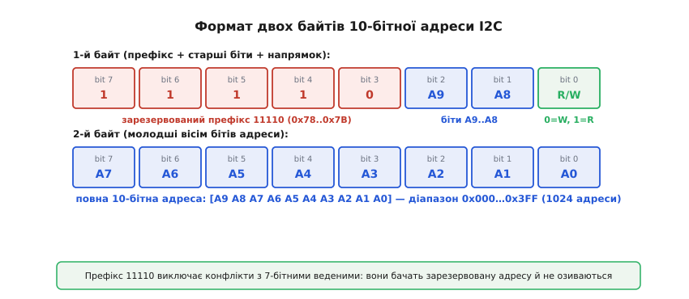
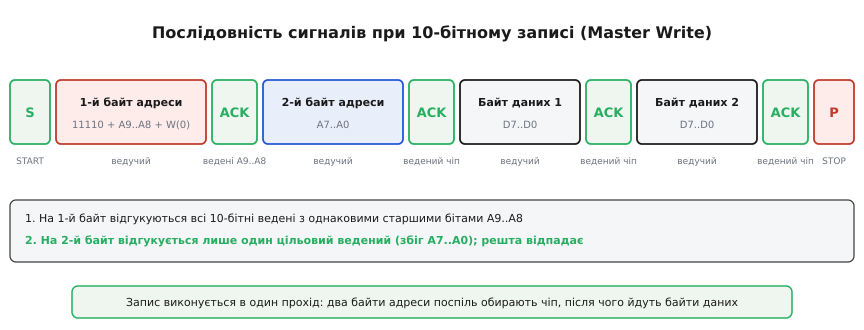
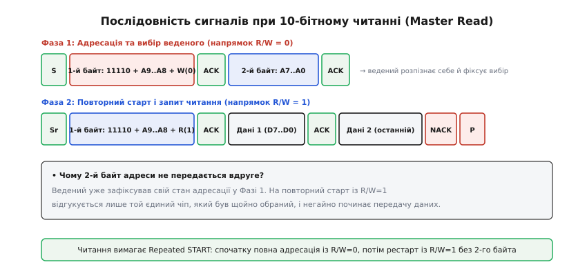
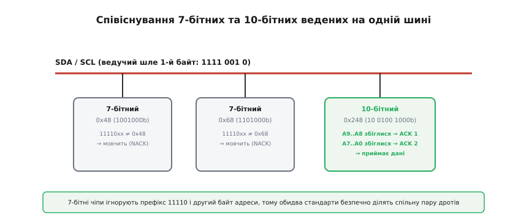
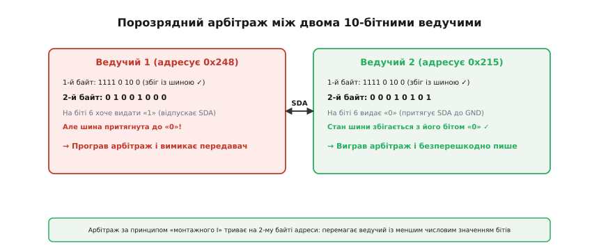

# 10-бітна адресація I2C

<preknowlist>
- [Адресація I2C](book:communications/i2c-addressing) — 7-бітна адреса веденого, біт напрямку R/W, байт адреси на шині.
- [Шина I2C](book:communications/i2c-bus) — фізичні лінії SDA та SCL, підтягувальні резистори, логіка відкритого колектора.
- [Сигнали START, STOP та ACK/NACK](book:communications/start-stop-ack) — формування старт-стопних умов, дев'ятий такт тактування, квитування прийому.
- [Транзакція I2C](book:communications/i2c-transaction) — кадри читання та запису, зміна напрямку через повторний старт (Repeated START).
- [Відкритий колектор](book:electronics/open-collector) — схемотехніка вихідного каскаду, монтажне «І», робота з підтяжкою.
</preknowlist>

У складних вимірювальних комплексах, системах автоматизації промислових шаф та телеметричних масивах кількість однотипних цифрових датчиків нерідко сягає кількох десятків. Якщо на одну спільну шину необхідно підключити тридцять однакових прецизійних вимірювачів струму, шістнадцятиканальних АЦП або цифрових термометрів, розробник миттєво впирається в жорстке апаратне обмеження: більшість мікросхем мають лише дві або три адресні ніжки, що дозволяє сконфігурувати максимум чотири або вісім унікальних 7-бітних адрес. Усі 112 корисних адрес класичного 7-бітного простору I2C швидко вичерпуються, а пряме підключення однакових приладів викликає непереборний конфлікт на спільній лінії. Для подолання цього бар'єра специфікація I2C вводить **10-бітну адресацію**, яка розширює адресний простір до 1024 унікальних ідентифікаторів. Головний інженерний виклик полягає в тому, що нові 10-бітні вузли та старі 7-бітні мікросхеми зобов'язані безпечно ділити одну й ту саму пару дротів SDA та SCL, не спотворюючи чужі транзакції та не вимагаючи розділення шини на окремі ізольовані гілки.

### Архітектурний бар'єр: чому не можна просто надіслати два довільні байти

Перша інтуїтивна ідея розширення адреси полягає в тому, щоб ведучий після сигналу START передавав не один, а два звичайні адресні байти поспіль. Проте на спільній шині, де поруч працюють класичні 7-бітні пристрої, такий підхід призвів би до фатальної системної колізії. Будь-який старий 7-бітний ведений слухає лінію і розпізнає перший байт після старту як звичайну 7-бітну адресу. Якщо значення цього першого байта випадково збіжиться з апаратною адресою старого чипа, він виставить підтвердження ACK на дев'ятому такті і перейде в режим прийому даних. Тоді другий байт адреси, призначений для 10-бітного приладу, старий 7-бітний чип сприйме як перший байт корисних даних і безповоротно перезапише свій внутрішній регістр конфігурації.

Щоб унеможливити подібні помилкові спрацьовування, розробники специфікації Philips / NXP I2C Bus Specification (UM10204) використали спеціальне архітектурне «вікно безпеки» у 7-бітній карті адрес. У цій карті заздалегідь зарезервовано спеціальний діапазон адрес із бітовим префіксом `1111 0XX` (що відповідає 7-бітним числам від `0x78` до `0x7B`, тобто `1111000b`…`1111011b`). Жоден стандартний 7-бітний комерційний датчик чи контролер не має права використовувати адресу з цього діапазону.

Коли ведучий починає 10-бітну транзакцію, перший байт на лінії SDA завжди починається з фіксованої комбінації `11110`. Усі 7-бітні ведені на шині порівнюють цей префікс зі своїми апаратними адресами, фіксують незбіг, не виставляють імпульс ACK на 9-му такті SCL і переходять у пасивний стан очікування сигналу STOP або Repeated START. Усі подальші байти цієї транзакції 7-бітні пристрої повністю ігнорують.

### Анатомія 2-байтного заголовка 10-бітної адреси

10-бітна адреса пристрою є цілим числом у діапазоні від `0x000` до `0x3FF` (від 0 до 1023 у десятковій системі). Вона розбивається на дві нерівні частини: два старших біти (`A9` та `A8`) пакуються в перший байт заголовка, а вісім молодших бітів (`A7`…`A0`) утворюють другий байт.


*Формат двох байтів 10-бітної адреси I2C. Перший байт складається з фіксованого префікса 11110, двох старших бітів адреси A9..A8 та біта напрямку R/W. Другий байт передає молодші вісім бітів A7..A0. Разом вони формують 10-бітний адресний простір на 1024 комбінації.*

Розгляньмо детальну структуру кожного розряду:

1. **Перший байт заголовка (`1111 0 A9 A8 R/W`):**
   - Біти 7..3 (`11110`): Фіксований 5-бітний префікс 10-бітної адресації.
   - Біти 2..1 (`A9`, `A8`): Старші два біти повної 10-бітної адреси веденого.
   - Біт 0 (`R/W`): Прапорець напрямку обміну (`0` — запис Master Write, `1` — зчитування Master Read).
2. **Другий байт заголовка (`A7 A6 A5 A4 A3 A2 A1 A0`):**
   - Біти 7..0: Молодші 8 розрядів адреси веденого. Вони передаються старшим бітом уперед (MSB first) одразу після отримання першого ACK.

**Формування байтів заголовка для конкретного чипа.** Нехай на шині встановлено датчик із 10-бітною адресою `0x248` (у двійковому записі `10 0100 1000₂`). Розрахуємо точний вигляд обох адресних байтів для операцій запису та читання:

```
Повна адреса:   addr10 = 0x248 = 10 0100 1000₂
Старші біти:   A9..A8 = (0x248 >> 8) & 0x03 = 10₂ (десяткове 2)
Молодші біти:  A7..A0 = 0x248 & 0xFF        = 0100 1000₂ = 0x48

Байт 1 (Write): 11110000₂ | (10₂ << 1) | 0 = 1111 0100₂ = 0xF4
Байт 1 (Read):  11110000₂ | (10₂ << 1) | 1 = 1111 0101₂ = 0xF5
Байт 2:         A7..A0                     = 0100 1000₂ = 0x48
```

З 1024 теоретично можливих комбінацій (`0x000`…`0x3FF`) вилучаються діапазони, молодші байти яких у поєднанні з префіксами перетинаються із загальним викликом (*General Call* `0x000`), що залишає 1008 повністю незалежних 10-бітних адрес. Повну таблицю всіх комбінацій префіксів та системних винятків наведено у [довідці специфікації бітових заголовків](book:communications/i2c-10bit-addressing/api-10bit-protocol.md).

### Протокол операції Master Write (Запис)

Операція запису в 10-бітний пристрій виконується в один безперервний прохід. Ведучий послідовно виставляє обидва адресні байти, після чого передає потік корисних даних.


*Послідовність сигналів при 10-бітному записі (Master Write). Після сигналу START ведучий передає два адресні байти поспіль із бітом R/W = 0. Отримавши підтвердження від цільового веденого, ведучий передає байти даних.*

Покрокова динаміка процесів на шині виглядає так:

1. **Генерація умови START:** Ведучий притягує лінію SDA до низького рівня при високому рівні SCL, сигналізуючи про початок нового кадру.
2. **Передача першого байта заголовка:** Ведучий передає 8 бітів `1111 0 A9 A8 0` (де біт R/W встановлено в `0`).
3. **Перше групове квитування (ACK 1):** На 9-му такті тактового сигналу SCL усі 10-бітні ведені пристрої, у яких збіглися старші розряди `A9..A8`, одночасно притягують лінію SDA до землі. Якщо на шині є три різні чіпи з адресами `0x215`, `0x248` та `0x2FE`, усі три видадуть ACK, оскільки їхні біти `A9..A8` однакові (`10₂`). 7-бітні ведені мовчать.
4. **Передача другого байта заголовка:** Ведучий надсилає 8 бітів молодшої частини адреси `A7..A0`.
5. **Остаточний індивідуальний вибір (ACK 2):** Кожен ведений, що відгукнувся на першому кроці, порівнює отриманий другий байт зі своїми розрядами `A7..A0`. Чіпи з незбігом молодших бітів скидають свій внутрішній прапорець вибору і переходять у пасивний режим. Лише один єдиний цільовий ведений (у нашому прикладі `0x248`), у якого повністю зійшлися всі 10 розрядів, виставляє другий імпульс ACK.
6. **Передача даних:** Ведучий надсилає перший байт даних (`DATA 1`). Ведений приймає його і відповідає імпульсом ACK. Процес повторюється для всіх наступних байтів (`DATA 2`…`DATA N`).
7. **Завершення обміну:** Ведучий формує умову STOP (перехід лінії SDA з низького рівня на високий при високому рівні SCL), повертаючи шину в стан спокою.

### Протокол операції Master Read та фізична необхідність повторного старту

Операція читання з 10-бітного веденого пристрою суттєво складніша за звичайне читання і вимагає обов'язкового використання сигналу Repeated START.

Чому не можна прочитати дані одразу, виставивши біт `R/W = 1` у першому ж байті заголовка? Справа у фундаментальному фізичному обмеженні: після передачі першого байта ведені знають лише два старших біти адреси `A9..A8`, але ще не знають молодших восьми бітів `A7..A0`. Якби ведучий встановив `R/W = 1` у першому байті і перейшов у режим прийому, усі ведені з однаковими бітами `A9..A8` одночасно почали б транслювати власні байти даних на лінію SDA. Це спричинило б хаотичне коротке замикання виходів відкритого колектора та спотворення зчитуваної інформації.

Тому 10-бітне читання обов'язково розділяється на дві окремі фази: фазу адресної прив'язки (Address Binding) та фазу передачі даних (Data Turnaround).


*Послідовність сигналів при 10-бітному читанні (Master Read). Вибір веденого відбувається у фазі запису, після чого через Repeated START передається лише перший байт із бітом R/W = 1. Ведений передає дані, а ведучий завершує обмін імпульсом NACK та сигналом STOP.*

Детальний розбір фаз читання:

1. **Фаза адресної прив'язки (напрямок R/W = 0):**
   - Ведучий формує сигнал START.
   - Ведучий передає перший байт заголовка з бітом запису: `1111 0 A9 A8 0`. Ведені з відповідними бітами `A9..A8` видають ACK.
   - Ведучий передає другий байт адреси: `A7..A0`.
   - Цільовий ведений розпізнає повний збіг своєї 10-бітної адреси, видає ACK і перемикає свій внутрішній кінцевий автомат у зафіксований стан готовності до читання (*Addressed for Read*). Решта пристроїв деактивуються.
2. **Фаза зміни напрямку (Repeated START):**
   - Ведучий не генерує сигнал STOP (який би скинув стан веденого), а формує повторний старт (Repeated START, `Sr`).
3. **Фаза запиту читання:**
   - Ведучий передає ТІЛЬКИ перший байт заголовка, але тепер із бітом читання: `1111 0 A9 A8 1`.
   - **Чому другий байт не передається вдруге?** Цільовий ведений уже зафіксував свій вибір на першому етапі. Побачивши сигнал Repeated START та свій префікс із `R/W = 1`, саме цей єдиний ведений відповідає імпульсом ACK і негайно перехоплює керування лінією SDA. Інші пристрої не реагують, бо вони були скинуті на попередньому кроці.
4. **Прийом даних та завершення:**
   - Ведений передає байти даних (`DATA 1`, `DATA 2`…). Ведучий квитує кожен прийнятий байт сигналом ACK.
   - Отримавши останній потрібний байт, ведучий формує сигнал NACK (Master NACK, не притягує SDA до нуля на 9-му такті), що повідомляє веденому про припинення передачі.
   - Ведучий виставляє сигнал STOP, звільняючи шину.

### Читання конкретного внутрішнього регістра в 10-бітному пристрої

У реальних інтегральних мікросхемах (наприклад, у цифрових термометрах чи багатоканальних датчиках струму) читання даних майже ніколи не починається з випадкового місця пам'яті. Ведучий спочатку зобов'язаний повідомити веденому, значення якого саме внутрішнього регістра його цікавить (записати покажчик регістра *Register Pointer*), і лише після цього зчитати результат.

У 10-бітній архітектурі повний цикл звернення до внутрішнього регістра об'єднує всі описані механізми в єдину монолітну транзакцію:

```
START
  │
  ├─► [1111 0 A9 A8 0] ──► ACK (від усіх ведених із відповідними A9..A8)
  │
  ├─► [A7..A0]        ──► ACK (від цільового веденого, фіксація вибору)
  │
  ├─► [Reg_Address]   ──► ACK (цільовий ведений зберігає адресу внутрішнього регістра)
  │
Repeated START (Sr)
  │
  ├─► [1111 0 A9 A8 1] ──► ACK (цільовий ведений активує передавач даних)
  │
  ├─► [Data_Byte_1]    ──► ACK (ведучий підтверджує прийом першого байта)
  │
  ├─► [Data_Byte_2]    ──► NACK (ведучий повідомляє про завершення читання)
  │
STOP
```

Зверніть увагу на критично важливу деталь: між записом адреси внутрішнього регістра `Reg_Address` та повторним запитом заголовка `1111 0 A9 A8 1` формується виключно сигнал **Repeated START**. Якщо ведучий замість цього виставить сигнал STOP і новий звичайний START, ведений скине внутрішній регістр покажчика в стан за замовчуванням (або скине прапорець вибору), і прочитані дані будуть хибними.

### Співіснування 7-бітних і 10-бітних пристроїв на спільній шині

Головна перевага протоколу 10-бітної адресації — абсолютна апаратна сумісність. Класичні 7-бітні мікросхеми та нові 10-бітні чипи можуть працювати на спільних лініях без встановлення додаткових перемикачів або мостів.


*Співіснування 7-бітних та 10-бітних пристроїв на спільній шині. Класичні 7-бітні ведені ігнорують зарезервований префікс 11110 і не виставляють ACK, тому 10-бітний ведений безпечно обмінюється даними без апаратних колізій.*

Механізм захисту від взаємних завад базується на трьох строгих правилах стандарту:

- **Фільтрація першого байта 7-бітними веденими:** Почувши комбінацію `11110xx`, компаратор 7-бітного чипа фіксує незбіг власної адреси, тому вихідний транзистор залишається закритим (лінія SDA лишається підтягнутою до живлення).
- **Ігнорування другого байта адреси:** Оскільки 7-бітний ведений не підтвердив перший байт, його внутрішній автомат переходить у пасивний стан очікування сигналу STOP. Другий байт 10-бітної адреси сприймається ним просто як черговий імпульс даних стороннього обміну.
- **Імунітет 10-бітних ведених до 7-бітних пакетів:** 10-бітний ведений починає обробку адреси ТІЛЬКИ тоді, коли перші п'ять бітів після старту точно дорівнюють `11110`. Якщо ведучий звертається до 7-бітного датчика з адресою `0x48` (`0100 1000₂`), перші біти містять нулі, і 10-бітний декодер миттєво відкидає цей пакет.

### Апаратна логіка декодування адреси всередині кремнієвого кристала

Щоб зрозуміти, як ведений чип обробляє подвійний заголовок без затримок у реальному часі, розглянемо будову його внутрішнього апаратного декодера. На відміну від 7-бітного пристрою, який має один 7-розрядний компаратор, 10-бітний контролер містить дворівневу схему селекції:

1. **Перший апаратний компаратор (Префікс + Старші біти):**
   Компаратор на логічних елементах постійно зіставляє стан зсувного регістра з константою `11110` та внутрішніми бітами конфігурації `A9` і `A8`. Якщо на 8-му спадному фронті тактового сигналу SCL усі 7 бітів збігаються, внутрішній тригер `HEADER_MATCH_LATCH` встановлюється в одиницю. Цей сигнал відкриває вихідний польовий транзистор із відкритим стоком на 9-му такті, притягуючи лінію SDA до нуля (генерація першого ACK).
2. **Другий апаратний компаратор (Молодший байт):**
   Якщо тригер `HEADER_MATCH_LATCH` активний, апаратний блок перемикає тактовий лічильник на прийом другого байта. 8 бітів молодшої адреси завантажуються в зсувний регістр і порівнюються з апаратними регістрами `A7..A0`. При збігу встановлюється головний прапорець вибору `DEVICE_SELECTED`, генерується другий імпульс ACK, і чип переходить у робочий режим обробки даних. Якщо хоча б один біт молодшої адреси не збігся, тригер `HEADER_MATCH_LATCH` апаратно скидається в нуль, транзистор закривається, і чип повністю ігнорує всі подальші імпульси тактування до появи умови STOP.

### Розтягування тактового сигналу під час декодування (Clock Stretching)

У деяких недорогих інтегральних схемах або мікроконтролерах, що емулюють 10-бітний ведений програмно чи через переривання, часу між 8-м та 9-м тактами SCL може бути недостатньо для порівняння адрес. У такій ситуації ведений використовує механізм розтягування тактового сигналу (*Clock Stretching*):

- Після спаду 8-го такту SCL ведений самостійно притягує лінію SCL до нуля і утримує її у такому стані.
- Провідний контролер (Master), намагаючись відпустити SCL для формування високого рівня 9-го такту, бачить, що напруга на лінії не піднялася через відкритий транзистор веденого.
- Ведучий призупиняє свій внутрішній генератор тактування і чекає, поки ведений завершить перевірку регістрів і відпустить лінію SCL.
- Щойно лінія SCL піднімається до напруги живлення через підтягувальний резистор, ведучий генерує 9-й такт і зчитує стан лінії SDA (підтвердження ACK).

Цей механізм дозволяє повільним веденим надійно обробляти 10-бітні заголовки навіть на максимальних швидкостях передачі даних.

### Вхідні фільтри придушення імпульсних завад (Spike Suppression)

Оскільки на спільній шині I2C при комутації вихідних транзисторів багатьох ведених пристроїв виникають перехідні процеси та паразитні ємнісні наводки, специфікація I2C вимагає встановлення апаратних фільтрів низьких частот на входах SDA та SCL кожного сумісного чипа.

- **Аналоговий фільтр завад (Glitch Filter):**
  На входах приймачів інтегровано схеми фільтрації, які повністю ігнорують будь-які короткі імпульси напруги тривалістю до 50 наносекунд (`t_SP ≤ 50` нс). Це запобігає хибному виявленню сигналу START або бітів адреси в моменти перемикання сусідніх ліній.
- **Вхідні тригери Шмітта (Schmitt Trigger Inputs):**
  Усі входи ліній I2C мають гістерезис (зазвичай не менше `0.05 · V_DD` для Fast-mode і `0.1 · V_DD` для Standard-mode). Це гарантує чітке розпізнавання логічних рівнів «0» та «1» навіть при повільному наростанні напруги на лініях із високою паразитною ємністю.

### Поведінка шини при частковому перезавантаженні та збоях живлення

У промислових системах із гарячою заміною вузлів або частковим знеструмленням окремих модулів можлива ситуація, коли один із 10-бітних ведених перезавантажується в процесі активного обміну даними. Для запобігання невизначеним станам у схемотехніку ведених закладаються такі механізми:

- **Схема скидання за рівнем живлення (Power-On Reset, POR):**
  При просіданні напруги нижче допустимого порогу внутрішній тригер POR скидає всі апаратні прапорці вибору (`HEADER_MATCH_LATCH` та `DEVICE_SELECTED`) у нуль. Після відновлення живлення чип починає роботу в стані `IDLE` і не реагує на передачу даних до наступного сигналу START.
- **Інтервал вільного стану шини (t_BUF):**
  Після формування сигналу STOP ведучий зобов'язаний витримати паузу `t_BUF` (не менше 4.7 мкс для Standard-mode і 1.3 мкс для Fast-mode) перед генерацією нового старту. Цей інтервал дозволяє паразитній ємності шини повністю розрядитися, а внутрішнім кінцевим автоматам ведених пристроїв — завершити скидання внутрішніх регістрів у стан спокою.

### Діагностика 10-бітних пакетів за допомогою логічного аналізатора

Під час налагодження реальних електронних плат незамінним інструментом є цифровий логічний аналізатор (наприклад, із відкритим програмним забезпеченням Sigrok / PulseView). Сучасні декодери протоколу I2C автоматично розпізнають префікс `11110` та об'єднують обидва байти в єдиний зрозумілий запис адреси.

Типовий протокольний дамп успішного читання з регістра `0x10` 10-бітного датчика `0x248` виглядає так:

```text
1. [START condition]
2. [Address Write: 0x248 (Header 0xF4 + 0x48), ACK]
3. [Data Write: 0x10 (Register Address), ACK]
4. [Repeated START condition]
5. [Address Read: 0x248 (Header 0xF5), ACK]
6. [Data Read: 0x03, Master ACK]
7. [Data Read: 0xE8, Master NACK]
8. [STOP condition]
```

Якщо на етапі 2 замість `ACK` фіксується `NACK`, це свідчить про фізичну відсутність чипа на шині або помилку в розрахунку адреси. Якщо `ACK` є на кроці 2, але на кроці 5 пристрій видає `NACK`, це сигналізує про те, що між фазами було помилково згенеровано сигнал STOP замість Repeated START.

### Арбітраж шини у мультимастерних системах

Шина I2C підтримує роботу кількох незалежних ведучих завдяки порозрядному арбітражу за принципом монтажного «І» (*wired-AND*). Кожен ведучий під час передачі власного сигналу одночасно зчитує реальний стан лінії SDA. Якщо ведучий відпустив лінію (хоче передати «1»), але бачить на ній низький рівень «0» (який виставив інший ведучий), він фіксує втрату арбітражу, негайно відключає свій вихідний каскад і переходить у режим слухача.

У змішаних системах із 10-бітною адресацією арбітраж має дві характерні особливості:


*Порозрядний арбітраж між двома 10-бітними ведучими. Якщо старші біти адреси збігаються, арбітраж триває на другому байті адреси за принципом монтажного «І»: перемагає ведучий, чий розряд адреси містить нуль замість одиниці.*

1. **Змагання між 7-бітним та 10-бітним ведучими:**
   10-бітний ведучий завжди починає передачу з префікса `11110` (чотири одиниці підряд). Якщо 7-бітний ведучий одночасно генерує адресу, яка містить хоча б один нуль у перших чотирьох розрядах (наприклад, адреси від `0x08` до `0x77`), 7-бітний ведучий притягне SDA до нуля, а 10-бітний ведучий побачить нуль замість одиниці і програє арбітраж ще на початку першого байта.
2. **Змагання між двома 10-бітними ведучими:**
   Якщо два ведучі одночасно звертаються до пристроїв з однаковими старшими бітами `A9..A8` (наприклад, ведучий 1 звертається до `0x248`, а ведучий 2 — до `0x215`), їхні перші байти повністю ідентичні (`0xF4`). Обидва ведучі бачать повний збіг і залишаються на шині. Арбітраж переноситься на **другий байт адреси**:
   - Ведучий 1 надсилає другий байт `0x48` (`0100 1000₂`).
   - Ведучий 2 надсилає другий байт `0x15` (`0001 0101₂`).
   - На біті 6 ведучий 1 намагається видати «1» (відпускає лінію), а ведучий 2 видає «0» (притягує лінію до землі). Ведучий 1 фіксує колізію, вимикає передавач і поступається шиною ведучому 2, при цьому дані ведучого 2 не спотворюються.

### Порівняння: 10-бітна адресація чи апаратний мультиплексор

При проектуванні розгалужених плат інженер завжди обирає між двома стратегіями масштабування кількості вузлів: переходом на 10-бітну адресацію або встановленням апаратного мультиплексора I2C (наприклад, восьмиканального чипа TCA9548A чи PCA9546A).

| Критерій порівняння | Нативна 10-бітна адресація | Апаратний I2C-мультиплексор (TCA9548A) |
| :--- | :--- | :--- |
| **Додаткові компоненти (BOM)** | Не потрібні; чипи підключаються напряму до спільних ліній SDA/SCL | Потрібна додаткова мікросхема комутатора та підтяжки для кожної гілки |
| **Площа друкованої плати** | Мінімальна; прокладається єдина двопровідна шина по всій платі | Збільшена; необхідно розводити до восьми окремих пар ліній SDA/SCL |
| **Накладні витрати протоколу** | Додаткові 9 тактів SCL на кадр адресації | Необхідно надіслати повну 7-бітну транзакцію перемикання каналу перед кожним опитуванням |
| **Точка відмови системи** | Відмова одного датчика не блокує інші (якщо лінія не закорочена на землю) | Зависання комутатора блокує всі підключені за ним гілки та датчики |
| **Підтримка мікросхемами** | Потрібна наявність підтримки 10-бітного режиму в самому датчику | Дозволяє підключати будь-які старі 7-бітні датчики з однаковими адресами |

Нативна 10-бітна адресація значно вигідніша за вартістю, надійністю та простотою топології друкованої плати, якщо використовувані компоненти первинно підтримують цей режим. Якщо ж система будується на дешевих датчиках із жорстко зашитими 7-бітними адресами, мультиплексор залишається єдиним можливим рішенням.

### Програмне керування 10-бітними пристроями у коді

Для взаємодії з 10-бітними мікросхемами в операційній системі Linux використовують системний виклик `ioctl(fd, I2C_RDWR, ...)` із прапорцем `I2C_M_TEN` у структурі повідомлення `struct i2c_msg`. Драйвер ядра бере на себе генерацію першого байта, контроль проміжних ACK та формування повторного старту.

:::tabs
```c
#include <stdint.h>
#include <fcntl.h>
#include <unistd.h>
#include <sys/ioctl.h>
#include <linux/i2c.h>
#include <linux/i2c-dev.h>

/* Зчитування двох байтів із внутрішнього регістра 10-бітного веденого */
int read_sensor_10bit(int fd, uint16_t addr10, uint8_t reg, uint8_t *val_high, uint8_t *val_low) {
    uint8_t buffer[2] = {0};
    struct i2c_msg msgs[2];
    struct i2c_rdwr_ioctl_data rdwr;

    /* 1-й кадр: передача адреси регістра в режимі запису */
    msgs[0].addr  = addr10;
    msgs[0].flags = I2C_M_TEN;         /* 10-бітна адреса, R/W = 0 */
    msgs[0].len   = 1;
    msgs[0].buf   = &reg;

    /* 2-й кадр: читання даних через Repeated START */
    msgs[1].addr  = addr10;
    msgs[1].flags = I2C_M_TEN | I2C_M_RD; /* 10-бітна адреса, R/W = 1 */
    msgs[1].len   = 2;
    msgs[1].buf   = buffer;

    rdwr.msgs  = msgs;
    rdwr.nmsgs = 2;

    if (ioctl(fd, I2C_RDWR, &rdwr) < 0) {
        return -1;
    }

    *val_high = buffer[0];
    *val_low  = buffer[1];
    return 0;
}
```
```cpp
#include <cstdint>
#include <span>
#include <expected>
#include <system_error>
#include <sys/ioctl.h>
#include <linux/i2c.h>
#include <linux/i2c-dev.h>

struct SensorReading {
    uint8_t high;
    uint8_t low;
};

/* Зчитування показів 10-бітного датчика з використанням сучасних безпечних типів C++ */
std::expected<SensorReading, std::error_code> readSensor10Bit(
    int fd,
    uint16_t addr10,
    uint8_t reg
) noexcept {
    uint8_t reg_addr = reg;
    uint8_t buffer[2] = {0, 0};

    struct i2c_msg msgs[2]{};

    msgs[0].addr  = addr10;
    msgs[0].flags = I2C_M_TEN;
    msgs[0].len   = 1;
    msgs[0].buf   = &reg_addr;

    msgs[1].addr  = addr10;
    msgs[1].flags = I2C_M_TEN | I2C_M_RD;
    msgs[1].len   = 2;
    msgs[1].buf   = buffer;

    struct i2c_rdwr_ioctl_data rdwr{};
    rdwr.msgs  = msgs;
    rdwr.nmsgs = 2;

    if (::ioctl(fd, I2C_RDWR, &rdwr) < 0) {
        return std::unexpected(std::error_code(errno, std::generic_category()));
    }

    return SensorReading{buffer[0], buffer[1]};
}
```
:::

Повні приклади реалізації низькорівневих драйверів для мікроконтролерів STM32 (HAL та LL) та ESP32 наведено у [практичному проекті реалізації драйвера](book:communications/i2c-10bit-addressing/proj-10bit-transfer.md).

### Часові витрати та накладні розрахунки протоколу

Розширення адреси неминуче збільшує час передачі службової інформації на шині. Порахуймо точний баланс тактів SCL для 7-бітної та 10-бітної транзакцій:

```
Запис N байтів (Master Write):
7-бітний:  1 (START) + 9 (Addr+ACK) + 9·N (Data) + 1 (STOP)      = 11 + 9·N тактів
10-бітний: 1 (START) + 9 (Hdr1) + 9 (Hdr2) + 9·N (Data) + 1 (STOP) = 20 + 9·N тактів
Різниця:   +9 тактів SCL на кожну транзакцію запису (один додатковий байт заголовка)

Читання N байтів із попереднім вибором регістра (Write Reg + RepSTART + Read):
7-бітний:  [1 + 9 (Addr) + 9 (Reg) + 1] + [1 + 9 (Addr) + 9·N (Data) + 1] = 31 + 9·N тактів
10-бітний: [1 + 18 (Hdr1+2) + 9 (Reg) + 1] + [1 + 9 (Hdr1) + 9·N (Data) + 1] = 40 + 9·N тактів
Різниця:   +9 тактів SCL на весь цикл (другий байт передається лише раз у фазі вибору)
```

При тактовій частоті шини 100 кГц (період одного такту `T = 10` мкс) додаткові 9 тактів додають рівно 90 мкс накладних витрат. Для поодинокого читання 2-байтного регістра (наприклад, температури датчика):
- 7-бітне читання: `31 + 18 = 49` тактів → **490 мкс**.
- 10-бітне читання: `40 + 18 = 58` тактів → **580 мкс** (зростання часу на 18.3%).

У швидкому режимі Fast-mode (400 кГц, `T = 2.5` мкс) ця затримка скорочується до **22.5 мкс**, що є абсолютно непомітним для переважної більшості вбудованих застосунків і датчиків.

### Топологія друкованої плати та робота з шинними буферами

У великих системах із десятками 10-бітних ведених пристроїв сумарна паразитна ємність ліній зв'язку часто перевищує стандартне обмеження I2C у 400 пФ. Для збереження крутизни фронтів сигналів застосовують спеціалізовані двонаправлені шинні буфери та прискорювачі фронтів (*I2C Bus Accelerators*, наприклад PCA9515A чи LTC4311).

Шинний буфер електрично розділяє шину на два ізольовані сегменти, динамічно підсилюючи струм перезаряджання ємності під час переходу з низького рівня на високий. Оскільки буфер працює на фізичному рівні, він є абсолютно прозорим для протоколу 10-бітної адресації: буфер автоматично пропускає обидва адресні байти, підтримує двонаправлене квитування ACK та коректно транслює стан лінії під час побітового арбітражу між провідними контролерами.

### Енергоспоживання при інтенсивному 10-бітному опитуванні

Робота шини I2C супроводжується двома складовими енергоспоживання: статичною та динамічною:

1. **Статична потужність розсіювання на підтягувальних резисторах:**
   Струм тече через резистор `R_p` лише тоді, коли лінія притягнута відкритим колектором до землі (`SDA = 0` або `SCL = 0`). Статична потужність розраховується за формулою:
   ```
   P_static = (V_DD² / R_p) · δ_0
   ```
   де `δ_0` — коефіцієнт заповнення низького рівня (частка часу, коли лінія перебуває в нулі). Для 10-бітної адресації перший байт починається з `11110`, що містить чотири одиниці підряд. Це зменшує час перебування лінії SDA в нулі на початку кадру порівняно з адресами, насиченими нулями, знижуючи статичне споживання в моменти ініціалізації обміну.
2. **Динамічна потужність перезаряджання ємності шини:**
   Кожен фронт перемикання з «0» в «1» вимагає заряду сумарної паразитної ємності `C_b` до напруги `V_DD`. Динамічна потужність пропорційна частоті тактування:
   ```
   P_dynamic = C_b · V_DD² · f_SCL
   ```
   У системах із батарейним живленням перехід на режим Fast-mode (400 кГц) збільшує динамічну складову, проте скорочує загальний час активного стану процесора, дозволяючи контролеру швидше повернутися в режим глибокого сну (*Deep Sleep*).

> 🔧 **Навіщо це.** 10-бітна адресація незамінна при побудові великих однорідних масивів сенсорів, крос-платформних обчислювальних кошиків або телеметричних панелей з десятками однакових пристроїв. Вона дозволяє обійтися без встановлення додаткових апаратних I2C-мультиплексорів, заощаджуючи площу друкованої плати та усуваючи необхідність комутації ліній шини в прошивці.
