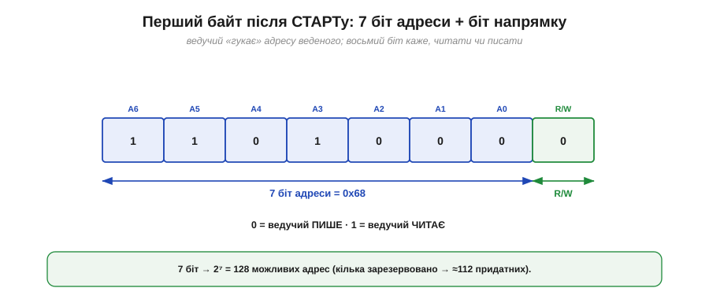
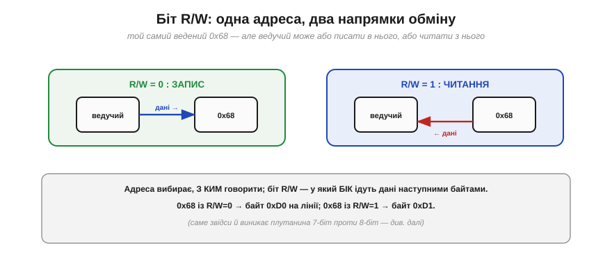
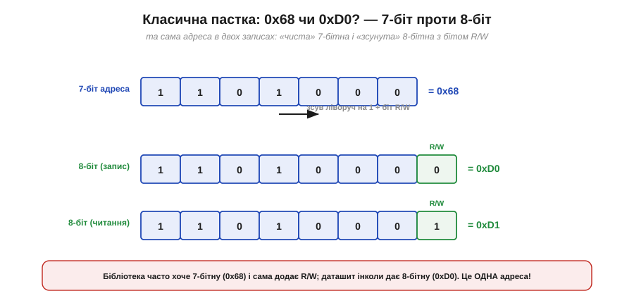
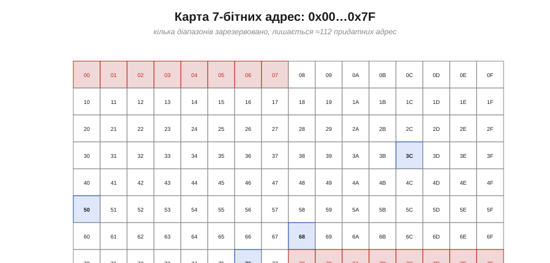
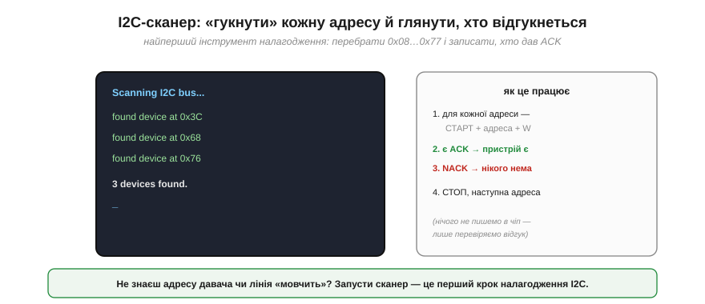

# Адресація: багато пристроїв на двох дротах

На спільній лінії висить десяток пристроїв, і всі вони «чують» одне й те саме. Як ведучому поговорити саме з потрібним — з гіроскопом, а не з барометром? Відповідь, закладена в I2C від народження: кожному веденому дають **адресу**, а обмін завжди починається з того, що ведучий цю адресу **називає**. Це проста ідея з кількома практичними тонкощами, одна з яких — найвідоміша пастка всього I2C, на якій спотикається чи не кожен новачок. Розберімо все по черзі.

### Перший байт: 7 біт адреси плюс напрямок

Щойно ведучий почав обмін, перше, що він посилає, — це **байт адреси**. Влаштований він так: **сім** старших біт несуть адресу веденого, а **восьмий** (наймолодший) — це окремий **біт напрямку R/W**.


*Рис. Перший байт після старту: біти A6…A0 — це 7-бітна адреса веденого (тут 0x68), а останній біт **R/W** каже напрямок: 0 — ведучий писатиме, 1 — читатиме. Сім біт дають 2⁷ = 128 можливих адрес, з яких кілька зарезервовано, тож придатних — близько 112.*

Чому саме **7** біт? Це початковий вибір Philips: 128 адрес видавалося з головою для плати телевізора, а вкласти адресу в один байт разом із бітом напрямку — зручно й ощадливо. Біт **R/W** (*Read/Write*) тут не випадковий «довісок»: він одразу, ще на адресному байті, каже всім, у який бік підуть наступні дані — від ведучого до веденого (запис, 0) чи назад (читання, 1).

### Адресу чують усі, відгукується один

Як працює вибір на спільній лінії? Ведучий виставляє адресний байт — і його бачать **усі** ведені одразу. Але кожен порівнює почуту адресу зі **своєю** — і реагує лише той, у кого збіглося.


*Рис. Ведучий шле 0x68. Кожен ведений звіряє цю адресу зі своєю: давач 0x68 упізнає себе й відповідає (підтвердженням ACK), а 0x3C, 0x76, 0x50 розуміють, що це не до них, і мовчать. Адреса працює як фільтр на спільній лінії.*

Це і є суть адресації: на спільній шині адреса слугує **фільтром**. Усі слухають, але озивається лише власник адреси — він «підтверджує» прийом, притягнувши лінію вниз (саме той трюк [відкритого колектора](book:electronics/open-collector), яким на I2C формують [підтвердження ACK](book:communications/start-stop-ack)). Решта пасивно чекає кінця чужого обміну.

### Біт R/W: один чіп, два напрямки

Повернімося до восьмого біта. Адреса вибирає, **з ким** говорити; біт R/W задає, **у який бік** підуть дані.


*Рис. Той самий ведений 0x68: з R/W = 0 ведучий **пише** в нього (дані йдуть від ведучого), з R/W = 1 — **читає** з нього (дані йдуть назад). Адреса незмінна, міняється лише напрямок наступного обміну.*

На практиці майже кожна транзакція з давачем поєднує обидва: спершу ведучий **пише** (каже, який регістр його цікавить), потім **читає** (забирає звідти дані). Тому біт R/W — не екзотика, а щоденний інструмент: саме з цих «запис-потім-читання» складаються реальні [звертання до чіпів](book:communications/i2c-transaction).

### Класична пастка: 0x68 чи 0xD0?

А тепер — найвідоміша плутанина I2C, через яку згаяно безліч годин. Подивімося, що насправді летить лінією, коли адреса 0x68, а R/W = 0. Адресні біти займають позиції з 7-ї до 1-ї, R/W — найнижчу. Тобто **повний байт** на лінії — це адреса, **зсунута ліворуч на один біт**, плюс R/W.


*Рис. Та сама адреса у двох записах. «Чиста» **7-бітна** адреса = 0x68. А **8-бітний** байт на лінії — це 0x68, зсунута ліворуч на 1, із бітом R/W унизу: 0xD0 для запису й 0xD1 для читання. Це ОДНА адреса, лише по-різному записана.*

**Приклад (звідки беруться 0xD0 і 0xD1).** Порахуймо обидва записи для давача з 7-бітною адресою 0x68:

```
7-біт адреса        = 0x68 = 110 1000

байт запису (R/W=0) = (0x68 << 1) | 0 = 1101 0000 = 0xD0
байт читання (R/W=1)= (0x68 << 1) | 1 = 1101 0001 = 0xD1
```

Ось де пастка: один даташит напише «адреса пристрою — **0x68**» (7-бітна), інший — «адреса запису **0xD0**, читання **0xD1**» (8-бітні), а бібліотека (як-от `Wire` в Arduino) очікує від тебе **7-бітну** 0x68 і сама додає R/W. Якщо ж передати їй 8-бітну 0xD0, вона зсуне її ще раз — і звернеться до зовсім іншої адреси, а пристрій «не знайдеться». Тому, побачивши адресу, завжди питай себе: це **7-бітна** чи вже з бітом R/W?

> 🔧 **Навіщо це.** Це найчастіша причина «не бачу давача на шині». Запам'ятай: бібліотеки Arduino/`Wire` хочуть **7-бітну** адресу (0x68). Якщо в даташиті число парне й удвічі більше за очікуване (0xD0) — це 8-бітна форма, поділи її на 2, щоб дістати 7-бітну. Сумнів — запусти I2C-сканер (нижче) і подивись, на якій 7-бітній адресі реально відгукується чіп.

### Кілька однакових чіпів: ніжки адреси

Адреса чіпа здебільшого **частково зашита** виробником: кожен тип давача має свою «базову» адресу. Але що, як треба поставити на шину **два однакові** давачі — наприклад, два однакові гіроскопи? Їхні фіксовані адреси збіглися б, і обидва відповідали б разом — конфлікт. Тому виробники лишають кілька **молодших** біт адреси налаштовними — через **ніжки** (часто звуться A0, A1, A2).


*Рис. Два однакові давачі з базою 0x68: під'єднавши ніжку A0 до землі, дістаємо 0x68, а до живлення — 0x69. Тепер вони мають різні адреси й мирно живуть на одній шині. Бракує комбінацій ніжок — ставлять I2C-мультиплексор, що розводить шину на окремі гілки.*

Так на одну шину вдається посадити кілька однакових чіпів: кожному ніжками A0/A1/A2 задають свою адресу. Якщо ніжок-варіантів не вистачає (а буває потрібно багато однакових давачів), на допомогу приходить **I2C-мультиплексор** (наприклад, TCA9548) — мікросхема, що розводить одну шину на кілька окремих гілок, по одній на групу однакових пристроїв. Та головне правило незмінне: **дві однакові адреси на одній шині — це конфлікт**, і його треба усунути ще на етапі проєктування.

### Карта адрес і зарезервовані

Не всі 128 комбінацій 7-бітної адреси вільні: частину Philips зарезервувала під службові потреби.


*Рис. Простір адрес 0x00…0x7F. Червоні клітини (0x00–0x07 і 0x78–0x7F) — зарезервовані (зокрема 0x00 — «загальний виклик» усім одразу, та діапазон під 10-бітну адресацію). Сині — приклади реальних давачів. Зарезервовано 16 адрес, тож придатних лишається 112.*

**Приклад (звідки «112»).** Порахуймо вільні адреси:

```
усього 7-бітних адрес = 2⁷ = 128
зарезервовано: 0x00…0x07 (8) + 0x78…0x7F (8) = 16
придатних = 128 − 16 = 112
```

Цих 112 адрес з головою для будь-якої плати. А якщо колись забракло б і їх — у стандарті є **10-бітна** адресація (вона користується спеціальним зарезервованим префіксом 11110xx), що дає тисячі адрес; щоправда, у дрібних системах її майже не вживають.

### I2C-сканер

Насамкінець — найкорисніший практичний інструмент усієї теми. Оскільки ведений **підтверджує** свою адресу, можна просто **перебрати** всі адреси підряд і подивитися, хто озветься. Це й робить **I2C-сканер**.


*Рис. Сканер по черзі «гукає» кожну адресу від 0x08 до 0x77: старт, адреса, біт запису. Прийшов ACK — пристрій на цій адресі є; NACK — нікого нема. Нічого в чіп не записуючи (лише перевіряючи відгук), сканер за частку секунди складає список усіх пристроїв на шині.*

Логіка проста: для кожної адреси ведучий шле старт і адресний байт — і дивиться на відповідь. ACK означає «тут хтось є», NACK — «порожньо». Жодних даних у пристрій не пишуть, тож сканування безпечне. Результат — список адрес, на яких реально сидять пристрої.

> 🔧 **Навіщо це.** I2C-сканер — перше, що варто запустити, коли підключив новий давач або коли шина «мовчить». Він одразу відповідає на два питання: чи пристрій **взагалі живий** на шині (відгукується?) і на якій **7-бітній адресі** він сидить (а отже, чи правильну адресу ти даєш бібліотеці). Якщо сканер не бачить нічого — біда не в адресі, а нижче: підтяжки, живлення, дроти. Якщо бачить пристрій на несподіваній адресі — ти щойно розв'язав плутанину 7-біт/8-біт.

Адресація відповідає на питання «з ким говорити», але лишає осторонь найдрібніші, проте вирішальні деталі: як саме ведучий **позначає** початок і кінець обміну й як ведений **підтверджує** кожен прийнятий байт. Ці чотири сигнали — [старт, стоп, ACK і NACK](book:communications/start-stop-ack) — і є «розділові знаки» мови I2C.

---
