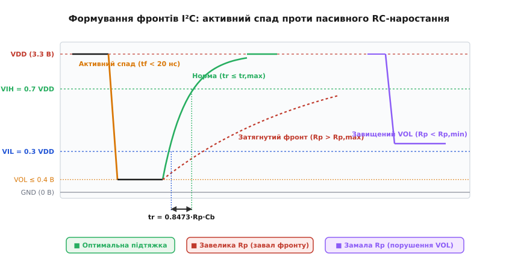
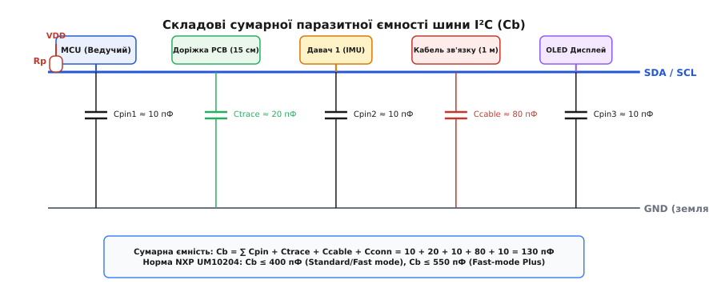
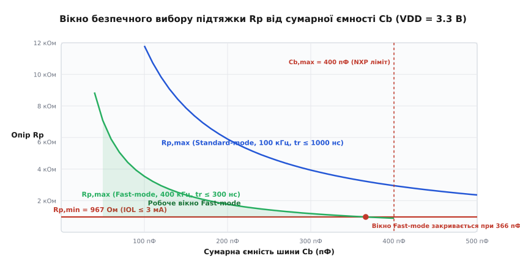
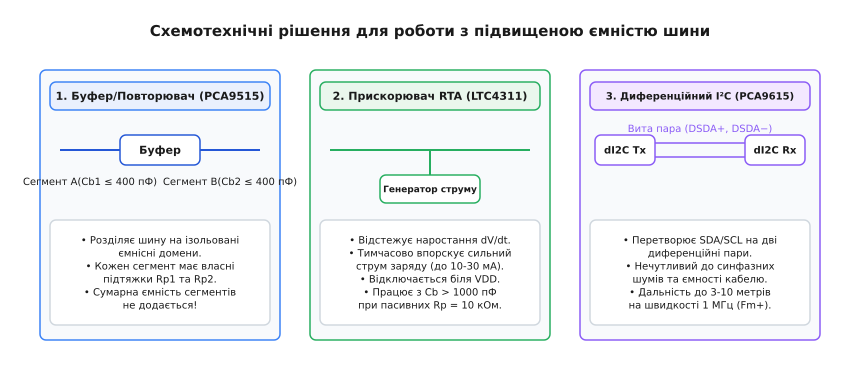

# Ємність шини I²C і вибір підтяжок

<preknowlist>
- [Двопровідна шина I²C](topic:communications/i2c-bus) — принципи роботи ліній SDA і SCL, структура адресації та транзакцій.
- [Режими швидкості I²C](topic:communications/i2c-speeds) — таймінги та частотні обмеження Standard-mode, Fast-mode і Fast-mode Plus.
- [Відкритий колектор та стік](topic:electronics/open-collector) — комутація тільки до землі, пасивна підтяжка та монтажне «І».
- [Постійна часу RC-ланцюга](topic:electronics/rc-time-constant) — перехідні процеси експоненційного заряду ємності через резистор.
- [Тригер Шмітта](topic:electronics/schmitt-trigger) — гістерезис для захисту входів від брязкоту на пологих фронтах.
</preknowlist>

Коли на макетній платі до мікроконтролера підключають цифровий барометр і мікросхему пам'яті EEPROM короткими провідниками по 5 см, шина I²C бездоганно працює на частоті 100 кГц навіть із випадково обраними підтяжками 10 кОм. Проте варто перенести пристрій у реальний корпус, подовжити лінію метровим стрічковим шлейфом до зовнішнього OLED-дисплея та перемкнути контролер у режим Fast-mode (400 кГц), як обмін повністю розвалюється: транзакції зависають на очікуванні підтвердження ACK, лінія такту перетворюється на згладжену пилкоподібну хвилю, а мікроконтролер фіксує таймаути шини. Причина цієї аварії криється не в програмних помилках, а у фундаментальній фізичній асиметрії інтерфейсу з відкритим стоком: паразитна ємність шини разом із резистором підтяжки утворює інтегрувальний RC-ланцюг, швидкість наростання напруги в якому жорстко обмежена законами електродинаміки.

Щоб шина I²C працювала надійно в усьому діапазоні температур і завад, розробник зобов'язаний розрахувати фізичні межі опору резисторів підтяжки. Завищений опір спотворює форму імпульсів і порушує часові інтервали передачі даних, а занижений — перевантажує вихідні каскади мікросхем струмом і руйнує логічний нуль.

---

### Асиметрія вихідного каскаду: активний спад проти пасивного підйому

На відміну від інтерфейсів із двотактним вихідним каскадом (*Push-Pull*, як у [шині SPI](topic:communications/spi-bus)), де лінія активно підключається верхнім транзистором до напруги живлення `V_DD`, а нижнім — до землі `GND`, у шині I²C обидві сигнальні лінії — лінія даних SDA (*Serial Data*) та лінія такту SCL (*Serial Clock*) — побудовані за схемою з [відкритим стоком](topic:electronics/open-collector) (*Open-Drain*). Жоден підключений до шини чіп фізично не має верхнього P-канального транзистора, який міг би активно видати високий потенціал у лінію.


*Формування сигналів у шині I²C: активний розряд через внутрішній MOSFET забезпечує крутий спад (tf < 20 нс), тоді як заряд через пасивний резистор Rp відбувається за експонентою. Час наростання tr вимірюється між порогами 0.3·VDD та 0.7·VDD.*

Ця схемотехнічна особливість створює виражену динамічну асиметрію фронтів цифрового сигналу:

1. **Активний спадний фронт (перехід «1 → 0»):**
   Коли мікроконтролер або ведений пристрій виставляє на шині логічний нуль, його внутрішній N-канальний польовий транзистор відкривається. Опір відкритого каналу `R_DS(on)` становить лише `5–20 Ом`. Увесь накопичений у розподіленій ємності шини електричний заряд миттєво стікає на землю через відкритий транзистор. Струм розряду може сягати десятків міліампер, тому спадний фронт `t_f` (*fall time*) виходить надзвичайно крутим — зазвичай менше `10–20 нс`.

2. **Пасивний висхідний фронт (перехід «0 → 1»):**
   Коли пристрій відпускає лінію для передачі логічної одиниці, його вихідний транзистор закривається, переходячи у стан високого імпедансу (*Hi-Z*). У цей момент лінія виявляється повністю від'єднаною від землі, і її підйом до напруги живлення `V_DD` відбувається виключно за рахунок зовнішнього резистора підтяжки `R_p` (*pull-up resistor*). Струм підтяжки починає поступово заряджати сумарну паразитну ємність шини `C_b` (*bus capacitance*).

Напруга на лінії зростає за класичним експоненційним законом заряджання конденсатора:

```
V(t) = V_DD · (1 - e^(-t / (R_p · C_b)))
```

де `τ = R_p · C_b` — постійна часу кола (добуток опору підтяжки на повну ємність лінії).

Оскільки вхідні каскади мікросхем стандарту I²C базуються на логіці КМОН (*CMOS*), логічні рівні визначаються відносними частками від напруги живлення:
- Максимальна напруга гарантованого логічного нуля: `V_IL = 0.3 · V_DD` (для 3.3 В системи це `0.99 В`).
- Мінімальна напруга гарантованої логічної одиниці: `V_IH = 0.7 · V_DD` (для 3.3 В системи це `2.31 В`).
- Діапазон від `0.3 · V_DD` до `0.7 · V_DD` є забороненою зоною невизначеності.

Час, за який напруга на шині долає цю заборонену зону від `0.3 · V_DD` до `0.7 · V_DD`, називається **часом наростання фронту** `t_r` (*rise time*). Саме цей параметр підпорядковується найжорсткішим обмеженням стандарту.

---

### Анатомія та джерела сумарної ємності шини C_b

Сумарна ємність шини `C_b` є еквівалентною зосередженою величиною, яка складається з кількох незалежних фізичних джерел паразитної ємності, підключених паралельно між сигнальним провідником (SDA або SCL) та землею GND.


*Еквівалентна модель розподіленої ємності лінії: сумарна ємність Cb складається з ємностей виводів мікросхем Cpin, погонної ємності друкованих трас Ctrace, ємності з'єднувальних кабелів Ccable та рознімів Cconn.*

Загальна ємність кожної лінії обчислюється як сума окремих складових:

```
C_b = ∑ C_pin + C_trace + C_cable + C_conn
```

Розгляньмо внесок кожного фізичного елемента детально:

1. **Паразитна ємність виводів мікросхем (`C_pin` або `C_i`):**
   Кожен підключений до шини чіп (як ведучий контролер, так і ведені давачі чи розширювачі) додає до лінії власну ємність виводу. Вона формується ємністю діодів захисту від електростатичного розряду (ESD), ємністю контактних площадок кремнієвого кристала, металевого розварювального мікропровідника та внутрішніх затворів вхідних буферів.
   - За специфікацією NXP UM10204 максимальна ємність виводу мікросхеми стандарту I²C становить `C_pin ≤ 10 пФ` (типове значення сучасних SMD-мікросхем — `5–8 пФ`).
   - Якщо на одній шині встановлено мікроконтролер і 7 сенсорів, лише виводи мікросхем дадуть: `8 · 10 пФ = 80 пФ`.

2. **Ємність друкованих провідників на платі (`C_trace`):**
   Мідна доріжка на багатошаровій друкованій платі над суцільним земляним шаром (*Ground Plane*) утворює мікрополоскову лінію (*microstrip*). Її питома погонна ємність залежить від діелектричної проникності текстоліту (для FR-4 `ε_r ≈ 4.2–4.5`), ширини доріжки `w` та товщини діелектрика `h` до найближчого опорного шару.
   - Для типової 4-шарової плати (товщина препрегу `h = 0.2 мм`, ширина траси `w = 0.2 мм`) питома ємність становить `1.2–1.5 пФ/см` (`30–40 пФ/фут`).
   - Траса завдовжки 20 см додасть до шини приблизно `25–30 пФ`.

3. **Ємність з'єднувальних кабелів і шлейфів (`C_cable`):**
   Кабелі є головним джерелом паразитної ємності, коли I²C виходить за межі друкованої плати:
   - Стандартний плоский стрічковий шлейф (*flat ribbon cable*, крок 1.27 мм) має власну ємність між сусідніми жилами порядку `50–80 пФ/м`. Якщо сигнальний дріт пустити поруч із дротом заземлення (для захисту від завад), ємність зростає до `100–130 пФ/м`.
   - Вита пара категорії Cat5e/Cat6 має погонну ємність близько `50–60 пФ/м` між провідниками пари.
   - Екранований 4-жильний кабель зв'язку зазвичай має ємність `100–180 пФ/м` від сигнальної жили до екрана.
   - Підключення зовнішнього модуля кабелем довжиною 1.5 метра одразу додає від `100` до `250 пФ` ємності.

4. **Ємність контактних рознімів і сокетів (`C_conn`):**
   Штирьові розніми (типу PBS/PLS), клемники та розніми серій JST-SH / Molex додають приблизно `1–3 пФ` на кожну пару контактів.

5. **Міжпровідникова ємність зв'язку (`C_c`, взаємний перехресний зв'язок):**
   Якщо доріжки SDA і SCL прокладені на друкованій платі паралельно на мінімальній відстані без проміжного земляного екранування, між ними виникає взаємна паразитна ємність `C_c` (`0.3–0.8 пФ/см`). Під час швидкого перемикання тактового сигналу SCL ця ємність впорскує імпульс струму `i = C_c · (dV_SCL / dt)` у лінію SDA, що створює хибні сплески напруги під час передачі даних.

---

### Нормативні обмеження специфікації NXP UM10204

Стандарт I²C (кодифікований компанією NXP, правонаступницею винахідника шини Philips Semiconductors, у специфікації UM10204) встановлює граничні норми сумарної ємності та тривалості перехідних процесів для кожного швидкісного класу:

| Параметр шини | Standard-mode (Sm) | Fast-mode (Fm) | Fast-mode Plus (Fm+) | High-Speed mode (Hs) |
| :--- | :--- | :--- | :--- | :--- |
| **Максимальна тактова частота** `f_SCL` | 100 кГц | 400 кГц | 1.0 МГц | 3.4 МГц |
| **Максимальна сумарна ємність** `C_b,max` | **400 пФ** | **400 пФ** | **550 пФ** | 100 пФ (400 пФ з RTA) |
| **Максимальний час наростання** `t_r,max` | **1000 нс** | **300 нс** | **120 нс** | 80 нс (100 пФ) / 160 нс |
| **Максимальний час спаду** `t_f,max` | 300 нс | 300 нс | 120 нс | 40 нс (100 пФ) / 80 нс |
| **Номінальний струм стягування** `I_OL` | **3.0 мА** | **3.0 мА** | **20.0 мА** | 3.0 мА |
| **Максимальний спад нуля** `V_OL,max` | 0.4 В | 0.4 В | 0.4 В | 0.4 В |

Чому саме **400 пФ** стало священною цифрою класичного I²C? Це фундаментальне схемотехнічне обмеження, що випливає з математичного поєднання двох вимог: допустимого часу наростання `t_r ≤ 300 нс` та обмеження струму вихідного транзистора `I_OL ≤ 3 мА`. При напрузі 3.3 В мінімальний опір підтяжки становить близько `967 Ом`. Якщо ємність шини сягає 400 пФ, час заряджання лінії через цей резистор складає `0.8473 · 967 Ом · 400 пФ ≈ 327 нс`, що вже перевищує ліміт 300 нс! Перевищення порога 400 пФ робить фізично неможливим одночасне виконання вимог щодо швидкості та безпечного струму за допомогою звичайного пасивного резистора.

---

### Розрахунок діапазону опорів підтяжки: вікно [R_p,min, R_p,max]

Вибір резистора підтяжки `R_p` — це завжди пошук компромісу всередині строго обмеженого інтервалу `[R_p,min, R_p,max]`.


*Залежність допустимого діапазону Rp від сумарної ємності лінії Cb при VDD = 3.3 В: горизонтальна червона лінія задає обмеження за струмом (Rp,min), а спадні гіперболи — обмеження за часом наростання (Rp,max). Для Fast-mode робоче вікно зачиняється при Cb = 366 пФ.*

#### 1. Розрахунок мінімального опору підтяжки (R_p,min)

Нижня межа опору `R_p,min` захищає вихідний транзистор мікросхеми від руйнування надмірним струмом і гарантує, що при відкритому ключі спад напруги на виводі не перевищить максимально допустимий рівень логічного нуля `V_OL,max = 0.4 В`.

Коли транзистор відкритий, резистор `R_p` підключений між напругою живлення `V_DD` і виводом мікросхеми з потенціалом `V_OL`. Струм, що втікає у вивід, обчислюється за [законом Ома](topic:electronics/ohms-law):

```
I_OL = (V_DD - V_OL) / R_p
```

Щоб струм не перевищив номінальну навантажувальну здатність вихідного каскаду `I_OL,max` (стандартно `3 мА`), опір підтяжки має задовольняти нерівність:

```
R_p,min = (V_DD - V_OL,max) / I_OL,max
```

Розрахуємо значення `R_p,min` для поширених рівнів напруги живлення:
- **Для систем з V_DD = 5.0 В:**
  ```
  R_p,min = (5.0 В - 0.4 В) / 0.003 А = 4.6 В / 0.003 А = 1533 Ом (1.53 кОм)
  ```
- **Для систем з V_DD = 3.3 В:**
  ```
  R_p,min = (3.3 В - 0.4 В) / 0.003 А = 2.9 В / 0.003 А = 967 Ом (0.97 кОм)
  ```
- **Для низьковольтних систем з V_DD = 1.8 В:**
  За стандартом для `V_DD ≤ 2.0 В` допустимий нуль становить `V_OL,max = 0.2 · V_DD = 0.36 В`:
  ```
  R_p,min = (1.8 В - 0.36 В) / 0.003 А = 1.44 В / 0.003 А = 480 Ом
  ```

#### 2. Розрахунок максимального опору підтяжки (R_p,max)

Верхня межа опору `R_p,max` визначається необхідністю забезпечити швидкість підйому напруги, достатню для виконання норми `t_r ≤ t_r,max`.

У математичній вставці [«Аналітичне виведення меж підтяжки та коефіцієнта наростання фронту»](topic:communications/i2c-bus-capacity/math-pullup-limits.md) строго доведено, що час наростання сигналу від `0.3 · V_DD` до `0.7 · V_DD` в експоненційному RC-колі становить:

```
t_r = ln(0.7 / 0.3) · R_p · C_b = ln(7 / 3) · R_p · C_b ≈ 0.8473 · R_p · C_b
```

Підставивши вимогу `t_r ≤ t_r,max`, отримуємо аналітичний вираз для максимального опору підтяжки:

```
R_p,max = t_r,max / (0.8473 · C_b)
```

Звідси маємо практичні розрахункові формули:

- **Для Standard-mode (100 кГц, t_r,max = 1000 нс):**
  ```
  R_p,max = (1000 · 10⁻⁹ с) / (0.8473 · C_b) ≈ 1180 / C_b  [кОм, де C_b у пФ]
  ```
  *Приклад 1:* При `C_b = 100 пФ` маємо `R_p,max = 1180 / 100 = 11.8 кОм`.
  *Приклад 2:* При максимальній ємності `C_b = 400 пФ` маємо `R_p,max = 1180 / 400 = 2.95 кОм`.

- **Для Fast-mode (400 кГц, t_r,max = 300 нс):**
  ```
  R_p,max = (300 · 10⁻⁹ с) / (0.8473 · C_b) ≈ 354 / C_b  [кОм, де C_b у пФ]
  ```
  *Приклад 1:* При `C_b = 100 пФ` маємо `R_p,max = 354 / 100 = 3.54 кОм`.
  *Приклад 2:* При `C_b = 200 пФ` маємо `R_p,max = 354 / 200 = 1.77 кОм`.

Готовий програмний алгоритм автоматичного підбору стандартного номіналу резистора E24 на мовах C та C++20 наведено в інженерній вставці [«Програмний розрахунок ємності шини та вибір резисторів підтяжки»](topic:communications/i2c-bus-capacity/proj-pullup-calculator.md).

---

### Наслідки порушення меж підтяжки: фізика апаратних збоїв

Вихід опору підтяжки за межі розрахованого діапазону породжує характерні апаратні дефекти, які часто помилково діагностують як програмні зависання драйверів.

#### 1. Завищений опір підтяжки (R_p > R_p,max)

Коли опір підтяжки надто великий (наприклад, встановлено `10 кОм` на швидкісній або довгій лінії з `C_b = 300 пФ`), струму підтяжки не вистачає для швидкої зарядки ємності. Наслідки:

1. **Завал висхідного фронту та спотворення такту:**
   Прямокутні імпульси перетворюються на згладжені пилкоподібні криві або асиметричні трапеції. На частоті 400 кГц період становить `2.5 мкс`, а тривалість високого стану такту `t_HIGH` — лише `0.6–1.0 мкс`. Якщо напруга не встигає піднятися до рівня `V_IH = 0.7 · V_DD` за час `t_HIGH`, приймач узагалі не фіксує такт. Ведений чіп пропускає біти адреси, не виставляє біт підтвердження ACK, і ведучий перериває передачу з помилкою NACK.
2. **Порушення часу утримання та встановлення даних (`t_SU:DAT`):**
   За стандартом лінія даних SDA повинна надійно зафіксуватися у високому стані за час `t_SU:DAT ≥ 100 нс` до того, як лінія такту SCL перетне поріг `V_IH`. Затягнутий фронт на SDA призводить до того, що приймач зчитує старий стан або невизначений рівень у момент стробування.
3. **Хибні спрацьовування від шуму на пологих перепадах:**
   Коли сигнал повільно повзе крізь зону невизначеності, будь-яка високочастотна завада від сусідніх кіл або імпульсного стабілізатора живлення здатна кілька разів перекинути внутрішній компаратор вхідного каскаду. Якщо вхід не оснащений якісним [тригером Шмітта](topic:electronics/schmitt-trigger), приймач отримує серію фантомних тактів і втрачає синхронізацію байтового кадру.
4. **Ненавмисне розтягування такту (Spurious Clock Stretching):**
   У пристроях з апаратним виявленням стану тактової лінії повільний підйом SCL призводить до того, що внутрішня логіка веденого фіксує низький рівень SCL значно довше, ніж очікував ведучий. Унаслідок цього ведений починає вважати, що лінія зайнята іншим ведучим, або сам переходить у режим примусового [розтягування такту](topic:communications/i2c-clock-stretching), сповільнюючи всю шину до одиниць кілогерців.

#### 2. Занижений опір підтяжки (R_p < R_p,min)

Спроба «вилікувати» завалені фронти встановленням надто потужних підтяжок (наприклад, `330 Ом` при 5 В живленні) породжує ще небезпечніші проблеми:

1. **Недосягнення рівня логічного нуля (`V_OL > V_IL`):**
   При відкритому нижньому ключі резистор `R_p` і опір каналу транзистора `R_DS(on)` утворюють дільник напруги. Якщо опір `R_p` замалий, спад напруги на відкритому транзисторі піднімається вище гарантованого нуля: `V_OL = V_DD · R_DS(on) / (R_p + R_DS(on))`. Якщо `V_OL` досягне `0.8–1.0 В`, вхідні каскади інших мікросхем перестануть розпізнавати нуль, оскільки поріг `V_IL = 0.3 · V_DD` (для 3.3 В це 0.99 В, а для 1.8 В — лише 0.54 В!). У результаті нульові біти та сигнали ACK безповоротно губляться.
2. **Теплове перевантаження та деградація вихідних каскадів:**
   Струм стоку `I_OL = (V_DD - V_OL) / R_p` перевищує паспортний ліміт 3 мА, сягаючи 15–20 мА. Це викликає локальний перегрів кристала в зоні вихідного буфера, прискорює електромеграцію металізації в кремнії та з часом випалює вихідний транзистор мікроконтролера або давача.
3. **Марнотратство енергії в автономних пристроях:**
   Кожен переданий нульовий біт або притиснута лінія при розтягуванні такту (*Clock Stretching*) генерує постійний струм витоку від шини живлення в землю: `P = V_DD² / R_p`. Для батарейних IoT-пристроїв зайві кілька міліампер споживання під час активного обміну скорочують термін служби акумулятора в рази.

#### 3. Пастка паралельних підтяжок (Breakout Board Trap)

Класична помилка початківців виникає при складанні системи з кількох готових модулів (*breakout boards*):
- Контролер Arduino/ESP32 вмикає внутрішні слабкі підтяжки (~30–50 кОм);
- Модуль гіроскопа GY-521 містить власні розпаяні резистори 4.7 кОм;
- Модуль барометра BMP280 містить підтяжки 10 кОм;
- Модуль годинника реального часу DS3231 містить підтяжки 4.7 кОм;
- Модуль OLED-дисплея містить підтяжки 4.7 кОм.

Оскільки всі ці модулі підключаються паралельно до одних і тих самих ліній SDA і SCL, їхні резистори підтяжки також з'єднуються паралельно:

```
1 / R_p,eq = 1/4.7k + 1/10k + 1/4.7k + 1/4.7k ≈ 0.213 + 0.100 + 0.213 + 0.213 = 0.739 мСм
R_p,eq = 1 / 0.739 мСм ≈ 1.35 кОм
```

У 5-вольтовій системі еквівалентний опір `1.35 кОм` виявляється меншим за дозволений мінімум `R_p,min = 1.53 кОм`, що викликає перевантаження транзисторів і підйом напруги нуля.

---

### Робота в неоднорідних системах: перетворювачі логічних рівнів

У сучасній схемотехніці часто виникає потреба об'єднати на одній шині мікроконтролер із напругою живлення `3.3 В` та застарілі сенсори чи дисплеї з живленням `5.0 В`, або навпаки — підключити низьковольтний давач `1.8 В` до контролера `3.3 В`.

Пряме з'єднання таких ліній неприпустиме:
- Захисні діоди низьковольтного чіпа почнуть відводити струм із 5-вольтової лінії на шину 3.3 В, викликаючи неконтрольований підйом живлення (*phantom powering*) та пробій кристала.
- Рівень логічної одиниці 3.3 В потрапляє в зону невпевненого розпізнавання для 5-вольтової КМОН-логіки, де `V_IH = 0.7 · 5.0 В = 3.5 В > 3.3 В`!

Для узгодження застосовують двоспрямовані перетворювачі рівнів на дискретних польових транзисторах (наприклад, класична схема Philips на MOSFET типу BSS138):

```
       3.3V (V_DDA)                              5.0V (V_DDB)
          │                                         │
         [R_pA = 2.2k]                             [R_pB = 4.7k]
          │                                         │
SDA_A ────┴──────── S ──┤ N-MOSFET ├── D ───────────┴──── SDA_B
                        │ (BSS138) │
                        └─── G ────┘
                             │
                            3.3V (V_DDA)
```

Принцип роботи перетворювача:
1. **Стан спокою («1» з обох боків):**
   Затвор підключено до 3.3 В, витік підтягнуто до 3.3 В, тому `V_GS = 0 В`. Транзистор закритий. Лінія SDA_A утримується на рівні 3.3 В резистором `R_pA`, а лінія SDA_B — на рівні 5.0 В резистором `R_pB`. Обидві сторони повністю електрично ізольовані.
2. **Низьковольтна сторона тягне нуль (SDA_A → 0 В):**
   Витік падає до 0 В, напруга `V_GS` зростає до 3.3 В, що значно вище порогової напруги відкривання транзистора `V_th ≈ 1.2 В`. Транзистор відкривається і стягує лінію SDA_B до нуля крізь свій канал.
3. **Високовольтна сторона тягне нуль (SDA_B → 0 В):**
   Стік падає до нуля. Спершу відкривається внутрішній паразитний діод структури транзистора (анод на витоку, катод на стоці), притискаючи витік SDA_A до рівня близько `0.5 В`. Як тільки витік опускається, виникає напруга `V_GS = 3.3 - 0.5 = 2.8 В > V_th`, транзистор повністю відкривається і шунтує внутрішній діод, опускаючи SDA_A до повноцінного нуля.

Вплив перетворювача на ємність і підтяжки:
Транзисторний перетворювач вносить у лінію послідовний опір відкритого каналу `R_DS(on) ≈ 3–6 Ом` та додаткову паразитну ємність стоку й витоку (~15–20 пФ). Крім того, оскільки кожна сторона живиться через власний резистор підтяжки, під час розрахунку часу наростання `t_r` необхідно враховувати постійні часу обох сегментів: `τ_total ≈ R_pA · C_bA + R_pB · C_bB`.

---

### Демпфувальні резистори та захист від дзвону (R_s)

Коли сигнальні провідники I²C прокладаються через кабелі довжиною понад 30–50 см, лінія зв'язку набуває властивостей розподіленої довгої лінії з власною індуктивністю `L_line ≈ 0.5–1.0 мкГн/м`.

Під час швидкого активного відкривання транзистора струм розряду ємності спадає за наносекунди (`dI/dt > 1 А/мкс`). Цей стрімкий спад збуджує паразитний коливальний контур, утворений індуктивністю провідника та ємністю шини, що спричиняє високочастотний «дзвін» (*ringing*) та негативні викиди напруги нижче нуля (*undershoot* до `-0.8 В`):

```
       MCU (SDA) ────[ R_s = 22...33 Ом ]───────── Магістраль I2C ──── Давач
```

Для демпфування коливань безпосередньо біля виводів мікроконтролера та критичних ведених чіпів послідовно в лінію встановлюють узгоджувальні резистори `R_s` номіналом `22–47 Ом`.

Функції демпфувального резистора `R_s`:
1. **Гасіння коливань:** Опір `R_s` вносить активні втрати в резонансний LC-контур, перетворюючи коливальний розряд на аперіодичний.
2. **Обмеження струму при ESD-викидах:** Резистор обмежує імпульсний струм через вбудовані діоди захисту мікросхеми при виникненні електростатичного розряду на зовнішніх рознімах.
3. **Вплив на нульовий рівень:** Слід враховувати, що `R_s` додається до опору відкритого транзистора `R_DS(on)`. Новий статичний нуль дорівнює `V_OL' = V_OL + I_OL · R_s`. При `I_OL = 3 мА` і `R_s = 33 Ом` додатковий зсув становить `3 мА · 33 Ом = 0.1 В`, що слід закладати у загальний розрахунок `R_p,min`.

---

### Схемотехнічні методи подолання ємнісного бар'єра 400 пФ

Коли система вимагає підключення десятків сенсорів або винесення пристроїв на довгі кабелі (2–10 метрів), сумарна ємність шини неминуче перевищує ліміт 400 пФ. Для подолання цього фізичного бар'єра застосовують спеціальні схемотехнічні рішення.


*Методи роботи з високою ємністю: двоспрямований буфер ізолює ємності двох сегментів шини, активний прискорювач RTA впорскує імпульс струму при наростанні фронту, а диференційний трансивер dI2C перетворює лінії на завадостійкі виті пари.*

#### 1. Сегментація шини двоспрямованими буферами та повторювачами

Спеціалізовані мікросхеми буферів шини (наприклад, NXP PCA9515A, PCA9517A або Texas Instruments TCA9517) фізично розділяють одну довгу лінію I²C на два незалежні електричні сегменти:

```
[Сегмент A: MCU + сенсори]  <───>  [Буфер PCA9515A]  <───>  [Сегмент B: Кабель + дисплей]
      (C_b1 ≤ 400 пФ)                                              (C_b2 ≤ 400 пФ)
```

Буфер містить внутрішні схеми трансляції логічних рівнів в обох напрямках з автоматичним розпізнаванням напрямку передачі даних без додаткових сигналів керування напрямком (Direction pin).
- Головна перевага: ємності сегментів **не додаються**. Кожен сегмент має власну пару резисторів підтяжки `R_p1` та `R_p2` і розраховується як повністю автономна лінія з лімітом до 400 пФ. Загальна ємність системи може становити 800 пФ і більше.

#### 2. Активні прискорювачі фронтів (Rise-Time Accelerators, RTA)

Мікросхеми активної підтяжки (наприклад, Analog Devices / Linear Technology LTC4311 або NXP PCA9507) підключаються паралельно до ліній SDA/SCL і динамічно допомагають пасивним резисторам підтяжки під час висхідного перепаду:

1. Поки лінія знаходиться в нулі або в одиниці, прискорювач перебуває в пасивному стані високого імпедансу й не споживає енергії.
2. Щойно вихідний транзистор закривається і напруга на шині починає підніматися, внутрішній диференціатор RTA фіксує позитивну похідну `dV/dt`.
3. Коли напруга перетинає поріг близько `0.4–0.6 В`, прискорювач на короткий час (кілька десятків наносекунд) вмикає потужний внутрішній генератор струму (до `10–30 мА`), який стрімко «закачує» заряд у ємність шини.
4. При досягненні напруги `V_DD - 0.5 В` генератор струму миттєво вимикається, і далі лінія дотягується до `V_DD` через слабкий пасивний резистор `R_p = 10 кОм`.

Завдяки RTA вдається отримати крутий фронт `t_r < 100 нс` навіть на сильно навантажених лініях із ємністю понад `1000 пФ` при збереженні повної сумісності зі стандартними транзисторами 3 мА.

#### 3. Диференційний I²C (dI2C через трансивери PCA9615 / PCA9600)

Для промислових умов і зв'язку по кабелях довжиною від 3 до 50 метрів класичний несиметричний I²C перетворюють на диференційний інтерфейс за допомогою трансиверів на зразок NXP PCA9615:
- Сигнал SDA перетворюється на диференційну пару DSDA+ / DSDA−;
- Сигнал SCL перетворюється на диференційну пару DSCL+ / DSCL−.

Передача ведеться по двох витих парах кабелю UTP. Диференційний приймач реагує виключно на різницю напруг між провідниками пари, повністю ігноруючи синфазні завади, перепади потенціалів землі та паразитну ємність кабелю відносно шасі. Це дозволяє працювати на повній швидкості Fast-mode (400 кГц) та Fast-mode Plus (1 МГц) на відстанях у десятки метрів.

---

### Практичні правила трасування друкованих плат

Надійність ліній I²C закладається на етапі розведення друкованої плати топологом:

1. **Дотримання топології «ланцюжок» (Daisy-Chain):**
   Шина I²C повинна проходити від мікроконтролера до першого давача, потім до другого, третього й так далі послідовно однією нерозривною лінією. Категорично заборонено застосовувати зіркоподібну топологію (*Star topology*) з довгими відгалуженнями (*stubs*). Довгі відростки створюють непотрібні точки відбиття сигналів і концентрують паразитну ємність. Довжина відведення від магістралі до виводу мікросхеми не повинна перевищувати `5–10 мм`.
2. **Захист від перехресних завад (Правило 3W):**
   Лінії SDA і SCL не повинні йти впритул одна до одної на довгих дистанціях. Відстань між центрами трас SDA і SCL має становити щонайменше три ширини провідника (`3W`). Якщо простір на платі дозволяє, між SDA і SCL слід прокласти земляну екранувальну доріжку (*Ground Guard Trace*) з перехідними отворами на земляний полігон кожні 10–15 мм.
3. **Розміщення резисторів підтяжки:**
   Резистори підтяжки `R_p` рекомендується розміщувати фізично поруч із ведучим пристроєм (мікроконтролером) або ближче до геометричного центру найдовшого сегмента шини. Це мінімізує довжину високовольтного плеча заряду та вирівнює фронти сигналу для всіх абонентів.

> 🔧 **Навіщо це.** Схемотехнічний розрахунок ємності шини I²C та правильний вибір резисторів підтяжки — це фундаментальний обов'язок розробника вбудованих систем. Помилка у виборі номіналу `R_p` або неврахована ємність довгого кабелю перетворює надійний прилад на джерело плаваючих помилок, які проявляються лише при зміні температури або просіданні живлення. Розрахувавши вікно `[R_p,min, R_p,max]` та проконтролювавши форму фронтів осцилографом на етапі налагодження, інженер гарантує безвідмовну роботу приладу в серійному виробництві.
