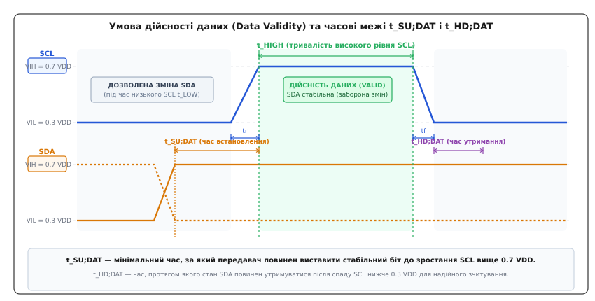
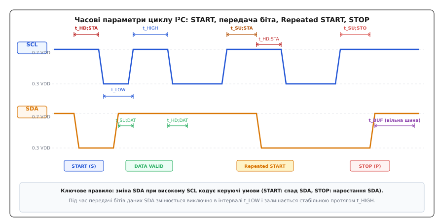
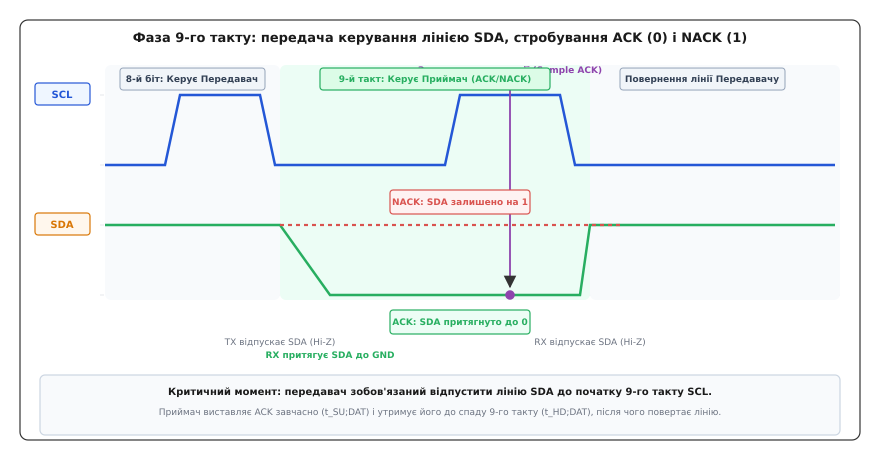
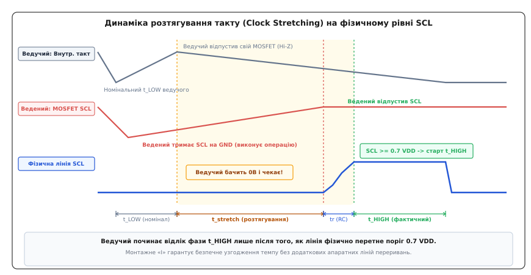
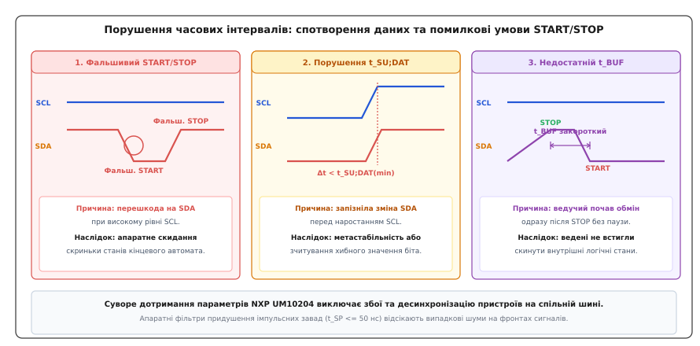

# Часові діаграми I²C: START, STOP, ACK і clock stretching

<preknowlist>
- [Шина I2C](book:communications/i2c-bus) — архітектура з двома лініями SDA і SCL, режим відкритого стоку та резистивна підтяжка.
- [Open-drain](book:electronics/open-drain) — вихідний каскад із відкритим стоком, монтажне «І» та формування логічних рівнів.
- [Транзакція I2C](book:communications/i2c-transaction) — структура сеансу передачі, адресний байт, напрямок R/W та потоки даних.
- [Старт, стоп, ACK](book:communications/start-stop-ack) — логічне призначення керівнийх умов START/STOP та квитування байтів.
</preknowlist>

Головний 32-бітний мікроконтролер опитує прецизійний цифровий гіроскоп або блок контролю акумуляторної батареї по шині I²C на тактовій частоті 400 кГц (режим Fast-mode). На друкованій платі через довгі з'єднувальні провідники, розгалужену топологію та захисні супресорні діоди сумарна паразитна ємність лінії досягає 250 пФ. Якщо розробник встановив стандартні резистори підтяжки номіналом 10 кОм, час заряджання паразитної ємності через таке слабке джерело струму становить понад 2.1 мікросекунди. Оскільки тривалість усього високого півперіоду такту при частоті 400 кГц дорівнює лише 0.6 мікросекунди, напруга на лінії такту SCL фізично не встигає піднятися вище порогу логічної одиниці до моменту, коли мікроконтролер уже починає формувати наступний спадний фронт.

На екрані цифрового осцилографа замість чітких прямокутних імпульсів спостерігається спотворена пилкоподібна хвиля з амплітудою менше 1.5 В при напрузі живлення 3.3 В. Вхідний компаратор веденого датчика не фіксує перетину порогової напруги, пропускає тактові імпульси, спотворює біти адреси в зсувному регістрі та залишає лінію даних у стані логічної одиниці, повертаючи ведучому помилку відмови (NACK). Спроба програмного перезапуску транзакції без витримки нормативного часу звільнення шини призводить до остаточного розсинхрону внутрішніх апаратних автоматів і мертвого зависання обміну.

Коректна робота шини I²C (від англ. *Inter-Integrated Circuit* — міжмікросхемний зв'язок) базується на суворому дотриманні фізичних часових інтервалів, зафіксованих у фундаментальній специфікації NXP UM10204. Кожен фронт сигналу, тривалість імпульсу та пауза між комутаціями підпорядковані законам перехідних процесів у колах із відкритим стоком.

---

### Фізична природа сигналів та порогові рівні напруг

На відміну від послідовних інтерфейсів із симетричними вихідними каскадами Push-Pull (SPI, UART), де обидва логічні рівні формуються низькоомними відкритими транзисторами за лічені наносекунди, шина I²C є принципово асиметричною. Спадний фронт сигналу формується активним відкриванням N-канального польового транзистора (MOSFET), який швидко замикає лінію на землю з низьким внутрішнім опором каналу `R_DS(on) ≈ 10 ... 50 Ом`. Наростаючий фронт є пасивним експоненційним процесом заряду сумарної паразитної ємності монтажу `C_b` через зовнішній резистор підтяжки `R_p`.

Через затягнуті фронти наростання стандарт NXP UM10204 визначає часові інтервали не за точками половинної напруги живлення (50% `V_DD`), а за чіткими пороговими рівнями гарантованого спрацьовування вхідних буферів на основі тригерів Шмітта:
- **`V_IL = 0.3 · V_DD`** (від англ. *Voltage Input Low* — максимальна вхідна напруга гарантованого логічного нуля);
- **`V_IH = 0.7 · V_DD`** (від англ. *Voltage Input High* — мінімальна вхідна напруга гарантованої логічної одиниці);
- **`V_OL = 0.4 В`** (від англ. *Voltage Output Low* — максимальний рівень залишкової напруги на відкритому вихідному транзисторі при номінальному струмі стікання 3 мА);
- **`V_hys = 0.05 · V_DD`** (від грец. *hysteresis* — відставання, запізнення; мінімальний гістерезис вхідного тригера для захисту від брязкоту на пологих фронтах).

Будь-які вимірювання тривалостей фронтів наростання `t_r` та спаду `t_f` проводяться суворо між точками перетину рівнів `0.3 · V_DD` та `0.7 · V_DD`.

---

### Фундаментальне правило дійсності даних (Data Validity)

З електричної асиметрії випливає наріжний закон фізичного рівня шини I²C — **правило дійсності даних** (*Data Validity*):

> **Стан лінії даних SDA повинен залишатися абсолютно стабільним протягом усього часу, поки напруга на тактовій лінії SCL перевищує рівень `0.7 · V_DD` (`t_HIGH`). Будь-яка зміна логічного рівня на лінії SDA дозволена виключно тоді, коли напруга на лінії SCL опустилася нижче рівня `0.3 · V_DD` (`t_LOW`).**


*Часова область дійсності біта: лінія SDA зобов'язана встановитися за інтервал t_SU;DAT до зростання SCL вище 0.7 V_DD і зберігати незмінний стан протягом усієї фази t_HIGH.*

Якщо передавач змінює стан лінії даних під час високого рівня SCL, приймач сприймає цю подію не як передачу інформаційного біта, а як спеціальний керівний сигнальний символ (умову START або STOP), що призводить до негайного аварійного перезапуску або передчасного завершення сеансу обміну.

Кожен такт передачі біта даних розбивається на два функціональні інтервали та два захисні часові запаси:

#### 1. Інтервал низького рівня такту (`t_LOW`)
Фаза активної комутації. Передавач (ведучий під час запису або ведений під час читання) вмикає чи вимикає свій вихідний транзистор, виставляючи черговий біт на лінію SDA. Тривалість `t_LOW` завжди проєктується довшою за `t_HIGH` (наприклад, 1.3 мкс проти 0.6 мкс у Fast-mode), оскільки вона повинна вмістити повний час затримки поширення в кремнії веденого та час перезаряджання ємності лінії даних.

#### 2. Час встановлення даних (`t_SU;DAT`, від англ. *Set-up Time Data*)
Часовий проміжок між моментом, коли напруга на лінії SDA остаточно перетнула поріг `0.7 · V_DD` (для одиниці) чи `0.3 · V_DD` (для нуля), і моментом, коли лінія SCL починає зростати вище `0.7 · V_DD`. Передавач зобов'язаний стабілізувати біт заздалегідь, щоб вхідні ємності приймача повністю зарядилися, а внутрішній D-тригер встиг зафіксувати стан. Для режиму Fast-mode (400 кГц) мінімальний норматив становить `t_SU;DAT(min) = 100 нс` (у Standard-mode — 250 нс).

#### 3. Інтервал високого рівня такту (`t_HIGH`)
Фаза стробування (вибірки). Приймач зчитує стабільний стан лінії SDA на вхідному тригері. Тривалість високого рівня повинна бути достатньою для подолання затримок аналогових фільтрів захисту від завад (`t_HIGH(min) = 0.6 мкс` для 400 кГц).

#### 4. Час утримання даних (`t_HD;DAT`, від англ. *Hold Time Data*)
Інтервал часу після спаду лінії SCL нижче `0.3 · V_DD`, протягом якого передавач не має права змінювати стан лінії SDA. За стандартом мінімальне значення формально дорівнює `0 нс`, проте апаратний контролер зобов'язаний забезпечувати внутрішню затримку комутації щонайменше 300 нс для запобігання гонкам сигналів при неідеальному спадному фронті SCL.

Детальний математичний апарат розрахунку експоненційного заряду ємності шини та формули часових запасів встановлення розібрано у вставці [розрахунок часових запасів та RC-затримок](book:communications/i2c-bus-timing/math-timing-margins.md).

---

### Керуючі умови START, Repeated START і STOP

Оскільки шина I²C не має окремих ліній вибору кристала (як лінія `CS` у SPI) чи синхронізації фреймів, межі кожної транзакції позначаються спеціальними апаратними подіями, які формуються на тих самих двох лініях SDA та SCL.

Ці події навмисно порушують правило дійсності даних: комутація лінії SDA здійснюється **при високому логічному рівні напруги на лінії SCL**.


*Повний сигнальний цикл транзакції: формування умови START, передача інформаційного біта, маневр Repeated START для зміни напрямку без звільнення шини, умова STOP та захисний інтервал t_BUF.*

#### 1. Умова START (S)
У стані спокою обидві лінії шини утримуються резисторами підтяжки на високому рівні напруги (`V_DD`). Для початку транзакції ведучий пристрій формує **спадний фронт на лінії SDA при збереженні високого рівня напруги на лінії SCL**:

```
SDA: HIGH -> LOW  (при SCL = HIGH)
```

Цей перепад напруги розпізнається всіма підключеними до шини веденими пристроями через апаратні детектори фронту. З моменту фіксації умови START усі вузли переходять зі сплячого режиму в активний стан прийому адреси, а шина вважається зайнятою (*Bus Busy*).

Параметр **`t_HD;STA`** (*Hold Time for START Condition*) визначає мінімальний час, протягом якого лінія SCL повинна залишатися високою після спаду SDA. Якщо ведучий опустить SCL занадто рано (`t < t_HD;STA`), ведені вузли не встигнуть збудити внутрішні кінцеві автомати. У режимі Standard-mode `t_HD;STA(min) = 4.0 мкс`, у Fast-mode — `0.6 мкс`.

#### 2. Умова Repeated START (Sr)
Якщо ведучому необхідно виконати комбіновану транзакцію запису покажчика регістра з наступним негайним читанням даних датчика, відпускання шини формуванням сигналу STOP є небажаним: інший ведучий у багатомайстровій системі може перехопити шину між транзакціями.

Для збереження монопольного контролю ведучий генерує умову **повторного старту** (*Repeated START*, позначається як `Sr`). Ведучий не відпускає лінію SCL у вільний стан, а піднімає SCL до високого рівня, забезпечує високий рівень SDA, після чого знову притягує SDA до землі.

Параметр **`t_SU;STA`** (*Set-up Time for Repeated START*) визначає мінімальний час від наростання SCL вище `0.7 · V_DD` до спадного фронту SDA. Він гарантує, що лінія такту повністю стабілізувалася на високому рівні перед генерацією нового стартового перепаду (`t_SU;STA(min) = 0.6 мкс` для 400 кГц).

#### 3. Умова STOP (P)
Для завершення сеансу обміну та переведення шини у вільний стан ведучий формує **наростаючий фронт на лінії SDA при високому рівні напруги на лінії SCL**:

```
SDA: LOW -> HIGH  (при SCL = HIGH)
```

Параметр **`t_SU;STO`** (*Set-up Time for STOP Condition*) визначає мінімальний час між наростанням лінії SCL вище `0.7 · V_DD` та наступним наростанням лінії SDA вище `0.3 · V_DD`. Якщо SDA підніметься завчасно, ведені пристрої сприймуть це наростання як біт логічної одиниці, а не як команду завершення кадру (`t_SU;STO(min) = 0.6 мкс` для 400 кГц).

#### 4. Вільний час шини (`t_BUF`)
Після генерації умови STOP обидва виводи повертаються до високого рівня `V_DD`. Ведучий не має права негайно генерувати наступну умову START: специфікація вимагає обов'язкової витримки захисного інтервалу **`t_BUF`** (*Bus Free Time between STOP and START*).

Цей інтервал необхідний для того, щоб:
- Повністю зарядити паразитні ємності друкованої плати до напруги живлення;
- Завершити роботу внутрішніх логічних автоматів ведених чіпів і скинути адресні регістри;
- Дозволити аналоговим фільтрам виводів повернутися у вихідний стан спокою.

Для стандартного режиму `t_BUF(min) = 4.7 мкс`, для Fast-mode — `1.3 мкс`. Повне зведення параметрів для всіх режимів наведено у вставці [специфікація часових параметрів NXP UM10204](book:communications/i2c-bus-timing/api-um10204-timings.md).

---

### Фаза 9-го такту: динаміка передачі керування та квитування ACK/NACK

Кожен переданий по шині I²C байт складається з 8 інформаційних бітів даних та обов'язкового 9-го такту підтвердження — квитанції **ACK** (*Acknowledge*, від англ. *to acknowledge* — підтверджувати, визнавати) або відмови **NACK** (*Not Acknowledge*).

Фаза 9-го такту є критичною з точки зору часової узгодженості, оскільки на ній відбувається динамічна передача права керування лінією SDA (*Bus Turnaround*) між двома фізично різними мікросхемами.


*Динаміка 9-го такту: передавач відпускає лінію SDA у стан Hi-Z на спаді 8-го такту, після чого приймач притягує лінію до нуля для генерації квитанції ACK.*

Розглянемо покрокову часову послідовність на прикладі передачі байта від ведучого до веденого (режим запису):

1. **Завершення 8-го біта даних:** Ведучий передав 8-й біт і сформував спадний фронт на лінії SCL (перехід нижче `0.3 · V_DD`).
2. **Звільнення лінії передавачем (Release to Hi-Z):** Під час інтервалу `t_LOW` ведучий закриває свій вихідний транзистор на лінії SDA, переводячи вивід у стан високого імпедансу. Лінія SDA під дією підтягувального резистора намагається піднятися до `V_DD`.
3. **Захоплення лінії приймачем (Drive ACK):** Ведений пристрій, успішно прийнявши 8 бітів і перевіривши збіг адреси чи контрольної суми, відкриває свій власний вихідний транзистор і примусово притягує лінію SDA до нуля (`SDA = 0` для ACK).
4. **Витримка часу встановлення квитанції (`t_SU;DAT`):** Ведений зобов'язаний встановити низький рівень на лінії SDA заздалегідь — щонайменше за час `t_SU;DAT` до того, як ведучий згенерує наростаючий фронт 9-го такту SCL.
5. **Стробування квитанції ведучим:** Ведучий піднімає SCL вище `0.7 · V_DD` і витримує інтервал `t_HIGH`. У цей момент ведучий зчитує стан лінії через свій вхідний буфер:
   - Якщо `SDA == 0` — зафіксовано **ACK** (ведений готовий приймати наступні байти);
   - Якщо `SDA == 1` — зафіксовано **NACK** (ведений зайнятий, не розпізнав адресу або буфер переповнено).
6. **Повернення лінії передавачу:** Після спаду 9-го тактового імпульсу SCL ведений закриває свій транзистор і відпускає лінію SDA, повертаючи монопольне право керування ведучому пристрою.

Якщо ведений пристрій через затримки внутрішньої прошивки не встигає опустити лінію SDA до початку наростання 9-го такту, ведучий зчитує на лінії одиницю і помилково фіксує стан NACK, перериваючи транзакцію.

---

### Динаміка розтягування такту (Clock Stretching) на фізичному рівні SCL

Шина I²C об'єднує пристрої з принципово різною швидкодією: 32-бітний процесор із тактовою частотою ядра 480 МГц та 8-бітний мікроконтролер датчика, якому для обробки чергового байта чи запуску аналого-цифрового перетворення потрібно 20–50 мікросекунд.

Якщо ведений не встигає підготувати наступний байт або вичитати прийняті дані з буфера `RXDR`, він використовує апаратний механізм **розтягування такту** (*clock stretching*).


*Фізичний механізм розтягування такту: ведучий завершив номінальний інтервал t_LOW і відпустив свій ключ, проте відкритий MOSFET веденого блокує наростання SCL, переводячи ведучого в стан апаратного очікування.*

Цей механізм працює завдяки властивості **монтажного «І»** (*Wired-AND*) на тактовій лінії SCL:

1. На спадному фронті такту (найчастіше після 8-го біта адреси або даних) ведучий притягує лінію SCL до нуля на стандартний інтервал `t_LOW_nominal` (наприклад, 1.3 мкс).
2. Одночасно ведений пристрій вмикає свій власний польовий транзистор на лінії SCL, дублюючи замикання лінії на землю.
3. Коли внутрішній таймер ведучого відраховує 1.3 мкс, ведучий закриває свій польовий транзистор, намагаючись дозволити лінії піднятися до `V_DD`.
4. Проте лінія SCL залишається на нулі (`0.1 ... 0.2 В`), оскільки транзистор веденого залишається відкритим.
5. Ведучий контролює реальний стан лінії через власний вхідний тригер Шмітта. Зафіксувавши логічний нуль (`V_SCL < 0.3 · V_DD`), ведучий зупиняє свій внутрішній лічильник часу і переходить у стан апаратного очікування (*Wait State*).
6. Щойно ведений завершує внутрішні операції, він вимикає свій транзистор.
7. Резистор підтяжки `R_p` починає заряджати ємність шини, формуючи експоненційний фронт наростання `t_r`.
8. Коли напруга на лінії SCL фізично перетинає поріг `0.7 · V_DD`, ведучий фіксує логічну одиницю і **тільки з цієї миті запускає відлік інтервалу високого рівня `t_HIGH`**.

Таким чином, розтягування такту подовжує виключно фазу низького рівня `t_LOW`, тоді як фаза високого рівня `t_HIGH` завжди зберігає свою повну нормативну тривалість.

Історію винаходу цього механізму в лабораторіях Philips описано у вставці [історія синхронізації та розтягування такту](book:communications/i2c-bus-timing/hist-clock-sync.md), а практичну програмну реалізацію опитування тактової лінії розібрано у вставці [програмна реалізація точного таймінгу](book:communications/i2c-bus-timing/proj-bitbang-timing.md).

---

### Синхронізація такту при багатомайстровій роботі (Clock Synchronization)

У системах із кількома ведучими (*Multi-Master Architecture*) властивість монтажного «І» на лінії SCL виконує функцію апаратного фазового автопідстроювання тактових генераторів усіх ведучих, які одночасно розпочали передачу:

1. **Синхронізація низького рівня:** Щойно перший (найшвидший) ведучий притягує SCL до нуля, лінія миттєво падає. Усі інші ведучі, зафіксувавши спад, негайно скидають свої лічильники `t_LOW` і починають відлік низького півперіоду заново. Тривалість низького рівня на шині визначається **найповільнішим** ведучим (тим, у якого налаштований найдовший `t_LOW`).
2. **Синхронізація високого рівня:** Коли найповільніший ведучий нарешті відпускає SCL, лінія починає наростати. Перший ведучий, у якого завершується інтервал `t_HIGH`, знову притягує лінію SCL до нуля. Таким чином, тривалість високого рівня визначається **найшвидшим** ведучим (тим, у якого налаштований найкоротший `t_HIGH`).

Результатом є єдиний результуючий тактовий сигнал, у якому низький рівень визначається найповільнішим учасником, а високий — найшвидшим.

---

### Динаміка колізій та втрата арбітражу на лінії SDA

Одночасно з синхронізацією такту виконується процедура арбітражу на лінії SDA. Оскільки лінія даних також побудована за схемою монтажного «І», нуль переважає одиницю:

1. Нехай два ведучих `M1` та `M2` одночасно згенерували умову START і передають адресний байт. Ведучий `M1` звертається до адреси `0x50` (`01010000_b`), а ведучий `M2` — до адреси `0x54` (`01010100_b`).
2. Біти 7, 6, 5, 4 та 3 в обох адресах збігаються (`0, 1, 0, 1, 0`). Обидва ведучі виставляють однакові рівні напруги і не помічають присутності конкурента.
3. На 2-му біті ведучий `M1` хоче передати логічний нуль і відкриває свій транзистор (`SDA = LOW`), а ведучий `M2` хоче передати логічну одиницю і закриває свій транзистор (переводить у Hi-Z).
4. Фізична лінія SDA залишається на нулі через відкритий транзистор `M1`.
5. Під час фази `t_HIGH` ведучий `M2` зчитує реальний стан лінії SDA через власний вхідний буфер і виявляє нуль замість очікуваної одиниці.
6. Ведучий `M2` негайно фіксує **втрату арбітражу** (*Arbitration Lost*), негайно вимикає свій вихідний каскад SDA і переходить у пасивний режим прослуховування шини до наступної умови STOP. Ведучий `M1` продовжує транзакцію без найменшої затримки чи спотворення інформації.

---

### Простеження часових діаграм у Linux: `i2c-tools`, `ftrace` та `sysfs`

В операційній системі Linux взаємодія з шиною I²C реалізується через підсистему ядра `i2c-core` та драйвери конкретних апаратних контролерів (наприклад, `i2c-designware-platform`, `i2c-bcm2835`, `i2c-imx`). Для інженерного аналізу таймінгів та діагностики затримок ядро надає спеціалізовані інтерфейси трасування.

#### 1. Трасування подій через `ftrace`
Ядро Linux містить вбудовані статичні точки трасування (*Tracepoints*) підсистеми I²C, розташовані в `/sys/kernel/debug/tracing/events/i2c/`:
- `i2c_write` та `i2c_read` — фіксують точний час початку транзакції, адресу веденого та довжину буфера;
- `i2c_reply` — фіксує прийняті байти;
- `i2c_result` — фіксує завершення обміну та статус виконання (`0` — успіх, `-ETIMEDOUT` — зависання при розтягуванні такту, `-ENXIO` — отримано NACK на адресний байт).

Увімкнення трасування з позначками часу наносекундної точності:

```
echo 1 > /sys/kernel/debug/tracing/events/i2c/enable
cat /sys/kernel/debug/tracing/trace_pipe
```

#### 2. Апаратне скидання шини через механізм Generic Recovery
Якщо ведений пристрій зависає в стані утримання SDA на нулі, драйвер адаптера в Linux ініціює процедуру `i2c_recover_bus()`, яка автоматично перемикає виводи контролера в режим GPIO Bit-Banging, генерує 9 тактів SCL і повертає контролер в апаратний режим.

---

### Трасування друкованої плати, трансляція рівнів та апаратні буфери

Для забезпечення розрахункових часових інтервалів на реальній друкованій платі розробник повинен дотримуватися правил високочастотної топології:

1. **Контроль погонної ємності:** Стандартна мікросмужкова лінія на текстоліті FR-4 (товщина діелектрика `h = 0.2 мм`, ширина провідника `w = 0.25 мм`) має погонну ємність близько `1.0 ... 1.2 пФ/см`. Траса довжиною 30 см додає до шини близько 35 пФ чистої ємності монтажу.
2. **Захист від перехресних завад (Cross-Talk):** Лінії SDA та SCL ніколи не повинні прокладатися впритул одна до одної на великій довжині. Відстань між краями провідників повинна становити щонайменше три ширини провідника (`S ≥ 3 · W`), або між ними має бути прокладена земляна захисна доріжка (*Ground Guard Trace*).
3. **Розміщення резисторів підтяжки:** Резистори `R_p` повинні встановлюватися якомога ближче до геометричного центру шини або безпосередньо біля ведучого пристрою, щоб мінімізувати асиметрію фронтів між різними відгалуженнями плати.
4. **Двонаправлені перетворювачі рівнів (Level Shifters):** Коли ведучий працює при напрузі 3.3 В, а датчик вимагає 1.8 В або 5.0 В, застосовуються спеціалізовані схеми трансляції на базі польових транзисторів (наприклад, NXP PCA9306 або дискретний транзистор BSS138). Власний опір відкритого каналу транзистора перетворювача `R_ON ≈ 5 ... 10 Ом` включається послідовно в лінію, дещо збільшуючи напругу `V_OL`, а паразитна ємність затвора додається до ємності шини з обох боків ізолятора.
5. **Буферизація та прискорювачі фронтів:** Якщо сумарна ємність шини перевищує нормативні 400 пФ (наприклад, у масивних об'єднувальних платах систем зв'язку), застосовуються спеціалізовані апаратні буфери (чипи NXP PCA9515A або PCA9600) або динамічні прискорювачі наростання (*Rise-Time Accelerators*, такі як Analog Devices LTC4311), які короткочасно підключають низькоомне джерело струму при фіксації наростаючого перепаду напруги.

---

### Порушення часових інтервалів та методи захисту шини

Недотримання часових параметрів викликає характерні апаратні збої, які складно діагностувати звичайними засобами налагодження прошивки без підключення цифрового логічного аналізатора.


*Три типові аварійні сценарії: фальшивий START через шум на лінії, збій встановлення даних t_SU;DAT та колізія через недостатній вільний час шини t_BUF.*

#### 1. Фальшиві умови START/STOP через високочастотні завади
Якщо лінія SDA прокладена поруч із силовими ШІМ-трасами двигунів або імпульсними перетворювачами напруги, електромагнітна наводка може викликати короткочасний спад напруги на SDA під час високого рівня SCL.
- **Наслідок:** Вхідні логічні автомати ведених мікросхем розпізнають такий сплеск як умову START і скидають поточний стан прийому даних.
- **Апаратний захист:** Специфікація UM10204 вимагає встановлення на всіх входах I²C аналогових інтегруючих фільтрів сплесків (**`t_SP`**, від англ. *Spike Suppression*). Фільтр повністю ігнорує будь-які імпульси тривалістю менше `50 нс`.

#### 2. Порушення часу встановлення (`t_SU;DAT Violation`)
Якщо ведучий чи ведений формує перепад напруги на лінії SDA занадто пізно (наприклад, за 20 нс до наростання SCL при нормативі 100 нс):
- **Наслідок:** Вхідний тригер приймача отримує сигнал у момент внутрішньої комутації, що викликає явище **метастабільності** (*Metastability*) — вихідний рівень тригера зависає в невизначеному стані на десятки наносекунд, після чого випадково переходить або в 0, або в 1, спотворюючи переданий біт.

#### 3. Недостатній час звільнення шини (`t_BUF Violation`)
Якщо ведучий після відправки STOP негайно починає наступний обмін без витримки паузи `t_BUF`:
- **Наслідок:** Ведені пристрої не встигають завершити цикл внутрішнього скидання регістрів. Перший байт адреси нової транзакції втрачається, а ведений повертає NACK або взагалі перестає реагувати на шину.

---

> 🔧 **Навіщо це.** Під час проєктування апаратури з шиною I²C дотримуйтеся трьох золотих інженерних правил:
> 1. **Завжди розраховуйте резистори підтяжки під реальну ємність:** Для режиму 400 кГц стандартний резистор 4.7 кОм забезпечує круті фронти лише при ємності до 75 пФ. Якщо на шині висить понад 3 датчики чи довгий шлейф (150–200 пФ), зменшуйте опір підтяжки до `1.5 ... 2.2 кОм`.
> 2. **Контролюйте таймаути розтягування такту в прошивці:** Якщо ведений пристрій завис і не відпускає лінію SCL, безконтрольний цикл очікування заблокує весь мікроконтролер. Програмний стек зобов'язаний мати жорсткий таймаут (наприклад, 10–25 мс) із наступною процедурою відновлення шини (*Clock-Toggle Recovery* — генерація 9 імпульсів SCL при відпущеній SDA).
> 3. **Перевіряйте часові діаграми осцилографом:** Під час запуску першої ревізії друкованої плати виміряйте час наростання `t_r` між рівнями `0.3 · V_DD` та `0.7 · V_DD`. Якщо `t_r > 300 нс` для 400 кГц — шина працює в зоні підвищеного ризику збоїв.
