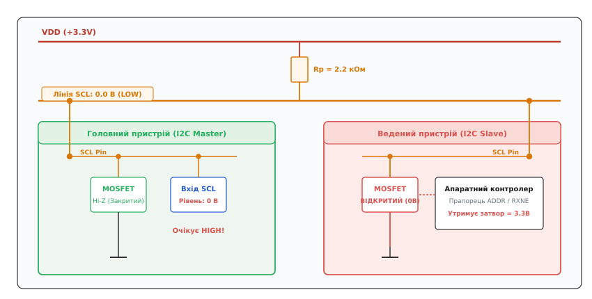
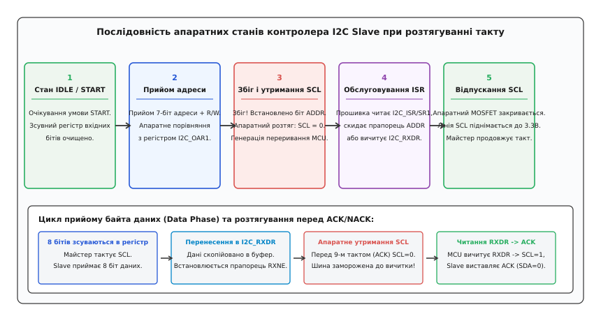
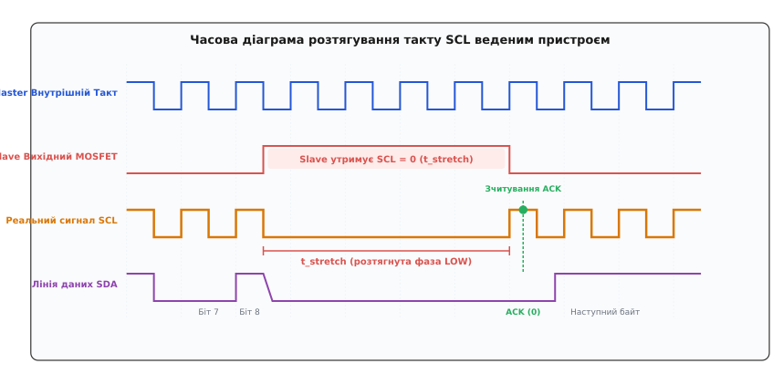
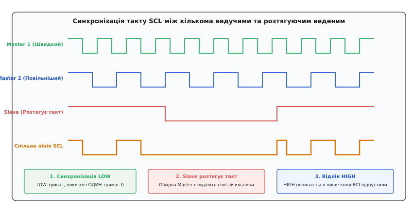
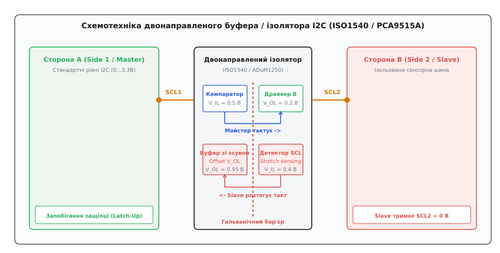

# Розтягування такту I2C

<preknowlist>
- [Шина I2C](topic:communications/i2c-bus) — фізичний рівень шини, лінії SDA та SCL, резисторна підтяжка до напруги живлення.
- [Open-drain](topic:electronics/open-drain) — вихідний каскад із відкритим стоком, активне притягування до нуля та пасивне формування одиниці.
- [Старт, стоп, ACK](topic:communications/start-stop-ack) — формування умов START і STOP, 9-бітний цикл передачі байта та стробування квитанції ACK/NACK.
- [Багатомайстровий I2C](topic:communications/i2c-multimaster) — синхронізація тактового сигналу SCL за правилом монтажного «І» та арбітраж шини.
</preknowlist>

Головний 32-бітний мікроконтролер опитує ведений смарт-датчик температури або плату контролю акумуляторної батареї по шині I2C у швидкому режимі Fast-Mode на частоті 400 кГц. Кожен тактовий імпульс шини триває рівно 2.5 мікросекунди. Проте веденому чіпу для внутрішнього аналого-цифрового перетворення, розрахунку контрольної суми CRC чи запису сторінки у власну енергонезалежну пам'ять EEPROM потрібно 30 мікросекунд. Якби тактова лінія працювала за жорстким двотактним принципом (як у шині SPI, де тактовий генератор ведучого безперервно проштовхує біти незалежно від готовності веденого), буфер приймача веденого переповнився б, а ведучий зчитав би спотворені або застарілі байти.

Для запобігання втраті даних у протоколі I2C передбачено механізм зворотного апаратного регулювання швидкості. Оскільки тактова лінія SCL побудована за схемотехнікою відкритого стоку зі спільною резистивною підтяжкою, ведений пристрій має фізичну можливість увімкнути власний вихідний польовий транзистор і примусово притягнути лінію SCL до нуля, утримуючи її на рівні землі навіть тоді, коли ведучий уже готовий згенерувати наступний тактовий імпульс.

Цей механізм примусового подовження фази низького рівня тактового сигналу веденим пристроєм отримав назву **розтягування такту** (*clock stretching*, від англ. *to stretch* — розтягувати, подовжувати). Він перетворює однонаправлену лінію тактування на двонаправлений канал координації темпу обміну, гарантуючи, що жоден біт не буде переданий або зчитаний раніше, ніж ведений вузол повністю завершить внутрішні операції.

---

### Схемотехніка лінії SCL та фізика монтажного «І»

У більшості послідовних синхронних інтерфейсів (SPI, I2S, QSPI) вивід тактового сигналу є виключно однонаправленим виходом ведучого пристрою з двотактним (*Push-Pull*) вихідним каскадом. У шині I2C обидва виводи — лінія даних SDA та тактова лінія SCL — є двонаправленими каскадами з **відкритим стоком** (*Open-Drain*) або відкритим колектором (*Open-Collector*).


*Схемотехнічна модель лінії SCL: ведучий відпустив вихідний MOSFET у стан Hi-Z, проте відкритий MOSFET веденого утримує лінію на нульовому рівні.*

Фізичний стан напруги на лінії SCL формується за правилом **монтажного «І»** (*Wired-AND*). Жоден вузол на шині не має апаратного верхнього транзистора (P-канального MOSFET), з'єднаного з лінією живлення `V_DD`. Високий логічний рівень напруги формується виключно зовнішнім резистором підтяжки `R_p`. Щоб на лінії SCL встановилася напруга логічної одиниці (`3.3 В`), **усі без винятку** пристрої, підключені до шини, повинні одночасно закрити свої внутрішні N-канальні польові транзистори, перевівши виводи у стан високого імпедансу (Hi-Z).

Якщо хоча б один вузол (ведучий чи ведений) відкриває свій транзистор, струм від джерела живлення через резистор `R_p` стікає на землю `GND`, і напруга на всій фізичній лінії падає до залишкової напруги відкритого каналу:

```
V_SCL = I_pullup · R_DS(on) ≈ 0.1 ... 0.2 В
```

Ведучий пристрій, керуючи лінією SCL, не просто виставляє логічні стани на виході, а постійно зчитує фактичний рівень напруги на виводі через власний внутрішній вхідний буфер (тригер Шмітта). Коли внутрішній таймер ведучого завершує формування низького півперіоду `T_LOW` і закриває свій польовий транзистор, ведучий не переходить автоматично до відліку фази `T_HIGH`. Він опитує стан вхідного буфера:
- Якщо на вході фіксується логічна одиниця (`V_SCL ≥ 0.7 · V_DD`), це означає, що ведені пристрої не блокують лінію. Ведучий запускає апаратний таймер тривалості високого рівня `T_HIGH`.
- Якщо на вході фіксується логічний нуль (`V_SCL < 0.3 · V_DD`), ведучий розпізнає, що ведений утримує лінію, зупиняє свій внутрішній лічильник і переходить у стан апаратного очікування, доки напруга на лінії фізично не підніметься до високого рівня.

Така схемотехнічна асиметрія забезпечує повну електричну безпеку: одночасне увімкнення вихідних ключів ведучого та веденого не викликає короткого замикання джерела живлення на землю, а природно об'єднує їхні вимоги до тривалості низького рівня.

---

### Апаратний кінцевий автомат веденого контролера (I2C Slave)

Розтягування такту в сучасних мікроконтролерах (наприклад, лінійках STM32, NXP LPC, ESP32, Microchip PIC) реалізується на рівні кремнієвого кінцевого автомата апаратного блоку I2C. Прошивка мікроконтролера-веденого взаємодіє з шиною через статусний регістр переривань `I2C_ISR` / `I2C_SR1` та регістри буферів даних `I2C_RXDR` / `I2C_TXDR`.


*Послідовність апаратних станів контролера I2C Slave: автоматичне утримання SCL після адресного збігу та при заповненні вхідного буфера даних.*

Розглянемо покрокову зміну станів апаратного автомата під час типових фаз транзакції обміну.

#### 1. Фаза прийому адреси (Address Match Phase)
1. Ведучий генерує умову START і починає тактувати лінію SCL, виставляючи 7 бітів адреси веденого та біт напрямку R/W (разом 8 бітів).
2. Апаратний зсувний регістр веденого приймає біти з лінії SDA на кожному наростаючому фронті SCL.
3. Після надходження 8-го біта внутрішній апаратний компаратор веденого порівнює прийняте значення з власною адресою, записаною в регістрі `I2C_OAR1` (*Own Address Register 1*).
4. **Збіг адреси:** Якщо адреса збіглася, апаратний блок веденого формує спадний фронт на лінії SCL (закінчення 8-го такту), виставляє біт квитанції ACK (`SDA = 0`) і **автоматично відкриває свій польовий транзистор на лінії SCL**, блокуючи лінію в нулі.
5. Одночасно в статусному регістрі виставляється прапорець збігу адреси `ADDR = 1`, і контролер I2C генерує апаратне переривання ядра мікроконтролера.
6. **Розтягування перед 9-м тактом:** Ведучий закінчив 8-й такт і намагається підняти SCL для тактування біта ACK, проте ведений тримає лінію на землі. Шина заморожується.
7. Прошивка мікроконтролера входить в обробник переривання I2C ISR, перевіряє статусний регістр і очищає прапорець `ADDR` (в архітектурі STM32 це виконується читанням `I2C_SR1` з наступним читанням `I2C_SR2`, або записом біта `ADDRCF` в `I2C_ICR`).
8. Тільки після того, як прошивка підтвердила обробку адреси, апаратний контролер закриває свій транзистор на SCL. Лінія піднімається до 3.3 В, і ведучий успішно стробує біт підтвердження ACK.

#### 2. Фаза прийому даних (Slave Receiver / I2C Write)
Коли ведучий передає байти даних у ведений пристрій:
1. Ведучий тактує 8 бітів даних. Вхідний зсувний регістр веденого накопичує байт.
2. Після надходження 8-го біта байт автоматично копіюється зі зсувного регістра у внутрішній тіньовий буфер прийому даних `I2C_RXDR`, і встановлюється прапорець `RXNE = 1` (*Receive Data Register Not Empty*).
3. Якщо прошивка мікроконтролера була зайнята іншим високорівневим перериванням і **не встигла вичитати попередній байт** із регістра `I2C_RXDR`, виникає загроза перезапису даних (*Overrun*).
4. Щоб запобігти втраті байта, апаратний контролер веденого автоматично притягує лінію SCL до нуля одразу після спаду 8-го такту.
5. Ведучий чекає. Прошивка веденого заходить в ISR, виконує інструкцію зчитування `data = I2C1->RXDR`. Читання регістра апаратно скидає прапорець `RXNE`.
6. Очищення прапорця слугує апаратним тригером: контролер відпускає лінію SCL, виставляє біт ACK на лінії SDA, і ведучий генерує 9-й тактовий імпульс.

#### 3. Фаза передачі даних (Slave Transmitter / I2C Read)
Коли ведучий зчитує дані з веденого мікроконтролера:
1. Ведучий очікує, що ведений виставить перший біт даних на лінію SDA.
2. Якщо регістр передавача `I2C_TXDR` порожній (`TXE = 1` або `TXIS = 1`), а зсувний регістр не завантажений, ведений не має даних для видачі в лінію.
3. Апаратний блок веденого утримує лінію SCL на рівні нуля на початку байта, не даючи ведучому сформувати перший тактовий імпульс.
4. Прошивка веденого записує черговий байт у регістр `I2C1->TXDR = next_byte`.
5. Запис даних апаратно переносить байт у зсувний регістр, закриває транзистор SCL і дозволяє шині піднятися до високого рівня. Ведучий починає стробування бітів.

#### 4. Біт конфігурації `NOSTRETCH`
У контролерах STM32 регістр керування `I2C_CR1` містить спеціальний біт `NOSTRETCH` (*Clock stretching disable*).
- За замовчуванням `NOSTRETCH = 0` (розтягування такту дозволено). Апаратний блок працює за описаним вище надійним алгоритмом.
- Якщо розробник встановлює `NOSTRETCH = 1` (розтягування заборонено): ведений повністю втрачає право притягувати лінію SCL до нуля. Якщо прошивка не встигає вичитати `RXDR` до надходження наступного байта, старі дані затираються, встановлюється прапорець помилки переповнення `OVR = 1` (*Overrun Error*), а ведучому повертається стан NACK. При читанні, якщо `TXDR` не заповнено вчасно, ведений видає в лінію фіксований байт `0xFF` і встановлює прапорець недовантаження `UDR = 1` (*Underrun Error*).

Режим `NOSTRETCH = 1` застосовується виключно тоді, коли ведений пристрій обслуговується високошвидкісним контролером прямого доступу до пам'яті (DMA), де час реакції є строго детермінованим і не перевищує тривалості одного такту шини.

---

### Часова діаграма та форма сигналів на шині

Щоб детально простежити процес затримки, звернемося до часової діаграми на рівні окремих фаз тактового імпульсу.


*Часова діаграма розтягування такту SCL: подовження фази низького рівня веденим пристроєм (t_stretch) перед формуванням біта підтвердження ACK.*

На діаграмі чітко видно різницю між внутрішнім бажаним станом ведучого та реальним фізичним сигналом на шині:

1. Під час передачі бітів даних 7 та 8 ведучий генерує стандартні тактові імпульси із симетричними або квазісиметричними інтервалами `T_HIGH` та `T_LOW`.
2. На спадному фронті 8-го біта ведучий притягує SCL до нуля на стандартний інтервал `T_LOW_nominal` (наприклад, 1.3 мкс для 400 кГц).
3. Ведений пристрій, зафіксувавши заповнення вхідного буфера, відкриває свій польовий транзистор паралельно з ведучим.
4. Коли таймер ведучого закінчує відлік `T_LOW_nominal`, ведучий закриває свій транзистор. Проте лінія SCL не піднімається: відкритий транзистор веденого продовжує утримувати потенціал 0 В на шині.
5. Ведучий фіксує низький рівень через вхідний буфер і заморожує свій кінцевий автомат на весь час `t_stretch`.
6. Щойно прошивка веденого завершує обробку переривання та звільняє буфер `RXDR`, ведений вимикає свій транзистор.
7. Резистор підтяжки `R_p` заряджає паразитну ємність шини `C_b`, і напруга на лінії SCL зростає за експоненційним законом до рівня `V_IH = 0.7 · V_DD`.
8. Зафіксувавши перетин порогу `V_IH`, ведучий запускає таймер фази високого рівня `T_HIGH`. На середині цього інтервалу ведучий стробує стабільний стан лінії SDA, зчитуючи нульовий рівень квитанції ACK.

Детальні математичні виведення зміни частоти шини, розрахунки падіння пропускної здатності та часові обмеження стандартів наведено у вставці [математичний розрахунок деградації пропускної здатності та часових бюджетів SMBus](topic:communications/i2c-clock-stretching/math-timing-throughput.md).

---

### Взаємодія з багатомайстровим арбітражем та синхронізація такту

Механізм розтягування такту базується на тому самому фізичному явищі, що й процедура **синхронізації такту** (*Clock Synchronization*) між кількома ведучими пристроями в багатомайстровій конфігурації шини I2C.


*Синхронізація такту SCL: поєднання тактових генераторів двох ведучих різної швидкості та розтягування такту веденим пристроєм за правилом монтажного «І».*

Коли на шині одночасно починають передачу два ведучих пристрої `Master 1` (швидкий) та `Master 2` (повільний):
1. **Синхронізація фази LOW:** Щойно один із ведучих притягує SCL до нуля, лінія падає в нуль для всіх пристроїв. Ведучі починають відлік власної фази `T_LOW`. Швидкий ведучий закінчує свій інтервал раніше і відпускає лінію, проте повільний ведучий ще тримає свій транзистор відкритим. Швидкий ведучий виявляє низький стан SCL і чекає повільного. Таким чином, **тривалість низького рівня на спільній шині завжди визначається пристроєм із найдовшою фазою LOW**.
2. **Синхронізація фази HIGH:** Лінія SCL переходить у стан 1 лише тоді, коли всі ведучі одночасно відпустили вихідні транзистори. У цей момент усі ведучі одночасно запускають таймери `T_HIGH`. Той ведучий, у якого інтервал `T_HIGH` є найкоротшим, першим закінчує підрахунок і знову тягне SCL до нуля, примушуючи всіх інших ведучих завершити фазу високого рівня. Отже, **тривалість високого рівня на шині завжди визначається найшвидшим ведучим**.

Коли в цей процес втручається ведений пристрій, що розтягує такт, він поводиться з точки зору шини як ще один «надзвичайно повільний ведучий з нескінченною фазою LOW». Усі активні ведучі на шині зупиняють свої лічильники і чекають, доки ведений не зніме блокування.

Якщо розтягування такту виникає під час фази **арбітражу адрес** (коли кілька ведучих передають різні адреси і контролюють лінію SDA), арбітраж тимчасово призупиняється в поточній бітовій позиції. Жоден ведучий не втрачає арбітраж через розтягування такту, оскільки стан лінії SDA у цей період залишається стабільним, а стробування бітів відновлюється лише після повернення SCL у високий рівень.

---

### Темний бік: блокування шини, таймаути та стандарт SMBus

Попри очевидні переваги гнучкого узгодження швидкостей, механізм Clock Stretching несе в собі серйозну системну вразливість: **можливість повного та безповоротного блокування шини** (*Bus Hang / Bus Lockup*).

У класичній специфікації NXP I2C максимальний час розтягування такту веденим пристроєм стандартом **не обмежений**. Якщо мікроконтролер-ведений увійшов у стан блокування (наприклад, потрапив у нескінченний цикл `HardFault_Handler` із заблокованими перериваннями, зазнав просідання живлення Brown-Out або завис у критичній секції, утримуючи затвор вихідного польового транзистора під напругою), тактова лінія SCL залишається притягнутою до землі назавжди.

У такому стані:
- Жоден ведучий не може згенерувати умову START або передати дані іншим, абсолютно справним веденим пристроям на цій самій шині;
- Апаратні контролери I2C провідних процесорів зависають у внутрішніх циклах очікування прапорців готовності (якщо в коді прошивки не передбачено програмних таймаутів);
- Вся підсистема збору телеметрії та керування виходить із ладу.

#### Специфікація SMBus та апаратний таймаут `t_TIMEOUT`
Для вирішення проблеми вічного зависання корпорація Intel спільно з виробниками мікроелектроніки розробила промисловий стандарт **SMBus** (*System Management Bus*). Головною відмінністю фізичного рівня SMBus від базового I2C є введення обов'язкового апаратного таймауту утримання лінії:

```
25 мс ≤ t_TIMEOUT ≤ 35 мс
```

Якщо будь-який вузол шини SMBus фіксує, що лінія SCL утримується в стані логічного нуля довше ніж `35 мс`, апаратний блок інтерфейсу автоматично виконує аварійний скид:
1. Вихідний польовий транзистор веденого примусово закривається апаратною логікою сторожового таймера;
2. Внутрішній кінцевий автомат повертається в початковий стан очікування `IDLE`;
3. Лінія SCL піднімається до 3.3 В завдяки резистору `R_p`, і працездатність шини повністю відновлюється.

Крім того, специфікація SMBus обмежує кумулятивний (накопичувальний) час розтягування такту в межах однієї транзакції:
- `t_LOW:SEXT ≤ 25 мс` — максимальний сумарний час розтягування веденим пристроєм від умови START до умови STOP;
- `t_LOW:MEXT ≤ 10 мс` — максимальний сумарний додатковий час утримання лінії низькою ведучим пристроєм.

> 🔧 **Навіщо це в реальній розробці:** Під час проектування медичних приладів, автомобільних блоків керування (ECU) та серверних материнських плат (шина IPMI) використання мікросхем із підтримкою таймаутів SMBus є обов'язковою вимогою стандартів надійності, що унеможливлює зависання критичних систем через відмову другорядного сенсора.

---

### Апаратний дефект процесорів Raspberry Pi (Broadcom BCM2835)

Яскравим прикладом складності апаратної реалізації розтягування такту є знаменитий кремнієвий баг однокристальної системи Broadcom BCM2835, на базі якої побудовані мільйони одноплатних комп'ютерів Raspberry Pi (покоління 1, 2, Zero, Zero W).

Апаратний контролер I2C BSC (*Broadcom Serial Controller*), інтегрований у кристал BCM2835, має дефект у кінцевому автоматі вибірки даних:
1. Коли ведений пристрій розтягує такт під час формування повторного старту (*Repeated START*) або на 9-му такті квитанції ACK, апаратний блок BCM2835 зупиняє тактовий генератор SCL, проте **лінія даних SDA продовжує змінюватися внутрішнім автоматом ведучого за власною фіксованою часовою сіткою**!
2. Ведучий змінював рівень SDA або зчитував стан лінії у фіксований момент часу, не чекаючи реального наростання напруги на виводі SCL.
3. Це викликало систематичне пошкодження першого байта даних при роботі з мікросхемами, які вимагають розтягування такту (датчики вологості Sensirion SHT31, датчики газу BME680, годинники реального часу DS3231).

Для вирішення цієї апаратної помилки в системі Raspbian/Raspberry Pi OS було створено програмний драйвер ядра `i2c-gpio`, який переводить керування шиною в режим програмної емуляції (*Bit-Banging*) на будь-яких виводах GPIO, де опитування стану SCL контролюється програмним лічильником ядра з повною підтримкою розтягування такту.

---

### Програмна емуляція (Bit-Banging GPIO Master)

При створенні програмного драйвера I2C Master на базі звичайних виводів GPIO мікроконтролера обов'язковою умовою є перевірка стану лінії SCL після кожного відпускання виводу.

Правильний алгоритм перемикання тактової лінії вимагає організації циклу опитування з контролем апаратного таймауту:

:::tabs
```c
// Коректне переведення SCL у високий рівень з контролем розтягування такту в C
bool i2c_soft_scl_release_and_wait(uint32_t timeout_us) {
    // 1. Відпускаємо лінію в стан Hi-Z (зовнішній резистор підтягує лінію до 3.3В)
    gpio_set_pin_hiz(SCL_PIN);
    
    uint32_t start_time = timer_get_micros();
    
    // 2. Опитуємо реальний стан фізичного виводу через вхідний буфер IDR
    while (gpio_read_pin(SCL_PIN) == 0) {
        // Ведений утримує SCL в нулі (розтягує такт)
        if ((timer_get_micros() - start_time) >= timeout_us) {
            // Ведений перевищив допустимий ліміт часу: фіксуємо аварію шини
            return false; // Помилка таймауту SCL
        }
    }
    
    // 3. Лінія SCL успішно піднялася до 3.3В — продовжуємо такт
    return true;
}
```
```cpp
// Переведення SCL у високий рівень з таймаутом у C++
template <typename Gpio, typename Timer>
bool i2c_soft_scl_release_and_wait(Gpio& scl_pin, Timer& timer, uint32_t timeout_us) {
    scl_pin.set_high_z();
    const uint32_t start = timer.get_micros();

    while (!scl_pin.read()) {
        if ((timer.get_micros() - start) >= timeout_us) {
            return false; // Таймаут шини
        }
    }
    return true;
}
```
:::

Якщо ведений пристрій зависає під час сеансу читання, утримуючи лінію даних SDA в нулі, програмний ведучий зобов'язаний виконати нормативну процедуру аварійного очищення шини: подати до 9 імпульсів на лінію SCL, доки ведений не просуне зсувний регістр і не відпустить SDA, після чого сформувати примусову умову STOP.

Повний вихідний код промислового драйвера на мовах C та C++ із функціями відновлення шини та захистом від зависання наведено у вставці [програмна емуляція I2C Master з підтримкою Clock Stretching та захистом від зависання](topic:communications/i2c-clock-stretching/proj-bitbang-master.md).

---

### Трасування, спостережуваність та налагодження в ядрі Linux

Під час діагностики складних збоїв обміну в операційних системах Linux наявність або відсутність Clock Stretching часто стає причиною випадкових затримок у потоках введення-виведення. Для аналізу поведінки драйверів застосовується вбудована підсистема трасування ядра `ftrace` та утиліта `trace-cmd`.

Увімкнення трасування подій підсистеми I2C дозволяє фіксувати точний час виконання кожної операції передачі та виявляти аномальні затримки:

```bash
# Увімкнення трасування подій I2C у Linux
echo 1 > /sys/kernel/debug/tracing/events/i2c/enable
cat /sys/kernel/debug/tracing/trace_pipe
```

Вивід трасувальника містить часові мітки початку та завершення транзакцій:

```text
i2c_write: i2c-1 #0 a=044 f=0000 l=2 [2c-06]
i2c_read:  i2c-1 #1 a=044 f=0001 l=6
i2c_result: i2c-1 n=2 ret=2 dur=15340us
```

Параметр `dur=15340us` наочно показує, що операція читання тривала понад 15 мілісекунд замість теоретичних 150 мікросекунд саме через тривале апаратне розтягування такту датчиком під час вимірювання.

На фізичному рівні під час підключення цифрового логічного аналізатора (PulseView / Sigrok) розтягування такту декодується автоматично: аналізатор відображає розширені прямокутні імпульси SCL і позначає стан `Wait / Stretch` перед стробуванням байтів даних або квитанцій ACK.

---

### Гістерезис вхідних тригерів Шмітта та завадостійкість

Під час відновлення лінії SCL після тривалого розтягування напруга наростає за експоненційним законом від `0.1 В` до `3.3 В`. У промислових середовищах із високим рівнем синфазних електромагнітних наведень повільне проходження зони невизначеності (між `0.8 В` та `2.0 В`) може викликати паразитне багаторазове перемикання вхідних логічних вентилів ведучого процесора (*дзвін / bouncing*).

Для запобігання фальшивим тактовим перериванням стандарт I2C вимагає наявності вхідного тригера Шмітта на ніжках SCL та SDA з величиною гістерезису:

```
V_hys ≥ 0.05 · V_DD (для V_DD ≥ 2.0 В)
```

Для системи з живленням `V_DD = 3.3 В` мінімальний гістерезис становить `ΔV_hys = 165 мВ`. Крім того, сучасні мікроконтролери інтегрують апаратний аналоговий фільтр придушення імпульсних сплесків (*Analog Spike Filter*), який автоматично ігнорує будь-які імпульси напруги тривалістю менше `50 нс`. Це гарантує, що короткочасна індукована завада під час фази розтягування такту не буде помилково прийнята ведучим за завершення затримки веденого.


---

### Схемотехнічні буфери та цифрові ізолятори

У складних розподілених системах шина I2C часто проходить через кабельні шлейфи великої довжини, з'єднує плати з різними рівнями напруги (наприклад, 1.8 В, 3.3 В та 5.0 В) або вимагає повної гальванічної розв'язки високовольтних кіл (у системах керування літієвими акумуляторами BMS чи інверторах).

Звичайні однонаправлені буфери або оптопари не можуть працювати на шині I2C, оскільки вони не здатні передавати сигнали в обох напрямках по одній фізичній лінії. Більше того, зустрічне включення двох підсилювачів на відкритому стоці неминуче викликає стан мертвого блокування (*Latch-Up*), коли вихід першого каскаду активує вхід другого, і обидві сторони назавжди замикають лінію на землю.


*Схемотехніка двонаправленого цифрового ізолятора I2C (ISO1540 / PCA9515A) зі статичним зсувом вихідної напруги для запобігання самоблокуванню під час трансляції Clock Stretching.*

Для вирішення цієї проблеми спеціалізовані мікросхеми (буфери PCA9515A, TCA9517 та цифрові ємнісні/магнітні ізолятори ISO1540, ADuM1250) використовують технологію **статичного зсуву напруги** (*Static Voltage Offset*):

1. **Сторона без зсуву (Side 2 / Ведений):** працює зі стандартними рівнями I2C (вихідний нуль `V_OL ≈ 0.1 В`, вхідний поріг `V_IL = 0.5 В`).
2. **Сторона зі зсувом (Side 1 / Ведучий):** вихідний буфер формує спеціальний підвищений рівень логічного нуля:
   ```
   V_OL_offset = 0.55 В ... 0.60 В
   ```
   а внутрішній вхідний компаратор має поріг спрацьовування `V_IL1 = 0.40 В`.
3. **Трансляція розтягування такту:** Коли ведений на стороні 2 розтягує такт (притягує SCL2 до 0.1 В), ізолятор вмикає свій буфер на стороні 1 і встановлює напругу `SCL1 = 0.55 В`.
4. Ведучий процесор зчитує `0.55 В` як впевнений логічний нуль (оскільки `0.55 В < 0.8 В`) і чекає.
5. При цьому власний компаратор ізолятора на стороні 1 не спрацьовує, оскільки `0.55 В > 0.40 В`! Петля зворотного зв'язку розривається, самоблокування мікросхеми стає неможливим, а сигнал розтягування такту безперешкодно транслюється через ізоляційний бар'єр.

Детальне порівняння параметрів мікросхем PCA9515A, PCA9600, ISO1540 та ADuM1250 наведено у вставці [порівняльний аналіз схемотехнічних буферів та цифрових ізоляторів I2C](topic:communications/i2c-clock-stretching/comp-bidirectional-isolators.md).

---

### Практичні інженерні рекомендації та правила проектування

Для побудови надійних систем обміну на базі I2C з підтримкою розтягування такту інженеру слід дотримуватися таких правил:

1. **Обов'язкова наявність апаратних та програмних таймаутів:** Ніколи не використовуйте нескінченні цикли очікування прапорців `while (!(I2C1->ISR & I2C_ISR_TXIS))` без контролю часу. Будь-яка функція обміну повинна мати обмеження таймауту (рекомендовано 25...50 мс за стандартом SMBus).
2. **Мінімізація затримок у ведених мікроконтролерах:** Якщо мікроконтролер виступає веденим I2C, обробники переривань повинні бути максимально короткими (лише читання/запис регістра або виставлення семафора). Складні обчислення та операції запису у Flash-пам'ять слід виносити у фонові задачі, щоб не блокувати шину на мілісекунди.
3. **Використання прямого доступу до пам'яті (DMA):** При передачі блоків даних понад 4 байти конфігурація каналів DMA для I2C повністю усуває програмне розтягування такту, забезпечуючи передачу на повній номінальній швидкості шини.
4. **Правильний розрахунок резисторів підтяжки `R_p`:** Опір підтяжки повинен обиратися з урахуванням сумарної ємності шини `C_b`. Занадто великий опір (наприклад, 10 кОм при ємності 300 пФ) затягує наростаючий фронт після завершення розтягування такту, що додатково знижує швидкість шини. Для режиму Fast-Mode (400 кГц) оптимальним номіналом є `1.5 ... 2.2 кОм`.
5. **Увага до каскадування буферів:** Ніколи не з'єднуйте між собою виводи двох ізоляторів або буферів, які обидва мають статичний зсув напруги (*Side 1 до Side 1*). Таке з'єднання блокує трансляцію розтягування такту.

Розтягування такту — це фундаментальний інструмент узгодження швидкості різнорідних мікросхем у протоколі I2C. Глибоке розуміння його внутрішньої схемотехніки, автоматів стану та часових обмежень дозволяє створювати відмовостійкі електронні пристрої, здатні стабільно функціонувати в умовах жорстких промислових та вбудованих застосувань.
