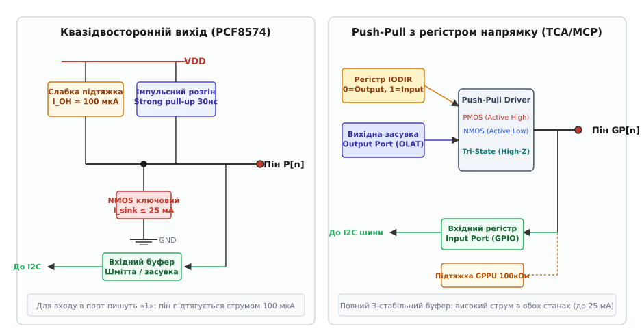
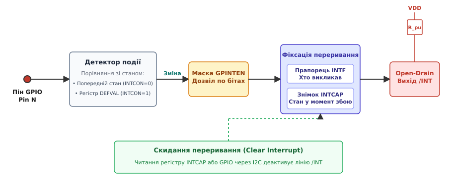
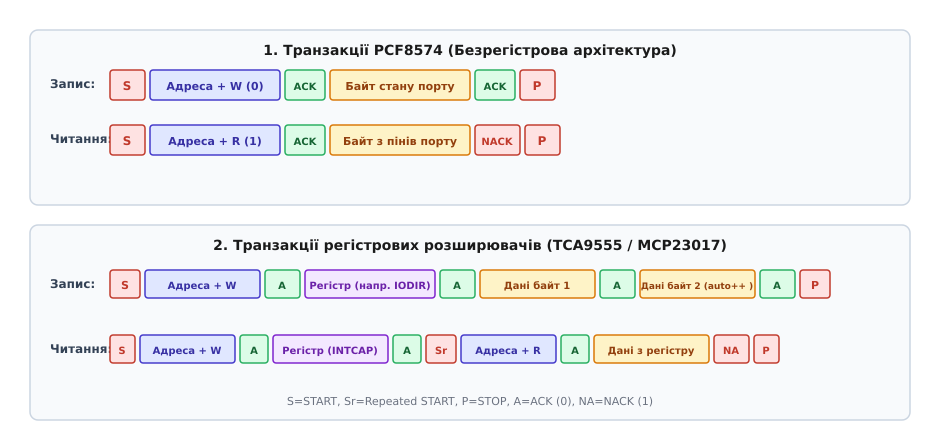
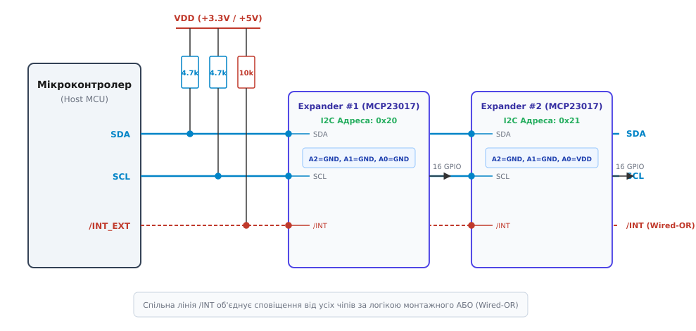

# I²C-розширювач

<preknowlist>
- [Шина I2C](topic:communications/i2c-bus) — двопровідна синхронна шина з відкритим колектором та лініями SDA/SCL.
- [Адресація I2C](topic:communications/i2c-addressing) — 7-бітний адресний простір, біт напрямку R/W та вибір веденого.
- [Транзакція I2C](topic:communications/i2c-transaction) — старт, адресація, покажчик регістра, байти даних, біти ACK/NACK і стоп.
- [Відкритий колектор](topic:electronics/open-collector) — схемотехніка підтяжки, монтажне «АБО» та стан високого опору.
- [Тригер Шмітта](topic:electronics/schmitt-trigger) — гістерезис вхідних каскадів для захисту від шуму та повільних фронтів.
- [Брязкіт контактів](topic:electronics/contact-debounce) — природа механічних коливань та часові параметри фільтрації.
</preknowlist>

Коли на друкованій платі складної системи — наприклад, панелі керування верстатом, системи контролю батареї промислового безпілотника або блоку світлодіодної індикації — мікроконтролер має обслуговувати кілька десятків реле, дискретних ключів, оптичних давачів положення та кнопок вибору режимів, розробник неминуче стикається з вичерпанням фізичних виводів загального призначення (*General-Purpose Input/Output, GPIO*). Перехід на процесор у корпусі зі 100 чи 144 ніжками різко здорожчує компонування, вимагає переходу на 6- чи 8-шарові друковані плати через складність трасування внутрішніх шин і змушує тягнути десятки довгих паралельних провідників через усю системну плату, збираючи паразитні наведення та електромагнітні завади.

Альтернативне інженерне рішення полягає у винесенні цифрових портів на периферію плати безпосередньо до виконавчих вузлів і комунікації з ними лише через дві спільні сигнальні лінії послідовного інтерфейсу. Саме цю задачу розв'язує **I²C-розширювач портів** (*I/O Expander*, від лат. *expandere* — розгортати) — спеціалізована цифрова інтегральна схема, яка транслює байтові команди шини I2C у паралельний електричний стан 8, 16 або 24 дискретних виводів.

Утім, перетворення «два дроти у шістнадцять» приховує під капотом фундаментальні схемотехнічні компроміси: відмінності між квазідвосторонніми каскадами та повноцінними виходами із тристабільним керуванням, затримки читання через послідовний протокол, небезпеку втрати коротких подій та необхідність асинхронного апаратного сповіщення процесора через окрему лінію переривання.

---

### Схемотехніка вихідного каскаду: квазідвосторонній порт проти Push-Pull

Перше принципове рішення під час вибору I2C-розширювача — аналіз електричної структури його вихідних каскадів. За цим критерієм мікросхеми на ринку діляться на два великі сімейства з кардинально відмінною фізикою роботи.


*Зліва: квазідвосторонній каскад (PCF8574) без регістра напрямку — вхідний режим досягається записом «1» завдяки слабкій підтяжці 100 мкА та імпульсному розгону фронту. Справа: повноцінний вихід Push-Pull (TCA9555/MCP23017) із комплементарною парою польових транзисторів, регістром конфігурації IODIR та внутрішньою підтяжкою.*

#### Квазідвосторонні порти (Quasi-bidirectional I/O)

Класичні розширювачі раннього покоління, такі як `PCF8574` (8 бітів) та `PCF8575` (16 бітів), використовують так звану **квазідвосторонню архітектуру** (*quasi-bidirectional*). Головна особливість цієї схеми — **повна відсутність регістра напрямку даних** (*Direction Register*). Кожен пін може одночасно працювати і як вихід, і як вхід без попереднього програмного перемикання режимів.

Щоб зрозуміти, як це реалізовано на рівні кремнію, розглянемо три елементи внутрішнього вихідного каскаду:
1. **Потужний нижній ключ (NMOS)**: під'єднаний між піном і землею (GND). Він здатний впевнено приймати втікаючий струм (*sink current*) до 25 мА, забезпечуючи низький рівень напруги `V_OL ≤ 0.4 В`. Коли в порт записують логічний `0`, цей транзистор відкривається і надійно замикає вивід на землю.
2. **Слабке джерело струму підтяжки (Weak Pull-up)**: польовий транзистор або джерело струму у верхньому плечі, яке видає струм витоку лише близько `I_OH ≈ 100 мкА` до лінії живлення `VDD`.
3. **Імпульсний прискорювач наростання (One-shot Strong Pull-up)**: потужний верхній PMOS-транзистор, який відкривається лише на короткий інтервал часу (близько 30 нс) у момент перемикання з `0` в `1` під час I2C-транзакції. Він призначений виключно для швидкого перезаряджання паразитної ємності зовнішньої доріжки та підйому напруги, після чого вимикається, залишаючи активним лише слабкий струм 100 мкА.

Як за такої структури працює зчитування зовнішнього сигналу? Щоб перевести пін у режим входу, керівний мікроконтролер записує в цей біт логічну `1`. Нижній NMOS-ключ закривається, і на піні встановлюється напруга `VDD`, але підтримується вона лише слабким струмом `100 мкА`. Якщо зовнішній перемикач або транзистор з'єднає пін із землею, йому достатньо відвести цей мізерний струм 100 мкА, і напруга на виводі впаде майже до 0 В. Вхідний буфер мікросхеми зафіксує логічний `0`.

Ця схема має важливу динамічну особливість: високий вихідний опір у статичному стані логічної одиниці (`R_OH ≈ VDD / 100 мкА ≈ 33–50 кОм`). Через це лінія стає чутливою до зовнішніх електромагнітних наведень і має велику постійну часу заряду паразитної ємності доріжки, якщо перемикання відбувається зовнішнім ключем, а не внутрішнім імпульсним прискорювачем.

> ⚠️ **Схемотехнічна пастка квазідвостороннього виходу.**
> Оскільки у високому стані пін видає лише 100 мкА, він **не здатний живити навантаження** високим рівнем (*source current*). Світлодіод, увімкнений між піном PCF8574 і землею, світитися не буде. Усі навантаження на квазідвосторонніх портах підключають **виключно за схемою з активним низьким рівнем** (анод світлодіода через резистор до `VDD`, катод — до піна розширювача), де працює потужний NMOS-ключ.

#### Повноцінні виходи Push-Pull із тристабільним станом

Сучасніші сімейства мікросхем — такі як `TCA9534`, `TCA9555` (Texas Instruments), `PCA9535` (NXP), `MCP23008` та `MCP23017` (Microchip) — використовують стандартну архітектуру мікроконтролерних портів: **двотактний вихід (Push-Pull)** із комплементарною парою транзисторів (PMOS угорі та NMOS унизу) і спеціальним регістром конфігурації напрямку (`IODIR` або `Configuration Register`).

Коли відповідний біт регістра напрямку встановлено в `0` (режим виходу), драйвер керує обома транзисторами:
- Логічна `1`: відкритий верхній PMOS, пін здатний віддавати струм до 25 мА (*sourcing*) при високому потенціалі `V_OH ≈ VDD - 0.5 В`.
- Логічний `0`: відкритий нижній NMOS, пін здатний приймати струм до 25 мА (*sinking*) при низькому потенціалі `V_OL ≤ 0.4 В`.

Коли біт регістра напрямку встановлено в `1` (режим входу), внутрішня цифрова логіка одночасно вимикає і PMOS, і NMOS. Вивід переходить у **тристабільний стан високого опору** (*High-Z*), у якому вхідний струм витоку не перевищує `±1 мкА`. Для усунення зависання плаваючого входу багато мікросхем (наприклад, MCP23017) містять додаткові програмовані резистори внутрішньої підтяжки (`GPPU`) номіналом близько 100 кОм.

| Характеристика | Квазідвосторонній (PCF8574/75) | Push-Pull з IODIR (TCA9555 / MCP23017) |
| :--- | :--- | :--- |
| **Регістр конфігурації напрямку** | Відсутній (завжди готовий до вводу) | Є обов'язковий регістр (`IODIR` / `Configuration`) |
| **Струм витікання I_OH (High Level)** | Слабкий струм (~100 мкА) | Потужний Push-Pull (до 25 мА) |
| **Струм втікання I_OL (Low Level)** | Потужний Open-Drain (до 25 мА) | Потужний Push-Pull (до 25 мА) |
| **Вхідний струм витоку в режимі входу** | ~100 мкА (витікає з піна через pull-up) | ≤ 1 мкА (справжній High-Z) |
| **Підключення світлодіодів** | Лише катодом до мікросхеми (Active Low) | Як катодом, так і анодом (Active Low / High) |
| **Внутрішні підтяжки до VDD** | Апаратні невідмикальні (~100 мкА) | Програмовані через регістр GPPU (~100 кОм) |

---

### Регістрова модель і внутрішня логіка

Якщо в безрегістрових чіпах на кшталт PCF8574 будь-який надісланий байт одразу потрапляє у вихідні засувки, то в повноцінних розширювачах керування побудоване на основі структурованої **карти регістрів** (*Register Map*).

Розглянемо базовий та розширений набір регістрів керування на прикладі 16-бітного розширювача `MCP23017` та 8-бітного `TCA9534`.

```
                    ┌──────────────────────────────────────────────┐
                    │               I2C Bus Engine                 │
                    └──────────────────────┬───────────────────────┘
                                           │
             ┌──────────────┬──────────────┼──────────────┬──────────────┐
             ▼              ▼              ▼              ▼              ▼
       ┌───────────┐  ┌───────────┐  ┌───────────┐  ┌───────────┐  ┌───────────┐
       │   IODIR   │  │   IPOL    │  │   GPPU    │  │  GPINTEN  │  │   OLAT    │
       │ (Напрямок)│  │ (Полярн.) │  │ (Підтяжка)│  │(Маска INT)│  │ (Засувка) │
       └─────┬─────┘  └─────┬─────┘  └─────┬─────┘  └─────┬─────┘  └─────┬─────┘
             │              │              │              │              │
             └──────────────┼──────────────┼──────────────┼──────────────┘
                            ▼              ▼              ▼
                    ┌──────────────────────────────────────────────┐
                    │              Фізичні піни GPIO               │
                    └──────────────────────────────────────────────┘
```

1. **Регістр конфігурації напрямку (`IODIR` / `Configuration`)**:
   Визначає режим кожного окремого виводу. Запис біта `1` налаштовує відповідний пін як цифровий вхід (High-Z). Запис біта `0` налаштовує пін як двотактний вихід. За замовчуванням після апаратного скидання всі біти встановлені в `1` для безпеки підключених кіл.

2. **Регістр інверсії вхідної полярності (`IPOL` / `Polarity Inversion`)**:
   Дозволяє апаратно інвертувати логічний стан вхідних пінів. Якщо біт у цьому регістрі скинутий у `0`, стан регістра входу збігається з фізичним рівнем на піні. Якщо записано `1`, напруга низького рівня на вході буде зчитуватися процесором як логічна `1`. Це зручно для кнопок, замкнених на землю: мікроконтролер читає безпосередній логічний статус натискання без додаткових операцій виключного АБО (`^`) у софті.

3. **Регістр вихідної засувки (`OLAT` / `Output Port`) проти регістра входу (`GPIO` / `Input Port`)**:
   Це одне з найважливіших понять у схемотехніці портів введення-виведення.
   - **`GPIO` (Input Port Register)**: відбиває **реальний електричний рівень на фізичних пінах** мікросхеми в момент опитування.
   - **`OLAT` (Output Latch Register)**: зберігає дані, які керуюча програма записала для керування вихідними транзисторами.

> 🔧 **Небезпека читання-модифікації-запису (Read-Modify-Write Hazard).**
> Якщо пін налаштовано як вихід і до нього підключено велику ємність або виникло коротке замикання, напруга на ньому може наростати повільно. Якщо програма спробує змінити сусідній біт через команду «прочитати порт `GPIO` → накласти бітову маску → записати назад у `GPIO`», вона вважає з фізичного піна логічний `0` замість раніше виставленої `1` і випадково скине вихідне значення першого піна. Саме тому в розвинених чіпах операції маскування виконують над регістром `OLAT`, де зберігається істинний програмний стан вихідного тригера.

Докладна специфікація адресних карт, бітових прапорців та режимів адресації описана в матеріалі [архітектура регістрів та карт пам'яті I2C-розширювачів](topic:communications/i2c-expander/api-register-architecture.md).

---

### Асинхронне сповіщення: конвеєр обробки переривань

Найбільш критичне обмеження передачі дискретних сигналів через I2C — швидкість доступу. Якщо мікроконтролер має реагувати на натискання кнопки чи спрацьовування кінцевого вимикача, безперервне опитування (*polling*) розширювача через I2C створює постійне навантаження на шину (на швидкості 100 кГц один цикл читання займає близько 200 мкс), блокує обмін з іншими давачами й не дозволяє процесору переходити в енергоощадні режими сну.

Щоб позбутися періодичного опитування, I2C-розширювачі обладнують окремою асинхронною фізичною лінією **переривання за зміною стану** (`INT` або `/INT`).


*Конвеєр фіксації подій: сигнал із піна потрапляє на детектор зміни (порівняння з попереднім станом або з регістром DEFVAL), проходить через маску GPINTEN, фіксує біти в INTF та зберігає точний знімок у засувці INTCAP, переводячи лінію /INT у нуль.*

#### Структура підсистеми переривань

У таких мікросхемах, як MCP23017 або TCA9555, генерація переривання контролюється набором спеціалізованих регістрів:

1. **`GPINTEN` (General Purpose Interrupt Enable)**:
   Бітова маска дозволу переривань. Переривання генерується лише для тих виводів, де у відповідному розряді `GPINTEN` виставлено `1`.
2. **`INTCON` (Interrupt Control Register)**:
   Визначає умову формування сигналу:
   - `INTCON = 0`: переривання виникає за **будь-якої зміни рівня** на вході порівняно з попереднім зафіксованим станом (перепад з 0 в 1 або з 1 в 0).
   - `INTCON = 1`: поточний стан піна порівнюється з еталонним значенням у регістрі **`DEFVAL`**. Переривання виникає лише тоді, коли рівень на піні стає **протилежним** до значення в `DEFVAL`.
3. **`DEFVAL` (Default Value Register)**:
   Містить очікуваний стан спокою для кожного піна. Наприклад, якщо кнопка підтягнута до живлення (стан спокою `1`), у `DEFVAL` записують `1`. Переривання згенерується виключно в момент притискання кнопки до землі (стан `0`).

#### Фіксація подій: регістри `INTF` та `INTCAP`

Коли на дозволеному вході виникає подія, внутрішня апаратна логіка розширювача миттєво виконує три дії:
- Виставляє відповідний біт у регістрі прапорців переривань **`INTF`** (*Interrupt Flag Register*), щоб хост міг точно знати, який саме вивід викликав подію.
- Замикає вхідні тригери регістра **`INTCAP`** (*Interrupt Capture Register*). Цей регістр **фіксує і заморожує логічний стан усіх пінів порту саме в момент виникнення переривання**.
- Відкриває вихідний транзистор лінії `/INT`, притягуючи її до землі (Active Low).

> 💡 **Чому регістр `INTCAP` життєво необхідний.**
> Уявімо механічний датчик, який генерує короткий імпульс тривалістю 500 мкс. Сигнал переривання надходить до MCU, але поки процесор вийде зі сну, налаштує I2C-контролер і надішле адресний байт, імпульс на датчику вже зникне.
> Якби мікроконтролер зчитував звичайний регістр `GPIO`, він побачив би попередній стан спокою («хибне переривання»). Але зчитування регістра `INTCAP` повертає точний стан ліній у мить спрацьовування датчика, гарантуючи фіксацію навіть надкоротких подій.

#### Скидання та монтажне об'єднання переривань

Лінія `/INT` зазвичай виконана за схемою з відкритим стоком (*Open-Drain*). Це дозволяє об'єднувати лінії переривання від багатьох розширювачів та інших I2C-пристроїв на одну фізичну ніжку мікроконтролера через єдиний резистор підтяжки за правилом **монтажного «АБО»** (*Wired-OR*).

Лінія `/INT` залишається в активному низькому стані доти, доки процесор не виконає операцію читання регістра `INTCAP` або регістра порту `GPIO` через шину I2C. Акт зчитування даних скидає внутрішній тригер переривання, закриває вихідний ключ, і зовнішній резистор підтяжки повертає лінію `/INT` до високого рівня `VDD`.

---

### Аналіз транзакцій I2C: покроковий протокол обміну

Погляньмо на реальний часовий розподіл та послідовність байтів на лініях `SDA` і `SCL` під час взаємодії з різними типами розширювачів.


*Формат кадрів на шині: 1. PCF8574 — компактний однобайтний протокол без адреси регістра. 2. Регістровий розширювач (MCP23017/TCA9555) — запис із передачею покажчика регістра та читання через повторний старт (Repeated START).*

#### 1. Прямий обмін без покажчика регістра (PCF8574)

Оскільки PCF8574 не має внутрішніх регістрів, протокол обміну з ним гранично мінімалістичний.

**Запис у вихідний порт:**
```
Ведучий:  [START] -> [Адреса чіпа + W (0)] -> [Байт виходу P7..P0] -> [STOP]
PCF8574:                               [ACK]                   [ACK]
```
Уся операція встановлення 8 виходів забирає рівно 18 тактів шини SCL (2 байти по 9 бітів). На тактовій частоті 100 кГц це триває лише:

```
t_write = 18 × 10 мкс = 180 мкс
```

**Читання стану входів:**
```
Ведучий:  [START] -> [Адреса чіпа + R (1)] ->                    -> [NACK] -> [STOP]
PCF8574:                               [ACK] -> [Байт стану входів]
```

#### 2. Регістровий обмін з автоінкрементом (TCA9555 / MCP23017)

Для мікросхем із внутрішньою пам'яттю кожна операція вимагає попереднього встановлення покажчика адреси регістра (*Register Address Pointer*).

**Запис конфігурації (наприклад, встановлення регістра напрямку `IODIRA`):**
```
Ведучий: [START] -> [Адреса + W] -> [Адреса регістра IODIRA (0x00)] -> [Байт 0x00] -> [STOP]
Ведений:                    [ACK]                              [ACK]           [ACK]
```

Якщо розширювач є 16-бітним (двопортовим, як MCP23017), контролер підтримує режим **автоінкременту адреси** (*Sequential Operation*). Якщо ведучий не генерує сигнал `STOP`, а продовжує видавати такти SCL і надсилає наступний байт даних, внутрішній покажчик автоматично збільшується на 1. Таким чином, за одну транзакцію можна послідовно сконфігурувати обидва порти A і B:
`START` → `[Addr+W]` → `[Reg 0x00]` → `[Data IODIRA]` → `[Data IODIRB]` → `STOP`.

**Читання зафіксованого стану переривання (`INTCAP`):**
Щоб зчитати регістр, ведучий має спочатку записати адресу потрібного регістра, а потім змінити напрямок шини без звільнення лінії — за допомогою **повторного старту** (*Repeated START*, `Sr`):

```
Ведучий: [START] -> [Адреса + W] -> [Регістр INTCAPA (0x10)] -> [Repeated START] -> [Адреса + R] ->                  -> [NACK] -> [STOP]
Ведений:                    [ACK]                       [ACK]                                [ACK] -> [Байт даних INTCAP]
```

Використання саме `Repeated START` замість послідовності `STOP` → `START` є обов'язковим у мультимайстерних системах: воно запобігає перехопленню шини іншим ведучим між фазою вибору регістра та фазою читання.

---

### Топологія шини, апаратна адресація та завадозахист

На великих системних платах до однієї шини I2C нерідко підключають 4, 8 або більше розширювачів для обслуговування сотні розподілених ліній введення-виведення.


*Схема мультичіпової конфігурації: мікроконтролер керує кількома розширювачами на спільних лініях SDA/SCL, адресні ніжки A0-A2 задають унікальну адресу кожному чіпу, а відкриті стоки переривань /INT об'єднані на один вхід процесора.*

#### Апаратне конфігурування адрес (ніжки A0, A1, A2)

Більшість I2C-розширювачів мають 3 апаратні ніжки вибору адреси (`A0`, `A1`, `A2`), що дозволяє під'єднати до однієї шини до 8 однакових мікросхем.

7-бітний адресний байт формується з фіксованого префікса виробника та змінного суфікса, що визначається підключенням ніжок до `VDD` або `GND`:
- `PCF8574`: фіксований префікс `0100`, адреси в діапазоні `0x20` .. `0x27`.
- `PCF8574A`: фіксований префікс `0111`, адреси в діапазоні `0x38` .. `0x3F`.
  *(Це дозволяє розмістити на одній шині 8 чіпів PCF8574 та 8 чіпів PCF8574A, отримавши сумарно 16 × 8 = 128 портів без мультиплексорів шини).*
- `MCP23017`: фіксований префікс `00100`, ніжки `A2, A1, A0` задають діапазон `0x20` .. `0x27`.
- `TCA9555`: фіксований префікс `0100`, ніжки `A2, A1, A0` задають діапазон `0x20` .. `0x27`.

```
  Біти адреси I2C:
 ┌───┬───┬───┬───┬───┬───┬───┬─────┐
 │ 0 │ 1 │ 0 │ 0 │ A2│ A1│ A0│ R/W │   (Для MCP23017 / TCA9555 / PCF8574)
 └───┴───┴───┴───┴───┴───┴───┴─────┘
  ◄── Фіксований ──►◄─ Ніжки ─►
```

#### Розрахунок підтяжок шини та обмеження ємності

Під час підключення великої кількості розширювачів зростає сумарна паразитна ємність шини `C_b` (складається з ємності доріжок друкованої плати, вхідних ємностей ніжок чіпів `C_in ≈ 5–10 пФ` на пристрій та ємності роз'ємів).

Стандарт I2C обмежує максимальну ємність лінії величиною `C_b ≤ 400 пФ` для режимів Standard Mode (100 кГц) та Fast Mode (400 кГц). Для забезпечення крутизни наростання фронту `t_r ≤ 300 нс` на частоті 400 кГц опір підтягувальних резисторів `R_p` розраховують за граничними формулами:

```
R_pullup_min = (VDD - V_OL_max) / I_OL_max
             = (3.3 - 0.4) / 0.003
             ≈ 967 Ом                                    [обмеження струму ключа]

R_pullup_max = t_r / (0.8473 · C_b)
             = 300·10⁻⁹ / (0.8473 · 400·10⁻¹²)
             ≈ 885 Ом                                    [для 400 кГц при 400 пФ]
```

Якщо сумарна ємність шини з вісьмома чіпами становить, наприклад, 150 пФ, максимальний допустимий резистор для Fast Mode складе:

```
R_pullup_max = 300·10⁻⁹ / (0.8473 · 150·10⁻¹²)
             ≈ 2.36 кОм                                  [робочий номінал 2.2 кОм]
```

#### Міжрівневе узгодження напруг та багатовольтні домени

У багатьох сучасних приладах мікроконтролер працює на рівні логіки `3.3 В` або `1.8 В`, тоді як виконавча периферія (реле, промислові індикатори) вимагає рівнів `5.0 В`. I2C-розширювачі дозволяють елегантно вирішити проблему трансляції рівнів двома способами:

1. **Використання природної властивості відкритого колектора I2C**:
   Якщо мікросхема розширювача (наприклад, PCF8574) живиться від `5.0 В`, а лінії I2C підтягнуті резисторами до шини живлення мікроконтролера `3.3 В`, обмін можливий лише за умови, що вхідний поріг логічної одиниці розширювача задовольняє умову `V_IH ≤ 3.3 В`. У класичного PCF8574 `V_IH = 0.7 · VDD = 3.5 В`, тому пряме з'єднання з шиною 3.3 В є ненадійним. Проте сучасні розширювачі сімейства `TCA` (наприклад, TCA9534) мають фіксований поріг `V_IH = 1.4 В` або вбудовані транслятори, що дозволяє їм живитися від 5.0 В при роботі на шині 3.3 В без зовнішніх перетворювачів.
2. **Розширювачі з подвійним живленням (Dual-Rail Expanders)**:
   Такі мікросхеми, як `TCA6416A` або `PCA9538`, мають два окремі виводи живлення: `VCCI` (для внутрішнього I2C-інтерфейсу, від 1.65 до 5.5 В) та `VCCP` (для портів виводу, від 1.65 до 5.5 В). Це забезпечує повну гальванічну ізоляцію логічних рівнів ядра мікроконтролера від силової периферії без будь-яких додаткових транзисторних ключів.

#### Захист від брязкоту контактів і фільтрація завад

Під час підключення механічних кнопок чи реле до входів розширювача переривання `/INT` може генерувати «шторм» хибних спрацьовувань через [брязкіт контактів](topic:electronics/contact-debounce) (*Contact Bounce*).

Для боротьби з цим явищем застосовують комбінований підхід:
1. **Апаратний вхідний гістерезис**: усі сучасні I2C-розширювачі мають вбудовані [тригери Шмітта](topic:electronics/schmitt-trigger) на входах GPIO з гістерезисом близько `0.2 · VDD`, що запобігає генерації хибних імпульсів при повільних змінах напруги.
2. **Апаратні RC-ланцюжки**: на критичних лініях встановлюють низькочастотний фільтр (`R = 10 кОм`, `C = 100 нФ`, постійна часу `τ = R · C = 1 мс`).
3. **Програмний алгоритм обслуговування ISR**:
   - При виникненні фронту на лінії `/INT` хост-мікроконтролер **тимчасово маскує зовнішнє переривання**.
   - Запускається неблокуючий апаратний таймер затримки на 20–50 мс.
   - Після закінчення таймера мікроконтролер виконує єдину транзакцію читання регістра `INTCAP` або `GPIO` через I2C, фіксуючи стабільний стан кнопок та автоматично скидаючи прапорець переривання в мікросхемі.
   - Зовнішнє переривання мікроконтролера знову активується.

Повноцінний промисловий приклад драйвера з чергою переривань та захистом від брязкоту реалізовано у вставці [практична реалізація драйвера розширювача з чергою переривань](topic:communications/i2c-expander/proj-interrupt-driver.md).

---

### Тепловий режим, струмові обмеження та баланс потужності

Під час проектування схем керування потужними навантаженнями (світлодіодні матриці, котушки реле, оптопари) важливо враховувати загальне теплове навантаження на кристал мікросхеми.

Кожен окремий вивід розширювача здатен пропускати до `25 мА`, проте **сумарний струм через вивід живлення `VDD` або `GND` чіпа суворо обмежений**. Для більшості розширювачів у корпусах SOIC або TSSOP це обмеження становить `150–200 мА`. Якщо розробник увімкне одночасно всі 16 світлодіодів зі струмом 20 мА кожен, сумарний струм складе:

```
I_total = 16 × 20 мА = 320 мА
```

Це суттєво перевищує граничний ліміт корпусу, викликає локальний перегрів кристала і призводить до поступової деградації внутрішніх кремнієвих доріжок через явище **електроміграції** (*electromigration*).

Теплова потужність розсіювання `P_d` визначається падінням напруги на внутрішніх відкритих ключах:

```
P_d = I_total × V_OL ≈ 0.2 А × 0.4 В = 0.08 Вт
```

Для корпусу TSSOP-24 із тепловим опором кристал-середовище `θ_JA ≈ 85 °C/Вт` підвищення температури кристала над навколишнім середовищем складе лише `ΔT = P_d · θ_JA ≈ 6.8 °C`. Тобто тепловий перегрів є помірним, проте струмове обмеження металізації виводів залишається головним лімітуючим фактором.

---

### Індустріальний захист: індуктивні навантаження та TVS-діоди

У реальних умовах експлуатації до виводів I2C-розширювача часто підключають електромагнітні реле, електромагнітні клапани або зовнішні довгі кабелі від кінцевих вимикачів. Такі підключення створюють специфічні загрози:

1. **Електрорушійна сила самоіндукції (Flyback Spikes)**:
   При вимиканні індуктивного навантаження (наприклад, котушки реле) виникає різкий викид напруги зворотної полярності, амплітуда якого може досягати десятків і сотень вольтів. Якщо навантаження керується безпосередньо виводом розширювача без захисного демпферного діода (*Flyback Diode*), зворотний викид миттєво пробиває внутрішній вихідний транзистор мікросхеми. Паралельно кожній індуктивній котушці обов'язково встановлюють захисний діод (наприклад, 1N4148 або Шотткі SS14).
2. **Електростатичні розряди (ESD) та наведення на довгих лініях**:
   Якщо цифрові лінії від розширювача виходять за межі системної плати (наприклад, ідуть до кнопок на корпусі приладу), кожен вхід повинен бути захищений TVS-супресором або збіркою діодів Шотткі до ліній `VDD` і `GND`, а також послідовним струмообмежувальним резистором номіналом 100–330 Ом.

---

### I²C-розширювач чи I²C-мультиплексор: межі застосування

Часто у початківців виникає плутанина між двома класами допоміжних I2C-мікросхем: **розширювачами портів** (*I/O Expanders*) та **мультиплексорами шини** (*I2C Multiplexers / Switches*, такими як `TCA9548A`).

Це принципово різні пристрої, що вирішують різні системні задачі:
- **I²C-розширювач портів (TCA9555, MCP23017)**: є повноцінним веденим пристроєм шини. Він приймає серійні байти даних і перетворює їх на статичні логічні рівні (High/Low) на паралельних фізичних ніжках. До нього підключають кнопки, світлодіоди, реле, оптопари.
- **I²C-мультиплексор (TCA9548A, PCA9546A)**: є керованим комутатором самої шини I2C. Він підключає головні лінії SDA/SCL мікроконтролера до одного з кількох підпорядкованих каналів I2C. Його використовують тоді, коли треба підключити до однієї плати кілька складних цифрових давачів із **однаковими незмінними I2C-адресами** (наприклад, вісім однакових датчиків тиску з фіксованою адресою `0x76`), або для електричної ізоляції сегментів шини з великою ємністю.

---

### Типові схемотехнічні помилки та експлуатаційні пастки

Робота з I2C-розширювачами здається простою, проте на практиці розробники регулярно стикаються з не очевидними апаратними проблемами:

1. **Плаваючі входи та наскрізні струми CMOS (Shoot-through Current)**:
   Якщо невикористані піни розширювача залишити непідключеними (*floating*) в режимі входу за замовчуванням, потенціал на них через наведення встановиться на рівні близько `≈ VDD / 2`. За такої напруги вхідні комплементарні транзистори буфера частково відкриваються одночасно, створюючи прямий наскрізний витік струму між `VDD` і `GND`. Споживання спокою мікросхеми зростає з типових 1 мкА до кількох міліамперів.
   *Правило*: усі невикористані виводи треба програмно перевести в режим виходу або ввімкнути для них внутрішню підтяжку `GPPU`.

2. **Невизначений стан виходів під час подачі живлення (Power-On Glitch)**:
   Під час увімкнення живлення до моменту, поки хост-процесор завантажиться та надішле конфігураційні I2C-пакети, усі піни розширювача перебувають у стані високого опору (High-Z). Якщо цими лініями керуються польові транзистори силових навантажень чи реле, затвори MOSFET через ємнісні наведення можуть довільно відкритися.
   *Правило*: кожен силовий вихід розширювача обов'язково повинен мати на друкованій платі власний зовнішній резистор стяжки до землі (10–47 кОм) або підтяжки до `VDD`.

3. **Зависання шини та апаратний скид (`/RESET`)**:
   Якщо під час передачі байта живлення мікроконтролера короткочасно просяде або відбудеться програмне перезавантаження, розширювач може залишитися в стані очікування такту, утримуючи лінію `SDA` на нулі (притягнутою до землі). Оскільки SDA закорочена на нуль веденим чіпом, мікроконтролер не зможе згенерувати сигнал `START`.
   *Правило відновлення шини*: ніжку `/RESET` розширювача варто підключити до виводу скидання процесора. Якщо апаратний пін скидання відсутній, мікроконтролер при виявленні мертвого зависання SDA повинен перевести пін SCL у режим GPIO і згенерувати **9 послідовних імпульсів такту**, змусивши кінцевий автомат розширювача вийти зі стану прийому байта, після чого видати коректний сигнал `STOP`.

---

### Короткий підсумок

I²C-розширювач — це ключовий будівельний блок розподіленої вбудованої периферії:
- **Квазідвосторонні чіпи (PCF8574/75)** не потребують конфігурації напрямку, але ефективно працюють лише на втікання струму (Active Low).
- **Регістрові чіпи (TCA9555, MCP23017)** забезпечують симетричні двотактні виходи Push-Pull до 25 мА, тристабільні входи High-Z та гнучке налаштування полярності й підтяжок.
- **Підсистема переривань із лінією `/INT` та регістром `INTCAP`** знімає з процесора тягар постійного опитування, усуває простої шини I2C і гарантовано фіксує імпульсні події на входах навіть при повільному послідовному опитуванні.
