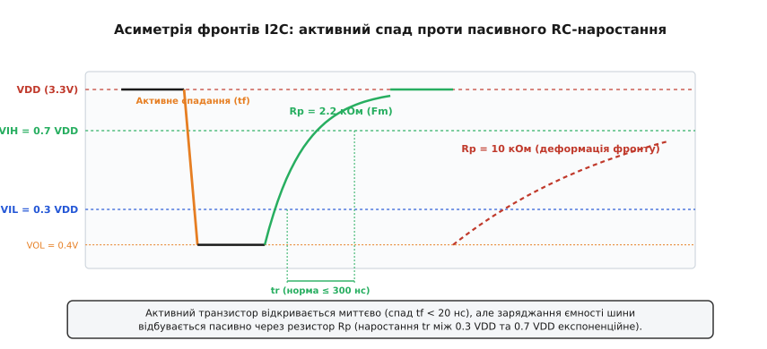
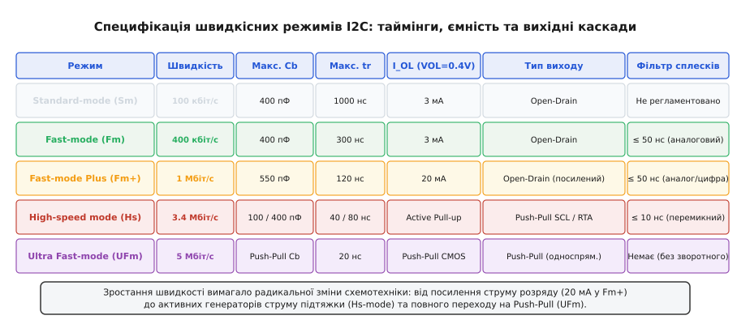
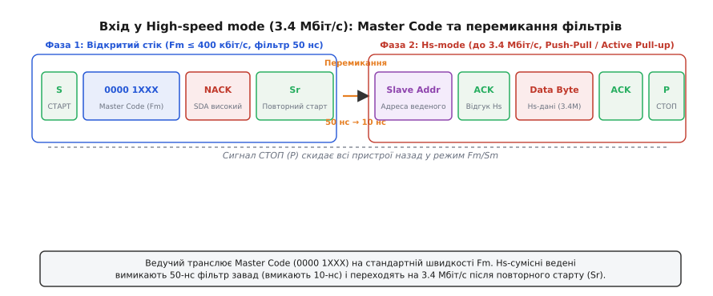
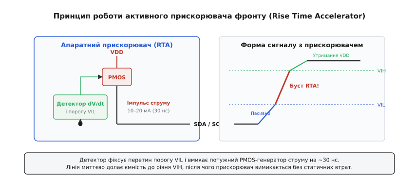

# Режими швидкості I2C: від 100 кбіт/с до 5 Мбіт/с

<preknowlist>
- [Двопровідна шина I2C](topic:communications/i2c-bus) — лінії SDA/SCL, напівдуплексний протокол і синхронізація тактом.
- [Відкритий колектор та стік](topic:electronics/open-collector) — комутація тільки до землі та пасивна підтяжка.
- [Двотактний вихід](topic:electronics/push-pull-output) — активне перемикання між землею та живленням.
- [Тригер Шмітта](topic:electronics/schmitt-trigger) — гістерезис для захисту від брязкоту на пологих фронтах.
</preknowlist>

Коли на друкованій платі з кількома давачами та мікросхемою пам'яті тактову частоту шини I2C підвищують зі стандартних 100 кГц до 400 кГц або 1 МГц, зв'язок часто раптово зникає. Осцилограф показує, що прямокутні імпульси перетворилися на деформовані пилкоподібні хвилі: сигнал спадає до нуля майже миттєво, але наростає настільки повільно, що напруга на лінії просто не встигає досягти рівня логічної одиниці до моменту, коли ведучий контролер уже знову притискає такт до землі.

Ця проблема зумовлена фундаментальною схемотехнічною особливістю класичної шини I2C — використанням виходів типу «відкритий стік» (*open-drain*) із пасивними резисторами підтяжки (*pull-up resistors*). Щоб збільшувати швидкість передачі даних, розробникам стандарту довелося пройти шлях від простих резистивних кіл до посилених драйверів струму, динамічних прискорювачів фронту, спеціальних команд перемикання режимів і, зрештою, повної відмови від відкритого стоку на користь двотактних вихідних каскадів.

---

### Фізичний бар'єр RC: чому відкритий стік обмежує швидкість

В основі класичної шини I2C лежить електрична асиметрія. Коли пристрій виставляє на лінію логічний нуль, відкривається його внутрішній польовий транзистор (*low-side MOSFET*). Опір відкритого каналу сучасного транзистора становить одиниці або десятки Ом, тому паразитна ємність лінії розряджається на землю практично миттєво — час спадання (*fall time*, `t_f`) зазвичай не перевищує кількох наносекунд.


*Форма імпульсів на шині I2C: активне спадання через відкритий транзистор відбувається миттєво, тоді як наростання обмежене постійною часу кола RC.*

Коли ж пристрій відпускає лінію для формування логічної одиниці, його вихідний транзистор закривається і переходить у стан високого імпедансу. Сама мікросхема більше не подає напругу в лінію. Заряджання сумарної паразитної ємності шини `C_b` (яка складається з ємності виводів усіх під'єднаних чіпів, ємності друкованих доріжок плати та кабелів) відбувається виключно через зовнішній підтягувальний резистор `R_p`, підключений до шини живлення `V_DD`.

Напруга на шині в процесі заряджання описується класичним рівнянням перехідного процесу кола RC:

```
V(t) = V_DD · (1 - e^(-t / (R_p · C_b)))
```

де добуток `τ = R_p · C_b` є часовою константою кола.

Специфікація стандарту I2C визначає час наростання фронту `t_r` (*rise time*) як інтервал часу, за який потенціал лінії зростає від гарантованого рівня логічного нуля `V_IL = 0.3 · V_DD` до гарантованого рівня логічної одиниці `V_IH = 0.7 · V_DD`. 

Якщо розв'язати рівняння перехідного процесу для цих двох граничних точок напруги:

```
t_1 = -R_p · C_b · ln(1 - 0.3) = -R_p · C_b · ln(0.7) ≈ 0.3567 · R_p · C_b
t_2 = -R_p · C_b · ln(1 - 0.7) = -R_p · C_b · ln(0.3) ≈ 1.2040 · R_p · C_b
```

Різниця між цими моментами дає точний аналітичний вираз для часу наростання:

```
t_r = t_2 - t_1 = R_p · C_b · ln(0.7 / 0.3) = R_p · C_b · ln(7 / 3) ≈ 0.8473 · R_p · C_b
```

Цей зв'язок створює головну дилему розробника шини I2C. З одного боку, щоб зменшити час наростання `t_r` для роботи на вищій частоті, необхідно зменшувати опір резистора `R_p`. З іншого боку, коли лінія притискається до нуля, через цей резистор на землю тече постійний струм:

```
I_OL = (V_DD - V_OL) / R_p
```

Якщо опір `R_p` зробити занадто малим, струм `I_OL` перевищить максимальну навантажувальну здатність вихідного транзистора мікросхеми (яка для стандартного режиму становить лише 3 мА). У результаті спадання напруги на відкритому транзисторі `V_OL` зросте вище допустимого порогу `0.4 В`, лінія не зможе опуститися до надійного логічного нуля, а вихідний каскад почне перегріватися.

Детальний математичний апарат розрахунку цих меж та оцінки розсіюваної потужності винесено в [математичне виведення меж опору підтяжки та часових констант](topic:communications/i2c-speeds/math-rc-timing.md).

---

### П'ять специфікацій швидкості I2C

Офіційна специфікація I2C від компанії NXP (документ UM10204) стандартизує п'ять швидкісних режимів. Кожен наступний режим створювався як відповідь на зростання вимог до пропускної здатності та базується на специфічних змінах у схемотехніці передавачів і приймачів.


*Порівняльна таблиця та параметри п'яти швидкісних режимів I2C: таймінги, обмеження ємності шини та схемотехніка вихідних каскадів.*

| Режим (Mode) | Максимальний бітрейт | Макс. ємність (C_b) | Макс. час t_r | Струм I_OL (при 0.4 В) | Тип вихідного каскаду | Фільтр завад |
| :--- | :--- | :--- | :--- | :--- | :--- | :--- |
| **Standard-mode (Sm)** | 100 кбіт/с | 400 пФ | 1000 нс | 3 мА | Відкритий стік / колектор | Не регламентовано |
| **Fast-mode (Fm)** | 400 кбіт/с | 400 пФ | 300 нс | 3 мА | Відкритий стік / колектор | ≤ 50 нс (вбудований) |
| **Fast-mode Plus (Fm+)** | 1 Мбіт/с | 550 пФ | 120 нс | 20 мА | Відкритий стік (посилений) | ≤ 50 нс (аналог/цифра) |
| **High-speed mode (Hs)** | 3.4 Мбіт/с | 100 / 400 пФ | 40 / 80 нс | Active Pull-up | Двотактний SCL / Active SDA | ≤ 10 нс (перемикний) |
| **Ultra Fast-mode (UFm)** | 5 Мбіт/с | Не обмежено RC | 20 нс | Push-Pull CMOS | Двотактний (Push-Pull) | Відсутній (односпрям.) |

---

### Standard-mode (Sm, до 100 кбіт/с)

Базовий режим, розроблений Philips Semiconductors на початку 1980-х років для зв'язку між мікроконтролером і допоміжними мікросхемами в телевізорах та аудіотехніці.

Характеристики режиму:
- Максимальна частота тактування: 100 кГц.
- Максимально допустима ємність шини: 400 пФ.
- Максимальний час наростання фронту `t_r`: 1000 нс (1 мкс).
- Максимальний час спадання фронту `t_f`: 300 нс.
- Мінімальна тривалість низького стану `t_LOW`: 4.7 мкс.
- Мінімальна тривалість високого стану `t_HIGH`: 4.0 мкс.
- Вихідний струм розряду: `I_OL = 3 мА` при `V_OL = 0.4 В`.

У режимі Standard-mode часові інтервали настільки великі, що шина прощає суттєві паразитичні ємності та використання слабких підтягувальних резисторів номіналом 4.7–10 кОм. Фільтрація високочастотних завад на входах мікросхем першого покоління не вимагалася, оскільки тривалість тактового імпульсу в 4 мкс робила систему малочутливою до коротких наносекундних сплесків.

---

### Fast-mode (Fm, до 400 кбіт/с)

Із появою швидших мікроконтролерів та складніших периферійних пристроїв у 1992 році було введено режим Fast-mode, що збільшив пропускну здатність у чотири рази при збереженні допустимої ємності шини 400 пФ.

Характеристики режиму:
- Максимальна частота тактування: 400 кГц.
- Максимально допустима ємність шини: 400 пФ.
- Максимальний час наростання фронту `t_r`: 300 нс.
- Максимальний час спадання фронту `t_f`: 300 нс.
- Мінімальна тривалість низького стану `t_LOW`: 1.3 мкс.
- Мінімальна тривалість високого стану `t_HIGH`: 0.6 мкс.

Зверніть увагу на асиметрію періоду тактового сигналу: для низького стану `t_LOW` виділено 1.3 мкс, а для високого `t_HIGH` — лише 0.6 мкс. Це зроблено свідомо: на низькому рівні пристрої виконують зміну бітів на лінії SDA, а зменшений високий рівень мінімізує час, протягом якого лінія піддається впливу завад у високоімпедансному стані.

#### Обов'язковий фільтр пригнічення сплесків (Spike Suppression Filter)
На частоті 400 кГц напівпровідникові входи мікросхем стають чутливими до індуктивних наведень та перехресних перешкод від сусідніх ліній. Тому специфікація Fast-mode ввела обов'язкову вимогу до всіх входів SDA та SCL: кожен пристрій повинен мати вбудований аналоговий фільтр низьких частот (або тригер Шмітта з фільтром), що повністю пригнічує будь-які імпульси та сплески напруги тривалістю **до 50 нс**.

#### Зворотна сумісність
Пристрої стандарту Fast-mode повністю зворотно сумісні зі Standard-mode: вони можуть працювати на шині зі швидкістю 100 кбіт/с. Проте якщо на одну шину 400 кбіт/с підключити старий пристрій Standard-mode, коректна робота можлива лише тоді, коли ведучий контролер уповільнює обмін до 100 кбіт/с під час звернення до цього конкретного веденого.

---

### Fast-mode Plus (Fm+, до 1 Мбіт/с)

У 2006 році NXP представила специфікацію Fast-mode Plus (Fm+), розроблену для систем із великим обсягом передачі даних (світлодіодні матричні дисплеї, масиви пам'яті EEPROM, аудіокодеки).

Перед інженерами постала фізична суперечність: на швидкості 1 Мбіт/с період такту становить лише 1000 нс, а максимальний допустимий час наростання фронту скорочено до `t_r ≤ 120 нс`. Як забезпечити заряджання шини за 120 нс, якщо на платі встановлено десятки мікросхем, а сумарна ємність досягає 500 пФ?

Розрахунок за формулою часу наростання показує:
```
R_p ≤ 120 · 10⁻⁹ / (0.8473 · 550 · 10⁻¹²) ≈ 257 Ом
```

Якщо підключити резистор 250 Ом до живлення 3.3 В, струм розряду на землю складе:
```
I_OL = (3.3 В - 0.4 В) / 250 Ом = 11.6 мА
```

Стандартний транзистор на 3 мА в таких умовах не зміг би притиснути лінію до нуля.

#### Посилені вихідні каскади на 20 мА
Рішенням Fm+ стало радикальне посилення вихідних каскадів: специфікація збільшила гарантований втягуваний струм виходів у 6.6 раза — **до 20 мА при `V_OL = 0.4 В`**. Це дозволило:
1. Зменшити опір підтягувальних резисторів до 150–300 Ом.
2. Збільшити максимально допустиму ємність шини до **550 пФ** (навіть більше, ніж у повільніших режимах Sm та Fm).
3. Забезпечити час наростання `t_r ≤ 120 нс` та час спадання `t_f ≤ 120 нс`.

#### Контроль крутизни спаду (Slew-Rate Control)
Оскільки комутація струму 20 мА за частки наносекунд створює сильне електромагнітне випромінювання та паразитний дзвін на індуктивностях доріжок, вихідні драйвери Fm+ мають вбудовану схему контролю крутизни наростання струму (*slew-rate control*), що обмежує максимальну швидкість спадання напруги на рівні не швидше 20 нс.

---

### High-speed mode (Hs-mode, до 3.4 Мбіт/с)

Режим High-speed mode (Hs-mode), стандартизований у версії 2.0 специфікації I2C (1998 рік), здійснив якісний стрибок у швидкості передачі даних — до 3.4 Мбіт/с.

На такій частоті (період такту `T = 294 нс`) класичний відкритий стік із пасивним резистором втрачає працездатність: навіть за мінімального резистора та ємності 100 пФ пасивне заряджання забирало б більшу частину тактового періоду. Крім того, вбудований 50-наносекундний фільтр завад режиму Fast-mode просто проковтнув би половину короткого тактового імпульсу тривалістю 60–120 нс.

Для подолання цих обмежень у Hs-mode було запроваджено три фундаментальні інновації:
1. Двотактний режим для лінії такту SCL та активні прискорювачі підтяжки для лінії даних SDA.
2. Протокол динамічного перемикання фільтрів за допомогою **коду ведучого (Master Code)**.
3. Зменшення допустимої ємності шини до 100 пФ (для повної швидкості 3.4 Мбіт/с) або до 400 пФ (для швидкості 1.7 Мбіт/с).


*Послідовність перемикання в High-speed mode: передача Master Code на швидкості Fast-mode, перемикання аналогових фільтрів і перехід на 3.4 Мбіт/с.*

#### Протокол перемикання через Master Code
Щоб пристрої Hs-mode могли безконфліктно співіснувати на одній фізичній шині зі звичайними чіпами Standard-mode та Fast-mode, процедура зв'язку розділена на дві фази:

**Фаза 1: Узгодження на швидкості Fast-mode (Open-Drain)**
1. Усі пристрої на шині перебувають у режимі Fast-mode / Standard-mode із пасивною підтяжкою та активними 50-нс фільтрами завад.
2. Ведучий генерує стандартний сигнал СТАРТ (`S`).
3. Ведучий передає унікальний 8-бітний **код ведучого (Master Code)** виду `0000 1XXX` (де `XXX` — індивідуальний бітовий ідентифікатор одного з восьми можливих ведучих) на стандартній швидкості Fast-mode (до 400 кбіт/с).
4. Якщо за шину змагаються кілька ведучих, на етапі передачі Master Code відбувається стандартний порозрядний арбітраж за схемою монтажного «І».
5. **На дев'ятому такті підтвердження (ACK) не формується:** жоден ведений пристрій не притискає лінію SDA до нуля, лінія залишається у високому стані (`NACK`).
6. Усі Hs-сумісні ведені розпізнають код `0000 1XXX`, вимикають свої 50-нс фільтри завад і вмикають високошвидкісні фільтри з порогом пригнічення **10 нс**, а також перемикають внутрішні вихідні ключі на високошвидкісний режим.
7. Звичайні ведені пристрої (Sm/Fm), які не підтримують Hs-mode, бачать зарезервовану адресу `0000 1XXX`, розуміють, що звернення адресовано не їм, і повністю відключаються від шини, ігноруючи весь подальший високочастотний трафік аж до отримання сигналу СТОП (`P`).

**Фаза 2: Високошвидкісна передача (Hs-mode)**
1. Ведучий формує повторний старт (`Sr`) уже за високошвидкісними часовими нормами.
2. Ведучий перемикає вихідний каскад лінії такту SCL у **двотактний режим (Push-Pull)** або вмикає потужне внутрішнє джерело струму підтяжки. Оскільки в Hs-mode веденим пристроям заборонено розтягувати такт (*clock stretching*) під час передачі бітів даних усередині байта, двотактне тактування є абсолютно безпечним і усуває затримки наростання `t_r` на лінії SCL.
3. Передача 7-бітної адреси веденого, біта R/W, байтів даних та бітів підтвердження відбувається на повній швидкості до 3.4 Мбіт/с.
4. На лінії SDA, яка залишається двонаправленою, використовується комбінована схема: активний прискорювач наростання фронту вмикається на короткий час висхідного перемикання, після чого відключається, дозволяючи веденому формувати підтвердження ACK.
5. Завершення транзакції відбувається формуванням сигналу СТОП (`P`) на високій швидкості. Отримавши сигнал СТОП, усі пристрої автоматично повертаються у вихідний стан Fast-mode і відновлюють роботу 50-нс фільтрів.

---

### Механізм утримання такту (Clock Stretching) за режимами швидкості

Утримання такту (*Clock Stretching*) — це механізм апаратного контролю потоку даних, за якого ведений пристрій примусово затримує ведучого, якщо він не встигає обробити попередній байт (наприклад, виконує аналого-цифрове перетворення або запис у внутрішню енергонезалежну пам'ять).

Фізичний механізм полягає в тому, що ведений пристрій відкриває свій транзистор на лінії SCL і притискає її до землі. Ведучий контролер, відпустивши свій вихід SCL, опитує лінію зворотним зв'язком. Оскільки за правилом монтажного «І» нуль веденого пересилює стан спокою шини, ведучий бачить, що напруга на SCL не піднялася, і призупиняє свій внутрішній лічильник часу високого стану, очікуючи звільнення лінії.

Поведінка розтягування такту в різних швидкісних режимах:
- **Standard-mode та Fast-mode:** Розтягування такту дозволено в будь-який момент часу між будь-якими бітами або після байта підтвердження. Тривалість утримання стандартом не обмежується (якщо не активовано захисний тайм-аут SMBus на 25–35 мс).
- **Fast-mode Plus:** Працює аналогічно Fast-mode, але вимагає від вихідного ключа веденого здатності відводити струм 20 мА для надійного притискання низькоомної підтяжки.
- **High-speed mode (Hs-mode):** Розтягування такту **суворо заборонено під час передачі бітів даних усередині байта**, оскільки ведучий у цей час керує лінією SCL у двотактному режимі (Push-Pull), і зустрічне ввімкнення виходу веденого спричинило б коротке замикання. Веденому дозволяється розтягувати такт **виключно після 9-го такту підтвердження ACK/NACK**, коли лінія SCL на один такт тимчасово переводиться у відкритий стік.
- **Ultra Fast-mode (UFm):** Розтягування такту **повністю заборонено**, оскільки шина функціонує в постійному односпрямованому режимі Push-Pull без зворотного зв'язку.

---

### Арбітраж і синхронізація такту в мультимайстерних системах

Шина I2C підтримує підключення кількох ведучих контролерів на спільні лінії. Коли два ведучі одночасно починають транзакцію, задіюються два механізми: синхронізація такту (*Clock Synchronization*) та порозрядний арбітраж даних (*Data Arbitration*).

#### Синхронізація ліній SCL різних ведучих
Якщо два ведучі мають дещо різну внутрішню тактову частоту (наприклад, один працює на 380 кГц, а інший на 400 кГц), лінія SCL синхронізується за правилом монтажного «І»:
1. Низький рівень SCL триває стільки, скільки триває низький рівень у **найповільнішого** ведучого (поки останній не відпустить лінію).
2. Високий рівень SCL триває стільки, скільки триває високий рівень у **найшвидшого** ведучого (перший, чий таймер високого стану завершився, знову тягне SCL до землі).

#### Порозрядний арбітраж на лінії SDA
Під час передачі адресних та інформаційних бітів кожен ведучий контролер одночасно виставляє рівень на SDA і зчитує фактичний стан лінії. Якщо ведучий А намагався виставити логічну одиницю (відпустив лінію), а ведучий Б виставив логічний нуль (притиснув лінію), фактичний стан на шині стає «0». Ведучий А фіксує невідповідність між тим, що він передав, і тим, що є на шині, розуміє, що програв арбітраж, негайно закриває свої вихідні ключі та переходить у режим пасивного слухача.

У режимі **High-speed mode** арбітраж відбувається виключно на етапі передачі коду ведучого (Master Code `0000 1XXX`) на швидкості Fast-mode. Ведучий, чий Master Code виграв арбітраж, одноосібно захоплює шину і після сигналу `Sr` переходить у двотактний високошвидкісний режим, де будь-які колізії вже виключені.

---

### Активні прискорювачі наростання фронту (Rise Time Accelerators)

Для збереження сумісності з відкритим стоком на лініях із великою паразитною ємністю без надмірного розсіювання енергії на низькоомних резисторах застосовують схемотехніку активного підтягування (*Active Pull-up* або *Rise Time Accelerator*, RTA).


*Схемотехніка та форма сигналу при використанні активного прискорювача: динамічне впорскування струму після перетину порогу VIL ліквідує затягування фронту.*

Принцип роботи активного прискорювача:
1. Лінія утримується на високому рівні слабким енергоефективним резистором (наприклад, 10 кОм).
2. Коли лінія спадає в нуль, схема прискорювача залишається пасивною.
3. Щойно будь-який пристрій відпускає лінію, і напруга починає зростати, внутрішній аналоговий компаратор фіксує перетин нижнього порогу `V_IL = 0.3 · V_DD` та високу швидкість наростання `dV/dt`.
4. Компаратор миттєво відкриває потужний внутрішній p-канальний польовий транзистор (PMOS), підключений безпосередньо до шини `V_DD`, і впорскує в лінію струм силою 10–20 мА протягом фіксованого інтервалу 30–50 нс.
5. Завдяки низькому опору відкритого PMOS ємність шини заряджається майже вертикально.
6. Щойно потенціал лінії досягає верхнього порогу `V_IH = 0.7 · V_DD`, транзистор прискорювача негайно закривається, переходячи у високоімпедансний стан, а напруга на шині стабілізується звичайним слабким резистором.

Такий динамічний буст дозволяє отримати час наростання `t_r < 40 нс` навіть на довгих кабельних лініях із ємністю понад 1000 пФ. Схемотехніку таких вузлів детально описано у [специфікації та схемотехніці активних прискорювачів наростання фронту](topic:communications/i2c-speeds/comp-active-accelerator.md).

---

### Ultra Fast-mode (UFm, до 5 Мбіт/с)

У версії 5.0 специфікації I2C (2012 рік) компанія NXP представила режим Ultra Fast-mode (UFm), у якому було зроблено радикальний крок: **повну відмову від відкритого стоку та двонаправленого обміну**.

Характеристики режиму:
- Максимальна швидкість передачі: 5 Мбіт/с.
- Сигнальні лінії: перейменовані на **USDA** (*Ultra-Fast Serial Data*) та **USCL** (*Ultra-Fast Serial Clock*).
- Тип вихідних каскадів: виключно **двотактні (Push-Pull CMOS)** як у контролера, так і у ведених.
- Напрямок передачі: **суто односпрямований (Unidirectional)** — тільки від ведучого до ведених.

#### Чому в UFm відмовилися від зворотного зв'язку?
На швидкості 5 Мбіт/с (період такту 200 нс, тривалість біта 100 нс) будь-яка спроба веденого пристрою вставити свій біт підтвердження ACK або розтягнути такт викликає небезпеку виникнення наскрізних струмів короткого замикання між зустрічно увімкненими двотактними виходами ведучого та веденого.

Тому в режимі UFm:
1. Повністю скасовано біт підтвердження ACK (дев'ятий такт кожного байта відсутній або ігнорується).
2. Заборонено будь-яке утримання або розтягування такту веденими пристроями.
3. Заборонено мультимайстерну роботу та арбітраж шини.

Режим UFm фактично перетворює I2C на спрощений варіант інтерфейсу SPI з фіксованою адресацією пакетів. Він ідеально підходить для керування великими масивами однотипних виконавчих пристроїв: багатоканальними світлодіодними драйверами підсвічування екранів, цифро-аналоговими перетворювачами, матрицями реле та сегментними індикаторами, де дані передаються суто в один бік на максимальній швидкості.

---

### Трансляція рівнів напруги (Level Shifting) на високих швидкостях

У сучасних гетерогенних вбудованих системах мікроконтролери з живленням 3.3 В або 1.8 В часто повинні взаємодіяти з давачами та мікросхемами інших доменів живлення (1.2 В, 1.8 В, 2.5 В, 3.3 В, 5.0 В).

Класична схема перетворювача рівнів на одному польовому дискретному транзисторі (типу BSS138) із затвором, підключеним до нижчої напруги живлення, надійно працює на швидкості 100 кГц. Проте на швидкостях Fast-mode Plus (1 Мбіт/с) та High-speed mode (3.4 Мбіт/с) вона зазнає невдачі через дві фізичні причини:
1. **Опір відкритого каналу польового транзистора `R_DS(on)` (5–15 Ом)** додається послідовно до лінії, збільшуючи спадання напруги `V_OL` на стороні приймача.
2. **Вхідна ємність затвора та стоку транзистора `C_iss`, `C_oss` (10–25 пФ)** додатково навантажує обидва сегменти шини.
3. При передачі з боку високої напруги на бік низької напруги транзистор спочатку відкривається через падіння на внутрішньому паразитному діоді підкладки (*body diode*), що додає затримку перемикання 15–30 нс.

Для швидкостей понад 400 кбіт/с у змішаних за живленням системах застосовують спеціалізовані інтегральні транслятори рівнів із детектуванням напрямку передачі та вбудованими прискорювачами наростання фронту (наприклад, інтегровані транслятори сімейств PCA9306, TCA9406), які активують внутрішні струмові генератори на кожній стороні шини незалежно.

---

### Програмування таймінгів у сучасних мікроконтролерах

Сучасні 32-бітні мікроконтролери не мають фіксованого апаратного дільника «частота ядра / 400». Контролери I2C (наприклад, у сімействах STM32F7/G4/H7, NXP i.MX RT, ESP32) вимагають прямого програмування складних бітових конфігурацій, які враховують не лише частоту периферійної шини `f_PCLK`, але й фактичні затримки аналогових фільтрів та час наростання фронтів `t_r`.

Типовий конфігураційний регістр таймінгів (наприклад, `I2C_TIMINGR` в архітектурі STM32) розбитий на п'ять незалежних бітових полів:

```
 31      28 27    24 23    20 19    16 15     8 7      0
┌──────────┬────────┬────────┬────────┬────────┬────────┐
│  PRESC   │ Зарез. │ SCLDEL │ SDADEL │  SCLH  │  SCLL  │
└──────────┴────────┴────────┴────────┴────────┴────────┘
```

де:
- `PRESC` (4 біти): подільник вхідної тактової частоти `f_I2CCLK`, що задає базовий часовий квант `t_PRESC = (PRESC + 1) / f_I2CCLK`;
- `SCLL` (8 бітів): тривалість низького рівня SCL, `t_LOW = (SCLL + 1) · t_PRESC`;
- `SCLH` (8 бітів): тривалість високого рівня SCL, `t_HIGH = (SCLH + 1) · t_PRESC`;
- `SDADEL` (4 біти): апаратна затримка утримання даних SDA після спаду SCL (*Data Hold Time*);
- `SCLDEL` (4 біти): апаратна затримка виставлення даних SDA до наростання SCL (*Data Setup Time*).

Повний числовий алгоритм розрахунку цих регістрів із врахуванням затримок фільтрації наведено в [алгоритмі розрахунку регістрів синхронізації I2C](topic:communications/i2c-speeds/proj-timing-calc.md).

---

### Рекомендації з проектування топології друкованої плати (PCB Layout)

Для забезпечення цілісності сигналів (*Signal Integrity*) при роботі на швидкостях Fast-mode Plus та High-speed mode розробник друкованої плати повинен дотримуватися таких правил:

1. **Топологія розведення типу «шлейф» (Daisy-Chain):** Усі пристрої повинні підключатися вздовж однієї неперервної траси. Забороняється розведення зіркою або довгі бічні відгалуження (*stubs* довжиною понад 3–5 см), оскільки вони створюють хвильові неоднорідності та викликають високочастотний дзвін.
2. **Захист від перехресних перешкод (Crosstalk):** Траси ліній SCL та SDA не повинні проходити паралельно одна одній на мінімальній технологічній відстані. Між лініями SDA та SCL слід витримувати відстань не менше трьох ширин провідника (правило 3W) або прокладати між ними заземлену екрануючу трасу (*guard trace*).
3. **Послідовні демпфуючі резистори:** Безпосередньо біля виводів ведучого контролера та найвіддаленіших ведених рекомендується встановлювати послідовні резистори номіналом 10–33 Ом. Вони ефективно гасять відбиття від кінців траси без помітного збільшення часу наростання.
4. **Суцільна опорна площина землі:** Траси I2C повинні проходити над суцільним шаром землі (GND Plane) без перетинів розривів або щілин у полігоні, які різко збільшують паразитну індуктивність контуру зворотного струму.

---

> 🔧 **Навіщо це в інженерній практиці.**
> 
> Правильний вибір швидкісного режиму I2C визначає надійність приладу в серійному виробництві:
> 
> 1. **Стандартний режим 100 кГц** є незамінним для зв'язку між різними друкованими платами через міжплатні шлейфи та кабелі довжиною до 1–2 метрів. Завдяки великим часовим запасам (`t_LOW = 4.7 мкс`) цей режим стійкий до значної паразитної ємності (до 400–800 пФ) та сильних промислових електромагнітних завад.
> 2. **Швидкий режим 400 кГц** є де-факто стандартом для зв'язку між мікроконтролером і бортовими давачами (акселерометрами, гіроскопами, термометрами) в межах однієї друкованої плати.
> 3. **Режим Fast-mode Plus (1 Мбіт/с)** застосовують, коли необхідно швидко зчитувати великі блоки даних (наприклад, дампи пам'яті EEPROM або калібрувальні таблиці оптичних сенсорів) або оновлювати показання високочастотних інерційних вимірювальних модулів (IMU) з частотою опитування понад 1 кГц.
> 4. **Сегментація шини комутаторами:** Якщо на одній платі необхідно об'єднати повільні старі давачі (100 кГц) та швидкісну пам'ять (1 Мбіт/с), шину розділяють за допомогою апаратних комутаторів (наприклад, I2C-мультиплексорів серії PCA9548A) або активних буферів із трансляцією рівнів. Це ізолює паразитну ємність повільного сегмента, дозволяючи швидкісній підсистемі працювати без затягування фронтів.
