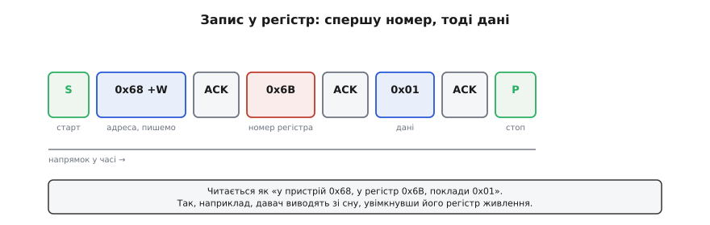
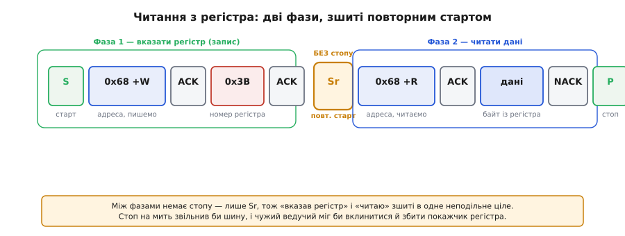
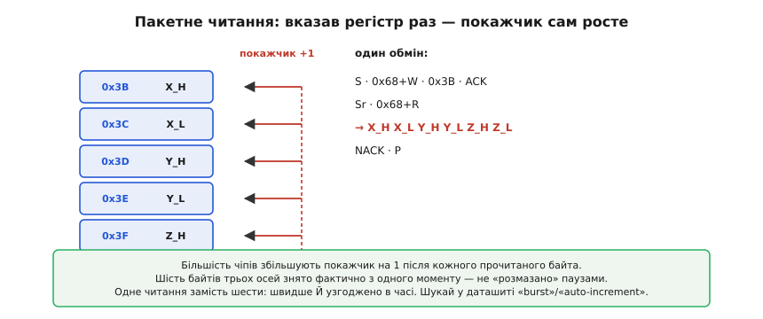
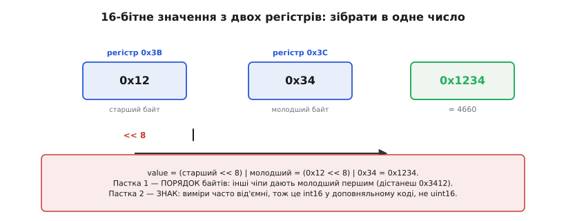
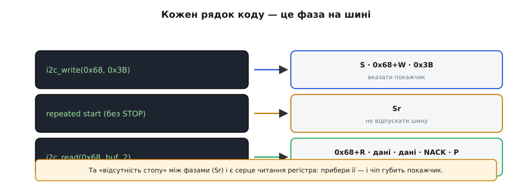
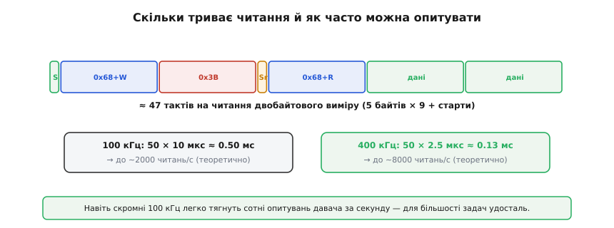

# Транзакція I2C

Самі по собі байти, адреси й підтвердження на шині I2C ще не кажуть, як працювати з реальним давачем. Коли під'єднуєш його, постає конкретне питання: що саме йому **слати**, щоб він прокинувся й віддав вимір? Відповідь майже завжди та сама, бо майже всі I2C-чіпи влаштовані однаково — як набір **регістрів**. Хто опанував цей один патерн «доступу до регістрів», той зможе «заговорити» практично з будь-яким давачем, дисплеєм чи мікросхемою пам'яті.

### Чіп зсередини: набір регістрів

Усередині I2C-пристрій — це не загадкова «чорна скринька», а впорядкований набір **регістрів** (*register*, від латинського *regerere* — «заносити, записувати»): пронумерованих комірок, кожна зі своїм призначенням. Одні регістри — для **налаштувань** (увімкнути давач, задати діапазон, фільтр), інші — для **даних** (виміри), ще інші — для **стану** (чи готовий новий вимір).


*Типовий давач має десятки регістрів: WHO_AM_I (перевірити, що це справді він), PWR_MGMT (увімкнути або приспати), CONFIG (діапазон, фільтр), DATA_* (самі виміри), STATUS (готовність). Доступ — за номером регістра, точно як до [комірок пам'яті з адресами](book:programming/memory-mapped-io).*

Це той самий принцип [**memory-mapped IO**](topic:programming/memory-mapped-io): «торкнутися» периферії означає прочитати або записати комірку за номером. Тільки тут комірки лежать не в адресному просторі процесора, а **всередині чужого чіпа**, і дотягуєшся до них по двох дротах I2C. Тож уся робота з давачем зводиться до двох дій: **записати** потрібні значення в регістри-налаштування й **прочитати** виміри з регістрів-даних.

### Запис у регістр

Запис простіший, тож із нього й видно базовий малюнок обміну. Після адреси з бітом W ведучий шле **перший** байт, який чіп трактує особливо: це **номер регістра**, у який писатимемо. Усі наступні байти — це дані, що туди лягають.


*СТАРТ → адреса 0x68 + W → ACK → номер регістра 0x6B → ACK → дані 0x01 → ACK → СТОП. Читається як «записати 0x01 у регістр 0x6B пристрою 0x68». Так, наприклад, давач виводять зі сну, увімкнувши його регістр живлення.*

Логіка проста: «у пристрої 0x68, у регістр 0x6B, поклади 0x01». Коли слати кілька байтів даних поспіль, більшість чіпів кладе їх у **сусідні** регістри: внутрішній покажчик сам зростає на 1 після кожного байта. Так одним обміном налаштовують одразу кілька регістрів.

### Читання з регістра: дві фази

Читання має тонкість, через яку спотикаються новачки. Не можна просто «попросити дані» — спершу треба **сказати чіпу, який регістр** тебе цікавить. Тому читання з регістра — це **дві фази**.


*Фаза 1 — короткий запис: старт, адреса з бітом W, номер регістра 0x3B (це лише встановлює внутрішній покажчик регістра, даних не пишемо). Фаза 2 — повторний старт (Sr), адреса з бітом R, і тепер читаємо дані з того регістра. Між фазами немає СТОПу — лише Sr, тож операція неподільна.*

За цим стоїть внутрішній **покажчик регістра**. Фаза 1 — це фактично «холостий» запис: ведучий пише лише **номер** регістра, встановлюючи покажчик, але самих даних не дає. Далі — [**повторний старт**](topic:communications/start-stop-ack) (Sr), зміна напрямку на читання (адреса з бітом R), і чіп віддає байт або байти з того регістра, на який вказує покажчик. Чому Sr, а не СТОП і новий СТАРТ? Бо СТОП на мить звільнив би шину, і між «вказав регістр» і «читаю» міг би вклинитися інший ведучий, збивши покажчик. Повторний старт робить «вказав-і-прочитав» **атомарним** (*atomos*, грецьке «неподільний») — це найважливіша причина, чому Sr узагалі існує.

### Пакетне читання: авто-інкремент

Той самий покажчик регістра дає чудову економію. Більшість чіпів **автоматично збільшують** його на 1 після кожного прочитаного байта. Тож, указавши регістр **один раз**, можна читати багато байтів поспіль — і вони підуть із послідовних регістрів.


*Указавши покажчик на 0x3B і попросивши 6 байтів, дістаємо весь блок: старший і молодший байти осей X, Y, Z (регістри 0x3B…0x40). Покажчик сам зростає на 1 після кожного байта. Одне читання замість шести.*

Це **пакетне** (*burst*, англійське «черга, залп») читання, і воно цінне подвійно. По-перше, **швидкість**: один обмін на шість байтів замість шести окремих обмінів, кожен зі своїм стартом, адресою, повторним стартом. По-друге, і це часто важливіше, — **узгодженість у часі**: усі шість байтів (три осі) знято фактично з одного моменту, а не «розмазано» по черзі з паузами між окремими читаннями. Тому з багатовісного давача завжди бери **весь блок одним пакетом** — у даташиті це позначають словами «burst» чи «auto-increment».

### Багатобайтове значення

Часто один вимір не вміщається в байт. 16-бітне значення давач кладе у **два** регістри — старший байт і молодший. Прочитавши обидва, їх треба **зібрати** в одне число.


*Регістр 0x3B містить старший байт 0x12, регістр 0x3C — молодший 0x34. Зібране значення: (0x12 << 8) | 0x34 = 0x1234. Увага на порядок байтів (одні чіпи дають старший першим, інші молодший) і на знак (виміри часто у доповняльному коді).*

**Зібрати два байти в одне число.** Нехай зчитали старший байт 0x12 і молодший 0x34:

```
value = (старший << 8) | молодший
value = (0x12 << 8) | 0x34
value = 0x1200 | 0x34
value = 0x1234 = 4660
```

Тут чигають дві пастки. Перша — **порядок байтів**: різні чіпи віддають або старший байт першим, або молодший, і це треба звірити з даташитом, інакше дістанеш 0x3412 замість 0x1234. Друга — **знак**: виміри (прискорення, кутова швидкість) часто бувають **від'ємними**, тож 16 біт трактують як знакове число у [доповняльному коді](topic:math/twos-complement-algebra) — як `int16`, а не `uint16`.

### Робочий приклад: прочитати вісь давача

Зведімо все докупи в реальному коді. Візьмімо поширений інерціальний давач MPU-6050 (адреса 0x68): прочитаймо старший і молодший байти осі X акселерометра — це регістри 0x3B і 0x3C — і зберімо їх у знакове 16-бітне число. Код спирається лише на дві елементарні функції драйвера шини: `i2c_write` (СТАРТ, адреса з W, байти, без СТОПу) і `i2c_read` (повторний старт, адреса з R, читання, СТОП) — саме так їх дає більшість HAL-бібліотек МК.

:::tabs
```c
#include <stdint.h>

#define MPU_ADDR    0x68          // 7-бітна адреса давача на шині
#define REG_XOUT_H  0x3B          // старший байт осі X (далі X_L, Y_H … поспіль)

// Прочитати 16-бітну вісь X акселерометра.
int16_t read_accel_x(void) {
    uint8_t reg = REG_XOUT_H;     // номер регістра, з якого читаємо
    uint8_t raw[2];               // сюди ляжуть старший і молодший байти

    // Фаза 1: вказати покажчик на регістр 0x3B. STOP=false → буде повторний старт.
    i2c_write(MPU_ADDR, &reg, 1, /*stop=*/false);

    // Фаза 2: Sr + адреса з R, читаємо 2 байти поспіль (авто-інкремент покажчика).
    i2c_read(MPU_ADDR, raw, 2);   // raw[0] = 0x3B (старший), raw[1] = 0x3C (молодший)

    // Зібрати знакове значення: старший << 8, тоді домалювати молодший.
    return (int16_t)((raw[0] << 8) | raw[1]);
}
```
```python
import struct
from machine import I2C           # MicroPython: та сама шина на рівні HAL

MPU_ADDR   = 0x68                 # 7-бітна адреса давача на шині
REG_XOUT_H = 0x3B                 # старший байт осі X (далі X_L, Y_H … поспіль)

def read_accel_x(i2c: I2C) -> int:
    """Прочитати 16-бітну вісь X акселерометра."""
    # Фаза 1: вказати покажчик на регістр 0x3B. stop=False → буде повторний старт.
    i2c.writeto(MPU_ADDR, bytes([REG_XOUT_H]), False)

    # Фаза 2: Sr + адреса з R, читаємо 2 байти поспіль (авто-інкремент покажчика).
    raw = i2c.readfrom(MPU_ADDR, 2)   # raw[0] = 0x3B (старший), raw[1] = 0x3C (молодший)

    # Зібрати знакове значення: '>h' = big-endian, старший байт першим, знаковий int16.
    return struct.unpack(">h", raw)[0]
```
:::

Уся транзакція тут — це `false` у першому виклику: він каже драйверу **не ставити СТОП**, а зшити дві фази повторним стартом. Прибери його — і між «вказав регістр» та «читаю» вставиться СТОП, після якого багато чіпів гублять покажчик. Зведення `(int16_t)` — не косметика: без нього додатні на вигляд байти зберуться в `uint16_t` і від'ємне прискорення обернеться величезним додатнім числом.

### Та сама ідіома у Wire

У світі Arduino за I2C відповідає бібліотека `Wire`, і той самий доступ до регістра записують усталеною ідіомою. Ключ до неї — параметр `false` у `endTransmission`, рівно той самий «не відпускай шину», що й вище.

:::tabs
```cpp
// прочитати 2 байти з регістра 0x3B пристрою 0x68
Wire.beginTransmission(0x68);   // СТАРТ + адреса + W
Wire.write(0x3B);               // номер регістра (встановити покажчик)
Wire.endTransmission(false);    // false → НЕ СТОП, а повторний старт (Sr)!
Wire.requestFrom(0x68, 2);      // Sr + адреса + R, читаємо 2 байти
uint8_t hi = Wire.read();       // 1-й байт (Wire сам дає ACK)
uint8_t lo = Wire.read();       // 2-й байт (Wire дає NACK) + СТОП
int16_t value = (int16_t)((hi << 8) | lo);
```
```python
# прочитати 2 байти з регістра 0x3B пристрою 0x68 (Linux / Raspberry Pi, smbus2)
from smbus2 import SMBus

bus = SMBus(1)                          # шина I2C-1
hi, lo = bus.read_i2c_block_data(0x68, 0x3B, 2)  # запис реєстра + Sr + читання 2 байтів — усе в одному виклику
value = (hi << 8) | lo                  # зібрати старший і молодший байти
if value >= 0x8000:                     # трактувати як знаковий int16 (доповняльний код)
    value -= 0x10000
```
:::


*Кожен виклик відповідає фазі на шині: запис номера регістра встановлює покажчик, повторний старт зшиває фази без СТОПу, читання забирає байти. Те саме «без СТОПу» (Sr) і є той повторний старт, без якого читання регістра не працює.*

> 🔧 **Навіщо це.** Запам'ятай роль `endTransmission(false)`: **false** означає «не відпускай шину, буде повторний старт». Якщо помилково написати `true` (або просто `endTransmission()`), між «вказав регістр» і «читаю» вставиться СТОП — і багато чіпів після цього втратять покажчик і віддадуть не те. «Читаю не той регістр» або «завжди той самий байт» — класичний симптом саме цієї помилки. Тому шаблон «beginTransmission → write(reg) → endTransmission(false) → requestFrom» варто завчити як єдине ціле.

### Скільки це триває

Лишається прикинути час. Кожен байт — це **9** тактів ([8 біт плюс ACK](topic:communications/start-stop-ack)), плюс старти й адреси теж їдять такти.


*Читання двобайтового регістра — це приблизно старт + (адреса+W) + регістр + повторний старт + (адреса+R) + 2 байти даних ≈ 50 тактів. На 100 кГц це ≈ 0.5 мс, на 400 кГц ≈ 0.13 мс — тобто сотні-тисячі читань за секунду.*

**Як часто можна опитувати.** Порахуймо для читання 2-байтового виміру:

```
тактів ≈ 50  (5 байтів × 9 + старти/адреси)

100 кГц: 50 × 10 мкс  ≈ 0.50 мс/читання → до ~2000 читань/с (теоретично)
400 кГц: 50 × 2.5 мкс ≈ 0.13 мс/читання → до ~8000 читань/с (теоретично)
```

На практиці виходить менше (є паузи між викликами й обробка), але висновок ясний: навіть скромні 100 кГц легко тягнуть **сотні** опитувань давача за секунду — для переважної більшості задач цього з головою. А коли треба швидше (інерціальний давач на 1 кГц із пакетами), піднімають частоту до 400 кГц або беруть зовсім іншу, швидшу шину — [SPI](topic:communications/spi-bus).

Патерн доступу до регістрів мовчки спирається на дві умови: що ведений **встигає** за тактом ведучого і що ведучий на шині **один**. А якщо ведений не встигає підготувати дані? А якщо ведучих **кілька** і вони заговорять водночас? На ці два питання I2C має дві дотепні відповіді — [**розтягування такту** й **арбітраж**](topic:communications/clock-stretch-arbitration).

---
