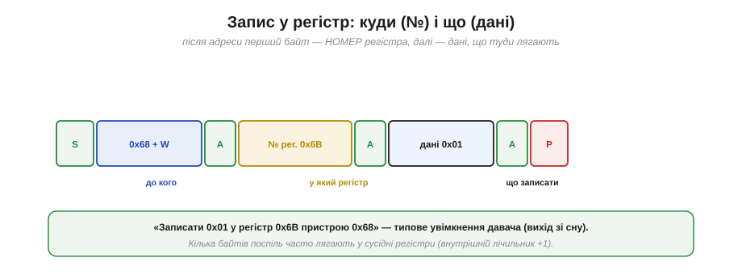

# Транзакція в часі: запис і читання

Самі по собі байти, адреси й підтвердження на шині I2C ще не кажуть, як працювати з реальним давачем. Коли під'єднуєш його, виникає конкретне питання: що саме йому **слати**, щоб він прокинувся й віддав вимір? Відповідь майже завжди та сама, бо майже всі I2C-чіпи влаштовані однаково — як набір **регістрів**. Опанувавши цей один патерн «доступу до регістрів», ти зможеш «заговорити» практично з будь-яким давачем, дисплеєм чи мікросхемою пам'яті. Розберімо його ґрунтовно.

### Чіп зсередини: набір регістрів

Усередині I2C-пристрій — це не загадкова «чорна скринька», а впорядкований набір **регістрів** (*registers*): пронумерованих комірок, кожна зі своїм призначенням. Одні регістри — для **налаштувань** (увімкнути давач, задати діапазон, фільтр), інші — для **даних** (виміри), ще інші — для **стану** (чи готовий новий вимір).


*Рис. Типовий давач має десятки регістрів: WHO_AM_I (перевірити, що це справді він), PWR_MGMT (увімкнути / режим сну), CONFIG (діапазон, фільтр), DATA_* (самі виміри), STATUS (готовність). Доступ — за номером регістра, точно як до [комірок пам'яті з адресами](book:programming/memory-mapped-io).*

Це той самий принцип [**memory-mapped IO**](book:programming/memory-mapped-io): «торкнутися» периферії — означає прочитати або записати комірку за номером. Тільки тут комірки лежать не в адресному просторі процесора, а **всередині чужого чіпа**, і дотягуєшся до них по двох дротах I2C. Тож уся робота з давачем зводиться до двох дій: **записати** потрібні значення в регістри-налаштування й **прочитати** виміри з регістрів-даних.

### Запис у регістр

Почнімо із запису — він простіший. Після адреси з бітом W ведучий шле **перший** байт, який чіп трактує особливо: це **номер регістра**, у який писатимемо. Усі наступні байти — це дані, що туди лягають.


*Рис. СТАРТ → адреса 0x68 + W → ACK → номер регістра 0x6B → ACK → дані 0x01 → ACK → СТОП. Читається як «записати 0x01 у регістр 0x6B пристрою 0x68». Так, наприклад, давач виводять зі сну, увімкнувши його регістр живлення.*

Логіка проста: «у пристрої 0x68, у регістр 0x6B, поклади 0x01». Якщо слати кілька байтів даних поспіль, більшість чіпів кладе їх у **сусідні** регістри (внутрішній покажчик сам зростає на 1 — про це нижче). Так одним обміном налаштовують одразу кілька регістрів.

### Читання з регістра: дві фази

А ось читання має тонкість, через яку спотикаються новачки. Не можна просто «попросити дані» — спершу треба **сказати чіпу, який регістр** тебе цікавить. Тому читання з регістра — це **дві фази**.


*Рис. Фаза 1 — короткий **запис**: старт, адреса+W, номер регістра 0x3B (це лише встановлює внутрішній «покажчик регістра», даних не пишемо). Фаза 2 — **повторний старт** (Sr), адреса+R, і тепер читаємо дані з того регістра. Між фазами немає СТОПу — лише Sr, тож операція неподільна.*

Розгорнімо логіку. Чіп має внутрішній **покажчик регістра**. Фаза 1 — це фактично «холостий» запис: ведучий пише лише **номер** регістра, встановлюючи покажчик, але самих даних не дає. Потім — [**повторний старт**](book:communications/start-stop-ack) (Sr), зміна напрямку на читання (адреса+R), і чіп віддає байт(и) з того регістра, на який вказує покажчик. Чому Sr, а не СТОП+СТАРТ? Бо СТОП на мить звільнив би шину, і між «вказав регістр» і «читаю» міг би вклинитися інший ведучий, збивши покажчик. Повторний старт робить «вказав-і-прочитав» **атомарним** — це найважливіша причина, чому Sr узагалі існує.

### Пакетне читання: авто-інкремент

Згаданий покажчик регістра дає чудову економію. Більшість чіпів **автоматично збільшують** його на 1 після кожного прочитаного байта. Тож, указавши регістр **один раз**, можна читати багато байтів поспіль — і вони підуть із послідовних регістрів.


*Рис. Указавши покажчик на 0x3B і попросивши 6 байтів, дістаємо весь блок: старший і молодший байти осей X, Y, Z (регістри 0x3B…0x40). Покажчик сам зростає на 1 після кожного байта. Одне читання замість шести.*

Це **пакетне** (*burst*) читання, і воно цінне подвійно. По-перше, **швидкість**: один обмін на шість байтів замість шести окремих обмінів (кожен зі своїм стартом, адресою, повторним стартом). По-друге, і це часто важливіше, — **узгодженість у часі**: усі шість байтів (три осі) знято фактично з одного моменту, а не «розмазано» по черзі з паузами між окремими читаннями. Тому, читаючи багатовісний давач, завжди бери **весь блок одним пакетом** — шукай у даташиті слова «burst» чи «auto-increment».

### Багатобайтове значення

Часто один вимір не вміщається в байт. 16-бітне значення давач кладе у **два** регістри — старший байт і молодший. Прочитавши обидва, їх треба **зібрати** в одне число.


*Рис. Регістр 0x3B містить старший байт 0x12, регістр 0x3C — молодший 0x34. Зібране значення: (0x12 << 8) | 0x34 = 0x1234. Увага на порядок байтів (одні чіпи дають старший першим, інші молодший) і на знак (виміри часто у доповняльному коді).*

**Приклад (зібрати два байти в одне число).** Нехай зчитали старший байт 0x12 і молодший 0x34:

```
value = (старший << 8) | молодший
value = (0x12 << 8) | 0x34
value = 0x1200 | 0x34
value = 0x1234 = 4660
```

Тут чигають дві пастки. Перша — **порядок байтів**: різні чіпи віддають або старший байт першим, або молодший, і це треба звірити з даташитом (інакше дістанеш 0x3412 замість 0x1234). Друга — **знак**: виміри (прискорення, кутова швидкість) часто бувають **від'ємними**, тож 16 біт трактують як знакове число у [доповняльному коді](book:math/twos-complement) — як `int16`, а не `uint16`.

### У коді: ідіома Wire

Як це виглядає в реальному коді? У світі Arduino за I2C відповідає бібліотека `Wire`, і доступ до регістра записують усталеною ідіомою. Ключ до неї — параметр `false` у `endTransmission`.

```
// прочитати 2 байти з регістра 0x3B пристрою 0x68
Wire.beginTransmission(0x68);   // СТАРТ + адреса + W
Wire.write(0x3B);               // номер регістра (встановити покажчик)
Wire.endTransmission(false);    // false → НЕ СТОП, а повторний старт (Sr)!
Wire.requestFrom(0x68, 2);      // Sr + адреса + R, читаємо 2 байти
uint8_t hi = Wire.read();       // 1-й байт (Wire сам дає ACK)
uint8_t lo = Wire.read();       // 2-й байт (Wire дає NACK) + СТОП
int16_t value = (int16_t)((hi << 8) | lo);
```


*Рис. Кожен рядок коду відповідає фазі на шині: beginTransmission → старт+адреса+W, write → номер регістра, endTransmission(**false**) → не СТОП, а повторний старт, requestFrom → Sr+адреса+R і читання. Те саме «false» і є той повторний старт, без якого читання регістра не працює.*

> 🔧 **Навіщо це.** Запам'ятай роль `endTransmission(false)`: **false** означає «не відпускай шину, буде повторний старт». Якщо помилково написати `true` (або просто `endTransmission()`), між «вказав регістр» і «читаю» вставиться СТОП — і багато чіпів після цього втратять покажчик і віддадуть не те. «Читаю не той регістр» або «завжди той самий байт» — класичний симптом саме цієї помилки. Тому шаблон «beginTransmission → write(reg) → endTransmission(false) → requestFrom» варто завчити як єдине ціле.

### Скільки це триває

Насамкінець прикиньмо час. Кожен байт — це **9** тактів ([8 біт плюс ACK](book:communications/start-stop-ack)), плюс старти й адреси теж їдять такти.


*Рис. Читання двобайтового регістра — це приблизно старт + (адреса+W) + регістр + повторний старт + (адреса+R) + 2 байти даних ≈ 50 тактів. На 100 кГц це ≈ 0.5 мс, на 400 кГц ≈ 0.13 мс — тобто сотні-тисячі читань за секунду.*

**Приклад (як часто можна опитувати).** Порахуймо для читання 2-байтового виміру:

```
тактів ≈ 50  (5 байтів × 9 + старти/адреси)

100 кГц: 50 × 10 мкс  ≈ 0.50 мс/читання → до ~2000 читань/с (теоретично)
400 кГц: 50 × 2.5 мкс ≈ 0.13 мс/читання → до ~8000 читань/с (теоретично)
```

На практиці виходить менше (є паузи між викликами й обробка), але висновок ясний: навіть скромні 100 кГц легко тягнуть **сотні** опитувань давача за секунду — для переважної більшості задач цього з головою. Якщо ж треба швидше (інерціальний давач на 1 кГц із пакетами), піднімають частоту до 400 кГц або беруть зовсім іншу, швидшу шину — [SPI](book:communications/spi-bus).

Цей патерн доступу до регістрів мовчки спирається на дві умови: що ведений **встигає** за тактом ведучого і що ведучий на шині **один**. А якщо ведений не встигає підготувати дані? А якщо ведучих **кілька** і вони заговорять водночас? На ці два питання I2C має дві дотепні відповіді — [**розтягування такту** й **арбітраж**](book:communications/clock-stretch-arbitration).

---
