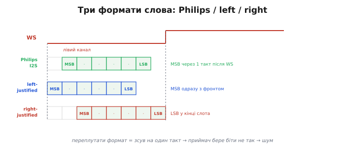
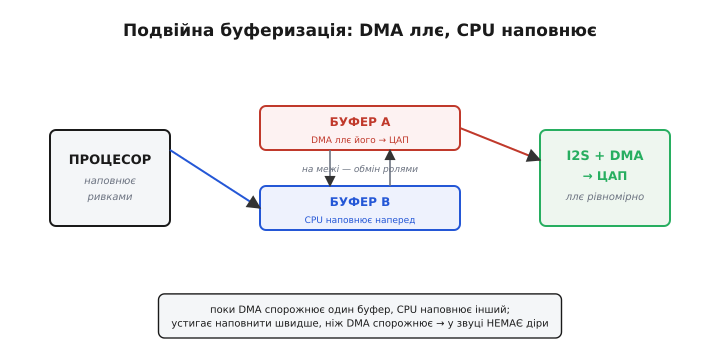

# ⚙️ Завести I2S-передавач: безперервний стереопотік через DMA

**Задача.** Маємо мікроконтролер і зовнішній аудіо-ЦАП (чи кодек) на I2S. Треба змусити процесор **безперервно, роками, без єдиної паузи** лити в ЦАП стереозвук — щоб на виході грав, скажімо, синус чи файл із флешки, і при цьому ядро **не стояло** в очікуванні кожного відліку. Усе на реальному C прошивки: налаштувати три частоти (fs, SCK, WS), обрати формат кадру, спакувати 16-бітні відліки лівого й правого каналів у буфер, і віддати цей буфер потоком на DMA з подвійною буферизацією, щоб апаратура тягла звук сама.

**Ідея.** Тут стикаються дві несумісні швидкості. ЦАП вимагає **новий відлік кожні 1/fs секунди** — для 48 кГц це один стереовідлік кожні 20.8 мікросекунди, залізно, без права спізнитися. А процесор працює **ривками**: то рахує синус, то обробляє переривання таймера, то на мілісекунду застряг у чужому коді. Якщо змусити ядро подавати кожен відлік вручну — перша ж затримка на 21 мкс дасть чутний тріск. Тож між ривковим процесором і рівномірним ЦАП ставлять **буфер-прокладку** й **DMA-контролер**, який спорожняє цей буфер із незворушною рівномірністю, поки процесор наповнює його наперед. Уся вправа — про те, як зробити цю прокладку **достатньо глибокою**, щоб найдовший ривок процесора вклався в її запас.

> 🔧 **Навіщо це.** Це не навчальний приклад заради прикладу — це буквально те, що крутиться всередині будь-якого пристрою, що видає звук: bluetooth-колонка, синтезатор, домофон, іграшка, що говорить. У всіх усередині — I2S-передавач із DMA. Хто розуміє цей каркас, той за годину заведе звук на новому чіпі; хто ні — тижнями воюватиме з тріском і не розумітиме, звідки він.

---

## Крок 1. Три частоти в тактовому дереві

Перш ніж лити дані, треба виставити такти. Три частоти вкладені одна в одну жорстким співвідношенням: WS цокає з частотою відліків, SCK мусить устигнути протактувати всі біти кадру, а MCLK — окремий швидкий такт, якого сама шина не потребує, але його часто вимагає ЦАП для внутрішньої математики.

```
WS   = fs                                  // вибір слова = частота відліків
SCK  = fs × (біт на канал) × (кількість каналів)
MCLK = fs × 256                            // якщо конкретний ЦАП просить (типово)

приклад: fs = 48 кГц, 16 біт, стерео
WS   = 48 000 Гц       = 48 кГц
SCK  = 48000 × 16 × 2   = 1 536 000 Гц ≈ 1.536 МГц
MCLK = 48000 × 256      = 12 288 000 Гц ≈ 12.288 МГц
```

На практиці ти не виставляєш SCK напряму. Ти кажеш периферії три речі — частоту відліків, розрядність слова, кількість каналів — а вона сама ділить свій вхідний такт так, щоб отримати потрібні SCK і WS. Ось налаштування на прикладі I2S-периферії ESP32-класу (імена регістрів і полів — з апаратного інтерфейсу; на іншому сімействі вони звуться інакше, але зміст той самий):

```c
#include <stdint.h>

// Опис бажаного потоку — усе, що треба, щоб апаратура вивела три частоти.
typedef struct {
    uint32_t sample_rate;   // fs, Гц (напр. 48000)
    uint8_t  bits;          // біт на канал (16, 24, 32)
    uint8_t  channels;      // 2 для стерео
    uint8_t  need_mclk;     // 1, якщо ЦАП вимагає окремий MCLK
} i2s_format_t;

void i2s_tx_set_clocks(const i2s_format_t *f) {
    // 1) MCLK. Багато чіпів беруть MCLK = 256·fs; периферія дає його на пін.
    //    SCK потім породжується як частка від MCLK.
    uint32_t mclk_hz = f->sample_rate * 256;

    // 2) Дільник MCLK → SCK. Скільки тактів SCK у одному MCLK-циклі кадру:
    //    SCK = fs · bits · channels, тож дільник = MCLK / SCK.
    uint32_t sck_hz  = f->sample_rate * f->bits * f->channels;
    uint32_t bck_div = mclk_hz / sck_hz;         // = 256 / (bits·channels)

    I2S_CLKM_CONF   = clkm_from_hz(mclk_hz);      // тактовий блок → MCLK
    I2S_TX_BCK_DIV  = bck_div;                     // MCLK / bck_div = SCK
    // WS виводиться апаратно як SCK / (bits·channels) — його не задають окремо.
}
```

Головне побачити тут ланцюжок ділень: з одного опорного генератора виводиться MCLK, з нього діленням — SCK, а з SCK ще одним діленням — WS. Помилка в будь-якому дільнику зсуває **всю** піраміду: збився SCK — «поповзе» кадр; збився дільник WS — зіб'ється темп і звук піде вище чи нижче тоном.

> 🔌 Багато зовнішніх аудіо-ЦАП поводяться однаково: приймають I2S на вхід, часто вимагають окремий MCLK = 256·fs, а керуються дрібними командами по I2C. Типова розпіновка такого класу чіпів, підключення й спільні граблі — у [зовнішньому аудіо-ЦАП](book:electronics/dac/comp-external-dac.md). Тут для нас важливе одне: MCLK — окрема лінія, і якщо чіп її просить, а її нема, він мовчить, хоч SCK/WS/SD ідеальні.

---

## Крок 2. Формат кадру: один рядок, що вирішує «музика чи шум»

Тепер найпідступніше налаштування. Периферія вміє класти слово в слот каналу трьома способами, і вони **несумісні**: справжній I2S (Philips) зсуває старший біт на один такт після фронту WS, ліво­вирівняний (*left-justified*) кладе MSB прямо на фронт, право­вирівняний (*right-justified*) притискає молодший біт до кінця слота. Різниця — рівно **один такт**, але цей один такт зсуває кожне число до невпізнання.


*Той самий SCK і WS, різне місце слова. Philips I2S — старший біт через один такт після фронту WS; left-justified — старший біт одразу з фронтом; right-justified — молодший біт у кінці слота. Передавач і приймач мусять стояти на **тому самому** форматі, інакше приймач бере біти зі зсувом — і замість музики виходить шум.*

У коді це буквально одне поле. Але поставити його треба **узгоджено** з тим, що очікує ЦАП (дивись його даташит), інакше все інше — марно:

```c
// Формати, які вміє периферія. Значення — умовні коди регістра режиму.
#define I2S_FMT_PHILIPS   0   // «справжній» I2S: MSB через 1 такт після WS
#define I2S_FMT_LEFT_J    1   // left-justified: MSB одразу з фронтом WS
#define I2S_FMT_RIGHT_J   2   // right-justified: LSB притиснутий до кінця слота

void i2s_tx_set_format(uint8_t fmt, uint8_t bits, uint8_t channels) {
    uint32_t conf = 0;

    // Головний перемикач: де в слоті лежить слово. Одна помилка тут = шум.
    conf |= (fmt & 0x3) << TX_FORMAT_SHIFT;

    // Розрядність слова в слоті. Мусить дорівнювати очікуваній приймачем.
    conf |= (bits_code(bits)) << TX_BITS_SHIFT;

    // Стерео: два слова на кадр (лівий, тоді правий).
    if (channels == 2) conf |= TX_STEREO;

    // Порядок бітів: старшим уперед (MSB-first) — так вимагає I2S.
    conf |= TX_MSB_FIRST;

    I2S_TX_CONF = conf;
}
```

Три рядки — три частини домовленості з приймачем: **формат** (де слово в слоті), **розрядність** (скільки біт), **порядок** (старшим уперед). Розійшовся хоч в одному — приймач збиратиме біти не так. Найтиповіша аварія — залишити периферію в дефолтному left-justified, коли ЦАП чекає Philips I2S: усе під'єднано, SCK біжить, WS цокає, а з динаміка хрип. Виправлення — заміна одного значення `I2S_FMT_LEFT_J` на `I2S_FMT_PHILIPS`.

> 🔧 **Навіщо це.** Коли новий аудіочіп мовчить чи хрипить, а дроти цілі, перше підозрюване — саме це поле. Звір по даташиту, чого хоче чіп (Philips, left- чи right-justified), і чи стільки ж біт він очікує, скільки шле передавач. Дуже часто весь «ремонт» — перемкнути один режим. Ця звичка — звіряти формат насамперед — економить години з осцилографом.

---

## Крок 3. Спакувати відліки: L, R, L, R у знаковому коді

Тепер — власне дані. Стереовідлік — це **пара** чисел: рівень лівого каналу й рівень правого в один і той самий момент часу. Периферія хоче їх у буфері рівно в тому порядку, у якому їх поставить у слоти: спершу слово лівого каналу, тоді слово правого, тоді знову лівого — і так суцільним чергуванням `L R L R L R …`.

І тут — друга пастка, тонша за формат. Відліки звуку **знакові**: звукова хвиля гойдається навколо нуля, тож потрібні й додатні значення (мембрана вперед), і від'ємні (мембрана назад). Зберігають їх у [доповняльному коді](book:electronics/twos-complement-hardware) — тому тип має бути **`int16_t`**, а не `uint16_t`. Якщо переплутати знаковість, від'ємна половина хвилі перетвориться на величезні додатні числа, і замість чистого тону з динаміка полізе спотворений «пилообразний» брязкіт.

```c
#include <math.h>

// Заповнити буфер N стереовідліками синуса частотою freq_hz.
// Буфер — плаский масив int16_t: [L0, R0, L1, R1, L2, R2, ...].
// САМЕ int16_t (знаковий!): від'ємна половина хвилі — це від'ємні числа
// в доповняльному коді, а не «великі додатні».
static double phase = 0.0;   // фаза між викликами зберігається — інакше на
                             // стику буферів буде розрив хвилі → клац у звуці

void fill_sine(int16_t *buf, uint32_t frames,
               uint32_t fs, double freq_hz, double amp)
{
    double dphi = 2.0 * M_PI * freq_hz / (double)fs;   // приріст фази на відлік
    int16_t peak = (int16_t)(amp * 32767.0);           // амплітуда в шкалі int16

    for (uint32_t i = 0; i < frames; i++) {
        int16_t s = (int16_t)(peak * sin(phase));       // один знаковий відлік
        buf[2*i + 0] = s;    // лівий канал
        buf[2*i + 1] = s;    // правий канал (той самий тон в обидва вуха)
        phase += dphi;
        if (phase >= 2.0 * M_PI) phase -= 2.0 * M_PI;   // тримати фазу в межах
    }
}
```

Дві деталі тут несуть вагу. Перша — **чергування L/R прямо в плоскому масиві**: індекс `2*i` — лівий, `2*i+1` — правий; периферія читатиме буфер поспіль і сама розкладе парні слова в лівий слот, непарні в правий. Друга — **фаза `phase` статична**, живе між викликами. Якби ми щоразу починали синус з нуля, на межі кожного буфера хвиля стрибала б назад до нуля — а розрив хвилі вухо чує як періодичний клац. Безперервний звук вимагає, щоб кінець одного буфера гладко переходив у початок наступного; тому стан фази переносимо, а не скидаємо.

Для звуку з готового джерела (файл, потік) код той самий, лише замість `sin` — читання наступних відліків:

```c
// Те саме пакування, але відліки беруться з джерела (напр. декодера файлу).
void fill_from_source(int16_t *buf, uint32_t frames, audio_src_t *src) {
    for (uint32_t i = 0; i < frames; i++) {
        buf[2*i + 0] = src_next_sample(src, LEFT);   // знаковий int16
        buf[2*i + 1] = src_next_sample(src, RIGHT);
    }
}
```

---

## Крок 4. Подвійна буферизація: чому один буфер завжди рветься

Осердя всієї задачі. Спокуслива перша спроба — завести **один** буфер: заповнив, віддав DMA, чекаєш, поки виллється, заповнюєш знову. Але простеж, що відбувається в мить, коли DMA дійшов до кінця буфера. Він **спорожнив** усе; ЦАП вимагає наступний відлік уже за 20.8 мкс; а процесор тільки-но дізнався, що пора наповнювати, і ще навіть не почав рахувати нові числа. Виникає **діра**: DMA нема що подавати, ЦАП отримує тишу (або повторює старе), і в звуці — тріск. Це називають **недобігом** (*underrun*): споживач обігнав постачальника.

Ліки — **два** буфери й принцип «поки один граю, другий готую». DMA ллє з буфера A; тим часом процесор, не поспішаючи, заповнює буфер B. Щойно A вичерпано, DMA **без паузи** перемикається на вже готовий B і починає лити його; а процесор отримує сигнал «A звільнився» і наповнює тепер A. Ролі міняються місцями на кожному перемиканні — звідси й друга назва, **ping-pong**: м'ячик перестрибує між двома буферами, і жоден бік ніколи не чекає на інший.


*DMA безперервно ллє один буфер у периферію, а процесор тим часом наповнює другий. Дійшовши до кінця, DMA перемикається на вже готовий буфер (без паузи) і піднімає переривання «половина звільнилась» — процесор наповнює її, поки грає інша. Поки процесор устигає заповнити буфер швидше, ніж DMA його спорожнює, у звуці **немає жодної діри**.*

> 🔧 **Навіщо це.** Уся глибина проблеми — у грі двох темпів. DMA спорожнює буфер із **незмінним** темпом fs. Процесор наповнює **ривками**: коли вільний — миттєво, коли зайнятий чужим перериванням — із затримкою. Подвійна буферизація дає процесору **фору** розміром у цілий буфер: він мусить лише встигнути заповнити наступний буфер до того, як DMA доп'є поточний. Якщо найдовший ривок процесора коротший за час програвання буфера — звук іде вічно без єдиної діри. Це і є критерій вибору глибини буфера, до якого ми зараз дійдемо.

Механізм під капотом — той самий **ланцюг DMA-дескрипторів**, замкнений у кільце рівно з двох вузлів: `next` останнього вказує назад на перший, і апаратура крутить це кільце безкінечно, піднімаючи переривання на межі кожного вузла.

> 🔧 Як саме дескриптори DMA зчіплюються в кільце й чому один старт каналу жене потік безперервно — у [дескрипторах зв'язаним списком](book:programming/dma-channels/proj-descriptors.md). Коротко: кожен буфер описано вузлом-структурою з полями «адреса, довжина, next»; замкнувши `next` останнього на перший, дістаєш нескінченне кільце, яке DMA обходить сам, а на межі вузла сигналить ядру перериванням.

---

## Крок 5. Робочий каркас передачі

Зберемо все докупи. Оголосимо два буфери, опишемо їх кільцем дескрипторів, запустимо DMA — і далі вся робота ядра зведеться до одного: за перериванням «буфер звільнився» наповнити той, що звільнився. Це справжній кістяк потокового I2S-виводу.

```c
#include <stdint.h>
#include <string.h>

#define FS         48000u        // частота відліків, Гц
#define CHANNELS   2u            // стерео
#define FRAMES     256u          // стереовідліків у одному буфері (див. розрахунок нижче)
#define WORDS      (FRAMES * CHANNELS)   // слів int16 у буфері: L,R × FRAMES

// Два буфери в RAM, доступній DMA. Живуть увесь час роботи → static.
static int16_t buf_a[WORDS];
static int16_t buf_b[WORDS];

// Два DMA-дескриптори, зчеплені в кільце: A → B → A → ...
static dma_desc_t desc[2];

// Прапорець «який буфер щойно звільнив DMA» — виставляє ISR, читає main-цикл.
static volatile int free_idx = -1;

void i2s_stream_start(void) {
    // 1) частоти й формат — з попередніх кроків
    i2s_format_t fmt = { .sample_rate = FS, .bits = 16,
                         .channels = CHANNELS, .need_mclk = 1 };
    i2s_tx_set_clocks(&fmt);
    i2s_tx_set_format(I2S_FMT_PHILIPS, 16, CHANNELS);

    // 2) заповнити ОБИДВА буфери наперед, поки DMA ще стоїть, — щоб на
    //    старті вже було що лити (інакше перший же кадр буде тишею)
    fill_sine(buf_a, FRAMES, FS, 440.0, 0.5);
    fill_sine(buf_b, FRAMES, FS, 440.0, 0.5);

    // 3) описати буфери вузлами й замкнути в кільце (next останнього → перший)
    desc[0] = (dma_desc_t){ .buf = (uint8_t*)buf_a, .length = sizeof(buf_a),
                            .size = sizeof(buf_a), .owner = 1, .eof = 1,
                            .next = &desc[1] };
    desc[1] = (dma_desc_t){ .buf = (uint8_t*)buf_b, .length = sizeof(buf_b),
                            .size = sizeof(buf_b), .owner = 1, .eof = 1,
                            .next = &desc[0] };   // ← кільце: назад на перший

    // 4) один старт: даємо адресу першого вузла, вмикаємо переривання «вузол
    //    доллято», пускаємо передавач — далі DMA крутить кільце сам
    i2s_tx_enable_irq(I2S_TX_EOF);      // переривання на межі кожного буфера
    dma_start_tx(&desc[0]);
    i2s_tx_start();
}

// Переривання: DMA доллято черговий буфер. Кажемо main-циклу, який саме
// звільнився, щоб той його наповнив. У самій ISR НІЧОГО важкого не рахуємо.
void i2s_tx_isr(void) {
    dma_desc_t *done = dma_current_eof_desc();   // який вузол щойно доллято
    free_idx = (done == &desc[0]) ? 0 : 1;       // 0 → buf_a вільний, 1 → buf_b
    dma_clear_eof_flag();
}

// Головний цикл: наповнює той буфер, що звільнився. Устигнути треба ДО того,
// як DMA доллє інший буфер, — у цьому весь запас часу подвійної буферизації.
void i2s_stream_service(void) {
    if (free_idx == 0) { fill_sine(buf_a, FRAMES, FS, 440.0, 0.5); free_idx = -1; }
    if (free_idx == 1) { fill_sine(buf_b, FRAMES, FS, 440.0, 0.5); free_idx = -1; }
}
```

Придивись до розподілу праці. **DMA** робить важке — рівномірно перекладає слово за словом із RAM у периферію, тисячі разів на секунду, без участі ядра. **Переривання** робить крихітне — лише позначає, який буфер звільнився (жодних обчислень: важка робота в ISR з'їла б час і сама спричинила недобіг). **Головний цикл** робить решту — наповнює звільнений буфер, коли дійдуть руки. Процесор вільний майже весь час; він зобов'язаний тільки одне — устигнути з наповненням у межах запасу.

Зверни увагу на дрібницю з `free_idx`: він `volatile`, бо його пише переривання, а читає головний цикл. Без `volatile` компілятор міг би вирішити, що між двома читаннями значення не змінюється, і закешувати його в регістрі — і головний цикл ніколи б не побачив сигналу від ISR.

---

## Крок 6. Скільки саме буфера? Рахуємо глибину під найдовший ривок

Тепер відповідь на головне питання інженерії: **наскільки глибокі** мають бути буфери. Замалі — недобіг і тріск; завеликі — марна RAM і зайва затримка звуку. Правильну глибину дає простий розрахунок часу.

Один буфер грає рівно стільки, скільки в ньому відліків, поділити на частоту відліків:

```
час програвання буфера  =  FRAMES / fs

приклад: FRAMES = 256, fs = 48 000 Гц
t_buf = 256 / 48000 = 0.00533 с ≈ 5.33 мс
```

Це і є **фора** процесора: у нього є 5.33 мс, щоб заповнити наступний буфер, поки DMA доп'є поточний. Умова відсутності тріску одна:

```
t_buf  >  (найдовший час, на який процесор може відволіктися)
```

Тобто буфер має грати **довше**, ніж найтриваліший ривок, коли ядру ніколи наповнювати звук: довге чуже переривання, робота з флешкою, повільна бібліотека. Якщо в системі найгірша така пауза — 2 мс, то 5.33 мс буфера дає впевнений запас (більш ніж удвічі). А якщо в системі буває пауза 8 мс (наприклад, стирання сторінки флешу) — 256 відліків **замало**, буде тріск, і треба глибше:

```
потрібно FRAMES, щоб перекрити паузу 8 мс при fs = 48 кГц:
FRAMES  >  fs × t_пауза  =  48000 × 0.008  =  384 відліки
беремо з запасом: FRAMES = 512  →  t_buf = 512/48000 ≈ 10.7 мс
```

**Приклад (порахувати мінімальну глибину).** Дано найгіршу затримку системи й частоту — знайти глибину буфера з дворазовим запасом:

```c
#include <stdint.h>

// Мінімум відліків у буфері, щоб пережити паузу worst_ms без недобігу,
// із запасом ×2. Округлюємо вгору до степеня двійки (зручно для DMA).
uint32_t buffer_frames(uint32_t fs, uint32_t worst_ms) {
    uint32_t need = (fs * worst_ms) / 1000u;    // відліків за час паузи
    need *= 2;                                    // запас ×2
    uint32_t p = 64;                              // мінімум розумної глибини
    while (p < need) p <<= 1;                     // до степеня двійки вгору
    return p;
}

// приклад: fs=48000, найгірша пауза 8 мс
//   need = 48000*8/1000 = 384; ×2 = 768; вгору до 2^n → 1024 відліки
//   t_buf = 1024/48000 ≈ 21.3 мс запасу
```

Ось де ховається компроміс. Глибший буфер надійніший проти тріску, але додає **затримку**: звук, який ти поклав у буфер зараз, вийде з динаміка аж через кілька мілісекунд. Для музики це байдуже; для чогось із реакцією в реальному часі (моніторинг мікрофона у власні вуха, гра) зайва затримка помітна. Тому глибину беруть **найменшу, що надійно перекриває найгірший ривок системи** — не більше й не менше.

---

## Складність і пастки

- **Недобіг (underrun) — головний ворог.** Процесор не встиг заповнити буфер до того, як DMA його доп'є → ЦАП отримує тишу чи повтор → тріск. Причини: замалі буфери, надто важка робота в перериванні, довга блокувальна операція (флеш, друк у консоль) у циклі наповнення. Ліки — рахувати глибину під **найгірший** ривок (Крок 6), а не під середній, і не тримати важких обчислень в ISR.

- **Неузгоджений формат = чистий шум.** Передавач у left-justified, приймач чекає Philips I2S (чи навпаки) — зсув на один такт спотворює кожне число. Дроти цілі, такти йдуть, а з динаміка хрип. Перша перевірка при «немає звуку» — звірити формат по даташиту ЦАП і виставити той самий у периферії. Це один рядок (Крок 2), але його забувають найчастіше.

- **Знаковість відліків.** Тип буфера — **`int16_t`**, не `uint16_t`. Звук знаковий: від'ємна половина хвилі має бути від'ємними числами в [доповняльному коді](book:electronics/twos-complement-hardware). Переплутав знаковість — від'ємні відліки стають гігантськими додатними, і чистий тон перетворюється на різкий спотворений брязкіт. Помилку легко проґавити, бо код компілюється й «щось грає».

- **MCLK окремо.** SCK/WS/SD — це вся шина I2S, але багато ЦАП додатково вимагають **MCLK** (типово 256·fs) для своєї внутрішньої дельта-сигма математики. Забув подати MCLK на пін — чіп мовчить, хоч три основні лінії ідеальні. Перевір у даташиті, чи потрібен MCLK, і чи виводить його твоя периферія.

- **Розрив хвилі на стику буферів.** Наповнюєш кожен буфер «з нуля» (скидаєш фазу синуса, починаєш файл спочатку) → на межі буферів сигнал стрибає → періодичний клац у ритмі буфера. Стан генератора (фаза, позиція у файлі) має **переноситися** між буферами, а не скидатися (Крок 3, статична `phase`).

- **Не заповнив обидва буфери перед стартом.** Пустив DMA, а буфери порожні (чи заповнено лише один) → перший кадр — тиша чи сміття. Обидва буфери наповнюють **до** `dma_start` (Крок 5).

- **Забув `volatile` на прапорці ISR↔main.** Прапорець «буфер звільнився» пише переривання, читає головний цикл. Без `volatile` компілятор може закешувати його в регістрі, і цикл ніколи не побачить сигналу — наповнення не відбудеться, буде недобіг. Той самий клас помилки, що й будь-де при спільній змінній переривання й фонового коду.

- **Буфери й дескриптори — у DMA-доступній RAM, `static`.** Локальний масив на стеку зникне, щойно функція поверне керування, а DMA ще читатиме з нього — гратиме сміття або зіб'ється зовсім. Плюс на деяких чіпах DMA бачить не всю пам'ять (окрема морока з кешем і вирівнюванням), тож буфери кладуть у ту область, до якої канал має доступ.

Зібравши ці шматки — три частоти з одного опорного такту, один правильний рядок формату, знакове пакування L/R із перенесенням стану, два буфери в кільці дескрипторів і розрахунок глибини під найгірший ривок — дістаєш повний робочий каркас безперервного I2S-виводу. Далі змінюється хіба джерело звуку (синус, файл, мікшер) і числа fs/розрядності з даташита ЦАП, а кістяк лишається тим самим: DMA рівномірно ллє, процесор ривками наповнює, буфер-прокладка згладжує різницю темпів.
