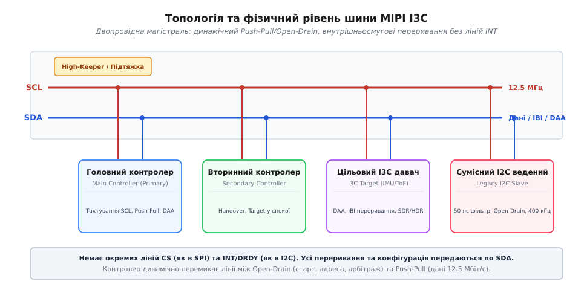
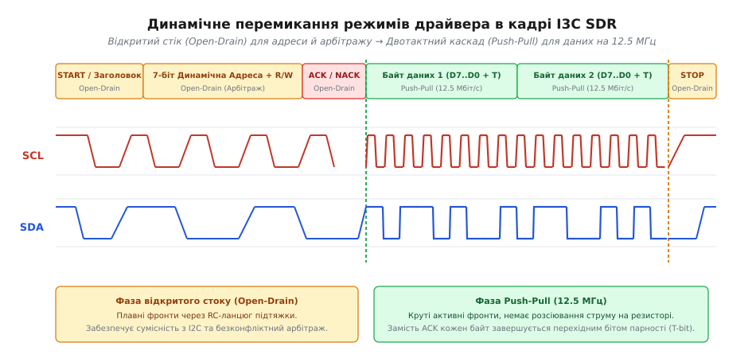
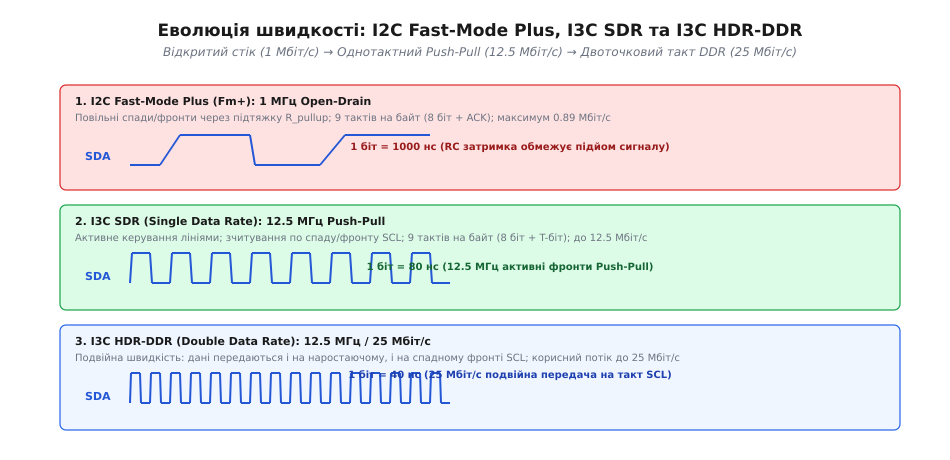
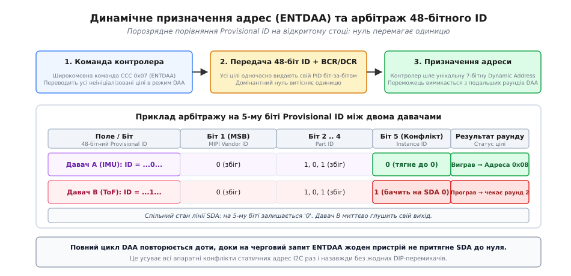
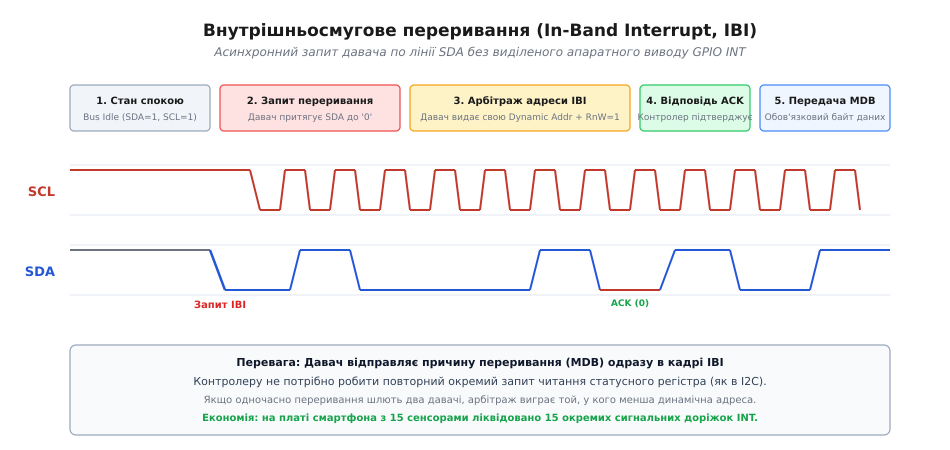

# Шина I3C

<preknowlist>
- [Двопровідна шина: лінія даних і лінія такту](book:communications/i2c-bus) — фізичний рівень з лініями SDA/SCL, резистори підтяжки та логіка відкритого стоку.
- [Адресація I2C](book:communications/i2c-addressing) — 7-бітні адреси, кадр адреси на шині та конфлікти статичної адресації.
- [Вихід з відкритим стоком](book:electronics/open-drain) — комутація спільних сигнальних ліній кількома транзисторами без короткого замикання.
- [Шаблон виводу готовності даних DRDY](book:communications/drdy-pattern) — використання виділених ліній GPIO для асинхронного сповіщення процесора давачами.
- [Швидкісні режими I2C](book:communications/i2c-speeds) — стандартні обмеження частоти шини через паразитну ємність та опір підтяжки.
</preknowlist>

Сучасні вбудовані платформи, мобільні пристрої, польотні контролери безпілотних апаратів та серверні модулі пам'яті вимагають одночасного підключення від десяти до двадцяти мікроелектромеханічних сенсорів (MEMS IMU, барометрів, магнітометрів, далекомірів Time-of-Flight, давачів струму, термометрів та контролерів живлення). Використання класичної шини I2C на швидкості 400 кГц або 1 МГц створює нездоланний дефіцит пропускної здатності: безперервне зчитування 12 байтів вимірів 6-осьового акселерометра-гіроскопа з частотою дискретизації 1 кГц забирає понад 34% усього часового ресурсу каналу зв'язку, а резистори підтяжки постійно розсіюють струм при утриманні ліній у нулі. Найбільш критичним обмеженням I2C є повна відсутність власного протокольного механізму асинхронних сповіщень: кожен сенсор вимагає окремого фізичного виводу та доріжки переривання (*INT / DRDY*), перетворюючи трасування друкованої плати на масив із 15–20 виділених ліній, що швидко вичерпує виводи мікроконтролера. Шина SPI зі швидкісними двотактними виходами знімає проблему швидкості, проте вимагає окремої лінії вибору кристала (*Chip Select*, CS) до кожного чипа.

Інтерфейс **MIPI I3C** (*Improved Inter-Integrated Circuit*, специфікації v1.0 та v1.1.1 Basic) розв'язує цю системну кризу: зберігаючи топологічну простоту I2C (лише два сигнальні провідники — SDA та SCL), він впроваджує динамічне перемикання вихідних каскадів між відкритим стоком та двотактним режимом Push-Pull на частоті 12.5 МГц, забезпечуючи швидкість до 12.5 Мбіт/с у базовому режимі SDR та до 33.3 Мбіт/с у режимах HDR. Повна ліквідація виділених доріжок переривань досягається через внутрішньосмугові запити (*In-Band Interrupts*, IBI), апаратні конфлікти адрес усуваються процедурою динамічного призначення адрес (*Dynamic Address Assignment*, DAA) на основі 48-бітного ідентифікатора, а керування периферією стандартизовано через систему спільних командних кодів (*Common Command Codes*, CCC) за повної збереженої сумісності з веденими I2C-чипами.


*Двопровідна шина MIPI I3C: головний та вторинний контролери, I3C-давачі та сумісні ведені I2C. Сигнальні лінії SCL і SDA динамічно перемикаються між відкритим стоком і двотактним каскадом; окремі лінії переривань і вибору кристала відсутні.*

Детальний аналіз передумов формування стандарту та інженерних суперечок усередині консорціуму наведено у нарисі [історія створення специфікації MIPI I3C](book:communications/i3c/hist-mipi-i3c.md).

---

### Фізичний рівень: подолання бар'єра відкритого стоку та динамічний Push-Pull

Головне фізичне обмеження класичного I2C полягає в асиметрії фронтів сигналу через використання схеми [відкритого стоку](book:electronics/open-drain):
1. **Спад сигналу (перехід `1 → 0`):** здійснюється активним відкриттям внутрішнього N-канального польового транзистора, який швидко розряджає паразитну ємність лінії на землю за кілька наносекунд.
2. **Наростання сигналу (перехід `0 → 1`):** здійснюється пасивно, виключно через зовнішній підтягувальний резистор `R_pullup`. Заряджання сумарної паразитної ємності шини `C_bus` (ємність доріжок плати та виводів чипів) відбувається за експоненційним законом із постійною часу `τ = R_pullup · C_bus`.

При типовій ємності шини `C_bus = 100` пФ та резисторі підтяжки `2.2` кОм час наростання фронту сягає `t_rise ≈ 2.2 · τ ≈ 484` нс. Спроба підняти тактову частоту понад 1 МГц призводить до того, що тривалість напівперіоду сигналу стає меншою за час заряджання лінії: сигнал на SDA та SCL просто не встигає досягти порогу логічної одиниці, викликаючи спотворення адрес і даних.

Шина I3C кардинально змінює фізичну роботу вихідних буферів. Усі I3C-пристрої оснащуються комбінованими вихідними каскадами, що здатні працювати у двох електричних режимах:

* **Режим відкритого стоку (Open-Drain):** використовується виключно на початкових етапах зв'язку — під час формування стану старту (*START*), передачі 7-бітного заголовка адреси, виконання арбітражу переривань IBI та роздачі адрес DAA. У цьому режимі тактова частота SCL обмежується діапазоном до 4.0 МГц (тривалість низького рівня SCL становить не менше 200 нс), що гарантує безконфліктне порозрядне витіснення одиниць нулями без ризику короткого замикання між активними драйверами.
* **Двотактний режим (Push-Pull):** щойно арбітраж адреси завершено і на шині залишається один активний передавач (контролер або обраний давач), вихідний драйвер миттєво активує верхній P-канальний транзистор. Наростання сигналу перестає залежати від пасивного резистора: верхній транзистор активно «штовхає» лінію до напруги живлення зі струмом у кілька міліампер, забезпечуючи круті симетричні фронти наростання й спаду тривалістю менше 12 нс на тактовій частоті до **12.5 МГц**.


*Часова структура транзакції SDR: фази START, 7-бітної адреси та арбітражу виконуються у режимі відкритого стоку, після чого контролер перемикає вихідний каскад у двотактний Push-Pull для передачі корисних байтів на частоті 12.5 МГц із T-бітом.*

Для усунення паразитного витоку енергії під час роботи на високих частотах зовнішні резистори підтяжки замінюються інтегрованою в контролер схемою **High-Keeper**. High-Keeper — це слабкий підтягувальний каскад із високим імпедансом, який активується лише в моменти переходу ліній у стан спокою або під час перемикання напрямку передачі, утримуючи напругу на рівні логічної одиниці без споживання струму під час передачі логічних нулів.

Шина I3C підтримує широкий діапазон стандартних логічних рівнів напруги живлення: **3.3 В, 1.8 В, 1.2 В та 1.0 В**, що дозволяє безпосередньо підключати низьковольтні процесорні ядра без використання зовнішніх перетворювачів рівнів. Максимальна сумарна ємність магістралі I3C регламентована на рівні **50 пФ** для забезпечення повної швидкості 12.5 МГц (або до 100 пФ на знижених швидкостях).

---

### Базовий протокол SDR: тактування 12.5 МГц та перехідний T-біт

У базовому режимі **SDR** (*Single Data Rate*) дані передаються по одному біту на кожен період тактового сигналу SCL. Контролер шини генерує тактову частоту 12.5 МГц (період такту `T = 80` нс). Передавач виставляє значення біта на лінії SDA під час низького рівня SCL, а приймач зчитує стабільний стан SDA за наростаючим фронтом або на високому рівні SCL.

Ключовою протокольною відмінністю I3C SDR від I2C є повна відмова від дев'ятого біта підтвердження *ACK/NACK* після кожного переданого байта даних:

1. **Вразливість класичного ACK в I2C:** в I2C після кожних 8 бітів даних передавач зобов'язаний відпустити лінію SDA у плаваючий стан (High-Z), щоб приймач притягнув її до нуля, підтверджуючи прийом байта. На частоті 12.5 МГц регулярна зміна напрямку керування лінією кожні 8 тактів призводила б до фазових колізій, затримок на стабілізацію та зниження швидкості.
2. **Перехідний біт парності (T-bit):** у I3C замість ACK використовується дев'ятий **T-біт** (*Transition / Parity bit*). При операції запису контролером (*Master Write*) контролер безперервно утримує лінію SDA у режимі Push-Pull і розраховує T-біт як біт непарної парності (*Odd Parity*) від 8 попередніх бітів даних:

```
T = ¬ (D7 ⊕ D6 ⊕ D5 ⊕ D4 ⊕ D3 ⊕ D2 ⊕ D1 ⊕ D0)   [непарна парність]
```

Прийомний пристрій перевіряє парність «на льоту». Якщо виявлено помилку парності, ціль фіксує апаратний збій кадру без зупинки швидкісного потоку передачі, повідомляючи контролер про помилку в наступному статусному кадрі.

При операції зчитування контролером (*Master Read*) цільовий пристрій, який передає байти, використовує T-біт для сигналізації кінця повідомлення (*End of Data*):
* `T = 0` (End of Data): ціль притягує лінію до нуля на 9-му такті, повідомляючи контролер, що це останній доступний байт у внутрішньому буфері FIFO, після чого контролер коректно завершує транзакцію.
* `T = 1` (Data Continues): ціль утримує лінію у високому стані, сигналізуючи про готовність передавати наступний байт.

Завдяки передачі 8 бітів даних плюс 1 T-біта кожні 9 тактів SCL (720 нс), корисна пропускна здатність шини I3C SDR сягає:

```
R_SDR = (8 / 9) · 12.5 МГц = 11.11 Мбіт/с  (фізична швидкість 12.5 Мбіт/с)
```

---

### Режими високої швидкості HDR: подвійний такт та потрійне кодування ліній

Коли базової швидкості 12.5 Мбіт/с недостатньо (наприклад, під час вичитування великих масивів Flash-пам'яті, передачі аудіопотоків високої роздільної здатності чи кадрів матричних оптичних сенсорів), I3C перемикається в режими високої швидкості **HDR** (*High Data Rate*).

Перехід у режим HDR ініціюється контролером за допомогою широкомовної команди CCC `ENTHDRx` (коди `0x20`..`0x23`), після чого всі пристрої шини змінюють логіку декодування сигналів. Повернення у базовий режим SDR здійснюється спеціальною послідовністю сигналів — **HDR Exit Pattern** (тривалий сигнал утримання низького рівня з перемиканням SDA), який надійно розпізнається всіма вузлами незалежно від збоїв синхронізації.


*Еволюція фізичного рівня: спад і наростання сигналу з RC-затримкою в I2C Fast-Mode Plus (1 МГц), активний однотактний Push-Pull у I3C SDR (12.5 МГц) та передача даних по обох фронтах такту в режимі HDR-DDR (25 Мбіт/с).*

Специфікація визначає чотири спеціалізовані режими HDR:

#### 1. HDR-DDR (Double Data Rate)
Дані передаються по лінії SDA у двотактному режимі як по наростаючому, так і по спадному фронту тактового сигналу SCL. При збереженні базової тактової частоти 12.5 МГц швидкість подвоюється:
* Корисна швидкість передачі сягає **25.0 Мбіт/с** (ефективна швидкість даних понад 20 Мбіт/с з урахуванням 16-бітної контрольної суми CRC-5).
* Кожен HDR-DDR фрейм захищений контрольним циклічним кодом CRC, що гарантує надійність прийому на максимальній швидкості.

#### 2. HDR-TSP (Ternary Symbol Pure)
Режим потрійного символьного кодування для магістралей, що містять виключно чисті I3C-пристрої. Замість класичного розділення на лінію такту й лінію даних, лінії SDA та SCL розглядаються як єдина пара, що передає 3 можливі стани переходу (*Ternary Symbols*):
* Зміна тільки SDA.
* Зміна тільки SCL.
* Одночасна зміна SDA та SCL.
Символьний потік кодує двійкові дані за схемою 3 символи на 1 період, досягаючи пропускної здатності до **33.3 Мбіт/с** при суттєвому зниженні електромагнітного випромінювання (*EMI*).

#### 3. HDR-TSL (Ternary Symbol Legacy)
Модифікація потрійного кодування, адаптована для змішаних шин, на яких присутні класичні ведені чипи I2C. Правила перемикання ліній сформовані так, щоб імпульси не сприймалися вхідними спайк-фільтрами I2C-чипів як хибні сигнали START або STOP, забезпечуючи швидкість до 33.3 Мбіт/с без збоїв паралельно підімкненої спадщини.

#### 4. HDR-BT (Bulk Transport, специфікація v1.1.1)
Режим масового транспортування, що дозволяє задіяти додаткові паралельні лінії даних (конфігурації x2 та x4 lanes), піднімаючи пропускну здатність шини до **50–100 Мбіт/с**.

Математичні виведення часових балансів та енергетичні розрахунки наведено у статті [розрахунок пропускної здатності, накладних витрат та енергоефективності](book:communications/i3c/math-i3c-throughput.md).

---

### Динамічне призначення адрес (DAA): ліквідація конфліктів статичних адрес

У класичній шині I2C адреса кожного веденого чипа жорстко зашита виробником у кремній (наприклад, `0x68` для акселерометрів MPU6050/ICM20689). Якщо на одну плату потрібно встановити чотири однакові датчики для вимірювання вібрацій на різних плечах конструкції, розробник змушений використовувати зовнішні мультиплексори (на кшталт TCA9548A) або маніпулювати адресними ніжками `ADDR`, кількість яких зазвичай обмежена 1–2 бітами.

Шина I3C повністю ліквідує статичну прив'язку адрес за допомогою процедури **DAA** (*Dynamic Address Assignment*). Після подачі живлення або отримання широкомовної команди скидання адрес `RSTDAA` (CCC `0x06`) усі I3C-пристрої переходять у неініціалізований стан, відгукуючись виключно на зарезервовану широкомовну адресу `0x7E`.


*Процедура ENTDAA: порозрядне виставлення 48-бітного Provisional ID на відкритому стоці. Домінантний логічний нуль витісняє одиницю; переможець отримує унікальну 7-бітну динамічну адресу й вимикається з подальших раундів DAA.*

Процедура призначення адрес виконується за алгоритмом **ENTDAA** (CCC `0x07`):

1. **Широкомовний запит:** Контролер відправляє сигнал START, широкомовну адресу `0x7E` та код команди `ENTDAA`.
2. **Порозрядний арбітраж 48-бітного ідентифікатора PID:** Усі неініціалізовані давачі одночасно починають передавати свій унікальний 48-бітний тимчасовий ідентифікатор (*Provisional ID*), а також 8-бітний регістр характеристик шини (**BCR**) та 8-бітний регістр характеристик пристрою (**DCR**).
   * Передача ведеться на відкритому стоці від старшого біта (MSB) до молодшого (LSB).
   * Оскільки нуль формується активним відкриттям транзистора на землю, логічний `0` є домінантним станом шини.
   * Якщо один давач виставляє на SDA логічну `1` (відпускає лінію), а інший — `0` (притягує до землі), на шині встановлюється напруга 0 В. Давач, який намагався передати `1`, фіксує розбіжність між своїм станом і реальною напругою шини, негайно визнає поразку в арбітражі та вимикає свій передавач до наступного раунду.
3. **Призначення адреси:** Пристрій з найменшим числовим значенням 48-бітного PID перемагає в арбітражі та успішно доходить до кінця 48-го біта. Контролер зчитує його PID, BCR та DCR, після чого надсилає новому пристрою призначену 7-бітну **динамічну адресу** (*Dynamic Address*, наприклад, `0x08`).
4. **Вимикання переможця:** Цільовий пристрій підтверджує прийом адреси й назавжди вимикає свій відгук на наступні команди `ENTDAA`.
5. **Ітерація:** Контролер повторює раунд арбітражу для решти пристроїв. Процес автоматично зупиняється, коли на черговий запит `ENTDAA` жоден чип не притягує лінію SDA до нуля (шина повертає стан NACK).

#### Статичне призначення адрес (SETDASA)
Якщо пристрій підтримує фіксовану статичну I2C-адресу (наприклад, `0x68`), контролер може уникнути тривалого опитування 48-бітного PID за допомогою адресної команди `SETDASA` (*Set Dynamic Address from Static Address*, CCC `0x87`), одразу призначивши йому нову робочу динамічну адресу.

#### Гаряче підключення (Hot-Join)
Якщо периферійний модуль підключається до системи під час роботи (наприклад, підімкнення змінного модуля камери чи зовнішнього сенсора), він генерує спеціальний запит **Hot-Join** на зарезервованій адресі `0x02`. Контролер фіксує запит і запускає локальну процедуру `ENTDAA` виключно для нового вузла без перезавантаження та скидання адрес решти пристроїв шини.

---

### Внутрішньосмугові переривання (IBI): ліквідація ліній INT

У класичних вбудованих системах, коли цифровий датчик завершує перетворення АЦП або фіксує перевищення порогу, він формує імпульс на спеціальному виводі [DRDY/INT](book:communications/drdy-pattern). Процесор ловить цей фронт своїм контролером переривань GPIO, зберігає стек і починає окрему транзакцію I2C для зчитування статусного регістра сенсора.

Шина I3C повністю усуває потребу у фізичних виводах INT завдяки механізму **внутрішньосмугових переривань** (**IBI**, *In-Band Interrupts*).


*Механізм IBI: давач притягує лінію SDA до нуля у стані спокою, контролер починає тактування, давач передає свою динамічну адресу й після підтвердження ACK надсилає обов'язковий байт даних (MDB) без виділеного дроту GPIO INT.*

Механізм IBI працює наступним чином:

1. **Запит переривання в стані спокою:** Коли шина перебуває у стані спокою (*Bus Idle*, лінії SDA та SCL утримуються на рівні `1`), давач, який потребує обслуговування, самостійно притягує лінію SDA до нуля (формуючи стан START).
2. **Арбітраж пріоритетів переривань:** Контролер виявляє спад на SDA і негайно починає генерувати тактові імпульси SCL на частоті відкритого стоку (до 4 МГц). Усі давачі, які одночасно мають активні переривання, починають передавати на SDA свою 7-бітну динамічну адресу з бітом `RnW = 1`.
   * Завдяки домінантності нуля арбітраж виграє пристрій із **найменшим числовим значенням динамічної адреси**.
   * Це дає розробнику простий апаратний важіль керування пріоритетами: критичним сенсорам (наприклад, датчику зіткнення подушки безпеки) призначають молодші динамічні адреси (`0x08`, `0x09`), а повільним термометрам — старші (`0x30`, `0x40`).
3. **Підтвердження та передача Mandatory Data Byte (MDB):** Після прийому адреси переможця контролер видає такт підтвердження ACK. Сенсор негайно передає обов'язковий байт даних — **MDB** (*Mandatory Data Byte*).
   * Байт MDB безпосередньо містить інформацію про джерело події (наприклад, біт готовності даних, переповнення буфера FIFO, спрацювання компаратора осі Z).
   * Якщо дозволено бітом `BCR[2]`, давач може передати слідом за MDB корисні байти вимірів.
4. **Завершення переривання:** Контролер отримує і дані, і причину переривання в рамках однієї короткої транзакції тривалістю лише **3.2 мкс**. Процесору більше не потрібно робити окремий повільний запит на читання регістра статусу датчика.

Контролер має право керувати поведінкою IBI: за допомогою команд CCC `DISEC` (`0x01`/`0x81`) та `ENEC` (`0x00`/`0x80`) контролер може індивідуально чи широкомовно забороняти або дозволяти генерацію IBI тим пристроям, чиї переривання зараз не потрібні системі.

---

### Система спільних командних кодів (CCC)

Усі системні операції керування магістраллю I3C стандартизовані через механізм **CCC** (*Common Command Codes*). Команди CCC поділяються на дві групи:
1. **Широкомовні команди (*Broadcast CCC*, `0x00`–`0x7F`):** передаються після адреси `0x7E` і застосовуються до всіх I3C-вузлів одночасно.
2. **Адресні команди (*Direct CCC*, `0x80`–`0xFE`):** після коду команди контролер через повторний старт вказує адресу конкретної цілі.

```
Широкомовна транзакція CCC:
+---+---------------+---+-----+----------+---+------+---+------+---+---+
| S | Addr 7'h7E(W) | 0 | ACK | CCC Code | T | Data | T | Data | T | P |
+---+---------------+---+-----+----------+---+------+---+------+---+---+

Адресна транзакція CCC:
+---+---------------+---+-----+----------+---+----+---------------+---+-----+------+---+---+
| S | Addr 7'h7E(W) | 0 | ACK | CCC Code | T | Sr | DynAddr 7'hXX | 0 | ACK | Data | T | P |
+---+---------------+---+-----+----------+---+----+---------------+---+-----+------+---+---+
```

Ключові функціональні групи команд CCC:

* **Керування енергоспоживанням (`ENTAS0`–`ENTAS3`, коди `0x02`–`0x05`):** Контролер переводить усі або окремі сенсори в один із чотирьох стандартизованих станів активності (*Activity States*). Стан `ENTAS3` вмикає режим ультраглибокого сну, в якому цільові пристрої вимикають свої аналогові тракти, знижуючи струм споживання до часток мікроампера з гарантованим часом пробудження до 10 мс.
* **Обмеження довжини пакетів (`SETMWL`/`SETMRL`, коди `0x09`/`0x0A`, `0x89`/`0x8A`):** Задають максимальну кількість байтів, яку дозволено передавати за одну безперервну транзакцію запису (*Max Write Length*) чи читання (*Max Read Length*), запобігаючи переповненню локальних буферів малопотужних сенсорів.
* **Опитування дескрипторів (`GETPID`, `GETBCR`, `GETDCR`, `GETSTATUS`, коди `0x8D`–`0x90`):** Дозволяють операційній системі без попередніх знань про плату динамічно виявити підімкнені чипи, їхні функціональні класи та поточний стан помилок.

Повний реєстр командних кодів, формати байтів конфігурації та бітові карти наведено у вставці [довідка командних кодів CCC та структури кадрів](book:communications/i3c/api-i3c-ccc.md).

---

### Багатоконтролерна архітектура та передача керування (Secondary Controller Handover)

Шина I3C підтримує наявність кількох контролерів на одній магістралі, проте, на відміну від складної багатомайстрової схеми I2C з непередбачуваними колізіями посеред передачі, в I3C введено сувору дисципліну: **в кожен момент часу на шині існує рівно один активний контролер**.

1. **Головний контролер (*Main Controller / Primary Controller*):** апаратний вузол, який відповідає за ініціалізацію шини після скидання, роздачу динамічних адрес усім пристроям через DAA та ведення глобальної таблиці ресурсів шини.
2. **Вторинні контролери (*Secondary Controllers*):** вузли (наприклад, допоміжний DSP обробки звуку або процесор безпеки Secure Enclave), які після старту дістають динамічну адресу й поводяться як звичайні цільові пристрої (Targets), очікуючи передачі повноважень.

Процедура передачі ролі активного контролера (*Handover*) здійснюється через адресну команду CCC **`GETACCCR`** (*Get Accept Controller Role*, код `0x91`):

```
+---+---------------+---+-----+------------+---+----+--------------------+---+-----+------+---+---+
| S | Addr 7'h7E(W) | 0 | ACK | CCC 7'h91  | T | Sr | SecCtrl Addr 7'hXX | 1 | ACK | Hand | T | P |
+---+---------------+---+-----+------------+---+----+--------------------+---+-----+------+---+---+
```

1. Головний контролер надсилає вторинному контролеру список усіх наявних пристроїв за допомогою команди `DEFSLVS` (`0x08`).
2. Головний контролер ініціює команду `GETACCCR` до обраного вторинного контролера.
3. Вторинний контролер повертає підтвердження готовності.
4. Головний контролер формує сигнал STOP і переводить свої вихідні буфери SDA та SCL у високоімпедансний стан слухача (High-Z).
5. Вторинний контролер захоплює генерацію сигналу такту SCL і стає чинним активним контролером шини.
6. Після завершення своєї порції задач вторинний контролер повертає керування назад головному контролеру за аналогічною процедурою.

---

### Співіснування з класичним I2C та інженерні обмеження

Шина I3C проєктувалася з урахуванням прямої зворотної сумісності з пристроями I2C, проте їхнє спільне розміщення на одній магістралі накладає суворі фізичні та протокольні обмеження:

```
                  ┌───────────────── Спільна шина I3C / I2C ─────────────────┐
                  │                                                         │
   ┌──────────────┴──────────────┐                           ┌──────────────┴──────────────┐
   │    Сучасні пристрої I3C     │                           │   Класичні ведені чіпи I2C   │
   │  - Push-Pull 12.5 МГц       │                           │  - Тільки Open-Drain        │
   │  - Динамічні адреси DAA     │                           │  - 50 нс спайк-фільтри      │
   │  - Внутрішньосмугові IBI    │                           │  - Заборона Clock Stretching│
   └─────────────────────────────┘                           └─────────────────────────────┘
```

1. **Вимога до спайк-фільтрів (50 ns Spike Filter):** Усі підімкнені чипи I2C зобов'язані мати вбудований аналоговий фільтр приглушення коротких імпульсів (*Spike Filter* / *Glitch Filter* за стандартом NXP UM10204). Оскільки тривалість високого стану SCL у режимі I3C Push-Pull становить лише 40 нс, фільтри I2C-чипів повністю ігнорують ці швидкісні імпульси як паразитний шум. Якщо ведений чіп I2C не має такого фільтра (наприклад, застарілі чипи 1990-х років Standard-mode без фільтрації), він сприйматиме трафік I3C як помилкові сигнали START/STOP і блокуватиме лінію.
2. **Заборона розтягування такту ([Clock Stretching](book:communications/clock-stretching)):** На змішаній шині веденим чипам I2C категорично заборонено примусово утримувати лінію SCL у нулі для сповільнення контролера. Затримка SCL веденим I2C-чипом під час швидкісних переходів I3C фатально порушує часові інтервали протоколу.
3. **Режими адресації сумісності:** Для того, щоб старі I2C-чипи не реагували на конфігураційні цикли DAA, зарезервована адреса заголовка I3C обрана рівною `7'h7E` (`0b1111110`). У просторі адрес I2C адреси діапазону `1111xxx` зарезервовані для 10-бітної адресації або спеціальних функцій, тому стандартні 7-бітні ведені I2C-чипи просто ігнорують цей заголовок.
4. **Обмеження довжини лінії:** Через тактову частоту 12.5 МГц довжина доріжок друкованої плати для I3C зазвичай обмежується 10–20 см для запобігання відбиттям сигналів та збереження сумарної ємності в межах 50 пФ.

Практичний приклад проєктування автомату станів контролера шини, алгоритму виконання DAA та обробки IBI на мовах C та C++ розібрано у вставці [реалізація драйвера контролера I3C та обробника IBI](book:communications/i3c/proj-i3c-controller.md).

---

> 🔧 **Навіщо це.**
> Інтерфейс MIPI I3C замінює одразу дві застарілі шини — I2C та SPI. Він надає розробнику вбудованих систем вичерпний набір інженерних переваг:
> 1. **Скорочення кількості провідників:** замість 15 окремих доріжок переривань і вибору кристалів вся сенсорна система смартфона, квадрокоптера чи медичного приладу працює на єдиній парі ліній SDA/SCL.
> 2. **Енергоефективність:** відмова від резисторів підтяжки у фазі даних зменшує споживання енергії на передачу вимірів у понад 100 разів, суттєво подовжуючи роботу від акумулятора.
> 3. **Швидкість реакції:** внутрішньосмугові переривання IBI скорочують час отримання причини події сенсора з 400 мкс до 3.2 мкс, що критично для систем динамічної стабілізації та захисту від аварій.
> 4. **Масштабованість:** пам'ять DDR5, сенсорні хаби та промислова периферія стандартизують I3C як основну внутрішньосистемну магістраль керування.
