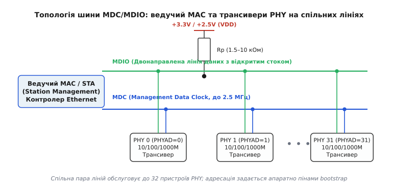
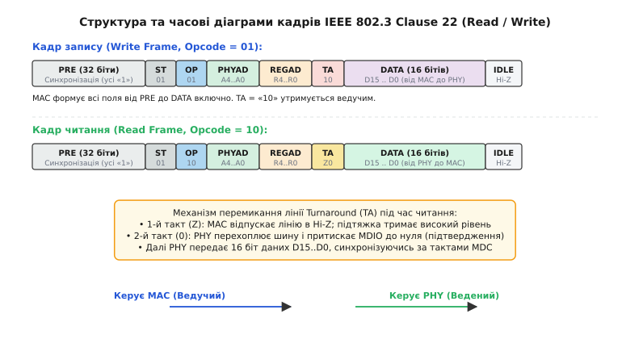
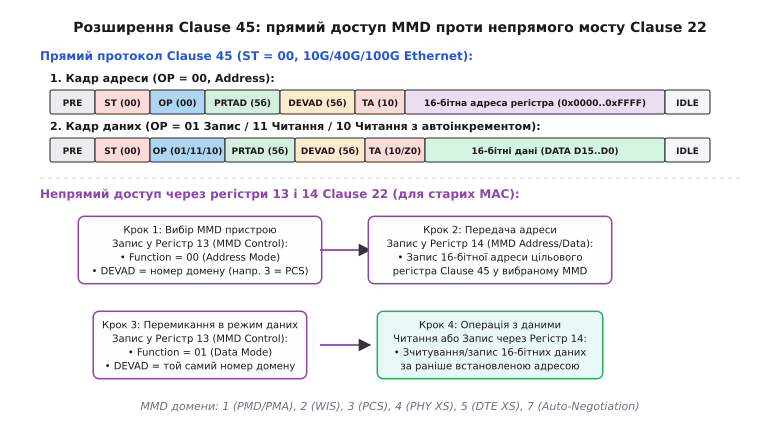
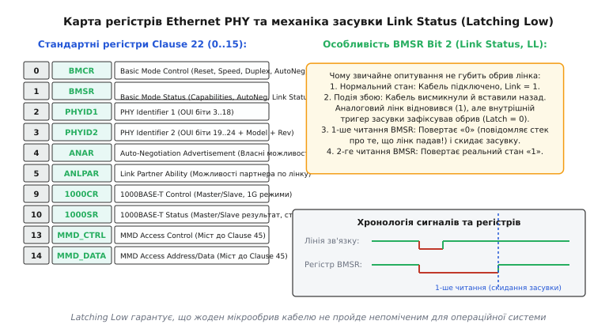
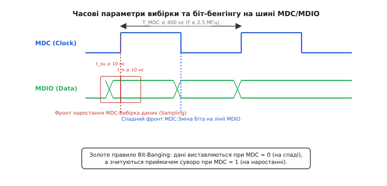

# Шина MDC/MDIO

<preknowlist>
- [Кадр Ethernet](book:communications/ethernet-frame) — будова канального пакета, MAC-адреси та контрольна сума FCS.
- [Фізика лінка](book:communications/ethernet-link-phy) — трансивер PHY, кодування лінійного сигналу та вита пара.
- [Шина I2C](book:communications/i2c-bus) — синхронна послідовна шина з двонаправленою лінією даних та підтяжкою.
- [Підтяжки](book:electronics/floating-pullups) — резистор до живлення для фіксації логічного рівня вільної лінії.
- [Автоузгодження](book:communications/auto-negotiation) — протокол узгодження швидкості та дуплексу на крученій парі.
</preknowlist>

Уявімо мережевий комутатор або процесорну плату маршрутизатора, де контролер канального рівня MAC (*Media Access Control*) з'єднано з мікросхемою аналогового трансивера PHY (*Physical Layer*) швидкісними паралельними лініями інтерфейсу RGMII чи SGMII. Пакети даних передаються на тактовій частоті 125 МГц, але сам по собі тракт даних позбавлений зворотного зв'язку про стан середовища: контролер MAC не знає, чи підключено патч-корд у гніздо RJ-45, на якій швидкості піднявся аналоговий лінк (10, 100 чи 1000 Мбіт/с), чи підтримує партнер повний дуплекс, і чи немає аварійного перегріву лінійного драйвера. Якщо MAC спробує передавати гігабітний потік у знеструмлений порт або в лінію, яка через пошкодження кабелю узгодилася лише на 10 Мбіт/с, буфери передачі миттєво переповняться, а пакети будуть втрачені без жодного діагностичного повідомлення.

Щоб цього не сталося, цифровому процесору потрібен окремий, незалежний від швидкісного потоку даних канал конфігурації та діагностики, через який операційна система може налаштувати аналоговий трансивер, запустити протокол автоузгодження, зчитати стан лінії та скинути аварійні тригери. Цю роль в архітектурі Ethernet виконує спеціалізована дводротова послідовна шина **MDC/MDIO** (*Management Data Clock / Management Data Input/Output*), стандартизована комітетом IEEE 802.3.

---

### Розділення MAC і PHY: чому каналу керування потрібна власна шина

В архітектурі Ethernet функції обробки пакетів та фізичної передачі електричних сигналів навмисно рознесені між двома різними рівнями:
1. **Контролер MAC (Media Access Control):** цифрова логіка, що відповідає за формування заголовків кадрів, перевірку контрольних сум CRC-32, фільтрацію MAC-адрес та керування чергами буферної пам'яті. MAC оперує чистими двійковими даними і зазвичай інтегрується безпосередньо в кристал центрального процесора (SoC) або мережевого комутатора.
2. **Трансивер PHY (Physical Layer):** аналогово-цифровий мікросхемний вузол, що перетворює паралельні цифрові байти на високочастотні лінійні сигнали (манчестерський код для 10BASE-T, багаторівневу модуляцію MLT-3 для 100BASE-TX або PAM-5 для 1000BASE-T), виконує цифрову фільтрацію луни, узгоджує імпеданс лінії та керує світлодіодами індикації.

Між цими блоками прокладають два принципово різні інтерфейси. Перший — це **інтерфейс даних** (MII, RMII, RGMII, GMII, SGMII, XGMII), оптимізований виключно під передачу пакетів із максимальною пропускною здатністю. Другий — це **інтерфейс керування** MII Management Interface (MIIM), який отримав повсюдну назву шини **MDC/MDIO**; про історію її створення та еволюцію стандарту можна дізнатися в [історичному нарисі MII Management](book:communications/mdi-mdio-bus/hist-mii-management.md).

```
   ┌─────────────────────────────────────────────────────────────┐
   │             Контролер Ethernet MAC / Процесор                │
   └───────────────┬─────────────────────────────┬───────────────┘
                   │                             │
    Швидкісна шина даних (MII/RGMII)             │ Шина керування (MDC/MDIO)
    [TXD, RXD, TX_CLK, RX_CLK, CTL]              │ [MDC (Clock), MDIO (Data)]
                   │                             │
   ┌───────────────▼─────────────────────────────▼───────────────┐
   │               Мікросхема трансивера PHY                     │
   │               (PHYAD = 0x01, IEEE 802.3)                    │
   └─────────────────────────────┬───────────────────────────────┘
                                 │
                   Трансформаторна розв'язка (Magnetics)
                                 │
                   Кручена пара RJ-45 (10/100/1000M)
```

Головна причина існування окремої шини полягає в кардинальній відмінності вимог до передачі даних і передачі керівнийх команд. Тракт даних вимагає граничної швидкості (гігабіти на секунду), паралельних ліній або швидкісних диференційних пар із низьковольтними рівнями (LVDS/CML), де неприпустимі затримки на опитування статусів. Натомість каналу конфігурації потрібна **абсолютна надійність, простота та детермінізм**: він повинен працювати навіть тоді, коли основний лінк повністю розірвано або зашумлено, коли тактовий генератор даних іще не засинхронізувався, або коли PHY перебуває у стані глибокого апаратного скидання.

---

### Фізичний рівень: дві лінії, тактування та резистивна підтяжка

Фізичний інтерфейс шини формується лише двома сигнальними лініями:

1. **MDC (Management Data Clock):** лінія тактового сигналу. Завжди генерується виключно ведучим пристроєм (контролером MAC або керівним супервізором STA — *Station Management Entity*). Стандарт IEEE 802.3 встановлює максимальну тактову частоту `f_MDC = 2.5 МГц`, що відповідає періоду `T ≥ 400 нс`. Тривалість як високого (`T_HIGH`), так і низького (`T_LOW`) рівнів такту мусить бути не меншою за 160 нс.
2. **MDIO (Management Data Input/Output):** двонаправлена лінія послідовної передачі даних. Працює в напівдуплексному режимі з перемиканням напрямку передачі між ведучим і веденим.


*Ведучий контролер MAC керує групою трансиверів PHY через спільні лінії MDC та MDIO. Лінія даних підтягується до напруги живлення єдиним зовнішнім резистором Rp.*

На відміну від двотактного вихідного каскаду (Push-Pull), вихідний драйвер лінії MDIO реалізується як каскад із трьома станами (Tri-State) або з [відкритим стоком](book:electronics/open-collector-output). Коли жоден із пристроїв не передає логічний нуль, лінія переходить у стан високого імпедансу (Hi-Z), а її напруга фіксується на рівні живлення `V_DD` за допомогою зовнішнього резистора [підтяжки](book:electronics/floating-pullups) `R_p`.

#### Правило виставляння та зчитування бітів
Синхронізація на шині підпорядковується залізному часовому правилу:
- **Зміна сигналу:** передавальний пристрій (MAC або PHY) змінює стан лінії MDIO **виключно під час низького рівня MDC** — одразу після спадного фронту тактового сигналу.
- **Зчитування сигналу:** приймальний пристрій здійснює вибірку логічного рівня лінії MDIO **суворо за наростаючим фронтом MDC**.

Час встановлення даних перед наростаючим фронтом (`t_setup`) та час утримання після нього (`t_hold`) повинні становити щонайменше 10 нс. Завдяки тому, що дані фіксуються в середині високого імпульсу такту, перехідні процеси та дзвін на лінії встигають повністю затухнути.

#### Розрахунок підтягувального резистора та мультидроп
Шина підтримує топологію мультидроп (*Multi-drop*): до однієї пари ліній MDC/MDIO можна паралельно підключити до 32 мікросхем PHY. Кожен трансивер має унікальну 5-бітну фізичну адресу `PHYAD[4:0]`, яка задається на друкованій платі за допомогою підключення спеціальних конфігураційних ніжок (*bootstrap pins*) до ліній живлення або землі через резистори.

Оскільки повернення лінії MDIO у стан логічної одиниці відбувається пасивно через резистор `R_p`, тривалість фронту наростання визначається постійною часу `τ = R_p · C_bus`, де `C_bus` — сумарна паразитна ємність монтажних доріжок друкованої плати та вхідних каскадів усіх підключених мікросхем. Для стандартного порогу від 10% до 90% рівня напруги час наростання становить:

```
t_rise ≈ 2.197 · R_p · C_bus
```

Якщо на 16-портовому комутаторі сумарна ємність шини досягає `C_bus = 120 пФ`, а розробник помилково встановить слабку підтяжку `R_p = 10 кОм`, час наростання складе:

```
t_rise = 2.197 × 10000 Ом × 120·10⁻¹² Ф ≈ 2636 нс = 2.64 мкс
```

За тактового періоду `T = 400 нс` напруга на лінії за півперіоду (200 нс) встигне піднятися лише на малу частку від номіналу, і приймач прочитає суцільні нулі замість одиниць. Тому для надійної роботи номінал `R_p` вибирають у діапазоні **1.5–2.2 кОм** (на завантажених шинах) або **4.7 кОм** (для одиночного трансивера на короткій доріжці).

> 🔧 **Навіщо це.** Якщо під час увімкнення плати контролер MAC не бачить трансивер PHY або зчитує з усіх регістрів значення `0xFFFF`, перше, що слід перевірити осцилографом — це форма імпульсів на лінії MDIO. Якщо наростаючий фронт має форму пологої експоненти, а не прямокутника, опір підтяжки `R_p` завищений для поточної ємності плати. Зменшення резистора підтяжки до 1.5 кОм вирішує проблему без зміни коду прошивки.

---

### Апаратне конфігурування адрес (Bootstrap Latching)

Перед тим як шина почне передавати кадри, кожен трансивер PHY на платі повинен отримати свій унікальний номер `PHYAD[4:0]`. Оскільки мікросхеми PHY не містять енергонезалежної пам'яті EEPROM або Flash, конфігурація адреси відбувається апаратно під час скидання (Reset).

Виробники мікросхем повторно використовують багатофункціональні виводи — наприклад, виводи світлодіодної індикації (LED0, LED1, LED2) або виводи шини даних прийому (RXD0..RXD3, RX_DV, RX_ER). Схема працює так:

1. **Фаза скидання (Reset active, ніжка RESET_N = 0):** Внутрішня цифрова логіка PHY вимикає вихідні драйвери цих ніжок, переводячи їх у режим високоомних входів.
2. **Зчитування рівнів напруги:** Зовнішні резистори підтяжки (Pull-Up до VDD або Pull-Down до GND) номіналом 4.7–10 кОм, встановлені на платі, фіксують на цих ніжках рівні логічного нуля або одиниці.
3. **Фіксація адреси (Latch release):** У момент, коли сигнал RESET_N підіймається з 0 в 1, внутрішні компаратори PHY фіксують стани на конфігураційних ніжках і записують їх у внутрішній апаратний регістр фізичної адреси.
4. **Перехід у робочий режим:** Через кілька мікросекунд після зняття скидання мікросхема перемикає ці ніжки у звичайний режим керування світлодіодами або видачі мережевих даних RXD.

```
RESET_N:   ─────┐                                      ┌──────────────
                └──────────────────────────────────────┘
                  [Фаза скидання: зчитування Bootstrap]  ▲ Момент фіксації адреси
                                                         │
LED0/PHYAD0: ───[ Резистор Pull-Up 4.7k до VDD ]─────────┴─► Логічна «1»
LED1/PHYAD1: ───[ Резистор Pull-Down 4.7k до GND ]───────┴─► Логічний «0»
```

#### Небезпека підключення світлодіодів та зсув адреси
Класична пастка проектування плат полягає в підключенні світлодіода індикації лінка прямо до ніжки LED/PHYAD без врахування його полярності. Якщо світлодіод підключено катодом до ніжки PHY, а анодом через струмообмежувальний резистор до шини живлення 3.3 В, струм витоку через світлодіод створить паразитну підтяжку до одиниці. У результаті трансивер замість бажаної адреси `0x00` зафіксує адресу `0x01` або `0x03`. Драйвер операційної системи, налаштований опитувати адресу `0`, не знайде пристрою на шині.

---

### Протокол Clause 22: анатомія кадру та передача керування (Turnaround)

Класичний протокол обміну, стандартизований у розділі IEEE 802.3 Clause 22, оперує фіксованими 64-бітними транзакціями. Кожна транзакція дозволяє прочитати або записати один 16-бітний регістр у вибраному трансивері.


*Формат кадру Clause 22: 32 біти преамбули, стартовий код ST=01, код операції OP, адреса пристрою PHYAD, адреса регістра REGAD, фаза зміни напрямку TA та 16 бітів даних.*

Послідовність бітів у кадрі Clause 22 передається суворо старшим розрядом уперед (MSB first):

| Поле кадру | Довжина | Значення при записі (Write) | Значення при читанні (Read) | Призначення поля |
|---|---|---|---|---|
| **PRE** (Preamble) | 32 біти | `111...1` (32 одиниці) | `111...1` (32 одиниці) | Послідовність логічних одиниць для синхронізації вхідного автомата розбору кадру в трансивері PHY. |
| **ST** (Start of Frame) | 2 біти | `01` | `01` | Фіксований патерн початку кадру стандарту Clause 22. |
| **OP** (Opcode) | 2 біти | `01` (Write) | `10` (Read) | Код операції: `01` — запис даних у регістр, `10` — читання даних із регістра. |
| **PHYAD** (PHY Address) | 5 бітів | `A4 A3 A2 A1 A0` | `A4 A3 A2 A1 A0` | Фізична адреса цільового трансивера (діапазон 0..31). |
| **REGAD** (Register Address)| 5 бітів | `R4 R3 R2 R1 R0` | `R4 R3 R2 R1 R0` | Номер цільового регістра всередині PHY (діапазон 0..31). |
| **TA** (Turnaround) | 2 біти | `10` (формує MAC) | `Z0` (Z від MAC, 0 від PHY)| Захисний інтервал для безпечного перемикання напрямку передачі по лінії MDIO. |
| **DATA** | 16 бітів | `D15 ... D0` (від MAC) | `D15 ... D0` (від PHY) | 16-бітне слово конфігурації або діагностичного статусу. |
| **IDLE** | — | Hi-Z | Hi-Z | Стан спокою: лінія відпускається у високий імпеданс до наступного кадру. |

#### Механіка фази Turnaround (TA)
Фаза Turnaround — це найбільш витончений вузол протоколу, що запобігає апаратним конфліктам (короткому замиканню між виходами двох мікросхем):

1. **Під час операції запису (Write):** керівний контролер MAC веде лінію від початку до кінця кадру. У фазі TA він послідовно виставляє біт `1`, а потім біт `0`. Трансивер PHY весь цей час лише слухає лінію. Жодної зміни напрямку не відбувається.
2. **Під час операції читання (Read):** лінія повинна перейти від передавача MAC до передавача PHY:
   - На **першому такті TA (стан Z)** контролер MAC переводить свій вихідний пін у стан високого імпедансу (Hi-Z), тобто «відпускає» дріт. Зовнішній резистор підтяжки утримує високий рівень напруги.
   - На **другому такті TA (стан 0)** вибраний трансивер PHY вмикає свій вихідний каскад і примусово притискає лінію MDIO до нуля (`0`). Цей нуль слугує апаратним підтвердженням (ACK): контролер MAC зчитує нуль за наростаючим фронтом MDC і розуміє, що PHY прийняв адресу, живий і готовий видавати дані.
   - Якщо трансивер за вказаною адресою відсутній або знеструмлений, лінія на другому такті TA залишиться підтягнутою до одиниці через резистор `R_p`. Контролер MAC фіксує помилку відсутності пристрою (*No Device Acknowledge*).

#### Придушення преамбули (Preamble Suppression)
Стандартний кадр Clause 22 вимагає 32 такти преамбули, що при частоті `2.5 МГц` займає `12.8 мкс` — рівно половину всього часу транзакції (`25.6 мкс`). Більшість сучасних трансиверів підтримують режим *Preamble Suppression* (наявність біта 6 у регістрі 1 BMSR): після першої повної транзакції контролер може скоротити преамбулу до 1 такту або взагалі починати кадр безпосередньо з комбінації `ST = 01`. Це подвоює швидкість опитування шини.

---

### Розширення Clause 45: криза 32 регістрів та простір 10GbE

З появою стандарту Gigabit Ethernet (1000BASE-T) 32 стандартні регістри Clause 22 виявилися заповненими майже повністю. Коли ж на початку 2000-х років розроблявся стандарт 10 Gigabit Ethernet (IEEE 802.3ae), монолітна концепція PHY остаточно вичерпала себе.

Трансивер 10GbE перетворився на модульний комплекс із кількох субрівнів: оптичного приймача-передавача (**PMA/PMD**), блоку узгодження з магістральними мережами SONET (**WIS**), блоку кодування 64B/66B (**PCS**) та розширювачів інтерфейсу XGMII (**PHY XS**). Кожен із цих блоків розроблявся незалежно і вимагав сотень власних регістрів для цифрової обробки сигналів, контролю лазерів та моніторингу бітових помилок.

Щоб подолати обмеження у 32 регістри без додавання нових фізичних ліній, комітет IEEE 802.3 розробив розширення **Clause 45**.


*Clause 45 розділяє транзакцію на два етапи (кадр адреси та кадр даних) у просторі 32 доменів MMD. Старі контролери можуть звертатися до регістрів Clause 45 через непрямі регістри 13 та 14.*

#### Ключові нововведення Clause 45
1. **Зміна стартового коду на `ST = 00`:** старі мікросхеми Clause 22, побачивши комбінацію `00` замість `01`, ігнорують кадр. Це дозволяє розміщувати чіпи 10GbE та старі трансивери Fast/Gigabit Ethernet на одній фізичній шині друкованої плати.
2. **Розділення адресного простору на MMD:** 5-бітне поле адреси регістра замінили на 5-бітне поле домену пристрою **DEVAD** (*MDIO Manageable Device*):
   - `DEVAD = 1`: блок PMD / PMA (фізичне середовище);
   - `DEVAD = 2`: блок WIS (WAN Interface Sublayer);
   - `DEVAD = 3`: блок PCS (Physical Coding Sublayer, 64B/66B);
   - `DEVAD = 4`: блок PHY XS;
   - `DEVAD = 5`: блок DTE XS;
   - `DEVAD = 7`: блок автоузгодження 10G/40G/100G (Backplane KR, 10GBASE-T).
3. **Двоетапний протокол (Two-Step Access):** замість передачі адреси й даних в одному кадрі, доступ розділили на дві незалежні транзакції:
   - **Кадр 1 (Address Frame, `OP = 00`):** контролер передає номер порту `PRTAD`, номер домену `DEVAD` та повну **16-бітну адресу регістра** (діапазон `0x0000..0xFFFF`). Обраний субблок MMD зберігає цю адресу у своєму внутрішньому тіньовому регістрі.
   - **Кадр 2 (Data Frame):** контролер надсилає наступну транзакцію з тим самим `PRTAD` та `DEVAD`, але з кодом операції даних:
     - `OP = 01` — запис 16 бітів даних за збереженою адресою;
     - `OP = 11` — читання 16 бітів даних за збереженою адресою;
     - `OP = 10` — читання даних із автоматичним пост-інкрементом адреси (зручно для пакетного зчитування великих масивів телеметрії).

Завдяки цьому ємність адресації зросла до `32 порти × 32 MMD × 65536 регістрів = 67 108 864` регістри на одній шині!

#### Непрямий доступ (Indirect Access) через Clause 22
Якщо центральний процесор обладнано застарілим апаратним блоком MAC, що вміє генерувати лише кадри Clause 22 (`ST = 01`), стандарт передбачає віртуальний міст через обов'язкові службові регістри **13** (*MMD Access Control*) та **14** (*MMD Access Address/Data*).

Повна карта бітів і структур даних для роботи з Clause 22 та Clause 45 наведена в окремому [довіднику регістрів PHY](book:communications/mdi-mdio-bus/api-clause22-clause45-registers.md).

---

### Стандартна карта регістрів PHY та пастка Link Status

Усі трансивери Fast/Gigabit Ethernet зобов'язані реалізовувати стандартну карту перших 16 регістрів простору Clause 22.


*Регістри 0..15 задають стандартний інтерфейс керування. Біт Link Status у регістрі BMSR має поведінку засувки Latching Low, що запобігає пропуску короткочасних обривів кабелю.*

Найважливішими для системного програміста є такі регістри:
- **Регістр 0: Basic Mode Control Register (BMCR):** програмне скидання мікросхеми (біт 15 `RESET`), увімкнення шлейфу діагностики (біт 14 `LOOPBACK`), вибір швидкості 10/100/1000 Мбіт/с (біти 13 і 6), дозвіл автоузгодження (біт 12 `AUTONEG_ENABLE`), режим сну (біт 11 `POWER_DOWN`) та вибір повного чи напівдуплексу (біт 8 `DUPLEX_MODE`).
- **Регістр 1: Basic Mode Status Register (BMSR):** апаратні можливості мікросхеми, завершення автоузгодження (біт 5 `AUTONEG_COMPLETE`), статус віддаленої аварії (біт 4 `REMOTE_FAULT`) та стан фізичного лінка (біт 2 `LINK_STATUS`).
- **Регістри 2 та 3: PHY Identifier (PHYID1 та PHYID2):** містять 24-бітний числовий код виробника OUI, номер моделі чіпа та версію ревізії кремнію. За цим відбитком операційна система ідентифікує виробника (Realtek, Microchip, Marvell, Broadcom, Texas Instruments) та завантажує відповідний драйвер.
- **Регістри 4 та 5: Auto-Negotiation Advertisement (ANAR) та Link Partner Ability (ANLPAR):** бітові маски технологій, які наш трансивер оголошує у виту пару, та маска технологій, прийнята від підключеного комутатора.
- **Регістри 9 та 10: 1000BASE-T Control та Status:** конфігурація та діагностика гігабітного зв'язку (розподіл ролей Master/Slave, статус цифрових DSP-еквалайзерів та лічильник помилок холостого ходу лінії).

#### Пастка засувки Latching Low (LL) у біті Link Status
Найпоширеніша помилка під час написання драйвера опитування PHY полягає в нерозумінні апаратної поведінки **Latching Low (LL)** біта 2 регістра `BMSR`:

1. **Нормальний стан:** мережевий кабель підключено, зв'язок активний, біт `LINK_STATUS = 1`.
2. **Подія короткочасного збою:** патч-корд випадково зачепили або комутатор перезавантажився. Лінк зник на 200 мс і знову відновився. Аналоговий приймач знову бачить несучу частоту і фізично готовий приймати пакети.
3. **Реакція апаратного тригера:** у момент падіння сигналу внутрішній тригер засувки скидається в `0` і **залишається в нулі**, навіть коли кабель знову підключено!
4. **Перше зчитування BMSR:** драйвер читає регістр 1 через MDIO і отримує значення `LINK_STATUS = 0`. Це читання виконує ключову роль — воно **скидає апаратну засувку**.
5. **Друге зчитування BMSR:** повертає реальний поточний стан фізичної лінії (`LINK_STATUS = 1`).

> 🔧 **Навіщо це.** Механізм Latching Low спеціально створений для того, щоб мережевий стек операційної системи гарантовано дізнався про факт обриву з'єднання, навіть якщо опитування відбувається рідко (наприклад, раз на секунду). Якби біт не мав пам'яті засувки, короткочасне вимикання кабелю між двома циклами опитування пройшло б непоміченим: операційна система не скинула б таблицю ARP-маршрутизації та TCP-сесії, що призвело б до зависання відкритих мережевих з'єднань. Правильний патерн у драйвері — **завжди виконувати подвійне читання BMSR** перед ухваленням рішення про поточний статус лінка.

---

### Розширені функції: RGMII Delay Skew, Auto-MDIX та EEE

Окрім базового стандарту Clause 22, через шину MDIO налаштовуються критично важливі апаратні функції сучасних трансиверів, що реалізуються у розширених регістрах виробника (діапазон 16–31 або домени MMD):

#### 1. Внутрішня затримка тактового сигналу RGMII (RGMII-ID)
Швидкісний інтерфейс даних RGMII передає дані на тактовій частоті 125 МГц за обома фронтами такту (DDR). Щоб контролер MAC надійно зафіксував дані, фронт тактового сигналу `TX_CLK` та `RX_CLK` повинен приходити строго в центр «вікна стабільності даних», тобто бути зміщеним рівно на **2.0 наносекунди**.

Раніше розробникам доводилося вигинати доріжки такту змійкою на платі (*PCB serpentine routing*), штучно подовжуючи трасу на 30–40 см. Сучасні трансивери містять внутрішні програмовані лінії затримки (режим *RGMII Internal Delay* або RGMII-ID). Через регістри MDIO драйвер вмикає внутрішню 2-наносекундну затримку в кремнії, що дозволяє розводити доріжки плати прямолінійно з однаковою довжиною:

```
Режим RGMII без затримки:    Тактовий фронт збігається з перепадом даних (помилки вибірки)
Режим RGMII-ID (через MDIO): Тактовий фронт затримано на 2 нс -> потрапляє в центр стабільного ока даних
```

#### 2. Керування режимом кросовера Auto-MDIX
Функція Auto-MDIX автоматично міняє місцями приймальну та передавальну пари кабелю, якщо підключено прямий або перехресний патч-корд. Через регістри MDIO можна примусово зафіксувати режим:
- Прямий кабель (MDI);
- Перехресний кабель (MDI-X);
- Автоматичне визначення (Auto-MDIX).
Примусова фіксація в MDI/MDI-X необхідна під час лабораторного тестування плата-до-плати через конденсаторну розв'язку без магнетиків, де імпульси автоузгодження можуть викликати нескінченний цикл перемикання пар.

#### 3. Енергоефективний Ethernet (IEEE 802.3az EEE)
Стандарт Energy Efficient Ethernet переводить передавальні каскади PHY у стан сну Low Power Idle (LPI), коли мережевий трафік відсутній, знижуючи енергоспоживання на 70–90%. Налаштування EEE, дозволені таймери пробудження (Wake-up time) та моніторинг лічильників LPI здійснюються через Clause 45 домен **MMD 3 (PCS)** та **MMD 7 (Auto-Negotiation)**.

---

### Діагностика через sysfs та утиліти Linux (phylib, ethtool, mdio-tools)

В операційних системах сімейства Linux керування трансиверами PHY стандартизовано в підсистемі ядра **phylib** (`drivers/net/phy/phy_device.c`). Ядро автоматично реєструє контролер шини MDIO як пристрій `mdio_bus` і сканує всі 32 адреси під час завантаження системи.

#### 1. Простеження шини через віртуальну файлову систему sysfs
Інформацію про виявлені на шині трансивери можна переглянути безпосередньо у файловій системі `sysfs`:

```
/sys/bus/mdio_bus/devices/
├── eth0-0:00 -> ../../../devices/platform/soc/eth0/mdio_bus/eth0-0/eth0-0:00
│   ├── phy_id        (наприклад: 0x001cc916)
│   ├── phy_has_fixups
│   └── speed         (поточна узгоджена швидкість)
```

Файл `phy_id` містить конкатенацію регістрів 2 та 3 (`PHYID1` та `PHYID2`). За цим ідентифікатором ядро завантажує спеціалізований модуль драйвера (наприклад, `realtek.ko` або `micrel.ko`).

#### 2. Опитування та конфігурація через утиліту ethtool
Користувацька утиліта `ethtool` взаємодіє з підсистемою `phylib` через мережеві сокети Netlink / IOCTL (`SIOCGMIIREG` та `SIOCSMIIREG`):

```bash
# Перегляд поточного стану лінка, підтримуваних режимів та автоузгодження:
ethtool eth0

# Примусове вимкнення автоузгодження та встановлення швидкості 100M Full Duplex:
ethtool -s eth0 speed 100 duplex full autoneg off

# Перезапуск процедури автоузгодження:
ethtool -r eth0
```

#### 3. Пряме зчитування та запис регістрів через mdio-tools / mii-diag
Для налагодження нового заліза та читання нестандартних вендорських регістрів використовують утиліту низькорівневого доступу `mdio-tool`:

```bash
# Зчитування Basic Mode Status Register (Регістр 1) з трансивера за адресою 0:
mdio eth0 0 0x01
# Відповідь: 0x796d (Link up, 1000M/100M/10M capabilities, Auto-neg complete)

# Зчитування регістрів Clause 45 через непрямий доступ MMD 3 (PCS), регістр 0x0020:
mdio eth0 0 0x0d 0x0003   # MMD 3, режим адреси
mdio eth0 0 0x0e 0x0020   # Адреса регістра 0x0020
mdio eth0 0 0x0d 0x4003   # MMD 3, режим даних
mdio eth0 0 0x0e          # Читання значення
```

---

### Програмне керування та біт-бенгінг на GPIO

Коли в мікроконтролері відсутній апаратний блок Ethernet MAC або коли потрібно керувати додатковим комутатором через звичайні ніжки вводу-виводу, застосовують програмну емуляцію шини (*Bit-banging*).


*При програмному біт-бенгінгу дані виставляються контролером на спадному фронті MDC, а вибірка здійснюється строго за наростаючим фронтом.*

#### Алгоритм сканування шини для виявлення трансиверів
На початку роботи драйвер повинен визначити, за якими фізичними адресами `PHYAD` (від 0 до 31) підключені реальні мікросхеми. Для цього виконується перебір адрес зі зчитуванням регістра 2 (`PHYID1`):
- Якщо трансивер існує, він поверне валідне 16-бітне значення OUI (наприклад, `0x001C` для Realtek або `0x0022` для Micrel/Microchip).
- Якщо за цією адресою пристрою немає, лінія MDIO під час операції читання залишиться підтягнутою до шини живлення через резистор `R_p`. Контролер зчитає значення `0xFFFF`. Якщо лінія закорочена на землю — прочитається `0x0000`. Обидва значення відкидаються як ознака відсутності пристрою.

Нижче наведено компактний приклад програмного сканування та читання регістрів мовами C та C++:

:::tabs
```c
/* Приклад сканування шини MDC/MDIO та виявлення активних PHY на мові C */
#include <stdint.h>
#include <stdbool.h>

extern bool mdio_read_c22(uint8_t phy_addr, uint8_t reg_addr, uint16_t *val);

uint32_t scan_mdio_bus(void) {
    uint32_t active_phys = 0;
    for (uint8_t addr = 0; addr < 32; ++addr) {
        uint16_t phy_id1 = 0;
        /* Читаємо Регістр 2 (PHYID1) */
        if (mdio_read_c22(addr, 0x02, &phy_id1)) {
            /* Відкрита шина повертає 0xFFFF, коротке замикання — 0x0000 */
            if (phy_id1 != 0xFFFFU && phy_id1 != 0x0000U) {
                active_phys |= (1U << addr);
            }
        }
    }
    return active_phys; // Бітова маска знайдених трансиверів
}
```
```cpp
// Приклад сканування шини MDC/MDIO та виявлення активних PHY на C++20
#include <cstdint>
#include <optional>
#include <span>

extern auto mdio_read_c22(uint8_t phy_addr, uint8_t reg_addr) noexcept -> std::optional<uint16_t>;

[[nodiscard]] auto scan_mdio_bus() noexcept -> uint32_t {
    uint32_t active_phys = 0;
    for (uint8_t addr = 0; addr < 32; ++addr) {
        const auto phy_id1 = mdio_read_c22(addr, 0x02);
        if (phy_id1.has_value() && *phy_id1 != 0xFFFFU && *phy_id1 != 0x0000U) {
            active_phys |= (1U << addr);
        }
    }
    return active_phys; // Бітова маска знайдених трансиверів
}
```
:::

Повний промисловий драйвер біт-бенгінгу з детальними функціями затримок, конфігурацією GPIO та підтримкою Clause 45 наведено в окремій практичній [програмній реалізації драйвера MDC/MDIO](book:communications/mdi-mdio-bus/proj-mdio-bitbang.md).

---

### Порівняльний аналіз: MDC/MDIO проти I2C та SPI

Чому інженери IEEE 802.3 створили окрему шину MDC/MDIO замість використання вже наявних інтерфейсів I2C або SPI?

| Критерій | MDC/MDIO (IEEE 802.3) | [I2C](book:communications/i2c-bus) (Philips / NXP) | [SPI](book:communications/spi-bus) (Motorola) |
|---|---|---|---|
| **Кількість сигнальних ліній** | **2 лінії** (MDC, MDIO) | 2 лінії (SCL, SDA) | 3 лінії + 1 лінія CS на кожен пристрій |
| **Керування вибором пристрою** | Вбудована 5-бітна адреса `PHYAD` у кадрі (до 32 пристроїв) | 7-бітна або 10-бітна адреса в першому байті | Окремий апаратний провід Chip Select (CS) на кожен чіп |
| **Синхронізація та затримки** | Повністю синхронна, такт можна зупиняти довільно | Синхронна, підтримує розтягування такту (Clock Stretching) | Повністю синхронна, вимагає безперервного такту під час байта |
| **Складність апаратного автомата** | **Мінімальна:** фіксований зсувний регістр і лічильник на 64 такти | Висока: детекція фронтів START/STOP, арбітраж мультимастера | Мінімальна: зсувний регістр |
| **Стійкість до збоїв на платі** | **Максимальна:** 32 біти преамбули скидають будь-який завислий стан | Середня: зависання веденого в «0» блокує шину назавжди | Висока: скидання лінії CS скидає транзакцію |
| **Електричний рівень** | 3.3 В, 2.5 В, 1.8 В, 1.2 В (Clause 45) | Зазвичай 3.3 В або 5 В | 3.3 В або 1.8 В |

Головною перевагою MDC/MDIO є поєднання простоти та виняткової надійності:
- Порівняно з SPI шина економить десятки ніжок мікроконтролера в багатопортових комутаторах, де 24 або 48 портів обслуговуються однією парою доріжок без ліній CS.
- Порівняно з I2C шина MDIO не має складних старт-стопних умов і не може зависнути через збій автомата станів: якщо лінія MDIO збилася через перешкоду, наступна пачка з 32 одиниць преамбули гарантовано повертає всі підключені трансивери в початковий стан.

---

### Підсумок

Шина MDC/MDIO — це класичний приклад спеціалізованого, вузько заточеного інженерного інтерфейсу, що ідеально виконує свою задачу. Розділивши потік швидкісних пакетів і потік низькошвидкісного керування, стандарти IEEE 802.3 Clause 22 та Clause 45 забезпечили повну незалежність між процесорами MAC та аналоговими трансиверами PHY. Завдяки простій дводротовій топології, вбудованій адресації до 32 пристроїв, надійній фазі Turnaround та механізму засувки Latching Low шина MDIO вже понад чверть століття залишається незмінним стандартом конфігурації та діагностики в усіх мережевих пристроях світу.
