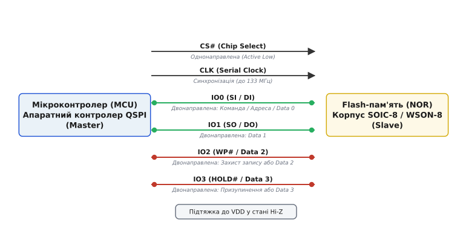
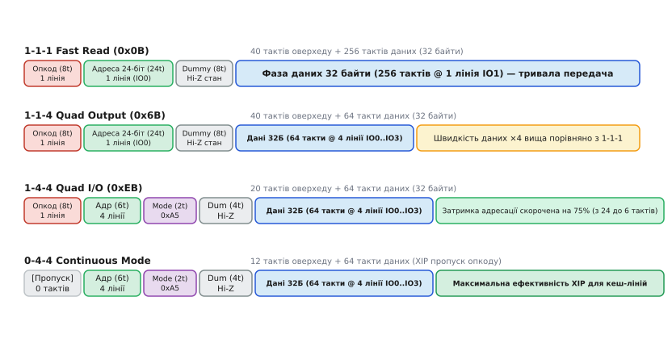
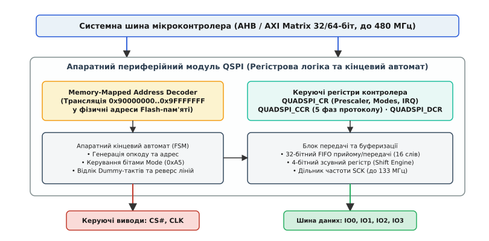
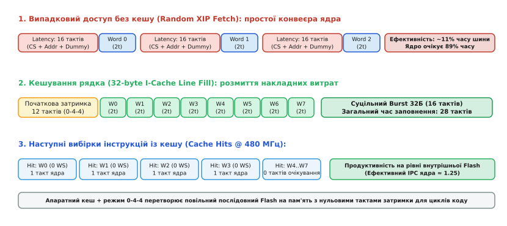

# Quad-SPI (QSPI)

<preknowlist>
- [Шина SPI](book:communications/spi-bus) — базова послідовна шина, кільце зсувних регістрів та повнодуплексний обмін.
- [Лінії SPI](book:communications/spi-lines) — фізичні ролі ліній MOSI, MISO, SCK та вибору кристала CS#.
- [Швидкість SPI](book:communications/spi-speed) — частотні межі, паразитні ємності та завадостійкість послідовних ліній.
- [Фаза й полярність такту (CPOL/CPHA)](book:communications/cpol-cpha) — режими синхронізації та вибірка даних за тактовими фронтами.
- [Флеш-пам'ять](book:programming/spi-flash) — внутрішня організація комірок NOR Flash, сторінки та сектори.
</preknowlist>

Сучасний 32-бітний мікроконтролер із тактовою частотою ядра 400 МГц відтворює векторну анімацію графічного інтерфейсу з роздільною здатністю 800×480 точок і запускає квантовану нейромережу для розпізнавання жестів. Для зберігання растрових текстур, шрифтів та вагових коефіцієнтів моделі потрібно 16–32 Мегабайти пам'яті програм. Проте обсяг вбудованої Flash-пам'яті на кристалі мікроконтролера зазвичай обмежений 1–2 Мегабайтами. Фізична причина криється в кремнієвому техпроцесі: виготовлення швидкісної логіки ядра на нормах 28 або 40 нанометрів несумісне з високовольтними зарядовими помпами (10–12 Вольт), необхідними для інжекції електронів крізь підзатворний діелектрик комірок Flash. Розміщення масивної Flash-пам'яті на одному кристалі з ядром призводить до трикратного зростання площі чипа та катастрофічного падіння виходу придатних виробів.

Винесення пам'яті на зовнішній чип класичного 1-бітового інтерфейсу SPI породжує критичну затримку вибірки інструкцій. На тактовій частоті 50 МГц однобітова лінія MISO забезпечує граничну пропускну здатність лише 6.25 МБайт/с. Завантаження одного 32-байтного рядка процесорного кешу триває понад 5.1 мікросекунди, що змушує обчислювальне ядро простоювати понад 2000 тактів на кожному промаху кешу (Cache Miss). З іншого боку, класична паралельна пам'ять NOR Flash розв'язує задачу швидкодії, але вимагає від 48 до 56 виводів корпусу (24 лінії адреси, 16 ліній даних та керуючі строби), що ускладнює трасування друкованої плати та різко здорожчує мікроконтролер.

Цю інженерну суперечність усуває інтерфейс **Quad-SPI (QSPI)** (лат. *quattuor* — чотири, англ. *Serial Peripheral Interface*). Він перетворює односпрямовані виводи MOSI та MISO на 4 півдуплексні лінії даних з динамічним реверсом напрямку передачі. Працюючи на тактових частотах 104–133 МГц, чотирилінійна шина забезпечує пропускну здатність 52–66.5 МБайт/с при збереженні компактного 8-вивідного корпусу SOIC-8 або WSON-8, дозволяючи процесору безпосередньо виконувати код із зовнішньої пам'яті без попереднього копіювання в оперативну пам'ять.

---

### Фізична топологія та перерозподіл сигнальних ліній

У класичному інтерфейсі SPI ведучий і ведений з'єднані двома роздільними лініями: MOSI передає дані виключно від мікроконтролера до веденого, а MISO — у зворотному напрямку. Цей повнодуплексний режим є надлишковим для накопичувачів даних: під час читання процесор спочатку передає команду й адресу, а потім лише приймає дані. Одночасна передача корисного потоку в обох напрямках не відбувається.


*Фізичне підключення шини Quad-SPI: сигнальні лінії CS#, CLK та 4 двонаправлені лінії даних IO0..IO3 між контролером мікроконтролера та мікросхемою Flash.*

Quad-SPI перерозподіляє призначення виводів стандартного 8-вивідного корпусу мікросхеми Flash, задіюючи статичні керуючі ніжки як додаткові канали передачі даних:

1. **`CS#` (Chip Select)**: односпрямований сигнал вибору кристала (активний низький рівень), що формується апаратним контролером мікроконтролера. Падіння рівня ініціює транзакцію, а підняття завершує обмін і переводить внутрішній лічильник Flash у стан спокою;
2. **`CLK` (Serial Clock)**: тактовий сигнал синхронізації з частотою до 133 МГц, який задає часові інтервали вибірки та видачі даних;
3. **`IO0` (Serial In / Data 0)**: двонаправлена лінія. Під час надсилання команди та адреси працює як вихід мікроконтролера (SI/DI); під час читання даних — як молодший біт чотирибітного нібла (`Bit 0`);
4. **`IO1` (Serial Out / Data 1)**: двонаправлена лінія. У класичному режимі працює як лінія повернення даних (SO/DO); у режимі Quad — як біт `Bit 1`;
5. **`IO2` (`WP#` / Data 2)**: двонаправлена лінія. У базовому стані виконує функцію апаратного захисту від запису (`Write Protect`, активний низький рівень); у чотирилінійному режимі перетворюється на лінію даних `Bit 2`;
6. **`IO3` (`HOLD#` / `RESET#` / Data 3)**: двонаправлена лінія. У базовому стані слугує для призупинення обміну (`HOLD#`) або апаратного скидання чипа; у чотирилінійному режимі перетворюється на лінію даних `Bit 3`.

Кожен вивід даних `IO0..IO3` підключений до двотактного вихідного каскаду (Push-Pull) із можливістю переведення у високоімпедансний стан (Hi-Z). Під час зміни напрямку передачі (наприклад, перехід від видачі адреси мікроконтролером до видачі даних мікросхемою Flash) обидві сторони одночасно переводять свої драйвери в стан Hi-Z на строго визначену кількість тактів, запобігаючи виникненню наскрізного струму короткого замикання на шині.

#### Біт конфігурації Quad Enable (QE)
Щоб виводи `WP#` та `HOLD#` перестали блокувати запис або скидати мікросхему при передачі даних по лініях `IO2` та `IO3`, у внутрішньому енергонезалежному регістрі статусу `Status Register-2` Flash-пам'яті передбачено біт **`QE` (Quad Enable)**.

```
       Регістр статусу Status Register-2 Flash-пам'яті (W25Q128)
 ┌──────┬──────┬──────┬──────┬──────┬──────┬──────┬──────┐
 │ Bit 7│ Bit 6│ Bit 5│ Bit 4│ Bit 3│ Bit 2│ Bit 1│ Bit 0│
 │ SUS  │ CMP  │ LB3  │ LB2  │ LB1  │ (R)  │  QE  │ SRL  │
 └──────┴──────┴──────┴──────┴──────┴──────┴──────┴──────┘
                                               │
               QE = 0: Ніжки працюють як WP# та HOLD# (1-бітний SPI)
               QE = 1: Ніжки працюють як цифрові лінії IO2 та IO3
```

Якщо `QE = 0`, будь-яка спроба виконати команду Quad-читання призведе до апаратного конфлікту: логічний нуль на лінії `IO3` буде сприйнятий мікросхемою як сигнал апаратного скидання `RESET#`, що зірве передачу. Програмне встановлення `QE = 1` через команду `Write Status Register-2 (0x31)` вимикає функції захисту та скидання, закріплюючи за виводами виключно роль ліній даних `IO2` та `IO3`.

---

### Розширений набір інструкцій Flash: класифікація та протокол

Транзакція Quad-SPI складається з послідовності часових фаз: **Фаза інструкції**, **Фаза адреси**, **Фаза службових байтів (Alternate / Mode Bits)**, **Фаза холостих тактів (Dummy Cycles)** та **Фаза даних**.

Формат виконання операції позначається трійкою `X-Y-Z`, де:
* `X` — кількість активних ліній у фазі інструкції (1 або 4);
* `Y` — кількість активних ліній у фазі передачі адреси та службових байтів (1 або 4);
* `Z` — кількість активних ліній у фазі передачі даних (1, 2 або 4).


*Часові діаграми транзакцій Fast Read 1-1-1, Fast Read Quad Output (1-1-4), Fast Read Quad I/O (1-4-4) та режиму Continuous Read (0-4-4).*

#### 1. Стандартні інструкції читання (1-1-1)
* **Standard Read (`0x03`, 1-1-1)**: базова інструкція. Опкод (8 тактів) та адреса (24 такти) передаються по одній лінії `IO0`. Дані зчитуються по лінії `IO1` (8 тактів на байт). Фаза Dummy відсутня. Максимальна частота обмежена часом реакції кремнієвої матриці (`t[ACC] ≈ 35–45 нс`) і не перевищує 25–33 МГц.
* **Fast Read (`0x0B`, 1-1-1)**: опкод і адреса передаються по лінії `IO0`. Після адреси додається 8 холостих тактів (Dummy), що дозволяє підняти тактову частоту до 104–133 МГц, проте швидкість передачі даних залишається однобітовою (1 байт за 8 тактів).

#### 2. Fast Read Quad Output (`0x6B`, режим 1-1-4)
Команда розроблена як просте розширення для прискорення завантаження великих блоків даних:
* **Фаза інструкції**: опкод `0x6B` передається по одній лінії `IO0` за 8 тактів `CLK`;
* **Фаза адреси**: 24-бітна адреса передається по одній лінії `IO0` за 24 такти `CLK`;
* **Фаза Dummy**: 8 тактів очікування в стані Hi-Z;
* **Фаза даних**: байти зчитуються паралельно по 4 лініях `IO0..IO3`. Кожен байт передається за 2 такти тактового сигналу (старший нібл `D[7:4]` на першому такті, молодший `D[3:0]` на другому).

Накладні витрати на передачу заголовка транзакції (команда + адреса + dummy) становлять `8 + 24 + 8 = 40` тактів, проте сама швидкість видачі даних зростає рівно в 4 рази порівняно зі звичайним Fast Read.

#### 3. Fast Read Quad I/O (`0xEB`, режим 1-4-4)
Оптимізований протокол із високим рівнем паралелізму, призначений для швидкого довільного доступу до пам'яті:
* **Фаза інструкції**: опкод `0xEB` видається по одній лінії `IO0` за 8 тактів;
* **Фаза адреси**: адреса передається одночасно по 4 лініях `IO0..IO3`. 24-бітна адреса передається лише за `24 / 4 = 6` тактів (або 8 тактів для 32-бітної адреси), що скорочує час адресації на 75%;
* **Фаза службових байтів (Mode Bits)**: 8 бітів режиму `M[7:0]` передаються по 4 лініях за 2 такти;
* **Фаза Dummy**: 4–6 тактів очікування в стані Hi-Z (залежно від тактової частоти);
* **Фаза даних**: зчитування по 4 лініях зі швидкістю 2 такти на байт.

Загальні накладні витрати на запуск транзакції 1-4-4 зменшуються до `8 + 6 + 2 + 4 = 20` тактів, що вдвічі швидше за режим 1-1-4.

#### 4. Програмування сторінки: Quad Page Program (`0x32` та `0x38`)
Запис у Flash-пам'ять виконується сторінками до 256 байтів. Перед кожним записом обов'язково надсилається команда дозволу запису `Write Enable (0x06)`:
* **Quad Page Program (`0x32`, режим 1-1-4)**: опкод `0x32` та адреса видаються по 1 лінії `IO0`, після чого потік до 256 байтів даних завантажується у внутрішній SRAM-буфер сторінки мікросхеми по 4 лініях `IO0..IO3` (2 такти на байт).
* **Extended Quad Page Program (`0x38`, режим 1-4-4)**: опкод видається по лінії `IO0`, а адреса та масив даних — по 4 лініях `IO0..IO3`.

Хоча фізичний процес тунелювання заряду Фаулера-Нордгейма у плаваючий затвор триває від 0.2 до 1.5 мілісекунди і не залежить від інтерфейсу шини, чотирилінійне завантаження буфера скорочує час перебування шини в зайнятому стані з 2048 тактів (1-бітний SPI) до 512 тактів.

---

### Безперервне читання: Continuous Read Mode (0-4-4)

Під час виконання програмного коду безпосередньо з Flash-пам'яті (Execute-in-Place, XIP) мікроконтролер генерує неперервну серію коротких запитів на читання слів інструкцій або рядків кешу (по 16 або 32 байти). У кожній такій транзакції 8 тактів витрачаються на повторне надсилання одного й того самого опкоду `0xEB`. На тактовій частоті 100 МГц це створює 80 наносекунд невиправданої мертвої затримки на кожному зверненні процесора.

Для усунення цих втрат протокол Quad-SPI містить механізм **Continuous Read Mode** (також відомий як *Performance Enhance Mode* або режим 0-4-4).

```
         Структура транзакції 0-4-4 у режимі Continuous Read
     ┌──────────┬──────────┬──────────┬────────────────────────┐
CS#  │ Адреса   │ Mode Bits│  Dummy   │ Фаза даних (IO0..IO3)  │ CS#
 ───►│ (6 тактів│ (2 такти │ (4 такти)│ (2 такти на байт)      │───►
     │ @ 4 лінії│ @ 0xA5)  │  @ Hi-Z  │ D0..D31 (Burst)        │
     └──────────┴──────────┴──────────┴────────────────────────┘
     ▲
     └── Байт інструкції 0xEB ПОВНІСТЮ ПРОПУСКАЄТЬСЯ (0 тактів)
```

#### Механізм активації та фіксації
1. **Перша транзакція (ініціалізація)**: контролер виконує звичайне зчитування Fast Read Quad I/O (`0xEB`, 1-4-4). У фазі службових бітів контролер виставляє на лінії `IO0..IO3` специфічний 8-бітний шаблон:
   * Для мікросхем Winbond, ISSI, Macronix: `M[7:0] = 0xA5` (або біти `M[5:4] = 10b`);
   * Для мікросхем Micron / Spansion: `M[7:0] = 0x20`.
2. **Фіксація стану внутрішнім автоматом Flash**: отримавши комбінацію `0xA5`, внутрішній цифровий автомат керування пам'яті переходить у стан очікування адреси й запам'ятовує команду `0xEB` як активну за замовчуванням.
3. **Наступні транзакції (режим 0-4-4)**: контролер опускає `CS#` і **відразу** починає передавати нову адресу по 4 лініях `IO0..IO3`, пропускаючи фазу команди. Пам'ять миттєво розпізнає адресу, перевіряє біти `Mode` і видає дані. Час ініціалізації транзакції скорочується з 20 до 12 тактів (економія 40% затримки старту).
4. **Вихід із безперервного режиму**: якщо контролеру необхідно виконати іншу операцію (наприклад, стирання сектора або читання регістрів), у черговій транзакції читання у поле Mode Bits записується будь-яке значення, відмінне від шаблону активації (зазвичай `M[7:0] = 0xFF`). Автомат Flash повертається до базового стану і знову вимагає обов'язкового байта інструкції.

Повний перелік системних команд, форматів кадру та часових діаграм для всіх типів пам'яті наведено у [довіднику регістрового інтерфейсу та командних послідовностей QSPI](book:communications/quad-spi/api-controller-registers.md).

---

### Апаратна архітектура регістрових контролерів QSPI

Контролер Quad-SPI у сучасних системах на кристалі (SoC) є повноцінним шинним майстром і веденим одночасно. Він транслює системні звернення ядра процесора або каналів DMA у серійні послідовності тактових імпульсів на фізичних лініях.


*Структурна схема апаратного периферійного модуля QSPI: системний шинний інтерфейс, FIFO, кінцевий автомат генерації фаз та транслятор Memory-Mapped.*

#### Чотири функціональні режими роботи контролера
Апаратний автомат контролера (наприклад, у мікроконтролерах STM32F7/H7 або NXP i.MX RT) підтримує 4 режими, які задаються полем `FMODE[1:0]` у конфігураційному регістрі:

1. **Indirect Write Mode (`FMODE = 00b`)**: дані записуються процесором або DMA у регістр даних `QUADSPI_DR`, проходять крізь 32-бітний FIFO (зазвичай 16–32 слова) і серіалізуються на лініях `IO0..IO3`. Використовується для конфігурації регістрів Flash та програмування сторінок.
2. **Indirect Read Mode (`FMODE = 01b`)**: контролер генерує транзакцію заданої довжини (`QUADSPI_DLR`), десеріалізує вхідні нібли з ліній `IO0..IO3` у 32-бітні слова і складає їх у прийомний FIFO для зчитування процесором або DMA.
3. **Automatic Status-Polling Mode (`FMODE = 10b`)**: спеціалізований апаратний режим, призначений для зняття навантаження з ядра процесора під час тривалих операцій стирання сектора (20–400 мс) або запису сторінки (0.5–2 мс). Контролер самостійно із заданим інтервалом (регістр `PIR`) надсилає команду опитування статусу `0x05`, накладає на отриманий байт бітову маску (`PSMKR`) і порівнює результат із шаблоном (`PSMAR`). Коли біт `WIP` (Write-In-Progress) стає рівним нулю, контролер генерує апаратне переривання, повідомляючи процесор про готовність пам'яті.
4. **Memory-Mapped Mode (`FMODE = 11b`)**: режим прямого відображення Flash-пам'яті в 32-бітний адресний простір мікроконтролера (наприклад, діапазон `0x90000000..0x9FFFFFFF` обсягом до 256 МБайт).

#### Ключові регістри конфігурації (архітектура STM32 QUADSPI)
* **`QUADSPI_CR` (Control Register)**: керує глобальними параметрами периферії:
  ```
  f[SCK] = f[AHB] ÷ (PRESCALER + 1)
  ```
  Містить біт активації зсуву вибірки `SSHIFT` (зчитування вхідних даних на наступному спадному фронті для компенсації затримок поширення сигналу на друкованій платі на частотах понад 80 МГц) та пороги заповнення FIFO `FTHRES`.
* **`QUADSPI_DCR` (Device Configuration Register)**: визначає розмір підключеної Flash-пам'яті через степінь двійки (`2^(FSIZE + 1)` байтів), полярність тактової лінії `CKMODE` (Mode 0 або Mode 3) та мінімальну кількість тактів утримання `CS#` у пасивному стані (`CSHT`).
* **`QUADSPI_CCR` (Communication Configuration Register)**: визначає поведінку автомата для кожної з 5 фаз транзакції:
  * `IMODE[1:0]` — режим лінії інструкції (0, 1, 2 або 4 лінії);
  * `ADMODE[1:0]`, `ADSIZE[1:0]` — режим і розрядність фази адреси (8, 16, 24 або 32 біти);
  * `ABMODE[1:0]`, `ABSIZE[1:0]` — конфігурація службових байтів Mode Bits;
  * `DCYC[4:0]` — кількість холостих тактів Dummy (від 0 до 31);
  * `DMODE[1:0]` — режим ліній для фази корисних даних;
  * `SIOO` (*Send Instruction Only Once*) — апаратна активація режиму Continuous Read: контролер надсилає опкод лише в першій транзакції, а в наступних формує кадр 0-4-4.

---

### Пряме виконання коду (XIP) та усунення затримок кешуванням

Режим прямого виконання коду (англ. *Execute-in-Place*, XIP) перетворює зовнішню послідовну Flash-пам'ять на логічний аналог внутрішнього ПЗП. Процесор зчитує команди за звичайними машинними інструкціями `LDR` або під час вибірки конвеєра інструкцій безпосередньо з адресного діапазону `0x90000000`.

#### Фізика латентності випадкового доступу
Головною проблемою XIP у реальних застосунках є не пропускна здатність шини на послідовних даних, а **початкова затримка доступу** (англ. *random access latency*).

Коли ядро процесора виконує випадковий перехід (інструкції `B`, `BL`, `BX` або виклик переривання), конвеєр скидається і вимагає одне 32-бітне слово інструкції за новою довільною адресою. Для вибірки цього одного слова контролер QSPI зобов'язаний згенерувати повну транзакцію:

```
T[fetch_single] = t[CS_setup] + T[addr] + T[mode] + T[dummy] + T[data]
```

**Розрахунок затримок на тактовій частоті шини 100 МГц (T = 10 нс):**
```
T[latency]
= 1 такт (CS setup) + 6 тактів (24-біт адреса) + 2 такти (Mode) + 4 такти (Dummy)
= 13 тактів шини
= 130 наносекунд
```

Передача власне корисного 32-бітного слова (4 байти) по 4 лініях займає лише `4 × 2 = 8` тактів (80 нс). Загальний час вибірки одного слова становить `130 + 80 = 210 нс`.

Для процесора з частотою 400 МГц (період такту ядра 2.5 нс) затримка у 210 нс еквівалентна **84 тактовим циклам очікування ядра** (Wait States). Якщо виконувати код із QSPI Flash без кешування, показник продуктивності процесора IPC (*Instructions Per Cycle*) падає з теоретичних 1.25 до катастрофічних 0.12–0.15: ядро 88% часу простоює в очікуванні пам'яті.


*Порівняння виконання XIP: падіння продуктивності при невирівняному випадковому доступі без кешу та амортизація затримок завдяки заповненню 32-байтного рядка L1 I-Cache.*

#### Апаратна інтеграція з L1-кешем та прискорювачами (ART Accelerator)
Для подолання бар'єра латентності сучасні мікроконтролери поєднують контролер QSPI з апаратними багаторівневими системами кешування:

1. **L1-кеш інструкцій та даних (I-Cache / D-Cache у Cortex-M7)**:
   Кеш ядра працює не з окремими словами, а з фіксованими блоками — **рядками кешу** розміром 32 байти (8 слів інструкцій).
   При промаху кешу (Cache Miss) процесор ініціює апаратну операцію заповнення рядка (*Cache Line Fill*). Контролер QSPI виконує одну транзакцію 0-4-4, де початкова затримка (13 тактів) сплачується лише один раз, після чого 32 байти зчитуються суцільним швидкісним пакетом (Burst) за 64 такти шини.
   Всі наступні 7 звернень до сусідніх інструкцій у межах цього рядка виконуються з нульовими тактами затримки (0 Wait States) безпосередньо з надшвидкої пам'яті кешу на повній частоті ядра 400–480 МГц.
2. **Апаратний прискорювач ST ART Accelerator (Adaptive Real-Time)**:
   Включає виділені буфери вибірки наперед (*Prefetch Buffers*) та асоціативний кеш переходів. Поки процесор виконує поточний лінійний блок команд, контролер ART у фоновому режимі через шинну матрицю AXI заздалегідь підвантажує наступний суміжний рядок із QSPI Flash, повністю приховуючи латентність послідовного виконання.
3. **Модуль захисту пам'яті (MPU)**:
   Для коректного функціонування кешу діапазону QSPI Flash (`0x90000000`) через регістри `MPU_RASR` призначаються атрибути нормальної пам'яті: `Normal Memory`, `Cacheable`, `Outer/Inner Write-Back` або `Write-Through`. Без правильної конфігурації MPU ядро Cortex-M за замовчуванням сприймає зовнішні адреси як простір пристроїв `Device Memory`, у якому будь-яке кешування та спекулятивна вибірка апаратно заборонені.

Детальний приклад конфігурації регістрів GPIO, QSPI, MPU та L1-кешу наведено у [практичному керівництві з налаштування режиму XIP у мікроконтролерах STM32](book:communications/quad-spi/proj-xip-cache-integration.md).

---

### Розрахунок ефективної пропускної здатності та балансу продуктивності

Ефективна пропускна здатність шини `BW[eff]` при зчитуванні блоку даних розміром `B` байтів у режимі 0-4-4 розраховується з урахуванням накладних витрат:

```
T[total] = T[overhead] + T[data]
```

Де:
* `T[overhead] = N[addr] + N[mode] + N[dummy]` (кількість тактів на адресу, режим та холості цикли);
* `T[data] = B × 2` (тактових циклів для передачі `B` байтів по 4 лініях).

```
BW[eff]
= (B ÷ T[total]) · f[SCK]
= (B ÷ ((N[addr] + N[mode] + N[dummy]) + 2 · B)) · f[SCK]    [де T[SCK] = 1 / f[SCK]]
```

**Порівняльний розрахунок для тактової частоти 104 МГц (`f[SCK] = 104` МГц, `N[overhead] = 12` тактів):**

* **Зчитування одного 32-бітного слова (`B = 4` байти)**:
  ```
  BW[eff]
  = (4 ÷ (12 + 2 · 4)) · 104 МБайт/с
  = (4 ÷ 20) · 104
  = 0.20 · 104
  = 20.8 МБайт/с
  ```
  Ефективність використання смуги пропускання шини становить лише 40% від теоретичного максимуму (52 МБайт/с).

* **Зчитування рядка кешу (`B = 32` байти)**:
  ```
  BW[eff]
  = (32 ÷ (12 + 2 · 32)) · 104 МБайт/с
  = (32 ÷ 76) · 104
  = 0.421 · 104
  = 43.8 МБайт/с
  ```
  Ефективність шини сягає 84.2%.

* **Пакетне перекачування DMA для дисплея (`B = 512` байтів)**:
  ```
  BW[eff]
  = (512 ÷ (12 + 2 · 512)) · 104 МБайт/с
  = (512 ÷ 1036) · 104
  = 0.494 · 104
  = 51.4 МБайт/с
  ```
  Ефективність шини становить 98.8% від фізичної межі.

> 🔧 **Навіщо це.**
> Розрахунок доводить ключове правило системного проєктування: у мікроконтролерних системах зовнішню пам'ять Quad-SPI ніколи не використовують для некешованого випадкового доступу до окремих змінних. Для коду завжди активують L1 I-Cache або ART Accelerator; для графіки та аудіо буферизують передачу через DMA блоками від 128–256 байтів, мінімізуючи вплив початкової латентності.

---

### Подвійна швидкість передачі (DDR / DTR) та конфігурація Dual-Quad

Подальшим розвитком чотирилінійної архітектури стало впровадження режиму подвійної швидкості передачі даних **DDR** (*Double Data Rate*, у специфікаціях Flash також позначається як *DTR — Double Transfer Rate*).

У класичному режимі SDR (*Single Data Rate*) вибірка даних відбувається виключно по спадному (або наростаючому) фронту тактового сигналу `CLK`. У режимі DDR дані на лініях `IO0..IO3` передаються і фіксуються **по обох фронтах** тактового імпульсу. Таким чином, за один повний період `CLK` передається цілий байт (8 бітів = 2 нібли):
* Старший нібл `D[7:4]` фіксується за наростаючим фронтом;
* Молодший нібл `D[3:0]` фіксується за спадним фронтом.

На тактовій частоті 100 МГц режим DDR подвоює пікову швидкість читання з 50 МБайт/с до 100 МБайт/с без підвищення частоти синхронізації та без додавання нових провідників. Проте режим DDR висуває екстремальні вимоги до симетрії шпаруватості тактового сигналу (Duty Cycle має становити строго `50% ± 5%`) та вимагає точного контролю параметра `t[CLQV]` (час від фронту такту до валідного вихідного сигналу даних, який має бути меншим за 5–6 нс).

```
               Режим Dual-Quad: паралельне об'єднання двох чипів
 ┌─────────────────┐                                  ┌──────────────┐
 │                 │─── IO[3:0] (Молодші нібли) ──────►│ Flash A      │
 │                 │─── CS1# ─────────────────────────►│ (Парні байти)│
 │                 │                                  └──────────────┘
 │   MCU (QSPI)    │                                  ┌──────────────┐
 │   8-біт шина    │─── IO[7:4] (Старші нібли) ───────►│ Flash B      │
 │                 │─── CS2# (або спільний CS#) ──────►│(Непарні байти│
 │                 │─── CLK (Спільний строб) ─────────►└──────────────┘
 └─────────────────┘
```

#### Архітектура Dual-Quad (8-бітове розширення)
Коли пропускної здатності одного 4-бітного чипа недостатньо, а перехід на складніші протоколи Octal-SPI неможливий через обмеження корпусу, застосовують конфігурацію **Dual-Quad QSPI**:
1. Контролер мікроконтролера керує двома однаковими мікросхемами Flash паралельно, використовуючи спільний тактовий сигнал `CLK` та 8 ліній даних (`IO0..IO7`).
2. У режимі чергування (Interleaved Mode) дані розщеплюються: чип A приймає/передає парні байти, а чип B — непарні. Команда й адреса надсилаються на обидва чипи одночасно.
3. Пропускна здатність шини подвоюється і на частоті 133 МГц досягає 133 МБайт/с (у режимі SDR) або 266 МБайт/с (у режимі DDR), що повністю закриває потреби апаратних 2D/3D графічних прискорювачів для виведення кольорового відеопотоку 1080p.

---

### Практичні обмеження та цілісність сигналів на друкованій платі

Робота на тактових частотах 104–133 МГц переводить шину Quad-SPI у категорію швидкісних ліній із розподіленими параметрами. На таких частотах довжина фронту сигналу становить менше 1 наносекунди, що робить лінії вразливими до відбиттів сигналу, фазового джитера та перехресних перешкод.

```
       Узгодження трасування шини Quad-SPI на друкованій платі
 ┌─────────────────┐                                  ┌──────────────┐
 │                 │───[ R_term 22..33 Ом ]─── IO0 ──►│              │
 │                 │───[ R_term 22..33 Ом ]─── IO1 ──►│              │
 │                 │───[ R_term 22..33 Ом ]─── IO2 ──►│ Flash W25Q   │
 │   MCU (QSPI)    │───[ R_term 22..33 Ом ]─── IO3 ──►│ SOIC-8       │
 │                 │───[ R_term 22..33 Ом ]─── CLK ──►│              │
 │                 │────────────────────────── CS# ──►│              │
 └─────────────────┘                                  └──────────────┘
          │
          └── Усі провідники мають однаковий хвильовий опір (Z0 = 50 Ом)
              та вирівняні за довжиною з точністю ΔL < 1.0 мм (40 mil)
```

1. **Узгодження довжин провідників (Length Matching)**:
   Різниця довжин між тактовою лінією `CLK` та лініями даних `IO0..IO3` не повинна перевищувати `ΔL < 1.25 мм` (приблизно 50 mil). На швидкості поширення сигналу у текстоліті FR-4 близько 6 пс/мм різниця у 10 мм створить часовий зсув (Skew) понад 60 пс, що звужує вікно валідних даних (Data Eye) і призводить до помилок зчитування.
2. **Послідовне термінування (Series Damping Resistors)**:
   Для гасіння відбиттів сигналу від високоімпедансних входів приймача на виходах мікроконтролера встановлюють демпфуючі резистори номіналом 22–33 Ом, розміщені якомога ближче до ніжок MCU. Сумарний вихідний опір драйвера та резистора повинен відповідати хвильовому опору доріжки (`Z[0] ≈ 50 Ом`).
3. **Регулювання затримки вибірки (Sample Shift)**:
   При високих значеннях паразитної ємності плати та навантаження (5–15 пФ) вихідні дані з Flash-пам'яті надходять до вхідних регістрів мікроконтролера із запізненням `t[V] + t[prop] ≈ 6–8 нс`. Активація біта `SSHIFT` у регістрі `QUADSPI_CR` переносить момент фіксації біта на наступний спадний фронт сигналу `CLK`, що розширює часовий запас утримання даних (Hold Time) і гарантує стабільну роботу на граничних частотах.
4. **Блокувальні конденсатори та розв'язка живлення**:
   Під час одночасного перемикання 4 вихідних каскадів у фазі зчитування даних мікросхема Flash споживає імпульсний струм до 25–35 мА за лічені пікосекунди. За відсутності керамічного конденсатора ємністю 100 нФ (типорозмір 0402/0603), розміщеного в межах 2–3 мм від виводу `VCC` мікросхеми з прямим перехідним отвором на суцільний полігон землі `GND`, індуктивність доріжки живлення викличе просідання напруги (Ground Bounce), що призведе до збою детектора живлення (Brownout) та зависання чипа Flash.
