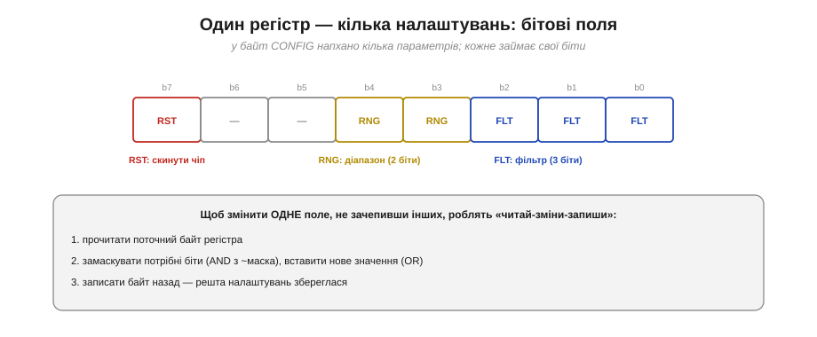
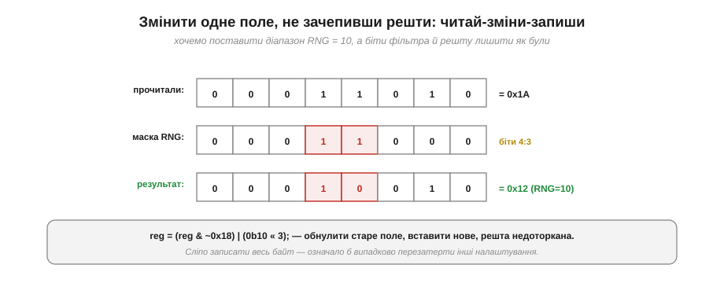

# Типова регістрова карта давача

Уся механіка [шини I2C](book:communications/i2c-bus) — старти, [адреси](book:communications/i2c-addressing), [транзакції до регістрів](book:communications/i2c-transaction), підтвердження — варта чогось лише тоді, коли з її допомогою вдається **оживити реальний чіп**. І тут чудова новина: хоч давачів тисячі, «розмовляють» вони майже однаково, і ключ до кожного — його **регістрова карта** в даташиті. Опанувавши один універсальний підхід, ти зможеш узяти **будь-який** незнайомий I2C-пристрій і за пів години змусити його працювати — не покладаючись на готову бібліотеку, а розуміючи, що відбувається.

### Регістрова карта: інструкція до чіпа

Перше, що шукаєш у даташиті, — **регістрова карта** (*register map*): таблиця всіх регістрів чіпа. Вона і є інструкція, як із ним говорити.


*Рис. Типова карта: для кожного регістра — адреса, назва, доступ (R/W), значення після скидання й призначення. Рядки бувають чотирьох типів: **ID** (сталий код для перевірки), **CONFIG/PWR** (налаштування), **DATA** (виміри) і **STATUS** (стан). Прочитати карту — означає знати, що куди писати й звідки що читати.*

Навчися бачити в карті ці **чотири типи** рядків — і будь-який чіп стане зрозумілим. **ID-регістр** (часто WHO_AM_I) — сталий код, щоб переконатися, що це справді той чіп. **Регістри налаштувань** (CONFIG, PWR_MGMT) — куди пишеш, щоб увімкнути давач і задати режим. **Регістри даних** (DATA_*) — звідки читаєш виміри. **Регістр стану** (STATUS) — звідки дізнаєшся, чи готовий новий вимір. Усе, що далі, — це робота з цими чотирма групами.

### Біти всередині регістра

Часто один регістр налаштувань пакує **кілька** параметрів — кожен у своїх бітах. Це **бітові поля** (*bit fields*).


*Рис. Байт CONFIG, де біт 7 — команда скидання (RST), біти 4:3 — діапазон (RNG), біти 2:0 — фільтр (FLT). Три налаштування в одному регістрі. Щоб змінити одне поле, не зачепивши інших, роблять «читай-зміни-запиши».*

Тут ховається важлива пастка: якщо просто **записати** весь байт заради одного поля, ти випадково **перезатреш** інші. Тому поля міняють обережно — прийомом «читай-зміни-запиши». А поки запам'ятай: один регістр ≠ одне налаштування; дивись на **біти**.

### Універсальний рецепт оживлення

Ось послідовність, що працює майже для кожного I2C-давача:


*Рис. Чотири кроки: (1) **скан** — знайти адресу; (2) **WHO_AM_I** — звірити ID, що це справді той чіп; (3) **налаштувати** — розбудити, задати діапазон і частоту; (4) **читати** — пакетом виміри, скласти й масштабувати. Перші три — раз при старті, четвертий — у головному циклі стільки разів, скільки треба.*

Цей рецепт — серце всієї теми. Кроки 1–3 виконують **один раз** при старті (знайшов, перевірив, налаштував), а крок 4 крутиться в головному циклі. Два ключові кроки — звірку ID й обережну зміну поля — варто розглянути уважніше.

### WHO_AM_I: перша перевірка

Найрозумніше, що можна зробити перед будь-яким налаштуванням, — прочитати **ID-регістр** і звірити з очікуваним значенням.


*Рис. Читаємо WHO_AM_I, очікуємо сталий код (тут 0x68), отримали 0x68 → збіглося: це той чіп, адреса й дроти справні, можна налаштовувати. Якщо ж отримали 0x00, 0xFF чи інше — не починай налаштування, спершу розберись із підключенням.*

> 🔧 **Навіщо це.** WHO_AM_I економить **години** налагодження. Він одразу відділяє два зовсім різні класи проблем: «чіп живий і відповідає» (ID збігся — далі шукай помилки в логіці) від «щось із підключенням» (ID не той — підтяжки, живлення, адреса, дроти). Значення 0xFF на всіх регістрах зазвичай означає обірвану лінію (підтяжка тримає «1»), а 0x00 — часто відсутнє живлення. Завжди став цю перевірку **першою**: вона за один обмін каже, чи варто рухатися далі.

### Читай-зміни-запиши

Тепер про обережну зміну бітового поля. Щоб поставити, скажімо, діапазон RNG = 10, не зіпсувавши біти фільтра, застосовують прийом **читай-зміни-запиши** (*read-modify-write*).


*Рис. Прочитали поточний байт (0x1A); замаскували старі біти діапазону (4:3) і вставили нове значення 10; записали назад (0x12). Біти фільтра й решта лишилися недоторканими.*

**Приклад (змінити лише поле RNG).** Хай регістр CONFIG зараз містить 0x1A, а ми хочемо виставити поле діапазону (біти 4:3) у значення 0b10, не чіпаючи решти:

```
reg = 0x1A                       // прочитали:        0001 1010
reg = reg & ~0x18                // обнулили біти 4:3: 0000 0010   (~0x18 = 1110 0111)
reg = reg | (0b10 << 3)          // вставили 10:       0001 0010 = 0x12
// записати 0x12 назад у регістр CONFIG
```

Якби ми просто записали `0b10 << 3` (тобто 0x10) у весь регістр, то випадково обнулили б біти фільтра. «Читай-зміни-запиши» — стандартний і безпечний спосіб міняти **одне** поле в регістрі.

### Сирий відлік → фізична величина

Останній крок — перетворити «голі» числа давача у фізичні величини. Чіп віддає сирі відліки (*raw counts*); даташит каже **чутливість** (*sensitivity*), щоб перевести їх у g, °/с, °C тощо.


*Рис. Сирий int16 (8192), поділений на чутливість із даташита (16384 LSB/g), дає фізичну величину (0.5 g). Без масштабу «8192» нічого не означає — саме даташит робить із відліку фізику.*

**Приклад (відлік у прискорення).** Нехай давач прискорення віддав сирий відлік 8192, а в даташиті чутливість для обраного діапазону — 16384 LSB/g:

```
величина = сирий_відлік / чутливість
величина = 8192 / 16384
величина = 0.5 g
```

Для гіроскопа масштаб буде в LSB/(°/с), для барометра — своя формула, для температури — зсув і коефіцієнт. А ще пам'ятай, що виміри часто потребують [калібрування](book:electronics/calibration) (прибрати зсув нуля): сирий відлік → масштаб → калібрування → справжня величина.

### Усе разом: оживлення в коді

Зберімо рецепт у код. Ось як виглядає типове «оживлення» давача — від перевірки до читання, усе на знайомій ідіомі `Wire`:

```
// 1. Перевірка: чи це той чіп?
uint8_t id = readReg(ADDR, REG_WHO_AM_I);
if (id != EXPECTED_ID) { /* біда з дротами/адресою — не йти далі */ }

// 2. Налаштування (виконати раз при старті):
writeReg(ADDR, REG_PWR_MGMT, 0x00);          // вийти зі сну
uint8_t c = readReg(ADDR, REG_CONFIG);       // читай-зміни-запиши:
writeReg(ADDR, REG_CONFIG, (c & ~0x18) | (RANGE << 3));   // задати діапазон

// 3. Читання вимірів (у головному циклі):
uint8_t buf[6];
readRegs(ADDR, REG_DATA_X_H, buf, 6);        // пакетом: X, Y, Z
int16_t x = (int16_t)((buf[0] << 8) | buf[1]);
float ax = x / SENSITIVITY;                  // сирий відлік → g
```

Кожен рядок спирається на знайому механіку: `readReg`/`writeReg` усередині — це той самий шаблон [«запис номера регістра, повторний старт, читання»](book:communications/i2c-transaction); перевірка ID — це WHO_AM_I; конфіг — це читай-зміни-запиши; пакетне читання — авто-інкремент адреси. Уся складність схована за чотирма кроками рецепта.

### Універсальне вміння

І ось головний підсумок не лише теми, а й усього розділу.


*Рис. Розмова з будь-яким чіпом = **протокол I2C** (універсальний) + **даташит** (специфічний для пристрою: адреса, карта регістрів, біти, масштаби). Знаючи протокол, нову мікросхему «вмикаєш» за пів години: відкрив даташит, знайшов адресу й регістри — і говориш.*

> 🔧 **Навіщо це.** У цьому й ціль розділу: не завчити один конкретний давач, а навчитися «оживляти» **будь-який**. Готові бібліотеки — зручність, і ними варто користуватися; але тепер ти розумієш, що саме вони роблять усередині, і зможеш полагодити їх, коли щось піде не так, чи написати драйвер для чіпа, на який бібліотеки ще немає. Протокол ти знаєш — лишається відкрити даташит і прочитати таблицю.

---

Варто бачити й межі самого I2C. Це дотепний компроміс: [дві лінії](book:communications/i2c-bus), багато пристроїв на спільній шині, помірна швидкість — ціною [адресації](book:communications/i2c-addressing) й повільного [відкритого колектора](book:electronics/open-collector). Коли потрібна **швидкість** і не шкода кількох зайвих ліній, беруть іншу синхронну шину — [SPI](book:communications/spi-bus): повнодуплексну, без адрес і підтяжок, із роздільними лініями даних в обидва боки. Але регістрова карта лишається тією самою ідеєю незалежно від шини: відкрив даташит, знайшов адресу й регістри — і говориш.
