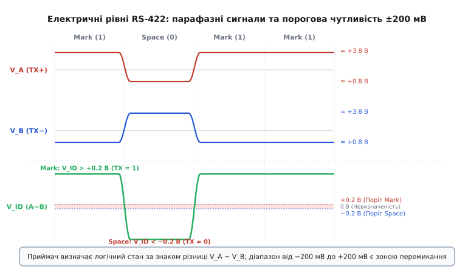
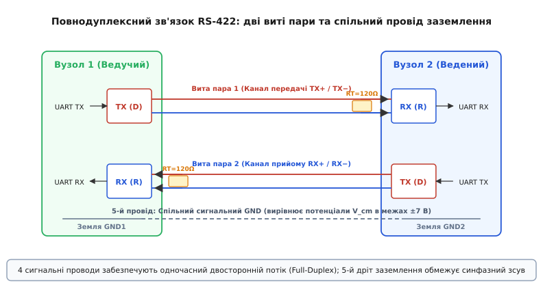
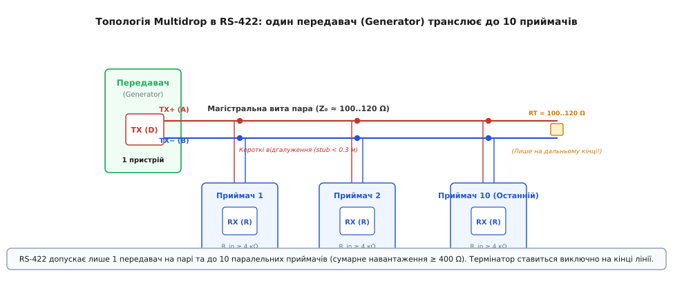
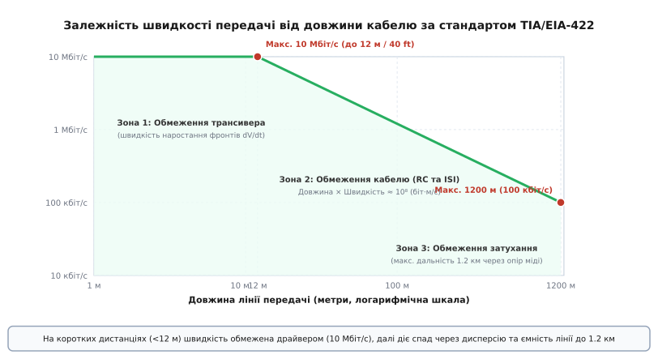
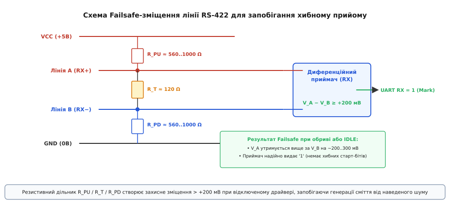

# RS-422

<preknowlist>
- [Диференційна пара](topic:communications/differential-pair) — передача сигналу двома протифазними лініями для подавлення спільних синфазних завад.
- [Межі однобічних ліній](topic:communications/single-ended-line-limits) — чому однополярні рівні відносно землі втрачають форму на великій відстані та швидкості.
- [Термінування ліній зв'язку](topic:communications/termination) — узгодження хвильового опору кабелю для поглинання хвилі та усунення відбиттів сигналу.
- [Петля по землі](topic:electronics/ground-loop) — виникнення різниці потенціалів між віддаленими точками заземлення через блукаючі вирівнювальні струми.
</preknowlist>

У промисловому цеху кабель послідовного зв'язку довжиною триста метрів прокладений у металевому лотку поруч із силовими шинами живлення асинхронних двигунів та частотних перетворювачів. Кожен запуск трифазного приводу наводить у провідниках сплески напруги амплітудою в кілька вольтів, а різниця потенціалів між контурами заземлення двох цехових шаф сягає чотирьох вольтів. Спроба передати цифрові дані звичайним однобічним сигналом UART або RS-232, де логічні рівні відлічуються від місцевої землі, зазнає повної невдачі: наведені імпульси спотворюють біти, а зсув землі зсуває поріг спрацьовування приймача. Стандарт **RS-422** (офіційно закріплений як **ANSI/TIA/EIA-422-B** та міжнародна рекомендація **ITU-T V.11**) розв'язує цю фізичну суперечність: він переводить канал зв'язку на **симетричну диференційну напругу**, забезпечуючи надійну повнодуплексну передачу зі швидкістю до 10 Мбіт/с на коротких дистанціях та зв'язок на відстанях до 1200 метрів.

> 📜 Історичний шлях виникнення стандарту у 1975 році, його стандартизацію комітетом EIA TR-30 та прийняття секцією ITU-T у формі рекомендацій V.11 та X.27 докладно висвітлено в [історії стандартизації RS-422 та ITU-T V.11](topic:communications/rs-422/hist-v11-standardization.md).

### Фізична основа диференційного зв'язку: парафазна напруга та пороги ±200 мВ

В однобічних лініях приймач зчитує напругу на єдиному сигнальному провіднику відносно власної шини заземлення. Якщо між передавачем і приймачем виникає різниця потенціалів землі або зовнішнє магнітне поле наводить паразитну електрорушійну силу, ця завада додається безпосередньо до амплітуди корисного сигналу. 

RS-422 докорінно змінює фізику вимірювання: замість одного дроту для кожного напрямку передачі використовується **вита пара двох ізольованих провідників**, які позначають як лінію **A** (неінвертуюча, або `TX+` / `RX+`) та лінію **B** (інвертуюча, або `TX-` / `RX-`).

Передавач (Generator) формує парафазний сигнал: коли на вхід передавача надходить логічна одиниця, на виході A встановлюється високий потенціал, а на виході B — низький. При появі логічного нуля виходи міняються станами: потенціал A падає до низького рівня, а B зростає до високого. 

Приймач (Receiver) побудований на основі прецизійного диференційного компаратора, який повністю ігнорує абсолютний потенціал кожного дроту відносно землі й вимірює виключно **диференційну різницю напруг** між ними:

```
V_ID = V_A − V_B
```


*Формування диференційного сигналу в RS-422: угорі показано парафазні напруги на провідниках A і B; унизу — результуюча різниця V_ID = V_A − V_B із позначенням порогових зон Mark (+0.2 В) та Space (−0.2 В).*

Стандарт TIA/EIA-422-B встановлює чіткі порогові рівні для інтерпретації логічних станів приймачем:
- **Логічна одиниця (Mark / Стан спокою):** Різниця потенціалів `V_A - V_B` є строго додатною і перевищує **+200 мВ** (`V_ID ≥ +0.2 В`). У цьому стані вихід приймача видає логічну одиницю (рівень VCC для підключеного контролера UART).
- **Логічний нуль (Space / Активний стан старт-біта):** Різниця потенціалів `V_A - V_B` є від'ємною і меншою за **-200 мВ** (`V_ID ≤ -0.2 В`). Вихід приймача перемикається в нульовий логічний рівень (GND).
- **Зона невизначеності (Нечутлива зона):** Інтервал напруг між **-200 мВ та +200 мВ** є пороговою зоною перемикання компаратора. Якщо диференційна напруга потрапляє в цей діапазон (наприклад, при обриві кабелю або під час перехідного процесу наростання фронту), логічний стан виходу приймача не гарантується і визначається внутрішнім гістерезисом мікросхеми.

Вихідний каскад передавача під тестовим навантаженням 100 Ом (що імітує узгоджену виту пару) зобов'язаний генерувати диференційний розмах `|V_OD|` в діапазоні від **2.0 В до 5.0 В** (типово близько 3.0–3.6 В). 

Оскільки мінімальна гарантована амплітуда передавача становить 2.0 В, а приймач упевнено розпізнає біт уже при 0.2 В, система отримує гігантський **запас завадостійкості у 1.8 В** (2000 мВ − 200 мВ = 1800 мВ). Це дозволяє сигналу зберігати повну читабельність навіть після проходження кілометрового кабелю, де омічний опір тонких мідних жил просаджує вихідну напругу в кілька разів.

> 📋 Повні числові параметри, таблиці істинності, допустимі струми короткого замикання та типові розпіновки роз'ємів DB-9, RJ45 і клемників зібрано у [довідковій специфікації інтерфейсу RS-422](topic:communications/rs-422/api-pinout-and-signals.md).

### Внутрішня схемотехніка вхідного каскаду та механізм CMRR

Щоб зрозуміти, як саме приймач RS-422 витримує високі напруги та виділяє мілівольтові перепади, розгляньмо внутрішню архітектуру його диференційного вхідного каскаду.

Типовий вхідний каскад складається з двох високоомних прецизійних резистивних дільників напруги, вхідного буфера з захисними діодами та диференційного компаратора на базі біполярних або польових транзисторів. Резистори дільників формуються на напівпровідниковому кристалі методом тонкоплівкового напилення з лазерною підгонкою, що забезпечує ідентичність коефіцієнтів ділення ліній A і B з точністю до десятих часток відсотка.

Коли синфазна завада `V_cm` (наприклад, наведена синусоїда 50 Гц або імпульс від контактора) надходить на клеми A і B, вона ділиться обома дільниками в однаковій пропорції:

```
V_in_plus  = (V_A · R2) / (R1 + R2)
V_in_minus = (V_B · R2) / (R1 + R2)
```

Диференційний підсилювач віднімає ці напруги:

```
V_out_diff = K_diff · (V_in_plus − V_in_minus)
           = K_diff · [ (V_A − V_B) · R2 / (R1 + R2) ]
```

Усе, що було однаковим для обох провідників, строго взаємно віднімається і прямує до нуля. Здатність схеми пригнічувати синфазний сигнал кількісно характеризується **коефіцієнтом придушення синфазного сигналу (Common-Mode Rejection Ratio, CMRR)**, який для якісних трансиверів становить від 60 до 80 дБ на низьких частотах (ослаблення синфазної завади у 1000–10000 разів).

### Повнодуплексна 4-провідна архітектура та обов'язковий 5-й провід землі

Класичний інтерфейс RS-422 розрахований на **повнодуплексну (Full-Duplex)** передачу даних: передача та прийом інформації відбуваються одночасно без взаємних затримок і без необхідності перемикати вихідні каскади між станами трансляції та прослуховування.

Для організації повнодуплексного каналу між двома пристроями (ведучим і веденим) використовують дві незалежні виті пари провідників:
1. **Перша вита пара (TX+ / TX-):** З'єднує диференційний вихід передавача першого пристрою з диференційним входом приймача другого пристрою.
2. **Друга вита пара (RX+ / RX-):** З'єднує передавач другого пристрою зі входом приймача першого пристрою.


*Повнодуплексна топологія RS-422: дві незалежні виті пари забезпечують одночасний двосторонній обмін між ведучим і веденим вузлами; 5-й провід заземлення об'єднує сигнальні землі GND1 та GND2 для обмеження синфазної напруги.*

Поширена інженерна ілюзія полягає в тому, що оскільки сигнал передається як різниця потенціалів між парою дротів, сигнальне заземлення для диференційного зв'язку взагалі не потрібне. На практиці з'єднання лише чотирма сигнальними проводами без спільної землі є головною причиною раптових збоїв та виходу обладнання з ладу.

Диференційний приймач є електронною напівпровідниковою схемою, вхідні транзистори якої живляться від місцевого джерела напруги (зазвичай +5 В відносно місцевої землі GND). Вхідні напруги на виводах A і B повинні залишатися в межах фізичної працездатності вхідного каскаду. Якщо два прилади віддалені на 100 метрів і живляться від різних розеток або фаз, між їхніми корпусами накопичується статичний потенціал або діє напруга вирівнювальних струмів силової мережі. 

Без фізичного провідника землі цей потенціал «підвішує» виту пару, і напруга на входах приймача може сягнути десятків або сотень вольтів відносно його внутрішньої землі GND, що неминуче викликає електричний пробій вхідних діодів і випалювання трансивера.

Тому стандартна промислова лінія RS-422 вимагає **5-провідного підключення**: дві сигнальні виті пари (4 дроти) плюс **п'ятий провід сигнального заземлення (Signal GND)**, який з'єднує опорні точки схемних земель обох трансиверів.

> 🔧 **Навіщо це.** Спільний провідник GND створює шлях з низьким опором для повернення синфазних струмів витоку та зрівнює потенціали корпусів, гарантуючи, що миттєва напруга на будь-якому сигнальному проводі відносно землі приймача ніколи не вийде за нормативний безпечний діапазон від -7 В до +7 В.

### Діапазон синфазної напруги (Common-Mode Voltage)

Напруга на провідниках диференційної лінії зв'язку відносно землі приймача складається з двох компонентів: власного корисного диференційного перепаду `V_diff` та загального для обох проводів постійного чи змінного зміщення — **синфазної напруги** `V_cm` (Common-Mode Voltage).

```
V_A = V_cm + (V_diff / 2)
V_B = V_cm − (V_diff / 2)
```

При відніманні напруг у диференційному підсилювачі синфазна складова `V_cm` взаємно скорочується:

```
(V_cm + V_diff / 2) − (V_cm − V_diff / 2)
= V_cm − V_cm + V_diff / 2 + V_diff / 2     [розкриття дужок]
= 0 + V_diff                                 [скорочення V_cm]
= V_diff                                     [залишок корисного сигналу]
```

Однак здатність вхідного каскаду віднімати синфазну напругу обмежена напругою пробою напівпровідникових переходів та динамічним діапазоном внутрішніх дільників. Стандарт ANSI/TIA/EIA-422-B гарантує безпомилковий прийом даних та збереження повної чутливості ±200 мВ за умови, що синфазна напруга на входах перебуває в межах:

```
−7.0 В ≤ V_cm ≤ +7.0 В
```

Діапазон від **-7 В до +7 В** покриває більшість типових падінь напруги та паразитних наведень у межах одного виробничого приміщення чи транспортного засобу. Якщо ж лінія прокладається між окремими будівлями з різними контурами трансформаторних підстанцій, де різниця потенціалів заземлення під час аварій або грозових розрядів може перевищувати десятки вольтів, стандартного діапазону ±7 В стає недостатньо. 

У таких умовах обов'язковим інженерним рішенням є застосування **гальванічної ізоляції** (на базі оптопар або магнітних/ємнісних цифрових ізоляторів) та ізольованих DC-DC перетворювачів живлення вузла зв'язку, що розриває провідний контур землі та піднімає допустиму синфазну міцність ізоляції до 2.5–5 кВ.

### Багатоточкова топологія (Multidrop): один передавач і до 10 приймачів

Окрім класичного режиму «точка-точка» (з'єднання двох вузлів), специфікація RS-422 дозволяє будувати розподілені системи збору даних або розсилки команд за топологією **симплексного багатоточкового мовлення (Multidrop)**.

У такій конфігурації до єдиної магістральної витої пари підключається **строго один передавач (Generator)** і **до 10 паралельних приймачів (Receivers)**.


*Топологія Multidrop: один передавач транслює потік даних до групи приймачів (до 10 вузлів); термінатор встановлюється виключно на дальньому кінці кабелю, а відводи від магістралі тримаються мінімальними.*

Обмеження кількості приймачів числом 10 випливає з вимог до навантажувальної здатності вихідного каскаду передавача:
- За стандартом TIA/EIA-422-B мінімальний вхідний опір приймача постійному струму становить `R_in ≥ 4 кОм`.
- Паралельне підключення 10 таких приймачів створює еквівалентний сумарний опір навантаження:

```
R_load_rx = 4000 Ом / 10 = 400 Ом
```

- На дальньому кінці магістралі встановлюється паралельний термінальний резистор `R_T = 100 Ом` для узгодження хвильового опору кабелю.
- Результуючий повний опір навантаження, який бачить вихідний каскад передавача:

```
R_total = (R_load_rx · R_T) / (R_load_rx + R_T)   [паралельне з'єднання 10 приймачів і термінатора]
        = (400 · 100) / (400 + 100)              [підстановка значень опорів навантаження]
        = 40000 / 500                            [обчислення добутку та суми]
        = 80 Ом                                  [підсумковий опір навантаження драйвера]
```

Драйвер RS-422 спроектований так, щоб гарантовано видавати перепад напруги понад 2.0 В на навантаженні аж до 80–100 Ом, не перегріваючись і не виходячи з ладу при струмах до 40–50 мА.

> ⚠️ **Чому в класичному RS-422 не можна ставити два передавачі на одну лінію:**
> Стандарт EIA-422 створювався для систем із постійно активним передавачем. Вихідний каскад класичного драйвера не має обов'язкового високоімпедансного третього стану (High-Z). Якщо підключити до однієї пари два передавачі й увімкнути їх одночасно, станеться апаратний конфлікт: коли перший драйвер видаватиме високий рівень (+5 В), а другий — низький (0 В), між ними виникне струм короткого замикання (до 150 мА), напруга в лінії впаде в невизначену зону, а мікросхеми перегріються. Для систем із багатьма передавачами на спільній парі було створено стандарт [RS-485](topic:communications/rs-485).

### Швидкість передачі, довжина кабелю та фізика лінії

Між граничною швидкістю передачі даних та максимальною довжиною кабелю в інтерфейсі RS-422 існує фундаментальний компроміс, зумовлений хвильовими та частотними властивостями кабелю як довгої лінії передачі.


*Крива компромісу між швидкістю та дистанцією за стандартом TIA/EIA-422: чітко виділяються три ділянки — обмеження швидкодії трансивера (10 Мбіт/с до 12 м), ділянка затухання в кабелі та міжсимвольної інтерференції, та омічна межа дальності 1200 м.*

Крива залежності TIA/EIA-422 поділяється на три характерні робочі зони:

1. **Зона 1: Обмеження швидкодії кремнію (довжина від 0 до 12 метрів):**
   На коротких дистанціях спотворення у витій парі мізерні. Гранична швидкість становить **10 Мбіт/с** і обмежується внутрішньою швидкодією транзисторів драйвера та часом наростання/спаду вихідного фронту (типово `t_rise ≈ 10–20 нс`).
2. **Зона 2: Обмеження затухання кабелю та міжсимвольної інтерференції (від 12 до 1200 метрів):**
   На цій ділянці діє емпіричне правило сталого добутку швидкості на довжину:

```
Швидкість (біт/с) · Довжина (м) ≈ 10⁸
```

   Наприклад, на відстані 100 метрів надійна робота досягається на швидкостях до 1 Мбіт/с; на дистанції 500 метрів — до 200 кбіт/с; на повній довжині 1200 метрів — до 100 кбіт/с. 

   Причиною спаду є високочастотні втрати в кабелі. На частотах у кілька мегагерців проявляється **скін-ефект**: змінний струм витісняється до зовнішньої поверхні мідного провідника. Глибина скін-шару `δ` для міді обчислюється як:

```
δ = √( ρ / (π · f · μ) )
```

   На частоті 10 МГц товщина скін-шару становить лише близько 20 мікрометрів. Ефективний переріз провідника різко зменшується, а активний опір зростає у кілька разів. Разом із діелектричними втратами в ізоляції це призводить до значного затухання вищих гармонік прямокутного сигналу, фронти затягуються, а сусідні імпульси накладаються один на одного — виникає **міжсимвольна інтерференція (Inter-Symbol Interference, ISI)**, що деформує сигнал і робить неможливим декодування бітів.
3. **Зона 3: Омічна межа дальності (1200 метрів / 4000 футів):**
   На дистанціях понад 1.2 км активний опір мідного проводу (для типового калібру 24 AWG опір петлі становить близько 170 Ом на кілометр) у комбінації з кінцевим термінатором 100 Ом утворює резистивний дільник напруги. Сигнал передавача просідає настільки глибоко, що різниця напруг на кінці лінії наближається до порогу чутливості компаратора (200 мВ), унеможливлюючи подальше збільшення довжини навіть на мінімальній швидкості.

### Узгодження лінії (термінування)

Електричний сигнал поширюється мідною витою парою у вигляді електромагнітної хвилі зі скінченною швидкістю, яка залежить від діелектричної проникності ізоляції провідників (для поліетиленової ізоляції швидкість поширення становить приблизно `v ≈ 0.66 · c ≈ 200 000 км/с`, тобто час затримки дорівнює приблизно **5 наносекунд на кожен метр кабелю**).

Якщо лінія має значну електричну довжину, а її кінець залишається розімкненим (високий вхідний опір приймача `R_in ≥ 4 кОм` практично еквівалентний розриву кола), хвиля напруги не поглинається навантаженням. Відповідно до законів електродинаміки, на межі зміни імпедансу виникає **відбита хвиля**, яка повертається назад до передавача, накладається на корисні цифрові імпульси й створює паразитні коливання («дзвін», ringing) та ступінчасті спотворення на фронтах сигналів.

Критерієм необхідності термінування є співвідношення між часом наростання фронту передавача `t_r` та подвійним часом проходження сигналу по кабелю `t_prop`:

```
t_line = 2 · (Довжина / v_prop)
```

Якщо час проходження `t_line` перевищує 10% від тривалості фронту імпульсу (`t_line > 0.1 · t_r`), лінія вважається **довгою лінією передачі** і вимагає обов'язкового узгодження. Наприклад, для швидкісного трансивера з крутизною фронту `t_r = 20 нс` критична довжина становить:

```
L_crit = (0.1 · t_r · v_prop) / 2                [критична довжина за правилом 10% фронту]
       = (0.1 · 20 нс · 0.2 м/нс) / 2            [підстановка параметрів фронту та швидкості]
       = 0.2 метра (20 см)                       [гранична довжина лінії без узгодження]
```

Таким чином, для будь-якої реальної лінії зв'язку довжиною понад півметра термінування є обов'язковим.

Узгодження досягається встановленням паралельного резистора-термінатора `R_T`, номінал якого строго відповідає **хвильовому опору (Z_0)** обраного кабелю:

```
R_T = Z_0 ≈ 100...120 Ом
```

Правила розміщення термінаторів в RS-422:
1. **Тільки на приймальному кінці:** У повнодуплексному каналі «точка-точка» резистор `R_T` встановлюють безпосередньо біля виводів кожного з двох приймачів (на Master RX та на Slave RX). На виходах передавачів термінатори не ставлять.
2. **Виключно на останньому вузлі в Multidrop:** У симплексній системі з одним передавачем і кількома приймачами термінатор `R_T = 100–120 Ом` встановлюють **лише один**, на найвіддаленішому приймачі магістралі. Встановлення термінаторів на проміжних приймачах неприпустиме: кожен паралельний резистор знижує сумарний опір навантаження, перевантажуючи вихідні транзистори передавача.

### Захист пасивного стану: Failsafe-зміщення шини

Коли передавач вимкнений, розімкнений або кабель зв'язку зазнає механічного пошкодження (обрив жил чи коротке замикання між проводами A і B), напруга на виходах лінії падає до нуля:

```
V_A − V_B ≈ 0 В
```

Значення 0 В потрапляє в зону невизначеності приймача (від -200 мВ до +200 мВ). Будь-яка мікроскопічна теплова завада або електромагнітне наведення амплітудою в кілька мілівольтів починає хаотично перемикати внутрішній компаратор приймача. Приймач генерує на виході RX безперервний потік випадкових бітів («сміття»), які контролер UART сприймає як фальшиві старт-біти, викликаючи помилки кадрування (Framing Error) та перевантаження черги переривань процесора.

Для гарантування стабільного високого рівня логічної одиниці (Mark / Idle) у пасивному або аварійному стані застосовують схемотехнічне рішення **Failsafe Biasing** (захисне зміщення шини).


*Схема резистивного дільника Failsafe: резистор підтяжки R_PU до VCC на провіднику A та резистор стяжки R_PD до GND на провіднику B створюють на термінаторі R_T постійне захисне зміщення понад +200 мВ.*

Схема складається з резистивного дільника:
- Резистор підтяжки `R_PU` (Pull-Up) підключається між шиною живлення `VCC (+5 В)` та сигнальною лінією **A** (`RX+`).
- Резистор стяжки `R_PD` (Pull-Down) підключається між лінією **B** (`RX-`) та сигнальною землею `GND`.
- Між лініями A і B увімкнено термінальний резистор `R_T = 120 Ом`.

Розрахунок номіналів дільника полягає у створенні на резисторі `R_T` диференційного зміщення `V_diff ≥ +200 мВ` за відсутності активного сигналу від передавача.

При симетричних резисторах `R_PU = R_PD = R_bias` струм дільника від джерела `VCC = 5.0 В`:

```
I_bias = VCC / (2 · R_bias + R_T)
```

Напруга зміщення на термінаторі:

```
V_diff = I_bias · R_T = (VCC · R_T) / (2 · R_bias + R_T)
```

Підставимо граничну умову безпечного порогу `V_diff = 0.25 В` (із запасом 50 мВ понад поріг 0.2 В):

```
V_diff = (VCC · R_T) / (2 · R_bias + R_T)        [формула дільника напруги на термінаторі]
0.25   = (5.0 · 120) / (2 · R_bias + 120)        [підстановка V_diff = 0.25 В, VCC = 5 В, R_T = 120 Ом]
2 · R_bias + 120 = 600 / 0.25 = 2400             [вираження знаменника дробу]
2 · R_bias       = 2400 − 120 = 2280             [перенесення доданка R_T]
R_bias           = 2280 / 2 = 1140 Ом            [розрахунок одного резистора зміщення]
```

На практиці обирають найближчі стандартні номінали резисторів `R_PU = R_PD = 560...1000 Ом`. При номіналі 1 кОм зміщення на термінаторі 120 Ом становить близько +280 мВ, що надійно утримує внутрішній компаратор у стані Mark (високий рівень RX) навіть при повністю відключеному передавачі або обриві кабелю.

Сучасні інтегральні мікросхеми трансиверів (наприклад, MAX3080, SN65HVD3082) мають **вбудований асиметричний Failsafe**: їхній внутрішній поріг перемикання зміщено на рівень від -200 мВ до -50 мВ (замість симетричних ±200 мВ). Якщо напруга в лінії дорівнює нулю (`V_ID = 0 В`), компаратор мікросхеми гарантовано бачить стан Mark без необхідності встановлення зовнішніх навісних резисторів підтяжки.

> ⚙️ Практичну схему підключення мікросхем трансиверів MAX490/ST422, розрахунок захисних TVS-супресорів та робочий програмний стек для Linux наведено у [практичній схемотехніці та програмному стеку RS-422](topic:communications/rs-422/proj-rs422-transceiver.md).

### Фільтрація високочастотних завад: синфазний дросель (Common-Mode Choke)

У жорстких промислових умовах з високим рівнем електромагнітної емісії (наприклад, у безпосередній близькості від тиристорних перетворювачів або зварювальних автоматів) одного диференційного приймача може бути недостатньо для повного придушення високочастотних завад. На частотах понад 10–50 МГц швидкість наростання синфазної завади `dV_cm / dt` настільки велика, що через паразитну ємність монтажу вхідні транзистори компаратора тимчасово виходять із лінійного режиму.

Для додаткового захисту в розрив ліній A і B безпосередньо біля роз'єму встановлюють **синфазний дросель (Common-Mode Choke)**:

```
  Лінія A ────[ Дросель L1A ]────► До входу RX+ трансивера
                     ║ (спільне феритове осердя)
  Лінія B ────[ Дросель L1B ]────► До входу RX− трансивера
```

Принцип дії синфазного дроселя ґрунтується на різниці взаємної індукції:
- **Для корисного диференційного сигналу:** Струми в провідниках A і B течуть у протилежних напрямках. Магнітні потоки, створені цими струмами у спільному феритовому осерді, мають протилежні знаки і повністю взаємно компенсуються. Індуктивність дроселя для корисного сигналу прямує до мізерної величини індуктивності розсіювання (зазвичай менше 1–2 мкГн), і диференційний цифровий потік проходить крізь дросель практично без затухання.
- **Для наведеної синфазної завади:** Струми завади на обох провідниках мають однаковий напрямок і фазу. Їхні магнітні потоки у фериті додаються, завдяки чому дросель створює для синфазного струму гігантський індуктивний опір (від 500 Ом до 5 кОм на частотах 10–100 МГц). Синфазна завада затримується дроселем і скидається через захисні конденсатори в землю, не потрапляючи на чутливі вхідні каскади трансивера.

### Діагностика лінії зв'язку та характерні несправності

При пусконалагоджувальних роботах на реальних об'єктах інженери використовують осцилограф із диференційним пробником для аналізу форми сигналу безпосередньо на клемах приймача. Типові спотворення сигналів мають чіткі фізичні причини:

1. **Дзвін та викиди на фронтах (Ringing):**
   На кожному перепаді спостерігаються високочастотні затухаючі коливання амплітудою понад 1–2 В. Це свідчить про відсутність термінатора `R_T = 120 Ом` на приймальному кінці лінії або підключення віддаленого приймача через надто довгий відвід (Stub > 0.5 м).
2. **Інверсія полярності проводів A і B:**
   Якщо при підключенні кабелю приймач постійно видає на контролер логічний нуль (Space) замість стану спокою (Mark), а UART фіксує безперервний сигнал Break або помилку кадрування, проводи витої пари переплутані місцями: лінія TX+ потрапила на вхід RX-, а TX- — на RX+.
3. **Обрізання верхівок сигналу (Common-Mode Clipping):**
   Якщо диференційний сигнал виглядає спотвореним і несиметричним відносно нуля, а його амплітуда періодично падає, це ознака виходу синфазної напруги за межі допустимого діапазону (понад ±7 В). Необхідно перевірити цілісність 5-го проводу заземлення або встановити гальванічну розв'язку.

### Сфери застосування та архітектурне позиціонування

Завдяки поєднанню високої завадостійкості, підтримки кілометрових відстаней, повної апаратної симетрії та відсутності необхідності програмного арбітражу шини інтерфейс RS-422 закріпився в низці критично важливих галузей:

1. **Промислова робототехніка та верстати з ЧПК:** Сигнали зворотного зв'язку від прецизійних оптичних та магнітних енкодерів переміщення передаються на контролери керування двигунами за протоколами **SSI (Synchronous Serial Interface)** або **EnDat**, де фізичним рівнем тактового сигналу (Clock) та даних (Data) є стандарт RS-422 на частотах від 100 кГц до 5 МГц.
2. **Професійне відеовиробництво та мовлення:** Стандарт **Sony 9-Pin (P2 Protocol)** на базі RS-422 залишається універсальним протоколом апаратного керування роботизованими студійними камерами (PTZ), серверами повторів, мікшерами та телесуфлерами на відстанях до сотень метрів без ризику виникнення затримок пакетної передачі.
3. **Авіоніка та космічні апарати:** Повнодуплексні канали RS-422 використовують для зв'язку між бортовими обчислювачами, навігаційними датчиками (IMU, GNSS) та сервоприводами керування площинами завдяки найвищому рівню електромагнітної сумісності (EMC) та стійкості до імпульсних наведень від блискавок і радіолокаторів.

> 🔌 Детальне інженерне порівняння електричних характеристик, топологій та енергоспоживання RS-422 зі стандартами RS-232, RS-485 та LVDS наведено у [порівняльному аналізі послідовних інтерфейсів](topic:communications/rs-422/comp-differential-interfaces.md).

RS-422 представляє класичний приклад інженерного балансу: відмова від складного багатоточкового арбітражу на користь простого, але гранично захищеного повнодуплексного фізичного каналу забезпечує абсолютну детермінованість передачі даних у найбільш несприятливих електромагнітних умовах.
