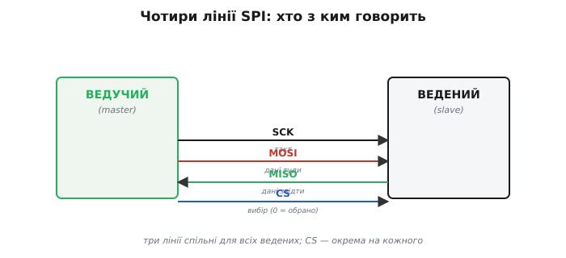
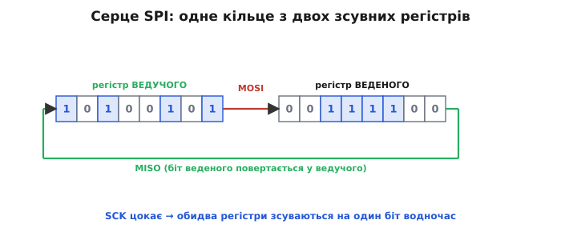
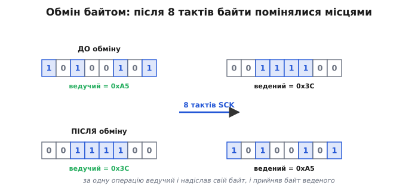
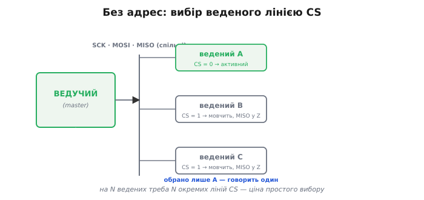
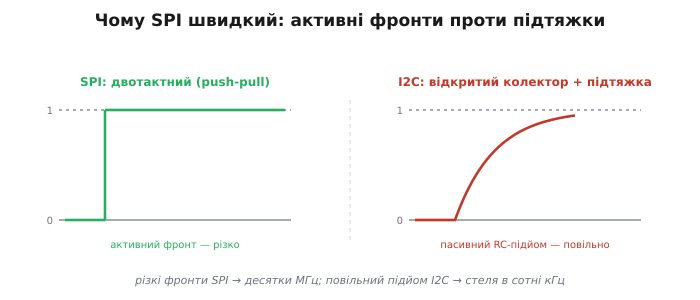
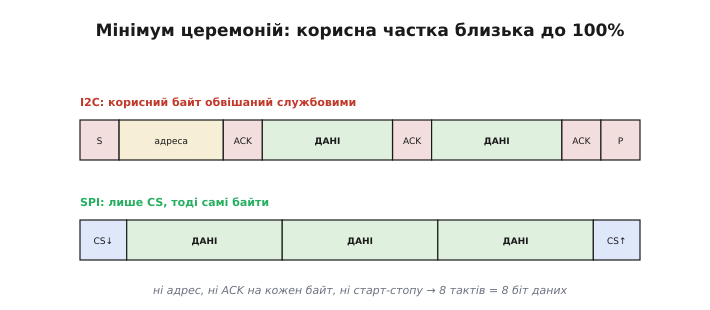
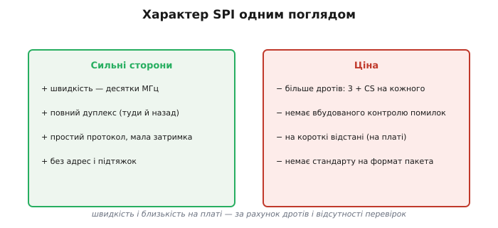

# Шина SPI

SPI (*Serial Peripheral Interface* — послідовний інтерфейс для периферії) має напрочуд елегантну головну ідею, з якої одразу випливають і його повний дуплекс, і висока швидкість. Варто розібрати цю ідею — і вся решта поведінки шини стає очевидною. Народилася вона в Motorola на початку 1980-х; як і чому — у вставці нижче.

> 📜 SPI придумали в Motorola для своїх мікроконтролерів (вперше — у родині 6805, далі у відомій 68HC11), і саме звідти пішли назви ліній і сам термін. Чому знадобився ще один інтерфейс, коли вже був UART, і як паралельно жив майже такий самий Microwire від National Semiconductor — [коротка історія SPI](topic:communications/spi-bus/hist-spi.md).

### Чотири лінії й ролі

SPI у класичному вигляді має **чотири** лінії, у кожної — чітка роль.

*Такт **SCK** (*Serial Clock*) завжди генерує ведучий. **MOSI** (*Master Out, Slave In* — «вихід ведучого, вхід веденого») несе дані від ведучого до веденого, **MISO** (*Master In, Slave Out*) — назад, від веденого до ведучого. **CS** (*Chip Select* — «вибір кристала», активний нулем) обирає веденого. Три перші лінії спільні для всіх ведених, а CS — окрема на кожного.*

У SPI **дві окремі** лінії даних: MOSI «туди» і MISO «звідти». Це вже натякає на повний дуплекс — на відміну від єдиної SDA в [I2C](topic:communications/i2c-bus). Такт SCK, як і в I2C, генерує ведучий — він господар часу. А ось замість адрес тут CS: щоб обрати веденого, ведучий опускає саме його лінію CS у нуль. За кожним із цих чотирьох імен — [MOSI, MISO, SCK, CS](topic:communications/spi-lines) — стоїть окрема лінія зі своїм господарем, і саме з їхньої взаємодії складається весь обмін.

### Серце SPI: кільце зсувних регістрів

Ось ідея, з якої виростає весь SPI. Уявімо у ведучому й у веденому по одному [**зсувному регістру**](topic:electronics/register) — по 8 біт. З'єднаймо їх **у кільце**: вихід ведучого (MOSI) йде у вхід веденого, а вихід веденого (MISO) повертається у вхід ведучого. І хай SCK зсуває **обидва** регістри одночасно.

*Регістри ведучого й веденого з'єднані в кільце: MOSI несе біт із ведучого у веденого, MISO — біт із веденого назад у ведучого. Кожен такт SCK зсуває обидва на один біт. По суті це одне велике 16-бітне кільце, яке ведучий «прокручує» тактом.*

Це і є вся механіка SPI: **одне кільце, яке прокручують тактом**. На кожному такті SCK один біт виходить з ведучого по MOSI й заходить у веденого, і **водночас** один біт виходить із веденого по MISO й заходить у ведучого. Передача й прийом — це **той самий зсув**, тому вони нероздільні й відбуваються одночасно. Звідси й повний дуплекс — не як окрема функція, а як **наслідок самої будови**.

### Обмін байтом: повний дуплекс

За 8 тактів кільце прокручується рівно на один байт — погляньмо, що з ним станеться.

*До обміну: у ведучого 0xA5, у веденого 0x3C. Після 8 тактів SCK регістри прокрутилися повністю — і байти помінялися місцями: тепер у ведучого 0x3C, у веденого 0xA5. За одну операцію ведучий і надіслав свій байт, і прийняв байт веденого.*

Ось характерна риса SPI, яку варто прийняти одразу: обмін **завжди двобічний**. Коли ведучий «надсилає» байт, він тим самим зсувом **отримує** байт від веденого; коли «читає» — мусить щось висунути по MOSI, щоб прокрутити кільце. Тому навіть якщо потрібен лише один напрямок (скажімо, тільки писати в дисплей), інший усе одно «крутиться»: у бік, який не цікавить, шлють пусті байти (часто 0x00 чи 0xFF) і просто ігнорують те, що прийшло назад.

> 🔧 **Навіщо це.** Звідси випливає головна особливість програмування SPI: **`transfer(x)` одночасно і пише, і читає**. Функція обміну приймає байт для надсилання й **повертає** байт, що прийшов у відповідь. Щоб лише прочитати — посилаєш «пусте» (dummy) і береш відповідь; щоб лише записати — посилаєш дані й відкидаєш повернене. Як це виглядає в реальному коді (з налаштуванням режиму й читанням регістра давача) — у [робочому прикладі обміну](topic:communications/spi-bus/proj-spi-transfer.md).

### Без адрес: вибір лінією CS

I2C гукає веденого **адресою** по спільній лінії; SPI робить інакше — у кожного веденого **своя** лінія CS, і ведучий просто опускає потрібну.

*Три ведені ділять спільні SCK/MOSI/MISO, але кожен має окрему CS. Ведучий опускає CS того, з ким говорить (тут A) — і лише той активний; решта бачать CS = 1, мовчать і відпускають MISO у високий імпеданс, щоб не заважати. Жодних адрес.*

Це проста й швидка схема вибору: жодного адресного байта, жодного звіряння — просто «обрав ніжкою». Поки CS веденого високий, той повністю **ігнорує** SCK і MOSI й тримає свій вихід MISO у високому імпедансі (відключеним), щоб не заважати обраному. Ціна очевидна: на **N** ведених треба **N** ліній CS, тобто більше ніжок мікроконтролера, ніж у I2C з його двома дротами на всіх. Це фундаментальний компроміс SPI: окрема лінія [вибору кристала](topic:communications/chip-select) на кожен пристрій.

### Чому швидкий: двотактні виходи

Перша причина швидкості SPI — електрична. На відміну від I2C з його відкритим колектором, SPI використовує звичайні **двотактні** (*push-pull* — «штовхай-тягни») виходи: вони активно женуть лінію і вгору, і вниз.

*SPI активно заряджає лінію в обидва боки — фронти різкі, тож можна тактувати дуже швидко (десятки МГц). I2C тягне вгору лише підтяжкою, і повільний RC-підйом ставить стелю швидкості. Саме тому SPI випереджає I2C на порядок і більше.*

У I2C лінію вгору тягне **пасивна** підтяжка [відкритого колектора](topic:electronics/open-collector), і повільний RC-підйом обмежує частоту сотнями кілогерц. SPI натомість жене лінію **активно** в обидва боки, фронти виходять різкі, і шину можна тактувати на десятках мегагерц. Але є й зворотний бік тієї самої медалі: двотактні виходи **не можна** просто зводити разом — два таких на одній лінії закоротять одне одного. Саме тому SPI й **не може** обійтися спільною лінією з адресами, як I2C, і змушений мати окремі лінії та CS. Швидкість і «більше дротів» тут — дві сторони одного рішення.

### Мінімум церемоній

Друга причина швидкості — **протокол**. У I2C кожен корисний байт обвішаний службовими: старт, адреса, підтвердження після кожного байта, стоп. SPI прибирає майже все це.

*У I2C байт оточений службовими елементами (S, адреса, ACK, P). У SPI — лише опустив CS, протактував потрібні байти, підняв CS. Немає ні адрес (є CS), ні підтвердження кожного байта, ні старт-стопу. Тому 8 тактів = 8 біт даних, без 9-го такту ACK.*

Це робить SPI не лише швидким за тактом, а й **ефективним**: корисна частка близька до 100%, бо немає 9-го такту підтвердження (як у I2C), немає адресних і службових байтів на кожну транзакцію. Але та сама простота має ціну: у SPI **немає вбудованого контролю помилок** — ні ACK, ні навіть стандартного формату пакета. Кожен виробник вигадує власний формат команд, а надійність (контрольні суми тощо), якщо потрібна, додають **зверху** — окремим [рівнем пакета](topic:communications/packet-design) над голим обміном байтами.

### Характер SPI

Сильні й слабкі сторони SPI зручно тримати поруч — портрет шини одним поглядом.

*Сильні сторони: швидкість (десятки МГц), повний дуплекс, простий протокол із малою затримкою, без адрес і підтяжок. Ціна: більше дротів (3 + CS на кожного), немає вбудованого контролю помилок, розрахований на короткі відстані, немає стандарту на формат пакета.*

> 🔧 **Навіщо це.** Цей портрет — головний орієнтир, коли обираєш шину. SPI беруть там, де потрібна **швидкість** і пристрій близько на платі: дисплеї, швидкі АЦП/ЦАП, [флеш-](topic:programming/spi-flash) і [SD-пам'ять](topic:boards/microsd-card), деякі радіомодулі. Там, де важливіша **економія ніжок** і пристроїв багато, а швидкість другорядна (дрібні давачі), виграє [I2C](topic:communications/i2c-bus). Дуже часто на одній платі мирно живуть **обидві** шини: повільні давачі на I2C, швидкий дисплей чи пам'ять — на SPI. Уміння обрати правильну під задачу — і є практична користь з усього сказаного про SPI.

---
