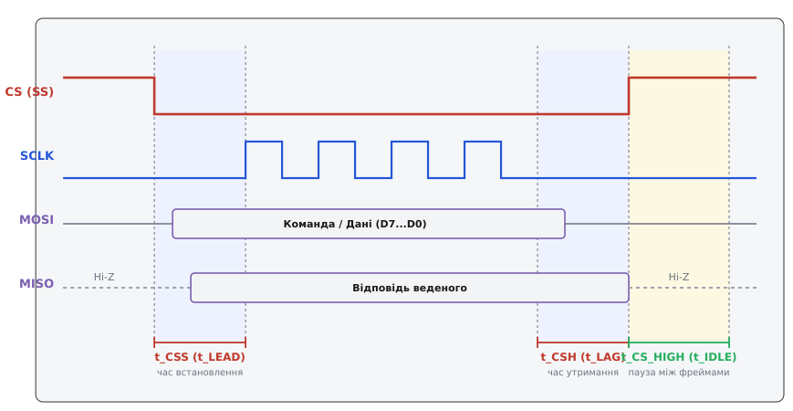
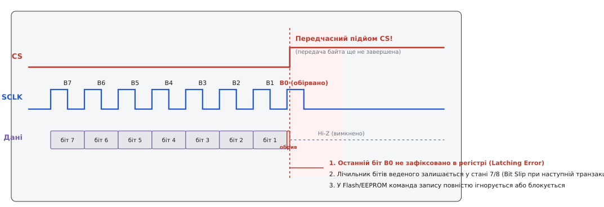
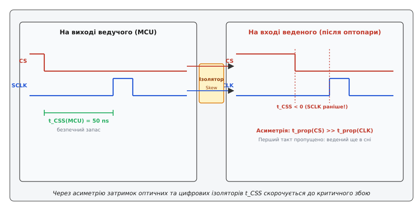
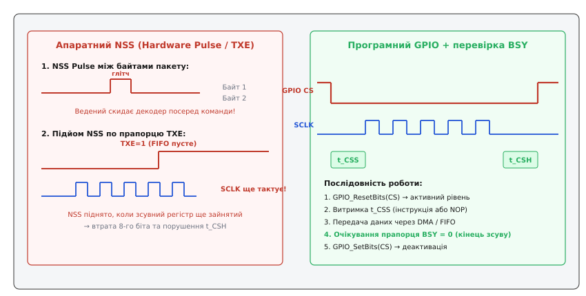

# Часові параметри CS у SPI

<preknowlist>
- [Вибір кристала (CS)](topic:communications/chip-select) — призначення лінії CS, зіркова топологія та активний нуль.
- [Фаза й полярність такту (CPOL/CPHA)](topic:communications/cpol-cpha) — чотири режими синхронізації та фронти вибірки даних.
- [Швидкість SPI](topic:communications/spi-speed) — фактори частоти, фронти та обмеження затримок ліній.
</preknowlist>

Мікроконтролер на частоті ядра 480 МГц намагається прочитати ідентифікатор виробника з мікросхеми Flash-пам'яті по шині SPI на тактовій частоті 25 МГц. Програма опускає лінію вибору кристала CS (від англ. *Chip Select*, вибір кристала; у технічній документації також зустрічаються назви *Slave Select*, SS, або *Negative Slave Select*, NSS) у логічний нуль і вже через 4 нс апаратний блок SPI видає перший фронт тактового сигналу SCLK. Але внутрішній автомат станів Flash-пам'яті вимагає щонайменше 10 нс на розблокування вхідних буферів і виведення зсувного регістра зі сну. Перший тактовий імпульс виявляється втраченим: восьмибітна команда читання `0x9F` (`10011111` у двійковому вигляді) зсувається на один біт і перетворюється на `0x3E` (`00111110`), а замість очікуваної відповіді мікроконтролер зчитує суцільні нулі або `0xFF`.

Причина такої відмови полягає в тому, що сигнал CS у протоколі SPI — це не просто статичний перемикач живлення чи дозволу інтерфейсу, а високошвидкісний динамічний строб, до якого висуваються жорсткі часові вимоги: час встановлення `t[CSS]`, час утримання `t[CSH]` та час відновлення між транзакціями `t[CS_HIGH]`. Порушення будь-якого з цих параметрів руйнує межі кадрів і призводить до фатальної десинхронізації шини.

---

### CS як динамічний бар'єр і строб автомата станів

У простих цифрових схемах вивід CS часто сприймають як звичайний статичний сигнал дозволу (від англ. *Enable*): коли на ніжці логічний нуль — пристрій працює, коли одиниця — мовчить. Проте на швидкостях понад кілька мегагерц лінія CS виконує роль головного координатора внутрішнього цифрового автомата скінченних станів (FSM, від англ. *Finite State Machine*) веденої мікросхеми.

Спадний фронт сигналу CS (перехід `1 → 0`) запускає каскад внутрішніх фізичних процесів у кремнії веденого:
1. **Пробудження вхідних каскадів**: відкриваються захисні вхідні ключі ліній SCLK та MOSI, які у стані спокою заблоковані для зниження струму витоку.
2. **Переведення вихідного каскаду MISO з Z-стану**: двотактний вихідний буфер веденого переходить зі стану високого імпедансу (від англ. *High-Impedance State*, Hi-Z) у низькоомний керований стан. На це витрачається час `t[CLZ]` (від англ. *CS Low to Output Low-Z*).
3. **Ініціалізація лічильника бітів**: внутрішній лічильник тактових імпульсів примусово скидається в нульовий стан, готуючись до прийому першого біта команди.
4. **Визначення типу інтерфейсу**: у багатьох комбінованих сенсорах (наприклад, IMU з підтримкою I2C та SPI) саме спадний фронт CS перемикає внутрішній матричний комутатор із протоколу I2C на протокол SPI.

Наростаючий фронт сигналу CS (перехід `0 → 1`) виконує не менш відповідальні функції:
1. **Фіксація та верифікація кадру**: ведений перевіряє, чи надійшла повна кількість бітів (кратна 8, 16 або 32). Якщо кількість тактів не відповідає формату команди, операція відхиляється.
2. **Апаратний запуск внутрішніх операцій**: у Flash-пам'яті та EEPROM саме наростаючий фронт CS слугує апаратним тригером (*Program Trigger*), що запускає автономний генератор високої напруги та цикл запису сторінки в масив комірок.
3. **Відключення лінії MISO**: вихідний драйвер повертається у стан Hi-Z (за час `t[CHZ]`), звільняючи спільну лінію передачі даних для інших ведених пристроїв на тій самій шині.

```
                  ┌─── Транзакція SPI (активний CS = 0) ───┐
CS:   1 ──────────┐                                        ┌────────── 1
                  │◄─ t[CSS] ─►                ◄─ t[CSH] ─►│
                  └────────────────────────────────────────┘
SCLK: 0 ───────────────┌─┐ ┌─┐ ┌─┐ ┌─┐ ┌─┐ ┌─┐ ┌─┐ ┌─┐──────────── 0
                       │1│ │2│ │3│ │4│ │5│ │6│ │7│ │8│
                       └─┘ └─┘ └─┘ └─┘ └─┘ └─┘ └─┘ └─┘
MISO: Hi-Z ───────╳────── D7 ─ D6 ─ D5 ─ D4 ─ D3 ─ D2 ─ D1 ─ D0 ──────╳─── Hi-Z
                  ▲                                        ▲
              t[CLZ] (вихід з Hi-Z)                    t[CHZ] (повернення в Hi-Z)
```

Будь-яка невідповідність між моментами перемикання CS та генерацією тактових імпульсів SCLK призводить до того, що внутрішній автомат веденого виконує операції у хибний час.

---

### Три базові часові параметри: t_CSS, t_CSH, t_CS_HIGH

Динаміка сигналу CS описується трьома критичними інтервалами, які стандартизовані виробниками напівпровідникових компонентів.


*Часова діаграма транзакції SPI (Mode 0). Показано затримку встановлення t_CSS (t_LEAD), затримку утримання t_CSH (t_LAG), паузу між кадрами t_CS_HIGH (t_IDLE) та моменти переходу лінії MISO між високим імпедансом Hi-Z та активним станом.*

#### 1. Затримка встановлення вибору: CS Setup Time (t_CSS / t_LEAD)

Час встановлення `t[CSS]` (у технічній документації низки виробників позначається як `t[LEAD]` або `t[SLCH]`, від англ. *Slave Select Low to Clock High*) — це мінімальний інтервал часу від моменту, коли спадний фронт сигналу CS досягає порогу логічного нуля на вході веденого, до моменту першого активного перепаду тактового сигналу SCLK.

Фізичний зміст параметра `t[CSS]` полягає у завершенні всіх перехідних процесів активації кристала. Якщо мікроконтролер подає перший тактовий імпульс раніше, ніж спливе час `t[CSS]`:
* Вхідний тригер D-типу зсувного регістра ще заблокований сигналом внутрішнього скидання (*Internal Reset Clamp*).
* Напруга на лініях вибірки внутрішніх матриць не встигає стабілізуватися.
* Ведений пропускає найперший біт (D7). В результаті весь наступний потік бітів зсувається вліво, що повністю спотворює код операції (*Opcode*).

Особливо гостро ця проблема проявляється у режимах з нульовою фазою такту (SPI Mode 0 та Mode 2, де CPHA = 0). За правилами CPHA = 0 ведений пристрій зобов'язаний виставити свій перший біт даних (D7) на лінію MISO **безпосередньо по спадному фронту CS ще ДО першого перепаду SCLK**!
Час, необхідний веденому для видачі валідного рівня першого біта, позначається як `t[CLQV]` або `t[V]` (від англ. *CS Low to Output Valid*).
Отже, для режимів CPHA = 0 мінімальний час `t[CSS]` повинен обов'язково покривати затримку видачі даних:

```
t[CSS_Mode0] ≥ max( t[CSS_internal], t[CLQV] + t[setup_master] )
```

Якщо ведучий почне тактувати лінію SCLK раніше, ніж спливе час `t[CLQV]`, ведучий зафіксує на першому такті невалідний стан лінії MISO.

Для швидкісних мікросхем пам'яті (SRAM, NOR Flash) типове паспортне значення `t[CSS]` становить від 5 до 10 нс. Для складних сенсорів, контролерів дисплеїв та прецизійних сигма-дельта АЦП цей час може досягати 50–150 нс.

#### 2. Затримка утримання вибору: CS Hold Time (t_CSH / t_LAG)

Час утримання `t[CSH]` (також відомий як `t[LAG]` або `t[CHSH]`, від англ. *Clock High to Slave Select High*) — це мінімальний інтервал часу від останнього активного фронту сигналу SCLK до моменту наростаючого фронту сигналу CS.

Протягом інтервалу `t[CSH]` відбуваються дві ключові події:
* Ведений пристрій завершує фіксацію останнього прийнятого біта (D0) з вхідного зсувного регістра у внутрішній тіньовий буфер або регістр адреси/даних.
* Якщо ведений передавав дані ведучому, вихідний каскад лінії MISO повинен утримувати валідний логічний рівень останнього біта стільки часу, скільки потрібно мікроконтролеру для його надійного зчитування.

Якщо ведучий піднімає CS занадто рано (до завершення `t[CSH]`):
* Внутрішній регістр не встигає зафіксувати молодший біт.
* Вихід MISO переходить у Z-стан завчасно, зрізаючи останній біт відповіді веденого безпосередньо в момент його стробування ведучим.
* Транзакція вважається веденим пошкодженою і скасовується.

У режимах з одиничною фазою такту (SPI Mode 1 та Mode 3, де CPHA = 1) вибірка останнього біта відбувається на другому (задньому) фронті тактового імпульсу SCLK. Якщо підняти CS одночасно зі спадом SCLK, ведений може вимкнути свій драйвер MISO швидше, ніж вхідний тригер мікроконтролера встигне зафіксувати рівень напруги, що призведе до зчитування випадкового значення замість молодшого біта.

#### 3. Час неактивності між транзакціями: CS High Time (t_CS_HIGH / t_IDLE / t_CSD)

Час неактивності `t[CS_HIGH]` (у даташитах: `t[IDLE]`, `t[CSD]`, від англ. *Chip Select Deselect Time*, або `t[SHSL]`, від англ. *Slave Select High to Low*) — це мінімальний інтервал часу, протягом якого лінія CS повинна безперервно залишатися у стані високого логічного рівня між закінченням попередньої транзакції та початком наступної.

Цей інтервал критично необхідний для внутрішньої підготовки веденого пристрою:
* **Апаратне скидання конвеєра**: розряджаються внутрішні ємності ланцюгів скидання, повертаючи декодер команд у вихідний стан очікування (IDLE).
* **Завершення внутрішніх циклів запису**: у пристроях енергонезалежної пам'яті (Flash/EEPROM) високий рівень CS запускає асинхронний автомат запису. Якщо знову опустити CS раніше за паспортний час `t[CS_HIGH]`, новий спадний фронт CS може бути проігнорований або заблокує поточний цикл програмування комірок, що спричинить пошкодження даних.
* **Автоінкремент покажчиків**: деякі ведені оновлюють внутрішні лічильники адрес саме під час високого рівня CS.

Паспортні значення `t[CS_HIGH]` варіюються від 10–50 нс для швидкісного читання Flash-пам'яті до 1–5 мкс для прецизійних вимірювальних систем.

Повний зведений довідник часових параметрів для різних класів пристроїв зібрано у вставці [Часові параметри популярних мікросхем SPI](topic:communications/spi-cs-timing/api-timing-params.md).

---

### Анатомія передчасного обриву CS

Однією з найпідступніших помилок при проєктуванні вбудованих систем є передчасний підйом лінії CS посеред передачі байта.


*Передчасний підйом сигналу CS під час передачі 8-го біта. Вихід MISO аварійно переходить у Z-стан, останній біт втрачається, а внутрішній лічильник бітів веденого залишається у невизначеному стані.*

Розглянемо покроково, що відбувається всередині веденого, якщо сигнал CS переходить у високий рівень під час генерації 8-го такту SCLK:

1. **Обрив циклу зсуву**: 8-й біт не потрапляє у зсувний регістр. Вхідний тригер залишається у проміжному стані.
2. **Збій засувки (Latching Failure)**: оскільки ведений очікує рівно 8 тактів для завершення прийому байта, внутрішня логіка не формує строб перенесення даних зі зсувного регістра у робочий буфер. Байт повністю губиться.
3. **Ефект розсинхронізації кадрів (Bit Slip)**: якщо ведений пристрій не має апаратного асинхронного скидання лічильника бітів по наростаючому фронту CS (що властиво багатьом простим ASIC та старим мікросхемам), його внутрішній лічильник залишається у стані «прийнято 7 біт». Під час наступної транзакції перший надісланий біт сприймається веденим як 8-й біт *попередньої* команди! Це спричиняє постійний фазовий зсув на 1 біт у всіх наступних сесіях обміну аж до повного перезавантаження живлення.
4. **Аварійне скасування операцій запису**: для команд запису Flash-пам'яті (наприклад, `0x02` *Page Program*) наростаючий фронт CS, що надійшов не на межі байта, апаратно блокує подачу напруги на високовольтні помпи заряду. Мікросхема мовчки відхиляє запис, не виставляючи жодних прапорців помилок у регістрах статусу.

---

### Схемотехнічні та фізичні чинники затримок

У реальних електронних пристроях форма та часове положення сигналу CS спотворюються фізичними параметрами друкованої плати, паразитними ємностями та проміжними активними компонентами.

#### 1. Паразитна ємність та опір навантаження (RC-ланка)

Кожна лінія на друкованій платі володіє власною ємністю відносно полігону землі (зазвичай 1–2 пФ на сантиметр довжини доріжки) плюс вхідна ємність виводів підключених мікросхем (від 3 до 10 пФ на кожен ведений). У зірковій топології з багатьма веденими сумарна ємність спільних ліній SCLK та MOSI масштабується пропорційно кількості пристроїв `N`, тоді як кожна лінія CS навантажена ємністю лише одного входу:

```
C[L_SCLK] = C[trace] + N · C[in_slave]
C[L_CS]   = C[trace] + 1 · C[in_slave]
```

Через різницю ємностей час наростання та спаду такту SCLK стає значно більшим, ніж час перемикання лінії CS.

Час наростання сигналу від рівня логічного нуля до порогу спрацьовування вхідного тригера CMOS `V[IH_min] ≈ 0.7 · V[DD]` описується класичною експоненціальною залежністю:

```
t[r] ≈ 1.2 · R · C[L]
```

Якщо лінія CS підтягнута резистором номіналом 10 кОм до напруги живлення `V[DD] = 3.3 В`, а сумарна ємність лінії становить `C[L] = 50 пФ`:

```
t[r]
= 1.2 · 10 000 Ом · 50 · 10⁻¹² Ф
= 600 · 10⁻⁹ с
= 600 нс
```

Такий тривалий час наростання призводить до того, що після переведення виводу мікроконтролера у високий стан реальна напруга на вході CS веденого досягне порогу деактивації лише через 600 нс! Якщо ведучий почне наступну транзакцію через 100 нс, ведений взагалі не помітить розриву між сесіями.

> 🔧 **Навіщо це.** Щоб запобігти затягуванню фронтів на лінії CS, для швидкісних шин SPI лінію CS завжди налаштовують у двотактний режим керування (*Push-Pull*), де вихідний опір драйвера становить лише 20–50 Ом, а підтягуючий резистор (якщо він встановлений для безпеки під час старту) обирають номіналом не більше 1–2.2 кОм.

#### 2. Асиметрія затримок у гальванічних розв'язках

Коли шина SPI проходить крізь оптопари або цифрові ізолятори (наприклад, у промислових контролерах, вимірювальних приладах або інверторах напруги), виникає явище **часового перекосу** (*Propagation Delay Skew*).


*Асиметрія затримок у цифрових ізоляторах та оптопарах. Затримка спадного фронту CS скорочує реальний інтервал t_CSS на стороні веденого, викликаючи пропуск першого тактового імпульсу SCLK.*

Оптопари та цифрові ізолятори мають різний час поширення для перепадів `0 → 1` (`t[PLH]`) та `1 → 0` (`t[PHL]`):
* Спадний фронт сигналу CS (увімкнення вибору) поширюється із затримкою `t[PHL]`.
* Наростаючий фронт першого тактового імпульсу SCLK поширюється із затримкою `t[PLH]`.

Ефективний час встановлення на вході веденого `t[CSS_eff]` виражається через інтервал випередження на боці ведучого `t[CSS_master]` та різницю затримок каналів:

```
t[CSS_eff]
= t[CSS_master] + (t[PLH_CLK] - t[PHL_CS])
```

Якщо затримка спаду CS виявиться більшою за затримку наростання SCLK (`t[PHL_CS] > t[PLH_CLK]`), різниця стане від'ємною. Навіть якщо мікроконтролер чесно витримує паспортні 10 нс між спадом CS та стартом SCLK, на вході веденого тактовий імпульс з'явиться **раніше** за сигнал вибору кристала (`t[CSS_eff] < 0`).

Детальний математичний апарат, покроковий розрахунок бюджету затримок та аналіз найгіршого випадку (*Worst-Case Analysis*) для оптопар серії 6N137 наведено у вставці [Розрахунок часового бюджету CS та асиметрії затримок](topic:communications/spi-cs-timing/math-timing-budget.md).

#### 3. Пастки двонапрямлених перетворювачів рівнів (Level Shifters)

При узгодженні логічних рівнів 3.3 В та 5 В або 1.8 В та 3.3 В розробники часто використовують автоматичні двонапрямлені перетворювачі з детектуванням напрямку (наприклад, серій TXB0108 або TXS0108E від Texas Instruments).
Такі мікросхеми використовують слабкі вихідні драйвери (з вбудованими прискорювачами наростання *One-Shot Edge Accelerators*) та високі внутрішні імпеданси (4–10 кОм).
При підключенні до лінії CS ємність доріжки розмиває форму імпульсу прискорювача, викликаючи помилкові спрацьовування внутрішнього компаратора напрямку. На лінії CS виникає серія високочастотних дзвонів (*glitches*), що хаотично вмикають і вимикають ведений пристрій.
Для швидкісних ліній CS та SCLK категорично рекомендується використовувати виключно односпрямовані буфери з потужним двотактним каскадом (наприклад, серії 74LVC1T45 або 74LVC8T245).

#### 4. Затримки та глітчі апаратних дешифраторів (74HC138)

Коли для економії виводів мікроконтролера лінії CS формуються через дешифратор «3-в-8» (наприклад, 74HC138 або 74LVC138), виникає проблема **динамічних сплесків комутації** (*Decoding Glitches*).
При зміні трьох адресних ліній виходу мікроконтролера внутрішні логічні елементи дешифратора перемикаються з невеликою різницею в часі (1–3 нс). В результаті на сусідніх виходах дешифратора з'являються короткі паразитні імпульси низького рівня (хибне опускання CS на 2–5 нс).
Якщо у цей момент по шині SCLK передаються дані для іншого пристрою, хибно обраний ведений сприйме цей імпульс як початок нової транзакції і зсуне свій вхідний лічильник бітів.
Щоб повністю усунути такі апаратні глітчі, зміну адреси веденого на входах дешифратора завжди виконують при вимкненому стробі дозволу (вхід `G1 = 0` або `G2A = 1`). Лише після повної стабілізації адресних ліній строб дозволу опускають, активуючи потрібний вихід CS.

---

### Особливості таймінгу CS у ланцюжковому з'єднанні (Daisy-Chain)

У пристроях, де ведені з'єднані за топологією послідовного ланцюжка (*Daisy-Chain*, наприклад, багатоканальні драйвери світлодіодів або каскади зсувних регістрів 74HC595), усі мікросхеми ділять одну спільну лінію CS та один тактовий сигнал SCLK:

```
MOSI ──► [ Ведений 1 ] ──(DO->DI)──► [ Ведений 2 ] ──(DO->DI)──► [ Ведений 3 ] ──► MISO
SCLK ─────────────────────────────────────────────────────────────────────────────┴── Спільний
CS   ─────────────────────────────────────────────────────────────────────────────┴── Спільний
```

У цій топології сигнал CS набуває специфічної ролі:
* **Фаза зсуву даних**: поки сигнал CS утримується у низькому рівні, дані зсуваються крізь усі послідовно з'єднані мікросхеми ланцюга. Якщо в ланцюзі встановлено `M` мікросхем по 8 біт, ведучий генерує `M · 8` тактів SCLK.
* **Строб фіксації виходів (*Output Latch Enable*)**: наростаючий фронт спільної лінії CS одночасно переносить висунуті дані з внутрішніх зсувних регістрів на вихідні силові ключі або внутрішні регістри конфігурації **всіх ведених мікросхем одночасно**.

Якщо через асиметрію затримок або паразитну ємність лінії сигнал CS прийде на останній ведений раніше, ніж завершиться останній такт SCLK, остання мікросхема зафіксує старий біт, що спричинить спотворення стану всього каскаду. Тому для довгих ланцюжків час `t[CSH]` збільшують пропорційно кількості мікросхем у каскаді.

---

### Осцилографічна діагностика та методи вимірювання затримок CS

Для точного вимірювання динамічних параметрів `t[CSS]`, `t[CSH]` та виявлення прихованих завад на лінії CS необхідно дотримуватися правил високочастотної осцилографії:

1. **Підключення пробників із заземлювальною пружиною**:
   Стандартний затискач заземлення типу «крокодил» завдовжки 10–15 см має власну індуктивність близько 100–150 нГн. Разом із вхідною ємністю щупа осцилографа (10–15 пФ) він утворює коливальний контур із резонансною частотою 100–150 МГц. Це спотворює форму фронту CS, маскуючи реальний час спаду штучним дзвоном. Для достовірного вимірювання слід зняти пластиковий ковпачок щупа і використовувати коротку коаксіальну пружину заземлення, припаяну безпосередньо до полігону землі біля ніжки веденого.
2. **Точки зняття сигналу**:
   Вимірювання параметрів `t[CSS]` та `t[CSH]` обов'язково виконують **на виводах веденої мікросхеми**, а не на ніжках ведучого мікроконтролера! Сигнали на виході MCU можуть мати ідеальні інтервали, але після проходження доріжок плати та ізоляторів на вході веденого часовий баланс може бути повністю зруйнований.
3. **Налаштування синхронізації (Trigger)**:
   Осцилограф налаштовують на синхронізацію по спадному фронту CS (Trigger on Falling Edge), а розгортку встановлюють у межах 5–20 нс/поділку. За допомогою курсорних вимірювань перевіряють, щоб відстань від рівня `0.3 · V[DD]` на спаді CS до рівня `0.5 · V[DD]` на першому фронті SCLK перевищувала паспортне значення `t[CSS_min]`.

---

### Програмний GPIO проти апаратного NSS у мікроконтролерах

Майже всі сучасні мікроконтролери (STM32, NXP LPC, ESP32, TI MSPM0) містять апаратний блок SPI зі спеціальним виводом вибору веденого — **NSS** (від англ. *Negative Slave Select*). Проте в реальній практиці розробники вбудованого програмного забезпечення у переважній більшості випадків відмовляються від апаратного виводу NSS і керують вибором кристала вручну через звичайний порт загального призначення (GPIO Bit-Banging).


*Порівняння проблемного апаратного керування NSS (глітчі між байтами, передчасний підйом по TXE) та надійного програмного керування через GPIO з явною перевіркою прапорця BSY.*

Причини криються в апаратних обмеженнях та архітектурних пастках вбудованих контролерів SPI:

#### 1. Апаратний імпульсний режим (Hardware NSS Pulse Mode)

У багатьох мікроконтролерах (зокрема, в сімействі STM32) апаратний режим Master NSS налаштовано на генерацію короткого позитивного імпульсу (тривалістю в 1 такт шини SPI) **між кожним переданим байтом**.
Така поведінка була розроблена для специфічних послідовних пристроїв Motorola 1980-х років, але вона абсолютно несумісна із сучасними мікросхемами:
* Flash-пам'ять сприймає імпульс між байтом команди та байтом адреси як кінець транзакції і скидає свій внутрішній стан.
* Сенсори IMU переривають передачу пакету телеметрії.

#### 2. Передчасне зняття вибору по прапорцю TXE замість BSY

Коли програма записує дані в регістр передавача SPI, контролер піднімає прапорець `TXE` (від англ. *Transmit Buffer Empty*, буфер передавача порожній), як тільки байт переміщується з буфера FIFO у внутрішній зсувний регістр.
Якщо керувати апаратним виводом CS на основі статусу `TXE`, мікроконтролер підніме ніжку CS у високий стан у той момент, коли зсувний регістр ще тільки починає тактувати біти на лінію MOSI. 8-й біт останнього байта буде неминуче зрізано.

Апаратний прапорець `BSY` (від англ. *Busy*, зайнятий) показує реальний фізичний стан зсувного регістра: він встановлюється в одиницю під час передачі і скидається в нуль **лише після того, як останній такт SCLK повністю повернувся у стан спокою**. Програмне керування через GPIO дозволяє явно дочекатися скидання `BSY = 0` перед підйомом ніжки CS:

:::tabs
```c
/* Очікування завершення передачі останнього біта на фізичній шині */
while (SPI1->SR & SPI_SR_BSY) {
    /* Чекаємо фізичного закінчення останнього такту SCLK */
}
/* Безпечний підйом CS */
LL_GPIO_SetOutputPin(GPIOA, LL_GPIO_PIN_4);
```
```cpp
// Очікування завершення передачі останнього біта на фізичній шині
while (SPI1->SR & SPI_SR_BSY) {
    // Чекаємо фізичного закінчення останнього такту SCLK
}
// Безпечний підйом CS
LL_GPIO_SetOutputPin(GPIOA, LL_GPIO_PIN_4);
```
:::

#### 3. Пастка використання DMA (Direct Memory Access)

Під час передачі масивів через DMA виникає класична часова гонка (*Race Condition*):
1. Контролер DMA передає останній байт із масиву RAM у буфер SPI `DR` / `TXDR`.
2. DMA негайно генерує переривання завершення передачі `DMA_IT_TC` (*Transfer Complete*).
3. Якщо розробник піднімає ніжку CS безпосередньо в обробнику переривання DMA (або в колбеку `HAL_SPI_TxCpltCallback`), сигнал CS стає високим тоді, коли зсувний регістр SPI передав лише 1–2 біти останнього байта!

Щоб уникнути втрати даних, обробник DMA повинен лише сигналізувати про вивантаження пам'яті, а деактивацію GPIO CS слід виконувати тільки після циклу очікування звільнення шини.

Повну архітектуру безперервної передачі даних через DMA із захистом часових інтервалів на базі бібліотеки STM32 LL та мови C++ наведено у вставці [Керування CS із DMA на STM32](topic:communications/spi-cs-timing/proj-stm32-dma-cs.md).

---

### Практичний чекліст для забезпечення часових параметрів CS

Для забезпечення 100% надійності обміну даними по шині SPI на будь-яких швидкостях та в будь-яких кліматичних умовах дотримуйтесь таких інженерних правил:

1. **Завжди керуйте CS через окремий GPIO**:
   * Налаштовуйте вивід CS як швидкісний двотактний вихід (`Push-Pull`, максимальна швидкість наростання `High/Very High Speed`).
   * Встановлюйте вивід у високий рівень ще на етапі ініціалізації периферії — до увімкнення блоку SPI.
2. **Впроваджуйте захисні інтервали встановлення (`t[CSS]`) та утримання (`t[CSH]`)**:
   * На процесорах із частотою ядра >100 МГц (STM32F4/F7/H7, ESP32) між командою опускання GPIO CS та записом даних у регістр SPI додавайте кілька інструкцій `__NOP()` для компенсації конвеєра інструкцій ядра.
3. **Ніколи не піднімайте CS безпосередньо після запису в регістр даних або за прапорцем `TXE`**:
   * Обов'язково перевіряйте статусний прапорець зайнятості `BSY == 0` (або `TXC == 1` у мікроконтролерах AVR та SAM).
4. **Витримуйте обов'язкову паузу неактивності `t[CS_HIGH]`**:
   * Після підйому CS перед початком нової транзакції з тим самим або іншим веденим пристроєм забезпечте паузу не менше 50–100 нс для скидання внутрішнього FSM веденого.
5. **Враховуйте перекіс затримок в ізоляторах**:
   * Якщо на платі встановлено оптопари, розраховуйте максимальну асиметрію затримок `Δt[skew] = t[PLH] - t[PHL]` і збільшуйте програмні інтервали випередження `t[CSS]` на цю величину.
