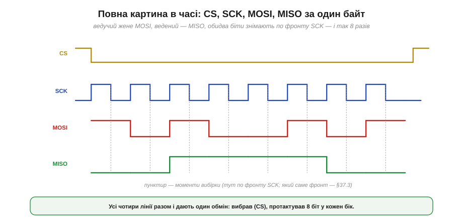
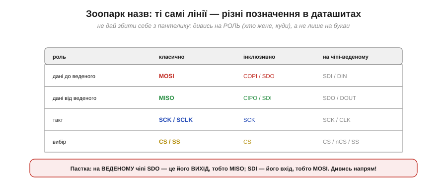
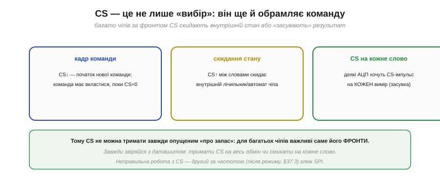
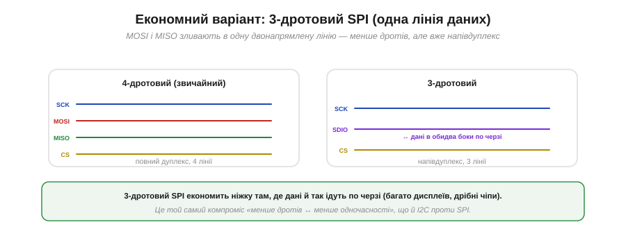

# Лінії: MOSI, MISO, SCK, CS

У [SPI](book:communications/spi-bus) чотири лінії — MOSI, MISO, SCK і CS; придивімося до кожної впритул. Головне питання для кожної — **хто** її жене і **коли**. З відповіді на нього випливе і те, як багато ведених уживаються на спільних лініях, і навіщо CS — окрема ніжка, і навіть звідки беруться найчастіші помилки. Особливу увагу приділимо одному дотепному прийому — **високому імпедансу** на MISO, без якого спільна шина не працювала б.

### Хто жене кожну лінію й коли

Зведімо ролі чотирьох ліній у чітку таблицю.

*Рис. **SCK** і **MOSI** завжди жене ведучий. **CS** теж жене ведучий (опускає, щоб обрати). А ось **MISO** жене **ведений** — і то лише тоді, коли його CS опущено. Необраний ведений MISO не торкається.*

Три лінії прості: SCK, MOSI і CS завжди йдуть **від ведучого** — він господар такту, даних «туди» й вибору. Уся хитрість — у **MISO**. Її жене ведений, і це створює потенційну проблему: якщо на спільному MISO висить кілька ведених, що буде, коли непотрібні теж спробують його тримати? Адже виходи [двотактні](book:electronics/push-pull-output), і два таких на одній лінії закоротять одне одного. Розв'язок — у тому, **коли** ведений жене MISO.

### Спільний MISO без конфлікту: високий імпеданс

Ось ключова деталь усієї теми. Ведений жене MISO **тільки** тоді, коли його обрано (CS = 0). А поки CS високий, ведений **відпускає** MISO — переводить свій вихід у **високий імпеданс** (*high-Z*), наче фізично від'єднує його від лінії.

*Рис. Лише обраний ведений A (CS = 0) жене MISO; ведені B і C тримають свій вихід у високому імпедансі (Z) — наче від'єднані від лінії. Тому кілька ведених мирно ділять один MISO: у кожну мить його жене рівно один — обраний.*

Високий імпеданс — це [третій стан виходу](book:electronics/open-drain): не «1» і не «0», а «відключено», коли вихід ні тягне, ні штовхає, і лінія для нього наче не існує. Саме він рятує SPI: хоч виходи й двотактні (а отже, несумісні, якщо їх просто звести), необрані ведені **не беруть участі** — їхній MISO у Z, — тож конфлікту немає. Говорить завжди рівно один, обраний пристрій.

> 🔧 **Навіщо це.** Звідси практичне: якщо на спільному MISO «висить» ведений, який **не вміє** відпускати вихід у Z (трапляється в дешевих чи саморобних пристроях), він заважатиме всім іншим — два ведені змагатимуться за лінію. Перевіряй у даташиті, що ведений переводить MISO у високий імпеданс за CS = 1. А якщо такий «невихований» пристрій усе ж потрібен — його MISO відділяють буфером із третім станом. Дивний симптом «два SPI-давачі працюють поодинці, але не разом» — майже завжди саме про це.

### CS обрамляє обмін

Тепер про CS уважніше. Він не просто «вмикач» — він **обрамляє** всю транзакцію: ведучий опускає CS на початку обміну й піднімає в кінці.

*Рис. Поки CS = 0, ведений активний: він тактується SCK, читає MOSI й жене MISO. CS↓ позначає початок обміну, CS↑ — кінець. Роль, схожа на старт/стоп у I2C, — але це проста фізична лінія, а не хитрий сигнал на даних.*

Порівняйте з I2C: там початок і кінець позначають [особливими змінами SDA при високому SCL](book:communications/start-stop-ack); тут усе простіше — окрема лінія, опустив-підняв. Це знову той самий розмін: SPI витрачає **ще одну ніжку** (CS), зате уникає будь-яких хитрощів із даними. Чи піднімати CS між окремими байтами одного обміну, чи тримати опущеним на весь — залежить від конкретного чіпа.

### Повна картина в часі

Зберімо всі чотири лінії на одній часовій діаграмі — так SPI видно «наживо».

*Рис. Ведучий опускає CS, видає 8 тактів SCK; на кожному такті він жене черговий біт по MOSI, а ведений — по MISO; обидва біти знімають по фронту SCK. Вісім тактів — і байт пройшов в обидва боки. Який саме фронт (передній чи задній) — питання режиму CPOL/CPHA.*

Ця діаграма — суть SPI в часі: вибрав (CS↓), протактував вісім фронтів, на кожному обмінявся бітом туди й назад, відпустив (CS↑). Зверніть увагу, що MOSI і MISO «оновлюються» в одному ритмі з SCK — і саме момент, **коли** знімати біт (по якому фронту такту), визначає [режим SPI (CPOL/CPHA)](book:communications/cpol-cpha).

### Зоопарк назв

Практична засторога: одні й ті самі лінії в різних даташитах звуться **по-різному**, і це збиває з пантелику.

*Рис. MOSI трапляється як COPI, SDO (на ведучому) або SDI/DIN (на веденому); MISO — як CIPO, SDO (на веденому) або SDI (на ведучому); CS — як SS, nCS, NSS. Дивись не на букви, а на **роль**: хто жене, у який бік ідуть дані.*

Розберімо головну пастку. Сучасні даташити часто вживають інклюзивні назви **COPI** (*Controller Out, Peripheral In* — те саме MOSI) і **CIPO** (те саме MISO). А на самому чіпі-веденому лінії підписані з **його** погляду: **SDO** (*Serial Data Out*) — це його **вихід**, тобто MISO, а **SDI** — його вхід, тобто MOSI. Тому, з'єднуючи ведучого з веденим, не зводь однакові назви — зводь **за напрямком**: вихід ведучого (MOSI) на вхід веденого (SDI), вихід веденого (SDO) на вхід ведучого (MISO). Інакше отримаєш ту саму помилку «вихід на вихід», що й [TX-TX у UART](book:communications/async-serial).

### CS робить більше, ніж вибір

Лінію CS легко недооцінити як простий «вмикач», та в багатьох чіпів вона несе додатковий зміст — її **фронти** щось означають.

*Рис. У різних чіпів CS↓ позначає початок нової команди (вона має вкластися, поки CS = 0); CS↑ між словами скидає внутрішній лічильник чи автомат; а деякі АЦП вимагають CS-імпульс на КОЖЕН вимір (як засувку результату). Тобто важливі саме фронти CS, а не лише його рівень.*

Через це не можна просто тримати CS «завжди опущеним про запас»: для багатьох чіпів CS↑ між словами — це сигнал «команда скінчилась, скинь стан». Деякі АЦП взагалі засувають кожен результат фронтом CS. Тому робота з CS — за даташитом: тримати опущеним на весь обмін чи смикати на кожне слово.

> 🔧 **Навіщо це.** Неправильна робота з CS — другий за частотою глюк SPI (після [неправильного режиму CPOL/CPHA](book:communications/cpol-cpha)). Симптоми: чіп віддає сміття, «застряє» після першої команди або зчитує зсунуті дані. Перша перевірка: чи смикаєш CS саме так, як вимагає даташит, — один імпульс на весь обмін чи на кожне слово, і чи піднімаєш його між транзакціями.

### Економний варіант: три дроти

Насамкінець — корисно знати, що буває й **3-дротовий** SPI. У ньому MOSI і MISO зливають в **одну** двонапрямлену лінію даних (часто звану SDIO або SDA): пристрій то жене її, то слухає — по черзі.

*Рис. Звичайний 4-дротовий SPI має окремі MOSI й MISO (повний дуплекс). 3-дротовий зливає їх в одну двонапрямлену лінію SDIO — економить ніжку, але дані йдуть лише по черзі (напівдуплекс). Зустрічається в багатьох дисплеях і дрібних чіпах.*

Це той самий компроміс «менше дротів ↔ менше одночасності», що й [між I2C та SPI](book:communications/spi-vs-i2c): 3-дротовий варіант економить ніжку там, де повний дуплекс не потрібен (а часто й не потрібен — команда, потім відповідь ідуть по черзі). Багато дисплеїв і дрібних мікросхем працюють саме так.

Чотири лінії розкладено по ролях, і вся механіка обміну видно на часовій діаграмі. Лишається одна тонкість, яку лінії самі по собі не визначають: **по якому саме фронту** SCK знімають біт і коли його виставляють. Тут можливі **чотири** комбінації — і якщо ведучий із веденим розуміють її по-різному, обмін перетворюється на сміття, хоч дроти й з'єднані правильно. Ці чотири [режими CPOL/CPHA](book:communications/cpol-cpha) — найвідоміша пастка SPI.

---
