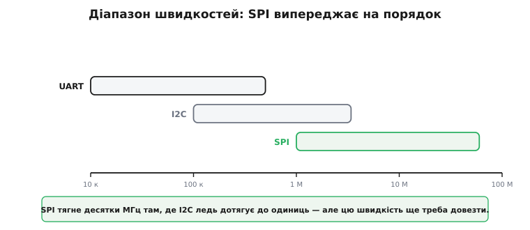
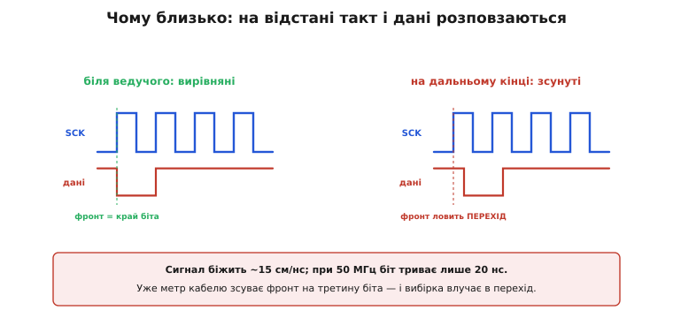
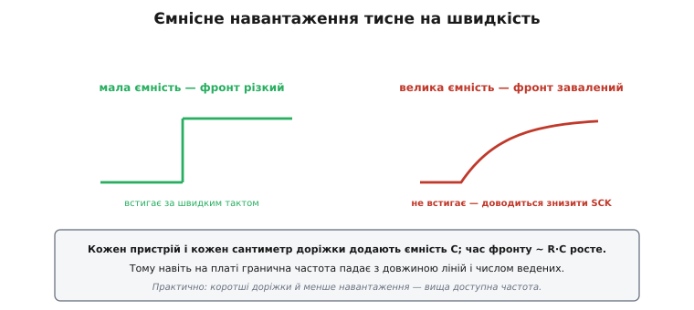
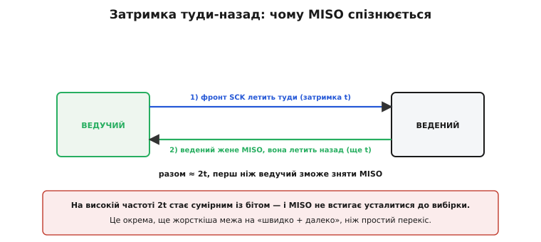
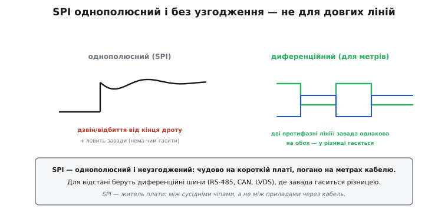
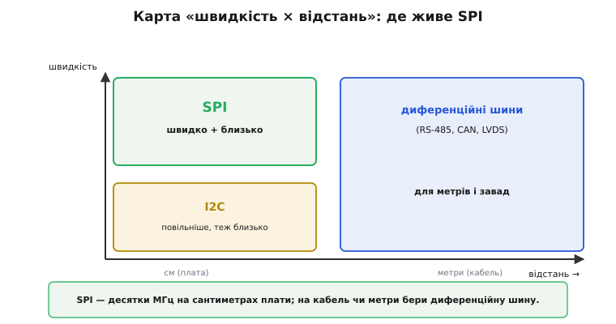

# Швидкість SPI

SPI має репутацію «швидкої» шини — і заслужену. Та сама будова, що дає швидкість, ставить і жорстку межу на відстань: SPI блискучий між сусідніми чіпами на платі й геть непридатний через метровий кабель. Зрозуміти обидва боки цієї медалі — і чому вони нерозлучні — практично важливо: це підказує, де SPI на місці, а де треба зовсім інша шина.

Питання «наскільки швидко» розпадається на два. Перше: яку частоту такту SPI взагалі здатний витримати? Друге, тонше: яку частоту вдасться **довезти** до веденого непошкодженою — і як далеко. Відповідь на перше — десятки мегагерц. Відповідь на друге — лише на сантиметрах плати. Між цими двома числами й живе вся практика.

### Чотири причини швидкості

Швидкість SPI — не одна хитрість, а чотири рішення, що складаються разом.


*Двотактний вихід дає різкі фронти, а не повільний RC-підйом, як у [відкритого колектора](book:electronics/open-collector). Такт, що йде окремим дротом, позбавляє передискретизації й ресинхрону, потрібних в асинхронному [UART](book:communications/async-serial). Мінімум протоколу — ні адрес, ні підтверджень, ні старт-стопних біт — рівно вісім тактів несуть вісім біт. Окремі лінії MOSI та MISO дають повний дуплекс.*

Кожна причина окремо вже знайома. Різкі фронти замість повільного RC-підйому на підтяжці. Чесний такт у дроті замість угадування швидкості. Нуль накладних біт. Роздільні лінії даних. Жодна сама по собі не вражає, але разом вони роблять SPI найшвидшою з простих шин — десятки мегагерц проти одиниць у I2C.

> 🔧 **Навіщо це.** Коли треба швидко перекинути великий потік — кадр дисплея, блок із зовнішньої флеш-пам'яті, потік відліків швидкого АЦП — саме ці чотири властивості й роблять SPI першим кандидатом. Жоден інший простий інтерфейс мікроконтролера не дає такої пропускної здатності за таку малу схемну ціну.

### Діапазон швидкостей

Корисно побачити числа в порівнянні.


*Приблизні типові межі на логарифмічній шкалі. UART — до сотень кілобіт за секунду, часом до кількох мегабіт. I2C — від 100 кГц до 3.4 МГц у швидкісному режимі. SPI — від одиниць до десятків мегагерц, а спеціалізовані мікросхеми пам'яті тримають і понад 50 МГц. SPI випереджає на цілий порядок.*

Стандарт SPI взагалі **не задає** граничної частоти — її ставить найповільніша ланка ланцюга. На практиці межу диктує одне з двох. Або периферія мікроконтролера: частота SCK береться діленням тактової частоти ядра, тож доступні лише дискретні значення (наприклад, 80 МГц поділити на 2, 4, 8…). Або сам ведений: у його даташиті завжди стоїть гранична частота SCK — скажімо, 10 чи 50 МГц, — вище якої внутрішня логіка вже не встигає засікати біти. Реальна частота — менша з цих двох. Сучасні мікроконтролери легко женуть SPI на 50 МГц і вище, а в логіці FPGA трапляється й за сотню.

Але — і це головне в темі — цю високу частоту ще треба довезти до веденого непошкодженою. Саме тут починаються обмеження на відстань, і їх теж чотири.

### Worked-приклад: бюджет одного кадру дисплея

Перш ніж розбирати, що псує сигнал, порахуймо, **навіщо** взагалі гнатися за частотою. Візьмемо типову задачу — малювати кадри на кольоровому дисплеї.

**Умова.** Дисплей 240×320 пікселів, по 16 біт на піксель (формат RGB565), під'єднаний по SPI до мікроконтролера. Хочемо плавні 30 кадрів за секунду. Яка потрібна частота SCK і чи виходить вона за межі плати?

:::tabs
```cpp
// Скільки біт у одному кадрі
const uint32_t pixels    = 240u * 320u;        // = 76 800 пікселів
const uint32_t bits_frame = pixels * 16u;      // = 1 228 800 біт на кадр

// Потрібна пропускна здатність для 30 кадрів/с
const uint32_t fps   = 30u;
const uint32_t bps   = bits_frame * fps;        // = 36 864 000 біт/с ≈ 36.9 Мбіт/с
```
```python
# Скільки біт у одному кадрі
pixels     = 240 * 320        # = 76 800 пікселів
bits_frame = pixels * 16      # = 1 228 800 біт на кадр

# Потрібна пропускна здатність для 30 кадрів/с
fps = 30
bps = bits_frame * fps        # = 36 864 000 біт/с ≈ 36.9 Мбіт/с
```
```js
// Скільки біт у одному кадрі
const pixels    = 240 * 320;        // = 76 800 пікселів
const bitsFrame = pixels * 16;      // = 1 228 800 біт на кадр

// Потрібна пропускна здатність для 30 кадрів/с
const fps = 30;
const bps = bitsFrame * fps;        // = 36 864 000 біт/с ≈ 36.9 Мбіт/с
```
```go
// Скільки біт у одному кадрі
pixels := uint32(240 * 320)      // = 76 800 пікселів
bitsFrame := pixels * 16         // = 1 228 800 біт на кадр

// Потрібна пропускна здатність для 30 кадрів/с
fps := uint32(30)
bps := bitsFrame * fps           // = 36 864 000 біт/с ≈ 36.9 Мбіт/с
```
:::

SPI без накладних біт: одна пропускна здатність — це рівно тактова частота помножена на біти за такт, а біт за такт тут один. Тож **потрібна частота SCK дорівнює потрібній пропускній здатності** — близько 37 МГц:

```
пропускна = тактова × (біт за такт) = SCK × 1
SCK ≥ 36.9 МГц   → беремо найближчий дільник, скажімо 40 МГц
```

Тепер перевіримо час одного кадру на обраній частоті:

```
біт у кадрі        = 1 228 800
при SCK = 40 МГц   → 1 такт = 1/40 МГц = 25 нс
час кадру          = 1 228 800 × 25 нс ≈ 30.7 мс  → ~32 кадри/с ✓
```

Висновок подвійний. По-перше, 30 кадрів/с тут реальні лише на десятках мегагерц — на «повільних» одиницях мегагерц вийшло б близько трьох кадрів, і годі думати про відео. По-друге, 40 МГц — це саме той діапазон, де довжина ліній уже починає важити: біт триває лише 25 наносекунд, і будь-яка затримка в дроті відкушує від нього помітну частку. Тобто та сама задача, що вимагає високої частоти, одночасно **прив'язує дисплей до плати** — довгим шлейфом такий кадр уже не передати. Чому саме — далі по чотирьох причинах.

### Перша межа: перекіс такт-дані

Найважливіша причина «короткої дистанції» — **перекіс** (англ. *skew* — «зсув, перекіс») між тактом і даними. Це той самий ефект, що робить непрактичними широкі паралельні шини на високих частотах, тільки тут він діє між лінією SCK і лінією даних.


*Біля ведучого фронт SCK і край біта вирівняні. Та поки вони летять дротом, кожен набирає затримку — і на дальньому кінці фронт SCK уже зсунутий відносно даних. За високого темпу цей зсув перевищує частку біта, і вибірка влучає в перехід даних, де рівень невизначений.*

Чому зсув узагалі виникає, видно з простого підрахунку.

```
сигнал біжить по платі ≈ 15 см/нс
при 50 МГц біт триває 1/50 МГц = 20 нс

10 см доріжки → затримка ≈ 0.7 нс (3.5% біта) — байдуже
1 м кабелю   → затримка ≈ 7 нс  (35% біта)   — уже критично
```

На сантиметрах плати затримка мізерна, і 50 МГц їдуть легко. Та вже на метрі кабелю зсув з'їдає третину біта — і вибірка ризикує влучити в момент, коли дані ще перемикаються. Тому високошвидкісний SPI живе на сантиметрах, а не на метрах.

### Друга межа: ємнісне навантаження

Кожна доріжка й кожен під'єднаний пристрій додають паразитну ємність, яку двотактний вихід мусить заряджати на кожному фронті. Велика ємність — повільніший фронт.


*За малої ємності фронт різкий і встигає за швидким тактом. За великої — довгі доріжки, багато ведених — фронт завалюється: заряд ємності через опір виходу триває довше (час ~ R·C), і доводиться знижувати SCK.*

Це знову RC, тільки тепер не на пасивній підтяжці, а на опорі самого двотактного виходу й сумарній ємності лінії. Звідси практичне правило: що довші доріжки й що більше ведених на шині, то нижча доступна гранична частота — навіть у межах плати. Коротші лінії й менше навантаження дають вищу швидкість.

### Третя межа: затримка туди-назад на MISO

Ще жорсткіша межа стосується саме лінії MISO. Ведучий видає фронт SCK, але відповідь по MISO мусить **повернутися** назад, перш ніж він її зніме.


*Фронт SCK летить до веденого (затримка t); ведений жене MISO, і вона летить назад (ще t). Разом близько 2t, перш ніж ведучий зможе коректно зняти MISO. На високій частоті 2t стає сумірним із бітом — і MISO не встигає усталитися до моменту вибірки.*

Це подвійна затримка: туди такт, назад дані. Тому навіть якщо ведений сам по собі швидкий, на довгій лінії ведучий мусить чекати на MISO зайвий час — і це окрема, ще суворіша межа на «швидко плюс далеко», ніж простий перекіс. Саме через неї у високошвидкісного SPI бувають особливі режими таймінгу, коли ведучий навмисне знімає MISO на пів такту пізніше або вмикає окрему лінію зворотного зв'язку для такту.

### Четверта межа: однополюсність і відбиття

Остання причина — електрична природа сигналів. SPI **однополюсний** (англ. *single-ended* — «з одним кінцем»): кожна лінія міряється відносно спільної землі, і нічим не «гаситься». На короткій доріжці це чудово, та на довгому неузгодженому дроті з'являються **відбиття** (дзвін) і легко наводяться завади.


*Ліворуч: однополюсний сигнал SPI на довгому дроті дзвенить (відбиття від кінця) і ловить завади, які нема чим гасити. Праворуч: диференційна лінія несе дві протифазні копії, і завада, однакова на обох, у різниці зникає — тому такі шини тримають метри.*

Це принципова відмінність від [диференційних шин](book:communications/differential-pair) (RS-485, CAN, LVDS), де сигнал несуть дві протифазні лінії, а приймач дивиться на їхню **різницю**: будь-яка завада, що наводиться однаково на обидві, у різниці зникає. SPI цього не вміє — він однополюсний і неузгоджений, тож його доля — коротка чиста доріжка, а не довгий зашумлений кабель.

> 🔧 **Навіщо це.** Чотири межі діють разом, а не по черзі, тож на практиці їх не розплутують поодинці — їх обходять однією дією: **коротшають лінії й знижують частоту**, доки сигнал не стане чистим. Якщо ні те, ні те не рятує — це сигнал, що SPI взято не за призначенням і потрібна диференційна шина.

### Карта «швидкість × відстань»

Зведімо все в одну картину.


*SPI займає кут «швидко плюс близько» — сантиметри плати, десятки мегагерц. I2C — повільніше, теж близько. А для метрів і завадного середовища беруть диференційні шини (RS-485, CAN, LVDS). Швидко й далеко водночас простими однополюсними засобами не виходить.*

> 🔧 **Навіщо це.** Запам'ятай SPI як **жителя плати**: він блискучий між сусідніми чіпами — дисплеєм, пам'яттю, швидким АЦП — на сантиметрах доріжок і десятках мегагерц. Та щойно треба тягти сигнал через кабель чи на метри, SPI — хибний вибір: або знижуй швидкість (і тоді навіщо SPI?), або бери диференційну шину, призначену для дистанції. Робоче правило: SPI не виходить за межі однієї плати. Якщо в проєкті трапляється SPI-давач на довгому шлейфі — це привід насторожитися й перевірити, чи не сиплються дані.

Швидкість і відстань — саме та пара критеріїв, що найчастіше вирішує долю шини на платі. У [практичному виборі SPI проти I2C](root:embedded/spi-vs-i2c) кожен критерій — скільки ніжок, яка швидкість, яка відстань, чи потрібен дуплекс, скільки пристроїв — схиляє шальку в той чи інший бік, і «швидко, але близько» лишається головним козирем SPI в цьому зважуванні.
