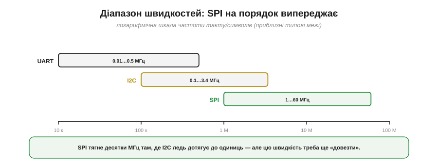
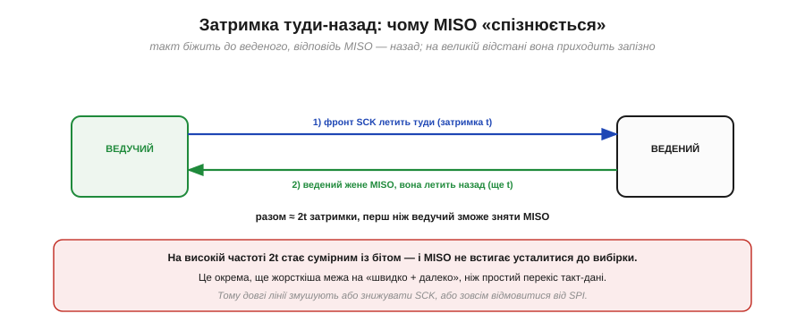
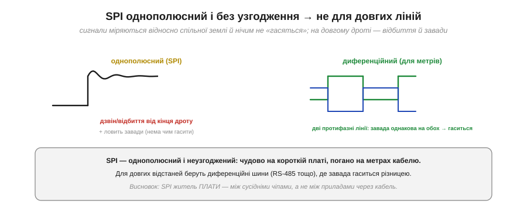
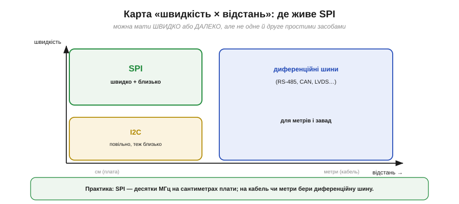

# Швидкість і відстань

SPI має репутацію «швидкої» шини — і заслужену. Але та сама будова, що дає швидкість, ставить і жорстку межу на **відстань**: SPI чудовий між сусідніми чіпами на платі й геть непридатний через метровий кабель. Зрозуміти **обидва** боки цієї медалі — і чому вони нерозлучні — практично важливо: це підказує, де SPI на місці, а де треба зовсім інша шина.

### Чотири причини швидкості

Швидкість SPI — не одна хитрість, а **чотири** рішення, що складаються разом.


*Рис. **Двотактний вихід** дає різкі фронти (не повільний RC-підйом, як у [відкритого колектора](book:electronics/open-collector)). **Такт у дроті** позбавляє передискретизації й ресинхрону, потрібних в асинхронному UART. **Мінімум протоколу** — ні адрес, ні ACK, ні старт-стопу — 8 тактів несуть рівно 8 біт. **Окремі лінії** MOSI/MISO дають повний дуплекс без міжлінійного перекосу.*

Кожна причина окремо вже знайома: різкі фронти (на противагу повільному RC-підйому на [відкритому колекторі I2C](book:electronics/open-collector)), чесний такт замість вгадування швидкості (на противагу UART), нуль накладних біт, роздільні лінії даних. Разом вони й роблять SPI найшвидшою з простих шин — десятки мегагерц проти одиниць у I2C.

### Діапазон швидкостей

Глянемо на числа в порівнянні.


*Рис. Приблизні типові межі (лог-шкала): UART — до сотень кілобіт за секунду (часом до кількох Мбіт/с), I2C — від 100 кГц до 3.4 МГц, SPI — від одиниць до десятків мегагерц (а спеціалізовані — й понад 50 МГц). SPI випереджає на цілий порядок.*

Максимальну частоту SPI задає або периферія мікроконтролера (дільник SCK від тактової), або **сам ведений**: у його даташиті завжди є гранична частота SCK (скажімо, 10 чи 50 МГц), вище якої він уже не встигає. Але — і це головне в темі — цю високу частоту ще треба «довезти» до веденого непошкодженою. А ось тут і починаються обмеження на відстань.

### Чому близько: перекіс такт-дані

Перша й найважливіша причина «короткої дистанції» — **перекіс** між тактом і даними. Це той самий ефект, що вбивав [паралельні шини](book:communications/async-serial), тільки тепер між лінією SCK і лінією даних.


*Рис. Біля ведучого фронт SCK і край біта вирівняні. Та поки вони летять дротом, кожен набирає затримку — і на дальньому кінці фронт SCK уже зсунутий відносно даних. За високого темпу цей зсув перевищує частку біта, і вибірка влучає в **перехід** даних, де рівень невизначений.*

**Приклад (де межа).** Прикиньмо, наскільки далеко можна гнати швидкий SPI:

```
сигнал біжить по платі ≈ 15 см/нс
при 50 МГц біт триває 1/50 МГц = 20 нс

10 см доріжки → затримка ≈ 0.7 нс (3.5% біта) — байдуже
1 м кабелю   → затримка ≈ 7 нс  (35% біта)   — уже критично
```

На сантиметрах плати затримка мізерна, і 50 МГц «їдуть» легко. Та вже на метрі кабелю зсув з'їдає третину біта — а з урахуванням зворотного шляху MISO і поготів стає фатальним. Тому високошвидкісний SPI живе на **сантиметрах**, а не метрах.

### Ємнісне навантаження

Друга причина — **ємність**. Кожна доріжка й кожен під'єднаний пристрій додають паразитну ємність, яку двотактний вихід мусить заряджати на кожному фронті. Велика ємність — повільніший фронт.


*Рис. За малої ємності фронт різкий і встигає за швидким тактом. За великої (довгі доріжки, багато ведених) фронт «завалюється» — заряд ємності через опір виходу триває довше (час ~ R·C), і доводиться знижувати SCK.*

Це знову RC, тільки тепер не на пасивній підтяжці, а на опорі самого двотактного виходу й сумарній ємності лінії. Звідси практичне: що **довші** доріжки й що **більше** ведених на шині, то нижча доступна максимальна частота — навіть у межах плати. Коротші лінії й менше навантаження — вища швидкість.

### Затримка туди-назад на MISO

Третя, ще жорсткіша межа стосується саме **MISO**. Ведучий видає фронт SCK, але відповідь по MISO мусить **повернутися** назад, перш ніж він її зніме.


*Рис. Фронт SCK летить до веденого (затримка t); ведений жене MISO, і та летить назад (ще t). Разом ≈ 2t, перш ніж ведучий зможе коректно зняти MISO. На високій частоті 2t стає сумірним із бітом — і MISO не встигає усталитися до моменту вибірки.*

Це **подвійна** затримка: туди такт, назад дані. Тому навіть якщо ведений сам по собі швидкий, на довгій лінії ведучий мусить чекати на MISO зайвий час — і це окрема, ще суворіша межа на «швидко + далеко», ніж простий перекіс. Саме через неї у високошвидкісного SPI бувають особливі режими таймінгу, коли ведучий навмисне знімає MISO на пів такту пізніше.

### Однополюсність і відбиття

Четверта причина — електрична природа сигналів. SPI **однополюсний** (*single-ended*): кожна лінія міряється відносно спільної землі, і нічим не «гаситься». На короткій доріжці це чудово, та на довгому неузгодженому дроті з'являються **відбиття** (дзвін) і легко наводяться **завади**.


*Рис. Ліворуч: однополюсний сигнал SPI на довгому дроті «дзвенить» (відбиття від кінця) і ловить завади, які нема чим гасити. Праворуч: диференційна лінія несе дві протифазні копії, і завада, однакова на обох, гаситься різницею — тому такі шини тримають метри.*

Це принципова відмінність від **диференційних** шин (RS-485, CAN, LVDS), де сигнал несуть дві протифазні лінії, а приймач дивиться на їхню **різницю**: будь-яка завада, що наводиться однаково на обидві, у різниці зникає. SPI цього не вміє — він однополюсний і неузгоджений, тож його доля — коротка чиста доріжка, а не довгий зашумлений кабель.

### Карта «швидкість × відстань»

Зведімо все в одну картину.


*Рис. SPI займає кут «швидко + близько» (сантиметри плати, десятки МГц). I2C — «повільніше, теж близько». А для **метрів** і завадного середовища беруть диференційні шини (RS-485, CAN, LVDS). Швидко й далеко водночас простими однополюсними засобами не виходить.*

> 🔧 **Навіщо це.** Запам'ятай SPI як **жителя плати**: він блискучий між сусідніми чіпами — дисплеєм, пам'яттю, швидким АЦП — на сантиметрах доріжок і десятках мегагерц. Та щойно треба тягти сигнал **через кабель** чи на **метри**, SPI — хибний вибір: знижуй швидкість (і тоді навіщо SPI?) або бери диференційну шину, призначену для дистанції. Практичне правило: SPI не виходить за межі однієї плати. Якщо в проєкті бачиш SPI-давач на довгому шлейфі — це привід насторожитися й перевірити, чи не сиплються дані.

Швидкість і відстань — саме та пара критеріїв, що найчастіше вирішує долю шини на платі. Коли постає [практичний вибір SPI проти I2C](book:communications/spi-vs-i2c), кожен такий критерій — скільки ніжок, яка швидкість, яка відстань, чи потрібен дуплекс, скільки пристроїв — схиляє шальку в той чи інший бік, і «швидко, але близько» — головний козир SPI в цьому зважуванні.

---
