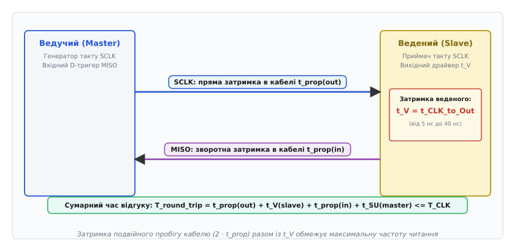
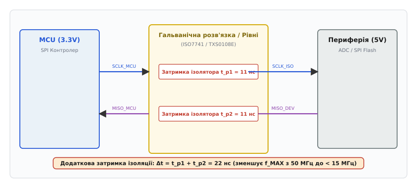

# 🧮 Розрахунок часового бюджету та частотних меж SPI

Цей математичний аналіз виводить точні алгебраїчні рівняння часового балансу для передавання й прийому даних у шині SPI, пов'язуючи затримки поширення сигналу в провідниках, час реакції веденого пристрою, апертурні обмеження D-тригерів та паразитну ємність ліній із гранично допустимою тактовою частотою.

---

### Базові часові параметри та геометрія тактового імпульсу

Тактовий сигнал шини SPI являє собою періодичну послідовність прямокутних імпульсів з періодом `t_CLK` та частотою `f_CLK = 1 / t_CLK`. Кожен період розбивається на два інтервали: тривалість високого рівня `t_HIGH` та тривалість низького рівня `t_LOW`.

```
t_CLK = t_HIGH + t_LOW      [визначення повного періоду такту]
```

Коефіцієнт заповнення (англ. *duty cycle*, від англ. *duty* — діяльність та грецьк. *κύκλος* — коло) визначає симетрію тактового імпульсу:

```
D = t_HIGH / t_CLK          [коефіцієнт заповнення]
```

В ідеальному генераторі `D = 0.50` (50%), тобто `t_HIGH = t_LOW = 0.5 · t_CLK`. Проте реальні дільники частоти мікроконтролерів, асиметрія вихідних каскадів драйверів та різниця між часом відкривання і закривання транзисторів створюють асиметрію, через яку даташити нормують мінімальні тривалості окремо: `t_HIGH_min` та `t_LOW_min`.

Якщо хоча б один із напівперіодів стає коротшим за технологічний мінімум внутрішньої логіки тригера `t_w_min`, тактовий генератор не встигає перезарядити внутрішні ємності вузлів, і пристрій пропускає такти. Звідси випливає перша статична умова працездатності:

```
t_CLK ≥ t_HIGH_min + t_LOW_min      [статичне обмеження періоду генератора]
```

---

### Динамічний баланс тракту запису (Master → Slave)

Під час передавання даних від ведучого (Master) до веденого (Slave) по лінії MOSI ведучий синхронно виставляє дані за одним фронтом такту (наприклад, за спадним), а ведений фіксує їх за протилежним (активним) фронтом (наприклад, за наростаючим).

Позначимо інтервал між фронтом виставлення даних та активним фронтом вибірки як `t_launch_to_capture`. Для симетричного такту в стандартних режимах цей інтервал дорівнює напівперіоду `t_CLK / 2` (або `t_HIGH`, або `t_LOW` залежно від полярності).

Сигнал SCLK та сигнал даних MOSI поширюються від ведучого до веденого в одному напрямку. Нехай `t_prop_CLK` — затримка поширення такту в лінії, а `t_prop_MOSI` — затримка поширення лінії даних.

Різниця затримок між провідниками утворює просторовий перекіс (англ. *skew*, від давньосканд. *skeifr* — косий, зміщений):

```
t_skew_write = |t_prop_CLK - t_prop_MOSI|      [перекіс ліній запису]
```

Ведучий формує зміну даних із власною вихідною затримкою `t_CO_M` (Clock-to-Output delay ведучого). Ведений вимагає, щоб стабільний рівень з'явився на його вході щонайменше за час встановлення `t_SU_S` (Setup time веденого) до приходу активного фронту SCLK.

Складемо часовий баланс для інтервалу встановлення:

```
t_available = t_launch_to_capture + t_prop_CLK      [момент приходу такту на ведений]
t_data_ready = t_CO_M + t_prop_MOSI                 [момент стабілізації даних на веденому]
t_margin_SU_write = t_available - t_data_ready - t_SU_S [запас часу встановлення]
```

Розгорнемо вираз запасу часу встановлення `t_margin_SU_write`:

```
t_margin_SU_write
= (t_launch_to_capture + t_prop_CLK) - (t_CO_M + t_prop_MOSI) - t_SU_S  [підстановка моментів часу]
= t_launch_to_capture + (t_prop_CLK - t_prop_MOSI) - t_CO_M - t_SU_S    [групування просторових затримок]
= t_launch_to_capture - t_skew_write - t_CO_M - t_SU_S                  [найгірший випадок перекосу]
```

Для надійної фіксації біта запас мусить бути строго додатним (`t_margin_SU_write > 0`). Підставивши `t_launch_to_capture = t_CLK / 2`:

```
t_CLK / 2 > t_CO_M + t_SU_S + t_skew_write      [нерівність для напівперіоду запису]
= t_CLK > 2 · (t_CO_M + t_SU_S + t_skew_write)  [мінімальний період за часом встановлення]
```

#### Перевірка часу утримання для запису

Дані на вході веденого повинні залишатися незмінними протягом часу `t_H_S` (Hold time веденого) після приходу активного фронту такту. Новий біт виставляється ведучим на наступному фронті перемикання через інтервал `t_hold_launch`:

```
t_hold_available = t_hold_launch + t_prop_MOSI + t_CO_min_M - t_prop_CLK [час до зміни рівня]
t_margin_H_write = t_hold_available - t_H_S                              [запас часу утримання]
```

У більшості випадків `t_hold_launch = t_CLK / 2`, що гарантує гігантський запас утримання при записі. Проте при нульовій затримці перемикання або за наявності асиметричних ліній зв'язку мінімальна умова утримання виглядає так:

```
t_CO_min_M + (t_prop_MOSI - t_prop_CLK) ≥ t_H_S      [критерій утримання при односпрямованому русі]
```

---

### Динамічний баланс тракту читання (Slave → Master): Ефект подвійної петлі

Тракт читання (лінія MISO) є найкритичнішим вузлом інтерфейсу SPI. На відміну від запису, де тактовий сигнал і дані рухаються в один бік паралельно, під час читання інформація долає **повну петлю кругової затримки** (англ. *round-trip delay*):

1. Ведучий генерує перепад SCLK на своїх виводах у момент `t = 0`.
2. Сигнал SCLK поширюється кабелем або доріжкою плати до веденого, зазнаючи прямої затримки `t_prop_out`.
3. Ведений фіксує перепад SCLK і внутрішньо комутує вихідний каскад MISO. Дійсні дані з'являються на виводі веденого лише через затримку виходу `t_V` (в даташитах також позначається як `t_CO_S` або `t_DO`).
4. Сформований сигнал MISO поширюється лінією зв'язку назад до ведучого, зазнаючи зворотної затримки `t_prop_in`.
5. Сигнал надходить на вхідний вивід ведучого і мусить стабілізуватися щонайменше за час `t_SU_M` (час встановлення вхідного тригера ведучого) ДО моменту, коли ведучий здійснить вибірку за черговим внутрішнім тактом.


*Хронологія кругової затримки тракту читання: прямий хід SCLK, реакція веденого t_V, зворотний хід MISO та час встановлення ведучого.*

Складемо повне рівняння часу прибуття дійсних даних на вхідний тригер ведучого:

```
t_arrival = t_prop_out + t_V + t_prop_in      [час прибуття дійсного рівня MISO до ведучого]
```

Оскільки лінії SCLK і MISO зазвичай прокладаються в одному шлейфі або на сусідніх шарах друкованої плати, їхні затримки поширення практично однакові: `t_prop_out ≈ t_prop_in = t_prop`. Тоді:

```
t_arrival = 2 · t_prop + t_V      [кругова затримка поширення та реакції веденого]
```

Момент, коли ведучий зчитує вхідний сигнал MISO, залежить від обраного режиму CPOL/CPHA.

#### Варіант А: Вибірка на протилежному напівперіоді (CPHA = 0)

У класичному режимі Mode 0 (CPOL = 0, CPHA = 0) ведений оновлює свій вихід MISO за спадним фронтом SCLK, а ведучий здійснює вибірку за наступним наростаючим фронтом. Часовий інтервал між цими подіями всередині мікроконтролера ведучого становить рівно половину періоду `t_CLK / 2` (або `t_LOW`).

Дані повинні надійти і відстоятися до моменту вибірки:

```
t_arrival + t_SU_M ≤ t_LOW      [умова своєчасного прибуття даних]
```

Розпишемо цю нерівність покроково:

```
2 · t_prop + t_V + t_SU_M ≤ t_CLK / 2                    [підстановка симетричного такту t_LOW = t_CLK / 2]
= t_CLK ≥ 2 · (2 · t_prop + t_V + t_SU_M)                [множення обох частин на 2]
= t_CLK ≥ 4 · t_prop + 2 · t_V + 2 · t_SU_M              [розкриття дужок: граничний період читання]
```

Максимальна робоча частота шини `f_MAX` для цього режиму становить:

```
f_MAX = 1 / t_CLK_min
= 1 / (4 · t_prop + 2 · t_V + 2 · t_SU_M)                [гранична частота читання при CPHA=0]
```

#### Варіант Б: Вибірка через повний період такту (зсув вибірки / Sample Delay)

Сучасні апаратні SPI-контролери (наприклад, у мікроконтролерах STM32H7, ESP32-S3 або процесорах i.MX RT) мають спеціальний конфігураційний регістр затримки фази вибірки (Sample Shift / Rx Delay). У такому режимі ведучий здійснює вибірку вхідного сигналу MISO не на найближчому напівперіоді, а через повний такт `t_CLK` (або на додатково затриманому внутрішньому стробі).

Рівняння часового бюджету набуває вигляду:

```
2 · t_prop + t_V + t_SU_M ≤ t_CLK                        [бюджет для повного періоду такту]
```

Звідки мінімальний період і максимальна частота дорівнюють:

```
t_CLK_min = 2 · t_prop + t_V + t_SU_M                    [мінімальний період при випереджальній вибірці]
f_MAX = 1 / (2 · t_prop + t_V + t_SU_M)                  [гранична частота при випереджальній вибірці]
```

Порівняння обох варіантів наочно демонструє, що можливість вибірки на повному такті подвоює теоретичну пропускну здатність лінії читання при незмінній фізичній довжині кабелю.

---

### Фізична швидкість поширення сигналу в лініях передачі

Затримка поширення електромагнітної хвилі `t_prop` визначається діелектричною проникністю матеріалу ізолятора, що оточує провідник:

```
v_prop = c / √(ε_r)      [швидкість світла в діелектрику]
```

де:
- `c ≈ 3.00 · 10⁸ м/с = 30 см/нс` — швидкість світла у вакуумі;
- `ε_r` — відносна діелектрична проникність середовища.

Питома затримка на одиницю довжини `τ_prop` (нс/метр або пс/дюйм) дорівнює:

```
τ_prop = 1 / v_prop
= √(ε_r) / c             [питома затримка поширення]
```

Обчислимо точні значення для типових конструктивів:

#### 1. Друкована плата (склотекстоліт FR-4)
Для внутрішніх шарів багатошарових плат (Stripline) `ε_r ≈ 4.3`:

```
v_prop = 30 / √(4.3)
= 30 / 2.0736
= 14.47 см/нс            [швидкість у внутрішніх шарах FR-4]

τ_prop = 1 / 0.1447
= 6.91 нс/м              [питова затримка stripline: ~6.9 нс на кожен метр доріжки]
```

Для зовнішніх шарів (Microstrip) діелектрик є неоднорідним (суміш FR-4 та повітря), ефективна діелектрична проникність `ε_eff ≈ 3.2`:

```
v_prop = 30 / √(3.2)
= 30 / 1.7888
= 16.77 см/нс            [швидкість у зовнішніх шарах FR-4]

τ_prop = 1 / 0.1677
= 5.96 нс/м              [питова затримка microstrip: ~6.0 нс на метр]
```

#### 2. Плаский стрічковий кабель (Ribbon Cable, PVC ізоляція)
Для полівінілхлоридної ізоляції `ε_r ≈ 2.7`:

```
v_prop = 30 / √(2.7)
= 30 / 1.6432
= 18.26 см/нс            [швидкість у стрічковому кабелі]

τ_prop = 1 / 0.1826
= 5.48 нс/м              [питова затримка кабелю: ~5.5 нс на метр]
```

#### 3. Коаксіальний кабель / вита пара з поліетиленовою ізоляцією (PE, `ε_r ≈ 2.25`)

```
v_prop = 30 / √(2.25)
= 30 / 1.5000
= 20.00 см/нс            [швидкість у витій парі з PE]

τ_prop = 1 / 0.2000
= 5.00 нс/м              [питова затримка: 5.0 нс на метр]
```

Загальна затримка для провідника довжиною `L` метрів обчислюється як:

```
t_prop = L · τ_prop      [сумарна затримка провідника довжиною L]
```

---

### Математична модель навантаженої лінії передачі (Loaded Line Model)

Коли до лінії SPI підключається декілька ведених пристроїв, їхня вхідна ємність розподіляється вздовж провідника. Позначимо власну погонну ємність ненавантаженої доріжки як `C_0` (пФ/м), а сумарну паразитну ємність усіх підключених чіпів як `C_D` (пФ).

Розподілена паразитна ємність на одиницю довжини збільшує ефективну ємність лінії:

```
C_eff = C_0 + (C_D / L)      [ефективна погонна ємність навантаженої лінії]
```

Оскільки швидкість поширення хвилі обернено пропорційна кореню з добутку погонної індуктивності `L_0` та ємності `C_eff`, навантаження лінії чіпами сповільнює сигнал:

```
τ_prop_loaded = τ_prop_0 · √(1 + C_D / (C_0 · L))      [збільшення питомої затримки під навантаженням]
Z_0_loaded = Z_0 / √(1 + C_D / (C_0 · L))              [падіння хвильового опору навантаженої лінії]
```

Якщо доріжка на платі довжиною 20 см (`C_0 · L = 0.2 · 70 пФ/м = 14 пФ`) навантажена чотирма чіпами по 6 пФ (`C_D = 24 пФ`), відношення ємностей становить `C_D / (C_0 · L) = 24 / 14 ≈ 1.71`.

Тоді сповільнення сигналу складе:

```
τ_prop_loaded = τ_prop_0 · √(1 + 1.71) = τ_prop_0 · √(2.71) ≈ 1.65 · τ_prop_0
```

Затримка проходження доріжки зростає на 65% виключно через ємнісне навантаження відгалужень, що необхідно враховувати в загальному часовому бюджеті.

---

### Математична модель температурної деградації та джиттеру

Фізичні затримки напівпровідникових елементів не є постійними: вони суттєво залежать від температури кристала та флуктуацій фази генератора тактової частоти.

#### 1. Температурний дрейф напівпровідникових затримок
Зі зростанням температури кристала теплові коливання кристалічної ґратки кремнію посилюють розсіювання носіїв заряду (електронів та дірок). Внаслідок цього рухливість носіїв `μ(T)` зменшується за степеневим законом:

```
μ(T) = μ_0 · (T / T_0)^(-1.5)      [залежність рухливості носіїв від абсолютної температури]
```

Зниження рухливості призводить до зменшення струму насичення польових транзисторів і пропорційного зростання часу перезаряджання внутрішніх вузлів. Для цифрових КМОН-мікросхем (CMOS) затримка поширення зростає зі швидкістю приблизно `+0.35%` на кожен градус Цельсія вище кімнатної температури (+25°C).

Лінеаризована формула розрахунку найгіршої затримки виходу веденого `t_V_hot` при максимальній робочій температурі `T_max` має вигляд:

```
t_V_hot = t_V_25C · (1 + k_temp · (T_max - 25))      [температурна корекція затримки]
```

де `k_temp ≈ 0.0035 1/°C`. Наприклад, якщо при 25°C датчик має `t_V = 15 нс`, то при нагріванні до промислових +105°C його затримка зросте:

```
t_V_105C = 15 · (1 + 0.0035 · (105 - 25))
= 15 · (1 + 0.0035 · 80)
= 15 · (1 + 0.28)
= 15 · 1.28
= 19.20 нс                                           [затримка виходу при 105 градусах]
```

Зростання на 4.2 нс здатне повністю знищити позитивний запас встановлення на високих частотах.

#### 2. Вплив фазового джиттеру тактового генератора
Тактові генератори мікроконтролерів (особливо внутрішні RC-генератори та контури ФАПЧ / PLL) мають фазовий шум і джиттер періоду (англ. *period jitter* `t_jitter_pk`). Джиттер випадковим чином скорочує окремі напівперіоди тактового сигналу.

Якщо піковий розмах джиттеру становить `t_jitter_pk`, він безпосередньо віднімається від доступного напівперіоду:

```
t_LOW_effective = t_LOW_nominal - t_jitter_pk        [ефективна тривалість напівперіоду з урахуванням джиттеру]
```

Тоді повний запас встановлення з урахуванням температури та джиттеру набуває остаточного вигляду:

```
M_SU_total = t_LOW_effective - (2 · t_prop + t_V_hot + Δt_iso + t_SU_M) [повний запас з усіма деградаціями]
```

---

### Розрахунок впливу проміжних елементів: Буфери та ізолятори

Якщо між мікроконтролером і веденим пристроєм встановлено мікросхеми перетворення рівнів напруги (Level Shifters) або цифрові гальванічні ізолятори (Digital Isolators), вони додають фіксовану апаратну затримку перемикання `t_pd` на кожному напрямку.


*Додаткові затримки ізоляції: кожне проходження сигналу через бар'єр додає t_pd, що подвоює деградацію швидкості читання.*

Нехай `t_pd_CLK` — затримка прямого каналу такту (ізолятор 1), а `t_pd_MISO` — затримка зворотного каналу даних (ізолятор 2).

Тоді повна затримка прибуття даних MISO до ведучого становить:

```
t_arrival_iso
= (t_prop_out + t_pd_CLK) + t_V + (t_prop_in + t_pd_MISO)   [сума всіх затримок у ланцюзі читання]
= 2 · t_prop + t_V + (t_pd_CLK + t_pd_MISO)                 [згрупований вираз з урахуванням ізоляторів]
```

Позначимо сумарну затримку активних компонентів як `Δt_active = t_pd_CLK + t_pd_MISO`.

Підставимо цей вираз у граничне рівняння для режиму CPHA = 0:

```
t_CLK ≥ 2 · (2 · t_prop + t_V + Δt_active + t_SU_M)         [мінімальний період з активною ізоляцією]
```

#### Числовий приклад з популярним ізолятором ISO7741
Для цифрового ізолятора Texas Instruments ISO7741 з напругою 3.3 В паспортна затримка поширення становить `t_pd = 10.7 нс` (максимально 16.0 нс).
Якщо ведений має `t_V = 15 нс`, провідник має довжину 20 см (`t_prop = 0.2 · 5.5 = 1.1 нс`), а вхідний тригер мікроконтролера вимагає `t_SU_M = 5 нс`:

```
Δt_active = 10.7 + 10.7
= 21.4 нс                                                   [затримка пари ізоляторів]

t_arrival = 2 · 1.1 + 15 + 21.4
= 2.2 + 15 + 21.4
= 38.6 нс                                                   [час прибуття даних до входу MCU]

t_LOW_min = t_arrival + t_SU_M
= 38.6 + 5.0
= 43.6 нс                                                   [мінімальний напівперіод takту]

t_CLK_min = 2 · t_LOW_min
= 2 · 43.6
= 87.2 нс                                                   [мінімальний період takту]

f_MAX = 1 / 87.2 нс
= 11.47 МГц                                                 [максимальна частота шини]
```

Без ізолятора (`Δt_active = 0`) той самий пристрій міг би працювати на значно вищій частоті:

```
t_arrival_no_iso = 2 · 1.1 + 15 = 17.2 нс                   [час прибуття без ізолятора]
t_CLK_min_no_iso = 2 · (17.2 + 5.0) = 44.4 нс               [мінімальний період]
f_MAX_no_iso = 1 / 44.4 нс = 22.52 МГц                      [максимальна частота без ізолятора]
```

Наявність пари ізоляторів знизила максимальну робочу частоту рівно вдвічі (з 22.5 МГц до 11.4 МГц).

---

### Вплив паразитної ємності та часу наростання фронтів (Rise/Fall Times)

У реальних схемах фронт сигналу не є нескінченно крутим. Кожен приєднаний вивід додає вхідну ємність `C_in ≈ 3..10 пФ`, а погонна ємність доріжки становить `C_trace ≈ 50..100 пФ/м`.

Сумарне навантаження лінії `C_L`:

```
C_L = C_trace · L + ∑ C_in + C_probe      [сумарна паразитна ємність лінії]
```

Вихідний опір драйвера `R_out` разом із ємністю навантаження `C_L` утворює еквівалентний RC-ланцюг з постійною часу `τ = R_out · C_L`.

Тривалість наростання сигналу `t_R` від рівня 10% до рівня 90% від напруги живлення `V_DD` розраховується з експоненційного перехідного процесу:

```
v(t) = V_DD · (1 - e^(-t / τ))            [перехідний процес заряджання ємності]
v(t_10) = 0.1 · V_DD  ⇒  t_10 = -τ · ln(0.9) ≈ 0.1054 · τ  [момент досягнення 10%]
v(t_90) = 0.9 · V_DD  ⇒  t_90 = -τ · ln(0.1) ≈ 2.3026 · τ  [момент досягнення 90%]

t_R = t_90 - t_10
= 2.3026 · τ - 0.1054 · τ
= 2.1972 · τ
≈ 2.2 · R_out · C_L                       [час наростання фронту 10%-90%]
```

Для порогів логічного перемикання КМОН (20%...80% або досягнення порогу спрацьовування тригера Шмітта `V_IH = 0.7 · V_DD`):

```
v(t_switch) = 0.7 · V_DD  ⇒  t_switch = -τ · ln(1 - 0.7) = -τ · ln(0.3) ≈ 1.204 · τ
t_delay_RC ≈ 1.2 · R_out · C_L            [додаткова динамічна затримка перемикання]
```

Ця затримка `t_delay_RC` безпосередньо додається до часу виходу `t_V` та подовжує час перебування сигналу в зоні невизначеного логічного стану.

Якщо час наростання перевищує допустиму тривалість напівперіоду (`t_R > t_HIGH`), імпульс напруги не встигає досягти порогу `V_IH`, амплітуда тактового сигналу зменшується, і ведений перестає розпізнавати такти. Звідси випливає фундаментальна ємнісна межа:

```
t_HIGH_min ≥ 1.5 · t_R ≈ 3.3 · R_out · C_L [критерій повноти амплітуди такту]
```

---

### Математична модель метастабільності та розрахунок MTBF

Якщо порушено умову встановлення `t_SU` або утримання `t_H`, вхідний D-тригер приймача потрапляє в метастабільний стан. Ймовірність виходу з метастабільного стану за додатковий час очікування `t_resolve` описується експоненційним розподілом.

Середній час між збоями цифрової системи через метастабільність (англ. *Mean Time Between Failures*, MTBF) розраховується за формулою:

```
MTBF = e^(t_slack / τ_resolve) / (T_0 · f_CLK · f_data)      [формула MTBF метастабільності]
```

де:
- `t_slack` — додатковий час релаксації до моменту наступного використання зафіксованого біта;
- `τ_resolve` — постійна часу релаксації внутрішнього бістабільного елемента тригера (для сучасних 28-нм і 40-нм КМОН-процесів `τ_resolve ≈ 20..60 пс`);
- `T_0` — апаратно-технологічний коефіцієнт апертури тригера (близько `10⁻¹⁰..10⁻¹² с`);
- `f_CLK` — тактова частота шини SPI;
- `f_data` — частота зміни даних на лінії.

Якщо запас часу встановлення від'ємний (`t_slack < 0`), показник експоненти стає меншим за одиницю, і MTBF падає до мікросекунд — пристрій зазнає безперервних апаратних помилок. Збільшення часового запасу всього на `2..3 нс` переводить систему з зони постійних збоїв у зону безвідмовної роботи протягом десятків років (`MTBF > 10⁶ годин`).

---

### Зведена матриця розрахунку запасу часу (Timing Margins)

Для комплексного проєктування високошвидкісного вузла SPI обчислюються два незалежні коефіцієнти запасу (англ. *slack* або *margin*):

```
Запас встановлення (Setup Margin):
M_SU = t_budget_available - t_delay_total - t_SU_required

Запас утримання (Hold Margin):
M_H = t_hold_available - t_H_required
```

| Параметр контуру | Формула розрахунку | Критерій надійності |
| :--- | :--- | :--- |
| **Запис: Запас встановлення `M_SU_write`** | `t_LOW - (t_CO_M + t_skew + t_SU_S)` | `M_SU_write > 0.15 · t_CLK` (запас ≥ 15%) |
| **Запис: Запас утримання `M_H_write`** | `t_HIGH + t_CO_min_M - t_skew - t_H_S` | `M_H_write > 0.10 · t_CLK` |
| **Читання: Запас встановлення (CPHA=0)** | `t_LOW - (2·t_prop + t_V + Δt_iso + t_SU_M)` | `M_SU_read > 2.0 нс` (абсолютний запас) |
| **Читання: Запас встановлення (Sample Shift)** | `t_CLK - (2·t_prop + t_V + Δt_iso + t_SU_M)` | `M_SU_read_shift > 3.0 нс` |
| **Читання: Запас утримання `M_H_read`** | `(2·t_prop + t_V_min) - t_H_M` | `M_H_read > 0 нс` |

Якщо при розрахунку виявляється, що `M_SU < 0`, схема гарантовано зазнає збоїв через метастабільність тригерів. Розв'язанням є або зменшення тактової частоти `f_CLK`, або скорочення довжини ліній, або використання контролера з підтримкою зсуву фази вибірки (Sample Delay).
