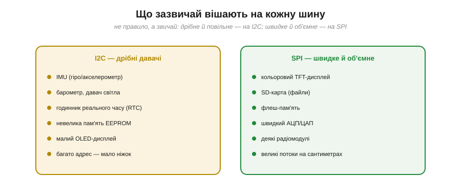
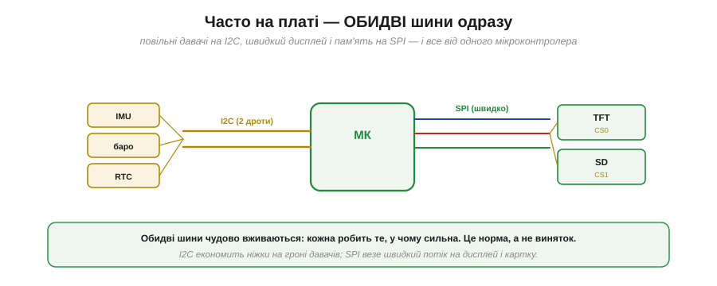
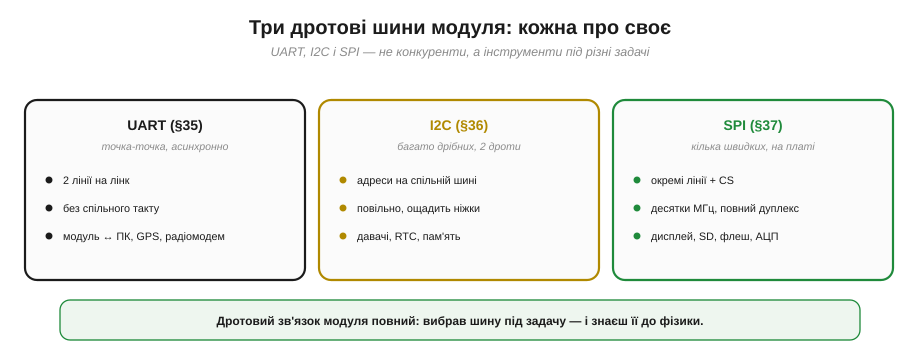
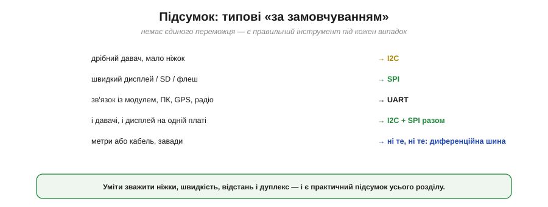

# SPI vs I2C: коли що

Дві найпоширеніші синхронні шини на платі — [SPI](book:communications/spi-bus) та [I2C](book:communications/i2c-bus) — постійно ставлять перед розробником одне практичне питання: **яку обрати** під конкретну задачу? Відповідь рідко однозначна, бо це два протилежні компроміси, і «кращий» залежить від того, що для проєкту важливіше: ніжки, швидкість, простота додавання пристроїв чи вбудований контроль. Розкладімо вибір по критеріях — і виведемо прості правила.

### По кожному критерію

Найкраще почати з прямого зіставлення.


*Рис. I2C виграє за ніжками (2 на всіх проти 3 + N), легкістю додати пристрій (адреса, не дріт), вбудованим контролем (ACK) і підтримкою кількох ведучих. SPI виграє за швидкістю (десятки МГц проти 3.4), повним дуплексом і майже нульовими накладними. За відстанню обидві — лише «близько».*

Прочитаймо таблицю як набір **протиставлень**. I2C — це **економія**: два дроти на скільки завгодно пристроїв, новий чіп додається адресою без жодного нового дроту, кожен байт квитується (ACK), а на шині може бути навіть кілька ведучих. SPI — це **швидкість і простота передачі**: десятки мегагерц, повний дуплекс, майже нуль службових біт — але ціною ніжки на кожен пристрій і відсутності будь-якого вбудованого контролю помилок. Жодна не «краща» взагалі; кожна виграє у своєму.

### Коротке дерево рішень

Ці критерії складаються у просте дерево, що здебільшого вирішує все за три питання.


*Рис. Потрібна висока швидкість чи великий потік? → SPI. Ні, але багато дрібних пристроїв і мало ніжок? → I2C. Потрібен повний дуплекс? → SPI; важливий вбудований ACK-контроль? → I2C. Три питання — і вибір майже завжди зроблено.*

На практиці перше питання — про **швидкість** — найвагоміше: якщо треба гнати кольоровий дисплей чи читати файли з картки, відповідь одразу SPI, і далі можна не йти. Якщо швидкість не критична, вирішує **число пристроїв і ніжок**: багато дрібних давачів — I2C. А тонкі випадки (потрібен дуплекс чи, навпаки, ACK-контроль) розводять решту.

### Що вішають на кожну шину

Звичай склався доволі чіткий, і його корисно знати як орієнтир.


*Рис. На **I2C** зазвичай — дрібні давачі (IMU, барометр, давач світла), годинник реального часу, невелика EEPROM, малий OLED: усе, де важить економія ніжок, а швидкість другорядна. На **SPI** — кольоровий TFT-дисплей, SD-картка, флеш-пам'ять, швидкий АЦП, деякі радіомодулі: усе, де потрібен великий потік на сантиметрах плати.*

Це не закон, а саме звичай: формально малий дисплей можна зробити і по I2C, і по SPI. Та логіка стійка — **повільне й дрібне тяжіє до I2C, швидке й об'ємне до SPI**, — і коли береш новий компонент, ця інтуїція одразу підказує, на яку шину його чекати.

### Часто — обидві разом

Найважливіше усвідомлення: вибір «SPI **чи** I2C» часто хибний. На реальній платі їх ставлять **обидві** — кожну під свої пристрої.


*Рис. Типова плата: повільні давачі (IMU, баро, RTC) висять на I2C, забираючи лише дві ніжки; а швидкий TFT-дисплей і SD-картка — на SPI зі своїми CS. Один мікроконтролер тримає обидві шини, і кожна робить те, у чому сильна.*

Це норма, а не виняток: I2C економить ніжки на гроні дрібних давачів, а SPI паралельно везе швидкий потік на дисплей і картку. Мікроконтролер має апаратні блоки і для тієї, і для тієї шини, тож тримати обидві — звична практика. Тому правильніше питати не «яку шину взяти на плату», а «**яку шину — для кожного пристрою**».

### Три дротові шини поряд

Корисно поставити вибір SPI/I2C у ширшу рамку й скласти докупи **всі три** головні дротові шини плати.


*Рис. **UART** — точка-точка, асинхронно, для зв'язку з модулем, ПК, GPS чи радіомодемом. **I2C** — багато дрібних пристроїв на двох дротах, з адресами. **SPI** — кілька швидких пристроїв на платі, з окремими лініями й CS. Не конкуренти, а інструменти під різні задачі.*

Разом вони покривають увесь дротовий зв'язок. [UART](book:communications/async-serial) — коли треба з'єднати **два** пристрої потоком, часто на якусь відстань (модуль, комп'ютер, GPS). [I2C](book:communications/i2c-bus) — коли треба повісити **багато дрібних** чіпів на мінімум дротів. [SPI](book:communications/spi-bus) — коли треба **швидко** обмінятися з кількома пристроями на платі. Маючи в руках усі три, ти обираєш не «єдино правильну» шину, а **доречну** під кожен зв'язок у системі.

### Бюджет ніжок на прикладі

Закріпимо вибір конкретним розрахунком — типовим для реального проєкту.


*Рис. Проєкт: три давачі (IMU, баро, магнітометр) + TFT-дисплей + SD-картка. Усе на SPI — 8 ніжок. Усе на I2C — 2 ніжки, але дисплей і картка по I2C повільні й незручні. Розумний розподіл — давачі на I2C, дисплей і картка на SPI — дає 7 ніжок, і кожен пристрій на «своїй» шині.*

**Приклад (порахуймо ніжки).** Розкладімо проєкт із п'яти пристроїв:

```
усе на SPI : 3 спільні + 5 CS = 8 ніжок
усе на I2C : 2 ніжки — але TFT і SD по I2C повільні/незручні

змішано (розумно):
  I2C: 3 давачі           = 2 ніжки
  SPI: дисплей + SD (2 CS) = 3 + 2 = 5 ніжок
  разом                   = 7 ніжок
```

Виграє **розподіл**: давачі, яким байдужа швидкість, тиснуться на I2C за дві ніжки, а швидкі дисплей і картка отримують SPI. Не «або-або», а «кожному — своє».

### Підсумкові «за замовчуванням»

Зведімо все у прості правила-замовчування.


*Рис. Дрібний давач, мало ніжок → I2C. Швидкий дисплей / SD / флеш → SPI. Зв'язок із модулем, ПК, GPS, радіо → UART. І давачі, і дисплей на платі → I2C + SPI разом. А метри або кабель із завадами → ні те, ні те: диференційна шина.*

> 🔧 **Навіщо це.** Тримай ці замовчування в голові — вони покривають майже всі рішення. Та головне вміння — не завчити правило, а **зважити критерії**: скільки ніжок маєш, яка швидкість і відстань потрібні, чи треба дуплекс, скільки пристроїв. Часто відповідь — «обидві шини», і це нормально. А коли задача виходить за межі плати (метри, кабель, завади), варто памʼятати: ні I2C, ні SPI туди не йдуть — там царина [диференційних шин](book:communications/differential-pair) і, зрештою, [радіо](book:communications/on-chip-radio).
