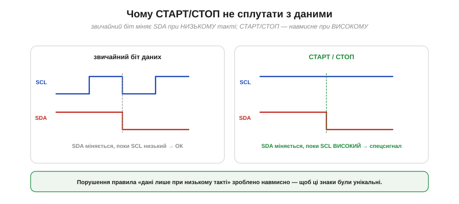
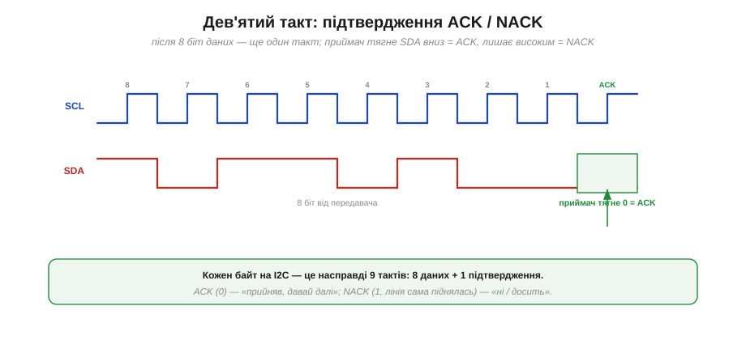
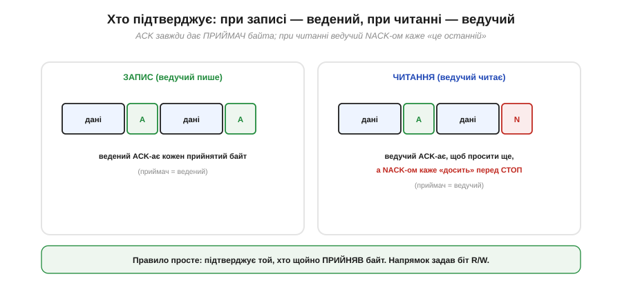
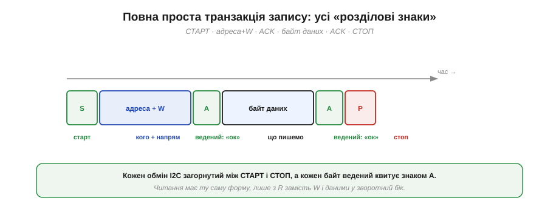
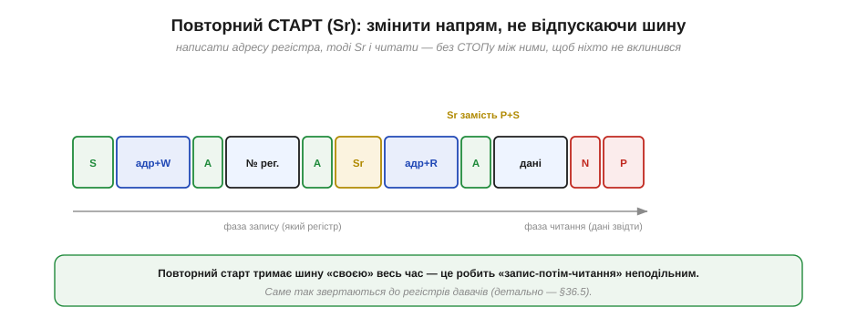
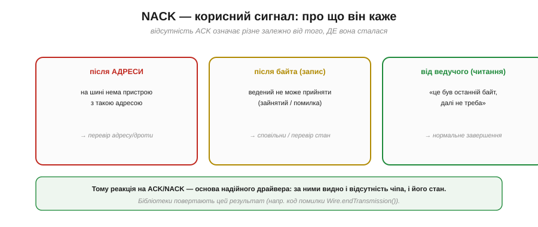

# Старт, стоп, ACK/NACK

Якщо байти адреси й даних — це «слова» I2C, то старт, стоп, ACK і NACK — його **розділові знаки**. Вони не несуть даних, зате задають структуру: де обмін починається, де закінчується і чи дійшов кожен байт. Без них потік байтів був би суцільним і неоднозначним — те саме питання, що й у [дизайні пакетів](book:communications/packet-design): де межі повідомлення. Краса I2C в тому, що всі ці знаки втілені дотепно й мінімальними засобами — самими лініями SDA і SCL. Розберімо їх по черзі.

### СТАРТ і СТОП: знаки початку й кінця

Будь-який обмін на I2C обрамлений двома особливими сигналами. **СТАРТ** (*START*, позначають **S**) — це коли ведучий тягне **SDA вниз** у момент, коли **SCL високий**. **СТОП** (*STOP*, **P**) — навпаки: SDA **піднімається** при високому SCL.

*Рис. У спокої обидві лінії високі. СТАРТ — SDA падає, поки SCL ще високий: це «захоплює» шину й починає обмін. Далі йдуть такти з даними (SDA міняється лише при низькому SCL). СТОП — SDA піднімається при високому SCL: обмін завершено, лінія вільна.*

СТАРТ «захоплює» шину: побачивши його, усі ведені нашорошуються й чекають адреси. СТОП відпускає шину назад у спокій, сигналізуючи: обмін скінчено, можна починати новий. Усе, що між ними, — це один цілісний обмін.

### Чому їх не сплутати з даними

Чому СТАРТ і СТОП роблять саме зміною SDA при високому SCL? Головне правило [шини I2C](book:communications/i2c-bus): під час передачі даних SDA дозволено міняти **лише** коли SCL низький. Отже, зміна SDA при **високому** SCL — це щось **заборонене** для даних, а тому **унікальне**. Саме на цьому й зіграли творці I2C.

*Рис. Звичайний біт даних міняє SDA, поки SCL низький (ліворуч) — це дозволено. СТАРТ і СТОП навмисно роблять заборонене — міняють SDA при високому SCL (праворуч). Саме тому їх неможливо сплутати зі звичайними бітами: жоден легальний біт даних так не поводиться.*

Це гарний інженерний хід: замість вигадувати окрему лінію чи особливий код для «розділових знаків», узяли єдиний стан, який ніколи не трапляється в даних, — і зробили його сигналом. Дешево, надійно, однозначно.

### Дев'ятий такт: ACK і NACK

Тепер про підтвердження. Після кожного **байта** (восьми біт) на I2C іде ще **один**, дев'ятий такт — спеціально для **підтвердження**. На цьому такті той, хто щойно **прийняв** байт, відповідає: тягне **SDA вниз** — це **ACK** (*acknowledge*, «прийняв, давай далі»); або лишає SDA високим — це **NACK** (*not acknowledge*, «ні / досить»).

*Рис. Після 8 біт даних передавач відпускає SDA, і на 9-му такті приймач дає відповідь: притягнув лінію вниз — ACK (0), лишив високою — NACK (1). Тож кожен байт на I2C — це насправді 9 тактів: 8 даних плюс 1 підтвердження.*

Зверніть увагу, як це спирається на [відкритий колектор](book:electronics/open-collector): ACK — це знову «притягнути вниз перемагає». Передавач перед дев'ятим тактом **відпускає** SDA, і якщо приймач хоче підтвердити — він садить лінію на нуль; якщо ж ніхто не тягне, підтяжка лишає лінію високою, і це читається як NACK. Тому **кожен** байт коштує не 8, а **9** тактів — про це варто пам'ятати, рахуючи час транзакції.

### Хто підтверджує: запис проти читання

Важлива тонкість: ACK дає **той, хто прийняв** байт, а хто це — залежить від напрямку (біта R/W із [адресного байта](book:communications/i2c-addressing)).

*Рис. При **записі** (ведучий пише) приймач — це ведений, тож він ACK-ає кожен прийнятий байт. При **читанні** (ведучий читає) приймач — це ведучий: він ACK-ає кожен байт, щоб попросити наступний, а **NACK-ом** на останньому каже «досить» — і слідом дає СТОП.*

Отже, при записі ведений підтверджує, що приймає; а при читанні ведучий керує потоком: поки він ACK-ає, ведений шле наступний байт, а щойно ведучий дав NACK — ведений розуміє, що це був останній, і відпускає SDA. Так ведучий завжди лишається господарем обміну, навіть коли дані течуть до нього.

### Повна транзакція

Складімо все докупи. Найпростіший обмін — запис одного байта — виглядає так:

*Рис. СТАРТ → адресний байт (адреса + W) → ведений ACK → байт даних → ведений ACK → СТОП. Кожен обмін загорнутий між S і P, а кожен байт ведений квитує знаком A. Читання має ту саму форму, лише з R замість W і даними у зворотний бік.*

Прочитаймо цю стрічку як речення: «(старт) звертаюся до пристрою 0x68, писатиму (ACK — він озвався) ось такий байт (ACK — прийняв) (стоп)». Уся мова I2C зводиться до таких речень: між СТАРТ і СТОП — послідовність байтів, кожен із підтвердженням. А складніші обміни будують із цих самих цеглинок.

### Повторний старт: змінити напрям, не відпускаючи шину

Є ще один важливий знак — **повторний СТАРТ** (*repeated START*, **Sr**). Це звичайний СТАРТ, виданий **без** попереднього СТОПу — посеред транзакції. Навіщо? Щоб **змінити напрям** обміну, не відпускаючи шину.

*Рис. Щоб прочитати регістр, ведучий спершу **пише** його номер (адр+W, № регістра), а тоді дає **Sr** і **читає** (адр+R, дані). Між фазами немає СТОПу — лише Sr. Тому шина ні на мить не звільняється, і ніхто інший не може вклинитися: «запис-потім-читання» лишається неподільним.*

Це класичний прийом для звертання до регістрів давача: ведучий пише, **який** регістр його цікавить, а потім, не відпускаючи лінію, повторним стартом перемикається на читання й забирає звідти дані. Якби між фазами стояв звичайний СТОП, шина б на мить звільнилася — і інший ведучий (чи навіть той самий, але збитий з пантелику) міг би вклинитися. Повторний старт робить усю операцію **атомарною**. Саме на ньому тримається [повна транзакція](book:communications/i2c-transaction) доступу до регістра.

### NACK як діагностика

Насамкінець — практично найцінніше. NACK — це не лише «кінець читання»; залежно від того, **де** він стався, він несе цілком конкретну інформацію про стан шини.

*Рис. NACK **після адреси** означає, що на шині нема пристрою з такою адресою (саме на цьому стоїть I2C-сканер). NACK **після байта при записі** — ведений не може прийняти (зайнятий чи помилка). NACK **від ведучого при читанні** — нормальне «це був останній байт». Місце NACK-а підказує, що сталося.*

> 🔧 **Навіщо це.** Реакція на ACK/NACK — основа надійного драйвера. Бібліотеки повертають цей результат: наприклад, `Wire.endTransmission()` в Arduino віддає код, де 0 — успіх (усе підтверджено), а ненульове — різні види NACK (адреса не озвалась, дані не прийнято). Звикни **перевіряти** цей код, а не сліпо вважати, що запис удався: саме він першим скаже, що давач від'єднався, завис чи його взагалі нема за вказаною адресою. «Тихий» I2C-драйвер, який ігнорує NACK, рано чи пізно «з'їсть» помилку й видасть сміття за дані.

Старт, адреса, дані, підтвердження, повторний старт, стоп — це вся «граматика» I2C. Із цих небагатьох знаків складають справжні **речення**: [повні транзакції](book:communications/i2c-transaction) читання й запису, якими давачу віддають налаштування, забирають вимір чи дістаються конкретного регістра. Кожна така операція — лише послідовність уже знайомих знаків між СТАРТ і СТОП.

---
