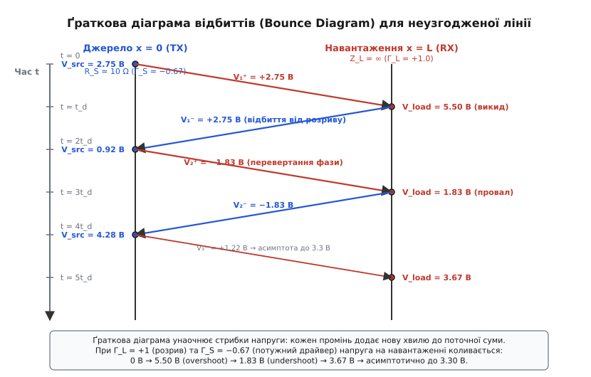

# 🧮 Виведення коефіцієнта відбиття та розрахунок ґраткових діаграм

Щоб точно передбачити амплітуду перенапруг і час затухання коливань у цифровій шині, інженеру недостатньо якісного розуміння явища — необхідний строгий математичний апарат. Ця вставка містить аналітичне виведення хвильових рівнянь лінії передачі, математичний аналіз умов неспотвореності Гевісайда, виведення формули коефіцієнта відбиття в часовій та частотній областях, динаміку ємнісного навантаження, теорію вхідного імпедансу довільного відрізка лінії, матричний розрахунок розгалужень (Т-подібних вузлів), аналітичний розрахунок ланцюгів AC-термінування та Тевеніна, зв'язок із коефіцієнтом стоячої хвилі (КСХ) та покроковий розрахунок перехідного процесу за допомогою ґраткової діаграми відбиттів.

### Виведення хвильових рівнянь телеграфістів

Розгляньмо однорідну лінію передачі, яка в загальному випадку характеризується чотирма розподіленими погонними параметрами:
- `L₀` — погонна індуктивність провідників (Гн/м);
- `C₀` — погонна ємність між сигнальним і зворотним провідниками (Ф/м);
- `R₀` — погонний омічний опір металу провідників (Ом/м);
- `G₀` — погонна діелектрична провідність витоку ізоляції (См/м).

Виділимо нескінченно малий відрізок лінії довжиною `Δx` між просторовими координатами `x` та `x + Δx`.

Застосуємо закони Кірхгофа до цього елементарного чотириполюсника:

1. **Падіння напруги вздовж відрізка (закон напруг Кірхгофа):**
   Зміна потенціалу вздовж довжини `Δx` зумовлена падінням напруги на активному опорі провідника та ЕРС самоіндукції магнітного поля:
   ```
   V(x + Δx, t) − V(x, t) = −(R₀ · Δx) · I(x, t) − (L₀ · Δx) · (∂I(x, t) / ∂t)
   ```
   Поділивши обидві частини рівності на `Δx` і спрямувавши `Δx → 0`, отримуємо перше диференціальне рівняння телеграфістів:
   ```
   ∂V / ∂x = −R₀ · I − L₀ · (∂I / ∂t)
   ```

2. **Втрата струму вздовж відрізка (закон струмів Кірхгофа):**
   Спад струму вздовж відрізка виникає через струм активного витоку крізь діелектрик та струм зміщення, що заряджає погонну міжелектродну ємність:
   ```
   I(x + Δx, t) − I(x, t) = −(G₀ · Δx) · V(x, t) − (C₀ · Δx) · (∂V(x, t) / ∂t)
   ```
   Перейшовши до границі при `Δx → 0`, маємо друге диференціальне рівняння телеграфістів:
   ```
   ∂I / ∂x = −G₀ · V − C₀ · (∂V / ∂t)
   ```

---

### Хвильове рівняння лінії без втрат

У швидкісних цифрових друкованих платах на коротких трасах (до 30–50 см) реактивні параметри `ωL₀` та `ωC₀` на частотах гармонік перемикання (сотні мегагерц) на кілька порядків перевищують омічні втрати: `ωL₀ ≫ R₀` та `ωC₀ ≫ G₀`. Тому лінію можна з високою точністю вважати ідеальною лінією без втрат (`R₀ = 0`, `G₀ = 0`).

Тоді система рівнянь набуває вигляду:
```
∂V / ∂x = −L₀ · (∂I / ∂t)
∂I / ∂x = −C₀ · (∂V / ∂t)
```

Щоб виключити змінну струму `I` й отримати рівняння в чистих напругах, продиференціюємо перше рівняння за просторовою координатою `x`:

```
∂²V / ∂x²
= ∂/∂x [−L₀ · (∂I / ∂t)]      [диференціювання першого рівняння за координатою x]
= −L₀ · ∂/∂t (∂I / ∂x)        [перестановка порядку мішаних частинних похідних]
= −L₀ · ∂/∂t [−C₀ · (∂V / ∂t)][підстановка другого рівняння телеграфістів замість ∂I/∂x]
= L₀ · C₀ · (∂²V / ∂t²)        [множення констант: добуток мінусів дає додатний знак]
```

Це класичне одновимірне **хвильове рівняння Д'Аламбера**. Звідси прямо випливають два фундаментальні параметри електромагнітної хвилі в лінії:

1. **Фазова швидкість поширення хвильового фронту:**
   ```
   v = 1 / √(L₀ · C₀) = c / √(ε_r · μ_r)
   ```
   де `c` — швидкість світла у вакуумі (`3 · 10⁸ м/с`), `ε_r` — відносна діелектрична проникність ізолятора (для FR-4 `ε_r ≈ 4.0...4.5`), а `μ_r ≈ 1` — магнітна проникність немагнітних діелектриків.

2. **Характеристичний хвильовий опір (імпеданс):**
   ```
   Z₀ = √(L₀ / C₀)
   ```

Загальний розв'язок хвильового рівняння є суперпозицією двох довільних функцій, які описують хвилю `V⁺`, що рухається вправо зі швидкістю `v`, та відбиту хвилю `V⁻`, що рухається вліво:

```
V(x, t) = V⁺(t − x/v) + V⁻(t + x/v)
I(x, t) = (1 / Z₀) · V⁺(t − x/v) − (1 / Z₀) · V⁻(t + x/v)
```

Знак «мінус» у виразі для струму зворотної хвилі має принциповий фізичний зміст: вектор густини потоку електромагнітної енергії (вектор Пойнтінга `S = E × H`) для відбитої хвилі спрямований у протилежний бік, тому напрямок перенесення заряду інвертується відносно полярності напруги.

---

### Частотно-залежні втрати: скін-ефект та тангенс діелектричних втрат

У гігагерцових цифрових лініях (PCIe, DDR5, USB4) погонний опір `R₀(f)` та діелектрична провідність `G₀(f)` перестають бути сталими й стрімко зростають із частотою.

1. **Скін-ефект у мідному провіднику:**
   Через витіснення високочастотного струму до поверхні провідника ефективна глибина проникнення поля (товщина скін-шару `δ`) зменшується пропорційно кореню з частоти:
   ```
   δ(f) = 1 / √(π · f · μ · σ)
   ```
   де `σ = 5.8 · 10⁷ См/м` — питома провідність міді, `μ = 4π · 10⁻⁷ Гн/м` — магнітна проникність. На частоті 1 ГГц товщина скін-шару становить усього `δ ≈ 2.1 мкм`, що набагато менше за товщину стандартної фольги (18 або 35 мкм). У результаті погонний активний опір доріжки шириною `w` зростає як корінь із частоти: `R₀(f) ∝ √(f)`.

2. **Діелектричні втрати в підкладці:**
   Переполяризація молекул діелектрика (FR-4) створює струми діелектричних втрат, пропорційні тангенсу кута діелектричних втрат `tan(δ)` (для FR-4 `tan(δ) ≈ 0.02`):
   ```
   G₀(f) = 2π · f · C₀ · tan(δ)
   ```
   Діелектричні втрати зростають лінійно з частотою `f` і на частотах понад 1–2 ГГц стають головною причиною згасання високочастотних гармонік крутого фронту.

---

Якщо врахувати активні втрати (`R₀ ≠ 0`, `G₀ ≠ 0`), у гармонічному режимі на круговій частоті `ω` комплексні рівняння телеграфістів записуються через комплексні амплітуди:

```
dV / dx = −(R₀ + jωL₀) · I
dI / dx = −(G₀ + jωC₀) · V
```

Продиференціювавши, отримуємо рівняння Гельмгольца:
```
d²V / dx² = γ² · V
```
де `γ` — комплексний коефіцієнт поширення:
```
γ = α + jβ = √((R₀ + jωL₀) · (G₀ + jωC₀))
```
Тут `α(ω)` — коефіцієнт затухання (втрати амплітуди), а `β(ω) = ω / v(ω)` — фазовий коефіцієнт.

Якщо коефіцієнт затухання `α` або фазова швидкість `v = ω / β` залежать від частоти `ω`, спектральні гармоніки прямокутного імпульсу загасатимуть з різною силою й рухатимуться з різною швидкістю (явище частотної дисперсії). У результаті імпульс неминуче розпливається в часі.

Олівер Гевісайд знайшов геніальну математичну умову, за якої підкореневий вираз стає повним квадратом:

```
R₀ / L₀ = G₀ / C₀
```

Перевіримо це аналітично:

```
γ²
= (R₀ + jωL₀) · (G₀ + jωC₀)
= R₀·G₀ + jω·(R₀·C₀ + L₀·G₀) − ω²·L₀·C₀      [перемноження комплексних дужок]
```

Оскільки за умовою Гевісайда `R₀·C₀ = L₀·G₀ = √(R₀·G₀·L₀·C₀)`, середній доданок перетворюється на:
```
jω · 2 · √(R₀·G₀·L₀·C₀)
```

Тоді повний вираз згортається у точний квадрат суми:
```
γ = √(R₀·G₀) + jω·√(L₀·C₀)
```

Звідси маємо два висновки:
1. **Коефіцієнт затухання:** `α = √(R₀ · G₀) = const` — абсолютно однаковий для всіх частотних гармонік (відсутнє амплітудне спотворення форми сигналу).
2. **Фазова швидкість:** `v = ω / β = ω / (ω · √(L₀ · C₀)) = 1 / √(L₀ · C₀) = const` — швидкість не залежить від частоти (нульова фазова дисперсія).

---

### Вхідний імпеданс відрізка лінії передачі

Розгляньмо лінію довжиною `d`, навантажену на імпеданс `Z_L`. На відстані `d` від навантаження вхідний імпеданс лінії `Z_in` описується відношенням сумарної напруги до сумарного струму:

```
Z_in(d) = Z₀ · [(Z_L + j · Z₀ · tan(β · d)) / (Z₀ + j · Z_L · tan(β · d))]
```
де `β = 2π / λ = ω / v` — хвильове число.

Ця формула розкриває низку фундаментальних трансформаційних властивостей лінії передачі:

1. **Чвертьхвильовий трансформатор (`d = λ / 4`, тобто `β · d = π / 2`):**
   Оскільки `tan(π / 2) → ∞`, вхідний імпеданс набуває вигляду:
   ```
   Z_in = Z₀² / Z_L
   ```
   Чвертьхвильовий відрізок інвертує імпеданс: коротке замикання на кінці (`Z_L = 0`) трансформується у нескінченний опір розриву кола (`Z_in = ∞`) на вході, а розрив кола перетворюється на коротке замикання.

2. **Півхвильовий повторювач (`d = λ / 2`, тобто `β · d = π`):**
   Оскільки `tan(π) = 0`, вхідний імпеданс точно дорівнює навантаженню:
   ```
   Z_in = Z_L
   ```
   Півхвильова лінія повністю повторює імпеданс навантаження незалежно від власного хвильового опору `Z₀`.

3. **Короткозамкнений шлейф (`Z_L = 0`):**
   ```
   Z_in = j · Z₀ · tan(β · d)
   ```
   При довжині `d < λ / 4` вхідний опір є чисто індуктивним (`Z_in = j · ω · L_eq`), що дозволяє створювати еквівалентні індуктивності безпосередньо у вигляді друкованих доріжок.

4. **Розімкнений шлейф (`Z_L = ∞`):**
   ```
   Z_in = −j · Z₀ · cot(β · d)
   ```
   При довжині `d < λ / 4` вхідний опір є чисто ємнісним (`Z_in = 1 / (j · ω · C_eq)`), перетворюючи шлейф на еквівалентний конденсатор.

---

### Математика Т-подібних розгалужень та шлейфів

Коли одиночна доріжка з хвильовим опором `Z₀` розгалужується на дві паралельні лінії з такими самими опорами `Z₀` (наприклад, підключення проміжного приймача або драйвера на шині), у точці розгалуження падаюча хвиля бачить еквівалентний імпеданс двох паралельно з'єднаних ліній:

```
Z_branch = Z₀ || Z₀ = Z₀ / 2
```

Обчислимо коефіцієнт відбиття від точки розгалуження:

```
Γ_branch
= (Z_branch − Z₀) / (Z_branch + Z₀)  [визначення коефіцієнта відбиття на межі]
= (Z₀/2 − Z₀) / (Z₀/2 + Z₀)          [підстановка опору паралельних гілок Z_branch = Z₀/2]
= (−Z₀/2) / (3Z₀/2)                  [спрощення чисельника та знаменника]
= −1/3 ≈ −0.333                      [скорочення Z₀: відбиття третини амплітуди в протифазі]
```

Коефіцієнт проходження хвилі в кожну з гілок становить:
```
T_branch = 1 + Γ_branch = 1 + (−1/3) = 2/3 ≈ +0.667
```

Це строгий математичний доказ: будь-яке симетричне розгалуження друкованої доріжки **завжди відбиває назад рівно третину напруги (−33.3%) у протифазі**, а в кожну гілку пропускає лише 66.7% амплітуди. Ось чому у високошвидкісних цифрових інтерфейсах (DDR, PCIe, USB) категорично заборонені Т-подібні топології типу «зірка» без спеціального резистивного узгодження.

---

### Зв'язок коефіцієнта відбиття з КСХ (VSWR) та зворотними втратами (Return Loss)

У радіочастотній техніці та мікрохвильовій електроніці мірою узгодження лінії є не часовий перепад, а інтерференційна картина стоячих хвиль. Коли пряма хвиля `V⁺` інтерферує з відбитою `V⁻ = Γ · V⁺`, уздовж лінії утворюються стаціонарні максимуми та мінімуми амплітуди напруги:

```
V_max = |V⁺| + |V⁻| = |V⁺| · (1 + |Γ|)
V_min = |V⁺| − |V⁻| = |V⁺| · (1 − |Γ|)
```

Відношення максимальної амплітуди до мінімальної називають **коефіцієнтом стоячої хвилі за напругою (КСХН або VSWR)**:

```
VSWR = V_max / V_min = (1 + |Γ|) / (1 − |Γ|)
```

- При ідеальному узгодженні (`|Γ| = 0`): `VSWR = 1.0` (чиста біжуча хвиля).
- При повному відбитті (`|Γ| = 1.0`): `VSWR → ∞` (чиста стояча хвиля).

Частку потужності, яка повертається назад у джерело через неузгодженість, вимірюють у децибелах як **зворотні втрати** (*Return Loss, RL*):

```
RL = −20 · log₁₀(|Γ|)
```
Якщо термінатор забезпечує `|Γ| ≤ 0.1` (відбиття менше 10% напруги), зворотні втрати становлять `RL ≥ 20 дБ`, що відповідає поглинанню 99% електромагнітної потужності сигналу.

---

### Аналітичний розрахунок параметрів термінування Тевеніна

Термінування Тевеніна використовує два резистори: `R1` (до шини живлення `V_DD`) та `R2` (до землі `GND`). Інженер має забезпечити еквівалентний хвильовий опір `Z₀` та задати бажану напругу зміщення лінії в стані спокою `V_bias`.

За теоремою Тевеніна маємо систему двох рівнянь із двома невідомими:

```
R1 || R2 = (R1 · R2) / (R1 + R2) = Z₀
V_th = V_DD · [R2 / (R1 + R2)] = V_bias
```

Розв'яжемо систему аналітично:

```
R1 = Z₀ · [V_DD / (V_DD − V_bias)]
R2 = Z₀ · [V_DD / V_bias]
```

Для типового випадку `V_bias = V_DD / 2` (симетричне зміщення посередині логічного розмаху):
```
R1 = Z₀ · [V_DD / (V_DD / 2)] = 2 · Z₀
R2 = Z₀ · [V_DD / (V_DD / 2)] = 2 · Z₀
```
Для 50-омної лінії: `R1 = R2 = 2 · 50 Ом = 100 Ом`.

Обчислимо наскрізну статичну потужність, що розсіюється на дільнику Тевеніна в стані спокою шини:
```
P_quiescent = V_DD² / (R1 + R2) = V_DD² / (4 · Z₀)
```
Для `V_DD = 3.3 В` та `Z₀ = 50 Ом`:
```
P_quiescent = (3.3)² / (4 · 50) = 10.89 / 200 = 54.45 мВт
```
Це в 4 рази менше, ніж розсіювання простого 50-омного резистора на землю (`218 мВт`), що пояснює популярність топології Тевеніна у високошвидкісних паралельних шинах.

---

### Математичний розрахунок та оптимізація AC-термінування

У схемі AC-термінування послідовно з резистором `R = Z₀` встановлюється конденсатор `C_term`. Комплексний імпеданс термінатора на частоті `ω` становить:

```
Z_term(jω) = Z₀ + 1 / (jω · C_term) = Z₀ · [1 − j / (ω · Z₀ · C_term)]
```

Для ефективного поглинання хвилі на фронті перемикання модуль реактивного опору конденсатора `X_C = 1 / (ω · C_term)` на максимальній спектральній частоті фронту `f_knee ≈ 0.35 / t_rise` повинен бути значно меншим за хвильовий опір `Z₀`:

```
1 / (2π · f_knee · C_term) ≪ Z₀
```

У часовій області під час дії імпульсу тривалістю `T_pulse` через термінатор тече зарядний струм `I(t) ≈ (V_DD / Z₀) · exp(−t / (Z₀ · C_term))`. Це викликає спад напруги (просідання полиці імпульсу):

```
ΔV_droop ≈ (V_DD / Z₀) · (T_pulse / C_term)
```

Щоб просідання напруги не перевищувало допустимих 5% від амплітуди `V_DD` (`ΔV_droop / V_DD ≤ 0.05`), ємність конденсатора повинна задовольняти строгу інженерну нерівність:

```
C_term ≥ 20 · (T_pulse / Z₀)
```

Для одиночного відбиття під час пробігу хвилі `T_pulse ≈ 2 · t_prop` це дає класичне співвідношення:
```
C_term > (3...5) · t_prop / Z₀
```

Динамічна потужність, яка розсіюється на конденсаторі під час безперервного перемикання тактового сигналу з частотою `f_clk`, дорівнює:
```
P_dynamic = C_term · V_DD² · f_clk
```
Для `C_term = 100 пФ`, `V_DD = 3.3 В` та `f_clk = 50 МГц`:
```
P_dynamic = (100 · 10⁻¹² Ф) · (3.3 В)² · (50 · 10⁶ Гц) = 54.45 мВт
```
При зменшенні частоти або в паузах передачі споживання автоматично падає до нуля, забезпечуючи максимальну енергоефективність серед усіх схем кінцевого термінування.

---

### Аналітичне виведення коефіцієнта відбиття навантаження `Γ_L`

Нехай лінія довжиною `l` закінчується довільним навантаженням `Z_L` у точці `x = l`.

У точці `x = l` напруга `V(l, t)` та струм `I(l, t)` зобов'язані задовольняти закон Ома:

```
V(l, t) = Z_L · I(l, t)
```

Підставимо розклади для прямої та відбитої хвиль:

```
V⁺ + V⁻
= Z_L · [(V⁺ / Z₀) − (V⁻ / Z₀)]              [підстановка струмів прямої та зворотної хвиль]
= (Z_L / Z₀) · V⁺ − (Z_L / Z₀) · V⁻          [розкриття дужок]

V⁻ + (Z_L / Z₀) · V⁻
= (Z_L / Z₀) · V⁺ − V⁺                      [групування доданків із V⁻ ліворуч, а з V⁺ праворуч]

V⁻ · (1 + Z_L / Z₀)
= V⁺ · (Z_L / Z₀ − 1)                        [винесення спільних множників V⁻ та V⁺]

V⁻ · [(Z₀ + Z_L) / Z₀]
= V⁺ · [(Z_L − Z₀) / Z₀]                     [зведення дробів до спільного знаменника Z₀]

V⁻ / V⁺
= (Z_L − Z₀) / (Z_L + Z₀)                    [множення на Z₀ та ділення на (Z_L + Z₀)]
```

Відношення амплітуди відбитої хвилі до падаючої визначає коефіцієнт відбиття навантаження:

```
Γ_L = (Z_L − Z₀) / (Z_L + Z₀)
```

Для хвилі, що повертається до передавача з внутрішнім опором `Z_S`, граничні умови дають аналогічний коефіцієнт відбиття від джерела:

```
Γ_S = (Z_S − Z₀) / (Z_S + Z₀)
```

---

### Реакція лінії на ємнісне навантаження в s-області Лапласа

Реальний вхід логічного елемента містить паразитну вхідну ємність кристала та контактного майданчика `C_load ≈ 3...7 пФ`. У просторі перетворень Лапласа імпеданс ємності дорівнює `Z_L(s) = 1 / (s · C_load)`.

Підставимо `Z_L(s)` у формулу коефіцієнта відбиття:

```
Γ_L(s)
= (1/(s·C_load) − Z₀) / (1/(s·C_load) + Z₀)
= (1 − s · Z₀ · C_load) / (1 + s · Z₀ · C_load)
= −1 + [2 / (1 + s · Z₀ · C_load)]
```

Якщо на вхід лінії надходить ідеальний ступінчастий стрибок напруги `V⁺(s) = V_step / s`, напруга на навантаженні в операторній формі становить:

```
V_load(s) = V⁺(s) · (1 + Γ_L(s)) = (V_step / s) · [2 / (1 + s · Z₀ · C_load)]
```

Виконавши обернене перетворення Лапласа, отримуємо залежність напруги на вході приймача від часу:

```
V_load(t) = 2 · V_step · [1 − exp(−t / (Z₀ · C_load))]
```

Цей математичний результат розкриває фундаментальний ефект:
1. У початковий момент часу `t = 0` ємність розряджена й поводиться як коротке замикання (`Γ_L = −1.0`). Падаючий фронт відбивається з інверсією, що створює локальний провал напруги на фронті.
2. З часом постійної `τ = Z₀ · C_load` (для `Z₀ = 50 Ом` і `C_load = 5 пФ`, `τ = 250 пс`) ємність заряджається, її опір прямує до нескінченності, а напруга експоненційно наростає до подвоєного значення `2 · V_step`.

---

### Покроковий розрахунок перехідного процесу за ґратковою діаграмою

Розгляньмо поширення сигналу в неузгодженій цифровій шині з такими реальними параметрами:
- Амплітуда імпульсу джерела: `V_DD = 3.3 В`;
- Власний вихідний опір транзисторів драйвера: `R_out = 10 Ом`;
- Хвильовий опір друкованої доріжки: `Z₀ = 50 Ом`;
- Час пробігу хвилі в один бік: `t_d = 1.0 нс`;
- Навантаження: високоомний вхід CMOS (`Z_L = ∞`).

Обчислимо коефіцієнти відбиття:
```
Γ_L = (∞ − 50) / (∞ + 50) = +1.0
Γ_S = (10 − 50) / (10 + 50) = −40 / 60 = −2/3 ≈ −0.667
```


*Ґраткова діаграма часової еволюції відбиттів у неузгодженій лінії передачі: наочне відображення зиґзаґу хвиль та накопичення напруги на навантаженні.*

Розрахуємо точні числові значення хвиль напруги на кожному інтервалі часу:

#### Крок 1: `t = 0` (Джерело генерує першу падаючу хвилю)
Джерело формує подільник між власним опором `R_out` та вхідним імпедансом лінії `Z₀`:
```
V₁⁺ = V_DD · [Z₀ / (R_out + Z₀)] = 3.3 · [50 / (10 + 50)] = 2.750 В
```
Напруга на початку лінії: `V_src(0) = 2.750 В`.

#### Крок 2: `t = t_d` (Прибуття першої хвилі на навантаження)
Хвиля досягає кінця лінії та відбивається від розриву кола:
```
V₁⁻ = Γ_L · V₁⁺ = (+1.0) · 2.750 В = +2.750 В
V_load(t_d) = V₁⁺ + V₁⁻ = 2.750 + 2.750 = 5.500 В
```
Виникає потужний викид перенапруги (Overshoot) до 5.5 В.

#### Крок 3: `t = 2 · t_d` (Повернення хвилі на джерело)
Відбиття `V₁⁻ = +2.750 В` досягає джерела з опором `R_out = 10 Ом` і відбивається з коефіцієнтом `Γ_S = −0.667`:
```
V₂⁺ = Γ_S · V₁⁻ = (−0.6667) · 2.750 В = −1.833 В
V_src(2t_d) = V₁⁺ + V₁⁻ + V₂⁺ = 2.750 + 2.750 − 1.833 = 3.667 В
```

#### Крок 4: `t = 3 · t_d` (Друге прибуття на навантаження)
Хвиля `V₂⁺ = −1.833 В` прибуває на навантаження й подвоюється:
```
V₂⁻ = Γ_L · V₂⁺ = (+1.0) · (−1.833 В) = −1.833 В
V_load(3t_d) = V_load(t_d) + V₂⁺ + V₂⁻ = 5.500 − 1.833 − 1.833 = 1.834 В
```
Напруга на приймачі провалюється до 1.834 В (глибокий Undershoot нижче типового порогу `V_IH = 2.0 В`), що спричиняє помилковий тактовий збій.

#### Крок 5: `t = 4 · t_d` (Друге відбиття від джерела)
```
V₃⁺ = Γ_S · V₂⁻ = (−0.6667) · (−1.833 В) = +1.222 В
V_src(4t_d) = V_src(2t_d) + V₂⁻ + V₃⁺ = 3.667 − 1.833 + 1.222 = 3.056 В
```

#### Крок 6: `t = 5 · t_d` (Третій пік на навантаженні)
```
V₃⁻ = (+1.0) · (+1.222 В) = +1.222 В
V_load(5t_d) = 1.834 + 1.222 + 1.222 = 4.278 В
```

---

### Зведена таблиця перехідного процесу

| Час `t` | Координата | Падаюча хвиля `V⁺` | Відбита хвиля `V⁻` | Повна напруга `V_total` | Стан лінії |
| :--- | :--- | :--- | :--- | :--- | :--- |
| `0` | Джерело `x = 0` | `+2.750 В` | `0.000 В` | `2.750 В` | Запуск початкового фронту |
| `1.0 нс` | Навантаження `x = l` | `+2.750 В` | `+2.750 В` | **`5.500 В`** | **1-й пік (Overshoot +67%)** |
| `2.0 нс` | Джерело `x = 0` | `−1.833 В` | `+2.750 В` | `3.667 В` | Відбиття від драйвера |
| `3.0 нс` | Навантаження `x = l` | `−1.833 В` | `−1.833 В` | **`1.834 В`** | **Провал (Undershoot −44%)** |
| `4.0 нс` | Джерело `x = 0` | `+1.222 В` | `−1.833 В` | `3.056 В` | Затухання коливань |
| `5.0 нс` | Навантаження `x = l` | `+1.222 В` | `+1.222 В` | **`4.278 В`** | 2-й викид перенапруги |
| `6.0 нс` | Джерело `x = 0` | `−0.815 В` | `+1.222 В` | `3.463 В` | Стабілізація джерела |
| `7.0 нс` | Навантаження `x = l` | `−0.815 В` | `−0.815 В` | `2.648 В` | 2-й провал напруги |
| `∞` | Скрізь у лінії | `0.000 В` | `0.000 В` | **`3.300 В`** | **Встановлення режиму V_DD** |

Математичний розрахунок доводить: коливання напруги є нескінченною сумою геометричної прогресії:

```
V_load(t → ∞)
= V₁⁺ · (1 + Γ_L) · ∑ [k = 0 .. ∞] (Γ_S · Γ_L)ᵏ
= V₁⁺ · (1 + Γ_L) · [1 / (1 − Γ_S · Γ_L)]
= 2.750 · (1 + 1.0) · [1 / (1 − (−0.6667 · 1.0))]
= 5.500 / 1.6667
= 3.300 В
```

Ряд строго збігається до `V_DD = 3.30 В`, але без узгодження системі потрібно понад 8–10 пробігів хвилі для досягнення стабільного стану.

---

### Розрахунок послідовного термінування (Series Source Termination)

Встановимо послідовний резистор `R_S = 40 Ом` біля джерела, щоб `R_total = R_out + R_S = 10 + 40 = 50 Ом = Z₀`.

Перераховуємо коефіцієнти відбиття:
```
Γ_S = (50 − 50) / (50 + 50) = 0.0
Γ_L = +1.0
```

1. **`t = 0`:** Дільник ділить напругу рівно навпіл:
   ```
   V₁⁺ = V_DD · [Z₀ / (R_total + Z₀)] = 3.3 · [50 / (50 + 50)] = 1.650 В
   ```
2. **`t = t_d`:** Хвиля відбивається від розімкненого приймача з подвоєнням:
   ```
   V₁⁻ = (+1.0) · 1.650 В = +1.650 В
   V_load(t_d) = V₁⁺ + V₁⁻ = 1.650 + 1.650 = 3.300 В  (Ідеальний фронт без перенапруги)
   ```
3. **`t = 2 · t_d`:** Відбита хвиля повертається до джерела й зустрічає `Γ_S = 0`:
   ```
   V₂⁺ = Γ_S · V₁⁻ = 0 · 1.650 В = 0.000 В
   ```
   Хвиля повністю поглинається резистором `R_S`.

Уся лінія переходить у стабільний стан `3.300 В` за рівно **один цикл подвійного пробігу `2 · t_d`** без найменшого дзвону, викидів та статичних втрат струму.
