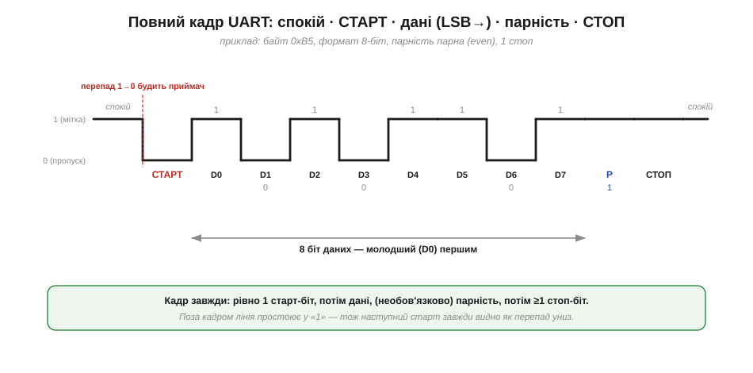
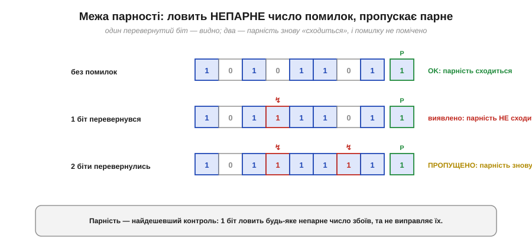

# Кадр UART: старт, дані, парність, стоп

UART — це [асинхронна послідовна лінія](book:communications/async-serial), де приймач не має окремого дроту такту й синхронізується **старт-стопом** наново перед кожним знаком. Розберімо цей знак — **кадр** (*frame*) — по кісточках. Кадр UART — це той **контракт**, який обидві сторони мусять розуміти однаково: де початок, скільки біт даних, у якому вони порядку, чи є контроль помилок, де кінець. Помилитися бодай в одному пункті — і лінія, формально з'єднана, передаватиме саме сміття. Тож пройдімо кадр від спокою до спокою.

### Анатомія кадру: від спокою до спокою

Поки нічого не передається, лінія простоює у стані **«1»** — це **спокій** (*idle*), він же історично **мітка** (*mark*). Сам кадр завжди має ту саму будову: один **старт-біт** (*start bit*, рівень «0»), далі **біти даних** (5–9, типово 8), далі **необов'язковий біт парності** (*parity*), і нарешті щонайменше один **стоп-біт** (*stop bit*, рівень «1»). Після стопа лінія знову у спокої — готова до наступного кадру.


*Рис. Один кадр для байта 0xB5 у форматі 8-біт даних, парна парність, 1 стоп. Спокій («1») → СТАРТ («0») → вісім біт даних (молодший D0 першим) → біт парності P → СТОП («1») → знову спокій. Перепад «1→0» на початку — це і є старт, який будить приймач.*

Чому спокій — саме «1», а не «0»? Це спадок телеграфу (мітка = є струм), і він напрочуд зручний: оскільки лінія у спокої завжди висока, **будь-який** старт-біт виглядає як **перепад униз** — чіткий фронт, який легко зловити (саме його шукає [механізм передискретизації](book:communications/async-serial)). Якби спокій був «0», приймач не відрізнив би початок кадру від простою. Один кадр несе рівно **один знак** — зазвичай один байт.

### Молодший біт першим: LSB-first

Тонкість, яка плутає чи не кожного, хто вперше дивиться на лінію осцилографом: UART передає біти даних **молодшим уперед** (*LSB first* — least significant bit first). Тобто першим у лінію йде **D0** (наймолодший біт байта), а останнім — D7 (найстарший).


*Рис. У пам'яті байт 0xB5 пишуть старшим бітом ліворуч (1011 0101). Але в лінію він іде «задом наперед»: спершу b0, потім b1, … аж до b7. Тому послідовність на дроті (D0…D7) — дзеркальна до запису байта.*

Через це послідовність бітів на екрані логічного аналізатора виглядає **навпаки** до того, як ти звик писати байт (старший зліва). Це не помилка приладу й не збій — це саме **LSB-first**. Коли декодуєш захоплений сигнал руками, читай біти в **порядку прибуття** (D0, D1, …), а тоді перевертай, щоб дістати число; або довірся аналізатору, який зробить це сам.

> 🔧 **Навіщо це.** Переплутати порядок бітів — класична причина «майже правильних» даних: замість 0x41 читаєш 0x82, і нічого не сходиться. Тому, налаштовуючи декодер протоколу в логічному аналізаторі, завжди перевіряй, що він стоїть на **LSB-first** (для UART це майже завжди так). А якщо декодуєш вручну — пам'ятай, що перший біт на дроті наймолодший.

### Скільки біт даних і запис «8N1»

Кількість біт даних у кадрі — налаштовна: від 5 до 9, але на практиці майже завжди **8** (рівно байт). Сім біт використовують для чистого 7-бітного ASCII-тексту, п'ять-шість — хіба що для сумісності зі старою технікою. Усі три параметри кадру — біти даних, парність, стоп-біти — прийнято стискати в короткий код на кшталт **«8N1»**.


*Рис. «8N1» читається так: **8** біт даних, парність **N** (none — немає), **1** стоп-біт. Поряд — інші типові формати: 7E1 для ASCII, 8E1 коли потрібен контроль помилок, 8N2 для трохи більшого запасу. Запис «115200 8N1» повністю описує лінію: швидкість плюс формат кадру.*

Найважливіше тут — усвідомити: збігтися сторонам треба не лише у **baud**, а в **усіх** параметрах кадру одразу. Якщо один пристрій шле 8N1, а інший налаштований на 7E1, вони не порозуміються, навіть якщо швидкість однакова: приймач шукатиме біт парності там, де його нема, і битиме «помилку кадру». Тому повний опис послідовної лінії — це завжди «швидкість + формат», як-от «115200 8N1».

### Біт парності: найдешевший контроль помилок

Необов'язковий **біт парності** — це найдешевший із можливих контролів помилок: лише один додатковий біт на кадр. Він буває **парний** (*even*) або **непарний** (*odd*). Правило просте: біт добирають так, щоб **загальна** кількість одиниць (у даних разом із бітом парності) стала парною (для even) або непарною (для odd).


*Рис. У даних 0xB5 — п'ять одиниць (непарно). Для **парної** парності беремо P = 1, щоб разом вийшло 6 одиниць (парно); для **непарної** — P = 0, щоб лишилося 5 (непарно). Технічно P для even — це просто XOR усіх біт даних.*

Працює це так: передавач рахує одиниці й виставляє P за правилом, а приймач **самостійно** перераховує одиниці у прийнятих даних і звіряє зі здобутим P. Не збіглося — отже, біт десь перевернувся в дорозі, і приймач піднімає прапорець **помилки парності**.

### Що парність ловить, а що ні

У парності є принципова межа, яку треба чітко розуміти, щоб на неї не покладатися надміру. Вона надійно виявляє **будь-яке непарне** число перевернутих біт (один, три, п'ять…), але **повністю пропускає парне** (два, чотири…).


*Рис. Без помилок парність сходиться. Перевернувся **один** біт — число одиниць змінило парність, звірка не сходиться, помилку **виявлено**. Перевернулися **два** біти — парність повернулася до початкової, звірка знову сходиться, і помилку **пропущено**. Один біт парності не бачить парного числа збоїв.*

Отже, парність — це слабкий контроль: вона **виявляє** одиничний збій, але не **виправляє** його, та й двобітну помилку проґавить. Через це її часто взагалі вимикають (**N**), а восьмий біт віддають під дані — звідси й панування «8N1». Для справжньої ж цілісності повідомлення покладаються не на парність окремого байта, а на [контрольну суму](book:communications/checksums) чи [CRC](book:communications/crc) над цілим пакетом.

> 🔧 **Навіщо це.** Сприймай парність як дешевий «детектор диму» на кожен байт, а не як гарантію. Якщо лінія коротка й чиста (плата-плата), її сміливо вимикають заради простоти й швидкості. Якщо ж дані критичні або лінія шумна, надійніше лишити 8N1 для швидкості, але **загорнути дані у власний пакет із CRC** — це впіймає і те, що парність пропускає.

### Стоп-біт і кадри підряд

**Стоп-біт** — це рівень «1» тривалістю щонайменше в один біт у самому кінці кадру. Його роль — **гарантувати**, що лінія повернулася у спокій, перш ніж почнеться наступний кадр. Без нього два знаки підряд могли б злитися, і приймач не побачив би перепаду старту.


*Рис. Угорі — два кадри підряд з одним стоп-бітом: між стопом одного й стартом наступного завжди є перепад «1→0», тож кожен старт видно. Унизу — той самий кадр із двома стоп-бітами: довший проміжок «1» дає приймачеві трохи більший запас між знаками.*

Стоп-біт буває завдовжки **1**, **1.5** або **2** одиниці. Один — стандарт; два (чи півтора, у старій техніці) дають довший проміжок між знаками, а отже трохи більший запас, коли годинники сторін не зовсім збігаються. Суть незмінна: стоп повертає лінію у спокій, і завдяки цьому початок **кожного** наступного кадру — це знову чіткий перепад униз.

### Скільки це коштує: накладні витрати кадру

Підрахуймо ціну надійності. У форматі 8N1 на **8** корисних біт даних припадає ще **2** службові — старт і стоп, разом **10 біт** на кожен байт. Тобто корисними з лінії є лише 80% часу.


*Рис. Для 8N1 кадр — це 10 біт на лінії на 8 біт даних (корисна частка 80%). Звідси час одного байта = 10 / baud, а пропускна здатність — обернена до нього. Біт парності додав би 11-й біт і відняв би ще ≈9% швидкості.*

**Приклад (реальна пропускна здатність лінії).** Порахуймо, скільки байтів за секунду тягне лінія у двох поширених режимах:

```
час байта (8N1) = 10 біт / baud

9600 8N1   : 10 / 9600   ≈ 1.042 мс/байт  →  1 / 0.001042 ≈ 960 байт/с
115200 8N1 : 10 / 115200 ≈ 86.8 мкс/байт  →  1 / 0.0000868 ≈ 11 520 байт/с
```

Зверніть увагу: «9600 бод» — це **не** 9600 байт/с, а лише близько 960, бо кожен байт тягне за собою ще два службові біти. Плутати ці два числа — часта помилка в оцінках.

> 🔧 **Навіщо це.** Ця проста формула дає змогу заздалегідь сказати, чи **влізе** потік у лінію. Скажімо, давач віддає 50 вимірів за секунду по 6 байт — це 300 байт/с, і навіть скромні 9600 8N1 (960 байт/с) мають потрійний запас. А от відеокадр чи щільний лог на сотні кілобайт за секунду по UART уже не пройде — там потрібні мегабодні швидкості або зовсім інша шина. Рахунок «байт = 10 біт» рятує від нездійсненних очікувань ще на етапі вибору інтерфейсу.

Уся ця конструкція кадру тримається на одній мовчазній умові: приймач веде час **власним** годинником і лише приблизно тієї самої частоти, що передавач. Наскільки «приблизно» можна — перш ніж відлік «з'їде» в сусідній біт і кадр розсиплеться? Це питання **допуску на розсинхрон**, і відповідь на нього диктує, наскільки точно мають збігтися [швидкості обох сторін](book:communications/baud-rate).

---
