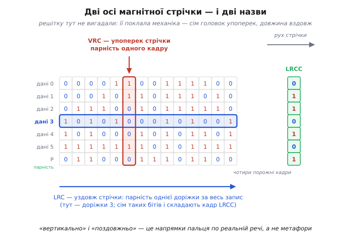
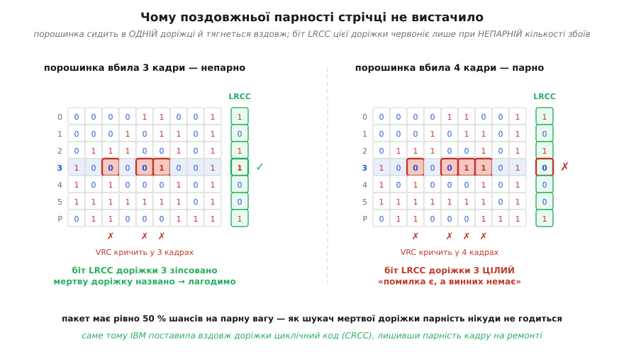
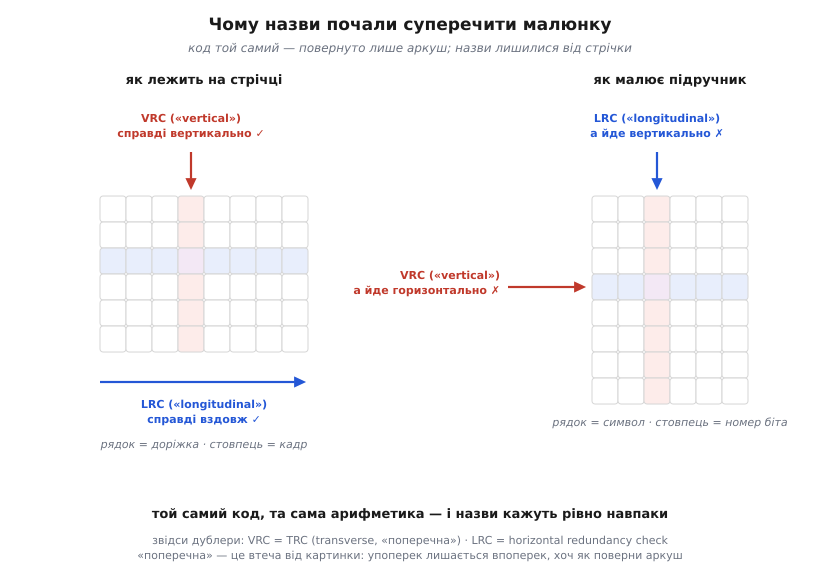

# 📜 VRC і LRC: скорочення, що пахнуть стрічкою

Відкрийте опис будь-якого старого послідовного протоколу — і майже напевно натрапите на пару скорочень: **VRC** і **LRC**, *vertical redundancy check* і *longitudinal redundancy check*. Вертикальна перевірка й поздовжня. А тепер погляньте на сам протокол: пара жил, по яких біти йдуть один за одним у часі. Де тут вертикаль? Що тут «уздовж», а що «впоперек»? У дроту рівно один вимір — час. Обидві назви описують геометрію, якої в об'єкті немає й близько.

Це не недбалість і не жаргон. Це **скам'янілість**. Імена народилися на речі, що справді мала два виміри — і де ці напрямки можна було показати пальцем. Річ ця — півдюймова магнітна стрічка. Коли той самий трюк перенесли на дріт, стрічка лишилася позаду, а назви поїхали далі й застигли, як відбиток мушлі в камені, де давно вже немає моря.

Тож щоб зрозуміти, чому перевірка «вертикальна», доведеться повернутися до стрічки.

## Річ, у якої була ширина

21 травня 1952 року IBM оголосила пристрій **726** — здвоєний накопичувач на магнітній стрічці для машини IBM 701; разом із самою 701 його відвантажували від 20 грудня 1952-го до 28 лютого 1955-го. Стрічка була завширшки півдюйма, і над нею стояла гребінка з **семи** головок: шість писали дані, сьома — парність. Щільність — сто таких стовпчиків на дюйм. (IBM тоді ще не називала шістку бітів символом: у документах вона зветься *copy group*, «група копіювання».)

Ось де ключ до всієї історії. Перфокарта, лінія зв'язку, барабан — усе це, з погляду даних, одновимірне: одна довга черга. А стрічка **широка**. Головки стоять поруч упоперек неї й пишуть **одночасно**. Тому в стрічки є два справжні, фізичні, взаємно перпендикулярні напрямки:

- **упоперек** — сім головок, сім доріжок, зріз стрічки в одну мить; цей зріз називають **кадром**;
- **уздовж** — одна доріжка, що тягнеться під своєю головкою від початку запису до кінця.

Решітку тут ніхто не вигадував — її **можна поміряти лінійкою**. Дані лежать таблицею не тому, що комусь так зручніше малювати, а тому, що так їх поклала механіка: стовпці — це моменти часу, рядки — це головки. Ідея «порахувати парність окремо вздовж кожної осі» на такому об'єкті не потребує винахідника. Вона просто **читається з речі**.

Варто одразу сказати, чого в цій історії немає. Праця Річарда Геммінга «Error Detecting and Error Correcting Codes» (*Bell System Technical Journal*, т. 29, № 2, с. 147–160, квітень 1950) — та сама, з якої відлічують [код Геммінга](book:communications/hamming-code) і всю теорію завадостійкого кодування, — **жодного прямокутного чи двовимірного коду не містить**: там лише систематичні коди з перевірками парності над вибраними позиціями, а з попередників названо лише Голея. Тобто решітка на стрічці не спускалася згори з теорії. Вона піднялася знизу, із заліза.

## Біт, що робив дві роботи

І тут перша несподіванка. Сьома доріжка 726-ї несла парність, і парність була **непарна** — тобто одиниць у кадрі мало бути непарне число. Чому саме непарна, а не парна? Відповідь ховається не в теорії кодів, а у фізиці головки.

Стрічка писалася способом NRZI: намагніченість перевертається **тільки там, де в даних стоїть одиниця**; нуль означає «нічого не роби». Читання ловить не рівень намагніченості, а **перевороти**. А тепер уявіть кадр із самих нулів: жодного перевороту на жодній із семи доріжок. Для читача такий кадр — не дані, а **порожнеча**, рівно те саме, що чиста стрічка між записами. І гірше: механіка не тримає точної швидкості, тож привід не має власного годинника — він відлічує кадри **по самих переворотах**. Смуга нулів — це смуга без такту, і привід просто губить лік.

Непарна парність затикає обидві діри одним рухом. Якщо одиниць у кадрі непарне число, то їх **щонайменше одна** — бо нуль парний. Отже, кожен кадр гарантовано дає хоч один переворот: привід не сліпне й не губить такт.

В описах 726-ї це сформульовано рівно так: непарну парність узято, щоб забезпечити щонайменше один перехід на copy group — **а також** для перевірки помилок. Саме в такому порядку: дві роботи одним бітом, і головна з них навіть не про помилки.

> 🔧 **Навіщо це.** Тут видно, чому [біт парності](book:communications/parity-bit) на стрічці — не чистий об'єкт теорії кодів, а компроміс із залізом. Той самий біт ловить помилку **й** годує тактовий генератор. Тому й домовленість про парність — не питання смаку: змінити odd на even означало б осліпити привід. Коли ці ж скорочення пізніше поїхали на дріт, фізична причина зникла — а домовленість лишилася й почала суперечити іншим таким самим домовленостям. Половина плутанини навколо VRC і LRC виросла саме звідси.

Та вже за півтора року все ускладнилося. 25 вересня 1953-го IBM оголосила привід **727** (для 701 і 702) — теж семидоріжковий, але вже з **двома** домовленостями: двійкові стрічки писалися непарною парністю, а символьні (BCD) — **парною**. Парна парність повертає проблему: кадр із самих нулів знову стає законним словом. Виплутувалися не через парність, а через сам алфавіт — набір символів на стрічці підібрали так, щоб жоден символ не давав порожнього кадру; зокрема цифру «нуль» писали не нулями, а кодом `001010`. Ця деталь добре описана в технічній літературі про формат, хоч і не в первинних оголошеннях IBM — статус: правдоподібно й узгоджено між джерелами, але не з першоджерела.

Мораль лишається: на цьому етапі фізика й перевірка помилок ще нерозплетені. Вони розплетуться пізніше — і саме тоді назви почнуть жити власним життям.

## Vertical: перевірка впоперек

Тепер сама назва — і вона виявиться буквальною.

Стрічка лежить горизонтально й повзе повз гребінку головок. Символ на ній **не лежить**, а **стоїть**: його біти розкладені по семи (згодом дев'яти) доріжках, один поверх одного, поперечним стовпчиком. Щоб перевірити кадр, треба провести пальцем **упоперек стрічки, згори вниз**. Ось вам і «вертикальна» перевірка: **vertical redundancy check** — це парність одного кадру, і живе вона в тій самій сьомій (дев'ятій) доріжці. Слово описує не абстракцію, а напрямок руху пальця по реальній речі.


*Дві осі стрічки — і два імені. Кадр (червоний) — це зріз стрічки в одну мить: шість бітів даних плюс біт парності, разом непарне число одиниць. Доріжка (синя) — тонка смуга намагніченості під однією головкою, що тягнеться весь запис. Перевірити кадр — провести пальцем упоперек; перевірити доріжку — провести вздовж. Наприкінці запису, через чотири порожні кадри, привід дописує кадр LRCC, у якому кожен біт стереже свою доріжку.*

Уся сила й уся слабкість VRC теж від геометрії. Вона бачить **непарне** число збоїв у кадрі; два збої в одному кадрі проґавить. Але зауважте, який це рідкісний випадок саме на стрічці: щоб зіпсувати два біти в одному кадрі, бруд мусить одночасно підлізти під **дві різні головки** в **одну й ту саму** мить. Типова біда стрічки геть інша — і про неї трохи далі.

Варто знати, що в цієї перевірки є друге ім'я — **TRC**, *transverse redundancy check*, «поперечна». Довідники подають його як синонім і уточнюють цікаву річ: слово «transverse» уживають **саме тоді, коли перевірку поєднують із поздовжньою**. Це вже натяк, що комусь у назві «vertical» муляло. Причина з'ясується наприкінці.

## Longitudinal: перевірка вздовж

Друга вісь — доріжка. Вона тягнеться під своєю головкою всю довжину запису: тисячі кадрів, одна головка, одна тонка смуга намагніченості. Парність **уздовж** неї — це XOR усіх бітів, що пройшли під цією головкою від початку запису до кінця. Провести пальцем треба **вздовж стрічки, зліва направо**. Ось і **longitudinal redundancy check**.

Але куди її записати? Одна доріжка дає один біт парності; сім доріжок дають сім бітів — а це рівно **один кадр**. Тож наприкінці запису привід дописує ще один кадр — **LRCC**, *longitudinal redundancy check character*, — у якому кожен біт стереже свою доріжку. Стоїть він не впритул: на семидоріжковій стрічці — через чотири кадри після останнього кадру даних, на дев'ятидоріжковій — через чотири кадри після CRC-символу (про нього далі).

Найгарніше тут те, скільки це коштувало. Приводу не треба було нічого «рахувати» наприкінці: у ньому вже стояв семибітний регістр, у який кожен кадр, пролітаючи під головками, домішувався по XOR. Коли запис кінчався, регістр **уже містив** LRCC — лишалося виштовхнути його на стрічку. Сім тригерів і сім елементів «виключне АБО»; жодного множення, жодної таблиці, жодної затримки. Друга вісь захисту дісталася приводу практично задарма — і саме тому вона з'явилася так рано, задовго до того, як хтось назвав це «двовимірною парністю».

## Дві осі — і адреса

Разом виходить те, заради чого все й затівалося. Довідники формулюють це коротко: поєднання дозволяє приймачеві по поперечній перевірці з'ясувати, **у якому байті** сталася помилка, а по поздовжній — **у якій саме доріжці**. Два незалежні напрямки дають дві координати, а дві координати вказують точку.

Але на стрічці ця схема має особливість, якої не побачиш в акуратному квадратику з підручника: **решітка тут страшенно витягнута**. Запис — це дев'ять доріжок завширшки й тисячі кадрів завдовжки. Одна вісь має дев'ять позицій, друга — тисячі. Асиметрія повна: VRC дає **тисячі** незалежних перевірок, по одній на кадр; LRC — рівно **дев'ять** бітів на весь запис.

І саме через цю асиметрію найважливіша річ у всій історії виглядає зовсім не так, як «виправити один біт».

## Чого насправді боялася стрічка

Магнітна стрічка не перевертає випадковий біт де попало. У неї свої, дуже характерні болячки: порошинка під однією головкою, подряпина вздовж полотна, головка, що ослабла. Помітьте, що спільного в усіх трьох: біда сидить **в одній доріжці** й тягнеться **вздовж** — десятки й сотні кадрів поспіль. Це [пакетна помилка](book:communications/burst-error), покладена рівно вздовж однієї з осей решітки.

Що бачить решітка? Сотні зіпсованих кадрів — сотні VRC кричать. Одна зіпсована доріжка — і серед дев'яти бітів LRCC винен один. Правило «рівно один поганий кадр і рівно одна погана доріжка» тут не спрацьовує геть: поганих кадрів сотні.

І все ж полагодити це можна — причому легко, і навіть краще, ніж один біт. Фокус ось у чому. Хай LRCC назвав винну доріжку — скажімо, третю. Тоді в **кожному** кадрі, де VRC не сходиться, ми знаємо не просто, що помилка є, а й **у якому саме біті кадру** вона сидить: у третьому, бо решта доріжок здорові. А біт, чиє місце відоме, з парності відновлюється однозначно: він дорівнює XOR усіх інших бітів кадру. Отже, знаючи винну доріжку, VRC перебирає кадр за кадром і **перешиває всю мертву доріжку назад**, скільки б сотень кадрів вона не тяглася.

Це і є справжня сила решітки на стрічці — не «виправити один біт», а **воскресити цілу доріжку**. Причина — та сама витягнута геометрія: помилки лягають уздовж однієї осі, а не розсипаються навмання, тож друга вісь бере їх усі за одним номером.

> 🔧 **Навіщо це.** Тут уперше з'являється поділ праці, на якому потім триматиметься половина сучасного кодування: **одне знаряддя знаходить місце, друге латає**. Дороге й розумне відповідає на єдине питання «яка доріжка мертва»; дешеве й тупе — парність кадру — робить усю чорну роботу відновлення. Коли місце помилки відоме наперед, її звуть **стиранням** (erasure), і латати стирання завжди дешевше, ніж шукати помилку наосліп. Саме на цьому стоять і дискові масиви, і [Рід–Соломон](book:communications/reed-solomon) у своїх найпотужніших застосуваннях.

## Де проста парність зламалася

Але тут-таки ховається пастка, через яку історія й зробила крутий поворот.

Уся конструкція тримається на одному припущенні: **LRCC правильно назвав винну доріжку**. А чи назве? Біт LRCC для третьої доріжки — це проста парність усіх бітів цієї доріжки. Він зчервоніє лише тоді, коли в доріжці **непарне** число зіпсованих бітів. Порошинка, що вбила чотири кадри поспіль, дає чотири помилки в одній доріжці — парне число — і біт LRCC для неї лишається **чистим**. Решітка бачить сотні верескливих VRC й дев'ять цілих бітів LRCC: «помилка є, а доріжка ні в чому не винна». Схема не просто мовчить — вона **бреше**, і десь у половині випадків.


*Чому парності вздовж доріжки не вистачило. Ліворуч порошинка вбила три кадри — непарне число, біт LRCC доріжки 3 зіпсовано, мертву доріжку названо, VRC її перешиє. Праворуч та сама порошинка вбила чотири кадри — і біт LRCC цілий, хоч VRC кричать так само гучно. Пакет має рівно половину шансів мати парну вагу, тож проста парність як шукач місця нікуди не годиться.*

Ось де закінчується наївна історія «VRC + LRC = решітка = виправляємо». Для дроту, де помилки поодинокі й випадкові, парності вздовж доріжки цілком вистачає. Для стрічки, де помилка — це майже завжди довгий пакет в одній доріжці, парність як **шукач місця** марна: у пакета рівно 50 % шансів мати парну вагу.

## Чим IBM залатала дірку

Розв'язок з'явився разом із System/360 (1964) і її дев'ятидоріжковою стрічкою — вісім доріжок даних плюс доріжка парності, спершу NRZI на 800 біт/дюйм; першими її дістали приводи серії IBM 2400. Замість того щоб рахувати вздовж доріжки **парність**, привід почав рахувати вздовж неї **циклічний код**.

Момент був підготовлений. 1961 року в *Proceedings of the IRE* (т. 49, № 1, с. 228–235) вийшла праця В. Веслі Петерсона (W. Wesley Peterson) і Д. Т. Брауна (D. T. Brown) «Cyclic Codes for Error Detection» — та сама, з якої відлічують [CRC](book:communications/crc). Її головна властивість — рівно те, чого бракувало: циклічний код ловить **пакет** підряд ідучих помилок цілком, байдуже, парної він ваги чи непарної.

А 1970-го в *IBM Journal of Research and Development* (т. 14, с. 384–389) Д. Т. Браун і Ф. Ф. Селлерс-молодший (F. F. Sellers, Jr.) описали, що з цього вийшло на стрічці. Формулювання їхньої праці варте того, щоб розібрати його по складниках: приводи на 800 біт/дюйм у складі System/360 виправляють **пакети помилок необмеженої довжини в будь-якій одній із дев'яти доріжок**; техніка спирається на **модифікований циклічний код у поєднанні з бітом парності в кожному дев'ятибітному символі**; дев'ять контрольних бітів утворюють контрольний символ наприкінці кожного запису.

Розкладіть це речення — і побачите ту саму решітку, тільки з посиленою однією віссю:

```
поздовжня вісь — уздовж доріжки:
    модифікований циклічний код → CRCC
    роль: НАЗВАТИ мертву доріжку

поперечна вісь — упоперек кадру:
    звичайна парність → VRC
    роль: ВІДНОВИТИ біт у названій доріжці

наслідок:
    пакет будь-якої довжини в ОДНІЙ доріжці  → виправляється
    дві й більше доріжок разом               → запис нечитний
```

Поділ праці лишився недоторканий; замінили тільки шукача. Парність уздовж доріжки **не вміла надійно назвати місце** — і на цій посаді її заступив циклічний код. Парність упоперек кадру вміла все, що від неї було треба, — і лишилася ремонтником.

Показово, що LRCC при цьому **не викинули**: на дев'ятидоріжковій NRZI-стрічці пишуться **обидва** символи — спершу CRCC (через чотири кадри після даних), потім LRCC (ще через чотири). Дешева поздовжня парність лишилася останньою копійчаною перевіркою вже після того, як розумний код зробив свою роботу.

І ще одна деталь, чесна щодо доказів. У списку авторів обох праць — 1961-го й 1970-го — стоїть «D. T. Brown», і обидві вийшли по лінії IBM. Чи це та сама людина, знайдені джерела прямо не кажуть; збіг дуже правдоподібний, але як **підтверджений факт** його подавати не можна.

## Скорочення переїжджають на дріт

1967 року — уже після System/360 — IBM оголосила **Bisync** (BSC, *Binary Synchronous Communications*): символьно-орієнтований напівдуплексний протокол каналу, що заступив старіший STR (*synchronous transmit-receive*) машин попереднього покоління. Задум був такий: одні правила керування лінією для трьох різних кодувань символів — шестибітного Transcode, що дивився назад на старі системи, і двох, що дивилися вперед: USASCII на 128 символів та EBCDIC на 256.

І ось у Bisync ті самі VRC і LRC — тепер на дроті.

Тільки погляньте, що з ними сталося. На дроті **немає ширини**. Немає семи головок, немає кадру, що стоїть упоперек, немає доріжки, що тягнеться вздовж. Символ виходить у лінію бітом за бітом, у часі, як усе інше. Жодного «впоперек» і жодного «вздовж» у природі більше не існує — а імена лишилися ті самі, буква в букву.

Механіка ж перенеслася дослівно. VRC — це біт парності **кожного символу**. LRC — це **один символ** наприкінці блоку, у якому біт номер k є парністю k-х бітів усіх символів блоку. Інженери IBM просто **намалювали блок так, як п'ятнадцять років бачили його на стрічці** — символи стовпчиками, «доріжки» рядками, — і перевірки лишилися на своїх місцях разом із назвами. Стрічки під рукою вже не було; її система координат нікуди не поділася.

## Чому ASCII дістався решітки, а EBCDIC — CRC

Найцікавіше в Bisync — те, що вибір перевірки визначався не теорією кодів, а **бюджетом бітів**.

USASCII — код **семибітний**. Символ їде лінією у восьмибітному слоті, і восьмий біт **вільний**. Кладіть у нього парність символу — і VRC дістається дарма, як побічний продукт того, що ASCII не дорахував до 256. Друга вісь коштує ще один символ на блок — і решітка готова: блокова перевірка ціною **одного** символа.

EBCDIC — код **восьмибітний**. Усі вісім бітів зайняті даними. Класти парність символу **нікуди**. А без VRC немає поперечної осі, немає решітки — лишається брати чесний [CRC](book:communications/crc). Bisync і брав: два символи CRC-16 на блок.

Звідси й уся таблиця блокових перевірок Bisync — вона читається як прямий наслідок цієї арифметики:

```
код                без прозорості   прозорість працює   прозорість є, але вимкнена
──────────────────────────────────────────────────────────────────────────────────
EBCDIC (8 біт)     CRC-16           CRC-16              CRC-16
USASCII (7 біт)    VRC + LRC        CRC-16              VRC + CRC-16
Transcode (6 біт)  CRC-12           CRC-12              CRC-12
```

Тобто решітку взяли **не тому, що вона краща**, а тому, що для семибітного коду вона майже безкоштовна. Щойно бюджет бітів мінявся — решітка зникала, і на її місце ставав циклічний код. Той самий висновок читається і в рядку USASCII: досить було ввімкнути прозорий режим — той, де під даними дозволено весь алфавіт, а керівні символи екрануються префіксом DLE, — як ASCII теж переходив на CRC-16.

Силу перевірок сучасники теж розрізняли: CRC-16 у EBCDIC-варіанті вважали цілком міцним, а CRC-12 у Transcode — помітно слабшим. Решітка з VRC і LRC на таку міць і не претендувала — вона брала іншим: ціною.

## Одне ім'я — дві домовленості

Дрібниця, що коштувала не одну безсонну ніч. У Bisync і VRC, і LRC — **непарні**: біт парності доводить кількість одиниць у символі до непарної, і LRC так само дає непарну парність кожної бітової позиції блоку.

А коли 1978 року ISO стандартизувала цю ж перевірку — **ISO 1155:1978**, «Information processing — Use of longitudinal parity to detect errors in information messages», друге видання, листопад 1978-го, — контрольний символ там означено інакше: сім його бітів є **сумою за модулем 2** відповідних бітових стовпців усіх символів блоку, тобто **парною** парністю.

Той самий термін «LRC», два поважні стандарти, протилежні домовленості. Скорочення в паспорті пристрою не каже, яку з них мали на увазі, — і два бездоганно правильні LRC чудово не сходяться між собою.

Ще одна деталь ISO 1155 варта уваги. Її контрольний символ — це «сім бітів **плюс біт парності**». Тобто сам блоковий контрольний символ теж має власну поперечну парність. У решітці це рівно та сама кутова клітинка — парність парностей, — і вона дожила аж до тексту міжнародного стандарту, через двадцять шість років після 726-ї.

## Плутанина, вбудована в самі назви

Лишилося пояснити, звідки в обох перевірок узялися дублери-синоніми. Довідники подають LRC ще й як **horizontal redundancy check**, а VRC — як **transverse redundancy check**. Навіщо кожній друге ім'я?

Причина в олівці, а не в коді. Поки блок малюють **як стрічку** — доріжки рядками, кадри стовпцями, — назви точні: перевірка символу справді йде вертикально, перевірка доріжки справді горизонтально, тобто вздовж.

Але підручники зв'язку малюють блок **інакше** — так, як зручно читати текст: кожен символ окремим **рядком**, один під одним, а LRC — зайвим рядком унизу. Картинка транспонована. І тепер перевірка символу (VRC) іде по рядку — **горизонтально**, — а далі звучи її «вертикальною». А перевірка бітової позиції (LRC) іде по стовпцю — **вертикально**, — а далі звучи її «поздовжньою». Обидві назви кажуть рівно навпаки до того, що людина бачить перед очима.


*Звідки взялися дублери. Ліворуч — орієнтація стрічки: рядок це доріжка, стовпець це кадр, і обидві назви точні. Праворуч — орієнтація підручника: рядок це символ, стовпець це номер біта. Код той самий, арифметика та сама, повернуто лише аркуш — і «вертикальна» перевірка пішла горизонтально, а «поздовжня» вертикально. Слово «transverse» («поперечна») з'явилося як утеча від картинки: упоперек лишається впоперек, хоч як поверни аркуш.*

Ось звідки другі імена. «Horizontal redundancy check» — це LRC, названий уже з нової картинки. А «transverse» — утеча від картинки взагалі. Недарма довідники прямо зазначають, що це слово беруть саме тоді, коли перевірку ставлять у пару з поздовжньою: у парі плутанина найгостріша, і саме там потрібне ім'я, яке не залежить від того, як хтось повернув малюнок.

## Що лишилося від стрічки

Стрічок з обертовими бобінами вже немає. Bisync давно заступили пакетні протоколи. А скорочення живі: «LRC» досі стоїть у промислових послідовних протоколах — здебільшого як блоковий контрольний символ (BCC), звичайний XOR усіх байтів. Ім'я пережило й об'єкт, що його породив, і протокол, що його розніс, і навіть арифметику, яку воно колись означало.

Тож коли натрапите в чиємусь паспорті на «VRC», варто пам'ятати, що ви дивитеся на тінь. Тінь півдюймової стрічки, що повзе повз гребінку з семи головок; тінь кадру, який стоїть упоперек, і доріжки, що тягнеться вздовж. Тієї речі немає вже пів століття — а її система координат досі диктує, як ми звемо дві найдешевші перевірки в техніці.
