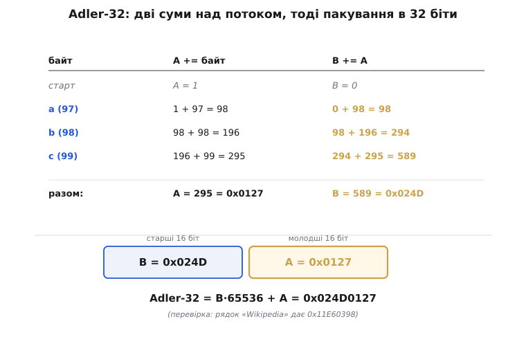
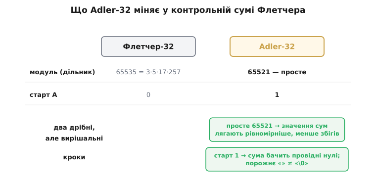
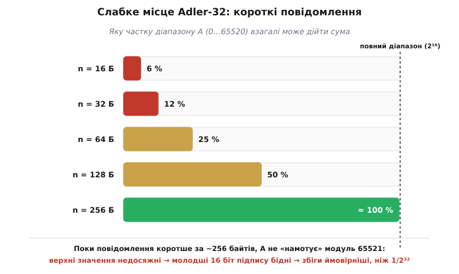

# Adler-32

<preknowlist>
- [Контрольні суми](topic:communications/checksums) — проста сума байтів і пара сум Флетчера, що зважує байт за позицією; Adler-32 виростає саме з цієї ідеї й доводить її до промислового вигляду.
</preknowlist>

Контрольна сума Флетчера показала гарну річ: за дві звичайні суми, де друга накопичує першу, можна дешево спіймати навіть перестановку байтів і майже дотягтися до сили [CRC](topic:communications/crc). Природне продовження думки — узяти цей трюк і зробити з нього надійний **32-бітний** підпис, який годиться для справжніх даних, а не для навчального прикладу. Саме це й є **Adler-32**.

Народилася вона з дуже конкретної потреби. Коли ви стискаєте потік даних, процесор уже й так зайнятий важкою роботою — пошуком повторів, кодуванням. Печатка цілісності, яку чіпляють у кінець, має бути майже **безкоштовною**, інакше вона з'їсть виграш від стиснення. Звична сторожа, CRC-32, коштує на кожен байт або табличний пошук, або ділення многочлена — небагато, але для гарячого шляху компресора відчутно. Марк Адлер (Mark Adler), американський програміст, пишучи 1995 року бібліотеку стиснення zlib, хотів ту саму 32-бітну сітку захисту за куди меншу ціну — і повернувся до двосумного трюку Флетчера, підкрутив у ньому дві дрібниці й дістав Adler-32: жодних таблиць, самі додавання, і працює блискавично. [Як zlib підштовхнула Adler-32 — і чим це згодом обернулося](topic:communications/adler-32/hist-adler-zlib.md) — окрема історія з несподіваним поворотом.

### Дві суми, тоді склеювання

Механізм тримається на двох біжучих числах, `A` і `B`. Ідемо по байтах повідомлення й на кожному кроці робимо дві прості речі:

- `A` **додає сам байт** — це звичайна сума значень.
- `B` **додає поточне значення `A`** — це той самий позиційний трюк Флетчера: ранній байт устигає влитися в `B` на кожному з наступних кроків, тож його вага більша.

Обидві суми тримаємо за модулем **65521**, тобто після кожного додавання лишаємо тільки остачу від ділення на 65521. `A` стартує з **1**, `B` — з **0**. Наприкінці два числа склеюють в одне: `B` іде у старші 16 бітів, `A` — у молодші.

:::tabs
```c
#include <stdint.h>
#include <stddef.h>

#define MOD 65521

uint32_t adler32(const uint8_t *data, size_t len) {
    uint32_t a = 1, b = 0;
    for (size_t i = 0; i < len; i++) {
        a = (a + data[i]) % MOD;   // сума байтів
        b = (b + a)       % MOD;   // сума значень A — зважує байт позицією
    }
    return (b << 16) | a;          // B у старші 16 біт, A — у молодші
}
```
```python
def adler32(data: bytes) -> int:
    a, b = 1, 0
    for d in data:
        a = (a + d) % 65521        # сума байтів
        b = (b + a) % 65521        # сума значень A — зважує байт позицією
    return (b << 16) | a           # B у старші 16 біт, A — у молодші
```
:::


*A починається з 1 і збирає значення байтів; B на кожному кроці доливає поточне A, тому враховує й порядок. Наприкінці A стає молодшими 16 бітами, B — старшими, і виходить одне 32-бітне число `B·65536 + A`. У короткому прикладі обидві суми лишаються далеко нижче за 65521 — модуль тут навіть не спрацьовує, і це вже натяк на майбутнє слабке місце.*

Пройдімо ці кроки руками на трьох байтах — рядку `abc` (коди 97, 98, 99):

```
старт:    A = 1        B = 0
'a' (97): A = 1+97   = 98     B = 0+98    = 98
'b' (98): A = 98+98  = 196    B = 98+196  = 294
'c' (99): A = 196+99 = 295    B = 294+295 = 589

A = 295 = 0x0127
B = 589 = 0x024D
Adler-32 = (589 << 16) | 295 = 0x024D0127
```

Хочете більший орієнтир для звірки — рядок `Wikipedia` дає `A = 920`, `B = 4582`, тобто `0x11E60398`. Той самий цикл, ті самі два додавання на байт.

### Дві дрібниці, що відрізняють Adler від Флетчера

На перший погляд це майже дослівно Флетчер, тільки ширший. Уся хитрість — у двох дрібних, але свідомих змінах, і кожна закриває свою діру.

**Старт `A = 1`, а не 0.** Якби `A` починалася з нуля, байт зі значенням 0 не змінював би нічого: `A` лишалася б нулем, а `B` доливала б той самий нуль. Провідні нулі даних були б невидимі, а порожнє повідомлення й ланцюжок самих нулів давали б однаковий підпис. Одиниця на старті це прибирає: тепер кожен крок доливає в `B` щонайменше 1, тож `B` тихцем **рахує байти**. Порожнє повідомлення дає `0x00000001`, один нульовий байт — `0x00010001`, два — `0x00020001`. Підписи розходяться. Одне слово в коді — і ціла родина спотворень стає видимою.

**Модуль 65521, а не 65535.** Флетчер-32 бере остачу за модулем 65535, тобто 2¹⁶ − 1 — гарне кругле число. Adler бере 65521 — **найбільше просте число, менше за 2¹⁶**. Навіщо відмовлятися від круглого? Бо 65535 розкладається на множники (65535 = 3·5·17·257), а щойно модуль ділить якийсь регулярний візерунок у даних, цілі родини різниць взаємно гасяться й лягають на ту саму суму — з'являються сліпі плями. У простого числа дільників немає, тож суми лягають рівномірніше по всіх остачах, і збіги рідшають. Це та сама причина, яку [арифметика контрольної суми](topic:communications/checksums/math-checksum-arithmetic.md) виводить у загальному вигляді: непарний, а надто простий модуль звужує сліпі плями.


*Два дрібні кроки з великими наслідками. Просте 65521 розсіює значення сум рівномірніше, ніж складене 65535, — менше збігів. Старт `A = 1` робить суму чутливою до провідних нулів і відрізняє порожні дані від рядка нулів.*

### Чому вона така швидка

Уся привабливість Adler-32 — у ціні. Це **тільки додавання**: жодних таблиць, жодного побітового ділення многочлена, як у CRC. А два прийоми роблять її ще дешевшою. По-перше, остачу за модулем 65521 **не** беруть на кожному байті — це найдорожча операція в циклі. Замість цього `A` і `B` нарощують у ширшому регістрі й зводять за модулем лише зрідка, приблизно раз на кілька тисяч байтів, поки суми гарантовано не переповнять 32-бітне число. Ділення розноситься на весь блок і майже зникає. По-друге, звичайне додавання чудово векторизується: SIMD-блок процесора складає цілу пачку байтів за одну інструкцію, тоді як CRC із його табличним пошуком і залежністю за даними так не розігнати. [Adler-32 у коді: наївна версія, відкладений модуль і чому саме 5552](topic:communications/adler-32/proj-adler32-in-code.md) розбирає ці трюки з робочим кодом.

> 🔧 **Навіщо це.** Adler-32 живе там, де перевірка цілісності має бути майже безкоштовною поряд із важчою роботою, — усередині стиснення. Бібліотека zlib пакує потік і припечатує його Adler-32; ту саму печатку носить у собі кожен PNG-файл. Практичне правило просте: для довгих потоків, де компресор уже й так крутиться, Adler-32 дає 32-бітну сітку майже задарма; але для коротких незалежних пакетів беріть [CRC](topic:communications/crc) (у багатьох мікроконтролерах він апаратний) — на коротких даних Adler слабкий, і ось чому.

### Слабке місце: короткі повідомлення

Тепер про чесну межу. Погляньмо знову на `abc`: `A` і `B` навіть близько не підійшли до 65521, тож модуль не спрацював, а верхівка числового діапазону лишилася незайманою. Це не примха трибайтового прикладу — так буде з **будь-яким** коротким повідомленням. `A` росте щонайбільше на 255 за байт, тож після `n` байтів `A ≤ 1 + 255·n`. Щоб `A` бодай дотягнулася до 65521, потрібно близько 257 байтів. Поки повідомлення коротше, `A` фізично не може набути своїх вищих значень — ціла смуга молодших 16 бітів підпису **ніколи не трапляється**, а ті значення, що трапляються, лягають нерівномірно.


*Частка діапазону `A`, яку взагалі може дійти сума, залежно від довжини повідомлення. На 16 байтах це якихось 6 %, на 128 — половина, і тільки біля 256 байтів `A` починає намотувати модуль і використовувати весь діапазон. Доти 32-бітний підпис фактично вужчий за 32 біти, тож короткі повідомлення збігаються частіше, ніж «одне на 4 мільярди».*

Виходить, що для коротких даних 32-бітна сітка Adler-32 насправді набагато рідша, ніж обіцяє її ширина, і два різні короткі повідомлення зіштовхуються в одному підписі частіше, ніж дало б справжнє 32-бітне число. Це не фольклор: Джонатан Стоун із колегами виміряв ефект близько 2001 року, і в нього виявилися зуби. Коли стандартизували транспортний протокол SCTP, його автори **відмовилися** від Adler-32 саме через це й наказали брати натомість CRC-32C (RFC 3309). Урок гострий: Adler-32 сяє на великих потокових даних, для яких її й придумали, і є поганим вибором для коротких незалежних пакетів.

### Де вона живе

Adler-32 — це хвіст кожного zlib-потоку (RFC 1950): два байти заголовка, стиснені DEFLATE дані, а тоді чотири байти Adler-32 від **нестиснених** даних як наскрізна печатка цілісності. Оскільки PNG зберігає піксельні дані саме як zlib-потоки, кожен PNG носить Adler-32 усередині (власна поблокова сторожа PNG — окрема, це CRC-32). Цікаво, що gzip, теж робота Адлера, припечатує вже CRC-32, а не Adler-32, — різні формати, різний вибір. А rsync використовує **ковзний** різновид: оскільки `A` і `B` — прості суми, вікно можна ковзати по файлу, додаючи байт, що входить, і віднімаючи той, що виходить, і оновлювати підпис за сталу кількість дій — саме те, чого потребує ковзний відбиток.

---

Отже, Adler-32 — це підрослий і підкручений Флетчер: дві біжучі суми, де друга накопичує першу, узяті за **простим** модулем 65521 і з `A`, що стартує з **1**, а тоді склеєні в одне 32-бітне число `B·65536 + A`. Просте число розсіює значення рівномірніше, ніж складене 65535 у Флетчера; одиниця на старті ловить провідні нулі. Уся сила Adler-32 — у **швидкості**: самі додавання, відкладений модуль, легка векторизація, тож печатка цілісності майже нічого не коштує поряд зі стисненням — тому вона й сидить у zlib, у PNG, у ковзному відбитку rsync. Ціна цієї дешевизни — **короткі повідомлення**: поки даних менш ніж за пару сотень байтів, суми не намотують модуль, підпис фактично вужчає, і збіги стають імовірнішими; для таких випадків (як-от пакети SCTP) світ повернувся до [CRC](topic:communications/crc).
